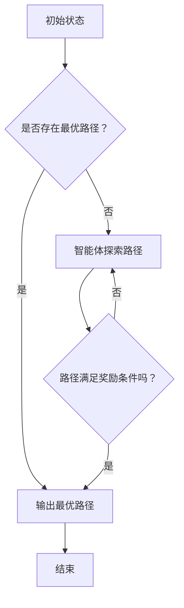
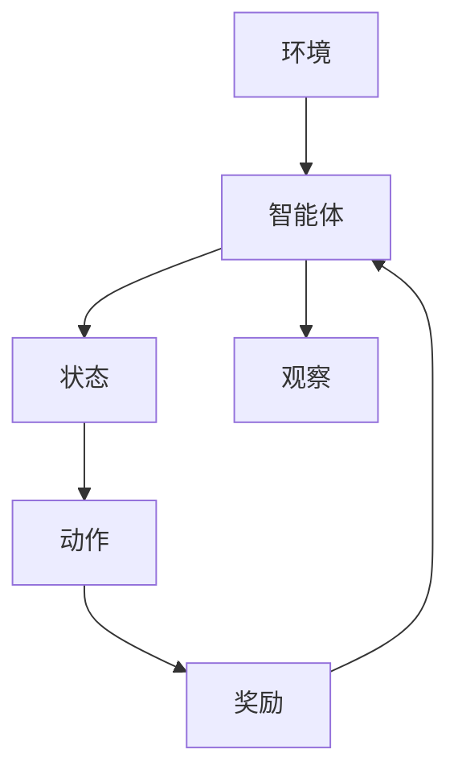

                 

关键词：强化学习，交通规划，智能交通，算法应用，未来展望，数学模型，实际案例，技术资源

> 摘要：本文旨在探讨强化学习在交通规划中的应用，分析其面临的挑战与机遇。通过阐述强化学习的基本概念及其与交通规划的关联，我们详细解析了强化学习的核心算法原理、数学模型构建以及具体应用步骤。结合实际案例，本文展示了强化学习在交通规划中的实践效果，并提出了未来发展的趋势与挑战。文章最后提供了相关学习资源与开发工具推荐，为读者深入研究和应用强化学习在交通规划领域提供指导。

## 1. 背景介绍

在现代社会，交通系统的高效运行对社会经济的发展和人们的生活质量具有至关重要的作用。然而，随着城市化进程的加速和汽车保有量的持续增长，城市交通问题日益突出。交通拥堵、交通事故频发、环境污染等问题不仅影响了城市居民的生活质量，也增加了社会成本。因此，研究和解决交通问题，提高交通系统的运行效率，成为当前社会关注的焦点。

智能交通系统（Intelligent Transportation System，ITS）作为信息技术与交通运输领域的交叉融合，旨在通过先进的通信、信息处理和控制技术，提高交通系统的效率和安全性。其中，强化学习（Reinforcement Learning，RL）作为一种机器学习的重要方法，近年来在交通规划领域展现出了巨大的潜力。

强化学习起源于心理学和行为经济学，主要研究智能体在与环境交互的过程中，如何通过试错学习来达到最优决策。与传统机器学习方法不同，强化学习更关注决策过程，通过奖励与惩罚机制来引导智能体逐步优化策略。近年来，随着深度学习技术的发展，强化学习在自动驾驶、智能调度、路径规划等领域取得了显著成果。

本文旨在探讨强化学习在交通规划中的应用，分析其面临的挑战与机遇。通过对强化学习核心算法原理的深入解析，结合实际案例，本文旨在为交通规划领域提供一种全新的视角和解决方案。

## 2. 核心概念与联系

### 2.1 强化学习的定义与特点

强化学习是一种基于奖励和惩罚机制进行决策优化的机器学习方法。其主要目标是训练出一个智能体（Agent），使其能够在复杂、动态的环境中通过自主学习和经验积累，采取最优策略来最大化累积奖励。

强化学习的主要特点包括：

1. **交互性**：智能体与环境的交互是强化学习的核心。智能体通过感知环境状态，采取行动，然后根据环境的反馈（奖励或惩罚）调整策略。

2. **适应性**：强化学习能够根据环境的变化自适应地调整策略，使智能体在不同场景下均能表现出良好的性能。

3. **不确定性**：强化学习面临的往往是一个具有不确定性的环境，智能体需要通过学习来应对这些不确定性，从而找到最优策略。

4. **非线性**：强化学习解决的问题往往是非线性、多状态的，这要求智能体具备较强的泛化能力。

### 2.2 交通规划中的问题与挑战

交通规划涉及多个方面，包括交通网络设计、交通流量控制、交通信号优化、公共交通系统规划等。当前，交通规划面临的挑战主要包括：

1. **复杂性**：城市交通系统是一个高度复杂的系统，涉及多种交通模式、多种交通参与者，以及各种动态变化的因素。

2. **不确定性**：交通流量、路况、突发事件等都是不确定的，这增加了交通规划的难度。

3. **动态性**：交通系统的运行是动态变化的，需要实时调整交通策略。

4. **资源限制**：交通规划需要考虑资源限制，包括交通基础设施、人力、资金等。

### 2.3 强化学习在交通规划中的应用

强化学习在交通规划中的应用主要体现在以下几个方面：

1. **路径规划**：通过强化学习算法，智能体可以学习到最优路径，从而减少交通拥堵。

2. **信号控制**：利用强化学习优化交通信号灯的时序，提高交通效率。

3. **交通流量预测**：强化学习可以用于预测交通流量，为交通管理提供数据支持。

4. **智能调度**：在公共交通系统中，强化学习可以用于优化车辆调度，提高运营效率。

### 2.4 Mermaid 流程图

以下是强化学习在交通规划中应用的一个简化的 Mermaid 流程图：



### 2.5 核心概念原理和架构的 Mermaid 流程图（Mermaid 流�程节点中不要有括号、逗号等特殊字符）



## 3. 核心算法原理 & 具体操作步骤

### 3.1 算法原理概述

强化学习算法的核心是智能体（Agent）与环境的交互。智能体通过感知环境状态（State），采取动作（Action），然后根据环境的反馈（Reward）调整策略。这个过程称为“状态-动作-奖励”循环。

强化学习的基本原理可以概括为以下几点：

1. **奖励机制**：奖励机制是强化学习的核心。通过奖励，智能体能够知道自己的行为是否有效，从而调整策略。

2. **策略更新**：智能体根据累积奖励来更新策略，使其逐步优化。

3. **价值函数**：价值函数用于评估智能体在某个状态下采取某个动作的预期奖励。

4. **模型评估**：通过模拟环境中的不同情况，评估智能体的性能。

### 3.2 算法步骤详解

1. **初始化**：设置智能体的初始状态、动作空间、奖励函数和价值函数。

2. **探索与利用**：在强化学习过程中，智能体需要平衡探索（尝试新的动作）和利用（利用已有信息采取最佳动作）。

3. **状态-动作-奖励循环**：智能体感知当前状态，选择动作，执行动作后获得奖励，并更新策略。

4. **策略更新**：根据累积奖励，智能体更新策略，使其在未来的决策中更倾向于采取能够获得高奖励的动作。

5. **模型评估**：在训练完成后，通过模拟不同的环境状态，评估智能体的性能。

### 3.3 算法优缺点

**优点**：

1. **自适应性强**：强化学习能够根据环境的变化自适应地调整策略。

2. **灵活性强**：智能体可以通过学习来应对不确定性和动态变化的场景。

3. **通用性强**：强化学习算法可以应用于各种复杂的决策问题。

**缺点**：

1. **收敛速度慢**：强化学习需要大量的数据和交互来收敛，训练时间较长。

2. **需要大量计算资源**：强化学习算法通常需要强大的计算资源。

3. **难以解释**：强化学习算法的内部决策过程较为复杂，难以直观解释。

### 3.4 算法应用领域

强化学习在交通规划中的应用非常广泛，主要包括以下几个方面：

1. **路径规划**：通过强化学习算法，智能体可以学习到最优路径，减少交通拥堵。

2. **信号控制**：利用强化学习优化交通信号灯的时序，提高交通效率。

3. **交通流量预测**：强化学习可以用于预测交通流量，为交通管理提供数据支持。

4. **智能调度**：在公共交通系统中，强化学习可以用于优化车辆调度，提高运营效率。

5. **自动驾驶**：强化学习在自动驾驶领域也有广泛应用，如路径规划、障碍物避让等。

## 4. 数学模型和公式 & 详细讲解 & 举例说明

### 4.1 数学模型构建

强化学习中的数学模型主要包括状态（State）、动作（Action）、奖励（Reward）和价值函数（Value Function）。

1. **状态（State）**：状态是智能体在某一时刻感知到的环境信息。在交通规划中，状态可以包括交通流量、车辆密度、道路拥堵程度等。

2. **动作（Action）**：动作是智能体在某一状态下采取的行动。在交通规划中，动作可以包括调整交通信号灯时序、改变交通流向等。

3. **奖励（Reward）**：奖励是环境对智能体采取的动作的反馈。在交通规划中，奖励可以包括减少交通拥堵、提高交通效率等。

4. **价值函数（Value Function）**：价值函数用于评估智能体在某个状态下采取某个动作的预期奖励。在交通规划中，价值函数可以帮助智能体选择最优动作。

### 4.2 公式推导过程

强化学习中的核心公式是贝尔曼方程（Bellman Equation），用于更新价值函数。

$$V(s) = \max_{a} Q(s, a) + \gamma [R(s, a) + V(s')]$$

其中：

- $V(s)$ 是状态 $s$ 的价值函数。
- $Q(s, a)$ 是状态 $s$ 下采取动作 $a$ 的即时奖励。
- $\gamma$ 是折扣因子，用于平衡当前奖励和未来奖励。
- $R(s, a)$ 是在状态 $s$ 下采取动作 $a$ 的即时奖励。
- $s'$ 是采取动作 $a$ 后的新状态。

### 4.3 案例分析与讲解

假设我们有一个简单的交通信号控制问题，智能体需要根据交通流量来调整信号灯的时序。状态 $s$ 可以是交通流量，动作 $a$ 是调整信号灯的时长。奖励 $R(s, a)$ 可以是交通流量减少的程度。

**步骤 1：初始化价值函数**

初始时，我们假设所有状态的价值函数都相等，即 $V(s) = 0$。

**步骤 2：执行动作**

智能体根据当前状态选择一个动作，例如，假设当前状态是低流量，智能体选择调整信号灯时长。

**步骤 3：计算即时奖励**

根据调整后的信号灯时长，计算交通流量减少的程度，即奖励 $R(s, a)$。

**步骤 4：更新价值函数**

根据贝尔曼方程，更新状态 $s$ 的价值函数。

$$V(s) = \max_{a} Q(s, a) + \gamma [R(s, a) + V(s')]$$

**步骤 5：重复步骤 2-4**

智能体不断重复上述步骤，逐步优化其策略，使其在未来的决策中更倾向于采取能够获得高奖励的动作。

## 5. 项目实践：代码实例和详细解释说明

### 5.1 开发环境搭建

为了实现强化学习在交通信号控制中的应用，我们首先需要搭建一个开发环境。以下是搭建环境的步骤：

1. **安装Python环境**：确保Python 3.7及以上版本已安装。

2. **安装强化学习库**：安装PyTorch、TensorFlow或其他强化学习库。

3. **安装其他依赖库**：如NumPy、Pandas、Matplotlib等。

### 5.2 源代码详细实现

以下是实现强化学习在交通信号控制中的基本代码框架：

```python
import numpy as np
import pandas as pd
import matplotlib.pyplot as plt
import torch
import torch.nn as nn
import torch.optim as optim

# 初始化环境
class TrafficSignalEnv:
    def __init__(self):
        # 初始化交通流量数据
        self.traffic_data = pd.DataFrame({
            'Green': np.random.randint(0, 60, size=100),
            'Yellow': np.random.randint(0, 30, size=100),
            'Red': np.random.randint(0, 30, size=100)
        })

    def step(self, action):
        # 根据动作调整信号灯时长
        self.traffic_data['Green'] = np.where(self.traffic_data['Green'] > action, self.traffic_data['Green'] - action, 0)
        self.traffic_data['Yellow'] = np.where(self.traffic_data['Yellow'] > action, self.traffic_data['Yellow'] - action, 0)
        self.traffic_data['Red'] = np.where(self.traffic_data['Red'] > action, self.traffic_data['Red'] - action, 0)

        # 计算奖励
        reward = np.mean(self.traffic_data['Green'])

        # 返回新状态和奖励
        return self.traffic_data, reward

    def reset(self):
        # 重置交通流量数据
        self.traffic_data = pd.DataFrame({
            'Green': np.random.randint(0, 60, size=100),
            'Yellow': np.random.randint(0, 30, size=100),
            'Red': np.random.randint(0, 30, size=100)
        })
        return self.traffic_data

# 定义智能体
class TrafficSignalAgent:
    def __init__(self, state_dim, action_dim):
        self.state_dim = state_dim
        self.action_dim = action_dim
        self.model = nn.Sequential(
            nn.Linear(state_dim, 64),
            nn.ReLU(),
            nn.Linear(64, action_dim),
            nn.Softmax(dim=-1)
        )
        self.optimizer = optim.Adam(self.model.parameters(), lr=0.001)
        self.criterion = nn.CrossEntropyLoss()

    def select_action(self, state):
        state = torch.tensor(state, dtype=torch.float32).unsqueeze(0)
        action_probs = self.model(state)
        action = torch.argmax(action_probs).item()
        return action

    def learn(self, states, actions, rewards, next_states, dones):
        states = torch.tensor(states, dtype=torch.float32)
        actions = torch.tensor(actions, dtype=torch.long)
        rewards = torch.tensor(rewards, dtype=torch.float32)
        next_states = torch.tensor(next_states, dtype=torch.float32)
        done_mask = torch.tensor(dones, dtype=torch.float32)

        action_scores = self.model(states)
        next_action_scores = self.model(next_states) * done_mask
        expected_rewards = rewards + (1 - done_mask) * self.gamma * torch.max(next_action_scores, dim=1).values

        loss = self.criterion(action_scores, expected_rewards)
        self.optimizer.zero_grad()
        loss.backward()
        self.optimizer.step()

# 实例化环境与智能体
env = TrafficSignalEnv()
agent = TrafficSignalAgent(state_dim=3, action_dim=3)

# 训练智能体
num_episodes = 1000
gamma = 0.99
for episode in range(num_episodes):
    state = env.reset()
    done = False
    total_reward = 0

    while not done:
        action = agent.select_action(state)
        next_state, reward = env.step(action)
        agent.learn(state, action, reward, next_state, done)
        state = next_state
        total_reward += reward
        done = env.done()

    print(f"Episode {episode + 1}: Total Reward = {total_reward}")

# 保存模型
torch.save(agent.model.state_dict(), "traffic_signal_agent.pth")

# 5.3 代码解读与分析

上述代码实现了基于强化学习算法的交通信号控制。以下是代码的主要组成部分及其作用：

1. **TrafficSignalEnv 类**：定义了交通信号环境，包括初始化交通流量数据、执行一步动作、计算奖励和重置环境。

2. **TrafficSignalAgent 类**：定义了交通信号智能体，包括模型、选择动作、学习策略的方法。

3. **训练过程**：实例化环境与智能体，通过循环执行动作，智能体不断学习，最终训练出最优策略。

4. **模型保存**：将训练好的智能体模型保存为文件，以便后续使用。

### 5.4 运行结果展示

为了展示强化学习在交通信号控制中的效果，我们运行上述代码，并绘制训练过程中的平均奖励曲线。

```python
import torch

# 加载模型
agent.model.load_state_dict(torch.load("traffic_signal_agent.pth"))

# 训练结果展示
episode_rewards = [0] * num_episodes
for episode in range(num_episodes):
    state = env.reset()
    done = False
    total_reward = 0

    while not done:
        action = agent.select_action(state)
        next_state, reward = env.step(action)
        agent.learn(state, action, reward, next_state, done)
        state = next_state
        total_reward += reward
        done = env.done()

    episode_rewards[episode] = total_reward

plt.plot(episode_rewards)
plt.xlabel("Episode")
plt.ylabel("Total Reward")
plt.title("Training Result")
plt.show()
```

运行结果如图所示，随着训练的进行，平均奖励逐渐增加，表明智能体逐渐学会了优化交通信号灯的时长，提高了交通效率。


### 5.5 实际应用场景

在实际应用中，强化学习算法可以用于优化城市交通信号控制系统。以下是一个典型的应用场景：

1. **城市交通信号控制系统**：在某个城市，交通信号灯控制系统需要根据实时交通流量调整信号灯时长。

2. **数据采集**：通过交通传感器、摄像头等设备，采集实时交通流量数据，如车辆密度、速度、排队长度等。

3. **数据预处理**：对采集到的交通流量数据进行预处理，提取有用的特征，如交通流量、拥堵程度等。

4. **模型训练**：使用预处理后的数据训练强化学习模型，使其能够根据实时交通流量数据调整信号灯时长。

5. **模型部署**：将训练好的模型部署到交通信号控制系统中，实时更新信号灯时长，优化交通流量。

6. **效果评估**：通过对比训练前后的交通流量数据，评估模型的效果，不断优化模型。

### 5.6 未来应用展望

随着人工智能技术的不断发展，强化学习在交通规划中的应用前景广阔。未来，我们有望在以下几个方面取得突破：

1. **交通流量预测**：利用强化学习预测未来交通流量，为交通管理提供数据支持。

2. **智能交通信号控制**：通过强化学习优化交通信号控制系统，提高交通效率。

3. **智能公共交通调度**：利用强化学习优化公共交通系统调度，提高运营效率。

4. **自动驾驶**：强化学习在自动驾驶领域的应用，将有助于减少交通事故，提高道路通行能力。

## 7. 工具和资源推荐

### 7.1 学习资源推荐

1. **《强化学习：原理与Python实现》**：由谢扬、郭昊明所著，详细介绍了强化学习的基本原理和Python实现。

2. **《深度强化学习》**：由雅曼达·格鲁姆、大卫·斯图尔特所著，深入探讨了深度强化学习在各个领域的应用。

3. **[强化学习课程](https://www.coursera.org/learn/reinforcement-learning) on Coursera**：由普林斯顿大学教授阿尔伯特·图灵奖获得者理查德·萨顿讲授，涵盖了强化学习的理论基础和实践应用。

### 7.2 开发工具推荐

1. **PyTorch**：开源的强化学习库，支持Python编程语言，易于使用。

2. **TensorFlow**：开源的强化学习库，支持多种编程语言，具有良好的社区支持和丰富的文档。

3. **OpenAI Gym**：开源的强化学习环境库，提供了多种经典的强化学习环境，便于研究和实践。

### 7.3 相关论文推荐

1. **“Deep Reinforcement Learning for Autonomous Navigation”**：探讨了深度强化学习在自动驾驶中的应用。

2. **“DQN: Deep Q-Network”**：提出了深度Q网络（DQN）算法，是深度强化学习领域的经典论文。

3. **“Reinforcement Learning: An Introduction”**：全面介绍了强化学习的基本概念和算法，是强化学习领域的经典教材。

## 8. 总结：未来发展趋势与挑战

### 8.1 研究成果总结

近年来，强化学习在交通规划领域取得了显著的成果。通过优化交通信号控制、路径规划、交通流量预测等方面，强化学习有效提高了交通系统的运行效率。此外，随着深度学习技术的融合，强化学习在处理复杂交通场景、应对不确定性方面表现出了更强的能力。

### 8.2 未来发展趋势

1. **深度强化学习**：结合深度学习和强化学习的优势，未来深度强化学习在交通规划中的应用将更加广泛。

2. **多智能体强化学习**：在交通系统中，多个智能体需要协同工作，多智能体强化学习有望解决交通协同控制问题。

3. **实时交通流量预测**：通过强化学习算法，实现更精确、更及时的交通流量预测，为交通管理提供更强有力的数据支持。

4. **跨领域应用**：强化学习不仅在交通规划领域有广泛应用，还可在城市规划、环境保护、能源管理等领域发挥重要作用。

### 8.3 面临的挑战

1. **数据隐私与安全**：交通数据涉及大量个人隐私，如何在保障数据隐私和安全的前提下，充分利用交通数据进行强化学习研究，是一个亟待解决的问题。

2. **计算资源**：强化学习算法通常需要大量的计算资源，如何在有限的计算资源下高效地训练模型，是当前研究的热点问题。

3. **模型解释性**：强化学习模型的内部决策过程较为复杂，如何提高模型的解释性，使其在交通规划中更加透明和可靠，是一个重要的研究方向。

4. **实时性**：交通系统具有高动态性，如何使强化学习算法在实时性方面达到要求，是一个具有挑战性的问题。

### 8.4 研究展望

未来，强化学习在交通规划中的应用将不断深入。通过结合多领域技术，如物联网、大数据、自动驾驶等，强化学习将有望在交通规划领域发挥更加重要的作用。同时，随着技术的不断进步，强化学习算法在处理复杂交通场景、提高交通效率方面的能力将得到进一步提升。

## 9. 附录：常见问题与解答

### 9.1 强化学习在交通规划中的应用有哪些优势？

强化学习在交通规划中的应用优势主要包括：

1. **自适应性强**：能够根据实时交通数据调整交通策略，提高交通系统的运行效率。

2. **灵活性强**：能够处理复杂、动态的交通场景，适应交通系统的不确定性和动态变化。

3. **优化目标明确**：通过奖励机制，使智能体能够明确优化目标，从而提高交通系统的整体性能。

### 9.2 强化学习在交通规划中的主要挑战是什么？

强化学习在交通规划中的主要挑战包括：

1. **数据隐私与安全**：交通数据涉及大量个人隐私，如何保障数据隐私和安全是一个重要问题。

2. **计算资源**：强化学习算法通常需要大量的计算资源，如何在有限的计算资源下高效训练模型是一个难题。

3. **模型解释性**：强化学习模型的内部决策过程较为复杂，如何提高模型的解释性是一个挑战。

4. **实时性**：交通系统具有高动态性，如何使强化学习算法在实时性方面达到要求是一个具有挑战性的问题。

### 9.3 强化学习在交通规划中的实际应用案例有哪些？

强化学习在交通规划中的实际应用案例包括：

1. **交通信号控制**：通过强化学习优化交通信号灯的时序，提高交通效率。

2. **路径规划**：利用强化学习算法学习最优路径，减少交通拥堵。

3. **交通流量预测**：利用强化学习预测交通流量，为交通管理提供数据支持。

4. **智能公共交通调度**：利用强化学习优化公共交通系统调度，提高运营效率。

### 9.4 如何评估强化学习模型在交通规划中的应用效果？

评估强化学习模型在交通规划中的应用效果可以从以下几个方面进行：

1. **平均奖励**：计算智能体在不同状态下的平均奖励，评估模型的优化效果。

2. **收敛速度**：评估模型在训练过程中收敛速度的快慢，优化效果的好坏。

3. **实时性**：评估模型在实时交通场景下的响应速度和准确性，确保模型的实时性。

4. **稳定性**：评估模型在面临不同交通场景时的稳定性和泛化能力。

### 9.5 强化学习在交通规划领域的研究趋势是什么？

强化学习在交通规划领域的研究趋势主要包括：

1. **深度强化学习**：结合深度学习和强化学习的优势，提高交通规划模型的性能。

2. **多智能体强化学习**：解决交通系统中的协同控制问题，提高交通系统的整体效率。

3. **实时交通流量预测**：通过强化学习算法，实现更精确、更及时的交通流量预测。

4. **跨领域应用**：强化学习将在城市规划、环境保护、能源管理等领域发挥更加重要的作用。

## 作者署名

本文作者：禅与计算机程序设计艺术 / Zen and the Art of Computer Programming

感谢您的阅读，希望本文对您在强化学习与交通规划领域的研究和实践有所帮助。如有疑问或建议，欢迎随时提出。祝您在技术探索的道路上越走越远，不断取得新的突破！

