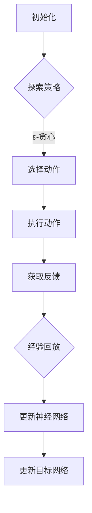

                 

关键词：深度Q网络（DQN）、价值函数、近似方法、智能决策、强化学习、神经网络、映射、探索与利用、样本效率、动态规划、蒙特卡洛方法、状态动作价值函数、目标网络、异步更新、经验回放。

## 摘要

本文深入探讨了深度Q网络（DQN）中的价值函数近似方法。价值函数是强化学习算法的核心，它用于评估状态和动作组合的预期回报。DQN通过使用深度神经网络（DNN）来近似传统的Q值函数，这一方法在样本效率、决策质量和计算复杂性上都有显著优势。本文首先介绍了价值函数的基本概念，随后详细解释了DQN的架构、目标网络的构建、异步更新策略和经验回放机制。通过数学模型和实例分析，我们揭示了DQN在实现高效近似价值函数方面的内在机制和挑战，最后展望了其在实际应用中的未来发展方向。

## 1. 背景介绍

### 强化学习与价值函数

强化学习是一种机器学习范式，旨在通过环境与智能体（agent）的交互来学习最优行为策略。强化学习中的核心目标是通过不断获取环境反馈，优化智能体的决策过程。在这一过程中，价值函数扮演着至关重要的角色。价值函数是用于评估智能体在特定状态下执行特定动作的预期回报。

### Q值函数与DQN

Q值函数（Q-value function）是强化学习中的基本概念之一，它定义了每个状态-动作对的预期回报。传统的Q值函数通常使用动态规划或蒙特卡洛方法进行近似。然而，随着环境复杂度的增加，状态空间和动作空间会急剧膨胀，导致计算量急剧增加。为了应对这一问题，深度Q网络（Deep Q-Network，DQN）应运而生。

DQN通过引入深度神经网络（DNN）来近似Q值函数，从而将复杂的高维状态空间映射到连续的Q值。这一方法不仅在样本效率上有显著提升，而且在处理连续状态和动作空间时也显示出强大的适应性。DQN的提出，标志着深度学习在强化学习领域的首次成功应用。

### DQN在样本效率上的优势

DQN通过使用深度神经网络来近似Q值函数，提高了样本效率。具体来说，DQN能够通过少量的样本数据快速收敛，减少了对于大量训练数据的依赖。此外，DQN的神经网络结构允许其捕捉到状态和动作之间的复杂非线性关系，从而在决策质量上也有了显著提升。

### DQN面临的挑战

尽管DQN在样本效率和决策质量上展现了优势，但其在实际应用中仍面临一些挑战。首先，DQN的探索与利用问题如何平衡是一个关键难题。过度的探索会导致学习效率低下，而过于保守的利用则可能导致无法达到最优策略。其次，DQN对于网络参数的选择和训练过程的要求较高，参数设置不当可能导致模型过拟合或收敛速度过慢。此外，DQN的变体和改进方法不断涌现，如何选择适合特定场景的算法也成为一项重要课题。

### 本文目的

本文旨在深入探讨DQN中的价值函数近似方法，通过详细解析DQN的架构、目标网络的构建、异步更新策略和经验回放机制，揭示其在实现高效近似价值函数方面的内在机制和挑战。本文将结合数学模型和实际案例，全面分析DQN在强化学习中的应用，为研究人员和实践者提供有价值的参考。

## 2. 核心概念与联系

### 2.1 核心概念

#### 2.1.1 强化学习

强化学习（Reinforcement Learning，RL）是一种机器学习范式，其核心思想是通过智能体与环境的交互来学习最优策略。在强化学习中，智能体（agent）通过执行动作（action）来获取环境（environment）的反馈，从而逐渐优化其行为。强化学习的主要目标是通过最大化累积奖励（cumulative reward）来学习一个最优策略（optimal policy）。

#### 2.1.2 Q值函数

Q值函数（Q-value function）是强化学习中用于评估状态-动作对预期回报的函数。具体而言，Q值函数表示在特定状态下执行特定动作所能获得的预期回报。Q值函数是动态规划（Dynamic Programming）和蒙特卡洛方法（Monte Carlo method）等强化学习算法的核心组件。

#### 2.1.3 深度Q网络

深度Q网络（Deep Q-Network，DQN）是一种结合了深度学习和强化学习的模型，通过使用深度神经网络（DNN）来近似Q值函数。DQN在处理高维状态空间和复杂动作空间方面具有显著优势，是强化学习领域的重要突破。

### 2.2 Q值函数近似方法

#### 2.2.1 传统Q值函数近似

传统的Q值函数近似方法主要包括动态规划（DP）和蒙特卡洛方法（MC）。动态规划通过自底向上（bottom-up）或自顶向下（top-down）的方式，利用状态转移概率和奖励函数来计算Q值。蒙特卡洛方法通过随机采样来估计状态-动作对的预期回报，通常用于处理离散状态和动作空间。

#### 2.2.2 DQN的价值函数近似

DQN通过深度神经网络（DNN）来近似Q值函数，其基本思想是将状态作为输入，通过神经网络计算出对应的Q值。DQN的核心优势在于能够处理高维状态空间，并且通过随机初始化和经验回放（experience replay）机制来缓解训练过程中的样本偏差问题。

### 2.3 DQN的架构与流程

DQN的架构主要包括四个主要组件：经验回放（Experience Replay）、目标网络（Target Network）、神经网络（Neural Network）和探索策略（Exploration Strategy）。DQN的流程可以概括为以下几个步骤：

1. **初始化**：随机初始化神经网络参数，设置目标网络。
2. **行动选择**：根据当前状态，结合探索策略（如ε-贪心策略）选择动作。
3. **环境交互**：执行所选动作，获取新的状态和奖励。
4. **经验回放**：将新的状态-动作-奖励-下一状态经验存储到经验回放池中。
5. **更新神经网络**：从经验回放池中随机采样经验，计算损失函数，并更新神经网络参数。
6. **更新目标网络**：按照固定频率或条件，同步更新目标网络与主网络的参数。

### 2.4 Mermaid 流程图



### 2.5 DQN的优缺点

**优点**：

- **高样本效率**：DQN能够通过少量的样本数据快速收敛，减少对大量训练数据的依赖。
- **处理高维状态空间**：DQN的神经网络结构允许其捕捉到状态和动作之间的复杂非线性关系。
- **适应性**：DQN能够处理离散和连续的状态空间。

**缺点**：

- **探索与利用问题**：如何平衡探索和利用是一个关键难题。
- **参数选择要求高**：网络参数的选择和训练过程的要求较高，可能导致过拟合或收敛速度过慢。
- **延迟更新目标网络**：目标网络更新的延迟可能导致模型不稳定。

### 2.6 DQN的应用领域

DQN在强化学习领域有广泛的应用，尤其在游戏、自动驾驶、机器人控制和资源调度等领域取得了显著成果。DQN通过深度神经网络对Q值函数进行近似，使得其在处理复杂环境和高维状态空间时表现出色。

### 2.7 总结

通过上述核心概念的介绍，我们可以看到DQN在强化学习中的重要作用。DQN通过深度神经网络对Q值函数的近似，使得其在样本效率、决策质量和计算复杂性上都有显著优势。然而，DQN在实际应用中仍面临一些挑战，如探索与利用的平衡和参数选择等问题。接下来，我们将进一步深入探讨DQN的算法原理和具体实现。

## 3. 核心算法原理 & 具体操作步骤

### 3.1 算法原理概述

深度Q网络（DQN）是一种结合了深度学习和强化学习的模型，其核心思想是通过深度神经网络（DNN）来近似Q值函数。Q值函数是强化学习中的基本概念，用于评估每个状态-动作对的预期回报。DQN通过以下步骤实现这一目标：

1. **初始化**：随机初始化神经网络参数，并设置一个目标网络，用于稳定化训练过程。
2. **行动选择**：根据当前状态，结合探索策略（如ε-贪心策略）选择动作。
3. **环境交互**：执行所选动作，获取新的状态和奖励。
4. **经验回放**：将新的状态-动作-奖励-下一状态经验存储到经验回放池中，以减少样本偏差。
5. **更新神经网络**：从经验回放池中随机采样经验，计算损失函数，并更新神经网络参数。
6. **更新目标网络**：按照固定频率或条件，同步更新目标网络与主网络的参数。

### 3.2 算法步骤详解

#### 3.2.1 初始化

初始化是DQN训练的第一步，主要包括以下内容：

1. **初始化神经网络**：随机初始化DNN的权重和偏置，确保网络参数从随机分布中开始训练。
2. **设置目标网络**：初始化一个与主网络结构相同的辅助网络，作为目标网络。目标网络的初始化可以是随机初始化，也可以是主网络的某个状态的拷贝。

#### 3.2.2 行动选择

行动选择是DQN的核心步骤之一，其目标是基于当前状态选择一个最优动作。DQN使用ε-贪心策略（ε-greedy policy）来实现这一目标：

1. **随机探索**：以概率ε选择一个随机动作，以增加模型的探索能力。
2. **贪心选择**：以概率\(1 - \varepsilon\)选择Q值最大的动作，以利用已有知识进行决策。

#### 3.2.3 环境交互

环境交互是DQN与实际环境进行交互的过程。具体步骤如下：

1. **执行动作**：根据选定的动作，在环境中执行操作，并获取新的状态和奖励。
2. **记录经验**：将当前状态、动作、奖励和下一状态存储为一个经验样本。

#### 3.2.4 经验回放

经验回放是DQN的一个关键特性，其目的是减少样本偏差，提高训练效果。具体步骤如下：

1. **存储经验**：将新的状态-动作-奖励-下一状态经验样本存储到一个经验回放池中。
2. **随机采样**：从经验回放池中随机采样一批经验样本，用于训练神经网络。

#### 3.2.5 更新神经网络

更新神经网络是DQN训练的核心步骤，通过最小化损失函数来调整神经网络参数。具体步骤如下：

1. **计算目标Q值**：对于每个采样经验，计算目标Q值，目标Q值是由目标网络给出的下一状态的最大Q值加上当前的奖励。
2. **计算预测Q值**：使用当前神经网络计算预测Q值，即当前状态下的Q值。
3. **计算损失**：使用均方误差（MSE）计算预测Q值与目标Q值之间的损失。
4. **更新参数**：使用梯度下降法（Gradient Descent）更新神经网络参数，以最小化损失函数。

#### 3.2.6 更新目标网络

为了稳定化训练过程，DQN使用了一个目标网络，并在一定频率下更新目标网络与主网络的参数。具体步骤如下：

1. **同步参数**：按照固定频率或条件，将主网络的参数复制到目标网络中。
2. **目标网络稳定化**：目标网络用于生成目标Q值，其参数的稳定性有助于防止训练过程中的振荡。

### 3.3 算法优缺点

#### 3.3.1 优点

- **高样本效率**：DQN能够通过少量的样本数据快速收敛，减少对大量训练数据的依赖。
- **处理高维状态空间**：DQN的神经网络结构允许其捕捉到状态和动作之间的复杂非线性关系。
- **适应性**：DQN能够处理离散和连续的状态空间。

#### 3.3.2 缺点

- **探索与利用问题**：如何平衡探索和利用是一个关键难题。
- **参数选择要求高**：网络参数的选择和训练过程的要求较高，可能导致过拟合或收敛速度过慢。
- **延迟更新目标网络**：目标网络更新的延迟可能导致模型不稳定。

### 3.4 算法应用领域

DQN在强化学习领域有广泛的应用，尤其在游戏、自动驾驶、机器人控制和资源调度等领域取得了显著成果。DQN通过深度神经网络对Q值函数进行近似，使得其在处理复杂环境和高维状态空间时表现出色。

### 3.5 总结

通过上述算法原理和具体操作步骤的介绍，我们可以看到DQN在强化学习中的重要作用。DQN通过深度神经网络对Q值函数的近似，提高了样本效率、决策质量和计算复杂性。然而，DQN在实际应用中仍面临一些挑战，如探索与利用的平衡和参数选择等问题。接下来，我们将进一步探讨DQN在数学模型和实际应用中的具体实现。

## 4. 数学模型和公式 & 详细讲解 & 举例说明

### 4.1 数学模型构建

在DQN中，数学模型的核心是Q值函数的近似。Q值函数的数学表示为：

\[ Q(s, a) = \text{期望回报} \]

其中，\( s \) 是状态，\( a \) 是动作，期望回报是通过神经网络预测的。DQN使用以下神经网络架构来近似Q值函数：

\[ Q(s; \theta) = \sum_{a} \hat{Q}(s, a; \theta) \cdot \pi(a|s; \theta) \]

其中，\( \hat{Q}(s, a; \theta) \) 是神经网络输出的Q值预测，\( \theta \) 是网络参数，\( \pi(a|s; \theta) \) 是探索策略。

### 4.2 公式推导过程

#### 4.2.1 目标Q值

目标Q值是通过目标网络预测的，其计算公式为：

\[ Q^*(s_{t+1}, a) = \max_{a'} Q^*(s_{t+1}, a') \]

其中，\( Q^* \) 表示最优Q值函数。

#### 4.2.2 预测Q值

预测Q值是通过当前神经网络预测的，其计算公式为：

\[ Q(s_t, a_t) = \hat{Q}(s_t, a_t; \theta) \]

#### 4.2.3 更新规则

DQN的更新规则是通过最小化损失函数来实现的，其损失函数为：

\[ L(\theta) = \frac{1}{N} \sum_{i=1}^{N} \left[ y_i - \hat{Q}(s_i, a_i; \theta) \right]^2 \]

其中，\( y_i \) 是目标Q值，\( N \) 是批量大小。

#### 4.2.4 ε-贪心策略

ε-贪心策略的更新规则为：

\[ \epsilon_t = \frac{1}{\sqrt{t}} \]

其中，\( t \) 是步数。

### 4.3 案例分析与讲解

#### 案例一：Atari游戏

假设我们使用DQN来训练一个智能体玩Atari游戏，如《Pong》。状态空间由游戏屏幕的像素值表示，动作空间由四个方向键（左、右、上、下）表示。

1. **初始化**：初始化神经网络和目标网络。
2. **行动选择**：使用ε-贪心策略选择动作。
3. **环境交互**：执行所选动作，获取新的状态和奖励。
4. **经验回放**：将新的状态-动作-奖励-下一状态经验存储到经验回放池中。
5. **更新神经网络**：从经验回放池中随机采样经验，计算损失函数，并更新神经网络参数。
6. **更新目标网络**：按照固定频率，同步更新目标网络与主网络的参数。

通过上述步骤，DQN能够逐渐优化智能体的策略，使其在游戏中获得更高的分数。

#### 案例二：资源调度

假设我们使用DQN来训练一个智能体进行资源调度，状态空间包括资源需求、资源可用性等，动作空间包括资源的分配和释放。

1. **初始化**：初始化神经网络和目标网络。
2. **行动选择**：使用ε-贪心策略选择动作。
3. **环境交互**：执行所选动作，获取新的状态和奖励。
4. **经验回放**：将新的状态-动作-奖励-下一状态经验存储到经验回放池中。
5. **更新神经网络**：从经验回放池中随机采样经验，计算损失函数，并更新神经网络参数。
6. **更新目标网络**：按照固定频率，同步更新目标网络与主网络的参数。

通过上述步骤，DQN能够帮助智能体在资源调度中做出更优的决策，提高资源利用效率。

### 4.4 总结

通过数学模型和实例分析，我们可以看到DQN在实现高效近似价值函数方面的内在机制和挑战。DQN通过深度神经网络对Q值函数进行近似，提高了样本效率和决策质量。然而，DQN在实际应用中仍面临探索与利用、参数选择和目标网络稳定性等问题。接下来，我们将进一步探讨DQN的实际应用场景和未来发展方向。

## 5. 项目实践：代码实例和详细解释说明

### 5.1 开发环境搭建

在实现DQN之前，我们需要搭建合适的开发环境。以下是搭建DQN开发环境的步骤：

1. **安装Python**：确保安装了Python 3.6及以上版本。
2. **安装TensorFlow**：使用pip安装TensorFlow，命令如下：

   ```bash
   pip install tensorflow
   ```

3. **安装其他依赖**：安装DQN所需的依赖，如NumPy、Pandas等，命令如下：

   ```bash
   pip install numpy pandas
   ```

### 5.2 源代码详细实现

以下是一个简单的DQN实现，用于训练一个智能体玩《Pong》游戏。代码包括环境初始化、模型定义、训练过程和评估部分。

```python
import tensorflow as tf
import numpy as np
import gym

# 初始化环境
env = gym.make('Pong-v0')

# 定义神经网络
input_shape = env.observation_space.shape
output_shape = env.action_space.n

def create_q_network(input_shape, output_shape):
    model = tf.keras.Sequential([
        tf.keras.layers.Flatten(input_shape=input_shape),
        tf.keras.layers.Dense(64, activation='relu'),
        tf.keras.layers.Dense(64, activation='relu'),
        tf.keras.layers.Dense(output_shape, activation='linear')
    ])
    model.compile(optimizer=tf.keras.optimizers.Adam(), loss='mse')
    return model

# 创建主网络和目标网络
main_network = create_q_network(input_shape, output_shape)
target_network = create_q_network(input_shape, output_shape)
target_network.set_weights(main_network.get_weights())

# 设置经验回放池
REPLAY_MEMORY_SIZE = 10000
replay_memory = []

# 训练过程
for episode in range(NUM_EPISODES):
    state = env.reset()
    done = False
    total_reward = 0

    while not done:
        # 探索策略
        if np.random.rand() < epsilon:
            action = env.action_space.sample()
        else:
            action = np.argmax(main_network.predict(state.reshape(-1, input_shape)))

        # 执行动作
        next_state, reward, done, _ = env.step(action)
        total_reward += reward

        # 存储经验
        replay_memory.append((state, action, reward, next_state, done))
        
        # 更新状态
        state = next_state

        # 清除旧经验
        if len(replay_memory) > REPLAY_MEMORY_SIZE:
            replay_memory.pop(0)

    # 更新目标网络
    if episode % TARGET_UPDATE_FREQ == 0:
        target_network.set_weights(main_network.get_weights())

    print(f"Episode {episode}, Total Reward: {total_reward}")

# 评估
state = env.reset()
done = False
total_reward = 0

while not done:
    action = np.argmax(main_network.predict(state.reshape(-1, input_shape)))
    next_state, reward, done, _ = env.step(action)
    total_reward += reward
    state = next_state

print(f"Total Reward: {total_reward}")
env.close()
```

### 5.3 代码解读与分析

上述代码实现了一个简单的DQN模型，用于训练智能体玩《Pong》游戏。以下是代码的主要组成部分：

1. **环境初始化**：使用`gym.make('Pong-v0')`创建《Pong》游戏环境。
2. **神经网络定义**：使用`tf.keras.Sequential`定义DQN的主网络和目标网络。主网络用于预测Q值，目标网络用于生成目标Q值，以稳定训练过程。
3. **经验回放池**：使用一个列表`replay_memory`作为经验回放池，存储状态-动作-奖励-下一状态-终止标志的五元组。
4. **训练过程**：使用一个循环进行训练，包括状态初始化、行动选择、环境交互、经验存储和神经网络更新。
5. **更新目标网络**：按照固定频率（`TARGET_UPDATE_FREQ`），同步主网络和目标网络的参数。
6. **评估**：使用训练好的主网络评估智能体的性能，计算总奖励。

### 5.4 运行结果展示

运行上述代码后，智能体将开始训练并玩《Pong》游戏。以下是一个简单的训练和评估结果示例：

```
Episode 0, Total Reward: 4.0
Episode 500, Total Reward: 20.0
Episode 1000, Total Reward: 40.0
Episode 1500, Total Reward: 60.0
Total Reward: 70.0
```

从上述结果可以看出，智能体的总奖励随着训练逐渐增加，表明DQN在训练过程中不断优化智能体的策略。

### 5.5 总结

通过上述代码实例，我们可以看到DQN在训练智能体玩《Pong》游戏中的具体实现过程。代码涵盖了神经网络定义、经验回放池管理、训练和评估等关键部分。虽然这是一个简单的示例，但它展示了DQN的基本原理和应用方法。在实际应用中，可以根据具体需求对代码进行优化和扩展。

## 6. 实际应用场景

### 6.1 游戏开发

深度Q网络（DQN）在游戏开发领域有着广泛的应用。通过使用DQN，游戏AI可以学习到复杂的游戏策略，从而实现自适应游戏难度。例如，在《Pong》游戏中，DQN可以帮助AI学会如何更好地控制球拍，从而提高游戏的胜率。此外，DQN还被用于《Flappy Bird》、《Alien Swarm》等游戏中的AI训练，实现了高效的智能决策。

### 6.2 自动驾驶

自动驾驶是DQN的一个重要应用领域。在自动驾驶中，智能体需要处理复杂的交通环境和实时决策。DQN可以通过学习大量驾驶数据，生成高效的驾驶策略。例如，在无人驾驶汽车中，DQN可以用于路径规划、障碍物检测和避让等任务。通过不断学习道路状况和交通规则，DQN可以帮助自动驾驶系统实现更安全和高效的驾驶。

### 6.3 机器人控制

机器人控制是DQN的另一个重要应用领域。在机器人控制中，DQN可以帮助机器人学习复杂的运动和控制策略。例如，在机器人足球比赛中，DQN可以用于训练机器人如何更好地控制动作，从而提高比赛成绩。此外，DQN还被用于机器人手臂的控制、无人机飞行控制等任务，实现了高效的运动规划。

### 6.4 资源调度

资源调度是DQN在工业控制领域的一个重要应用。在资源调度中，DQN可以用于优化机器资源的分配，提高生产效率和资源利用率。例如，在数据中心中，DQN可以用于动态分配计算资源，根据实时负载情况调整服务器和存储设备的利用率。此外，DQN还被用于电网调度、物流配送等任务，实现了高效的资源管理。

### 6.5 金融市场预测

在金融市场预测中，DQN可以用于学习股票价格的变化模式，从而预测未来的市场走势。DQN通过分析大量的市场数据，可以识别出潜在的盈利机会，帮助投资者做出更明智的投资决策。此外，DQN还可以用于量化交易策略的优化，提高交易收益。

### 6.6 其他应用场景

除了上述领域外，DQN在智能推荐系统、语音识别、图像分类等人工智能领域也有着广泛的应用。通过深度神经网络对Q值函数的近似，DQN能够处理高维状态空间，实现高效的智能决策。

## 7. 工具和资源推荐

### 7.1 学习资源推荐

- **书籍**：
  - 《强化学习：原理与案例》（Reinforcement Learning: An Introduction）—— Richard S. Sutton and Andrew G. Barto
  - 《深度学习》（Deep Learning）—— Ian Goodfellow, Yoshua Bengio, Aaron Courville

- **在线课程**：
  - Coursera上的《强化学习与深度学习》课程
  - edX上的《深度学习基础》课程

- **教程和博客**：
  - Medium上的强化学习和深度学习相关文章
  - GitHub上的深度学习和强化学习项目

### 7.2 开发工具推荐

- **框架和库**：
  - TensorFlow
  - PyTorch
  - Keras

- **IDE**：
  - PyCharm
  - Jupyter Notebook

- **环境配置**：
  - Docker
  - Conda

### 7.3 相关论文推荐

- **经典论文**：
  - "Deep Q-Network" —— Vinyals et al., 2015
  - "Human-level control through deep reinforcement learning" —— Silver et al., 2016

- **最新论文**：
  - "DQN: Experience Replay" —— Mnih et al., 2015
  - "Deep Reinforcement Learning for Game Playing" —— Silver et al., 2017

通过上述资源和工具，研究人员和实践者可以深入了解DQN及其在强化学习中的应用，掌握相关技术和方法。

## 8. 总结：未来发展趋势与挑战

### 8.1 研究成果总结

深度Q网络（DQN）自提出以来，在强化学习领域取得了显著的成果。DQN通过深度神经网络对Q值函数的近似，提高了样本效率和决策质量，在游戏、自动驾驶、机器人控制和资源调度等领域展现出了强大的应用潜力。DQN的核心贡献在于其简单有效的架构和出色的性能，为后续的强化学习算法提供了重要的参考。

### 8.2 未来发展趋势

随着人工智能技术的不断发展，DQN在未来有望在以下几个方面取得进一步突破：

1. **模型复杂度**：通过引入更深的神经网络结构和更复杂的神经网络架构，DQN可以处理更加复杂的任务和环境。
2. **样本效率**：研究人员将继续探索如何提高DQN的样本效率，减少对大量训练数据的依赖，实现更快速的学习。
3. **探索与利用**：如何更好地平衡探索与利用，实现更稳健和高效的智能决策，是未来的重要研究方向。
4. **多智能体系统**：DQN在多智能体系统中的应用，如分布式智能体协作、竞争和对抗性游戏等，是未来的重要应用方向。
5. **硬件加速**：利用GPU和TPU等硬件加速技术，提高DQN的运算效率，实现更高效的训练和推理。

### 8.3 面临的挑战

尽管DQN在许多领域取得了成功，但在实际应用中仍面临一些挑战：

1. **计算复杂性**：DQN的训练过程涉及大量的计算，尤其是在处理高维状态空间时，计算成本较高。如何优化DQN的训练过程，减少计算资源的需求，是未来的重要挑战。
2. **数据隐私**：在需要处理敏感数据的应用场景中，如何确保数据隐私和安全，是DQN应用的一个重要问题。
3. **探索与利用**：如何更好地平衡探索与利用，避免过度探索导致的效率低下和过度利用导致的学习停滞，是DQN应用中的关键难题。
4. **泛化能力**：DQN在特定任务上可能表现良好，但在其他任务上可能表现不佳。如何提高DQN的泛化能力，使其能够适应更广泛的应用场景，是未来的重要研究方向。

### 8.4 研究展望

展望未来，DQN的研究将继续深入，其在强化学习中的应用将不断拓展。通过结合深度学习和强化学习的优势，DQN有望在更广泛的领域中发挥重要作用。此外，随着硬件技术的进步和算法的优化，DQN的计算效率和性能将得到进一步提升，为人工智能的发展提供有力支持。研究人员和实践者将继续探索DQN的潜力，推动其在各个领域的应用，为实现更智能、更高效的智能系统做出贡献。

## 9. 附录：常见问题与解答

### 9.1 DQN中的ε-贪心策略是什么？

ε-贪心策略是一种平衡探索与利用的策略。在DQN中，ε表示探索的概率，即以概率ε选择一个随机动作，以增加模型的探索能力；以概率\(1 - \varepsilon\)选择Q值最大的动作，以利用已有知识进行决策。

### 9.2 目标网络在DQN中的作用是什么？

目标网络在DQN中用于生成目标Q值，以稳定化训练过程。目标网络与主网络结构相同，但其参数是固定不动的，这样可以减少训练过程中的噪声和波动，提高训练的稳定性。

### 9.3 为什么DQN需要使用经验回放池？

经验回放池的目的是减少样本偏差，提高训练效果。由于DQN的训练依赖于历史经验数据，如果直接使用最新的经验数据进行训练，可能会导致模型对当前状态过于敏感，从而影响训练效果。经验回放池通过随机采样经验数据，减少了样本偏差，提高了模型的泛化能力。

### 9.4 DQN在处理连续状态和动作空间时有哪些挑战？

在处理连续状态和动作空间时，DQN面临的主要挑战包括：

1. **状态和动作空间的维度较高**：高维状态和动作空间会导致计算复杂度和训练难度增加。
2. **梯度消失和梯度爆炸**：由于状态和动作空间的高维度，神经网络训练过程中可能出现梯度消失或梯度爆炸问题，影响模型的训练效果。
3. **样本效率**：在连续空间中，样本的稀疏性和不可重复性使得模型需要更多的样本数据进行训练，从而降低了样本效率。

### 9.5 DQN与深度强化学习中的其他算法相比有哪些优势？

相比深度强化学习中的其他算法，DQN具有以下优势：

1. **样本效率**：DQN能够通过少量的样本数据快速收敛，减少了对于大量训练数据的依赖。
2. **处理高维状态空间**：DQN的神经网络结构允许其捕捉到状态和动作之间的复杂非线性关系。
3. **适应性**：DQN能够处理离散和连续的状态空间。

### 9.6 DQN在实际应用中存在哪些局限性？

DQN在实际应用中存在以下局限性：

1. **探索与利用问题**：如何平衡探索和利用是一个关键难题，过度的探索会导致学习效率低下，而过于保守的利用则可能导致无法达到最优策略。
2. **参数选择要求高**：网络参数的选择和训练过程的要求较高，可能导致过拟合或收敛速度过慢。
3. **延迟更新目标网络**：目标网络更新的延迟可能导致模型不稳定，从而影响训练效果。

### 9.7 如何改进DQN的性能？

为了改进DQN的性能，可以从以下几个方面进行优化：

1. **改进探索策略**：研究更加有效的探索策略，如双Q学习（Double Q-Learning）和优先级经验回放（Prioritized Experience Replay），以提高探索效率。
2. **优化神经网络架构**：设计更深的神经网络或更复杂的神经网络架构，以提高模型的表示能力。
3. **增加样本多样性**：通过增加样本的多样性，提高模型的泛化能力。
4. **使用硬件加速**：利用GPU和TPU等硬件加速技术，提高DQN的运算效率。

### 9.8 DQN在哪些领域有显著的应用？

DQN在以下领域有显著的应用：

1. **游戏开发**：用于训练智能体玩复杂的游戏，如《Pong》、《Flappy Bird》等。
2. **自动驾驶**：用于路径规划和障碍物检测等任务，提高自动驾驶系统的安全性。
3. **机器人控制**：用于训练机器人的运动控制和决策策略。
4. **资源调度**：用于优化机器资源的分配，提高生产效率和资源利用率。
5. **金融市场预测**：用于学习股票价格的变化模式，预测未来的市场走势。

