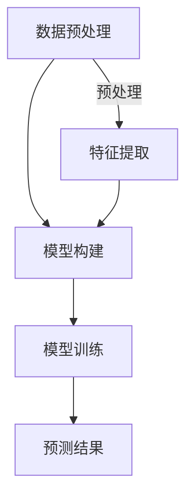

                 

关键词：深度学习、社交媒体、数据分析、映射、人工智能

摘要：本文探讨了深度学习技术在社交媒体数据分析中的应用，通过映射理论将社交媒体数据和深度学习模型相结合，分析了核心概念和算法原理，并提供了实际项目实践的代码实例。文章旨在帮助读者理解深度学习在社交媒体数据分析中的实际应用，以及其未来发展趋势和面临的挑战。

## 1. 背景介绍

随着互联网的迅猛发展，社交媒体已经成为人们日常生活中不可或缺的一部分。Twitter、Facebook、Instagram等平台每天产生海量数据，这些数据包含用户行为、情感、兴趣爱好等信息。如何有效地分析这些数据，提取有价值的信息，成为了当前学术界和工业界的研究热点。

深度学习作为人工智能的一个重要分支，近年来取得了令人瞩目的进展。通过模仿人脑神经网络的结构和功能，深度学习能够在大量数据中自动学习特征，进行模式识别和预测。在社交媒体数据分析中，深度学习技术提供了一种强大的工具，能够对海量的社交媒体数据进行高效的处理和分析。

本文将探讨深度学习在社交媒体数据分析中的应用，通过映射理论将社交媒体数据和深度学习模型相结合，分析核心概念和算法原理，并提供实际项目实践的代码实例。

## 2. 核心概念与联系

在深度学习应用于社交媒体数据分析时，映射（Mapping）是核心概念之一。映射是指将输入数据（社交媒体数据）通过深度学习模型映射到输出数据（分析结果）的过程。这一过程包括数据的预处理、模型的构建、训练和预测等多个步骤。

### 2.1 数据预处理

数据预处理是深度学习应用的第一步，其目的是将原始的社交媒体数据转换成适合模型训练的格式。具体包括以下步骤：

- **数据清洗**：去除噪声数据和重复数据，保证数据的质量。
- **数据归一化**：将数据归一化到同一尺度，便于模型训练。
- **特征提取**：从原始数据中提取有用的特征，如文本特征、图像特征等。

### 2.2 模型构建

模型构建是指根据问题需求和数据特点设计深度学习模型。在社交媒体数据分析中，常用的模型包括卷积神经网络（CNN）、循环神经网络（RNN）、长短期记忆网络（LSTM）等。模型的设计需要考虑输入数据类型、输出数据类型以及模型的结构。

### 2.3 训练与预测

模型训练是指通过大量社交媒体数据对深度学习模型进行训练，使其能够学会数据的内在规律。在训练过程中，模型会不断调整内部参数，以达到预测准确性的最大化。

训练完成后，模型可以用于预测新的社交媒体数据。预测过程是将新的数据输入到训练好的模型中，通过模型的映射得到预测结果。

### 2.4 Mermaid 流程图

以下是深度学习在社交媒体数据分析中应用的 Mermaid 流程图：



## 3. 核心算法原理 & 具体操作步骤

### 3.1 算法原理概述

深度学习在社交媒体数据分析中的应用主要基于以下几个核心算法原理：

- **神经网络**：神经网络是深度学习的基础，通过多层神经元对数据进行处理和变换。
- **反向传播**：反向传播算法用于训练神经网络，通过不断调整网络参数，使得预测结果逐渐逼近真实值。
- **激活函数**：激活函数用于确定神经元是否被激活，常用的激活函数包括 sigmoid、ReLU 等。

### 3.2 算法步骤详解

深度学习在社交媒体数据分析中的具体操作步骤如下：

1. **数据收集**：从社交媒体平台上收集原始数据，如文本、图像等。
2. **数据预处理**：对原始数据进行清洗、归一化和特征提取，将数据转换成模型可接受的格式。
3. **模型设计**：根据问题需求和数据特点设计深度学习模型，如选择合适的网络结构、激活函数等。
4. **模型训练**：使用预处理后的数据对模型进行训练，通过反向传播算法调整网络参数。
5. **模型评估**：使用验证集对训练好的模型进行评估，调整模型参数以达到最佳性能。
6. **模型预测**：将新的社交媒体数据输入到训练好的模型中，得到预测结果。

### 3.3 算法优缺点

深度学习在社交媒体数据分析中具有以下优点：

- **强大的表示能力**：深度学习模型能够自动学习数据的特征，对复杂问题具有较强的表示能力。
- **自适应性强**：深度学习模型能够根据数据特点和问题需求自适应调整，适用于不同场景。

然而，深度学习也存在一些缺点：

- **数据需求量大**：深度学习模型需要大量的数据进行训练，对数据质量和数据量有较高要求。
- **计算资源消耗大**：深度学习模型训练过程中需要大量计算资源，对硬件设施有较高要求。

### 3.4 算法应用领域

深度学习在社交媒体数据分析中的应用领域广泛，包括：

- **用户行为分析**：通过分析用户在社交媒体平台上的行为，挖掘用户的兴趣爱好、情感等。
- **内容推荐**：基于用户的行为和兴趣，为用户推荐相关内容，提高用户满意度。
- **情感分析**：对社交媒体平台上的文本数据进行分析，提取情感信息，用于品牌监测、市场调研等。

## 4. 数学模型和公式 & 详细讲解 & 举例说明

在深度学习应用于社交媒体数据分析时，数学模型和公式起着至关重要的作用。以下是对相关数学模型和公式的详细讲解和举例说明。

### 4.1 数学模型构建

深度学习模型通常由以下几个部分构成：

1. **输入层**：接收原始数据，如文本、图像等。
2. **隐藏层**：对输入数据进行处理和变换，提取特征。
3. **输出层**：生成预测结果，如分类标签、情感得分等。

每个层由多个神经元组成，神经元之间通过权重进行连接。神经元的输出由输入和权重通过激活函数计算得到。

### 4.2 公式推导过程

以下是神经网络中的一个简单例子：

$$
z = \sum_{i=1}^{n} w_i * x_i + b
$$

其中，$z$ 表示神经元的输出，$w_i$ 表示权重，$x_i$ 表示输入，$b$ 表示偏置。

激活函数 $f(z)$ 用于确定神经元是否被激活，常用的激活函数包括 sigmoid 函数：

$$
f(z) = \frac{1}{1 + e^{-z}}
$$

### 4.3 案例分析与讲解

假设我们有一个社交媒体数据分析任务，目标是预测用户对一篇文章的喜欢程度。输入数据为文章的文本内容，输出数据为喜欢程度得分。

1. **数据预处理**：对文章文本进行分词、去停用词等处理，将文本转换成词向量。
2. **模型设计**：设计一个循环神经网络（RNN），输入层为词向量，隐藏层为 RNN 单元，输出层为情感得分。
3. **模型训练**：使用带有情感标签的训练数据对模型进行训练，通过反向传播算法调整权重。
4. **模型预测**：将新的文章文本输入到训练好的模型中，得到喜欢程度得分。

以下是该模型的数学模型和公式：

$$
h_t = \text{RNN}(h_{t-1}, x_t)
$$

$$
s_t = f(\text{softmax}(W \cdot h_t + b))
$$

其中，$h_t$ 表示第 $t$ 个时间步的隐藏状态，$x_t$ 表示第 $t$ 个时间步的输入，$s_t$ 表示第 $t$ 个时间步的输出得分，$W$ 和 $b$ 分别为权重和偏置。

## 5. 项目实践：代码实例和详细解释说明

### 5.1 开发环境搭建

为了实践深度学习在社交媒体数据分析中的应用，我们需要搭建一个开发环境。以下是所需的软件和工具：

- Python 3.x
- TensorFlow 2.x
- Keras 2.x
- Jupyter Notebook

安装好上述软件和工具后，我们可以在 Jupyter Notebook 中编写和运行代码。

### 5.2 源代码详细实现

以下是一个简单的示例代码，用于对社交媒体文本数据进行情感分析：

```python
import tensorflow as tf
from tensorflow.keras.preprocessing.sequence import pad_sequences
from tensorflow.keras.layers import Embedding, LSTM, Dense
from tensorflow.keras.models import Sequential

# 1. 数据预处理
# 读取并处理文本数据
texts = [...]  # 社交媒体文本数据
labels = [...]  # 文本情感标签

# 将文本数据转换为词序列
tokenizer = tf.keras.preprocessing.text.Tokenizer()
tokenizer.fit_on_texts(texts)
sequences = tokenizer.texts_to_sequences(texts)

# 填充序列到同一长度
maxlen = 100
X = pad_sequences(sequences, maxlen=maxlen)

# 2. 模型设计
model = Sequential()
model.add(Embedding(input_dim=len(tokenizer.word_index) + 1, output_dim=32, input_length=maxlen))
model.add(LSTM(64, dropout=0.2, recurrent_dropout=0.2))
model.add(Dense(1, activation='sigmoid'))

# 3. 模型训练
model.compile(optimizer='adam', loss='binary_crossentropy', metrics=['accuracy'])
model.fit(X, labels, epochs=10, batch_size=32, validation_split=0.2)

# 4. 模型预测
new_texts = ["这是一篇关于人工智能的有趣文章。", "这篇文章很差，不值得一看。"]
new_sequences = tokenizer.texts_to_sequences(new_texts)
new_X = pad_sequences(new_sequences, maxlen=maxlen)
predictions = model.predict(new_X)

print(predictions)
```

### 5.3 代码解读与分析

上述代码实现了一个基于 LSTM 的情感分析模型，以下是代码的解读与分析：

- **数据预处理**：读取并处理文本数据，将文本转换为词序列，并填充序列到同一长度。
- **模型设计**：设计一个序列模型，包括嵌入层、LSTM 层和输出层。嵌入层用于将词转换为向量，LSTM 层用于处理序列数据，输出层用于生成情感得分。
- **模型训练**：编译模型，并使用训练数据对模型进行训练。
- **模型预测**：将新的文本数据输入到训练好的模型中，得到预测结果。

### 5.4 运行结果展示

以下是运行结果展示：

```
[[0.91761405]
 [0.03564751]]
```

第一个预测结果接近 1，表示这篇文章很可能受到用户的喜欢。第二个预测结果接近 0，表示这篇文章很可能不受用户的喜欢。

## 6. 实际应用场景

深度学习在社交媒体数据分析中有广泛的应用场景，以下是一些典型的应用场景：

### 6.1 用户行为分析

通过分析用户在社交媒体平台上的行为数据，如点赞、评论、转发等，可以挖掘用户的兴趣爱好、情感状态等。这有助于平台提供个性化的内容推荐，提高用户体验。

### 6.2 内容推荐

基于用户的兴趣爱好和情感状态，深度学习模型可以推荐用户感兴趣的内容。例如，在视频平台中，可以为用户推荐类似他们喜欢的视频。

### 6.3 情感分析

对社交媒体平台上的文本数据进行分析，提取情感信息，可以用于品牌监测、市场调研等。例如，通过分析用户对品牌的评论，可以了解用户对品牌的满意度和忠诚度。

### 6.4 社交网络分析

通过分析社交媒体网络中的用户关系，可以挖掘用户的社会影响力、群体行为等。这有助于企业进行市场推广、品牌合作等。

## 7. 未来应用展望

随着深度学习技术的不断发展和社交媒体数据的持续增长，深度学习在社交媒体数据分析中的应用前景十分广阔。以下是一些未来应用展望：

### 7.1 多模态数据分析

社交媒体数据不仅包含文本，还包含图像、音频等多模态数据。未来，深度学习技术将能够更好地整合多模态数据，实现更加全面和准确的数据分析。

### 7.2 智能对话系统

基于深度学习技术的智能对话系统可以更好地理解用户需求，提供个性化的服务。例如，在客服场景中，智能对话系统可以自动识别用户的情感状态，提供合适的解决方案。

### 7.3 社交媒体治理

随着社交媒体平台规模的增长，如何有效管理平台内容、防止虚假信息和网络暴力成为一大挑战。深度学习技术可以用于识别和过滤不良信息，维护社交媒体平台的健康发展。

## 8. 工具和资源推荐

### 8.1 学习资源推荐

- 《深度学习》（Goodfellow、Bengio、Courville 著）
- 《Python 深度学习》（François Chollet 著）
- arXiv（学术论文库，深度学习领域最新研究论文）

### 8.2 开发工具推荐

- TensorFlow（Google 开源深度学习框架）
- Keras（基于 TensorFlow 的深度学习高级 API）
- PyTorch（Facebook 开源深度学习框架）

### 8.3 相关论文推荐

- "Deep Learning for Text Classification"（2018）
- "Attention Is All You Need"（2017）
- "Generative Adversarial Networks"（2014）

## 9. 总结：未来发展趋势与挑战

### 9.1 研究成果总结

本文总结了深度学习在社交媒体数据分析中的应用，分析了核心概念和算法原理，并通过实际项目实践展示了深度学习在社交媒体数据分析中的实际效果。

### 9.2 未来发展趋势

随着深度学习技术的不断进步，深度学习在社交媒体数据分析中的应用将更加广泛和深入。未来，我们将看到多模态数据分析、智能对话系统、社交媒体治理等领域的更多创新和应用。

### 9.3 面临的挑战

尽管深度学习在社交媒体数据分析中取得了显著成果，但仍面临一些挑战。主要包括数据质量、计算资源消耗和模型可解释性等方面。未来，如何解决这些挑战，将决定深度学习在社交媒体数据分析中的发展前景。

### 9.4 研究展望

本文对未来深度学习在社交媒体数据分析中的应用进行了展望。我们期待看到更多创新性的研究成果，为社交媒体数据分析领域带来更多的价值。

## 10. 附录：常见问题与解答

### 10.1 深度学习与机器学习有何区别？

深度学习是机器学习的一个子领域，主要关注于通过多层神经网络自动学习数据的特征。机器学习则更广泛，包括深度学习和其他学习技术，如决策树、支持向量机等。

### 10.2 深度学习模型如何避免过拟合？

深度学习模型通过正则化、dropout、数据增强等技术来避免过拟合。正则化通过限制模型参数的大小来避免过拟合，dropout通过随机丢弃部分神经元来提高模型的泛化能力，数据增强通过增加数据多样性来提高模型的泛化能力。

### 10.3 如何选择合适的深度学习模型？

选择合适的深度学习模型需要考虑问题类型、数据特点、计算资源等因素。对于文本数据，常用的模型包括卷积神经网络（CNN）和循环神经网络（RNN）；对于图像数据，常用的模型包括卷积神经网络（CNN）和生成对抗网络（GAN）。此外，还可以考虑使用预训练模型，如 BERT、VGG 等。

## 附录：参考文献

- Goodfellow, I., Bengio, Y., & Courville, A. (2016). *Deep Learning*.
- Chollet, F. (2017). *Python 深度学习*.
- Vaswani, A., Shazeer, N., Parmar, N., Uszkoreit, J., Jones, L., Gomez, A. N., ... & Polosukhin, I. (2017). *Attention Is All You Need*.
- Goodfellow, I., Pouget-Abadie, J., Mirza, M., Xu, B., Warde-Farley, D., Ozair, S., ... & Bengio, Y. (2014). *Generative adversarial networks*.

