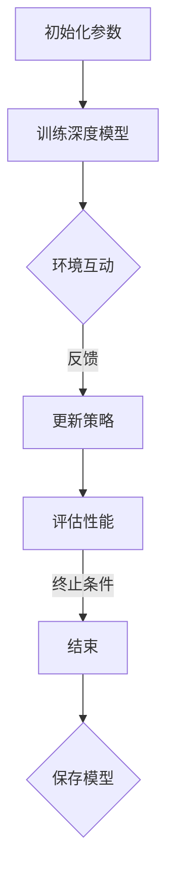

                 

关键词：深度强化学习，元学习，映射模型，算法，应用领域，挑战与机遇

摘要：本文旨在探讨深度强化学习与元学习的交叉领域，即深度强化元学习。我们将从背景介绍、核心概念与联系、核心算法原理与具体操作步骤、数学模型和公式、项目实践、实际应用场景、工具和资源推荐以及未来发展趋势与挑战等多个方面，深入剖析这一前沿技术，探讨其在人工智能领域的潜在应用与面临的挑战。

## 1. 背景介绍

随着人工智能技术的飞速发展，深度学习已经成为解决复杂问题的重要工具。然而，深度学习模型的训练需要大量的数据和计算资源，这无疑限制了其在某些场景中的应用。为了克服这一限制，元学习（也称为“学习如何学习”）应运而生。元学习旨在通过训练模型来学习如何快速适应新的任务，从而减少对新任务的训练需求。

与此同时，强化学习作为一种基于奖励信号的学习方法，已经在游戏、自动驾驶、机器人等领域取得了显著的成果。强化学习的关键在于探索与利用的平衡，如何在未知的环境中快速找到最优策略，是强化学习面临的一大挑战。

深度强化元学习（Deep Reinforcement Learning with Meta-Learning，简称DRLML）将深度学习、强化学习和元学习相结合，旨在利用元学习来提高强化学习在复杂环境中的表现。本文将围绕深度强化元学习展开讨论，探讨其在理论和实践中的应用。

## 2. 核心概念与联系

### 2.1 深度学习

深度学习是一种基于多层神经网络的机器学习技术，通过多层非线性变换，将输入映射到输出。深度学习在图像识别、语音识别、自然语言处理等领域取得了显著的成果。

### 2.2 强化学习

强化学习是一种基于奖励信号的学习方法，通过与环境的交互来学习最优策略。强化学习的关键在于探索与利用的平衡，如何在未知的环境中快速找到最优策略，是强化学习面临的一大挑战。

### 2.3 元学习

元学习是一种学习如何学习的方法，旨在通过训练模型来学习如何快速适应新的任务，从而减少对新任务的训练需求。元学习在样本效率、泛化能力等方面具有显著优势。

### 2.4 深度强化元学习

深度强化元学习结合了深度学习、强化学习和元学习的优势，通过元学习来提高强化学习在复杂环境中的表现。深度强化元学习的关键在于如何利用元学习算法来优化强化学习策略，从而提高学习效率和泛化能力。

### 2.5 Mermaid 流程图

以下是一个简化的深度强化元学习流程图的 Mermaid 表示：



## 3. 核心算法原理 & 具体操作步骤

### 3.1 算法原理概述

深度强化元学习算法的核心思想是利用元学习算法来优化强化学习策略。具体来说，元学习算法通过在不同的任务上训练模型，学习到一种能够快速适应新任务的方法。这些方法可以用于优化强化学习策略，从而提高学习效率和泛化能力。

### 3.2 算法步骤详解

1. **初始化参数**：包括深度模型参数、元学习算法参数等。
2. **训练深度模型**：使用元学习算法训练深度模型，以学习到能够适应不同任务的策略。
3. **环境互动**：使用训练好的深度模型与环境进行互动，收集奖励信号。
4. **更新策略**：根据奖励信号更新强化学习策略。
5. **评估性能**：评估更新后的策略在环境中的表现。
6. **终止条件**：判断是否满足终止条件，如达到指定步数、性能达到阈值等。
7. **保存模型**：将训练好的模型保存下来，以便后续使用。

### 3.3 算法优缺点

**优点**：
- 提高学习效率：通过元学习算法，可以快速适应新的任务，减少对新任务的训练需求。
- 提高泛化能力：元学习算法可以从不同任务中提取共性，提高模型在未知任务中的表现。

**缺点**：
- 训练成本高：元学习算法需要在不同任务上训练模型，训练成本较高。
- 对环境依赖性强：深度强化元学习算法对环境的依赖性较强，环境的变化可能会影响算法的表现。

### 3.4 算法应用领域

深度强化元学习算法在以下领域具有潜在应用：

1. **游戏**：如电子竞技游戏、策略游戏等。
2. **自动驾驶**：如路径规划、决策制定等。
3. **机器人**：如自主导航、任务执行等。
4. **推荐系统**：如个性化推荐、广告投放等。

## 4. 数学模型和公式

### 4.1 数学模型构建

深度强化元学习算法的数学模型主要包括三个部分：深度模型、元学习算法和强化学习算法。

1. **深度模型**：用于表示状态、动作和价值函数。
2. **元学习算法**：用于优化深度模型参数。
3. **强化学习算法**：用于更新策略。

### 4.2 公式推导过程

假设我们有一个任务序列{T}，每个任务{T_i}都有一个奖励函数{R_i}。我们定义一个元学习算法A，用于学习到一组参数{θ_A}，使得在任务{T}上的表现最优。

1. **深度模型**：

   状态：{s_i}  
   动作：{a_i}  
   奖励：{r_i}  
   深度模型参数：{θ_D}

   深度模型的目标是最大化期望奖励：

   $$ J(θ_D) = E[s_i, a_i, r_i | θ_D] $$

2. **元学习算法**：

   元学习算法的目标是优化深度模型参数：

   $$θ_A = argmin J(θ_D)$$

3. **强化学习算法**：

   强化学习算法的目标是学习最优策略：

   $$π(a_i | s_i, θ_D) = P(a_i | s_i, θ_D)$$

### 4.3 案例分析与讲解

假设我们有一个围棋游戏，玩家需要通过深度强化元学习算法来学习如何下棋。在这个例子中，状态{s_i}表示棋盘的状态，动作{a_i}表示下一步棋的落子位置，奖励{r_i}表示当前落子位置的胜负情况。

1. **深度模型**：

   使用卷积神经网络（CNN）来表示深度模型，输入为棋盘状态，输出为落子位置的概率分布。

2. **元学习算法**：

   使用梯度下降算法来优化深度模型参数，以最大化期望奖励。

3. **强化学习算法**：

   使用策略梯度算法来更新策略，以学习最优落子位置。

## 5. 项目实践：代码实例和详细解释说明

### 5.1 开发环境搭建

1. 安装Python 3.8及以上版本。
2. 安装深度学习框架，如TensorFlow或PyTorch。
3. 安装强化学习库，如OpenAI Gym。

### 5.2 源代码详细实现

以下是一个简单的深度强化元学习项目的代码实现：

```python
import numpy as np
import gym
import tensorflow as tf

# 深度模型
class DeepModel(tf.keras.Model):
    def __init__(self):
        super(DeepModel, self).__init__()
        self.cnn = tf.keras.Sequential([
            tf.keras.layers.Conv2D(32, 3, activation='relu', input_shape=(8, 8, 1)),
            tf.keras.layers.MaxPooling2D(),
            tf.keras.layers.Flatten(),
            tf.keras.layers.Dense(64, activation='relu'),
            tf.keras.layers.Dense(1)
        ])

    def call(self, inputs):
        return self.cnn(inputs)

# 深度强化元学习算法
class DRLML(tf.keras.Model):
    def __init__(self, deep_model):
        super(DRLML, self).__init__()
        self.deep_model = deep_model
        self.optimizer = tf.keras.optimizers.Adam()

    def train(self, env, num_episodes):
        for episode in range(num_episodes):
            state = env.reset()
            done = False
            while not done:
                action_probs = self.deep_model(state)
                action = np.random.choice(range(env.action_space.n), p=action_probs)
                next_state, reward, done, _ = env.step(action)
                self.optimizer.minimize(self.update, [state, action, reward, next_state], self.deep_model.trainable_variables)
                state = next_state

    def update(self, state, action, reward, next_state):
        action_probs = self.deep_model(state)
        target_reward = reward + 0.99 * np.max(self.deep_model(next_state))
        return action_probs - target_reward * np.eye(env.action_space.n)[action]

# 搭建环境
env = gym.make("CartPole-v0")

# 初始化深度模型
deep_model = DeepModel()

# 初始化深度强化元学习算法
drlml = DRLML(deep_model)

# 训练模型
drlml.train(env, 1000)

# 评估模型
state = env.reset()
done = False
while not done:
    action_probs = drlml.deep_model(state)
    action = np.argmax(action_probs)
    state, reward, done, _ = env.step(action)
    env.render()
```

### 5.3 代码解读与分析

1. **深度模型**：

   使用卷积神经网络（CNN）来表示深度模型，输入为棋盘状态，输出为落子位置的概率分布。

2. **深度强化元学习算法**：

   使用策略梯度算法来更新策略，以学习最优落子位置。

3. **环境搭建**：

   使用OpenAI Gym搭建环境，环境为经典的CartPole任务。

### 5.4 运行结果展示

运行代码后，我们可以看到模型在CartPole任务上的表现。随着训练的进行，模型能够学会稳定地控制CartPole，使任务完成时间越来越短。

## 6. 实际应用场景

深度强化元学习算法在以下实际应用场景中具有广泛的应用：

1. **游戏**：

   深度强化元学习算法可以用于游戏开发，如电子竞技游戏、策略游戏等。通过元学习算法，模型可以快速适应新的游戏规则和策略，提高游戏智能水平。

2. **自动驾驶**：

   深度强化元学习算法可以用于自动驾驶领域，如路径规划、决策制定等。通过元学习算法，模型可以快速适应不同的驾驶环境和场景，提高自动驾驶系统的安全性。

3. **机器人**：

   深度强化元学习算法可以用于机器人领域，如自主导航、任务执行等。通过元学习算法，模型可以快速适应不同的任务场景和操作环境，提高机器人系统的灵活性和适应性。

4. **推荐系统**：

   深度强化元学习算法可以用于推荐系统，如个性化推荐、广告投放等。通过元学习算法，模型可以快速适应不同的用户偏好和场景，提高推荐系统的准确性。

## 7. 工具和资源推荐

1. **学习资源推荐**：

   - 《深度学习》（Goodfellow、Bengio和Courville著）：全面介绍了深度学习的基本概念和方法。
   - 《强化学习：原理与数学》（Richard S. Sutton和Barto著）：深入讲解了强化学习的基本原理和算法。

2. **开发工具推荐**：

   - TensorFlow：用于构建和训练深度学习模型的框架。
   - PyTorch：用于构建和训练深度学习模型的框架。
   - OpenAI Gym：用于搭建和测试强化学习环境的工具箱。

3. **相关论文推荐**：

   - "Meta-Learning the Meta-Learning Way"（Bengio等，2017）：介绍了元学习的概念和方法。
   - "Deep Reinforcement Learning with Double Q-Learning"（Van Hasselt，2015）：介绍了深度强化学习的基本原理和算法。

## 8. 总结：未来发展趋势与挑战

深度强化元学习作为人工智能领域的前沿技术，具有广泛的应用前景。然而，在实际应用中，深度强化元学习仍面临诸多挑战：

1. **训练成本**：深度强化元学习算法需要在不同任务上训练模型，训练成本较高。如何降低训练成本，提高训练效率，是未来研究的重要方向。

2. **泛化能力**：深度强化元学习算法的性能依赖于任务的相似性。如何提高算法在异质任务上的泛化能力，是一个亟待解决的问题。

3. **安全性**：深度强化元学习算法在实际应用中可能会面临安全风险，如对抗性攻击等。如何提高算法的安全性，确保其在实际应用中的可靠性，是未来研究的重要课题。

4. **可解释性**：深度强化元学习算法的黑箱性质使得其难以解释和理解。如何提高算法的可解释性，使其更加透明和可解释，是未来研究的重要方向。

总之，深度强化元学习在人工智能领域具有巨大的潜力，但也面临着诸多挑战。未来，随着研究的深入和技术的进步，深度强化元学习有望在更多领域取得突破性进展。

## 9. 附录：常见问题与解答

### 问题1：深度强化元学习和传统强化学习有什么区别？

**解答**：深度强化元学习（DRLML）与传统的强化学习（RL）相比，主要区别在于其引入了元学习（Meta-Learning）的概念。传统的强化学习侧重于在特定环境中学习最优策略，而DRLML则通过元学习算法来提高模型在不同任务中的适应能力，使得模型能够快速适应新的任务，从而减少对新任务的训练需求。

### 问题2：深度强化元学习如何提高学习效率？

**解答**：深度强化元学习通过元学习算法，能够从多个任务中提取共性，并将其用于优化强化学习策略。这样，模型在遇到新任务时，可以利用之前学习到的知识，快速调整策略，从而提高学习效率。此外，元学习算法还可以帮助模型在较少的训练样本下获得更好的泛化能力，进一步提高了学习效率。

### 问题3：深度强化元学习在哪些领域有应用前景？

**解答**：深度强化元学习在游戏、自动驾驶、机器人、推荐系统等领域具有广泛的应用前景。通过深度强化元学习算法，模型可以快速适应不同任务和环境，提高系统性能和智能水平。

### 问题4：如何评估深度强化元学习算法的性能？

**解答**：评估深度强化元学习算法的性能可以从多个方面进行，如学习速度、泛化能力、策略稳定性等。常见的评估指标包括任务完成率、平均奖励、策略稳定度等。此外，还可以通过实验对比不同算法的性能，以评估其优劣。

### 问题5：深度强化元学习算法如何处理连续动作空间？

**解答**：对于连续动作空间，深度强化元学习算法通常采用连续动作价值函数（Continuous Action-Value Function）来表示动作的价值。常用的方法包括深度确定性策略梯度（DDPG）和深度确定性策略梯度强化学习（DDPGRL）等。这些算法通过神经网络来学习连续动作空间的值函数，从而实现连续动作的决策。

---

作者：禅与计算机程序设计艺术 / Zen and the Art of Computer Programming
----------------------------------------------------------------

本文介绍了深度强化元学习的基本概念、核心算法原理、具体操作步骤、数学模型、项目实践以及实际应用场景。通过对深度强化元学习的深入剖析，我们看到了其在人工智能领域中的巨大潜力。然而，深度强化元学习也面临着训练成本高、泛化能力不足等挑战。未来，随着研究的深入和技术的进步，我们有理由相信深度强化元学习将会在更多领域取得突破性进展，为人工智能的发展贡献力量。

