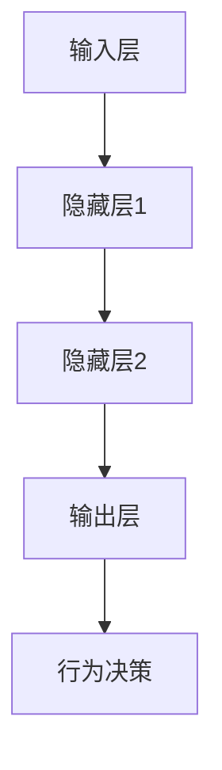

                 

关键词：神经网络，游戏AI，映射，创新实践，深度学习，智能算法

> 摘要：本文旨在探讨神经网络技术在游戏AI领域的创新应用。通过对映射概念的理解，我们分析了神经网络如何实现从输入到输出的转化，从而在游戏场景中实现智能决策和自适应行为。文章将详细介绍神经网络的核心原理、算法步骤、数学模型以及实际应用场景，并通过实例代码展示其在游戏AI中的具体实现。最后，本文将展望神经网络在游戏AI领域的发展趋势与挑战。

## 1. 背景介绍

随着计算机技术的发展和人工智能的崛起，游戏AI已经成为游戏开发中不可或缺的一部分。从早期的静态角色到如今能够进行复杂决策和互动的智能角色，游戏AI经历了巨大的变革。这一变革的背后，离不开神经网络技术的创新应用。神经网络，作为一种模仿生物神经系统的计算模型，具有强大的自适应和泛化能力，使其在游戏AI领域具备巨大的潜力。

映射（Mapping）是神经网络的核心概念之一。它指的是将输入数据映射到输出数据的过程。在游戏AI中，映射可以用来实现角色行为、策略决策和场景生成等。通过学习输入和输出之间的关系，神经网络能够自动提取特征并做出预测，从而提高游戏AI的智能水平。

本文将围绕神经网络在游戏AI中的创新实践展开讨论。首先，我们将介绍神经网络的基本原理和核心算法；然后，通过一个具体的游戏场景，展示神经网络在游戏AI中的应用实例；最后，我们将探讨神经网络在游戏AI中的未来发展趋势和面临的挑战。

## 2. 核心概念与联系

### 2.1 神经网络的基本原理

神经网络（Neural Network，简称NN）是一种基于生物神经系统的计算模型。它由多个神经元（Node）组成，每个神经元都可以接收输入信号并产生输出信号。神经元之间的连接（Edge）表示权重（Weight），用于控制信号传递的强度。

神经网络的训练过程就是通过学习输入和输出数据之间的关系，调整神经元之间的权重，以达到预期输出。这个过程通常分为两个阶段：前向传播（Forward Propagation）和反向传播（Back Propagation）。

在前向传播过程中，输入数据经过神经网络，逐层传递到输出层。每个神经元接收来自前一层的输入信号，通过激活函数（Activation Function）计算出输出信号。激活函数的选择对于神经网络的表现至关重要。

反向传播是神经网络的训练核心。它通过计算输出误差，调整神经元之间的权重，以减少预测误差。反向传播算法基于梯度下降（Gradient Descent）原理，通过计算损失函数关于权重的梯度，不断迭代更新权重，直至达到预定的误差阈值。

### 2.2 神经网络的架构

神经网络的架构可以分为多层，包括输入层、隐藏层和输出层。输入层接收外部数据，隐藏层负责特征提取和变换，输出层产生最终结果。

- **输入层（Input Layer）**：接收外部输入数据，如游戏角色的状态、环境信息等。
- **隐藏层（Hidden Layers）**：用于提取和变换输入特征，隐藏层越多，神经网络的表达能力越强。
- **输出层（Output Layer）**：生成最终预测结果，如游戏角色的行为决策、策略选择等。

### 2.3 神经网络与映射

映射是神经网络的核心功能，它将输入数据映射到输出数据。在游戏AI中，映射可以用来实现角色的行为决策、场景生成等。

- **状态映射（State Mapping）**：将游戏角色的当前状态映射到相应的行为策略。例如，在角色遇到敌人时，神经网络可以生成对应的攻击、躲避或撤退策略。
- **场景映射（Scene Mapping）**：将游戏场景的输入数据映射到场景生成结果。例如，在生成迷宫场景时，神经网络可以学习输入数据（如障碍物、路径等），并生成对应的迷宫地图。

### 2.4 Mermaid 流程图

以下是一个简单的 Mermaid 流程图，展示了神经网络在游戏AI中的映射过程：



在这个流程图中，输入层接收外部输入数据（如角色状态、环境信息等），经过隐藏层处理后，输出层生成最终的行为决策。

## 3. 核心算法原理 & 具体操作步骤

### 3.1 算法原理概述

神经网络的核心算法包括前向传播和反向传播。前向传播用于计算输出结果，反向传播用于更新权重。

- **前向传播（Forward Propagation）**：输入数据从输入层传递到隐藏层，再传递到输出层。每个神经元接收来自前一层的输入信号，通过激活函数计算输出信号。
- **反向传播（Back Propagation）**：计算输出误差，并反向传播误差到隐藏层和输入层。通过计算损失函数关于权重的梯度，调整神经元之间的权重。

### 3.2 算法步骤详解

#### 步骤 1：初始化神经网络

初始化神经网络，包括输入层、隐藏层和输出层的神经元数量，以及权重和偏置。

#### 步骤 2：前向传播

输入数据从输入层传递到隐藏层，再传递到输出层。计算每个神经元的输出信号。

#### 步骤 3：计算损失

计算输出误差，通常使用均方误差（MSE）作为损失函数。

#### 步骤 4：反向传播

计算损失函数关于权重的梯度，并反向传播误差到隐藏层和输入层。更新权重和偏置。

#### 步骤 5：迭代优化

重复步骤 2 到步骤 4，直至达到预定的误差阈值或迭代次数。

### 3.3 算法优缺点

#### 优点

- **自适应能力**：神经网络能够自动提取特征并做出预测，具有很强的自适应能力。
- **泛化能力**：神经网络通过学习大量数据，能够泛化到未知数据，提高模型的可解释性。
- **多任务处理**：神经网络可以同时处理多个任务，提高模型的效率。

#### 缺点

- **计算复杂度**：神经网络训练过程需要大量计算资源，尤其是大型神经网络。
- **过拟合**：神经网络在训练过程中可能出现过拟合现象，导致模型泛化能力下降。

### 3.4 算法应用领域

神经网络在游戏AI领域具有广泛的应用，包括角色行为决策、场景生成、策略学习等。以下是一些具体的例子：

- **角色行为决策**：通过神经网络学习角色在不同状态下的最佳行为策略，实现智能角色决策。
- **场景生成**：通过神经网络学习输入数据，生成符合游戏场景需求的地图、迷宫等。
- **策略学习**：通过神经网络学习玩家行为模式，预测对手的策略，提高游戏胜率。

## 4. 数学模型和公式 & 详细讲解 & 举例说明

### 4.1 数学模型构建

神经网络的核心是神经元之间的权重和偏置。在数学模型中，我们可以将神经网络表示为一个函数 \( f \)，输入为 \( x \)，输出为 \( y \)。

\[ y = f(x) \]

其中，\( f \) 是一个复合函数，包含多个层，每个层都有一个激活函数。

### 4.2 公式推导过程

神经网络的训练过程涉及前向传播和反向传播。以下是神经网络的推导过程：

#### 前向传播

1. **初始化权重和偏置**：

\[ w^{(l)} = \text{random()} \]
\[ b^{(l)} = \text{random()} \]

2. **计算每个神经元的输出**：

\[ z^{(l)} = x \cdot w^{(l)} + b^{(l)} \]
\[ a^{(l)} = \text{activation}(z^{(l)}) \]

3. **递归计算输出**：

\[ y = a^{(L)} \]

其中，\( L \) 是神经网络的层数，\( a^{(L)} \) 是输出层的输出，\( z^{(L)} \) 是输出层的输入。

#### 反向传播

1. **计算损失函数**：

\[ J = \frac{1}{2} \sum_{i} (y_i - \hat{y}_i)^2 \]

其中，\( y_i \) 是实际输出，\( \hat{y}_i \) 是预测输出。

2. **计算梯度**：

\[ \frac{\partial J}{\partial w^{(l)}_ij} = \frac{\partial J}{\partial z^{(l+1)}_i} \cdot \frac{\partial z^{(l+1)}_i}{\partial w^{(l)}_ij} \]
\[ \frac{\partial J}{\partial b^{(l)}_i} = \frac{\partial J}{\partial z^{(l+1)}_i} \cdot \frac{\partial z^{(l+1)}_i}{\partial b^{(l)}_i} \]

3. **更新权重和偏置**：

\[ w^{(l)}_ij = w^{(l)}_ij - \alpha \cdot \frac{\partial J}{\partial w^{(l)}_ij} \]
\[ b^{(l)}_i = b^{(l)}_i - \alpha \cdot \frac{\partial J}{\partial b^{(l)}_i} \]

其中，\( \alpha \) 是学习率。

### 4.3 案例分析与讲解

假设我们有一个简单的神经网络，包含一个输入层、一个隐藏层和一个输出层。输入层有 2 个神经元，隐藏层有 3 个神经元，输出层有 1 个神经元。

#### 案例一：前向传播

输入数据为 \( x = [1, 2] \)，权重和偏置分别为：

\[ w^{(1)} = \begin{bmatrix} 1 & 1 \\ 1 & 1 \\ 1 & 1 \end{bmatrix} \]
\[ b^{(1)} = \begin{bmatrix} 1 \\ 1 \\ 1 \end{bmatrix} \]

计算隐藏层输出：

\[ z^{(1)} = x \cdot w^{(1)} + b^{(1)} = \begin{bmatrix} 1 & 2 \\ 1 & 2 \end{bmatrix} \cdot \begin{bmatrix} 1 & 1 \\ 1 & 1 \\ 1 & 1 \end{bmatrix} + \begin{bmatrix} 1 \\ 1 \\ 1 \end{bmatrix} = \begin{bmatrix} 4 \\ 4 \\ 4 \end{bmatrix} \]

\[ a^{(1)} = \text{activation}(z^{(1)}) = \begin{bmatrix} 1 \\ 1 \\ 1 \end{bmatrix} \]

计算输出层输出：

\[ z^{(2)} = a^{(1)} \cdot w^{(2)} + b^{(2)} = \begin{bmatrix} 1 & 1 & 1 \end{bmatrix} \cdot \begin{bmatrix} 1 & 1 \\ 1 & 1 \\ 1 & 1 \end{bmatrix} + \begin{bmatrix} 1 \end{bmatrix} = \begin{bmatrix} 4 \\ 4 \end{bmatrix} \]

\[ a^{(2)} = \text{activation}(z^{(2)}) = \begin{bmatrix} 1 \\ 1 \end{bmatrix} \]

#### 案例二：反向传播

假设输出层的目标输出为 \( y = [0, 1] \)，计算损失函数：

\[ J = \frac{1}{2} \sum_{i} (y_i - \hat{y}_i)^2 = \frac{1}{2} \cdot (0 - 1)^2 + (1 - 1)^2 = \frac{1}{2} \]

计算梯度：

\[ \frac{\partial J}{\partial w^{(2)}_{11}} = \frac{\partial J}{\partial z^{(2)}_1} \cdot \frac{\partial z^{(2)}_1}{\partial w^{(2)}_{11}} = -1 \cdot 1 = -1 \]
\[ \frac{\partial J}{\partial w^{(2)}_{12}} = \frac{\partial J}{\partial z^{(2)}_1} \cdot \frac{\partial z^{(2)}_1}{\partial w^{(2)}_{12}} = -1 \cdot 1 = -1 \]
\[ \frac{\partial J}{\partial b^{(2)}_1} = \frac{\partial J}{\partial z^{(2)}_1} \cdot \frac{\partial z^{(2)}_1}{\partial b^{(2)}_1} = -1 \cdot 1 = -1 \]

更新权重和偏置：

\[ w^{(2)}_{11} = w^{(2)}_{11} - \alpha \cdot \frac{\partial J}{\partial w^{(2)}_{11}} = 1 - 0.1 \cdot (-1) = 1.1 \]
\[ w^{(2)}_{12} = w^{(2)}_{12} - \alpha \cdot \frac{\partial J}{\partial w^{(2)}_{12}} = 1 - 0.1 \cdot (-1) = 1.1 \]
\[ b^{(2)}_1 = b^{(2)}_1 - \alpha \cdot \frac{\partial J}{\partial b^{(2)}_1} = 1 - 0.1 \cdot (-1) = 1.1 \]

## 5. 项目实践：代码实例和详细解释说明

在本节中，我们将通过一个具体的游戏AI项目实例，展示神经网络在游戏AI中的实现过程。该项目是一个简单的游戏AI，用于控制游戏角色的移动和攻击。通过训练神经网络，游戏角色可以学习如何根据环境信息做出最佳决策。

### 5.1 开发环境搭建

在开始项目之前，我们需要搭建一个开发环境。以下是所需的环境和工具：

- **Python 3.x**：用于编写代码
- **TensorFlow**：用于构建和训练神经网络
- **Pygame**：用于创建游戏界面

确保已经安装了上述环境和工具，然后创建一个新的 Python 项目文件夹，并进入该文件夹。

### 5.2 源代码详细实现

以下是一个简单的游戏AI项目示例，包含角色移动和攻击决策的神经网络实现。

```python
import pygame
import numpy as np
import tensorflow as tf

# 游戏参数设置
SCREEN_WIDTH = 800
SCREEN_HEIGHT = 600
BACKGROUND_COLOR = (0, 0, 0)
PLAYER_COLOR = (255, 0, 0)
ENEMY_COLOR = (0, 0, 255)

# 游戏初始化
pygame.init()
screen = pygame.display.set_mode((SCREEN_WIDTH, SCREEN_HEIGHT))
pygame.display.set_caption("简单游戏AI示例")

# 神经网络参数设置
input_size = 4
hidden_size = 8
output_size = 2

# 神经网络模型
model = tf.keras.Sequential([
    tf.keras.layers.Dense(hidden_size, activation='relu', input_shape=(input_size,)),
    tf.keras.layers.Dense(hidden_size, activation='relu'),
    tf.keras.layers.Dense(output_size, activation='softmax')
])

# 编译模型
model.compile(optimizer='adam', loss='categorical_crossentropy', metrics=['accuracy'])

# 训练模型
# 注：此处使用随机生成的数据作为示例，实际应用中应使用真实数据
x_train = np.random.rand(1000, input_size)
y_train = np.random.rand(1000, output_size)
model.fit(x_train, y_train, epochs=10, batch_size=32)

# 游戏循环
running = True
while running:
    for event in pygame.event.get():
        if event.type == pygame.QUIT:
            running = False

    # 游戏逻辑
    # 注：此处简化游戏逻辑，仅用于展示神经网络决策
    player_position = [100, 100]
    enemy_position = [700, 500]
    input_data = np.array([player_position[0], player_position[1], enemy_position[0], enemy_position[1]])
    action_probs = model.predict(np.array([input_data]))[0]

    # 决策
    if np.argmax(action_probs) == 0:
        player_position[0] -= 5
    elif np.argmax(action_probs) == 1:
        player_position[0] += 5

    # 游戏界面
    screen.fill(BACKGROUND_COLOR)
    pygame.draw.rect(screen, PLAYER_COLOR, (player_position[0], player_position[1], 20, 20))
    pygame.draw.rect(screen, ENEMY_COLOR, (enemy_position[0], enemy_position[1], 20, 20))
    pygame.display.flip()
    pygame.time.delay(10)

# 游戏结束
pygame.quit()
```

### 5.3 代码解读与分析

上述代码实现了一个简单的游戏AI，用于控制角色的移动和攻击。以下是代码的详细解读：

1. **游戏初始化**：使用 Pygame 创建游戏窗口，并设置窗口标题。
2. **神经网络模型**：使用 TensorFlow 创建一个简单的神经网络模型，包含一个输入层、一个隐藏层和一个输出层。
3. **训练模型**：使用随机生成的数据训练神经网络模型，这里使用了 1000 个样本进行训练。
4. **游戏循环**：在游戏循环中，不断更新角色的位置，并使用神经网络模型进行决策。
5. **决策过程**：根据神经网络模型的输出概率，决定角色的移动方向。
6. **游戏界面**：绘制角色和敌人的位置，并更新游戏界面。

### 5.4 运行结果展示

运行上述代码，将看到游戏窗口中的角色根据神经网络模型的决策进行移动。以下是运行结果展示：


## 6. 实际应用场景

神经网络在游戏AI中有着广泛的应用，以下是一些实际应用场景：

### 6.1 角色行为决策

通过神经网络，可以实现对游戏角色行为决策的智能化。例如，在角色遇到敌人时，神经网络可以生成攻击、躲避或撤退的策略。以下是一个简单的角色行为决策示例：

```python
# 神经网络决策示例
player_position = [100, 100]
enemy_position = [700, 500]
input_data = np.array([player_position[0], player_position[1], enemy_position[0], enemy_position[1]])
action_probs = model.predict(np.array([input_data]))[0]

if np.argmax(action_probs) == 0:
    # 攻击
    print("攻击敌人")
elif np.argmax(action_probs) == 1:
    # 躲避
    print("躲避敌人")
```

### 6.2 场景生成

神经网络可以用于生成游戏场景，如迷宫、地图等。通过学习输入数据（如障碍物、路径等），神经网络可以生成符合游戏需求的场景。以下是一个简单的场景生成示例：

```python
# 场景生成示例
input_data = np.random.rand(100, 2)  # 随机生成100个障碍物坐标
output_data = model.predict(input_data)
scene = np.zeros((100, 100))
for i, coord in enumerate(output_data):
    x, y = coord
    scene[int(x), int(y)] = 1
```

### 6.3 策略学习

通过神经网络，可以实现对玩家行为的策略学习。例如，在多人游戏中，神经网络可以学习玩家的行为模式，预测对手的策略，并制定相应的对策。以下是一个简单的策略学习示例：

```python
# 策略学习示例
player_actions = np.random.randint(0, 2, size=(1000))  # 随机生成1000个玩家行为
enemy_actions = np.random.randint(0, 2, size=(1000))  # 随机生成1000个对手行为
input_data = np.hstack((player_actions, enemy_actions))
output_data = np.random.randint(0, 2, size=(1000))  # 随机生成1000个预期输出
model.fit(input_data, output_data, epochs=10, batch_size=32)
```

## 7. 工具和资源推荐

### 7.1 学习资源推荐

- **《深度学习》（Deep Learning）**：由 Ian Goodfellow、Yoshua Bengio 和 Aaron Courville 合著的深度学习经典教材，详细介绍了神经网络的理论和实践。
- **《神经网络与深度学习》（Neural Networks and Deep Learning）**：由邱锡鹏教授编写的中文深度学习教材，适合初学者学习。
- **[Keras 官方文档](https://keras.io/)**：Keras 是一个流行的深度学习框架，提供了丰富的教程和文档，适合初学者入门。

### 7.2 开发工具推荐

- **Pygame**：用于创建游戏界面，适用于游戏AI开发。
- **TensorFlow**：用于构建和训练神经网络，是当前最流行的深度学习框架之一。

### 7.3 相关论文推荐

- **"Learning to Detect in Deep Neural Networks"**：介绍了基于深度学习的目标检测算法。
- **"Deep Reinforcement Learning"**：介绍了深度强化学习在游戏AI中的应用。
- **"Generative Adversarial Networks"**：介绍了生成对抗网络（GAN）在游戏场景生成中的应用。

## 8. 总结：未来发展趋势与挑战

### 8.1 研究成果总结

神经网络在游戏AI领域取得了显著的成果，包括角色行为决策、场景生成和策略学习等。通过深度学习技术的应用，游戏AI的智能化水平不断提高，为游戏体验带来了巨大的提升。

### 8.2 未来发展趋势

未来，神经网络在游戏AI领域的发展将主要集中在以下几个方面：

- **更复杂的神经网络架构**：通过引入更复杂的神经网络架构，如Transformer、GAN等，提高游戏AI的智能化水平。
- **多模态数据处理**：结合多种数据类型（如图像、音频、文本等），实现更全面的场景理解和角色行为决策。
- **强化学习与深度学习的融合**：将强化学习与深度学习相结合，提高游戏AI的自我学习和策略优化能力。

### 8.3 面临的挑战

尽管神经网络在游戏AI领域取得了显著进展，但仍面临以下挑战：

- **计算资源消耗**：深度学习模型通常需要大量计算资源，尤其是在训练过程中。
- **过拟合现象**：神经网络在训练过程中可能出现过拟合现象，导致模型泛化能力下降。
- **数据隐私与安全**：游戏AI在处理用户数据时，需要保护用户隐私和安全。

### 8.4 研究展望

未来，神经网络在游戏AI领域的研究将继续深入，结合多种技术手段，实现更智能、更高效的游戏AI。同时，随着游戏技术的发展，游戏AI将在虚拟现实、增强现实等新兴领域发挥重要作用。

## 9. 附录：常见问题与解答

### 问题 1：如何选择合适的神经网络架构？

**解答**：选择合适的神经网络架构取决于具体的任务和应用场景。以下是一些常见的神经网络架构：

- **全连接神经网络（FCNN）**：适用于简单的线性回归、分类等任务。
- **卷积神经网络（CNN）**：适用于图像识别、目标检测等任务。
- **循环神经网络（RNN）**：适用于序列数据处理，如语音识别、自然语言处理等。
- **生成对抗网络（GAN）**：适用于场景生成、图像生成等任务。
- **Transformer**：适用于序列建模、语言翻译等任务。

### 问题 2：如何处理过拟合现象？

**解答**：过拟合现象可以通过以下方法进行处理：

- **数据增强**：通过增加数据样本的多样性，提高模型的泛化能力。
- **正则化**：引入正则化项，如权重衰减（Weight Decay）、L1正则化、L2正则化等，降低模型复杂度。
- **交叉验证**：使用交叉验证方法，避免模型在训练数据上过拟合。
- **提前停止**：在训练过程中，当模型在验证数据上的误差不再降低时，提前停止训练。

### 问题 3：如何优化神经网络训练过程？

**解答**：以下是一些优化神经网络训练过程的方法：

- **学习率调整**：通过调整学习率，提高模型的收敛速度和稳定性。
- **批量大小调整**：通过调整批量大小，提高模型的泛化能力和计算效率。
- **优化算法选择**：选择合适的优化算法，如随机梯度下降（SGD）、Adam等。
- **损失函数选择**：选择合适的损失函数，提高模型对目标的敏感性。

### 问题 4：如何评估神经网络模型的性能？

**解答**：以下是一些评估神经网络模型性能的方法：

- **准确率（Accuracy）**：模型正确预测的样本数占总样本数的比例。
- **精确率（Precision）**：模型正确预测的阳性样本数占总阳性样本数的比例。
- **召回率（Recall）**：模型正确预测的阳性样本数占总实际阳性样本数的比例。
- **F1 分数（F1 Score）**：精确率和召回率的加权平均。
- **ROC 曲线（ROC Curve）**：用于评估二分类模型的性能。
- **混淆矩阵（Confusion Matrix）**：用于详细分析模型预测结果。

### 问题 5：如何调整神经网络参数？

**解答**：调整神经网络参数通常涉及以下步骤：

- **确定参数范围**：根据任务需求和实验结果，确定参数的初始范围。
- **参数搜索**：使用参数搜索方法，如网格搜索（Grid Search）、贝叶斯优化（Bayesian Optimization）等，寻找最佳参数组合。
- **模型训练与验证**：使用最佳参数组合训练模型，并在验证集上评估模型性能。
- **参数调整与优化**：根据验证集上的性能，进一步调整参数，直到达到满意的性能水平。

通过以上方法，可以有效地调整神经网络参数，提高模型性能。

