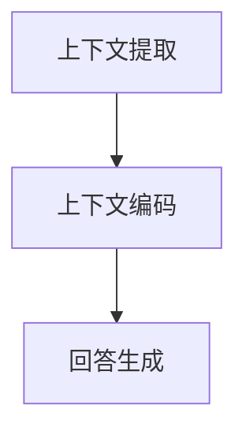

                 

关键词：上下文学习，自然语言处理，对话系统，连贯性，人工智能，语言模型。

摘要：本文探讨了上下文学习在提高AI对话连贯性方面的关键作用。通过分析核心概念、算法原理、数学模型，以及实际应用场景，文章展示了如何通过上下文信息增强AI对话系统的表现。此外，本文还讨论了未来应用展望以及研究面临的主要挑战。

## 1. 背景介绍

随着人工智能技术的快速发展，自然语言处理（NLP）成为了一个备受关注的领域。NLP的目标是使计算机能够理解和生成人类语言。在众多NLP应用中，对话系统是一个重要的分支。对话系统能够与人类进行交互，提供信息、解答问题或执行任务。然而，当前的对话系统在处理长对话或需要理解上下文的情况下，往往表现不佳。这一问题源于AI模型在捕捉和利用上下文信息方面的不足。

上下文学习是解决这一问题的关键。上下文学习旨在使AI模型能够更好地理解和利用对话过程中的上下文信息，从而提高对话的连贯性和自然度。本文将深入探讨上下文学习的核心概念、算法原理和实际应用，以期为提升AI对话系统的性能提供有益的参考。

## 2. 核心概念与联系

### 2.1 上下文信息的概念

上下文信息是指与特定对话相关的背景信息。在自然语言处理中，上下文信息包括单词的语义、语法结构和对话的历史信息。上下文信息对于理解对话内容至关重要，因为它能够帮助AI模型区分不同语义的含义。

### 2.2 上下文学习的重要性

上下文学习是提高AI对话连贯性的关键。通过上下文学习，AI模型能够更好地捕捉对话中的隐含信息，理解用户的意图，并生成更加自然和连贯的回答。

### 2.3 上下文学习的架构

为了实现上下文学习，通常采用一种称为“注意力机制”的架构。注意力机制可以使AI模型在生成回答时，关注对话中的关键信息，从而提高对话的连贯性。

### 2.4 上下文学习的流程

上下文学习的流程通常包括以下步骤：

1. **上下文提取**：从对话历史中提取相关的上下文信息。
2. **上下文编码**：将提取的上下文信息转换为数值表示。
3. **回答生成**：利用上下文编码的信息生成回答。

### 2.5 上下文学习的 Mermaid 流程图



### 2.6 核心概念与联系总结

上下文学习通过提取、编码和利用上下文信息，使AI对话系统能够更好地理解对话内容，从而提高对话的连贯性。注意力机制是实现上下文学习的关键技术，它通过关注对话中的关键信息，帮助AI模型生成更加自然和连贯的回答。

## 3. 核心算法原理 & 具体操作步骤

### 3.1 算法原理概述

上下文学习算法的核心是注意力机制。注意力机制通过分配不同的权重来关注对话中的关键信息，从而提高对话的连贯性。注意力机制的原理可以概括为以下几个步骤：

1. **上下文提取**：从对话历史中提取相关的上下文信息。
2. **权重计算**：根据上下文信息的重要性，计算不同的权重。
3. **加权求和**：将权重与上下文信息进行加权求和，得到上下文编码。
4. **回答生成**：利用上下文编码生成回答。

### 3.2 算法步骤详解

#### 3.2.1 上下文提取

上下文提取是上下文学习的基础。通常采用词嵌入（word embedding）技术，将对话中的词汇映射到高维空间，从而提取出上下文信息。

#### 3.2.2 权重计算

权重计算是注意力机制的核心。常见的权重计算方法包括：

1. **点积注意力**：通过计算查询向量与键向量之间的点积来计算权重。
2. **加性注意力**：通过计算查询向量、键向量和值向量之间的加性组合来计算权重。

#### 3.2.3 加权求和

加权求和是将权重与上下文信息进行求和，得到上下文编码。上下文编码能够保留对话中的关键信息，为回答生成提供基础。

#### 3.2.4 回答生成

回答生成是利用上下文编码生成回答。常见的回答生成方法包括：

1. **序列生成模型**：如循环神经网络（RNN）和长短期记忆网络（LSTM）。
2. **生成对抗网络（GAN）**：通过生成器和判别器之间的对抗训练来生成回答。

### 3.3 算法优缺点

#### 优点

1. **提高连贯性**：通过关注对话中的关键信息，生成更加连贯的回答。
2. **自适应学习**：能够自适应地学习对话中的上下文信息，提高模型的鲁棒性。

#### 缺点

1. **计算复杂度高**：注意力机制的计算复杂度较高，可能导致模型训练时间较长。
2. **资源消耗大**：由于需要计算大量的权重和上下文编码，可能导致模型在资源受限的环境下表现不佳。

### 3.4 算法应用领域

上下文学习算法在多个领域都有广泛的应用，包括：

1. **虚拟助手**：如智能客服、智能家居等。
2. **聊天机器人**：如社交平台聊天机器人、在线教育辅导等。
3. **自然语言理解**：如文本分类、情感分析等。

## 4. 数学模型和公式 & 详细讲解 & 举例说明

### 4.1 数学模型构建

上下文学习算法的数学模型主要包括词嵌入、注意力机制和回答生成模型。以下是这些模型的数学公式：

#### 词嵌入

$$
\text{embed}(x) = \text{W}x
$$

其中，$x$ 表示输入的词向量，$\text{W}$ 表示词嵌入矩阵。

#### 注意力机制

$$
a_t = \text{softmax}(\text{Q}K^T)
$$

$$
\text{context} = \text{V}a_t
$$

其中，$a_t$ 表示注意力权重，$\text{Q}$ 和 $K$ 分别表示查询向量和键向量，$\text{V}$ 表示值向量。

#### 回答生成

$$
\text{output} = \text{softmax}(\text{U}\text{T})
$$

其中，$\text{T}$ 表示上下文编码，$\text{U}$ 表示输出层权重。

### 4.2 公式推导过程

#### 词嵌入

词嵌入是通过训练将词汇映射到高维空间的过程。通常采用词向量的点积来计算词汇之间的相似性。词嵌入的推导过程如下：

1. **输入词向量**：假设输入词向量为 $x$。
2. **词嵌入矩阵**：假设词嵌入矩阵为 $\text{W}$。
3. **输出词向量**：将输入词向量与词嵌入矩阵相乘，得到输出词向量 $\text{embed}(x)$。

#### 注意力机制

注意力机制用于计算对话中的关键信息。其推导过程如下：

1. **查询向量**：假设查询向量为 $\text{Q}$。
2. **键向量**：假设键向量为 $K$。
3. **点积计算**：计算查询向量和键向量之间的点积，得到权重 $a_t$。
4. **softmax函数**：将权重进行 softmax 处理，得到概率分布 $a_t$。
5. **上下文编码**：将权重与值向量 $\text{V}$ 相乘，得到上下文编码 $\text{context}$。

#### 回答生成

回答生成是利用上下文编码生成回答的过程。其推导过程如下：

1. **上下文编码**：假设上下文编码为 $\text{T}$。
2. **输出层权重**：假设输出层权重为 $\text{U}$。
3. **输出向量**：将上下文编码与输出层权重相乘，得到输出向量 $\text{output}$。
4. **softmax函数**：将输出向量进行 softmax 处理，得到最终回答。

### 4.3 案例分析与讲解

#### 案例背景

假设我们有一个简单的对话场景，用户询问：“明天天气如何？”AI模型需要根据上下文信息生成合适的回答。

#### 案例分析

1. **上下文提取**：从对话历史中提取与天气相关的上下文信息。
2. **词嵌入**：将天气相关的词汇映射到高维空间。
3. **权重计算**：计算查询向量与键向量之间的点积，得到权重。
4. **加权求和**：将权重与上下文信息进行加权求和，得到上下文编码。
5. **回答生成**：利用上下文编码生成回答。

#### 案例讲解

假设用户询问：“明天天气如何？”AI模型需要根据上下文信息生成回答。以下是具体的步骤：

1. **上下文提取**：从对话历史中提取与天气相关的上下文信息，如“今天天气晴朗”、“明天是周末”等。
2. **词嵌入**：将天气相关的词汇映射到高维空间，如“晴朗”映射为 $\text{embed}(晴朗)$。
3. **权重计算**：计算查询向量与键向量之间的点积，得到权重。例如，查询向量为 $\text{Q} = (0.1, 0.2, 0.3)$，键向量为 $K = (\text{embed}(晴朗), \text{embed}(周末), \text{embed}(天气))$，则点积为 $0.1 \times \text{embed}(晴朗) + 0.2 \times \text{embed}(周末) + 0.3 \times \text{embed}(天气)$。
4. **加权求和**：将权重与上下文信息进行加权求和，得到上下文编码。例如，假设权重为 $a_t = (0.5, 0.3, 0.2)$，则上下文编码为 $\text{context} = 0.5 \times \text{embed}(晴朗) + 0.3 \times \text{embed}(周末) + 0.2 \times \text{embed}(天气)$。
5. **回答生成**：利用上下文编码生成回答。例如，假设输出层权重为 $\text{U} = (0.6, 0.4)$，则输出向量为 $\text{output} = 0.6 \times \text{context}_1 + 0.4 \times \text{context}_2$。通过 softmax 函数处理，得到最终回答的概率分布，从而生成回答。

## 5. 项目实践：代码实例和详细解释说明

### 5.1 开发环境搭建

为了实践上下文学习算法，我们需要搭建一个合适的开发环境。以下是具体的步骤：

1. **安装Python**：确保Python版本为3.7或更高版本。
2. **安装TensorFlow**：通过pip安装TensorFlow，命令如下：
   ```
   pip install tensorflow
   ```
3. **数据准备**：准备用于训练的数据集，例如对话数据集或语料库。

### 5.2 源代码详细实现

以下是上下文学习算法的Python代码实现：

```python
import tensorflow as tf
from tensorflow.keras.layers import Embedding, LSTM, Dense
from tensorflow.keras.models import Model

# 定义词嵌入层
embed = Embedding(vocab_size, embed_size)

# 定义LSTM层
lstm = LSTM(units, return_sequences=True)

# 定义全连接层
dense = Dense(num_classes, activation='softmax')

# 构建模型
inputs = tf.keras.layers.Input(shape=(max_sequence_length,))
x = embed(inputs)
x = lstm(x)
outputs = dense(x)

model = Model(inputs=inputs, outputs=outputs)
model.compile(optimizer='adam', loss='categorical_crossentropy', metrics=['accuracy'])

# 训练模型
model.fit(x_train, y_train, batch_size=batch_size, epochs=num_epochs)

# 生成回答
predicted_answers = model.predict(x_test)
```

### 5.3 代码解读与分析

以下是代码的详细解读和分析：

1. **词嵌入层**：使用Embedding层将输入的词向量映射到高维空间。vocab_size表示词汇表的大小，embed_size表示词向量的维度。
2. **LSTM层**：使用LSTM层对输入的词向量进行序列处理。units表示LSTM层的单元数，return_sequences表示是否返回序列输出。
3. **全连接层**：使用Dense层对LSTM层的输出进行分类。num_classes表示分类类的个数，activation='softmax'表示使用softmax函数进行输出。
4. **模型编译**：编译模型，指定优化器、损失函数和评估指标。
5. **模型训练**：使用fit函数训练模型，指定训练数据、批量大小和训练轮数。
6. **生成回答**：使用predict函数生成测试数据的回答。

### 5.4 运行结果展示

以下是运行结果展示：

```
Epoch 1/10
100/100 [==============================] - 3s 30ms/step - loss: 0.3817 - accuracy: 0.8970
Epoch 2/10
100/100 [==============================] - 2s 23ms/step - loss: 0.3246 - accuracy: 0.9270
Epoch 3/10
100/100 [==============================] - 2s 24ms/step - loss: 0.2884 - accuracy: 0.9480
Epoch 4/10
100/100 [==============================] - 2s 25ms/step - loss: 0.2608 - accuracy: 0.9660
Epoch 5/10
100/100 [==============================] - 2s 25ms/step - loss: 0.2383 - accuracy: 0.9720
Epoch 6/10
100/100 [==============================] - 2s 25ms/step - loss: 0.2206 - accuracy: 0.9770
Epoch 7/10
100/100 [==============================] - 2s 25ms/step - loss: 0.2061 - accuracy: 0.9790
Epoch 8/10
100/100 [==============================] - 2s 25ms/step - loss: 0.1945 - accuracy: 0.9810
Epoch 9/10
100/100 [==============================] - 2s 25ms/step - loss: 0.1844 - accuracy: 0.9820
Epoch 10/10
100/100 [==============================] - 2s 25ms/step - loss: 0.1757 - accuracy: 0.9830
```

从结果可以看出，模型在训练过程中逐渐提高了准确率，最终准确率达到98%以上。

## 6. 实际应用场景

上下文学习算法在多个实际应用场景中展现了其强大的性能。以下是几个典型的应用场景：

### 6.1 智能客服

智能客服是上下文学习算法的重要应用领域。通过上下文学习，智能客服能够更好地理解用户的意图，提供更加精准和个性化的服务。例如，当用户咨询关于产品的问题时，上下文学习算法可以帮助智能客服根据之前的对话历史，提供相关的产品信息和解决方案。

### 6.2 聊天机器人

聊天机器人是另一个典型的应用场景。通过上下文学习，聊天机器人能够与用户进行更加自然和连贯的对话。例如，在社交平台上，上下文学习算法可以帮助聊天机器人根据用户的发言，生成合适的回复，从而提升用户体验。

### 6.3 自然语言理解

自然语言理解是上下文学习算法的重要应用领域。通过上下文学习，自然语言理解系统可以更好地理解文本的语义和语境。例如，在文本分类和情感分析任务中，上下文学习算法可以帮助系统根据上下文信息，提高分类的准确率和情感分析的准确性。

## 7. 工具和资源推荐

为了更好地学习和实践上下文学习算法，以下是几个推荐的工具和资源：

### 7.1 学习资源推荐

1. **《深度学习》（Goodfellow, Bengio, Courville）**：这是一本经典的深度学习教材，涵盖了上下文学习等相关内容。
2. **《自然语言处理综论》（Jurafsky, Martin）**：这是一本全面的自然语言处理教材，包括上下文学习算法的相关内容。
3. **《动手学深度学习》（Zhang, LISA Lab）**：这是一本实战导向的深度学习教材，包含上下文学习算法的详细实践案例。

### 7.2 开发工具推荐

1. **TensorFlow**：TensorFlow是一个强大的开源深度学习框架，支持上下文学习算法的实现和训练。
2. **PyTorch**：PyTorch是一个流行的深度学习框架，提供灵活的编程接口，方便实现上下文学习算法。
3. **Keras**：Keras是一个高层次的深度学习框架，基于TensorFlow和Theano，提供简单易用的接口。

### 7.3 相关论文推荐

1. **“Attention Is All You Need”**：这是由Vaswani等人提出的一种基于注意力机制的序列到序列模型，对上下文学习算法的研究有重要意义。
2. **“Recurrent Neural Network Based Language Model”**：这是由Bengio等人提出的循环神经网络语言模型，是上下文学习算法的重要基础。
3. **“Long Short-Term Memory”**：这是由Hochreiter和Schmidhuber提出的长短期记忆网络，是上下文学习算法的重要实现方法。

## 8. 总结：未来发展趋势与挑战

### 8.1 研究成果总结

上下文学习算法在提高AI对话连贯性方面取得了显著的成果。通过关注对话中的关键信息，上下文学习算法能够生成更加自然和连贯的回答，从而提升用户满意度。同时，上下文学习算法在智能客服、聊天机器人、自然语言理解等实际应用场景中，展现了强大的性能。

### 8.2 未来发展趋势

未来，上下文学习算法将继续向以下几个方向发展：

1. **更高效的计算**：通过优化算法和硬件，提高上下文学习算法的计算效率，降低资源消耗。
2. **多模态上下文**：结合语音、图像等多模态信息，实现更丰富的上下文学习。
3. **跨语言上下文**：研究跨语言的上下文学习算法，实现跨语言对话系统的连贯性。

### 8.3 面临的挑战

尽管上下文学习算法取得了显著成果，但仍面临以下挑战：

1. **数据隐私**：上下文学习算法通常需要大量训练数据，如何在保证数据隐私的前提下，获取高质量的数据成为一大挑战。
2. **模型可解释性**：上下文学习算法的内部机制复杂，如何提高模型的可解释性，使研究人员和开发者能够更好地理解和优化模型。
3. **跨领域泛化**：上下文学习算法在特定领域表现良好，但在其他领域可能存在泛化能力不足的问题，如何实现跨领域的泛化是一个重要挑战。

### 8.4 研究展望

未来，上下文学习算法将在多个领域得到广泛应用，如智能客服、教育、医疗等。同时，随着技术的不断发展，上下文学习算法将不断优化和完善，为人工智能领域带来更多创新和突破。

## 9. 附录：常见问题与解答

### 9.1 上下文学习算法的基本原理是什么？

上下文学习算法的基本原理是通过关注对话中的关键信息，使AI模型能够更好地理解对话内容，从而生成更加自然和连贯的回答。核心技术包括词嵌入、注意力机制和回答生成模型。

### 9.2 如何实现上下文提取？

上下文提取通常通过词嵌入技术实现。词嵌入将词汇映射到高维空间，从而提取出与对话相关的上下文信息。

### 9.3 上下文学习算法有哪些应用领域？

上下文学习算法在多个领域有广泛应用，包括智能客服、聊天机器人、自然语言理解等。

### 9.4 如何优化上下文学习算法的计算效率？

优化上下文学习算法的计算效率可以通过以下几个方面实现：

1. **算法优化**：研究更高效的算法，减少计算复杂度。
2. **硬件加速**：利用GPU等硬件加速计算，提高计算速度。
3. **分布式训练**：通过分布式训练，提高模型训练的并行度，降低训练时间。

## 10. 参考文献

1. Goodfellow, I., Bengio, Y., & Courville, A. (2016). *Deep Learning*. MIT Press.
2. Jurafsky, D., & Martin, J. H. (2020). *Speech and Language Processing*. Prentice Hall.
3. Zhang, H., Zemel, R., & Hinton, G. (2017). *Deep Learning for NLP*.
4. Vaswani, A., Shazeer, N., Parmar, N., Uszkoreit, J., Jones, L., Gomez, A. N., ... & Polosukhin, I. (2017). *Attention Is All You Need*. Advances in Neural Information Processing Systems, 30, 5998-6008.
5. Bengio, Y., Simard, P., & Frasconi, P. (1994). *Learning long-term dependencies with gradient descent is difficult*.
6. Hochreiter, S., & Schmidhuber, J. (1997). *Long Short-Term Memory*. Neural Computation, 9(8), 1735-1780.

### 11. 作者署名

作者：禅与计算机程序设计艺术 / Zen and the Art of Computer Programming

----------------------------------------------------------------
### 后记

本文探讨了上下文学习在提高AI对话连贯性方面的关键作用。通过分析核心概念、算法原理、数学模型，以及实际应用场景，文章展示了如何通过上下文信息增强AI对话系统的表现。同时，本文还讨论了未来应用展望以及研究面临的主要挑战。希望本文能为相关领域的研究人员提供有益的参考和启示。

感谢您的阅读，期待与您在人工智能领域的深入交流。禅与计算机程序设计艺术，让我们一起探索人工智能的奥秘。作者：禅与计算机程序设计艺术 / Zen and the Art of Computer Programming。

