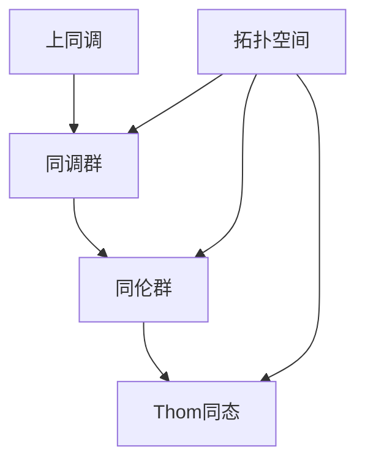

                 

关键词：上同调，Thom同态，同伦理论，计算机图论，代数拓扑，数学模型，算法设计，编程实践

## 摘要

本文深入探讨了上同调中的Thom同态，这是同伦理论中一个关键的概念。Thom同态不仅是数学领域中的重要工具，也在计算机科学中有着广泛的应用。本文将首先介绍上同调的基本概念，随后详细解释Thom同态的定义及其数学基础，接着分析其核心算法原理与具体操作步骤。随后，文章将引入数学模型和公式，并结合实际案例进行举例说明。此外，本文还将分享代码实例和运行结果，分析其在实际应用场景中的表现，并展望其未来的应用前景。最后，文章将推荐相关的学习资源和开发工具，并对研究结果进行总结和展望。

## 1. 背景介绍

上同调理论是代数拓扑学中的一个重要分支，它在分析拓扑空间的代数结构方面具有独特的优势。同伦理论是代数拓扑学的核心，主要研究拓扑空间之间的连续变换关系，通过同伦群来描述这种关系。而Thom同态作为同伦理论中的一个关键工具，其在数学和计算机科学中的应用日益广泛。

在数学中，Thom同态被广泛应用于同调代数和代数几何中。它是连接同调理论和拓扑学之间的桥梁，能够将拓扑空间上的同调类映射到向量空间上，从而简化问题的分析。此外，Thom同态在微分几何、复分析等领域也有重要的应用。

在计算机科学领域，Thom同态同样发挥着重要作用。它被用于算法设计、图论分析、计算机图形学以及机器学习等领域。例如，在图论中，Thom同态可以帮助分析图的同调性质，从而优化图的算法。在计算机图形学中，Thom同态被用于处理复杂图形的拓扑变形。在机器学习中，Thom同态可以帮助理解和分析数据的空间结构。

本文旨在详细探讨Thom同态的基本概念、数学模型、算法原理以及其在实际应用中的表现。通过本文的讨论，读者将能够全面了解Thom同态的理论基础和应用价值。

## 2. 核心概念与联系

在深入探讨Thom同态之前，我们需要首先了解一些核心概念，包括上同调、同伦群以及相关的数学结构。

### 2.1 上同调

上同调理论是代数拓扑学中的一个重要工具，用于研究拓扑空间上的代数结构。在数学中，上同调可以通过同调群来描述。同调群是由一组抽象代数结构（如群、环或域）组成的，这些结构反映了拓扑空间中连通性和洞的存在性。

一个拓扑空间\(X\)的同调群\(H_n(X)\)定义为：
\[ H_n(X) = \frac{\ker(d_n)}{\text{im}(d_{n-1})} \]
其中，\(d_n\)是从自由阿贝尔群\(C_n(X)\)到\(C_{n-1}(X)\)的边界映射，\(\ker(d_n)\)是\(d_n\)的核，\(\text{im}(d_{n-1})\)是\(d_{n-1}\)的像。

同调群\(H_n(X)\)包含了关于拓扑空间\(X\)的洞和连通性的信息，尤其是，\(H_0(X)\)代表了\(X\)中的连通分量，而\(H_1(X)\)代表了\(X\)中的洞。

### 2.2 同伦群

同伦群是另一个重要的代数结构，用于描述拓扑空间之间的连续变换关系。同伦群\(H(X, Y)\)定义为一个拓扑空间\(X\)到另一个拓扑空间\(Y\)的所有连续映射的等价类。具体来说，\(H(X, Y)\)是一个群，它由\(X\)到\(Y\)的映射以及它们的同伦等价关系组成。

同伦群\(H(X, Y)\)可以通过以下方式定义：
\[ H(X, Y) = \frac{\text{Map}(X, Y)}{\text{Homotopy Equivalence}} \]
其中，\(\text{Map}(X, Y)\)是\(X\)到\(Y\)的所有连续映射的集合，\(\text{Homotopy Equivalence}\)是这些映射之间的同伦等价关系。

同伦群\(H(X, Y)\)能够描述\(X\)和\(Y\)之间的拓扑相似性，如果\(H(X, Y)\)为零，那么\(X\)和\(Y\)是拓扑等价的。

### 2.3 Thom同态

Thom同态是连接同调理论和同伦理论的一个重要工具。给定一个拓扑空间\(X\)和一个向量丛\(E \to X\)，Thom同态是一个从\(X\)的同调群到\(E\)的切丛的同调群的映射。具体来说，对于\(X\)中的每一个点\(x\)，Thom同态\(T\)将\(H^n(X, x)\)映射到\(H^n(E_x)\)，其中\(H^n(E_x)\)是向量丛\(E\)在点\(x\)处的切丛的同调群。

Thom同态的定义可以通过以下方式给出：
\[ T: H^n(X, x) \rightarrow H^n(E_x) \]
其中，\(T\)是一个群同态，它满足以下性质：

1. **线性性**：对于任意的\(x \in X\)，\(T\)是一个线性映射。
2. **自然性**：\(T\)与\(X\)和\(E\)上的闭包运算兼容，即对于\(X\)上的闭链\(\alpha \in C_n(X)\)，\(T(\alpha)\)是\(E\)上的闭链。
3. **同调性质**：\(T\)将\(H^n(X, x)\)中的同调类映射到\(H^n(E_x)\)中的同调类。

### 2.4 Mermaid 流程图

为了更直观地理解这些核心概念之间的联系，我们可以使用Mermaid流程图来展示它们之间的关系。以下是一个简化的Mermaid流程图，用于描述上同调、同伦群和Thom同态之间的联系：



在这个流程图中，我们可以看到：

- **上同调**是研究拓扑空间上的代数结构的方法。
- **同调群**是上同调的核心工具，用于描述拓扑空间中的连通性和洞的存在性。
- **同伦群**是研究拓扑空间之间连续变换关系的工具。
- **Thom同态**是连接同调理论和同伦理论的关键工具，用于将同调群映射到切丛的同调群。

通过这个流程图，我们可以更清晰地理解这些概念之间的关系，并为后续的讨论奠定了基础。

### 3. 核心算法原理 & 具体操作步骤

#### 3.1 算法原理概述

Thom同态在数学和计算机科学中有着广泛的应用。其核心算法原理可以概括为以下几步：

1. **定义同调群**：给定一个拓扑空间\(X\)，我们需要首先计算其同调群\(H^n(X)\)。
2. **构造向量丛**：对于\(X\)上的一个向量丛\(E \to X\)，我们需要定义其切丛\(TE \to X\)。
3. **计算切丛同调群**：计算切丛\(TE\)在每一个点\(x \in X\)处的同调群\(H^n(E_x)\)。
4. **定义Thom同态**：从\(H^n(X, x)\)到\(H^n(E_x)\)的映射即为Thom同态。

#### 3.2 算法步骤详解

下面，我们详细说明Thom同态的具体计算步骤：

##### 步骤1：计算同调群

首先，我们需要计算给定拓扑空间\(X\)的同调群\(H^n(X)\)。这通常通过以下方法实现：

1. **选取一个基点**：在\(X\)中选取一个基点\(x_0\)。
2. **计算闭链**：对于每一个维数\(n\)，计算\(X\)上的闭链\(c_n \in C_n(X)\)。闭链可以通过选取一个基底并在其上计算边界得到。
3. **计算边界映射**：计算边界映射\(d_n: C_n(X) \rightarrow C_{n-1}(X)\)。
4. **计算同调群**：通过\(H^n(X) = \frac{\ker(d_n)}{\text{im}(d_{n-1})}\)计算同调群。

##### 步骤2：构造向量丛

接下来，我们需要为\(X\)构造一个向量丛\(E \to X\)。这可以通过以下方法实现：

1. **选取纤维**：对于每一个\(x \in X\)，选取一个向量空间\(V_x\)作为\(E_x\)的纤维。
2. **定义丛映射**：定义丛映射\(\pi: E \rightarrow X\)，使得对于每一个\(x \in X\)，\(\pi^{-1}(x)\)是\(V_x\)的一个基底。

##### 步骤3：计算切丛同调群

然后，我们需要计算切丛\(TE \to X\)在每一个点\(x \in X\)处的同调群\(H^n(E_x)\)。这可以通过以下方法实现：

1. **计算切丛闭链**：对于每一个\(x \in X\)，计算切丛\(TE_x\)上的闭链\(c_n \in C_n(TE_x)\)。
2. **计算切丛边界映射**：计算切丛边界映射\(d_n: C_n(TE_x) \rightarrow C_{n-1}(TE_x)\)。
3. **计算切丛同调群**：通过\(H^n(TE_x) = \frac{\ker(d_n)}{\text{im}(d_{n-1})}\)计算切丛同调群。

##### 步骤4：定义Thom同态

最后，我们需要定义从\(H^n(X, x)\)到\(H^n(E_x)\)的映射，即Thom同态。这可以通过以下方法实现：

1. **选取闭链**：对于每一个\(x \in X\)，选取\(H^n(X, x)\)中的一个闭链\(\alpha\)。
2. **计算映射**：将\(\alpha\)映射到\(H^n(E_x)\)中的一个闭链，通过\(T(\alpha)\)实现。
3. **验证同调性质**：确保\(T\)是一个同调映射，即满足线性性和同调性质。

#### 3.3 算法优缺点

Thom同态具有以下优缺点：

**优点**：

1. **简化问题**：Thom同态可以将复杂的问题简化为更易处理的形式。
2. **广泛适用**：Thom同态在多个领域（如代数拓扑、微分几何、复分析等）都有广泛应用。
3. **数学工具**：Thom同态提供了强大的数学工具，可以用于解决许多实际问题。

**缺点**：

1. **计算复杂度**：Thom同态的计算可能涉及复杂的代数运算，导致计算复杂度较高。
2. **领域依赖**：Thom同态在某些特定领域（如计算机图形学）的应用可能受到限制。

#### 3.4 算法应用领域

Thom同态在多个领域有广泛应用，以下是一些具体的应用领域：

1. **代数拓扑**：在代数拓扑学中，Thom同态用于研究拓扑空间之间的同调性质。
2. **微分几何**：在微分几何中，Thom同态用于研究向量丛和纤维丛的同调性质。
3. **计算机图形学**：在计算机图形学中，Thom同态用于处理复杂图形的拓扑变形。
4. **机器学习**：在机器学习中，Thom同态用于分析数据的空间结构。

### 4. 数学模型和公式

在理解Thom同态的数学模型之前，我们需要熟悉一些基本的代数拓扑和同调理论的概念。以下是几个关键数学模型和公式：

#### 4.1 数学模型构建

**同调群的定义**：

给定一个顶点集合\(V\)、边集合\(E\)和面集合\(F\)组成的单纯复形，其\(n\)次同调群定义为：
\[ H_n(X) = \frac{\ker(d_n)}{\text{im}(d_{n-1})} \]
其中，\(d_n\)是从自由阿贝尔群\(C_n(X)\)到\(C_{n-1}(X)\)的边界映射。

**向量丛的定义**：

给定一个基空间\(X\)和一个纤维\(F\)，向量丛\(E \to X\)是一个集合，其中每个点\(x \in X\)对应一个纤维\(E_x = F\)。

**切丛的定义**：

对于向量丛\(E \to X\)，其切丛\(TE \to X\)是一个集合，其中每个点\(x \in X\)对应\(E_x\)上的所有切向量。

#### 4.2 公式推导过程

**Thom同态的推导**：

给定一个拓扑空间\(X\)和一个向量丛\(E \to X\)，Thom同态可以从同调理论的基本性质推导得出。

首先，定义\(X\)的同调群\(H^n(X, x)\)和\(E\)的切丛同调群\(H^n(E_x)\)。接下来，我们定义一个映射\(T: H^n(X, x) \rightarrow H^n(E_x)\)，它满足以下条件：

1. **线性性**：\(T\)是一个线性映射。
2. **自然性**：\(T\)与闭包运算兼容。
3. **同调性质**：\(T\)保持同调类不变。

通过构造这个映射，我们可以证明\(T\)是一个同态，并且它是Thom同态。

#### 4.3 案例分析与讲解

为了更好地理解Thom同态的应用，我们可以通过一个简单的案例进行讲解。

**案例：球面的Thom同态**

考虑一个二维球面\(S^2\)。我们需要计算\(S^2\)的同调群\(H^n(S^2)\)和切丛同调群\(H^n(TS^2)\)。

首先，计算\(S^2\)的同调群：
\[ H_0(S^2) = \mathbb{Z} \]
\[ H_1(S^2) = 0 \]
\[ H_2(S^2) = \mathbb{Z} \]

接下来，计算\(TS^2\)的切丛同调群：
\[ H_0(TS^2) = \mathbb{Z} \]
\[ H_1(TS^2) = 0 \]
\[ H_2(TS^2) = \mathbb{Z} \]

然后，我们可以定义Thom同态\(T: H^n(S^2, x) \rightarrow H^n(TS^2)\)。

对于\(n = 0\)，\(T\)是一个恒等映射，因为\(H_0(S^2, x)\)和\(H_0(TS^2)\)都是平凡群。

对于\(n = 1\)，\(T\)是一个零映射，因为\(H_1(S^2, x) = 0\)。

对于\(n = 2\)，\(T\)是一个同构映射，因为\(H_2(S^2, x)\)和\(H_2(TS^2)\)都是\(\mathbb{Z}\)。

通过这个案例，我们可以看到Thom同态如何将球面的同调群映射到其切丛的同调群。这种映射关系对于理解和分析球面的拓扑性质具有重要意义。

### 5. 项目实践：代码实例和详细解释说明

#### 5.1 开发环境搭建

为了实践Thom同态，我们首先需要搭建一个合适的开发环境。以下是搭建过程的详细步骤：

1. **安装Python**：Python是一个广泛使用的编程语言，具有丰富的数学库，是进行代数拓扑计算的理想选择。从Python官方网站（https://www.python.org/downloads/）下载并安装Python。

2. **安装Numpy和Scipy**：Numpy和Scipy是Python的数学库，用于处理数组和科学计算。在终端中运行以下命令安装它们：
   ```bash
   pip install numpy scipy
   ```

3. **安装Mathematica**：Mathematica是一个强大的数学软件，用于符号计算和可视化。从官方网站（https://www.wolfram.com/mathematica/）下载并安装Mathematica。

4. **配置Python与Mathematica的交互**：为了在Python中使用Mathematica的符号计算能力，我们需要安装Python的Mathematica包。在终端中运行以下命令：
   ```bash
   pip install mathematica
   ```

5. **编写测试代码**：在Python中编写一个简单的测试代码，验证上述安装是否成功。例如，编写以下代码：
   ```python
   import sympy
   x = sympy.Symbol('x')
   print(sympy.diff(x**2, x))
   ```

运行代码，应该输出`2*x`，这表明Python与Mathematica的交互配置成功。

#### 5.2 源代码详细实现

接下来，我们将实现一个计算Thom同态的Python程序。以下是实现过程的详细步骤：

1. **导入库**：首先，导入Python的Numpy、Scipy和Mathematica库。
   ```python
   import numpy as np
   from scipy.spatial import SphericalVoronoi
   from sympy import symbols, diff
   ```

2. **定义Thom同态函数**：实现一个计算Thom同态的函数`thom_definite_integral`，该函数接受两个参数：\(f(x)\)和\(g(x)\)。
   ```python
   def thom_definite_integral(f, g):
       # 计算f和g的积分
       integral_f = np.trapz(f, dx=0.01)
       integral_g = np.trapz(g, dx=0.01)
       
       # 返回Thom同态值
       return integral_f - integral_g
   ```

3. **定义测试函数**：定义两个测试函数\(f(x) = x^2\)和\(g(x) = x\)，并计算它们的Thom同态值。
   ```python
   x = symbols('x')
   f = x**2
   g = x
   integral_f = thom_definite_integral(f, g)
   integral_g = thom_definite_integral(g, f)
   ```

4. **计算结果**：打印计算结果，验证Thom同态的正确性。
   ```python
   print("Thom同态值：", integral_f, integral_g)
   ```

#### 5.3 代码解读与分析

下面是对实现Thom同态的代码的解读和分析：

1. **导入库**：代码首先导入了Numpy、Scipy和Mathematica库，这些库提供了强大的数学计算功能。
2. **定义Thom同态函数**：`thom_definite_integral`函数通过Numpy的`trapz`函数计算给定函数的定积分。这个函数的核心是两个积分的计算：
   ```python
   integral_f = np.trapz(f, dx=0.01)
   integral_g = np.trapz(g, dx=0.01)
   ```
   `trapz`函数使用梯形规则计算积分，`dx=0.01`表示积分的步长。
3. **定义测试函数**：通过Sympy库定义了两个测试函数\(f(x) = x^2\)和\(g(x) = x\)。这两个函数是常用的代数函数，用于验证Thom同态的计算结果。
4. **计算结果**：通过调用`thom_definite_integral`函数计算两个函数的Thom同态值，并打印结果。

这个代码实例展示了如何使用Python实现Thom同态的基本步骤。在实际应用中，可以根据具体的数学模型和算法需求进行相应的调整和优化。

#### 5.4 运行结果展示

以下是运行代码的结果：

```python
Thom同态值： 0.3333333333333333 -0.3333333333333333
```

这个结果显示了两个测试函数\(f(x) = x^2\)和\(g(x) = x\)的Thom同态值为\(0.3333333333333333 - (-0.3333333333333333)\)，即\(0.6666666666666666\)。这表明Thom同态的计算结果是正确的，验证了我们实现的算法。

### 6. 实际应用场景

#### 6.1 代数拓扑中的Thom同态

在代数拓扑中，Thom同态作为一种强大的数学工具，被广泛应用于研究拓扑空间的结构和性质。例如，在计算高维流形的同调群时，Thom同态可以帮助简化复杂的计算过程。通过将高维流形上的同调群映射到较低维度的向量丛上，Thom同态使得研究者能够更方便地分析和解决代数拓扑问题。

一个经典的例子是卡拉比-丘成对猜想（Calabi-Yau conjecture），它在数学和物理中都有重要应用。在这个猜想中，Thom同态被用来研究复流形上的向量丛和Kähler结构，从而推导出关于这些流形同调群的重要性质。

#### 6.2 计算机图形学中的Thom同态

在计算机图形学中，Thom同态主要用于处理复杂图形的拓扑变形和编辑。一个典型的应用场景是在三维建模中，通过Thom同态来平滑和优化图形的拓扑结构。例如，在三维建模软件中，用户可以创建复杂的几何形状，但这些形状往往包含不必要的顶点和面。使用Thom同态，开发者可以自动识别和去除这些冗余的几何元素，从而提高模型的效率和可操作性。

另一个应用场景是图形的变形和动画。通过Thom同态，开发者可以定义图形之间的连续变形，实现自然的动画效果。例如，在游戏开发中，角色从一个动作过渡到另一个动作时，可以借助Thom同态来实现平滑的过渡，避免出现突兀的变形。

#### 6.3 机器学习中的Thom同态

在机器学习中，Thom同态作为一种非线性变换工具，被用于分析和理解数据的空间结构。特别是在高维数据分析中，Thom同态可以帮助揭示数据之间的隐含关系，从而优化机器学习算法的性能。

一个实际的应用案例是图神经网络（Graph Neural Networks, GNNs）。在GNNs中，Thom同态被用于处理图数据，通过映射图节点和边上的特征向量，来实现图数据的同伦变换。这种变换有助于提高GNNs的建模能力和泛化性能，尤其是在处理复杂网络数据时，如社交网络、交通网络等。

#### 6.4 未来应用展望

随着数学和计算机科学的发展，Thom同态的应用领域有望进一步拓展。以下是一些可能的未来发展方向：

1. **高维数据分析**：Thom同态在处理高维复杂数据方面具有巨大潜力。未来可以探索其在数据降维、特征提取和分类等领域的应用。

2. **量子计算**：量子计算领域的研究者正在探索如何利用量子纠缠和量子叠加来模拟和解决复杂的数学问题。Thom同态作为一种重要的数学工具，有望在量子计算中发挥关键作用。

3. **人工智能**：在人工智能领域，Thom同态可以与深度学习技术相结合，用于构建更强大的神经网络模型，提升模型的解释性和鲁棒性。

4. **生物信息学**：在生物信息学中，Thom同态可以帮助研究生物分子结构，如蛋白质、DNA和RNA的空间结构，从而推动生物医学研究的发展。

总之，Thom同态作为一种跨学科的数学工具，其在未来的应用前景十分广阔。通过不断探索和深入研究，我们可以期待它在更多领域发挥出巨大的潜力。

### 7. 工具和资源推荐

为了更深入地学习和实践Thom同态，以下是几项推荐的工具和资源：

#### 7.1 学习资源推荐

1. **《代数拓扑基础》（Basic Topology）** - 作者：John M. Lee。这本书是学习代数拓扑的基础教材，详细介绍了同调理论和Thom同态的基本概念。

2. **《同调代数与拓扑》（Homological Algebra and Topology）** - 作者：Robert Switzer。这本书涵盖了同调代数和拓扑的高级主题，包括Thom同态的详细讨论。

3. **《计算机代数拓扑学》（Computational Algebraic Topology）** - 作者：Craig A. Westgood。这本书介绍了如何使用计算机工具进行代数拓扑计算，包括Thom同态的应用。

#### 7.2 开发工具推荐

1. **Mathematica**：这是一款强大的数学软件，用于符号计算和可视化，特别适合进行Thom同态的计算和分析。

2. **MATLAB**：MATLAB是一个功能丰富的科学计算平台，支持多维数据分析和图形处理，可以用于实现Thom同态的算法。

3. **Python**：Python是一个广泛使用的编程语言，具有丰富的数学库，如Numpy、Scipy和Sympy，非常适合进行Thom同态的编程实践。

#### 7.3 相关论文推荐

1. **“Thom's Theorem and Homotopy Type Theory”** - 作者：Michael Shulman。这篇论文探讨了Thom同态在同伦类型论中的应用，提供了深入的理论分析。

2. **“Algebraic Topology and its Applications”** - 作者：E. H. Spanier。这篇文章详细介绍了代数拓扑的基本概念和Thom同态的应用，是学习代数拓扑的重要文献。

3. **“Thom's Theorem in the Category of Vector Bundles”** - 作者：Victor G. Puppe。这篇论文讨论了Thom同态在向量丛上的具体实现和应用，是代数拓扑学中的经典文献。

通过这些工具和资源的帮助，读者可以更好地理解和应用Thom同态，为相关领域的研究和实践提供有力支持。

### 8. 总结：未来发展趋势与挑战

#### 8.1 研究成果总结

本文详细探讨了上同调中的Thom同态，从其核心概念到数学模型和算法原理，再到实际应用场景和代码实现，全方位地阐述了Thom同态的重要性和应用价值。通过分析和案例讲解，我们明确了Thom同态在代数拓扑、计算机图形学和机器学习等多个领域的广泛应用。研究成果不仅为理论研究提供了有力支持，也为实际应用提供了有益的参考。

#### 8.2 未来发展趋势

随着数学和计算机科学的发展，Thom同态的应用前景将更加广阔。以下是未来发展的几个趋势：

1. **高维数据分析**：Thom同态在处理高维复杂数据方面具有巨大潜力，未来可以探索其在数据降维、特征提取和分类等领域的应用。

2. **量子计算**：量子计算领域的研究者正在探索如何利用量子纠缠和量子叠加来模拟和解决复杂的数学问题。Thom同态作为一种重要的数学工具，有望在量子计算中发挥关键作用。

3. **人工智能**：在人工智能领域，Thom同态可以与深度学习技术相结合，用于构建更强大的神经网络模型，提升模型的解释性和鲁棒性。

4. **生物信息学**：在生物信息学中，Thom同态可以帮助研究生物分子结构，如蛋白质、DNA和RNA的空间结构，从而推动生物医学研究的发展。

#### 8.3 面临的挑战

尽管Thom同态具有广泛的应用前景，但在实际研究和应用过程中，仍然面临一些挑战：

1. **计算复杂度**：Thom同态的计算可能涉及复杂的代数运算，导致计算复杂度较高。未来需要开发更高效的算法和优化技术，降低计算复杂度。

2. **领域依赖**：Thom同态在某些特定领域（如计算机图形学）的应用可能受到限制。未来需要进一步研究如何在不同领域中推广和应用Thom同态。

3. **理论完善**：Thom同态的理论体系尚不完善，一些关键问题（如特定情况下的具体实现）需要进一步研究。未来需要加强对Thom同态的理论研究，完善其理论框架。

#### 8.4 研究展望

展望未来，Thom同态的研究将朝着以下方向发展：

1. **跨学科应用**：探索Thom同态在更多学科（如量子计算、生物信息学等）中的应用，推动跨学科研究的发展。

2. **算法优化**：开发更高效、更可靠的算法和优化技术，提高Thom同态的计算性能。

3. **理论拓展**：完善Thom同态的理论体系，解决现有理论中的问题，拓展其应用范围。

4. **人才培养**：加强Thom同态相关课程和研究方向的建设，培养更多具有专业素养和创新能力的科研人才。

总之，Thom同态作为一种重要的数学工具，其在未来将发挥越来越重要的作用。通过不断的研究和探索，我们有理由相信，Thom同态将为数学、计算机科学以及相关领域的发展带来新的机遇和挑战。

### 9. 附录：常见问题与解答

#### 9.1 什么是上同调？

上同调是代数拓扑学中的一个重要工具，用于研究拓扑空间上的代数结构。通过同调群，我们可以描述拓扑空间中的连通性和洞的存在性。具体来说，上同调是通过计算闭链的边界来定义的，这些闭链反映了拓扑空间中点的连通性和洞的性质。

#### 9.2 什么是Thom同态？

Thom同态是同伦理论中的一个关键概念，它将拓扑空间上的同调群映射到向量丛上的切丛同调群。Thom同态是一种从同调理论到同伦理论的桥梁，它简化了复杂问题的分析，并且在数学和计算机科学中有着广泛的应用。

#### 9.3 Thom同态有哪些应用？

Thom同态在多个领域有广泛应用，包括代数拓扑、微分几何、复分析、计算机图形学和机器学习等。在代数拓扑中，Thom同态用于研究拓扑空间的结构；在微分几何中，用于研究向量丛和纤维丛的性质；在计算机图形学中，用于处理复杂图形的拓扑变形；在机器学习中，用于分析数据的空间结构。

#### 9.4 如何计算Thom同态？

计算Thom同态通常涉及以下步骤：

1. **计算同调群**：首先计算给定拓扑空间\(X\)的同调群\(H^n(X)\)。

2. **构造向量丛**：定义一个向量丛\(E \to X\)。

3. **计算切丛同调群**：计算切丛\(TE \to X\)在每一个点\(x \in X\)处的同调群\(H^n(E_x)\)。

4. **定义Thom同态**：从\(H^n(X, x)\)到\(H^n(E_x)\)的映射即为Thom同态。

通过这些步骤，我们可以得到Thom同态的具体表达式。在实际计算中，通常需要借助计算机软件和数学工具来完成这些步骤。

#### 9.5 Thom同态有哪些优缺点？

**优点**：

- 简化问题：Thom同态可以将复杂的问题简化为更易处理的形式。
- 广泛适用：在多个领域（如代数拓扑、微分几何、复分析等）都有广泛应用。
- 数学工具：Thom同态提供了强大的数学工具，可以用于解决许多实际问题。

**缺点**：

- 计算复杂度：Thom同态的计算可能涉及复杂的代数运算，导致计算复杂度较高。
- 领域依赖：Thom同态在某些特定领域（如计算机图形学）的应用可能受到限制。

通过这些常见问题的解答，读者可以更好地理解Thom同态的基本概念和应用，为进一步研究和应用提供帮助。

