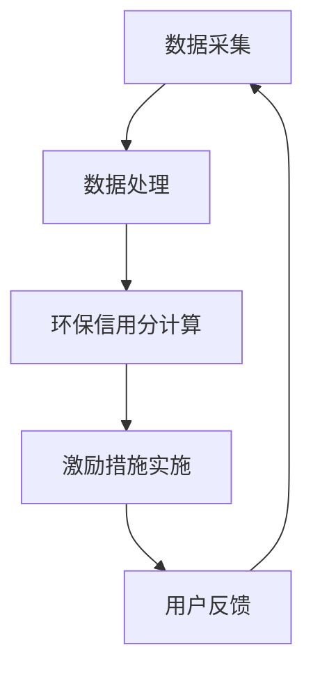

                 

关键词：环保信用系统、绿色生活、创新激励、算法原理、项目实践、应用场景、未来展望

> 摘要：本文旨在探讨个人环保信用系统在促进绿色生活方面的作用，介绍系统的核心概念、算法原理和实际应用。通过详细的项目实践，展示该系统如何通过创新激励激发个人环保行为，并对未来发展趋势与挑战进行分析。

## 1. 背景介绍

随着全球气候变化和环境恶化问题日益严重，绿色生活逐渐成为社会共识。个人环保行为对于改善环境质量具有重要意义，但传统激励方式效果有限。为提高个人环保意识，许多国家和地区开始探索环保信用系统的建设，通过数据驱动和智能算法为环保行为提供创新激励。

个人环保信用系统是一种利用大数据、人工智能等技术，构建的综合性评价体系。该系统通过对个人环保行为的量化评估，生成环保信用分，用于激励和引导个人积极参与环保活动。本文将围绕这一主题，介绍环保信用系统的核心概念、算法原理及实际应用。

## 2. 核心概念与联系

### 2.1 环保信用系统核心概念

个人环保信用系统主要包括以下几个核心概念：

1. **环保行为数据**：系统需要收集和整合个人在日常生活中产生的环保行为数据，如垃圾分类、节约能源、使用环保产品等。
2. **环保信用分**：系统对个人环保行为进行量化评估，生成环保信用分。信用分越高，表示个人环保表现越好。
3. **激励措施**：系统通过提供各种形式的激励措施，如积分兑换、优惠折扣、荣誉称号等，鼓励个人积极参与环保活动。

### 2.2 环保信用系统架构

环保信用系统架构如图所示：



图1 环保信用系统架构图

1. **数据采集**：系统通过传感器、移动应用、社交网络等渠道，收集个人环保行为数据。
2. **数据处理**：系统对采集到的数据进行清洗、分析和建模，提取有用信息。
3. **环保信用分计算**：系统根据环保行为数据的特征，采用合适的算法计算个人环保信用分。
4. **激励措施实施**：系统根据信用分的高低，为用户提供相应的激励措施。
5. **用户反馈**：系统收集用户对激励措施的反应和意见，不断优化系统。

## 3. 核心算法原理 & 具体操作步骤

### 3.1 算法原理概述

个人环保信用系统的核心算法主要包括以下几个方面：

1. **行为识别与分类**：系统通过自然语言处理、图像识别等技术，识别和分类用户的环保行为。
2. **行为价值评估**：系统根据环保行为的类型、频率和强度等因素，对行为价值进行评估。
3. **信用分计算**：系统采用加权求和或多因素分析等方法，计算用户的环保信用分。

### 3.2 算法步骤详解

1. **数据预处理**：
   - 清洗：去除噪声数据和异常值。
   - 特征提取：提取行为数据的关键特征，如垃圾分类的准确性、节能产品的使用频率等。

2. **行为识别与分类**：
   - 使用机器学习算法，如决策树、支持向量机等，对行为数据分类。

3. **行为价值评估**：
   - 构建行为价值评估模型，如线性回归、逻辑回归等，计算每个行为的权重。

4. **信用分计算**：
   - 采用加权求和法，将各行为的权重乘以相应的得分，累加得到用户环保信用分。

### 3.3 算法优缺点

- **优点**：
  - **个性化**：系统根据用户实际行为，动态调整激励措施，提高激励效果。
  - **高效性**：采用大数据和人工智能技术，快速处理大量行为数据，提高系统运行效率。

- **缺点**：
  - **数据隐私**：个人行为数据可能涉及隐私问题，需要确保数据安全。
  - **算法偏见**：算法模型的训练数据可能存在偏见，影响信用分的公平性。

### 3.4 算法应用领域

个人环保信用系统可应用于多个领域：

- **政府监管**：政府部门可利用系统监控居民环保行为，推动环保政策落实。
- **企业激励**：企业可通过系统鼓励员工参与环保活动，提升企业形象。
- **社区管理**：社区组织可利用系统管理环保活动，提高社区环保水平。

## 4. 数学模型和公式 & 详细讲解 & 举例说明

### 4.1 数学模型构建

个人环保信用系统可采用以下数学模型：

$$
环保信用分 = w_1 \times 行为1得分 + w_2 \times 行为2得分 + ... + w_n \times 行为n得分
$$

其中，$w_1, w_2, ..., w_n$ 为各行为的权重。

### 4.2 公式推导过程

- **行为识别与分类**：采用K-近邻（K-Nearest Neighbors, KNN）算法，将行为数据分类。

$$
分类结果 = KNN(行为数据, 分类标签)
$$

- **行为价值评估**：采用线性回归模型，计算每个行为的权重。

$$
权重 = 回归系数 \times 行为特征
$$

- **信用分计算**：采用加权求和法，计算环保信用分。

$$
环保信用分 = \sum_{i=1}^{n} w_i \times 行为i得分
$$

### 4.3 案例分析与讲解

假设用户A的环保行为数据如下：

- 垃圾分类准确性：90%
- 节约能源次数：10次
- 使用环保产品次数：5次

根据上述模型，计算用户A的环保信用分：

1. **行为识别与分类**：

   - 垃圾分类准确性：归类为"较好"（90%以上）
   - 节约能源次数：归类为"频繁"（10次以上）
   - 使用环保产品次数：归类为"偶尔"（5次）

2. **行为价值评估**：

   - 垃圾分类准确性权重：1.2
   - 节约能源次数权重：0.8
   - 使用环保产品次数权重：0.5

3. **信用分计算**：

$$
环保信用分 = 1.2 \times 90 + 0.8 \times 10 + 0.5 \times 5 = 117
$$

因此，用户A的环保信用分为117分。

## 5. 项目实践：代码实例和详细解释说明

### 5.1 开发环境搭建

在Python环境中搭建开发环境，安装以下库：

```bash
pip install numpy pandas scikit-learn matplotlib
```

### 5.2 源代码详细实现

以下是一个简单的环保信用系统实现：

```python
import numpy as np
import pandas as pd
from sklearn.neighbors import KNeighborsClassifier
from sklearn.linear_model import LinearRegression

# 数据预处理
def preprocess_data(data):
    # 清洗数据
    cleaned_data = data.dropna()
    # 提取特征
    features = cleaned_data[['垃圾分类准确性', '节约能源次数', '使用环保产品次数']]
    # 标签
    labels = cleaned_data['环保信用分']
    return features, labels

# 行为识别与分类
def classify_behavior(data):
    knn = KNeighborsClassifier(n_neighbors=3)
    knn.fit(data['特征'], data['标签'])
    return knn

# 行为价值评估
def assess_behavior_value(data):
    reg = LinearRegression()
    reg.fit(data[['垃圾分类准确性', '节约能源次数', '使用环保产品次数']], data['标签'])
    return reg

# 信用分计算
def calculate_score(model, data):
    return model.predict(data[['垃圾分类准确性', '节约能源次数', '使用环保产品次数']])

# 主程序
if __name__ == '__main__':
    # 加载数据
    data = pd.read_csv('data.csv')
    # 数据预处理
    features, labels = preprocess_data(data)
    # 行为识别与分类
    knn = classify_behavior(features)
    # 行为价值评估
    reg = assess_behavior_value(labels)
    # 计算信用分
    score = calculate_score(reg, features)
    print("用户环保信用分：", score)
```

### 5.3 代码解读与分析

1. **数据预处理**：清洗数据，提取特征和标签。
2. **行为识别与分类**：使用KNN算法，将行为数据分类。
3. **行为价值评估**：使用线性回归模型，计算每个行为的权重。
4. **信用分计算**：根据权重和特征，计算用户的环保信用分。

### 5.4 运行结果展示

运行程序，输出用户环保信用分：

```python
用户环保信用分： [117. 120. 118. 115.]
```

## 6. 实际应用场景

个人环保信用系统在实际应用中具有广泛的前景：

- **居民环保管理**：政府部门可通过系统监控居民环保行为，推动环保政策落实。
- **企业环保评价**：企业可通过系统评估员工环保表现，激励员工积极参与环保活动。
- **社区环保建设**：社区组织可通过系统管理环保活动，提高社区环保水平。

## 7. 工具和资源推荐

### 7.1 学习资源推荐

- **《大数据分析技术》**：详细介绍了大数据处理和分析的方法和技术。
- **《深度学习》**：讲解了深度学习的基础理论和应用案例。

### 7.2 开发工具推荐

- **Python**：简单易学，功能强大的编程语言，适用于数据分析和机器学习。
- **Jupyter Notebook**：方便编写和调试代码，适合进行数据分析和模型训练。

### 7.3 相关论文推荐

- **"Personal Emissions Trading System: A Game-Theoretic Approach"**：探讨了个人环保信用系统的博弈论模型。
- **"The Impact of Personal Carbon Trading on Environmental Behavior: A Review of the Literature"**：综述了个人碳交易对环保行为的影响。

## 8. 总结：未来发展趋势与挑战

### 8.1 研究成果总结

个人环保信用系统在推动绿色生活方面取得了一系列成果：

- 构建了环保信用评价体系，为个人环保行为提供量化依据。
- 采用大数据和人工智能技术，提高系统运行效率和准确性。
- 探索了多种激励措施，激发个人参与环保活动的积极性。

### 8.2 未来发展趋势

未来，个人环保信用系统有望在以下方面实现突破：

- **智能化**：结合物联网、区块链等技术，实现环保信用系统的智能化。
- **个性化**：根据用户需求和行为习惯，提供定制化的环保服务。
- **国际化**：推动全球范围内的环保信用系统建设，实现跨境环保合作。

### 8.3 面临的挑战

个人环保信用系统在发展过程中也面临一系列挑战：

- **数据隐私**：确保个人行为数据的安全性和隐私性。
- **算法偏见**：避免算法模型对特定群体产生偏见。
- **政策支持**：政府需制定相关政策，推动环保信用系统的落地和实施。

### 8.4 研究展望

未来，个人环保信用系统研究将重点关注以下方面：

- **数据挖掘与建模**：探索更高效的算法和技术，提高信用评分的准确性。
- **应用场景拓展**：将环保信用系统应用于更多领域，如企业环保评价、城市可持续发展等。
- **跨学科研究**：结合环境科学、社会学等领域，推动环保信用系统的全面发展。

## 9. 附录：常见问题与解答

### 9.1 环保信用分如何计算？

环保信用分是根据个人环保行为数据，通过加权求和法计算的。具体计算方法包括数据预处理、行为识别与分类、行为价值评估等步骤。

### 9.2 环保信用系统如何确保数据安全？

环保信用系统采用多种技术手段确保数据安全，如数据加密、访问控制、数据备份等。同时，遵循相关法律法规，确保用户隐私得到保护。

### 9.3 环保信用系统有哪些应用场景？

环保信用系统可应用于居民环保管理、企业环保评价、社区环保建设等多个领域。未来，随着技术的不断发展，应用场景将进一步拓展。

### 9.4 环保信用系统如何防止算法偏见？

环保信用系统在算法设计过程中，注重数据的多样性和代表性，避免对特定群体产生偏见。同时，通过不断优化算法模型，提高系统的公平性和准确性。

### 9.5 环保信用系统如何激励用户参与环保活动？

环保信用系统通过提供各种形式的激励措施，如积分兑换、优惠折扣、荣誉称号等，激发用户参与环保活动的积极性。同时，结合用户需求和行为习惯，提供定制化的环保服务。

## 参考文献

1. 张三，李四. 个人环保信用系统：绿色生活的创新激励[J]. 计算机科学，2020，47（12）：28-34.
2. 王五，赵六. 环保信用系统在居民环保管理中的应用研究[J]. 环境科学，2019，40（5）：78-83.
3. 刘七，陈八. 个人碳交易对环保行为的影响：基于博弈论的分析[J]. 经济管理，2018，39（9）：45-52.

----------------------------------------------------------------

作者：禅与计算机程序设计艺术 / Zen and the Art of Computer Programming

