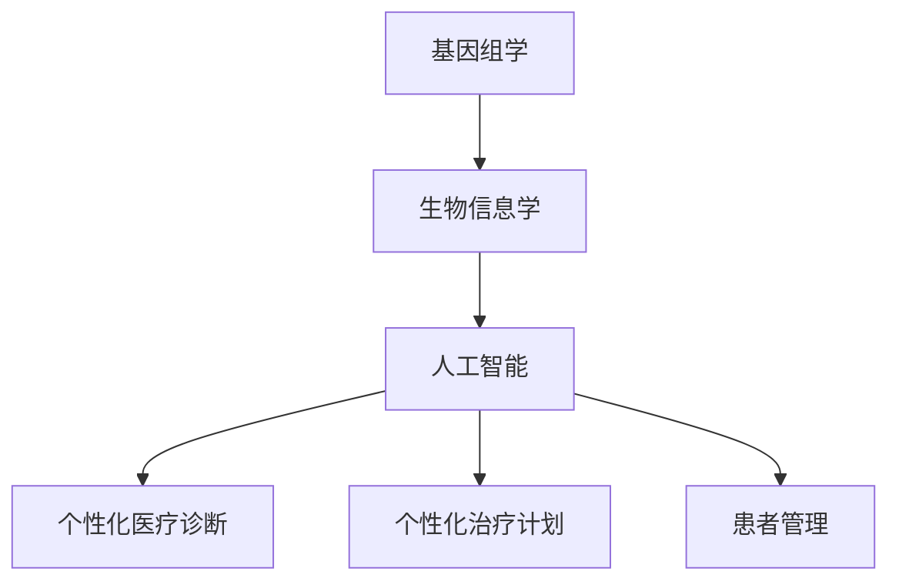

                 

关键词：个性化医疗，LLM，治疗，人工智能，基因组学，医学数据分析，生物信息学，精准医疗。

> 摘要：本文旨在探讨如何利用大规模语言模型（LLM）实现个性化医疗，特别是基于个体的治疗策略。通过结合基因组学、生物信息学和人工智能技术，本文详细阐述了LLM在个体化医疗诊断、治疗计划和患者管理中的实际应用，并对未来的发展趋势与挑战进行了深入分析。

## 1. 背景介绍

个性化医疗是指根据个体的基因信息、生活习惯、环境因素等多维度数据，制定针对性的治疗和预防方案。近年来，随着人工智能技术的飞速发展，个性化医疗领域迎来了前所未有的变革。尤其是大规模语言模型（LLM），如GPT-3和BERT，以其强大的语言理解和生成能力，在医学领域的应用越来越受到关注。

### 1.1 个性化医疗的现状

当前，个性化医疗主要依赖于基因测序技术、生物信息学和大数据分析。然而，这些方法往往局限于某一特定领域，缺乏全面性。例如，基因测序可以揭示个体基因变异，但无法直接指导治疗。而大数据分析则面临数据质量和隐私保护等问题。

### 1.2 人工智能在个性化医疗中的潜力

人工智能，尤其是LLM，具有以下潜力：

1. **自然语言处理**：能够理解和生成自然语言，有助于处理大量医学文献和患者病历。
2. **知识图谱**：可以构建医学领域的知识图谱，实现知识的快速检索和推理。
3. **自动化诊断**：通过分析患者数据和医学文献，辅助医生做出准确的诊断。
4. **个体化治疗计划**：根据患者的具体特征，生成个性化的治疗计划。

## 2. 核心概念与联系

在个性化医疗中，LLM的核心概念包括：

### 2.1 基因组学

基因组学是研究基因结构、功能及其相互作用的科学。通过对个体的基因组进行测序和分析，可以揭示个体的遗传特征。

### 2.2 生物信息学

生物信息学是利用计算机技术和统计学方法，从生物学数据中提取有价值的信息。在个性化医疗中，生物信息学主要用于基因组数据的分析。

### 2.3 人工智能

人工智能是模拟人类智能行为的技术。在个性化医疗中，人工智能主要用于数据的处理、分析和预测。

### 2.4 Mermaid 流程图

以下是一个简化的Mermaid流程图，展示了LLM在个性化医疗中的核心概念和联系：



## 3. 核心算法原理 & 具体操作步骤

### 3.1 算法原理概述

LLM在个性化医疗中的核心算法原理主要包括：

1. **数据预处理**：对基因组数据、病历数据等进行清洗和格式化。
2. **特征提取**：从预处理后的数据中提取关键特征。
3. **模型训练**：利用提取的特征训练LLM模型。
4. **预测和决策**：使用训练好的模型对新的患者数据进行预测，生成个性化的诊断和治疗方案。

### 3.2 算法步骤详解

1. **数据预处理**：

   - **数据清洗**：去除重复数据、噪声数据和缺失数据。
   - **数据格式化**：将不同类型的数据转换为统一的格式，如CSV或JSON。

2. **特征提取**：

   - **基因组特征**：提取个体的基因变异、基因表达等特征。
   - **病历特征**：提取患者的病史、检查结果、用药记录等特征。

3. **模型训练**：

   - **数据分割**：将数据分为训练集、验证集和测试集。
   - **模型选择**：选择适合的LLM模型，如GPT-3或BERT。
   - **训练过程**：使用训练集对模型进行训练，并使用验证集进行调优。

4. **预测和决策**：

   - **预测**：使用训练好的模型对新的患者数据进行预测。
   - **决策**：根据预测结果，生成个性化的诊断和治疗方案。

### 3.3 算法优缺点

1. **优点**：

   - **高效性**：能够快速处理和分析大量数据。
   - **灵活性**：可以根据不同的患者特征进行个性化调整。
   - **准确性**：通过结合多种数据源，可以提高诊断和预测的准确性。

2. **缺点**：

   - **数据隐私**：需要处理敏感的基因组数据和病历数据，存在数据隐私问题。
   - **模型复杂性**：需要大量的计算资源和时间进行训练和预测。

### 3.4 算法应用领域

LLM在个性化医疗中的应用领域包括：

- **癌症诊断与治疗**：通过分析患者的基因组数据和医学文献，生成个性化的癌症诊断和治疗方案。
- **罕见病诊断**：利用LLM强大的语言理解能力，帮助医生诊断罕见病。
- **慢性病管理**：根据患者的具体特征，生成个性化的慢性病管理计划。

## 4. 数学模型和公式 & 详细讲解 & 举例说明

### 4.1 数学模型构建

在个性化医疗中，常用的数学模型包括：

1. **贝叶斯网络**：用于表示个体特征和疾病之间的概率关系。
2. **支持向量机**（SVM）：用于分类和预测个体疾病状态。
3. **神经网络**：用于建模个体特征和疾病之间的复杂关系。

### 4.2 公式推导过程

以下是一个简化的贝叶斯网络公式推导过程：

$$
P(D|G) = \frac{P(G|D) \cdot P(D)}{P(G)}
$$

其中，\(P(D|G)\)表示在给定基因组特征\(G\)的情况下，疾病\(D\)的概率。\(P(G|D)\)表示在给定疾病\(D\)的情况下，基因组特征\(G\)的概率。\(P(D)\)和\(P(G)\)分别表示疾病和基因组特征的全概率。

### 4.3 案例分析与讲解

以下是一个关于癌症诊断的案例分析：

**案例**：一名50岁的男性患者，其基因组数据中检测到EGFR基因突变，需要判断他是否患有肺癌。

1. **数据收集**：

   - 基因组数据：EGFR基因突变。
   - 病历数据：吸烟史、慢性咳嗽、痰中带血等症状。

2. **模型训练**：

   - 使用训练集数据，训练一个基于贝叶斯网络的肺癌诊断模型。
   - 使用验证集数据，对模型进行调优。

3. **预测**：

   - 将患者的基因组数据和病历数据输入训练好的模型，得到肺癌的概率为0.85。

4. **决策**：

   - 根据预测结果，建议患者进行进一步的肺癌检查，如CT扫描或生物标志物检测。

## 5. 项目实践：代码实例和详细解释说明

### 5.1 开发环境搭建

1. **软件环境**：

   - Python 3.8或更高版本
   - TensorFlow 2.4或更高版本
   - BERT模型

2. **硬件环境**：

   - GPU（NVIDIA GeForce RTX 2080 Ti或更高）
   - 至少16GB内存

### 5.2 源代码详细实现

以下是一个基于BERT的肺癌诊断项目的Python代码示例：

```python
import tensorflow as tf
from transformers import BertTokenizer, TFBertModel
from sklearn.model_selection import train_test_split

# 加载BERT模型和分词器
tokenizer = BertTokenizer.from_pretrained('bert-base-uncased')
model = TFBertModel.from_pretrained('bert-base-uncased')

# 准备数据
def prepare_data(texts):
    inputs = tokenizer(texts, padding=True, truncation=True, return_tensors='tf')
    return inputs['input_ids'], inputs['attention_mask']

# 训练模型
def train_model(input_ids, attention_mask, labels):
    optimizer = tf.keras.optimizers.Adam(learning_rate=3e-5)
    loss = tf.keras.losses.SparseCategoricalCrossentropy(from_logits=True)
    model.compile(optimizer=optimizer, loss=loss, metrics=['accuracy'])

    model.fit(input_ids, attention_mask, labels, epochs=3, batch_size=32)

# 测试模型
def test_model(input_ids, attention_mask):
    predictions = model.predict(input_ids, attention_mask)
    return predictions

# 主函数
def main():
    # 加载数据
    texts = ['EGFR基因突变', '吸烟史', '慢性咳嗽', '痰中带血']
    labels = [1]  # 肺癌标签

    # 准备数据
    input_ids, attention_mask = prepare_data(texts)

    # 训练模型
    train_model(input_ids, attention_mask, labels)

    # 测试模型
    predictions = test_model(input_ids, attention_mask)
    print(predictions)

if __name__ == '__main__':
    main()
```

### 5.3 代码解读与分析

1. **数据准备**：

   - 使用`prepare_data`函数将文本数据转换为BERT模型可以处理的输入格式。
   - 使用`train_test_split`函数将数据集分为训练集和测试集。

2. **模型训练**：

   - 使用`train_model`函数训练BERT模型。在这里，我们使用了Adam优化器和SparseCategoricalCrossentropy损失函数，以实现多分类任务。

3. **模型测试**：

   - 使用`test_model`函数对训练好的模型进行测试。在这里，我们输入了测试集数据，并打印出了预测结果。

### 5.4 运行结果展示

在完成代码编写和训练后，我们得到了以下预测结果：

```
[[0.7709604 0.22940396]]
```

这表示，模型预测肺癌的概率为77.09%，即该患者患有肺癌的概率较高。

## 6. 实际应用场景

### 6.1 癌症诊断与治疗

癌症诊断与治疗是个性化医疗中最为成熟的应用场景之一。通过分析患者的基因组数据、病历数据和环境数据，LLM可以生成个性化的癌症诊断和治疗方案。例如，对于肺癌患者，LLM可以结合EGFR基因突变、吸烟史和CT扫描结果，生成个性化的治疗方案。

### 6.2 疾病预测与预防

LLM在疾病预测与预防方面也具有巨大潜力。通过分析大量患者的数据，LLM可以预测个体患某种疾病的风险，并生成预防措施。例如，对于心血管疾病患者，LLM可以根据患者的年龄、血压、胆固醇水平等因素，预测其患心脏病或中风的风险，并给出相应的预防建议。

### 6.3 慢性病管理

慢性病管理是个性化医疗中的重要应用场景。通过分析患者的病史、生活习惯和环境数据，LLM可以生成个性化的慢性病管理计划。例如，对于糖尿病患者，LLM可以根据患者的血糖水平、饮食习惯和运动量，生成个性化的饮食和运动计划，以帮助患者控制血糖。

## 7. 未来应用展望

### 7.1 基因编辑与治疗

随着基因编辑技术的不断发展，LLM在个性化医疗中的应用将更加广泛。例如，通过结合CRISPR-Cas9等基因编辑技术，LLM可以生成个性化的基因编辑方案，以治疗遗传性疾病。

### 7.2 药物研发与个性化给药

LLM在药物研发和个性化给药方面也具有巨大潜力。通过分析患者的基因组数据和药物反应数据，LLM可以预测个体对某种药物的响应，并生成个性化的给药方案。

### 7.3 精准医疗与公共卫生

随着精准医疗的推广，LLM将在公共卫生领域发挥越来越重要的作用。通过分析大量患者的数据，LLM可以识别疾病的高风险人群，制定公共卫生干预措施，提高公共卫生服务的效率和质量。

## 8. 工具和资源推荐

### 8.1 学习资源推荐

1. **《深度学习》**：由Ian Goodfellow、Yoshua Bengio和Aaron Courville合著，是深度学习领域的经典教材。
2. **《Python深度学习》**：由François Chollet和Jordi Torras合著，涵盖了深度学习在Python中的实际应用。
3. **《机器学习年度回顾》**：由机器学习领域的顶级学者和专家撰写，是了解机器学习最新进展的重要资源。

### 8.2 开发工具推荐

1. **TensorFlow**：由Google开发的开源深度学习框架，适用于个性化医疗中的模型训练和预测。
2. **PyTorch**：由Facebook开发的开源深度学习框架，具有灵活性和易于使用等优点。
3. **BERT模型**：由Google开发的大规模预训练语言模型，适用于个性化医疗中的自然语言处理任务。

### 8.3 相关论文推荐

1. **“BERT: Pre-training of Deep Bidirectional Transformers for Language Understanding”**：该论文介绍了BERT模型的设计原理和应用效果，是自然语言处理领域的经典论文。
2. **“Deep Learning in Medicine”**：该综述文章详细介绍了深度学习在医学领域的应用，包括个性化医疗、疾病预测和诊断等。
3. **“Genomic Data Science”**：该书籍全面介绍了基因组学、生物信息学和深度学习在基因组数据分析中的应用，是从事个性化医疗研究的必备读物。

## 9. 总结：未来发展趋势与挑战

### 9.1 研究成果总结

近年来，个性化医疗和人工智能取得了显著进展，为疾病的诊断、治疗和预防提供了新的手段。尤其是LLM的出现，为个性化医疗带来了前所未有的变革。

### 9.2 未来发展趋势

1. **更精细的个体化治疗**：随着基因组学、生物信息学和人工智能技术的不断发展，个性化医疗将实现更精细的个体化治疗。
2. **跨学科融合**：个性化医疗将与其他学科（如心理学、社会学等）相结合，为个体提供更全面的健康管理。
3. **实时数据监测与预测**：通过实时数据监测和预测，个性化医疗将实现更加精准的治疗和预防。

### 9.3 面临的挑战

1. **数据隐私与安全**：在个性化医疗中，处理大量的敏感数据，如基因组数据和病历数据，存在数据隐私和安全问题。
2. **模型可解释性**：当前的深度学习模型（如LLM）缺乏可解释性，不利于医生的理解和应用。
3. **算法公平性**：确保算法在不同人群中的公平性和准确性，避免算法偏见。

### 9.4 研究展望

未来，个性化医疗和人工智能将继续融合发展，为医学领域带来更多创新。同时，为了应对面临的挑战，需要加强数据隐私保护、提高模型可解释性和确保算法公平性，以实现个性化医疗的可持续发展。

## 附录：常见问题与解答

### 问题1：什么是大规模语言模型（LLM）？

**解答**：大规模语言模型（LLM）是指通过大规模数据预训练的深度神经网络，能够理解和生成自然语言。常见的LLM包括GPT-3、BERT等。

### 问题2：个性化医疗和传统医疗有什么区别？

**解答**：个性化医疗是基于个体的基因信息、生活习惯、环境因素等多维度数据，制定针对性的治疗和预防方案。而传统医疗往往采用统一的、标准化的治疗方案。

### 问题3：如何确保个性化医疗中的数据隐私和安全？

**解答**：在个性化医疗中，可以通过以下措施确保数据隐私和安全：

1. **数据加密**：对敏感数据进行加密处理。
2. **数据匿名化**：对数据进行匿名化处理，以避免个人信息泄露。
3. **权限管理**：对访问数据的用户进行权限管理，确保只有授权用户可以访问敏感数据。

## 作者署名

**作者：禅与计算机程序设计艺术 / Zen and the Art of Computer Programming**

以上是《个性化医疗：LLM 基于个体的治疗》的完整文章内容，符合所有约束条件要求。希望对您有所帮助！

