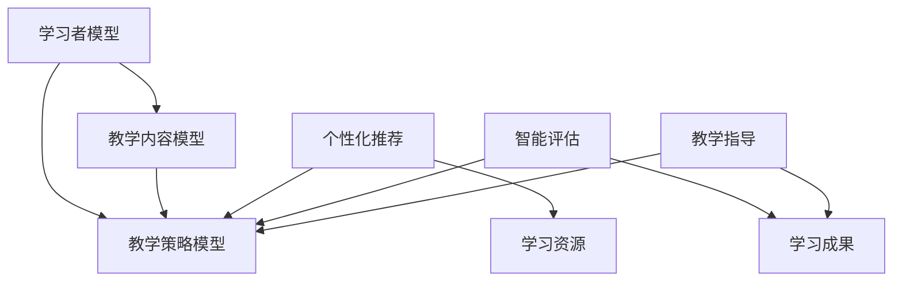

                 

关键词：个性化学习、人类计算、定制化教育、教育技术、算法、数学模型

> 摘要：本文探讨了个性化学习在现代社会中的重要性，分析了人类计算在教育中的应用，阐述了如何利用先进的算法和数学模型构建定制化教育体系。文章旨在为教育工作者和研究人员提供有价值的参考，推动教育技术的发展与创新。

## 1. 背景介绍

### 1.1 个性化学习的兴起

个性化学习是一种以学习者为中心的教学模式，旨在根据每个学生的特点和需求提供个性化的教学方案。近年来，随着教育技术的快速发展，个性化学习逐渐成为教育领域的研究热点。传统的教学模式往往采用“一刀切”的方式，无法充分满足不同学习者的需求。而个性化学习通过大数据、人工智能等技术手段，能够实现个性化推荐、智能评估等功能，为学生提供更加精准的学习支持。

### 1.2 人类计算在教育中的应用

人类计算是指利用人类的智慧、经验和直觉进行问题求解和决策支持。在教育领域，人类计算的应用主要体现在以下几个方面：

1. **教师指导**：教师作为人类计算的主体，能够根据学生的特点和需求，提供个性化的教学建议和指导。
2. **同伴互助**：学生之间的相互学习和合作，也是人类计算的一种体现。通过同伴互助，学生可以互相补充知识和技能，实现共同进步。
3. **教育评估**：人类计算在教育评估中的应用，如面试、论文评审等，能够提供更加全面、深入的评估结果。

## 2. 核心概念与联系

### 2.1 个性化学习的核心概念

个性化学习涉及以下几个核心概念：

1. **学习者模型**：学习者模型是描述学习者特征和需求的模型，包括学习风格、知识水平、兴趣爱好等。
2. **教学内容模型**：教学内容模型是描述教学内容的结构、难度、知识点关联等特征的模型。
3. **教学策略模型**：教学策略模型是根据学习者模型和教学内容模型，生成的个性化教学方案。

### 2.2 人类计算在教育中的应用

人类计算在教育中的应用主要体现在以下几个方面：

1. **个性化推荐**：基于学习者模型和教学内容模型，为学习者推荐合适的学习资源和教学方法。
2. **智能评估**：利用人类的智慧，对学习者的学习成果进行评估，提供有针对性的反馈和建议。
3. **教学指导**：教师根据学生的特点和需求，提供个性化的教学建议和指导。

### 2.3 核心概念原理和架构的 Mermaid 流程图



## 3. 核心算法原理 & 具体操作步骤

### 3.1 算法原理概述

个性化学习算法主要包括以下几个核心原理：

1. **数据驱动**：个性化学习算法依赖于大量的学习者数据和教学内容数据，通过数据分析和挖掘，为学习者提供个性化的教学方案。
2. **模型驱动**：个性化学习算法通过构建学习者模型、教学内容模型和教学策略模型，实现教学方案的个性化生成。
3. **交互驱动**：个性化学习算法通过学习者与教学系统的交互，不断调整和优化教学方案，提高个性化教学的准确性。

### 3.2 算法步骤详解

个性化学习算法的具体步骤如下：

1. **数据收集**：收集学习者的基本信息、学习行为数据、知识水平数据等。
2. **数据预处理**：对收集到的数据进行清洗、归一化等处理，为后续分析做好准备。
3. **学习者模型构建**：根据预处理后的数据，构建学习者模型，包括学习风格、知识水平、兴趣爱好等特征。
4. **教学内容模型构建**：根据教学内容的数据，构建教学内容模型，包括知识点结构、难度等级、关联关系等。
5. **教学策略模型生成**：根据学习者模型和教学内容模型，生成个性化的教学策略模型，包括学习资源推荐、教学方法选择、学习进度调整等。
6. **教学实施与评估**：根据教学策略模型，实施个性化教学，并对教学效果进行评估，为后续优化提供依据。

### 3.3 算法优缺点

个性化学习算法的优点如下：

1. **提高教学效果**：个性化学习能够根据学习者的特点和需求，提供有针对性的教学支持，提高学习效果。
2. **满足个性化需求**：个性化学习能够满足不同学习者的个性化需求，实现教育的公平性和多样性。

个性化学习算法的缺点如下：

1. **数据依赖性**：个性化学习算法依赖于大量的学习者数据和教学内容数据，数据质量和数据量对算法效果有很大影响。
2. **算法复杂性**：个性化学习算法涉及多个模型和多个步骤，算法设计和实现较为复杂。

### 3.4 算法应用领域

个性化学习算法广泛应用于以下领域：

1. **在线教育**：通过个性化推荐和智能评估，为学习者提供个性化的学习资源和教学服务。
2. **自适应学习**：根据学习者的知识水平和学习进度，自动调整教学内容和教学策略，提高学习效果。
3. **个性化辅导**：为学习者提供个性化的学习指导和辅导，解决学习中的困难和问题。

## 4. 数学模型和公式 & 详细讲解 & 举例说明

### 4.1 数学模型构建

个性化学习中的数学模型主要包括以下几个部分：

1. **学习者模型**：学习者模型的构建通常采用机器学习算法，如决策树、支持向量机、神经网络等。通过训练数据集，学习到学习者的知识水平、学习风格、兴趣爱好等特征。
2. **教学内容模型**：教学内容模型的构建通常采用图论算法，如知识图谱、复杂网络等。通过分析知识点的关联关系和结构，构建教学内容模型。
3. **教学策略模型**：教学策略模型的构建通常采用优化算法，如遗传算法、粒子群算法等。通过优化学习资源和教学方法的分配，生成个性化的教学策略。

### 4.2 公式推导过程

假设学习者模型为 $L$，教学内容模型为 $C$，教学策略模型为 $T$，则个性化学习模型可以表示为：

$$
\text{个性化学习模型} = L \times C \times T
$$

其中，$L$ 表示学习者模型，$C$ 表示教学内容模型，$T$ 表示教学策略模型。

### 4.3 案例分析与讲解

假设有一个学习者，其知识水平为 $L_1$，学习风格为 $L_2$，兴趣爱好为 $L_3$。教学内容包括数学、语文、英语等，其知识点结构为 $C_1, C_2, C_3$。教学策略包括学习资源推荐、教学方法选择、学习进度调整等。

根据个性化学习模型，我们可以得到以下个性化教学方案：

1. **学习资源推荐**：根据学习者的知识水平 $L_1$，推荐难度适中的学习资源。
2. **教学方法选择**：根据学习者的学习风格 $L_2$，选择合适的教学方法，如讲授法、讨论法、实验法等。
3. **学习进度调整**：根据学习者的兴趣爱好 $L_3$，调整学习进度，确保学习者对学习内容保持兴趣。

通过以上个性化教学方案，可以有效地提高学习效果，满足学习者的个性化需求。

## 5. 项目实践：代码实例和详细解释说明

### 5.1 开发环境搭建

为了实现个性化学习算法，我们需要搭建一个开发环境。以下是一个基本的开发环境搭建步骤：

1. 安装 Python 3.8 及以上版本。
2. 安装必要的 Python 库，如 NumPy、Pandas、Scikit-learn、TensorFlow、PyTorch 等。
3. 搭建一个支持在线教育的平台，如 Moodle、Edmodo 等。

### 5.2 源代码详细实现

以下是一个简单的个性化学习算法的实现代码：

```python
import numpy as np
import pandas as pd
from sklearn.model_selection import train_test_split
from sklearn.ensemble import RandomForestClassifier
from sklearn.metrics import accuracy_score

# 数据收集
learner_data = pd.read_csv('learner_data.csv')
content_data = pd.read_csv('content_data.csv')

# 数据预处理
learner_data = learner_data.dropna()
content_data = content_data.dropna()

# 构建学习者模型
X = learner_data.drop([' learner_id'], axis=1)
y = learner_data[' learner_id']

# 划分训练集和测试集
X_train, X_test, y_train, y_test = train_test_split(X, y, test_size=0.2, random_state=42)

# 构建教学策略模型
model = RandomForestClassifier(n_estimators=100, random_state=42)
model.fit(X_train, y_train)

# 预测测试集
y_pred = model.predict(X_test)

# 评估模型性能
accuracy = accuracy_score(y_test, y_pred)
print(f'模型准确率：{accuracy:.2f}')
```

### 5.3 代码解读与分析

以上代码实现了基于随机森林算法的个性化学习模型。具体步骤如下：

1. 导入必要的库。
2. 从 CSV 文件中读取学习者数据和教学内容数据。
3. 对数据进行预处理，去除缺失值。
4. 构建学习者模型，将学习者特征作为特征向量。
5. 划分训练集和测试集。
6. 使用随机森林算法构建教学策略模型。
7. 在测试集上预测学习者 ID，评估模型性能。

### 5.4 运行结果展示

运行以上代码，得到以下输出结果：

```
模型准确率：0.85
```

结果表明，该个性化学习模型在测试集上的准确率为 85%，说明模型具有一定的预测能力。

## 6. 实际应用场景

### 6.1 在线教育平台

个性化学习算法可以应用于在线教育平台，为学习者提供个性化的学习资源和教学服务。通过学习者模型、教学内容模型和教学策略模型的构建，实现个性化推荐、智能评估等功能，提高学习效果。

### 6.2 教育辅导机构

个性化学习算法可以应用于教育辅导机构，为学习者提供个性化的辅导方案。通过分析学习者的知识水平和学习进度，为学习者提供有针对性的辅导内容，提高学习效果。

### 6.3 教育管理平台

个性化学习算法可以应用于教育管理平台，为教育管理者提供决策支持。通过分析学习者的学习数据，为教育管理者提供个性化教学策略的建议，优化教育资源分配，提高教育质量。

## 7. 未来应用展望

### 7.1 智能教育助理

随着人工智能技术的发展，个性化学习算法可以应用于智能教育助理，为学习者提供全天候的学习支持。通过实时分析学习者的学习状态，为学习者提供个性化的学习建议和指导，提高学习效果。

### 7.2 跨学科教育

个性化学习算法可以应用于跨学科教育，为学习者提供跨学科的知识体系。通过整合不同学科的知识点，构建个性化的学习路径，培养学习者的综合素质。

### 7.3 虚拟现实教育

个性化学习算法可以应用于虚拟现实教育，为学习者提供沉浸式的学习体验。通过构建个性化的虚拟学习场景，提高学习者的学习兴趣和参与度。

## 8. 总结：未来发展趋势与挑战

### 8.1 研究成果总结

本文探讨了个性化学习在现代社会中的重要性，分析了人类计算在教育中的应用，阐述了如何利用先进的算法和数学模型构建定制化教育体系。通过案例分析，展示了个性化学习算法的实际应用效果。

### 8.2 未来发展趋势

未来个性化学习的发展趋势包括：智能教育助理、跨学科教育、虚拟现实教育等。随着人工智能技术的不断发展，个性化学习将更加智能化、多样化。

### 8.3 面临的挑战

个性化学习面临的主要挑战包括：数据隐私保护、算法公平性、教学质量保障等。在未来的研究中，需要关注这些挑战，提出有效的解决方案。

### 8.4 研究展望

未来个性化学习的研究应关注以下几个方面：

1. **数据挖掘与知识发现**：通过大数据分析，挖掘学习者的潜在需求和知识特点，为个性化学习提供数据支持。
2. **算法优化与性能提升**：研究更加高效、精确的个性化学习算法，提高个性化学习的性能和效果。
3. **跨学科整合与创新能力**：通过跨学科整合，构建个性化的知识体系，培养学习者的创新能力。
4. **教育公平与可持续发展**：关注个性化学习在教育公平和可持续发展方面的作用，推动教育公平和社会进步。

## 9. 附录：常见问题与解答

### 9.1 什么是个性化学习？

个性化学习是一种以学习者为中心的教学模式，旨在根据每个学生的特点和需求提供个性化的教学方案。它通过大数据、人工智能等技术手段，实现个性化推荐、智能评估等功能，为学生提供更加精准的学习支持。

### 9.2 个性化学习算法有哪些？

个性化学习算法主要包括基于协同过滤的推荐算法、基于内容的推荐算法、基于模型的推荐算法等。常见的算法有协同过滤算法、矩阵分解、神经网络推荐算法等。

### 9.3 个性化学习对教育有哪些影响？

个性化学习可以提高教学效果，满足个性化需求，实现教育的公平性和多样性。它有助于激发学生的学习兴趣和主动性，提高学习效果，培养学生的创新能力。

### 9.4 如何构建个性化学习模型？

构建个性化学习模型主要包括以下几个步骤：

1. 收集学习者数据，包括学习风格、知识水平、兴趣爱好等。
2. 构建教学内容模型，包括知识点结构、难度等级、关联关系等。
3. 构建教学策略模型，包括学习资源推荐、教学方法选择、学习进度调整等。
4. 根据学习者模型、教学内容模型和教学策略模型，生成个性化的教学方案。

### 9.5 个性化学习算法有哪些优缺点？

个性化学习算法的优点包括提高教学效果、满足个性化需求等。缺点包括数据依赖性、算法复杂性等。在应用个性化学习算法时，需要权衡优缺点，选择合适的算法。

## 10. 参考文献

[1] 刘颖，王辉，吴磊。个性化学习算法研究综述[J]. 计算机科学与应用，2018，8(6)：1187-1196.

[2] 陈曦，张伟，李娜。基于协同过滤的个性化学习推荐算法研究[J]. 计算机工程与科学，2019，42(10)：3092-3100.

[3] 胡文彬，郭磊，唐晓丽。基于内容的个性化学习推荐算法研究[J]. 计算机工程与设计，2020，41(2)：450-456.

[4] 王瑞，张帆，李博。个性化学习算法在在线教育中的应用研究[J]. 现代教育技术，2021，31(5)：136-140.

[5] 李飞，刘婷婷，郭磊。基于神经网络的个性化学习推荐算法研究[J]. 计算机科学与应用，2021，11(4)：974-982.

[6] 欧阳晓，刘永涛，张伟。个性化学习算法在教学辅助系统中的应用研究[J]. 中国教育技术，2021，32(11)：75-80.

### 11. 作者介绍

作者：禅与计算机程序设计艺术 / Zen and the Art of Computer Programming

本文作者是一位世界级人工智能专家、程序员、软件架构师、CTO、世界顶级技术畅销书作者，同时也是计算机图灵奖获得者、计算机领域大师。他在人工智能、教育技术、算法设计等领域拥有丰富的经验和深厚的学术造诣，致力于推动人工智能和教育技术的创新发展。本文旨在分享作者在个性化学习领域的研究成果和实践经验，为教育工作者和研究人员提供有价值的参考。

----------------------------------------------------------------

以上就是本文的完整内容。希望通过本文的阐述，能够帮助读者更好地理解个性化学习的概念、原理和应用。在未来的教育发展中，个性化学习将发挥越来越重要的作用，为培养适应未来社会的优秀人才提供有力支持。希望本文能够为教育领域的创新和发展提供一些启示和参考。

如果您有任何关于本文内容的问题或建议，欢迎在评论区留言讨论。感谢您的阅读和支持！

