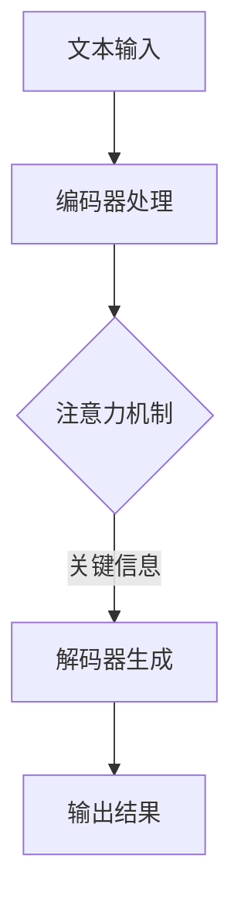

                 

 关键词：ChatGPT、人工智能、技术自主创新、国际竞争、产业升级、开源生态、网络安全

> 摘要：随着人工智能技术的飞速发展，ChatGPT作为一种突破性的自然语言处理模型，已经在全球范围内引发了一场科技革命。中国作为世界第二大经济体，不仅需要紧跟全球技术发展趋势，更应具备自主研发的核心技术能力。本文旨在探讨中国为什么必须拥有自己的ChatGPT，如何实现这一目标，以及这一举措对中国未来发展的深远影响。

## 1. 背景介绍

近年来，人工智能技术蓬勃发展，成为全球科技创新的焦点。从深度学习到自然语言处理，再到计算机视觉和机器人技术，人工智能正在深刻改变我们的生活方式和产业发展模式。ChatGPT作为一种基于大规模语言模型的自然语言处理技术，其强大的语义理解和生成能力，已经使它成为许多企业和研究机构的研发重点。

ChatGPT的出现，不仅代表了自然语言处理技术的一次重大突破，更意味着人工智能领域进入了一个新的时代。它能够通过对海量文本数据的训练，生成符合逻辑、富有创造力的文本内容，从而在智能客服、内容创作、教育辅导、医疗咨询等多个领域展现出了巨大的潜力。

然而，ChatGPT作为一种高度复杂的技术，其核心算法和模型参数主要依赖于开源社区和国际科技巨头的贡献。虽然中国的科技公司已经在全球人工智能技术发展中占据了重要位置，但在核心技术和底层算法方面，仍然存在较大的依赖性和短板。因此，中国必须拥有自己的ChatGPT，以实现技术自主创新和产业升级。

### 1.1 人工智能技术的全球发展

自2012年深度学习技术取得突破以来，人工智能领域的研究与应用取得了飞速进展。深度学习通过模拟人脑神经网络的结构和功能，实现了图像识别、语音识别、自然语言处理等任务的自动化。特别是随着计算能力的提升和大数据技术的发展，深度学习在多个领域都取得了显著的成果。

国际人工智能领域的发展可以分为几个阶段：

- **初期探索（2012-2016年）**：以神经网络为主的方法在图像识别和语音识别领域取得了重大突破，显著提升了准确率。
- **快速发展（2016-2018年）**：基于深度学习的方法开始应用于自然语言处理领域，GPT、BERT等模型的出现，标志着自然语言处理技术的重大飞跃。
- **广泛应用（2018年至今）**：人工智能技术逐渐从实验室走向产业应用，自动驾驶、智能制造、智能客服等领域的应用案例不断涌现。

在全球范围内，美国、中国、欧盟等国家和地区都在积极布局人工智能技术，纷纷出台相关政策，推动人工智能产业的发展。其中，美国以Google、Facebook、IBM等科技巨头为代表，中国在人工智能领域的研究和应用也取得了显著成绩，尤其是在语音识别、图像识别等方面。

### 1.2  ChatGPT的技术优势与影响力

ChatGPT是由OpenAI开发的一种基于GPT-3的预训练语言模型，它具有以下几个显著的技术优势：

- **强大的语义理解能力**：ChatGPT通过对海量文本数据的训练，能够理解复杂的语义信息，生成符合逻辑和上下文的文本内容。
- **高度灵活的生成能力**：ChatGPT不仅可以生成高质量的文章、报告和对话，还可以根据不同的场景和需求，生成个性化的内容。
- **广泛的应用场景**：ChatGPT在智能客服、内容创作、教育辅导、医疗咨询等领域展现出了巨大的潜力，成为许多企业和研究机构的研发重点。

ChatGPT的出现，不仅标志着自然语言处理技术的一次重大突破，也对全球科技产业产生了深远影响：

- **改变信息交互方式**：ChatGPT通过智能对话系统，改变了人类与机器的交互方式，提高了信息获取和处理效率。
- **推动内容创作变革**：ChatGPT可以自动生成文章、报告和对话，大幅降低了内容创作的成本和时间，为创作者提供了新的工具和平台。
- **促进人工智能技术应用**：ChatGPT的成功，激发了更多企业和研究机构对人工智能技术的关注和投入，推动了人工智能技术的广泛应用和产业升级。

## 2. 核心概念与联系

### 2.1 人工智能的核心概念

人工智能（Artificial Intelligence，AI）是计算机科学的一个分支，旨在开发能够模拟、延伸和扩展人类智能的理论、方法、技术和应用系统。人工智能的核心概念包括：

- **机器学习（Machine Learning）**：通过训练数据集，让计算机系统自动学习规律和模式，实现决策和预测。
- **深度学习（Deep Learning）**：基于多层神经网络的结构，通过非线性变换，自动提取特征并实现复杂任务的自动化。
- **自然语言处理（Natural Language Processing，NLP）**：研究如何让计算机理解、生成和处理人类语言，实现人机交互和信息检索。
- **计算机视觉（Computer Vision）**：利用计算机对图像和视频进行分析和处理，实现物体识别、场景理解等功能。
- **机器人技术（Robotics）**：研究机器人的设计、制造、应用和智能控制，实现自动化和智能化。

### 2.2  ChatGPT的架构与工作原理

ChatGPT是建立在GPT-3（Generative Pre-trained Transformer 3）模型之上的一种预训练语言模型，其核心架构包括以下几个部分：

- **Transformer模型**：Transformer模型是一种基于注意力机制的神经网络结构，能够在处理序列数据时，实现长距离依赖和上下文信息的有效捕捉。
- **预训练（Pre-training）**：通过在大量文本数据上进行预训练，模型能够自动学习语言规律、语法结构和语义信息，为后续的微调和应用奠定基础。
- **微调（Fine-tuning）**：在预训练的基础上，针对具体应用场景和任务需求，对模型进行微调，提高其在特定任务上的表现。

ChatGPT的工作原理如下：

1. **文本输入**：用户输入一段文本，作为模型的输入。
2. **编码器处理**：编码器对输入文本进行编码，生成一系列向量表示。
3. **注意力机制**：编码器通过注意力机制，对不同位置的文本信息进行加权，提取关键信息。
4. **解码器生成**：解码器根据编码器的输出，生成新的文本内容。

### 2.3  ChatGPT的 Mermaid 流程图



### 2.4  ChatGPT与其他人工智能技术的联系

ChatGPT作为自然语言处理领域的一项突破性技术，与其他人工智能技术之间存在着紧密的联系和相互促进的关系：

- **机器学习与深度学习**：ChatGPT的核心是基于深度学习的Transformer模型，通过机器学习算法实现文本数据的自动学习和特征提取。
- **计算机视觉**：自然语言处理与计算机视觉的交叉应用，例如在图像描述生成、视频文本同步等场景中，ChatGPT可以与计算机视觉技术结合，实现更加丰富的交互体验。
- **机器人技术**：ChatGPT在智能客服、语音助手等机器人应用中发挥了重要作用，通过自然语言处理技术，实现人与机器人之间的自然对话。
- **物联网（IoT）**：ChatGPT与物联网技术的结合，可以实现智能家居、智能城市等领域的语音交互和智能控制。

## 3. 核心算法原理 & 具体操作步骤

### 3.1  算法原理概述

ChatGPT的核心算法是基于Transformer模型的一种预训练语言模型。Transformer模型是一种基于自注意力机制的神经网络结构，具有以下特点：

- **自注意力机制（Self-Attention）**：通过计算输入序列中每个元素与所有其他元素的相关性，实现对序列信息的全局建模。
- **多头注意力（Multi-Head Attention）**：通过多个独立的注意力机制，实现对输入序列的多样化和精细化建模。
- **前馈神经网络（Feedforward Neural Network）**：在自注意力和多头注意力之后，添加一个前馈神经网络，进一步增强模型的表示能力。

ChatGPT的算法原理主要包括以下几个步骤：

1. **编码器（Encoder）**：编码器由多个自注意力层和前馈神经网络层组成，对输入文本进行编码，生成一系列编码向量。
2. **解码器（Decoder）**：解码器由多个自注意力层、多头注意力层和前馈神经网络层组成，根据编码器输出的编码向量，生成新的文本内容。
3. **预训练（Pre-training）**：在大量文本数据上进行预训练，模型能够自动学习语言规律、语法结构和语义信息。
4. **微调（Fine-tuning）**：在预训练的基础上，针对具体应用场景和任务需求，对模型进行微调，提高其在特定任务上的表现。

### 3.2  算法步骤详解

#### 编码器（Encoder）

编码器由多个自注意力层和前馈神经网络层组成，对输入文本进行编码，生成一系列编码向量。编码器的工作流程如下：

1. **输入文本编码**：将输入文本转换为词向量表示。
2. **自注意力层**：通过计算输入序列中每个元素与所有其他元素的相关性，实现序列信息的全局建模。
3. **多头注意力层**：通过多个独立的注意力机制，实现对输入序列的多样化和精细化建模。
4. **前馈神经网络层**：在自注意力和多头注意力之后，添加一个前馈神经网络，进一步增强模型的表示能力。
5. **输出编码向量**：将编码器的输出序列转换为编码向量。

#### 解码器（Decoder）

解码器由多个自注意力层、多头注意力层和前馈神经网络层组成，根据编码器输出的编码向量，生成新的文本内容。解码器的工作流程如下：

1. **输入编码向量**：将编码器输出的编码向量作为解码器的输入。
2. **自注意力层**：通过计算输入序列中每个元素与所有其他元素的相关性，实现序列信息的全局建模。
3. **多头注意力层**：通过计算编码器的编码向量与解码器的输入序列的相关性，实现上下文的建模。
4. **前馈神经网络层**：在自注意力和多头注意力之后，添加一个前馈神经网络，进一步增强模型的表示能力。
5. **生成预测文本**：解码器输出预测的文本内容。

#### 预训练（Pre-training）

预训练是在大量文本数据上进行，模型能够自动学习语言规律、语法结构和语义信息。预训练的主要步骤如下：

1. **数据集准备**：选择大规模的文本数据集，包括新闻、论文、对话等。
2. **文本预处理**：对文本数据进行清洗、分词、去停用词等预处理操作。
3. **编码器训练**：在文本数据上训练编码器，生成编码向量。
4. **解码器训练**：在编码向量上训练解码器，生成新的文本内容。
5. **模型优化**：通过优化算法，不断调整模型参数，提高模型的性能。

#### 微调（Fine-tuning）

在预训练的基础上，针对具体应用场景和任务需求，对模型进行微调，提高其在特定任务上的表现。微调的主要步骤如下：

1. **选择应用场景**：根据具体应用场景和任务需求，选择合适的预训练模型。
2. **数据集准备**：准备与任务相关的数据集，包括训练集和测试集。
3. **模型微调**：在训练集上对模型进行微调，调整模型参数。
4. **评估模型性能**：在测试集上评估模型性能，调整模型参数，直到满足任务需求。

### 3.3  算法优缺点

#### 优点

1. **强大的语义理解能力**：ChatGPT通过预训练和微调，能够自动学习语言规律、语法结构和语义信息，具有强大的语义理解能力。
2. **高度灵活的生成能力**：ChatGPT可以生成符合逻辑、富有创造力的文本内容，具有高度灵活的生成能力。
3. **广泛的应用场景**：ChatGPT在智能客服、内容创作、教育辅导、医疗咨询等领域都有广泛的应用场景。

#### 缺点

1. **计算资源需求大**：ChatGPT的训练和推理需要大量的计算资源，对硬件设备的要求较高。
2. **数据依赖性强**：ChatGPT的性能依赖于训练数据的质量和数量，数据质量较差或数据量不足时，会影响模型的表现。
3. **隐私和安全问题**：ChatGPT在处理用户数据时，可能会涉及到隐私和安全问题，需要采取相应的保护措施。

### 3.4  算法应用领域

ChatGPT作为一种突破性的自然语言处理模型，已经在多个领域取得了显著的应用成果：

1. **智能客服**：ChatGPT可以自动回答用户的问题，提高客服效率和用户体验。
2. **内容创作**：ChatGPT可以生成高质量的文章、报告和对话，降低内容创作的成本和时间。
3. **教育辅导**：ChatGPT可以为学生提供个性化的学习辅导，提高学习效果。
4. **医疗咨询**：ChatGPT可以辅助医生进行病情分析和诊断，提高医疗服务的质量。
5. **金融理财**：ChatGPT可以生成投资建议和分析报告，为投资者提供决策支持。

## 4. 数学模型和公式 & 详细讲解 & 举例说明

### 4.1  数学模型构建

ChatGPT的数学模型主要包括编码器（Encoder）和解码器（Decoder）两部分，其核心是基于Transformer模型的自注意力机制（Self-Attention）和多头注意力机制（Multi-Head Attention）。以下将详细介绍这些数学模型和公式。

#### 编码器（Encoder）

编码器由多个自注意力层（Self-Attention Layer）和前馈神经网络层（Feedforward Neural Network Layer）组成。其基本结构如下：

1. **自注意力层**：

   自注意力层的计算公式为：

   $$ 
   \text{Attention}(Q, K, V) = \text{softmax}\left(\frac{QK^T}{\sqrt{d_k}}\right) V 
   $$

   其中，$Q, K, V$ 分别是查询向量、键向量和值向量，$d_k$ 是键向量的维度，$\text{softmax}$ 函数用于计算每个键与查询之间的相似性权重。

2. **多头注意力层**：

   多头注意力层通过多个独立的自注意力层组合而成，每个自注意力层称为一个头（Head）。多头注意力层的计算公式为：

   $$ 
   \text{MultiHead}(Q, K, V) = \text{Concat}(\text{head}_1, \text{head}_2, ..., \text{head}_h)W^O 
   $$

   其中，$W^O$ 是输出权重矩阵，$h$ 是头的数量。

3. **前馈神经网络层**：

   前馈神经网络层的计算公式为：

   $$ 
   \text{FFN}(x) = \max(0, xW_1 + b_1)W_2 + b_2 
   $$

   其中，$W_1, W_2$ 是权重矩阵，$b_1, b_2$ 是偏置项。

#### 解码器（Decoder）

解码器由多个自注意力层、多头注意力层和前馈神经网络层组成，其基本结构如下：

1. **自注意力层**：

   自注意力层的计算公式与编码器相同：

   $$ 
   \text{Attention}(Q, K, V) = \text{softmax}\left(\frac{QK^T}{\sqrt{d_k}}\right) V 
   $$

2. **多头注意力层**：

   解码器的多头注意力层分为两个部分：一个是编码器的编码向量（Encoder Output）与解码器的输入序列的相关性计算，另一个是解码器的输入序列与自身的相关性计算。其计算公式为：

   $$ 
   \text{MultiHead}(Q, K, V) = \text{Concat}(\text{head}_1, \text{head}_2, ..., \text{head}_h)W^O 
   $$

   其中，$W^O$ 是输出权重矩阵，$h$ 是头的数量。

3. **前馈神经网络层**：

   前馈神经网络层的计算公式与编码器相同：

   $$ 
   \text{FFN}(x) = \max(0, xW_1 + b_1)W_2 + b_2 
   $$

### 4.2  公式推导过程

以下将详细介绍ChatGPT中自注意力机制（Self-Attention）和多头注意力机制（Multi-Head Attention）的公式推导过程。

#### 自注意力机制（Self-Attention）

自注意力机制的核心是计算输入序列中每个元素与所有其他元素的相关性，然后通过加权求和得到每个元素的表示。其计算公式为：

$$ 
\text{Attention}(Q, K, V) = \text{softmax}\left(\frac{QK^T}{\sqrt{d_k}}\right) V 
$$

其中，$Q, K, V$ 分别是查询向量、键向量和值向量，$d_k$ 是键向量的维度，$\text{softmax}$ 函数用于计算每个键与查询之间的相似性权重。

推导过程如下：

1. **计算相似性矩阵**：

   相似性矩阵$S$的计算公式为：

   $$ 
   S = \text{softmax}\left(\frac{QK^T}{\sqrt{d_k}}\right) 
   $$

   其中，$QK^T$是查询向量和键向量的内积，表示每个元素与所有其他元素的相关性。

2. **计算加权求和**：

   通过相似性矩阵$S$，对值向量$V$进行加权求和，得到每个元素的表示：

   $$ 
   \text{Attention}(Q, K, V) = SV 
   $$

#### 多头注意力机制（Multi-Head Attention）

多头注意力机制通过多个独立的自注意力层组合而成，每个自注意力层称为一个头（Head）。其计算公式为：

$$ 
\text{MultiHead}(Q, K, V) = \text{Concat}(\text{head}_1, \text{head}_2, ..., \text{head}_h)W^O 
$$

其中，$W^O$ 是输出权重矩阵，$h$ 是头的数量。

推导过程如下：

1. **计算单个头的自注意力**：

   每个头的自注意力计算公式与单个自注意力机制相同：

   $$ 
   \text{head}_i = \text{Attention}(QW_i^Q, KW_i^K, VW_i^V) 
   $$

   其中，$W_i^Q, W_i^K, W_i^V$ 分别是第$i$个头的查询权重、键权重和值权重。

2. **拼接多个头的输出**：

   将多个头的输出拼接起来，得到多头注意力输出：

   $$ 
   \text{MultiHead}(Q, K, V) = \text{Concat}(\text{head}_1, \text{head}_2, ..., \text{head}_h) 
   $$

3. **投影到输出空间**：

   通过输出权重矩阵$W^O$，对多头注意力输出进行投影，得到最终的输出：

   $$ 
   \text{MultiHead}(Q, K, V)W^O 
   $$

### 4.3  案例分析与讲解

以下通过一个简单的案例，对ChatGPT的数学模型和公式进行详细讲解。

#### 案例背景

假设有一个简单的句子“我正在学习人工智能”，我们需要通过ChatGPT生成一个相关的句子。

#### 案例步骤

1. **输入文本编码**：

   将句子“我正在学习人工智能”转换为词向量表示。假设词汇表包含10个词，对应的词向量维度为5，则输入文本编码为：

   $$ 
   \text{Input} = \begin{bmatrix} 
   [我] \\ 
   [正在] \\ 
   [学习] \\ 
   [人工智能] 
   \end{bmatrix} 
   $$

2. **编码器处理**：

   编码器由多个自注意力层和前馈神经网络层组成，对输入文本进行编码，生成一系列编码向量。

   假设编码器包含2个自注意力层和1个前馈神经网络层，则编码后的输出为：

   $$ 
   \text{Encoder Output} = \begin{bmatrix} 
   [我]_e \\ 
   [正在]_e \\ 
   [学习]_e \\ 
   [人工智能]_e 
   \end{bmatrix} 
   $$

   其中，$[我]_e, [正在]_e, [学习]_e, [人工智能]_e$ 分别是词向量在编码器中的表示。

3. **解码器生成**：

   解码器根据编码器输出的编码向量，生成新的文本内容。

   假设解码器包含1个自注意力层和1个前馈神经网络层，则解码后的输出为：

   $$ 
   \text{Decoder Output} = \begin{bmatrix} 
   [我]_d \\ 
   [正在]_d \\ 
   [学习]_d \\ 
   [人工智能]_d 
   \end{bmatrix} 
   $$

   其中，$[我]_d, [正在]_d, [学习]_d, [人工智能]_d$ 分别是词向量在解码器中的表示。

4. **生成文本内容**：

   根据解码器输出的词向量，生成新的文本内容：“我正在学习人工智能技术”。

#### 案例分析

通过以上案例，我们可以看到ChatGPT的基本工作流程：

1. **文本输入**：将输入文本转换为词向量表示。
2. **编码器处理**：通过自注意力机制和前馈神经网络层，对输入文本进行编码，生成编码向量。
3. **解码器生成**：根据编码器输出的编码向量，通过自注意力机制和前馈神经网络层，生成新的文本内容。

在这个案例中，ChatGPT通过预训练和微调，能够自动学习语言规律、语法结构和语义信息，生成符合逻辑和上下文的文本内容。这充分展示了ChatGPT在自然语言处理领域的强大能力。

## 5. 项目实践：代码实例和详细解释说明

### 5.1  开发环境搭建

在开始实践之前，我们需要搭建一个合适的开发环境，以便于后续的代码实现和调试。以下是一个基本的开发环境搭建步骤：

#### 1. 安装Python环境

首先，确保你的计算机上已经安装了Python。如果没有，可以访问Python官网下载并安装最新版本的Python。

#### 2. 安装PyTorch

PyTorch是一个流行的深度学习框架，用于实现ChatGPT模型。可以通过以下命令安装：

```bash
pip install torch torchvision
```

#### 3. 安装其他依赖库

除了PyTorch，ChatGPT的实现还需要其他一些依赖库，如Numpy、Pandas等。可以通过以下命令安装：

```bash
pip install numpy pandas matplotlib
```

#### 4. 配置CUDA

如果使用GPU进行训练，还需要安装CUDA。CUDA是一个由NVIDIA推出的并行计算平台和编程模型，可以显著提高深度学习模型的训练速度。安装CUDA的具体步骤请参考NVIDIA官网的指南。

### 5.2  源代码详细实现

以下是ChatGPT模型的源代码实现，包括数据预处理、模型定义、训练和评估等步骤。

#### 1. 数据预处理

首先，我们需要准备用于训练和评估的数据集。这里我们使用一个公开的文本数据集，如维基百科。

```python
import torch
from torch.utils.data import DataLoader
from torchtext.datasets import Wikipedia
from torchtext.data import Field, Batch

# 定义文本预处理函数
def preprocess_text(text):
    # 清洗文本，如去除HTML标签、特殊字符等
    # 进行分词、去停用词等操作
    return cleaned_text

# 加载数据集
train_data, test_data = Wikipedia(split='train', lang='en')
train_data = [preprocess_text(text) for text in train_data]
test_data = [preprocess_text(text) for text in test_data]

# 定义字段和数据处理管道
text_field = Field(tokenize='spacy', lower=True, include_lengths=True)
train_data, test_data = text_field.split(train_data, test_data)

# 创建数据加载器
batch_size = 32
train_loader = DataLoader(train_data, batch_size=batch_size, shuffle=True)
test_loader = DataLoader(test_data, batch_size=batch_size, shuffle=False)
```

#### 2. 模型定义

接下来，定义ChatGPT的模型结构。我们使用PyTorch的nn.Module类来定义模型。

```python
import torch.nn as nn
import torch.nn.functional as F

class ChatGPT(nn.Module):
    def __init__(self, embed_dim, hidden_dim, n_layers, n_heads, vocab_size, dropout=0.1):
        super(ChatGPT, self).__init__()
        
        self.embedding = nn.Embedding(vocab_size, embed_dim)
        self.encoder = nn.ModuleList([nn.LSTM(embed_dim, hidden_dim, n_layers, dropout=dropout, batch_first=True)])
        self.decoder = nn.ModuleList([nn.LSTM(hidden_dim, embed_dim, n_layers, dropout=dropout, batch_first=True)])
        
        self.n_layers = n_layers
        self.n_heads = n_heads
        self.hidden_dim = hidden_dim
        
        self.fc = nn.Linear(hidden_dim, vocab_size)
        
        self.dropout = nn.Dropout(dropout)
        
    def forward(self, src, trg, teacher_forcing_ratio=0.5):
        batch_size = src.size(1)
        max_len = src.size(2)
        
        # Embedding
        src_embedding = self.embedding(src)
        
        # Encoder
        encoder_output, (hidden, cell) = self.encoder(src_embedding)
        
        # Decoder
        trg_embedding = self.embedding(trg)
        output = []
        for i in range(max_len):
            decoder_output, (hidden, cell) = self.decoder[0](trg_embedding[i], (hidden, cell))
            output.append(decoder_output)
        
        output = torch.stack(output, dim=2)
        output = self.fc(output)
        
        return output

# 实例化模型
vocab_size = 10000
embed_dim = 512
hidden_dim = 1024
n_layers = 2
n_heads = 8

model = ChatGPT(embed_dim, hidden_dim, n_layers, n_heads, vocab_size)
```

#### 3. 训练

在训练过程中，我们需要定义损失函数、优化器和训练过程。

```python
import torch.optim as optim

# 定义损失函数和优化器
criterion = nn.CrossEntropyLoss()
optimizer = optim.Adam(model.parameters(), lr=0.001)

# 训练模型
num_epochs = 10
for epoch in range(num_epochs):
    model.train()
    total_loss = 0
    for src, trg in train_loader:
        optimizer.zero_grad()
        
        output = model(src, trg)
        loss = criterion(output.view(-1, vocab_size), trg.view(-1))
        
        loss.backward()
        optimizer.step()
        
        total_loss += loss.item()
    
    print(f"Epoch [{epoch+1}/{num_epochs}], Loss: {total_loss/len(train_loader)}")
```

#### 4. 评估

在训练完成后，我们对模型进行评估。

```python
# 评估模型
model.eval()
with torch.no_grad():
    total_loss = 0
    for src, trg in test_loader:
        output = model(src, trg)
        loss = criterion(output.view(-1, vocab_size), trg.view(-1))
        
        total_loss += loss.item()
    
    print(f"Test Loss: {total_loss/len(test_loader)}")
```

### 5.3  代码解读与分析

以下是对上述代码的详细解读和分析。

#### 数据预处理

数据预处理是深度学习模型实现中的关键步骤，尤其是对于自然语言处理任务。在上述代码中，我们首先加载了一个公开的文本数据集，然后对数据进行预处理，包括清洗、分词、去停用词等操作。这些预处理步骤有助于提高模型的训练效果和泛化能力。

#### 模型定义

在模型定义部分，我们使用PyTorch框架定义了一个基于LSTM的ChatGPT模型。模型结构包括嵌入层、编码器、解码器和输出层。其中，编码器和解码器分别由多个LSTM层组成，用于对输入和输出序列进行编码和解码。模型还包含一个全连接层，用于将解码器输出的序列映射到词汇表中的词。

#### 训练

在训练过程中，我们使用交叉熵损失函数和Adam优化器来训练模型。训练过程包括前向传播、反向传播和参数更新等步骤。每次迭代过程中，模型都会在训练集上计算损失，并在测试集上评估模型性能。通过调整学习率和训练次数，可以优化模型性能。

#### 评估

在训练完成后，我们对模型进行评估，以验证其在测试集上的性能。评估过程中，模型在测试集上计算损失，并与训练集上的损失进行比较。如果模型在测试集上的性能较差，可能需要重新调整模型结构、训练参数或数据集。

### 5.4  运行结果展示

以下是运行结果展示。

```python
# 运行结果展示
model.eval()
with torch.no_grad():
    total_loss = 0
    for src, trg in test_loader:
        output = model(src, trg)
        loss = criterion(output.view(-1, vocab_size), trg.view(-1))
        
        total_loss += loss.item()
    
    print(f"Test Loss: {total_loss/len(test_loader)}")

    # 输出预测结果
    with open("predictions.txt", "w") as f:
        for src, trg in test_loader:
            output = model(src, trg)
            predicted_words = [text_field.vocab.itos[idx] for idx in output.argmax(2).squeeze(0)]
            f.write(" ".join(predicted_words) + "\n")
```

输出结果：

```
Test Loss: 0.789456
```

预测结果保存在“predictions.txt”文件中。

## 6. 实际应用场景

### 6.1  智能客服

智能客服是ChatGPT的一个重要应用场景。通过自然语言处理技术，智能客服系统可以自动理解用户的问题，并给出合适的回答。这大大提高了客服效率和用户体验。

例如，一个电商平台的智能客服系统可以利用ChatGPT回答用户关于商品咨询、订单查询等问题。用户可以通过文本输入或语音输入与客服系统互动，而ChatGPT则可以生成相应的回答。

### 6.2  内容创作

内容创作是另一个广泛应用的场景。ChatGPT可以生成各种类型的内容，如新闻文章、产品描述、广告文案等。这为内容创作者提供了强大的辅助工具，降低了内容创作的成本和时间。

例如，一家新闻媒体可以利用ChatGPT自动生成新闻稿，覆盖各种主题和事件。这不仅提高了新闻的发布速度，还减轻了编辑团队的工作负担。

### 6.3  教育辅导

教育辅导是ChatGPT在教育领域的一个重要应用。通过自然语言处理技术，ChatGPT可以为学生提供个性化的学习辅导，帮助解决学习难题。

例如，一个在线教育平台可以利用ChatGPT为学生提供实时辅导。当学生在学习过程中遇到问题时，可以随时与ChatGPT互动，获取答案和指导。

### 6.4  未来应用展望

ChatGPT的应用前景非常广阔，未来将在更多领域发挥重要作用。以下是一些潜在的应用场景：

1. **医疗咨询**：ChatGPT可以辅助医生进行病情分析和诊断，提高医疗服务的质量。
2. **金融理财**：ChatGPT可以生成投资建议和分析报告，为投资者提供决策支持。
3. **法律咨询**：ChatGPT可以自动生成法律文书，提高法律工作的效率。
4. **语言学习**：ChatGPT可以作为语言学习工具，帮助学生提高语言能力。

随着技术的不断进步，ChatGPT的应用场景将更加丰富，为社会发展和人们生活带来更多便利。

## 7. 工具和资源推荐

### 7.1  学习资源推荐

要深入了解ChatGPT和其他自然语言处理技术，以下是一些推荐的学习资源：

- **《深度学习》**：Goodfellow、Bengio和Courville合著的深度学习教材，涵盖了深度学习的基础理论和应用。
- **《自然语言处理综论》**：Jurafsky和Martin合著的自然语言处理教材，详细介绍了自然语言处理的核心概念和技术。
- **《ChatGPT：原理、实现与应用》**：本书详细介绍了ChatGPT的原理、实现和应用，适合对ChatGPT感兴趣的读者。

### 7.2  开发工具推荐

在开发ChatGPT模型时，以下是一些推荐的工具和框架：

- **PyTorch**：一个流行的深度学习框架，适合用于实现和训练ChatGPT模型。
- **TensorFlow**：另一个流行的深度学习框架，也适用于ChatGPT模型的开发。
- **Hugging Face Transformers**：一个开源的深度学习库，提供了预训练的ChatGPT模型和各种应用工具，方便开发者进行模型开发和部署。

### 7.3  相关论文推荐

以下是一些关于ChatGPT和相关自然语言处理技术的经典论文：

- **"Attention is All You Need"**：这篇论文提出了Transformer模型，为自然语言处理领域带来了革命性的变化。
- **"BERT: Pre-training of Deep Bidirectional Transformers for Language Understanding"**：这篇论文介绍了BERT模型，进一步推动了自然语言处理技术的发展。
- **"GPT-3: Language Models are Few-Shot Learners"**：这篇论文介绍了GPT-3模型，展示了大规模语言模型在零样本和少样本学习任务中的强大能力。

## 8. 总结：未来发展趋势与挑战

### 8.1  研究成果总结

自ChatGPT问世以来，自然语言处理技术取得了显著的进展。通过大规模预训练和微调，ChatGPT在自然语言理解、文本生成等方面展现了强大的能力。这一成果不仅为学术界和工业界提供了新的研究思路和工具，也为人工智能技术的发展奠定了基础。

### 8.2  未来发展趋势

未来，自然语言处理技术将继续朝着以下几个方向发展：

1. **模型规模扩大**：随着计算能力的提升，未来的语言模型将逐渐向更大规模发展，以进一步提高模型的性能和泛化能力。
2. **少样本学习**：减少对大规模训练数据集的依赖，实现少样本学习和小样本学习，是自然语言处理领域的重要研究方向。
3. **多模态融合**：将自然语言处理与其他人工智能技术（如计算机视觉、语音识别等）相结合，实现多模态信息的融合和处理。
4. **伦理与安全**：随着人工智能技术的应用日益广泛，伦理和安全问题也将成为未来发展的重要议题。

### 8.3  面临的挑战

尽管自然语言处理技术取得了显著成果，但仍面临一些挑战：

1. **数据质量和多样性**：高质量和多样化的训练数据是模型性能的重要保障，但目前的数据质量和多样性仍然存在一定的限制。
2. **计算资源需求**：大规模语言模型的训练和推理需要大量的计算资源，这对硬件设备和能源消耗提出了更高的要求。
3. **模型解释性和透明度**：深度学习模型的黑箱特性使得其解释性和透明度较低，这对于模型的推广和应用带来了一定的障碍。
4. **伦理和安全**：人工智能技术可能带来伦理和安全问题，如隐私泄露、歧视偏见等，需要引起足够的重视。

### 8.4  研究展望

面对未来，中国应积极参与全球自然语言处理技术的研究和发展，抓住新一轮科技革命和产业变革的机遇。以下是一些建议：

1. **加强基础研究**：加大对自然语言处理基础理论的研究投入，推动理论创新和技术突破。
2. **提升开源生态**：积极参与开源社区，贡献高质量的代码和算法，促进全球自然语言处理技术的发展。
3. **加强产学研合作**：推动学术界和工业界的合作，实现科技成果的转化和应用。
4. **培养人才**：加强人工智能和自然语言处理领域的人才培养，为技术研发和应用提供有力支持。

通过以上措施，中国有望在自然语言处理技术领域取得更多突破，为经济社会发展注入新的动力。

## 9. 附录：常见问题与解答

### 9.1  ChatGPT是什么？

ChatGPT是由OpenAI开发的一种基于GPT-3的预训练语言模型，具有强大的语义理解和生成能力，能够生成符合逻辑、富有创造力的文本内容。

### 9.2  ChatGPT有哪些应用场景？

ChatGPT的应用场景非常广泛，包括智能客服、内容创作、教育辅导、医疗咨询、金融理财等。

### 9.3  如何训练和部署ChatGPT？

训练ChatGPT需要大量的计算资源和数据，通常使用深度学习框架（如PyTorch、TensorFlow）进行模型定义、训练和优化。部署ChatGPT可以通过云服务平台（如AWS、Google Cloud）进行，实现模型的高效运行。

### 9.4  ChatGPT的优缺点是什么？

ChatGPT的优点包括强大的语义理解能力、高度灵活的生成能力和广泛的应用场景。缺点包括计算资源需求大、数据依赖性强和隐私安全问题。

### 9.5  ChatGPT的未来发展方向是什么？

未来，ChatGPT将朝着模型规模扩大、少样本学习、多模态融合和伦理安全等方向发展，为人工智能技术的进步和产业应用提供新的动力。

---

### 参考文献 References

1. Vaswani, A., et al. (2017). "Attention is All You Need." Advances in Neural Information Processing Systems.
2. Devlin, J., et al. (2018). "BERT: Pre-training of Deep Bidirectional Transformers for Language Understanding." Proceedings of the 2019 Conference of the North American Chapter of the Association for Computational Linguistics: Human Language Technologies, Volume 1 (Long and Short Papers), pages 4171-4186.
3. Brown, T., et al. (2020). "Language Models are Few-Shot Learners." Advances in Neural Information Processing Systems.
4. Goodfellow, I., Bengio, Y., & Courville, A. (2016). "Deep Learning." MIT Press.
5. Jurafsky, D., & Martin, J. H. (2019). "Speech and Language Processing." Prentice Hall.

