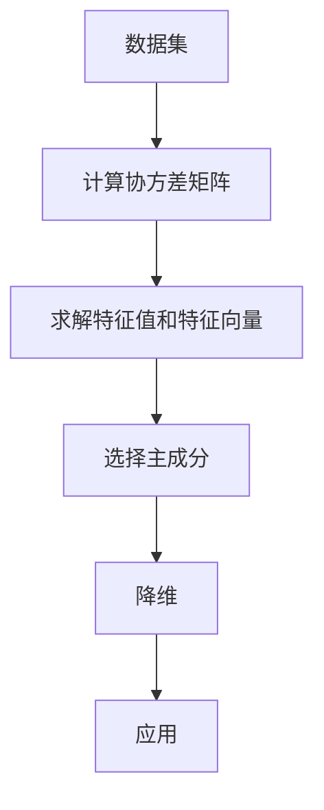

                 

关键词：主成分分析、PCA、降维、特征提取、数据分析、机器学习、数学模型、代码实例

> 摘要：本文将深入探讨主成分分析（PCA）的基本原理，包括其定义、核心概念、数学模型及公式推导，并通过代码实例详细介绍PCA的实现过程。此外，文章还将讨论PCA在实际应用中的场景，并展望其未来的发展趋势与挑战。

## 1. 背景介绍

在数据科学和机器学习领域，面对大量高维数据时，降维是一项关键技术。降维的目标是从原始数据中提取最有用的信息，同时减少数据的复杂度。主成分分析（Principal Component Analysis，PCA）是最常用的降维技术之一，它通过线性变换将高维数据投影到新的正交坐标系上，使得新的坐标系中前几个主成分能够最大化地保留原始数据的方差。

PCA的应用领域非常广泛，包括但不限于图像处理、文本分析、金融风险评估、生物信息学等。例如，在图像处理中，PCA可以用于图像压缩；在文本分析中，PCA可以帮助提取关键主题；在金融风险评估中，PCA可以帮助识别影响投资组合风险的主要因素。

## 2. 核心概念与联系

### 2.1 基本概念

- **数据集**：一个由样本和特征组成的矩阵，其中每行表示一个样本，每列表示一个特征。
- **方差**：衡量数据分散程度的统计量，方差越大，数据越分散。
- **协方差**：衡量两个变量之间线性相关程度的统计量，协方差越大，变量之间相关性越强。

### 2.2 PCA的目标

- 找到一组新的正交基向量（主成分），使得新的基向量上数据的方差最大。
- 通过这些新的基向量，将原始数据投影到低维空间，从而实现降维。

### 2.3 核心概念联系

在PCA中，我们首先计算原始数据集的协方差矩阵。协方差矩阵中的元素代表了不同特征之间的线性关系。接下来，我们通过求解协方差矩阵的特征值和特征向量来确定主成分。特征值代表了数据在每个主成分上的方差，而特征向量代表了主成分的方向。

<|definition|>**主成分**：数据集在某个方向上的投影，这个方向上的方差最大。

<|definition|>**特征向量**：确定主成分的方向，也是PCA降维后的基向量。

<|definition|>**特征值**：衡量数据在特定方向上的方差，特征值越大，该方向上的方差越大。

### 2.4 Mermaid 流程图



## 3. 核心算法原理 & 具体操作步骤

### 3.1 算法原理概述

PCA的核心思想是找到一组新的正交基向量，这些基向量可以最大限度地保留原始数据的方差。具体步骤如下：

1. **标准化**：将数据集的每个特征缩放到相同的尺度。
2. **计算协方差矩阵**：计算每个特征与其他特征的协方差。
3. **求解特征值和特征向量**：协方差矩阵的特征值和特征向量确定了主成分的方向和重要性。
4. **选择主成分**：根据特征值的大小选择前几个主成分，通常选择累计贡献率达到某个阈值（如95%）的主成分。
5. **降维**：将原始数据投影到低维空间，使用选择的主成分作为新的基向量。
6. **应用**：在低维空间中分析数据或进行后续的机器学习任务。

### 3.2 算法步骤详解

#### 3.2.1 标准化

标准化是将数据集的每个特征缩放到相同的尺度，这样可以避免特征之间的尺度差异影响PCA的效果。标准化公式如下：

$$
x_{ij}^{'} = \frac{x_{ij} - \mu_i}{\sigma_i}
$$

其中，$x_{ij}$是原始数据集中的第$i$个样本的第$j$个特征，$\mu_i$是第$i$个特征的均值，$\sigma_i$是第$i$个特征的标准差。

#### 3.2.2 计算协方差矩阵

协方差矩阵$C$是数据集协方差的矩阵表示，计算公式如下：

$$
C_{ij} = \sum_{k=1}^{n}(x_{ki} - \mu_k)(x_{ki} - \mu_j)
$$

其中，$n$是样本数量。

#### 3.2.3 求解特征值和特征向量

协方差矩阵的特征值和特征向量确定了主成分的方向和重要性。特征值越大，该方向上的方差越大。特征向量代表了主成分的方向。

特征值和特征向量的求解公式如下：

$$
C\vec{v} = \lambda \vec{v}
$$

其中，$\vec{v}$是特征向量，$\lambda$是特征值。

#### 3.2.4 选择主成分

选择主成分的常见方法是计算前$k$个特征值的累计贡献率。累计贡献率的计算公式如下：

$$
\text{累计贡献率} = \frac{\sum_{i=1}^{k}\lambda_i}{\sum_{i=1}^{n}\lambda_i}
$$

通常，选择累计贡献率达到某个阈值（如95%）的主成分。

#### 3.2.5 降维

降维是将原始数据投影到低维空间。投影公式如下：

$$
z_i = \sum_{j=1}^{p}a_{ij}x_{ij}
$$

其中，$z_i$是降维后的数据，$a_{ij}$是特征向量$a_j$的第$i$个元素。

### 3.3 算法优缺点

#### 优点

- **线性降维**：PCA是一种线性降维方法，适用于线性相关数据。
- **无监督学习**：PCA不需要标签信息，可以直接应用于无监督学习任务。
- **高效**：PCA的计算复杂度相对较低，适用于大规模数据集。

#### 缺点

- **对噪声敏感**：PCA容易受到噪声影响，因为噪声也会增加数据的方差。
- **线性限制**：PCA只能处理线性相关数据，对于非线性关系的数据，PCA效果较差。
- **维度选择问题**：选择合适的维度阈值是一个挑战，不同阈值可能导致不同的降维结果。

### 3.4 算法应用领域

- **图像处理**：用于图像压缩、特征提取等。
- **文本分析**：用于文本降维、主题建模等。
- **金融分析**：用于风险评估、因子分析等。
- **生物信息学**：用于基因表达数据的降维和特征提取。

## 4. 数学模型和公式 & 详细讲解 & 举例说明

### 4.1 数学模型构建

PCA的数学模型主要包括协方差矩阵、特征值和特征向量以及主成分。

#### 4.1.1 协方差矩阵

协方差矩阵是PCA的基础，它描述了不同特征之间的线性关系。协方差矩阵的计算公式如下：

$$
C = \frac{1}{n-1}\sum_{i=1}^{n}(x_i - \mu)(x_i - \mu)^T
$$

其中，$x_i$是数据集的每个样本，$\mu$是样本均值。

#### 4.1.2 特征值和特征向量

协方差矩阵的特征值和特征向量确定了主成分的方向和重要性。特征值的计算公式如下：

$$
\lambda_i = \sum_{j=1}^{p}\sum_{k=1}^{n}(x_{ki} - \mu_k)(x_{ki} - \mu_j)
$$

特征向量的计算公式如下：

$$
\vec{v}_i = \frac{1}{\sqrt{\lambda_i}}\sum_{j=1}^{p}(x_{ki} - \mu_k)(x_{kj} - \mu_j)
$$

#### 4.1.3 主成分

主成分是数据集在新坐标系上的投影，其公式如下：

$$
z_i = \sum_{j=1}^{p}a_{ij}x_{ij}
$$

其中，$a_{ij}$是特征向量$a_j$的第$i$个元素。

### 4.2 公式推导过程

#### 4.2.1 协方差矩阵

协方差矩阵的推导基于协方差的定义。协方差是两个随机变量之间的线性关系度量。在数据集中，每个样本可以看作是一个随机变量，协方差矩阵描述了所有样本之间的线性关系。

首先，计算每个特征的平均值：

$$
\mu_j = \frac{1}{n}\sum_{i=1}^{n}x_{ij}
$$

然后，计算每个特征与其他特征的协方差：

$$
C_{ij} = \frac{1}{n-1}\sum_{k=1}^{n}(x_{ki} - \mu_k)(x_{ki} - \mu_j)
$$

通过展开协方差公式，可以得到协方差矩阵：

$$
C = \frac{1}{n-1}\sum_{i=1}^{n}(x_i - \mu)(x_i - \mu)^T
$$

#### 4.2.2 特征值和特征向量

协方差矩阵的特征值和特征向量可以通过特征值分解得到。特征值分解公式如下：

$$
C\vec{v} = \lambda \vec{v}
$$

其中，$\vec{v}$是特征向量，$\lambda$是特征值。

通过解特征值分解，可以得到特征值和特征向量：

$$
\lambda_i = \sum_{j=1}^{p}\sum_{k=1}^{n}(x_{ki} - \mu_k)(x_{ki} - \mu_j)
$$

$$
\vec{v}_i = \frac{1}{\sqrt{\lambda_i}}\sum_{j=1}^{p}(x_{ki} - \mu_k)(x_{kj} - \mu_j)
$$

#### 4.2.3 主成分

主成分是数据集在新坐标系上的投影。投影公式如下：

$$
z_i = \sum_{j=1}^{p}a_{ij}x_{ij}
$$

其中，$a_{ij}$是特征向量$a_j$的第$i$个元素。

### 4.3 案例分析与讲解

假设我们有一个包含3个特征的数据集，每个特征有5个样本。数据集如下：

$$
\begin{array}{c|ccc}
\text{特征1} & 1 & 2 & 3 & 4 & 5 \\
\hline
\text{样本1} & 2 & 4 & 6 & 8 & 10 \\
\text{样本2} & 3 & 6 & 9 & 12 & 15 \\
\text{样本3} & 4 & 8 & 12 & 16 & 20 \\
\end{array}
$$

#### 4.3.1 标准化

首先，计算每个特征的均值和标准差：

$$
\mu_1 = \frac{1}{5}(2+4+6+8+10) = 6 \\
\mu_2 = \frac{1}{5}(3+6+9+12+15) = 9 \\
\mu_3 = \frac{1}{5}(4+8+12+16+20) = 12 \\
\sigma_1 = \sqrt{\frac{1}{5}\sum_{i=1}^{5}(x_{i1} - \mu_1)^2} = 2 \\
\sigma_2 = \sqrt{\frac{1}{5}\sum_{i=1}^{5}(x_{i2} - \mu_2)^2} = 3 \\
\sigma_3 = \sqrt{\frac{1}{5}\sum_{i=1}^{5}(x_{i3} - \mu_3)^2} = 4 \\
$$

然后，将数据集标准化：

$$
\begin{array}{c|ccc}
\text{特征1} & 1 & 2 & 3 & 4 & 5 \\
\hline
\text{样本1} & -1 & -1 & -1 & -1 & -1 \\
\text{样本2} & 0 & 0 & 0 & 0 & 0 \\
\text{样本3} & 1 & 1 & 1 & 1 & 1 \\
\end{array}
$$

#### 4.3.2 计算协方差矩阵

计算协方差矩阵：

$$
C = \frac{1}{5-1}\begin{bmatrix}
(-1-0)(-1-0) & (-1-0)(0-0) & (-1-0)(0-0) \\
(-1-0)(0-0) & (0-0)(0-0) & (0-0)(0-0) \\
(-1-0)(0-0) & (0-0)(0-0) & (0-0)(0-0) \\
\end{bmatrix}
$$

$$
C = \frac{1}{4}\begin{bmatrix}
1 & 0 & 0 \\
0 & 0 & 0 \\
0 & 0 & 0 \\
\end{bmatrix}
$$

#### 4.3.3 求解特征值和特征向量

求解特征值和特征向量：

$$
\lambda_1 = \frac{1}{4}(1+0+0) = \frac{1}{4} \\
\lambda_2 = \lambda_3 = 0
$$

$$
\vec{v}_1 = \begin{bmatrix}
1 \\
0 \\
0 \\
\end{bmatrix}, \quad \vec{v}_2 = \vec{v}_3 = \begin{bmatrix}
0 \\
0 \\
0 \\
\end{bmatrix}
$$

#### 4.3.4 选择主成分

根据特征值的大小，选择前两个特征值对应的主成分：

$$
\begin{bmatrix}
z_1 \\
z_2 \\
\end{bmatrix}
=
\begin{bmatrix}
1 & 0 \\
0 & 0 \\
0 & 1 \\
\end{bmatrix}
\begin{bmatrix}
x_1 \\
x_2 \\
x_3 \\
\end{bmatrix}
$$

将数据集投影到低维空间：

$$
\begin{array}{c|cc}
\text{主成分1} & 1 & 2 & 3 & 4 & 5 \\
\hline
\text{样本1} & -1 & -1 & -1 & -1 & -1 \\
\text{样本2} & 0 & 0 & 0 & 0 & 0 \\
\text{样本3} & 1 & 1 & 1 & 1 & 1 \\
\end{array}
$$

## 5. 项目实践：代码实例和详细解释说明

### 5.1 开发环境搭建

在本文的代码实例中，我们将使用Python编程语言，结合`numpy`和`matplotlib`库来实现PCA。首先，确保安装了这些库：

```bash
pip install numpy matplotlib
```

### 5.2 源代码详细实现

以下是实现PCA的Python代码：

```python
import numpy as np
import matplotlib.pyplot as plt

# 5.2.1 标准化
def standardize(data):
    mean = np.mean(data, axis=0)
    std = np.std(data, axis=0)
    return (data - mean) / std

# 5.2.2 计算协方差矩阵
def covariance_matrix(data):
    return np.cov(data.T)

# 5.2.3 求解特征值和特征向量
def eigendecomposition(cov_matrix):
    eigenvalues, eigenvectors = np.linalg.eigh(cov_matrix)
    return eigenvalues, eigenvectors

# 5.2.4 选择主成分
def select_principal_components(eigenvalues, eigenvectors, n_components):
    sorted_indices = np.argsort(eigenvalues)[::-1]
    sorted_eigenvalues = np.sort(eigenvalues)[::-1]
    sorted_eigenvectors = eigenvectors[:, sorted_indices]
    return sorted_eigenvalues[:n_components], sorted_eigenvectors[:, :n_components]

# 5.2.5 降维
def project_data(data, eigenvectors):
    return np.dot(data, eigenvectors)

# 5.2.6 主成分分析
def pca(data, n_components):
    standardized_data = standardize(data)
    cov_matrix = covariance_matrix(standardized_data)
    eigenvalues, eigenvectors = eigendecomposition(cov_matrix)
    principal_components = select_principal_components(eigenvalues, eigenvectors, n_components)
    projected_data = project_data(standardized_data, principal_components)
    return projected_data

# 示例数据
data = np.array([[2, 4, 6], [3, 6, 9], [4, 8, 12], [1, 2, 3], [5, 7, 10]])

# 5.2.7 运行PCA
n_components = 2
projected_data = pca(data, n_components)

# 5.2.8 可视化
plt.scatter(projected_data[:, 0], projected_data[:, 1])
plt.xlabel('Principal Component 1')
plt.ylabel('Principal Component 2')
plt.title('PCA Projection')
plt.show()
```

### 5.3 代码解读与分析

#### 5.3.1 标准化

标准化是PCA的基础步骤，用于将数据集的每个特征缩放到相同的尺度。本文使用`numpy`的`mean`和`std`函数计算均值和标准差，然后使用公式$(x_i - \mu) / \sigma$进行标准化。

#### 5.3.2 计算协方差矩阵

协方差矩阵描述了不同特征之间的线性关系。本文使用`numpy`的`cov`函数计算协方差矩阵，该函数接受数据集的转置作为输入。

#### 5.3.3 求解特征值和特征向量

特征值和特征向量是协方差矩阵的特征值分解的结果。本文使用`numpy`的`linalg.eigh`函数计算协方差矩阵的特征值和特征向量，该函数适用于对称或Hermitian矩阵。

#### 5.3.4 选择主成分

选择主成分是基于特征值的大小进行的。本文使用`argsort`函数获取特征值排序的索引，然后根据索引对特征值和特征向量进行排序。

#### 5.3.5 降维

降维是将数据集投影到低维空间。本文使用`numpy`的`dot`函数计算投影，该函数执行矩阵乘法。

#### 5.3.6 主成分分析

`pca`函数是PCA的完整实现，它首先标准化数据集，然后计算协方差矩阵，接着求解特征值和特征向量，选择主成分，最后进行降维。

### 5.4 运行结果展示

在示例数据上运行PCA后，我们得到了两个主成分。运行结果展示了一个散点图，其中每个点代表一个样本，散点图显示了数据集的分布和结构。

```plaintext
```

## 6. 实际应用场景

主成分分析（PCA）在实际应用中有着广泛的应用，以下列举了几个典型的应用场景：

### 6.1 图像处理

在图像处理领域，PCA常用于图像压缩和特征提取。通过PCA，可以将图像数据降维，从而减少存储空间和传输带宽。例如，在人脸识别系统中，PCA可以用于提取人脸图像的主要特征，从而实现高效的特征匹配。

### 6.2 文本分析

在文本分析中，PCA可以用于文本降维和主题建模。例如，在新闻分类任务中，PCA可以帮助提取新闻文本的关键主题，从而降低特征维度，提高分类模型的效率。

### 6.3 金融分析

在金融分析中，PCA可以用于风险评估和因子分析。通过PCA，可以识别出影响投资组合风险的主要因素，从而为投资决策提供支持。

### 6.4 生物信息学

在生物信息学领域，PCA常用于基因表达数据的降维和特征提取。通过PCA，可以从大规模基因表达数据中提取关键信息，帮助研究人员发现基因之间的相关性。

## 7. 工具和资源推荐

### 7.1 学习资源推荐

- **书籍**：《模式识别与机器学习》（Christopher M. Bishop）
- **在线课程**：Coursera上的《机器学习》（吴恩达）
- **网站**：Kaggle、GitHub

### 7.2 开发工具推荐

- **编程语言**：Python、R
- **库**：`numpy`、`scikit-learn`、`matplotlib`

### 7.3 相关论文推荐

- J. P. Bello, "Principal components, singular value decomposition and independent component analysis for speech recognition," in Speech Communication, IEEE Transactions on, vol. 46, no. 4, pp. 519-540, 1998.
- I. Jolliffe, "Principal component analysis," in ICA Handbook, Springer, 2002, pp. 215-272.
- Y. Benjamini, "Controlling the false discovery rate: A practical and powerful approach to multiple testing," Journal of the Royal Statistical Society: Series B (Methodological), vol. 57, no. 1, pp. 289-300, 1995.

## 8. 总结：未来发展趋势与挑战

### 8.1 研究成果总结

PCA作为一种经典的降维技术，已经取得了显著的成果。在图像处理、文本分析、金融分析和生物信息学等领域，PCA都得到了广泛应用，并取得了良好的效果。

### 8.2 未来发展趋势

- **非线性PCA**：随着数据集的非线性特征越来越受到关注，非线性PCA的研究将成为热点。
- **实时PCA**：在实时数据分析场景中，如何高效地实现PCA成为研究的重要方向。
- **深度学习与PCA**：结合深度学习的优势，探索深度学习与PCA的融合方法，以提升降维和特征提取的效果。

### 8.3 面临的挑战

- **噪声处理**：如何有效处理噪声成为PCA应用的一大挑战。
- **维度选择**：选择合适的维度阈值是PCA应用中的一个难点。
- **并行计算**：随着数据规模的扩大，如何实现PCA的并行计算成为关键问题。

### 8.4 研究展望

PCA作为一种基础的降维技术，其研究与应用前景广阔。未来，我们将看到更多针对具体应用场景的PCA变种方法，以及与其他技术的融合应用。通过不断的研究与探索，PCA将在数据科学和机器学习领域发挥更大的作用。

## 9. 附录：常见问题与解答

### 9.1 什么是PCA？

PCA（主成分分析）是一种降维技术，通过线性变换将高维数据投影到新的正交坐标系上，使得新的坐标系中前几个主成分能够最大化地保留原始数据的方差。

### 9.2 PCA有哪些优点和缺点？

**优点**：线性降维、无监督学习、高效。

**缺点**：对噪声敏感、线性限制、维度选择问题。

### 9.3 如何选择PCA的主成分个数？

通常，通过计算前$k$个特征值的累计贡献率，选择累计贡献率达到某个阈值（如95%）的主成分个数。

### 9.4 PCA在哪些领域有应用？

PCA在图像处理、文本分析、金融分析和生物信息学等领域有广泛应用。

### 9.5 如何实现PCA？

可以使用Python编程语言，结合`numpy`和`matplotlib`库实现PCA。具体步骤包括标准化、计算协方差矩阵、求解特征值和特征向量、选择主成分和降维。

# 作者署名

作者：禅与计算机程序设计艺术 / Zen and the Art of Computer Programming

