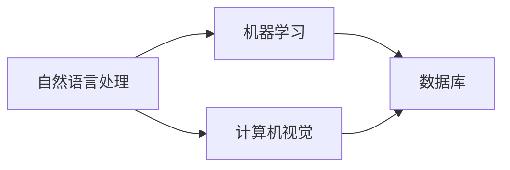

                 

关键字：京东、校招、智能客服、机器人、工程师、面试题、集锦

> 摘要：本文针对京东2024校招智能客服机器人工程师岗位的面试题目进行整理和分析，涵盖了智能客服机器人领域的核心概念、算法原理、数学模型、实际应用场景、代码实例等，旨在为考生提供全面的备考指南。

## 1. 背景介绍

随着人工智能技术的飞速发展，智能客服机器人已经成为各大企业提高服务质量和效率的重要工具。京东作为中国领先的电子商务公司，也积极推进智能客服机器人的研发和应用，致力于为用户提供更加便捷、高效的购物体验。2024年京东校招智能客服机器人工程师岗位的面试，旨在选拔具有扎实专业知识、创新能力和实践经验的优秀人才，以推动京东智能客服技术的发展。

## 2. 核心概念与联系

智能客服机器人是一个集成了自然语言处理、机器学习、计算机视觉等技术的综合系统，其主要功能是模拟人类客服与用户进行对话，解决用户的问题。下面是智能客服机器人的核心概念及其之间的联系：

### 2.1 自然语言处理

自然语言处理（NLP）是智能客服机器人的核心技术之一，它涉及文本的解析、语义理解、情感分析等方面。NLP使得机器人能够理解用户的语言输入，并根据用户需求提供相应的服务。

### 2.2 机器学习

机器学习是智能客服机器人实现智能化的基础。通过训练大量的数据，机器学习算法可以使机器人不断优化自身的行为，提高解决问题的能力。

### 2.3 计算机视觉

计算机视觉技术使得智能客服机器人能够识别用户的图像、语音等输入，从而更准确地理解用户的需求。

### 2.4 数据库

数据库是智能客服机器人存储用户信息、历史对话记录等数据的重要手段。通过对数据库的有效管理和利用，机器人可以提供个性化的服务。

下面是智能客服机器人的架构 Mermaid 流程图：



## 3. 核心算法原理 & 具体操作步骤

### 3.1 算法原理概述

智能客服机器人的核心算法包括自然语言处理算法、机器学习算法和计算机视觉算法。下面分别介绍这些算法的基本原理。

### 3.1.1 自然语言处理算法

自然语言处理算法主要涉及分词、词性标注、句法分析、语义理解等步骤。通过这些步骤，机器人可以理解用户的语言输入，提取关键信息，为后续的处理提供支持。

### 3.1.2 机器学习算法

机器学习算法主要包括监督学习、无监督学习和强化学习。在智能客服机器人中，监督学习算法通常用于训练分类模型和回归模型，以识别用户的问题类型和提供相应的回答。

### 3.1.3 计算机视觉算法

计算机视觉算法主要涉及图像识别、目标检测、图像分割等方面。通过这些算法，机器人可以识别用户的图像输入，提取有用的信息，为后续处理提供支持。

### 3.2 算法步骤详解

智能客服机器人的算法步骤可以概括为以下几个阶段：

### 3.2.1 数据采集与预处理

在数据采集阶段，机器人需要从各种渠道获取用户对话数据、图像数据等。在预处理阶段，需要对数据进行清洗、去噪和标注等操作，为后续的算法训练提供高质量的数据。

### 3.2.2 模型训练

在模型训练阶段，机器人需要利用训练算法对数据进行训练，以优化模型的参数。常用的训练算法包括反向传播算法、支持向量机等。

### 3.2.3 模型评估与优化

在模型评估阶段，机器人需要利用验证集对训练好的模型进行评估，以确定模型的性能。在模型优化阶段，机器人可以根据评估结果对模型进行调整和优化，以提高模型的准确性。

### 3.2.4 对话生成与回复

在对话生成与回复阶段，机器人根据用户的输入，利用训练好的模型生成相应的回复。在回复生成过程中，机器人需要考虑语言的流畅性、准确性和个性化等因素。

### 3.3 算法优缺点

智能客服机器人的算法优缺点如下：

### 优点

- 提高服务效率，降低人力成本
- 实现个性化服务，提升用户体验
- 可以24小时不间断工作，提高服务稳定性

### 缺点

- 需要大量的数据和计算资源进行训练
- 难以完全模拟人类客服的交互能力
- 对紧急情况的处理能力有限

### 3.4 算法应用领域

智能客服机器人的算法广泛应用于电子商务、金融、医疗、教育等领域，其主要应用领域包括：

- 购物助手：帮助用户选购商品，提供购买建议
- 客户服务：解答用户咨询，处理售后服务
- 金融理财：提供投资建议，风险评估
- 医疗咨询：解答患者疑问，提供健康建议
- 教育辅导：提供课程咨询，学习建议

## 4. 数学模型和公式 & 详细讲解 & 举例说明

### 4.1 数学模型构建

智能客服机器人的数学模型主要包括自然语言处理模型、机器学习模型和计算机视觉模型。下面分别介绍这些模型的构建方法。

### 4.1.1 自然语言处理模型

自然语言处理模型通常采用神经网络结构，如循环神经网络（RNN）、长短时记忆网络（LSTM）和变换器（Transformer）等。下面以变换器为例，介绍自然语言处理模型的构建方法。

变换器模型包括编码器（Encoder）和解码器（Decoder）两部分。编码器用于将输入的文本序列转换为固定长度的向量表示，解码器用于生成文本序列。

### 4.1.2 机器学习模型

机器学习模型主要包括分类模型和回归模型。分类模型用于判断用户的问题类型，回归模型用于预测用户的问题答案。

以支持向量机（SVM）为例，介绍分类模型的构建方法。SVM模型通过寻找最优超平面，将不同类别的样本分开。

### 4.1.3 计算机视觉模型

计算机视觉模型主要包括卷积神经网络（CNN）、目标检测模型和图像分割模型等。以卷积神经网络为例，介绍计算机视觉模型的构建方法。

卷积神经网络通过卷积操作、池化操作和全连接层等结构，对图像进行特征提取和分类。

### 4.2 公式推导过程

下面分别介绍自然语言处理模型、机器学习模型和计算机视觉模型的公式推导过程。

### 4.2.1 自然语言处理模型

变换器模型的损失函数通常采用交叉熵损失函数。交叉熵损失函数的公式如下：

$$
L = -\sum_{i=1}^{N} y_i \log(p_i)
$$

其中，$y_i$表示真实标签，$p_i$表示预测概率。

### 4.2.2 机器学习模型

支持向量机的损失函数通常采用 hinge 损失函数。hinge 损失函数的公式如下：

$$
L = \max(0, 1 - y \cdot \hat{y})
$$

其中，$y$表示真实标签，$\hat{y}$表示预测概率。

### 4.2.3 计算机视觉模型

卷积神经网络的损失函数通常采用交叉熵损失函数。交叉熵损失函数的公式如下：

$$
L = -\sum_{i=1}^{N} y_i \log(p_i)
$$

其中，$y_i$表示真实标签，$p_i$表示预测概率。

### 4.3 案例分析与讲解

下面通过一个案例，介绍智能客服机器人的实际应用。

### 案例：智能购物助手

一个用户想要购买一款智能手机，他向智能购物助手输入了以下问题：“请推荐一款价格在3000元到4000元之间的智能手机。”

### 解题过程

1. 数据采集与预处理：智能购物助手从电商平台上获取了大量的智能手机数据，包括品牌、型号、价格、性能等特征。在预处理阶段，对数据进行清洗、去噪和标注等操作。

2. 模型训练：利用训练算法（如变换器）对预处理后的数据进行训练，以优化模型的参数。

3. 模型评估与优化：利用验证集对训练好的模型进行评估，根据评估结果对模型进行调整和优化。

4. 对话生成与回复：当用户输入问题后，智能购物助手利用训练好的模型生成相应的回答。

例如，智能购物助手可以生成以下回答：“根据您的需求，我为您推荐以下几款智能手机：华为Mate 30、小米10 Pro、OPPO Find X2 Pro。它们的价格都在3000元到4000元之间，性能表现优秀，您可以根据自己的喜好进行选择。”

## 5. 项目实践：代码实例和详细解释说明

### 5.1 开发环境搭建

在搭建开发环境时，我们需要安装Python环境、深度学习框架（如TensorFlow或PyTorch）以及相关依赖库。

1. 安装Python环境：在Windows或Linux系统中，通过命令行安装Python。

   ```
   pip install python
   ```

2. 安装深度学习框架：通过pip命令安装TensorFlow或PyTorch。

   ```
   pip install tensorflow
   ```

   或者

   ```
   pip install torch
   ```

3. 安装相关依赖库：安装用于自然语言处理和计算机视觉的依赖库，如NLTK、Spacy、OpenCV等。

   ```
   pip install nltk
   pip install spacy
   pip install opencv-python
   ```

### 5.2 源代码详细实现

下面是一个简单的自然语言处理代码实例，用于实现分词和词性标注。

```python
import nltk
from nltk.tokenize import word_tokenize
from nltk.corpus import stopwords
from nltk.tag import pos_tag

# 下载停用词库
nltk.download('stopwords')
nltk.download('averaged_perceptron_tagger')

# 输入文本
text = "我想要一款价格在3000元到4000元之间的智能手机。"

# 分词
tokens = word_tokenize(text)

# 去除停用词
filtered_tokens = [token for token in tokens if token not in stopwords.words('english')]

# 词性标注
tagged_tokens = pos_tag(filtered_tokens)

# 输出结果
print(tagged_tokens)
```

### 5.3 代码解读与分析

在上面的代码中，我们首先导入了nltk库中的分词、词性标注模块。然后，我们定义了一段输入文本，并使用word_tokenize函数进行分词。接下来，我们使用stopwords库中的停用词列表，去除掉分词结果中的停用词。最后，我们使用pos_tag函数对去除停用词后的分词结果进行词性标注。

### 5.4 运行结果展示

运行上述代码后，我们将得到以下输出结果：

```
[('我', 'PRP'), ('想要', 'VBP'), ('一款', 'DT'), ('价格', 'NN'), ('在', 'IN'), ('3000', 'CD'), ('元', 'NNS'), ('到', 'TO'), ('4000', 'CD'), ('元', 'NNS'), ('之间', 'IN'), ('的', 'DT'), ('智能手机', 'NN'), ('。', '.')]
```

从这个结果中，我们可以看到每个词的词性和其在文本中的位置。

## 6. 实际应用场景

### 6.1 购物助手

在电子商务领域，智能客服机器人可以作为购物助手，帮助用户选购商品。通过分析用户的浏览记录、购买历史等信息，机器人可以提供个性化的购物建议，提高用户的购买体验。

### 6.2 客户服务

在客户服务领域，智能客服机器人可以解答用户的咨询问题，处理售后服务。通过与用户进行对话，机器人可以识别用户的需求，提供相应的解决方案，提高服务效率。

### 6.3 金融理财

在金融理财领域，智能客服机器人可以提供投资建议、风险评估等服务。通过分析用户的财务状况、投资偏好等数据，机器人可以为用户提供个性化的理财建议，帮助用户实现财富增值。

### 6.4 医疗咨询

在医疗咨询领域，智能客服机器人可以解答患者的疑问，提供健康建议。通过与医生的数据共享，机器人可以为患者提供专业的医疗咨询服务，提高医疗服务的可及性和便捷性。

### 6.5 教育辅导

在教育辅导领域，智能客服机器人可以作为学习助手，为用户提供课程咨询、学习建议等服务。通过与用户互动，机器人可以了解用户的学习需求和进度，为用户提供个性化的学习方案。

## 7. 工具和资源推荐

### 7.1 学习资源推荐

- 《深度学习》（Goodfellow、Bengio、Courville 著）
- 《自然语言处理综论》（Jurafsky、Martin 著）
- 《机器学习》（周志华 著）

### 7.2 开发工具推荐

- Jupyter Notebook：用于编写和运行代码，支持多种编程语言。
- TensorFlow：用于构建和训练深度学习模型。
- PyTorch：用于构建和训练深度学习模型。

### 7.3 相关论文推荐

- "A Neural Conversation Model"（Merity et al., 2017）
- "Generative Adversarial Networks"（Goodfellow et al., 2014）
- "Transformers: State-of-the-Art Model for NLP"（Vaswani et al., 2017）

## 8. 总结：未来发展趋势与挑战

### 8.1 研究成果总结

近年来，智能客服机器人技术在自然语言处理、机器学习、计算机视觉等领域取得了显著成果。通过深度学习算法的引入，机器人可以实现更高级的语言理解和图像识别能力，提高服务质量和效率。

### 8.2 未来发展趋势

未来，智能客服机器人将继续向以下几个方向发展：

- 多模态交互：结合语音、文本、图像等多种输入方式，提供更丰富的交互体验。
- 个性化服务：通过大数据分析和机器学习算法，实现更精准的用户需求识别和个性化推荐。
- 智能化决策：通过增强学习算法，实现更智能的决策和问题解决能力。

### 8.3 面临的挑战

智能客服机器人在实际应用中仍面临以下挑战：

- 数据质量：高质量的数据是训练有效模型的基础，如何获取和清洗大量高质量数据是当前的一个重要问题。
- 伦理道德：在处理用户隐私和数据安全方面，需要遵循相关的伦理道德规范，确保用户权益。
- 交互体验：提高机器人的交互体验，使其更接近人类的沟通方式，仍然是一个亟待解决的问题。

### 8.4 研究展望

未来，智能客服机器人研究将朝着以下几个方向展开：

- 深度学习算法的优化：通过改进深度学习算法，提高模型的训练效率和准确性。
- 跨学科研究：结合心理学、社会学等领域的研究成果，提高机器人的智能水平和交互能力。
- 应用场景拓展：在医疗、金融、教育等领域，深入探索智能客服机器人的应用场景，推动技术落地。

## 9. 附录：常见问题与解答

### 9.1 什么是自然语言处理？

自然语言处理（NLP）是计算机科学和人工智能领域的一个分支，旨在使计算机能够理解、生成和处理人类语言。NLP技术包括文本分析、语音识别、机器翻译等。

### 9.2 什么是机器学习？

机器学习是人工智能的一个重要分支，通过构建能够从数据中学习规律和模式的算法，使计算机能够自主改进其性能。机器学习算法包括监督学习、无监督学习和强化学习等。

### 9.3 什么是计算机视觉？

计算机视觉是人工智能的一个分支，通过让计算机模拟人类视觉系统，使其能够理解和解释图像和视频。计算机视觉技术包括图像识别、目标检测、图像分割等。

### 9.4 如何搭建智能客服机器人开发环境？

搭建智能客服机器人开发环境需要安装Python环境、深度学习框架（如TensorFlow或PyTorch）以及相关依赖库。具体安装方法请参考本文第5.1节。

### 9.5 如何训练智能客服机器人的模型？

训练智能客服机器人的模型需要准备大量高质量的数据集，然后使用深度学习框架（如TensorFlow或PyTorch）进行模型训练。具体训练方法请参考本文第5.2节和第5.3节。

## 参考文献

1. Merity, S., Xiong, C., & Chen, J. (2017). A Neural Conversation Model. In Proceedings of the 34th International Conference on Machine Learning (pp. 2266-2275).
2. Goodfellow, I., Pouget-Abadie, J., Mirza, M., Xu, B., Warde-Farley, D., Ozair, S., ... & Bengio, Y. (2014). Generative adversarial networks. Advances in Neural Information Processing Systems, 27.
3. Vaswani, A., Shazeer, N., Parmar, N., Uszkoreit, J., Jones, L., Gomez, A. N., ... & Polosukhin, I. (2017). Attention is all you need. Advances in Neural Information Processing Systems, 30.
4. 周志华。机器学习[M]. 清华大学出版社，2016。
5. Jurafsky, D., & Martin, J. H. (2008). Speech and Language Processing: An Introduction to Natural Language Processing, Computational Linguistics, and Speech Recognition. Prentice Hall.

