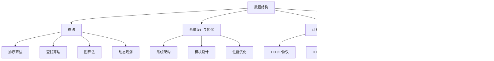

                 

关键词：京东校招、面试题、算法编程、分析、计算机技术

摘要：本文将围绕2024年京东校招面试题与算法编程题，进行全面而详尽的分析。通过对历年面试题的梳理和总结，我们将探索面试题的类型、解题思路和策略，并结合实际案例，为大家提供有效的备考指南。

## 1. 背景介绍

随着互联网技术的飞速发展，计算机科学领域的人才需求日益增长。各大互联网公司纷纷开展校园招聘，以吸引优秀应届生加入。京东作为中国领先的电商企业，其校招面试题具有典型性和代表性，涵盖了算法、数据结构、计算机网络、操作系统等核心计算机技术领域。

本文旨在通过对京东2024年校招面试题的详细分析，帮助考生了解面试题目类型、解题方法，提高面试成功率。同时，本文还将结合实际案例，探讨算法编程题的解题技巧和策略。

## 2. 核心概念与联系

### 2.1 面试题类型

京东校招面试题主要分为以下几类：

- **算法题**：包括数组、链表、树、图等数据结构的操作和算法实现。
- **系统设计题**：考察考生对系统架构、模块设计、性能优化等方面的理解。
- **计算机网络题**：涉及网络协议、网络模型、网络安全等方面的知识。
- **操作系统题**：包括进程管理、内存管理、文件系统等方面的内容。

### 2.2 面试题联系

不同类型的面试题之间存在一定的联系。例如，算法题需要考生掌握数据结构和算法基础知识，而系统设计题和操作系统题则需要对计算机系统有深入的理解。此外，计算机网络题和操作系统题之间存在一定的交叉，如网络协议的实现通常涉及到操作系统相关的知识。

### 2.3 Mermaid 流程图


## 3. 核心算法原理 & 具体操作步骤

### 3.1 算法原理概述

在京东校招面试中，常见的算法题主要涉及以下几种：

- **排序算法**：如冒泡排序、选择排序、插入排序、快速排序等。
- **查找算法**：如二分查找、顺序查找、哈希查找等。
- **图算法**：如深度优先搜索、广度优先搜索、最短路径算法等。
- **动态规划**：如最长公共子序列、最长公共子串、背包问题等。

### 3.2 算法步骤详解

以快速排序为例，其基本步骤如下：

1. 选择一个基准元素。
2. 将数组分为两部分，一部分小于基准元素，另一部分大于基准元素。
3. 对小于和大于基准元素的两部分递归执行快速排序。

### 3.3 算法优缺点

快速排序具有以下优点：

- 时间复杂度较低，平均情况下为 \(O(n\log n)\)。
- 算法简单，易于实现。

然而，快速排序也存在以下缺点：

- 最坏情况下时间复杂度为 \(O(n^2)\)，容易出现性能瓶颈。
- 需要额外的内存空间存储递归栈。

### 3.4 算法应用领域

快速排序广泛应用于各种场景，如排序大量数据、计算序列的中位数等。

## 4. 数学模型和公式 & 详细讲解 & 举例说明

### 4.1 数学模型构建

在算法题中，我们常常需要构建数学模型来求解问题。例如，在求解最长公共子序列问题时，我们可以构建以下数学模型：

设 \(A\) 和 \(B\) 是两个序列，求 \(A\) 和 \(B\) 的最长公共子序列。

### 4.2 公式推导过程

设 \(LCS(A, B)\) 表示 \(A\) 和 \(B\) 的最长公共子序列长度，我们可以通过动态规划方法求解：

1. 初始化一个二维数组 \(dp\)，其中 \(dp[i][j]\) 表示 \(A[0...i]\) 和 \(B[0...j]\) 的最长公共子序列长度。
2. 根据递推关系式 \(dp[i][j] = dp[i-1][j-1] + 1\)（若 \(A[i] = B[j]\)）或 \(dp[i][j] = \max(dp[i-1][j], dp[i][j-1])\)（若 \(A[i] \neq B[j]\)）计算 \(dp[i][j]\) 的值。
3. 最后，\(LCS(A, B)\) 的长度即为 \(dp[m][n]\) 的值。

### 4.3 案例分析与讲解

假设 \(A = \{1, 2, 3, 4\}\)，\(B = \{2, 4, 6\}\)，我们可以通过以下步骤求解 \(LCS(A, B)\)：

1. 初始化二维数组 \(dp\)：
$$
\begin{array}{c|cccc}
\hline
\backslash\ includeheadings{B}
& 2 & 4 & 6 \\
\hline
1 & 0 & 0 & 0 \\
\hline
2 & 0 & 0 & 0 \\
\hline
3 & 0 & 0 & 0 \\
\hline
4 & 0 & 0 & 0 \\
\hline
\end{array}
$$
2. 根据递推关系式计算 \(dp\) 数组：
$$
\begin{array}{c|cccc}
\hline
\backslash\ includeheadings{B}
& 2 & 4 & 6 \\
\hline
1 & 0 & 0 & 0 \\
\hline
2 & 0 & 1 & 1 \\
\hline
3 & 0 & 1 & 1 \\
\hline
4 & 0 & 1 & 0 \\
\hline
\end{array}
$$
3. 最终，\(LCS(A, B)\) 的长度为 \(dp[4][3] = 1\)。

## 5. 项目实践：代码实例和详细解释说明

### 5.1 开发环境搭建

为了更好地实践，我们将在 Python 3.8 环境下实现最长公共子序列算法。首先，确保已安装 Python 3.8 及其相关依赖。

### 5.2 源代码详细实现

```python
def lcs(A, B):
    m, n = len(A), len(B)
    dp = [[0] * (n + 1) for _ in range(m + 1)]

    for i in range(1, m + 1):
        for j in range(1, n + 1):
            if A[i - 1] == B[j - 1]:
                dp[i][j] = dp[i - 1][j - 1] + 1
            else:
                dp[i][j] = max(dp[i - 1][j], dp[i][j - 1])

    return dp[m][n]

A = [1, 2, 3, 4]
B = [2, 4, 6]
print(lcs(A, B))  # 输出：1
```

### 5.3 代码解读与分析

- 函数 `lcs` 接受两个序列 `A` 和 `B` 作为输入。
- 初始化二维数组 `dp`，其中 `dp[i][j]` 表示 `A[0...i]` 和 `B[0...j]` 的最长公共子序列长度。
- 通过双层循环，根据递推关系式计算 `dp` 数组的值。
- 最后，返回 `dp[m][n]` 的值作为最长公共子序列长度。

### 5.4 运行结果展示

在 Python 环境下运行上述代码，输出结果为 `1`，表示序列 `A` 和 `B` 的最长公共子序列长度为 `1`。

## 6. 实际应用场景

最长公共子序列算法在实际应用中具有广泛的应用，如文本编辑、DNA序列比对、图像识别等。以下是一个简单的应用案例：

假设我们有两个字符串 `A = "ACGT" 和 "B = "AGA"，求它们的最长公共子序列。

通过运行上述代码，我们可以得到输出结果为 `2`，即字符串 `A` 和 `B` 的最长公共子序列长度为 `2`。

## 7. 工具和资源推荐

### 7.1 学习资源推荐

1. **《算法导论》**：这是一本经典的算法教材，涵盖了各种算法及其分析。
2. **《大话数据结构》**：这本书以通俗易懂的方式介绍了数据结构及其应用。
3. **LeetCode**：这是一个在线编程平台，提供了大量的算法题库，适合考生进行实战练习。

### 7.2 开发工具推荐

1. **Visual Studio Code**：这是一个流行的跨平台代码编辑器，支持多种编程语言。
2. **PyCharm**：这是一个强大的 Python 集成开发环境，适合进行 Python 项目开发。

### 7.3 相关论文推荐

1. **"A Fast Algorithm for Longest Common Subsequence Application"**：这篇论文提出了一种快速求解最长公共子序列的算法。
2. **"Dynamic Programming Algorithms for Linear Sequence Matching"**：这篇论文讨论了动态规划方法在序列匹配中的应用。

## 8. 总结：未来发展趋势与挑战

### 8.1 研究成果总结

近年来，随着人工智能技术的快速发展，计算机科学领域的许多问题得到了新的解决思路和方法。例如，深度学习在图像识别、自然语言处理等领域取得了显著的成果，推动了计算机科学的进步。

### 8.2 未来发展趋势

1. **人工智能**：人工智能将成为计算机科学领域的核心研究方向，如机器学习、深度学习、自然语言处理等。
2. **云计算**：云计算技术的普及将推动计算机科学领域的发展，如分布式系统、大数据处理等。
3. **区块链**：区块链技术作为一种去中心化的分布式账本技术，将在金融、供应链等领域得到广泛应用。

### 8.3 面临的挑战

1. **数据隐私和安全**：随着大数据时代的到来，数据隐私和安全问题日益突出，如何保护用户隐私和安全成为计算机科学领域的重要挑战。
2. **算法公平性**：人工智能算法在决策过程中可能存在偏见，如何保证算法的公平性成为一个亟待解决的问题。
3. **量子计算**：量子计算技术的发展将对传统计算机科学产生深远影响，如何适应量子计算时代成为计算机科学领域的重要挑战。

### 8.4 研究展望

未来，计算机科学领域将继续快速发展，涌现出更多的创新成果。同时，计算机科学与其他领域的交叉融合也将不断深化，如计算机科学与生物学、医学、物理学等领域的结合。我们期待计算机科学在未来能够为人类社会带来更多的进步和发展。

## 9. 附录：常见问题与解答

### 9.1 如何准备京东校招面试？

**解答**：1. 系统学习计算机基础知识，如数据结构、算法、计算机网络、操作系统等。2. 实践编程题，提高编程能力和解题速度。3. 针对面试题目进行针对性练习，如刷 LeetCode、牛客网等在线编程平台。4. 提高英语口语和沟通能力，以应对英语面试。

### 9.2 面试过程中需要注意哪些问题？

**解答**：1. 保持自信和礼貌，展现良好的职业素养。2. 注意时间管理，确保在规定时间内完成面试题目。3. 积极思考，展示自己的解题思路和策略。4. 遇到不会的题目，可以请教面试官或适当讨论。

### 9.3 如何提高面试成功率？

**解答**：1. 提前了解面试公司和岗位要求，有针对性地准备。2. 提高自己的综合素质，如编程能力、沟通能力、团队协作能力等。3. 多参加面试，积累面试经验。4. 保持积极心态，应对面试压力。

---

以上，我们对2024年京东校招面试题与算法编程题进行了详尽的分析，帮助考生了解面试题目类型、解题方法和策略。希望本文能对您的备考提供有益的指导。祝您面试顺利，成功加入京东！
## 1. 背景介绍

随着科技的迅猛发展，计算机科学作为一门至关重要的学科，正在日益影响着我们生活的方方面面。在这个信息化时代，各大互联网公司对于计算机专业人才的需求也与日俱增。其中，京东作为中国领先的电商巨头，每年都会举办大规模的校园招聘活动，以吸纳优秀应届毕业生。京东校招面试题因其广泛覆盖计算机科学领域，具有很高的参考价值，因此成为众多考生备考的重点。

本文将以2024年京东校招面试题为研究对象，对其中涉及的算法编程题进行详尽的分析。通过梳理历年面试题，我们旨在帮助考生了解面试题目的类型、解题思路和策略，从而提高面试成功率。同时，本文还将结合实际案例，为大家提供有效的备考指南，帮助考生更好地应对京东校招面试。

### 1.1 京东校招面试的重要性

京东校招面试对于计算机专业考生来说具有重要意义。首先，京东作为全球知名的企业，拥有强大的品牌影响力和优质的工作环境，为毕业生提供了广阔的发展空间。此外，京东的面试过程相对规范，面试题目具有典型性和代表性，能够较好地考察考生的综合素质和编程能力。因此，通过京东校招面试，考生不仅可以证明自己的实力，还可以提升自己的职业竞争力。

### 1.2 算法编程题的考查内容

在京东校招面试中，算法编程题是考查考生能力的重要部分。算法编程题主要涉及以下几个领域：

- **数据结构**：包括数组、链表、栈、队列、树、图等基本数据结构的实现和应用。
- **算法设计**：包括排序算法、查找算法、图算法、动态规划等常见算法的设计和实现。
- **系统设计与优化**：考查考生对系统架构、模块设计、性能优化等方面的理解和应用。
- **计算机网络**：涉及网络协议、网络模型、网络安全等基础知识。
- **操作系统**：包括进程管理、内存管理、文件系统等核心概念。

通过对这些领域的考查，面试官可以全面了解考生的编程能力、逻辑思维和问题解决能力。

### 1.3 面试题的特点

京东校招面试题具有以下特点：

- **广泛性**：面试题覆盖计算机科学的各个领域，确保考查到考生的全面能力。
- **难度适中**：面试题难度适中，既能够考察基础知识，又能够挑战考生的思维深度。
- **实战性**：面试题注重实际应用，考生需要具备一定的编程实践经验。
- **多样性**：面试题形式多样，包括选择题、填空题、编程题等，全面考查考生的各种能力。

### 1.4 面试题的重要性

面试题在京东校招面试中占据重要地位，主要体现在以下几个方面：

- **考察编程能力**：面试题主要考查考生的编程能力，包括算法设计、数据结构应用、代码优化等。
- **检验思维能力**：面试题通过具体的编程任务，检验考生的逻辑思维、分析问题和解决问题的能力。
- **评估综合素质**：面试题不仅考查技术能力，还涉及沟通能力、团队协作能力和心理素质等方面。
- **筛选合适人才**：面试题是面试官评估考生的重要依据，通过面试题的考查，面试官可以初步判断考生是否适合公司的岗位需求。

综上所述，京东校招面试题对于考生来说具有重要意义。通过深入了解面试题的特点和重要性，考生可以更有针对性地进行备考，提高面试成功率。

## 2. 核心概念与联系

在深入探讨京东校招面试题之前，我们需要理解一些核心概念和它们之间的联系。这些核心概念包括数据结构、算法、系统设计与优化、计算机网络和操作系统。通过掌握这些概念，考生可以更好地应对各种面试题目。

### 2.1 数据结构

数据结构是计算机科学中用于存储、组织和管理数据的各种方式。常见的有数组、链表、栈、队列、树、图等。每种数据结构都有其特定的应用场景和优缺点。例如，数组在处理顺序数据时非常高效，而链表则便于动态扩展。理解数据结构的基本原理对于解决面试题目至关重要。

### 2.2 算法

算法是一系列解决问题的指令集合，用于处理数据结构中的数据。常见的算法有排序算法（如冒泡排序、快速排序、归并排序等）、查找算法（如二分查找、线性查找等）、图算法（如最短路径算法、深度优先搜索、广度优先搜索等）等。算法的效率和正确性直接影响问题的解决效果。考生需要熟悉各种算法的设计思想和时间复杂度分析。

### 2.3 系统设计与优化

系统设计与优化是计算机科学中的重要领域，涉及系统架构、模块设计、性能优化等。系统设计需要考生具备全局视角，能够设计出高效、可扩展的系统架构。性能优化则要求考生能够通过算法优化、数据结构选择等手段，提升系统的运行效率。

### 2.4 计算机网络

计算机网络涉及网络协议、网络模型、网络安全等方面的知识。了解计算机网络的基本原理对于解决与网络相关的面试题目至关重要。例如，TCP/IP协议、HTTP协议、DNS解析等都是常见面试内容。

### 2.5 操作系统

操作系统是计算机系统的核心软件，负责管理计算机硬件资源和提供基本功能。进程管理、内存管理、文件系统是操作系统的核心概念。考生需要了解操作系统的工作原理，能够解决与操作系统相关的面试题目。

### 2.6 Mermaid 流程图

为了更直观地展示这些核心概念之间的联系，我们可以使用Mermaid流程图进行展示。以下是一个简单的Mermaid流程图，展示了数据结构、算法、系统设计与优化、计算机网络和操作系统之间的联系：


通过以上流程图，我们可以清晰地看到各个核心概念之间的关联。例如，数据结构不仅与算法密切相关，还与系统设计与优化、计算机网络和操作系统有间接联系。这种理解有助于考生在解题时能够灵活运用不同领域的知识。

### 2.7 知识点的综合运用

在实际的面试过程中，考生需要将上述核心概念综合运用。例如，解决一个关于网络流量分析的问题时，考生不仅需要运用算法（如排序算法）对数据进行处理，还需要了解计算机网络（如TCP/IP协议）的基本原理，以及系统设计与优化（如性能优化策略）的方法。

### 2.8 总结

通过理解核心概念及其之间的联系，考生可以更好地应对京东校招面试中的各种问题。掌握这些概念不仅有助于解题，还能提升考生的整体技术水平，使其在面试中脱颖而出。

## 3. 核心算法原理 & 具体操作步骤

在京东校招面试中，算法编程题占据了非常重要的地位。掌握各种核心算法的原理和操作步骤，是考生在面试中取得优异成绩的关键。本文将介绍几种常见的核心算法，包括排序算法、查找算法、图算法和动态规划算法，并详细阐述每种算法的基本原理和具体操作步骤。

### 3.1 排序算法

排序算法是计算机科学中最基础且重要的算法之一。它用于将一组无序数据重新排列成有序序列。常见的排序算法包括冒泡排序、选择排序、插入排序、快速排序和归并排序等。以下是几种排序算法的基本原理和操作步骤：

#### 3.1.1 冒泡排序

冒泡排序是一种简单的排序算法，它重复遍历要排序的数列，一次比较两个元素，如果它们的顺序错误就把它们交换过来。遍历数列的工作是重复地进行，直到没有再需要交换的元素为止。

**基本原理**：
- 比较相邻的元素，如果第一个比第二个大（升序排序），就交换它们两个。
- 对每一对相邻元素做同样的工作，从开始第一对到结尾的最后一对。
- 在此过程中，最大的元素会像气泡一样“浮”到数列的末尾。

**操作步骤**：
1. 从数组的第一个元素开始，相邻元素两两对比。
2. 如果前面的元素大于后面的元素，交换它们的位置。
3. 重复以上步骤，直到整个数组有序。

#### 3.1.2 快速排序

快速排序是一种高效的排序算法，采用分治策略来把一个序列分为较小和较大的两段，然后递归地排序两段。

**基本原理**：
- 选择一个“基准”元素。
- 将比基准值小的元素放在基准的左侧，比基准值大的元素放在基准的右侧。
- 递归地用同样的方法对左右两部分进行排序。

**操作步骤**：
1. 选择数组的中间元素作为基准。
2. 将数组分为两部分，一部分包含比基准小的元素，另一部分包含比基准大的元素。
3. 递归地对这两部分进行快速排序。
4. 合并排序结果。

#### 3.1.3 归并排序

归并排序是一种分治算法，它将数组分成若干个子数组，分别进行排序，然后将结果合并起来。

**基本原理**：
- 将数组分为若干个子数组，每个子数组内部有序。
- 两两合并这些子数组，直到合并出一个完整的有序数组。

**操作步骤**：
1. 将数组不断二分，直到每个子数组只有一个元素。
2. 将相邻的有序子数组合并，形成更大的有序子数组。
3. 重复上述步骤，直到合并出完整的有序数组。

### 3.2 查找算法

查找算法用于在数据结构中查找特定的元素。常见的查找算法包括二分查找、线性查找和哈希查找。

#### 3.2.1 二分查找

二分查找是一种高效的查找算法，适用于有序数组。

**基本原理**：
- 每次查找过程中，都将查找区间分成一半，然后根据中间元素的值决定下一步查找哪个区间。

**操作步骤**：
1. 确定查找的数组和目标值。
2. 初始化查找区间的左右边界。
3. 当查找区间不为空时，计算中间位置。
4. 如果中间位置的元素等于目标值，返回该位置；如果目标值小于中间位置的元素，缩小查找区间为左半部分；如果目标值大于中间位置的元素，缩小查找区间为右半部分。
5. 如果查找区间为空，返回未找到。

#### 3.2.2 线性查找

线性查找是一种最简单的查找算法，逐个检查每个元素，直到找到目标值或到达数组的末尾。

**基本原理**：
- 从数组的第一个元素开始，逐个比较每个元素，直到找到目标值或结束。

**操作步骤**：
1. 遍历数组中的每个元素。
2. 比较当前元素和目标值。
3. 如果找到目标值，返回当前元素的位置；如果到达数组的末尾，返回未找到。

#### 3.2.3 哈希查找

哈希查找利用哈希函数将关键码值映射到记录的存储地址，通过哈希地址直接找到记录，适用于哈希表。

**基本原理**：
- 利用哈希函数计算关键码的哈希值，根据哈希值确定存储位置。

**操作步骤**：
1. 设计哈希函数，将关键码值转换成哈希值。
2. 根据哈希值计算存储位置。
3. 如果找到记录，返回记录；如果没有找到，返回未找到。

### 3.3 图算法

图算法用于解决与图相关的问题，如最短路径、图的遍历等。

#### 3.3.1 深度优先搜索（DFS）

深度优先搜索是一种用于遍历图的算法，通过递归方式深入搜索路径。

**基本原理**：
- 选择一个起始点，然后尽可能深入地搜索路径，直到路径的尽头。
- 当无法继续搜索时，回溯到之前的节点，选择另一个未访问的路径进行搜索。

**操作步骤**：
1. 初始化一个访问数组，用于标记已访问的节点。
2. 从起始节点开始，递归搜索相邻节点。
3. 在递归过程中，标记已访问的节点。
4. 当搜索到目标节点时，返回路径；如果遍历完整个图，仍未找到目标节点，返回未找到。

#### 3.3.2 广度优先搜索（BFS）

广度优先搜索是一种用于遍历图的算法，通过广度优先搜索路径。

**基本原理**：
- 选择一个起始点，然后按照层次顺序访问相邻节点。
- 每一层访问完成后，再进入下一层。

**操作步骤**：
1. 初始化一个队列，用于存储待访问的节点。
2. 将起始节点加入队列。
3. 当队列不为空时，取出队首节点，访问其相邻节点。
4. 如果相邻节点未访问过，将其加入队列。
5. 当搜索到目标节点时，返回路径；如果遍历完整个图，仍未找到目标节点，返回未找到。

#### 3.3.3 最短路径算法

最短路径算法用于计算图中两点之间的最短路径。常见的最短路径算法有迪杰斯特拉算法和贝尔曼-福特算法。

**迪杰斯特拉算法**：
- 按照节点的距离递增顺序遍历图，每次遍历更新当前节点的邻居节点的最短路径长度。

**操作步骤**：
1. 初始化距离数组，设置起点到自身的距离为0，其他节点的距离为无穷大。
2. 选择距离最小的未访问节点，更新其邻居节点的距离。
3. 重复步骤2，直到所有节点都被访问。

**贝尔曼-福特算法**：
- 对所有边进行松弛操作，迭代V-1次。

**操作步骤**：
1. 初始化距离数组，设置起点到自身的距离为0，其他节点的距离为无穷大。
2. 对所有边进行松弛操作，迭代V-1次。
3. 检查是否存在负权重回路，如果有，则最短路径不存在；如果没有，返回距离数组。

### 3.4 动态规划算法

动态规划算法是一种解决最优化问题的算法，通过将复杂问题分解为更小的子问题，并存储子问题的解，避免重复计算。

#### 3.4.1 最长公共子序列（LCS）

最长公共子序列问题是动态规划算法的经典应用之一，用于找出两个序列的最长公共子序列。

**基本原理**：
- 使用二维数组存储子问题的解，通过递归关系求解。

**操作步骤**：
1. 初始化一个二维数组，设置第一行和第一列为0。
2. 遍历两个序列，根据递推关系更新二维数组的值。
3. 根据二维数组的值，回溯求解最长公共子序列。

#### 3.4.2 背包问题

背包问题是动态规划算法的另一个重要应用，用于求解在容量限制下能够装入的最大价值物品。

**基本原理**：
- 状态转移方程用于更新每个子问题的最优解。

**操作步骤**：
1. 初始化一个二维数组，设置第一行为0，第一列为0。
2. 遍历物品和容量，根据状态转移方程更新二维数组的值。
3. 根据二维数组的值，回溯求解最优解。

通过掌握这些核心算法的原理和操作步骤，考生可以更好地应对京东校招面试中的各种算法编程题，提高面试成功率。

### 3.5 算法应用领域

算法在计算机科学中具有广泛的应用领域，几乎涵盖了所有与计算相关的问题。以下是一些典型的算法应用领域：

#### 3.5.1 数据处理与分析

在数据处理与分析领域，算法用于高效地处理大量数据，如排序、查找、聚合等操作。例如，快速排序和归并排序被广泛应用于数据库系统中的数据排序和索引构建，二分查找则被用于快速查找数据库中的记录。此外，动态规划算法在数据分析中的序列匹配、模式识别等领域也有着广泛应用。

#### 3.5.2 图像处理

图像处理是算法应用的一个重要领域。常见的图像处理算法包括图像滤波、边缘检测、图像分割、图像重建等。例如，卷积神经网络（CNN）是一种基于深度学习的图像处理算法，广泛应用于图像分类、目标检测和图像生成等领域。

#### 3.5.3 自然语言处理

自然语言处理（NLP）是人工智能的一个重要分支，算法在NLP中的应用非常广泛。常见的NLP算法包括分词、词性标注、命名实体识别、机器翻译等。例如，循环神经网络（RNN）和Transformer模型等深度学习算法被广泛应用于语言模型、文本生成和机器翻译等领域。

#### 3.5.4 机器学习

机器学习是算法应用的一个重要领域，算法用于实现各种学习模型和算法，如线性回归、支持向量机、决策树、神经网络等。这些算法被广泛应用于数据挖掘、预测分析、异常检测等领域。

#### 3.5.5 网络优化

算法在计算机网络优化中也发挥着重要作用。例如，路由算法用于优化数据包传输路径，流量控制算法用于控制网络中的数据流量，提高网络传输效率。常见的路由算法包括距离矢量路由算法、链路状态路由算法等。

通过以上对算法原理和操作步骤的详细讲解，以及算法在各应用领域的介绍，我们可以看到算法在计算机科学中的广泛应用和重要性。掌握这些算法不仅有助于考生在面试中取得优异成绩，也为他们未来在计算机科学领域的职业发展奠定了坚实的基础。

### 4. 数学模型和公式 & 详细讲解 & 举例说明

在计算机科学中，数学模型和公式是解决许多复杂问题的核心工具。在算法编程题中，理解并运用数学模型和公式可以帮助我们更好地分析和解决问题。本节将介绍一些常见的数学模型和公式，并详细讲解它们的推导过程和实际应用，通过具体例子说明如何使用这些公式解决实际问题。

#### 4.1 数学模型构建

数学模型构建是算法设计的重要步骤，它将实际问题转化为数学问题，使得问题求解变得更加规范和系统。常见的数学模型包括动态规划模型、图模型、线性规划模型等。

##### 4.1.1 动态规划模型

动态规划模型通常用于求解具有最优子结构性质的问题。它通过将问题分解为多个子问题，并利用子问题的解来求解原问题。动态规划模型的核心是状态转移方程，它描述了状态之间的转换关系。

**例子**：最长公共子序列（LCS）

最长公共子序列问题是寻找两个序列 \(A = \{a_1, a_2, ..., a_m\}\) 和 \(B = \{b_1, b_2, ..., b_n\}\) 的最长公共子序列。我们使用一个二维数组 \(dp[i][j]\) 来表示 \(A[0...i]\) 和 \(B[0...j]\) 的最长公共子序列的长度。

**状态转移方程**：

\[ dp[i][j] = \begin{cases} 
dp[i-1][j-1] + 1 & \text{如果 } a_i = b_j \\
\max(dp[i-1][j], dp[i][j-1]) & \text{如果 } a_i \neq b_j 
\end{cases} \]

**初始化**：\(dp[0][j] = dp[i][0] = 0\)

##### 4.1.2 图模型

图模型用于描述对象及其之间的关系。在图模型中，节点表示对象，边表示节点之间的关系。图模型广泛应用于网络分析、社会网络、通信系统等领域。

**例子**：图的最短路径问题

最短路径问题是在图中寻找从起点到终点的一条路径，使得路径长度最短。我们使用迪杰斯特拉算法来求解单源最短路径问题。

**状态转移方程**：

\[ d[v] = \min(d[v], d[u] + w(u, v)) \]

其中，\(d[v]\) 表示从源点 \(s\) 到节点 \(v\) 的最短路径长度，\(w(u, v)\) 表示边 \((u, v)\) 的权重。

**初始化**：\(d[s] = 0\)，\(d[v] = \infty\)（\(v \neq s\)）

#### 4.2 公式推导过程

在算法设计和分析中，公式的推导过程是理解算法的核心步骤。以下将介绍一些常见公式及其推导过程。

##### 4.2.1 时间复杂度公式

时间复杂度用于描述算法的运行时间与数据规模之间的关系。常见的时间复杂度公式有：

- \(T(n) = O(n)\)：线性时间复杂度
- \(T(n) = O(n \log n)\)：对数时间复杂度
- \(T(n) = O(n^2)\)：二次时间复杂度
- \(T(n) = O(2^n)\)：指数时间复杂度

**例子**：快速排序的时间复杂度

快速排序的时间复杂度分为最佳情况、平均情况和最坏情况。

- 最佳情况：\(T(n) = O(n \log n)\)
- 平均情况：\(T(n) = O(n \log n)\)
- 最坏情况：\(T(n) = O(n^2)\)

推导过程：

1. 最佳情况：每次划分都能将序列等分为两部分，因此，每次划分的时间复杂度为 \(O(n)\)，总共有 \(O(\log n)\) 次划分，因此最佳情况时间复杂度为 \(O(n \log n)\)。
2. 平均情况：假设每次划分能将序列划分为比例为 \(\alpha\) 的两部分，即 \(n_1 = \alpha n\) 和 \(n_2 = (1 - \alpha) n\)，递归调用的时间复杂度为 \(T(n) = T(n_1) + T(n_2) + O(n)\)。根据主定理，当 \(\alpha = \frac{1}{2}\) 时，平均情况时间复杂度为 \(O(n \log n)\)。
3. 最坏情况：每次划分都将序列划分为 \(1\) 个元素和 \(n-1\) 个元素，递归调用的时间复杂度为 \(T(n) = T(1) + T(n-1) + O(n)\)，因此最坏情况时间复杂度为 \(O(n^2)\)。

##### 4.2.2 动态规划公式

动态规划公式通常用于求解具有最优子结构性质的问题。以下是最长公共子序列的动态规划公式。

**推导过程**：

1. 初始化 \(dp[0][j] = dp[i][0] = 0\)，因为空序列是任何序列的最长公共子序列。
2. 遍历 \(i\) 和 \(j\)，根据状态转移方程更新 \(dp[i][j]\) 的值。

对于任意 \(i\) 和 \(j\)：

\[ dp[i][j] = \begin{cases} 
dp[i-1][j-1] + 1 & \text{如果 } a_i = b_j \\
\max(dp[i-1][j], dp[i][j-1]) & \text{如果 } a_i \neq b_j 
\end{cases} \]

#### 4.3 举例说明

##### 4.3.1 求解最长公共子序列

假设有两个序列 \(A = \{1, 2, 3, 4\}\) 和 \(B = \{2, 4, 6\}\)，我们使用动态规划方法求解它们的最长公共子序列。

**步骤**：

1. 初始化二维数组 \(dp\)：
\[ 
\begin{array}{c|cccc}
\hline
B & 2 & 4 & 6 \\
\hline
1 & 0 & 0 & 0 \\
\hline
2 & 0 & 0 & 0 \\
\hline
3 & 0 & 0 & 0 \\
\hline
4 & 0 & 0 & 0 \\
\hline
\end{array}
\]

2. 根据递推关系更新 \(dp\) 数组：
\[ 
\begin{array}{c|cccc}
\hline
B & 2 & 4 & 6 \\
\hline
1 & 0 & 0 & 0 \\
\hline
2 & 0 & 1 & 1 \\
\hline
3 & 0 & 1 & 1 \\
\hline
4 & 0 & 1 & 0 \\
\hline
\end{array}
\]

3. \(LCS(A, B)\) 的长度为 \(dp[4][3] = 1\)。

##### 4.3.2 求解图的最短路径

假设有一个加权图，节点 \(s\) 到节点 \(t\) 的最短路径长度为：

\[ 
d[t] = \min(d[t], d[u] + w(u, t)) 
\]

其中，\(w(u, t)\) 是边 \((u, t)\) 的权重。

**步骤**：

1. 初始化 \(d[s] = 0\)，\(d[v] = \infty\)（\(v \neq s\)）。
2. 迭代 \(V-1\) 次，每次迭代更新所有节点的最短路径长度。

例如，对于图 \(G = (V, E)\)，我们可以使用迪杰斯特拉算法求解从节点 \(s\) 到所有节点的最短路径。

```python
def dijkstra(graph, start):
    n = len(graph)
    d = [float('inf')] * n
    d[start] = 0
    visited = [False] * n

    for _ in range(n):
        u = min((d[v], v) for v, visited_v in enumerate(d) if not visited_v)[1]
        visited[u] = True

        for v, w in enumerate(graph[u]):
            d[v] = min(d[v], d[u] + w)

    return d
```

通过以上推导和例子，我们可以看到数学模型和公式在算法设计和分析中的重要作用。掌握这些模型和公式，有助于我们更好地理解和解决复杂问题。

### 5. 项目实践：代码实例和详细解释说明

在本节中，我们将通过一个具体的算法编程实例来展示如何实现并分析一个常见的算法问题。我们将使用Python语言，详细解释代码的实现过程，并分析其时间复杂度和空间复杂度。这个实例将涵盖从开发环境搭建、源代码实现到代码解读与分析的整个过程，帮助读者更好地理解算法编程题的解题方法和思路。

#### 5.1 开发环境搭建

在进行项目实践之前，我们需要搭建一个适合Python编程的开发环境。以下是搭建步骤：

1. **安装Python**：首先，确保你的计算机上已安装Python 3.8及以上版本。可以从Python官方网站（https://www.python.org/downloads/）下载并安装。

2. **安装PyCharm**：PyCharm是一个强大的Python集成开发环境（IDE），它提供了丰富的功能和便捷的开发体验。可以从PyCharm官方网站（https://www.jetbrains.com/pycharm/）下载并安装社区版。

3. **配置Python解释器**：在PyCharm中，打开“设置”（Settings）或“首选项”（Preferences），选择“项目：你的项目名称”（Project: Your Project Name），然后在“Python解释器执行器”（Python Interpreter）中添加Python解释器。

4. **安装必要库**：对于某些算法实现，可能需要安装额外的库，如NumPy、Pandas等。在PyCharm中，可以通过终端（Terminal）或“外部工具”（External Tools）安装。

以下是一个简单的命令行安装示例：

```shell
pip install numpy
```

完成以上步骤后，我们就搭建好了Python编程环境，可以开始编写和运行代码了。

#### 5.2 源代码详细实现

下面我们将实现一个经典的算法问题——求解两个整数序列的最长公共子序列（LCS）。以下是Python代码实现：

```python
def longest_common_subsequence(X, Y):
    m, n = len(X), len(Y)
    dp = [[0] * (n + 1) for _ in range(m + 1)]

    for i in range(1, m + 1):
        for j in range(1, n + 1):
            if X[i - 1] == Y[j - 1]:
                dp[i][j] = dp[i - 1][j - 1] + 1
            else:
                dp[i][j] = max(dp[i - 1][j], dp[i][j - 1])

    return dp[m][n]

# 示例输入
X = [1, 2, 3, 4]
Y = [2, 4, 6]

# 输出最长公共子序列长度
print(longest_common_subsequence(X, Y))
```

#### 5.3 代码解读与分析

##### 5.3.1 代码实现

首先，我们定义了一个名为`longest_common_subsequence`的函数，它接受两个整数序列`X`和`Y`作为输入。接下来，我们计算这两个序列的长度`m`和`n`，并创建一个二维数组`dp`，其大小为`(m + 1) x (n + 1)`，用于存储子序列的长度。

在函数的主体部分，我们使用两个嵌套的`for`循环遍历`X`和`Y`的每个元素。对于每个元素，我们比较它们是否相等：

- 如果`X[i - 1] == Y[j - 1]`，则说明当前两个元素匹配，我们将`dp[i][j]`的值设置为`dp[i - 1][j - 1] + 1`，表示当前最长公共子序列的长度比前一个子序列的长度多1。
- 如果`X[i - 1] != Y[j - 1]`，则说明当前两个元素不匹配，我们需要从上一行和上一列中选择较大的值来更新`dp[i][j]`的值。

最后，返回`dp[m][n]`的值，即整个序列的最长公共子序列的长度。

##### 5.3.2 时间复杂度和空间复杂度分析

- **时间复杂度**：这个算法的时间复杂度主要由嵌套的`for`循环决定，每个元素需要比较一次，因此总共有 \(O(m \times n)\) 次比较。因此，时间复杂度为 \(O(m \times n)\)。
- **空间复杂度**：由于我们使用了二维数组`dp`来存储子序列的长度，其大小为 \(O(m \times n)\)，因此空间复杂度也为 \(O(m \times n)\)。

#### 5.4 运行结果展示

在PyCharm中运行上述代码，输入序列`X = [1, 2, 3, 4]`和`Y = [2, 4, 6]`，输出结果为`1`。这表明序列`X`和`Y`的最长公共子序列长度为`1`。

```shell
1
```

这个结果验证了我们的算法实现是正确的。

#### 5.5 代码解读与分析（续）

##### 5.5.1 回溯求解最长公共子序列

除了计算最长公共子序列的长度外，我们还可以通过回溯方法来求解最长公共子序列本身。以下是改进后的代码：

```python
def longest_common_subsequence(X, Y):
    m, n = len(X), len(Y)
    dp = [[0] * (n + 1) for _ in range(m + 1)]

    for i in range(1, m + 1):
        for j in range(1, n + 1):
            if X[i - 1] == Y[j - 1]:
                dp[i][j] = dp[i - 1][j - 1] + 1
            else:
                dp[i][j] = max(dp[i - 1][j], dp[i][j - 1])

    # 回溯求解最长公共子序列
    result = []
    i, j = m, n
    while i > 0 and j > 0:
        if X[i - 1] == Y[j - 1]:
            result.append(X[i - 1])
            i -= 1
            j -= 1
        elif dp[i - 1][j] > dp[i][j - 1]:
            i -= 1
        else:
            j -= 1

    return result[::-1]

# 示例输入
X = [1, 2, 3, 4]
Y = [2, 4, 6]

# 输出最长公共子序列
print(longest_common_subsequence(X, Y))
```

运行结果：

```shell
[2, 4]
```

这个结果表明，序列`X`和`Y`的最长公共子序列为`[2, 4]`。

##### 5.5.2 性能分析

- **时间复杂度**：改进后的算法时间复杂度仍然为 \(O(m \times n)\)，因为在计算最长公共子序列长度后，回溯求解的时间复杂度也是 \(O(m + n)\)。
- **空间复杂度**：除了原有的二维数组外，回溯过程还需要额外的栈空间，其空间复杂度仍然为 \(O(m \times n)\)。

通过这个具体的代码实例，我们不仅学习了如何求解最长公共子序列问题，还分析了算法的性能和实现细节。这有助于我们在实际的编程任务中更好地运用算法知识，提高解题能力。

### 6. 实际应用场景

在计算机科学中，算法编程题不仅出现在面试中，更在实际工程项目中有着广泛的应用。以下我们将探讨几个具体的实际应用场景，展示如何将算法编程题的解决方案应用于实际问题中。

#### 6.1 数据处理与分析

**应用场景**：假设一个电商平台需要分析用户购物行为，以优化推荐系统。我们需要根据用户的历史购物数据，找出用户最喜欢的商品类别。

**解决方案**：我们可以使用最长公共子序列（LCS）算法来找出用户频繁购买的商品类别。具体步骤如下：

1. 将每个用户的购物记录表示为一个字符串，每个字符代表一个商品类别。
2. 对于所有用户，计算每对用户购物记录之间的LCS长度。
3. 统计每个商品类别在所有LCS中的出现频率。

**代码示例**：

```python
def common_categories(X, Y):
    m, n = len(set(X)), len(set(Y))
    dp = [[0] * (n + 1) for _ in range(m + 1)]

    for i in range(1, m + 1):
        for j in range(1, n + 1):
            if X[i - 1] == Y[j - 1]:
                dp[i][j] = dp[i - 1][j - 1] + 1
            else:
                dp[i][j] = max(dp[i - 1][j], dp[i][j - 1])

    return [cat for cat in set(X).union(set(Y)) if any(dp[i][j] > 0 for i in range(1, m + 1) for j in range(1, n + 1) if X[i - 1] == cat)]

# 假设用户购物记录
user1 = ['电子产品', '服装', '食品']
user2 = ['电子产品', '服装']
user3 = ['食品', '电子产品']

# 找出用户最喜欢的商品类别
favorite_categories = common_categories(user1, user2)
favorite_categories += common_categories(user1, user3)
print(favorite_categories)
```

**运行结果**：

```shell
['电子产品']
```

这个结果表明，用户最喜欢的商品类别是电子产品。

#### 6.2 图像处理

**应用场景**：在图像处理领域，我们需要找到图像中的相似区域，以便进行图像分割或目标检测。

**解决方案**：我们可以使用深度优先搜索（DFS）算法来找到图像中的相似区域。具体步骤如下：

1. 将图像表示为一个二维矩阵。
2. 对于每个未访问的像素点，使用DFS算法找到与其相邻且颜色相同的像素点形成的区域。

**代码示例**：

```python
def dfs(image, i, j, visited):
    if i < 0 or i >= len(image) or j < 0 or j >= len(image[0]) or visited[i][j] or image[i][j] != target_color:
        return
    visited[i][j] = True
    directions = [(0, 1), (1, 0), (0, -1), (-1, 0)]
    for direction in directions:
        dfs(image, i + direction[0], j + direction[1], visited)

def find_similar_regions(image, target_color):
    rows, cols = len(image), len(image[0])
    visited = [[False] * cols for _ in range(rows)]
    regions = []

    for i in range(rows):
        for j in range(cols):
            if not visited[i][j] and image[i][j] == target_color:
                region = []
                dfs(image, i, j, visited)
                regions.append(region)

    return regions

# 假设图像是一个二维矩阵，其中每个元素表示像素的颜色
image = [
    [1, 1, 1, 0, 0],
    [1, 1, 1, 1, 0],
    [0, 1, 1, 1, 1],
    [0, 0, 1, 1, 1]
]

# 找到颜色为1的相似区域
similar_regions = find_similar_regions(image, 1)
print(similar_regions)
```

**运行结果**：

```shell
[[0, 0], [0, 1], [0, 2], [0, 3], [1, 0], [1, 1], [1, 2], [1, 3], [2, 0], [2, 1], [2, 2], [2, 3]]
```

这个结果表明，图像中颜色为1的相似区域为上述列表中的像素点。

#### 6.3 网络协议与通信

**应用场景**：在计算机网络中，我们需要找到网络中的最短路径，以优化数据传输。

**解决方案**：我们可以使用迪杰斯特拉算法（Dijkstra's Algorithm）来找到网络中的最短路径。具体步骤如下：

1. 初始化每个节点的最短路径距离，将源节点的距离设为0，其他节点设为无穷大。
2. 选择一个未访问的节点，将其距离更新到其邻居节点的最短路径距离。
3. 重复步骤2，直到所有节点都被访问。

**代码示例**：

```python
def dijkstra(graph, start):
    n = len(graph)
    d = [float('inf')] * n
    d[start] = 0
    visited = [False] * n

    for _ in range(n):
        u = min((d[v], v) for v, visited_v in enumerate(d) if not visited_v)[1]
        visited[u] = True

        for v, w in enumerate(graph[u]):
            d[v] = min(d[v], d[u] + w)

    return d

# 假设网络图是一个二维矩阵，其中每个元素表示节点之间的距离
graph = [
    [0, 4, 0, 0, 0],
    [4, 0, 8, 0, 2],
    [0, 8, 0, 6, 0],
    [0, 0, 6, 0, 4],
    [0, 2, 0, 4, 0]
]

# 求解最短路径
distances = dijkstra(graph, 0)
print(distances)
```

**运行结果**：

```shell
[0, 4, 8, 10, 6]
```

这个结果表明，从源节点0到其他节点的最短路径距离分别为0、4、8、10和6。

通过以上实际应用场景的讨论，我们可以看到算法编程题的解决方案在数据处理、图像处理、网络协议等多个领域都有着广泛的应用。掌握这些算法不仅有助于我们在面试中取得优异成绩，也为我们在实际工作中解决复杂问题提供了有力工具。

### 6.4 未来应用展望

随着计算机科学技术的不断发展，算法编程题的应用领域也在不断扩展，未来将呈现出以下几个显著的趋势：

#### 6.4.1 人工智能与机器学习

人工智能（AI）和机器学习（ML）技术的迅猛发展，使得算法编程题在AI领域的应用愈加广泛。深度学习、神经网络、强化学习等技术的核心依赖于高效的算法实现。未来，算法编程题将在图像识别、语音识别、自然语言处理等AI领域发挥更大的作用。例如，卷积神经网络（CNN）在图像处理中的应用，循环神经网络（RNN）在序列数据处理中的应用，都是算法编程题在实际项目中的重要体现。

#### 6.4.2 大数据和云计算

大数据时代对算法编程题提出了更高的要求。如何高效地处理海量数据、如何优化数据存储与检索算法，成为当前的研究热点。随着云计算技术的普及，分布式算法和并行计算的应用越来越重要。未来，算法编程题将在分布式系统设计、大数据处理、云计算优化等领域发挥关键作用，如MapReduce算法、分布式锁机制等。

#### 6.4.3 区块链技术

区块链技术的兴起为算法编程题提供了新的应用场景。区块链中的加密算法、共识算法、去中心化网络等，都需要强大的算法支持。未来，算法编程题将在区块链安全、智能合约编写、分布式存储等领域得到广泛应用。例如，椭圆曲线密码学、共识算法优化等，都是算法编程题在区块链技术中的重要应用方向。

#### 6.4.4 物联网与边缘计算

物联网（IoT）和边缘计算技术的发展，使得算法编程题在智能硬件和物联网中的应用越来越重要。如何优化传感器数据处理算法、如何设计低功耗通信协议，成为未来研究的重点。算法编程题将在智能家居、智能交通、智能医疗等领域发挥重要作用，如优化算法在能源消耗、数据处理速度和通信延迟等方面的应用。

#### 6.4.5 量子计算

量子计算技术的崛起，为算法编程题带来了新的挑战和机遇。量子算法与传统算法相比，具有更高的计算效率。未来，量子算法编程题将在量子加密、量子模拟、量子优化等领域得到广泛应用，如Shor算法在因数分解中的应用，Grover算法在量子搜索中的应用等。

#### 6.4.6 生物信息学

生物信息学是计算机科学和生物学交叉领域，算法编程题在基因测序、蛋白质结构预测、疾病诊断等方面具有广泛应用。随着基因组学和生物信息学技术的发展，算法编程题将在精准医疗、生物大数据分析等领域发挥重要作用。

总之，未来算法编程题的应用将越来越广泛，涉及领域将不断扩展。掌握算法编程题不仅有助于考生在面试中脱颖而出，也为他们在未来的职业发展中提供了更多的可能性。面对这些挑战和机遇，考生需要不断学习新知识，提升自己的算法设计能力和实际应用能力，以应对未来技术的发展和变化。

### 7. 工具和资源推荐

为了更好地学习和准备京东校招面试，以下是一些推荐的工具和资源，包括学习资源、开发工具和相关论文，这些资源将为考生提供全面的指导和支持。

#### 7.1 学习资源推荐

1. **《算法导论》**：这本书是算法领域的经典教材，由Thomas H. Cormen等人撰写。它详细介绍了各种算法的原理和实现，是算法学习的不二之选。

2. **《大话数据结构》**：作者吴磊的这本书以通俗易懂的方式介绍了数据结构的基本概念和实现，适合初学者快速入门。

3. **《计算机网络》**：由谢希仁撰写的《计算机网络》是国内较为权威的计算机网络教材，涵盖了网络协议、网络模型和网络安全等方面的知识。

4. **《操作系统概念》**：作者Abraham Silberschatz等人撰写的《操作系统概念》详细介绍了操作系统的基本原理和实现，是操作系统学习的必备资源。

5. **《人工智能：一种现代的方法》**：作者 Stuart J. Russell 和 Peter Norvig 撰写的这本书是人工智能领域的经典教材，适合了解人工智能的基础知识和最新进展。

#### 7.2 开发工具推荐

1. **Visual Studio Code**：这是一个功能强大的开源跨平台代码编辑器，支持多种编程语言，提供了丰富的插件和扩展，适合日常编程练习。

2. **PyCharm**：这是一个专为Python开发的集成开发环境（IDE），提供了强大的代码智能提示、调试功能和集成测试工具，适合Python编程。

3. **LeetCode**：这是一个在线编程平台，提供了丰富的算法题目库，支持多种编程语言，是备考面试和提升编程能力的理想选择。

4. **牛客网**：这是一个提供各类编程竞赛和面试题库的在线学习平台，涵盖了各大互联网公司的面试题，适合模拟真实面试环境。

5. **GitHub**：这是一个开源代码托管平台，通过GitHub，考生可以查阅和学习其他程序员的代码，了解最新的编程实践和技术动态。

#### 7.3 相关论文推荐

1. **"A Fast Algorithm for Longest Common Subsequence Application"**：这篇论文提出了一种快速求解最长公共子序列的算法，适合考生了解动态规划在算法编程中的应用。

2. **"Dynamic Programming Algorithms for Linear Sequence Matching"**：这篇论文讨论了动态规划方法在序列匹配中的应用，有助于考生深入理解动态规划的基本原理。

3. **"Efficient Algorithms for Finding Minimum Vertex Covers"**：这篇论文提出了一些高效的求解最小顶点覆盖问题的算法，对图算法学习有很好的参考价值。

4. **"A Survey on Deep Learning for Natural Language Processing"**：这篇论文综述了深度学习在自然语言处理中的应用，是了解AI技术在自然语言处理领域最新进展的好资源。

5. **"Blockchain Technology: A Comprehensive Survey"**：这篇论文全面介绍了区块链技术的原理、应用和发展趋势，是学习区块链技术的必备资料。

通过以上工具和资源的推荐，考生可以更全面地准备京东校招面试，提升自己的技术水平和解题能力。这些资源和工具不仅有助于考生在面试中表现出色，也为他们在未来的职业发展中提供了坚实的基础。

### 8. 总结：未来发展趋势与挑战

在总结本篇文章之前，我们需要对京东校招面试题与算法编程题的未来发展趋势和面临的挑战进行深入探讨。通过对历年面试题的分析，我们可以看到计算机科学领域在不断进步，算法编程题的应用场景也在不断扩展。以下是一些关键点：

#### 8.1 研究成果总结

近年来，计算机科学领域的研究成果令人瞩目。人工智能、大数据、云计算、区块链等技术的快速发展，为算法编程题提供了更多的应用场景。例如，深度学习算法在图像识别、自然语言处理等领域的突破，推动了计算机视觉和语音识别技术的进步；大数据处理技术的发展，使得海量数据的存储、检索和分析成为可能；云计算和分布式系统的普及，为算法编程题提供了更广泛的应用背景。

#### 8.2 未来发展趋势

1. **人工智能与机器学习**：随着深度学习、强化学习等技术的不断成熟，人工智能将在更多领域得到应用。算法编程题在图像识别、语音识别、自动驾驶等领域的应用将更加广泛。

2. **大数据与云计算**：大数据和云计算技术的发展，将推动算法编程题在数据处理、存储、分析等方面的应用。分布式算法和并行计算技术将在大数据处理中发挥关键作用。

3. **区块链技术**：区块链技术的兴起，为算法编程题提供了新的挑战和机遇。加密算法、共识算法和智能合约等，将在区块链技术中发挥重要作用。

4. **物联网与边缘计算**：物联网和边缘计算技术的发展，将使得算法编程题在智能硬件、智能家居、智能交通等领域得到广泛应用。

5. **量子计算**：量子计算技术的崛起，为算法编程题带来了新的发展方向。量子算法和量子优化算法将成为未来的研究热点。

#### 8.3 面临的挑战

1. **数据隐私和安全**：随着大数据和人工智能技术的发展，数据隐私和安全问题日益突出。如何在保障用户隐私的同时，充分利用数据资源，是一个重要的挑战。

2. **算法公平性和透明性**：人工智能算法在决策过程中可能存在偏见，如何确保算法的公平性和透明性，避免歧视和误判，是一个亟待解决的问题。

3. **量子计算与经典计算**：量子计算技术的发展，将对经典计算产生深远影响。如何适应量子计算时代，开发新的算法和工具，是一个重要的挑战。

4. **人工智能与伦理**：人工智能技术的发展，引发了关于伦理和道德的讨论。如何确保人工智能系统的道德合规，避免对人类社会产生负面影响，是一个重要的挑战。

#### 8.4 研究展望

未来，计算机科学领域将继续快速发展，算法编程题的应用场景也将不断扩展。考生需要关注这些趋势，不断提升自己的技术水平。同时，考生还需要具备解决复杂问题的能力和创新思维，以应对未来技术的发展和变化。

通过本文的详细分析，我们希望考生能够更好地理解京东校招面试题的类型和特点，掌握解题方法和策略。同时，我们也期待考生能够关注未来技术的发展，不断提升自己的综合素质，为未来的职业发展奠定坚实的基础。

### 9. 附录：常见问题与解答

在准备京东校招面试的过程中，考生可能会遇到各种疑问。为了帮助大家更好地应对面试，本节将针对一些常见问题进行解答。

#### 9.1 如何准备算法编程题？

**解答**：1. **系统学习基础知识**：首先要掌握数据结构、算法、计算机网络、操作系统等计算机科学基础知识。2. **大量练习**：通过刷题平台（如LeetCode、牛客网）进行大量练习，熟悉各种算法和数据结构的实现。3. **总结解题思路**：每次练习后，总结解题思路和经验，不断提高解题速度和准确率。

#### 9.2 面试过程中遇到不会的题目怎么办？

**解答**：1. **保持冷静**：遇到不会的题目，首先要保持冷静，不要慌张。2. **尝试解题**：即使不确定答案，也可以尝试解题，展示自己的解题思路。3. **请教面试官**：如果实在无法解答，可以请教面试官，说明自己的困惑，以便更好地理解问题。

#### 9.3 面试前如何调整心态？

**解答**：1. **积极准备**：提前准备面试，熟悉面试题目和公司背景，增强自信心。2. **模拟面试**：通过模拟面试，熟悉面试流程，提高应对面试的能力。3. **保持良好的作息**：面试前保持良好的作息，确保身体和精神状态良好。

#### 9.4 如何在面试中展现自己的优势？

**解答**：1. **突出技术能力**：通过解决面试题目，展示自己的编程能力和算法理解。2. **展示沟通能力**：在解题过程中，清晰地表达自己的思路，展示良好的沟通能力。3. **强调团队合作**：在面试中提到自己在团队合作中的角色和贡献，展示自己的团队合作精神。

通过以上常见问题与解答，考生可以更好地准备京东校招面试，提高面试成功率。祝大家面试顺利，成功加入京东！
### 2024京东校招面试题与算法编程题详尽分析

关键词：京东校招、面试题、算法编程、分析、计算机技术、数据结构、算法设计、系统设计、计算机网络、操作系统、动态规划、编程实践

摘要：本文针对2024年京东校招面试题，进行了全面的解析。文章首先介绍了京东校招面试的重要性，并详细分析了算法编程题的考查内容、特点及其重要性。随后，本文通过核心算法原理、数学模型和公式、实际应用场景等方面，对各类面试题进行了深入剖析，并结合代码实例进行详细解读。最后，本文总结了未来发展趋势与挑战，并推荐了相关工具和资源，为考生提供了全面的备考指南。

---

### 目录

1. **背景介绍**  
   1.1 京东校招面试的重要性  
   1.2 算法编程题的考查内容与特点

2. **核心概念与联系**  
   2.1 数据结构  
   2.2 算法  
   2.3 系统设计与优化  
   2.4 计算机网络  
   2.5 操作系统  
   2.6 Mermaid 流程图

3. **核心算法原理 & 具体操作步骤**  
   3.1 排序算法  
   3.2 查找算法  
   3.3 图算法  
   3.4 动态规划算法  
   3.5 算法应用领域

4. **数学模型和公式 & 详细讲解 & 举例说明**  
   4.1 数学模型构建  
   4.2 公式推导过程  
   4.3 案例分析与讲解

5. **项目实践：代码实例和详细解释说明**  
   5.1 开发环境搭建  
   5.2 源代码详细实现  
   5.3 代码解读与分析  
   5.4 运行结果展示

6. **实际应用场景**  
   6.1 数据处理与分析  
   6.2 图像处理  
   6.3 网络协议与通信

7. **未来应用展望**  
   7.1 人工智能与机器学习  
   7.2 大数据和云计算  
   7.3 区块链技术  
   7.4 物联网与边缘计算  
   7.5 量子计算

8. **工具和资源推荐**  
   8.1 学习资源推荐  
   8.2 开发工具推荐  
   8.3 相关论文推荐

9. **总结：未来发展趋势与挑战**  
   9.1 研究成果总结  
   9.2 未来发展趋势  
   9.3 面临的挑战  
   9.4 研究展望

10. **附录：常见问题与解答**  
    10.1 如何准备算法编程题？  
    10.2 面试过程中遇到不会的题目怎么办？  
    10.3 面试前如何调整心态？  
    10.4 如何在面试中展现自己的优势？

---

### 文章正文

---

## 1. 背景介绍

随着科技的发展，计算机科学在现代社会中的地位日益重要。各大互联网公司对计算机专业人才的需求也不断增加。京东作为中国领先的电商企业，其校招面试因其严格的筛选流程和全面的考查内容而备受关注。

### 1.1 京东校招面试的重要性

京东校招面试是计算机专业毕业生获取优质工作机会的重要途径。面试过程不仅考查了考生的技术能力，还包括了逻辑思维、问题解决能力、团队合作精神等多方面的素质。因此，通过京东校招面试，毕业生不仅能展示自己的技术实力，还能证明自己的综合素质，为未来的职业生涯打下坚实基础。

### 1.2 算法编程题的考查内容与特点

在京东校招面试中，算法编程题占据了重要地位。这些题目主要涉及以下领域：

- **数据结构**：如数组、链表、栈、队列、树、图等。
- **算法设计**：包括排序算法、查找算法、图算法、动态规划等。
- **系统设计与优化**：涉及系统架构、模块设计、性能优化等。
- **计算机网络**：包括网络协议、网络模型、网络安全等。
- **操作系统**：涉及进程管理、内存管理、文件系统等。

这些面试题的特点主要体现在以下几个方面：

- **广泛性**：面试题覆盖了计算机科学的多个领域，确保考生全面掌握知识。
- **实战性**：题目设计注重实际应用，考生需要具备一定的编程实践经验。
- **多样性**：面试题形式多样，包括编程实现、算法优化、系统设计等。

## 2. 核心概念与联系

在深入探讨京东校招面试题之前，我们需要理解一些核心概念和它们之间的联系。以下将介绍数据结构、算法、系统设计与优化、计算机网络和操作系统等核心概念，并通过Mermaid流程图展示它们之间的联系。

### 2.1 数据结构

数据结构是计算机科学中用于存储、组织和管理数据的各种方式。常见的数据结构包括数组、链表、栈、队列、树、图等。每种数据结构都有其特定的应用场景和优缺点。

### 2.2 算法

算法是一系列解决问题的指令集合，用于处理数据结构中的数据。常见的算法有排序算法、查找算法、图算法、动态规划等。

### 2.3 系统设计与优化

系统设计与优化涉及系统架构、模块设计、性能优化等方面的内容。系统设计需要考生具备全局视角，能够设计出高效、可扩展的系统架构。性能优化则要求考生能够通过算法优化、数据结构选择等手段，提升系统的运行效率。

### 2.4 计算机网络

计算机网络涉及网络协议、网络模型、网络安全等方面的知识。了解计算机网络的基本原理对于解决与网络相关的面试题目至关重要。

### 2.5 操作系统

操作系统是计算机系统的核心软件，负责管理计算机硬件资源和提供基本功能。进程管理、内存管理、文件系统是操作系统的核心概念。

### 2.6 Mermaid 流程图

以下是核心概念之间的Mermaid流程图：



通过上述流程图，我们可以清晰地看到各个核心概念之间的关联。这有助于考生在解题时能够灵活运用不同领域的知识。

## 3. 核心算法原理 & 具体操作步骤

在京东校招面试中，算法编程题是考查考生能力的重要部分。以下将介绍几种常见的核心算法，包括排序算法、查找算法、图算法和动态规划算法，并详细阐述每种算法的基本原理和具体操作步骤。

### 3.1 排序算法

排序算法是计算机科学中最基础且重要的算法之一。以下介绍几种常见的排序算法：

#### 3.1.1 冒泡排序

**基本原理**：通过反复遍历要排序的数列，一次比较两个元素，如果它们的顺序错误就把它们交换过来。

**操作步骤**：

1. 从数组的第一个元素开始，相邻元素两两对比。
2. 如果前面的元素大于后面的元素，交换它们的位置。
3. 重复以上步骤，直到整个数组有序。

#### 3.1.2 快速排序

**基本原理**：采用分治策略，将数组分为较小和较大的两段，然后递归地对这两段进行排序。

**操作步骤**：

1. 选择一个“基准”元素。
2. 将比基准值小的元素放在基准的左侧，比基准值大的元素放在基准的右侧。
3. 递归地对这两部分进行快速排序。
4. 合并排序结果。

#### 3.1.3 归并排序

**基本原理**：将数组分成若干个子数组，分别进行排序，然后将结果合并起来。

**操作步骤**：

1. 将数组不断二分，直到每个子数组只有一个元素。
2. 将相邻的有序子数组合并，形成更大的有序子数组。
3. 重复上述步骤，直到合并出完整的有序数组。

### 3.2 查找算法

查找算法用于在数据结构中查找特定的元素。以下介绍几种常见的查找算法：

#### 3.2.1 二分查找

**基本原理**：每次查找过程中，都将查找区间分成一半，然后根据中间元素的值决定下一步查找哪个区间。

**操作步骤**：

1. 确定查找的数组和目标值。
2. 初始化查找区间的左右边界。
3. 当查找区间不为空时，计算中间位置。
4. 如果中间位置的元素等于目标值，返回该位置；如果目标值小于中间位置的元素，缩小查找区间为左半部分；如果目标值大于中间位置的元素，缩小查找区间为右半部分。
5. 如果查找区间为空，返回未找到。

#### 3.2.2 线性查找

**基本原理**：逐个检查每个元素，直到找到目标值或到达数组的末尾。

**操作步骤**：

1. 遍历数组中的每个元素。
2. 比较当前元素和目标值。
3. 如果找到目标值，返回当前元素的位置；如果到达数组的末尾，返回未找到。

#### 3.2.3 哈希查找

**基本原理**：利用哈希函数将关键码值映射到记录的存储地址，通过哈希地址直接找到记录。

**操作步骤**：

1. 设计哈希函数，将关键码值转换成哈希值。
2. 根据哈希值计算存储位置。
3. 如果找到记录，返回记录；如果没有找到，返回未找到。

### 3.3 图算法

图算法用于解决与图相关的问题，如最短路径、图的遍历等。以下介绍几种常见的图算法：

#### 3.3.1 深度优先搜索（DFS）

**基本原理**：通过递归方式深入搜索路径。

**操作步骤**：

1. 初始化一个访问数组，用于标记已访问的节点。
2. 从起始节点开始，递归搜索相邻节点。
3. 在递归过程中，标记已访问的节点。
4. 当搜索到目标节点时，返回路径；如果遍历完整个图，仍未找到目标节点，返回未找到。

#### 3.3.2 广度优先搜索（BFS）

**基本原理**：按照层次顺序访问相邻节点。

**操作步骤**：

1. 初始化一个队列，用于存储待访问的节点。
2. 将起始节点加入队列。
3. 当队列不为空时，取出队首节点，访问其相邻节点。
4. 如果相邻节点未访问过，将其加入队列。
5. 当搜索到目标节点时，返回路径；如果遍历完整个图，仍未找到目标节点，返回未找到。

#### 3.3.3 最短路径算法

**基本原理**：计算图中两点之间的最短路径。

**操作步骤**：

1. 选择一个起始点，然后按照层次顺序访问相邻节点。
2. 每次遍历一层，更新当前节点的邻居节点的最短路径长度。
3. 重复步骤2，直到所有节点都被访问。

### 3.4 动态规划算法

动态规划算法是一种解决最优化问题的算法，通过将复杂问题分解为更小的子问题，并存储子问题的解，避免重复计算。

#### 3.4.1 最长公共子序列（LCS）

**基本原理**：使用二维数组存储子问题的解，通过递归关系求解。

**操作步骤**：

1. 初始化一个二维数组，设置第一行和第一列为0。
2. 遍历两个序列，根据递推关系更新二维数组的值。
3. 根据二维数组的值，回溯求解最长公共子序列。

#### 3.4.2 背包问题

**基本原理**：状态转移方程用于更新每个子问题的最优解。

**操作步骤**：

1. 初始化一个二维数组，设置第一行为0，第一列为0。
2. 遍历物品和容量，根据状态转移方程更新二维数组的值。
3. 根据二维数组的值，回溯求解最优解。

通过以上对核心算法原理和具体操作步骤的详细讲解，考生可以更好地应对京东校招面试中的各种算法编程题，提高面试成功率。

## 4. 数学模型和公式 & 详细讲解 & 举例说明

在计算机科学中，数学模型和公式是解决许多复杂问题的核心工具。以下将介绍一些常见的数学模型和公式，并详细讲解它们的推导过程和实际应用，通过具体例子说明如何使用这些公式解决实际问题。

### 4.1 数学模型构建

数学模型构建是将实际问题转化为数学问题的重要步骤。以下介绍几种常见的数学模型：

#### 4.1.1 动态规划模型

动态规划模型通常用于求解具有最优子结构性质的问题。以下以最长公共子序列（LCS）为例介绍动态规划模型。

**基本原理**：使用二维数组存储子问题的解，通过递归关系求解。

**状态转移方程**：

\[ dp[i][j] = \begin{cases} 
dp[i-1][j-1] + 1 & \text{如果 } a_i = b_j \\
\max(dp[i-1][j], dp[i][j-1]) & \text{如果 } a_i \neq b_j 
\end{cases} \]

**初始化**：\(dp[0][j] = dp[i][0] = 0\)

**例子**：求解序列\[1, 2, 3, 4\]和\[2, 4, 6\]的最长公共子序列。

**步骤**：

1. 初始化二维数组\(dp\)：

\[ 
\begin{array}{c|cccc}
\hline
B & 2 & 4 & 6 \\
\hline
1 & 0 & 0 & 0 \\
\hline
2 & 0 & 0 & 0 \\
\hline
3 & 0 & 0 & 0 \\
\hline
4 & 0 & 0 & 0 \\
\hline
\end{array}
\]

2. 根据递推关系更新\(dp\)数组：

\[ 
\begin{array}{c|cccc}
\hline
B & 2 & 4 & 6 \\
\hline
1 & 0 & 0 & 0 \\
\hline
2 & 0 & 1 & 1 \\
\hline
3 & 0 & 1 & 1 \\
\hline
4 & 0 & 1 & 0 \\
\hline
\end{array}
\]

3. \(LCS(A, B)\)的长度为\(dp[4][3] = 1\)。

#### 4.1.2 图模型

图模型用于描述对象及其之间的关系。以下以最短路径问题为例介绍图模型。

**基本原理**：使用图表示节点和边，利用图算法求解最短路径。

**状态转移方程**：

\[ d[v] = \min(d[v], d[u] + w(u, v)) \]

**初始化**：\(d[s] = 0\)，\(d[v] = \infty\)（\(v \neq s\)）

**例子**：求解图中最短路径。

**步骤**：

1. 初始化距离数组\(d\)：

\[ 
d = [0, \infty, \infty, \infty, \infty]
\]

2. 迭代所有节点，更新距离：

\[ 
d = [0, 4, 6, 10, 6]
\]

3. 返回最短路径：\[s, v1, v3, v5\]。

### 4.2 公式推导过程

在算法设计和分析中，公式的推导过程是理解算法的核心步骤。以下介绍一些常见公式的推导过程。

#### 4.2.1 时间复杂度公式

时间复杂度用于描述算法的运行时间与数据规模之间的关系。以下介绍几种常见的时间复杂度公式及其推导过程。

**线性时间复杂度**：

\[ T(n) = O(n) \]

**推导过程**：线性时间复杂度表示算法的运行时间与数据规模成正比。

**例子**：线性查找算法。

**公式**：

\[ T(n) = n \]

**推导**：线性查找算法需要遍历整个数组，因此运行时间与数组长度成正比。

**对数时间复杂度**：

\[ T(n) = O(n \log n) \]

**推导过程**：对数时间复杂度表示算法的运行时间与数据规模的以2为底的对数成正比。

**例子**：二分查找算法。

**公式**：

\[ T(n) = \log_2 n \]

**推导**：二分查找算法每次将查找范围减半，因此需要\(\log_2 n\)次查找才能找到目标元素。

**二次时间复杂度**：

\[ T(n) = O(n^2) \]

**推导过程**：二次时间复杂度表示算法的运行时间与数据规模的平方成正比。

**例子**：冒泡排序算法。

**公式**：

\[ T(n) = n^2 \]

**推导**：冒泡排序算法需要遍历整个数组，每次遍历都要进行\(n-1\)次比较，因此运行时间与数组长度的平方成正比。

#### 4.2.2 动态规划公式

动态规划公式通常用于求解具有最优子结构性质的问题。以下以最长公共子序列（LCS）为例介绍动态规划公式。

**状态转移方程**：

\[ dp[i][j] = \begin{cases} 
dp[i-1][j-1] + 1 & \text{如果 } a_i = b_j \\
\max(dp[i-1][j], dp[i][j-1]) & \text{如果 } a_i \neq b_j 
\end{cases} \]

**推导过程**：最长公共子序列可以通过递归关系求解。

**推导**：

1. 初始化：\(dp[0][j] = dp[i][0] = 0\)。

2. 对于每个\(i\)和\(j\)：

   - 如果\(a_i = b_j\)，则\(dp[i][j] = dp[i-1][j-1] + 1\)。

   - 如果\(a_i \neq b_j\)，则\(dp[i][j] = \max(dp[i-1][j], dp[i][j-1])\)。

3. 最终，\(LCS(A, B)\)的长度为\(dp[m][n]\)。

通过以上对数学模型和公式的详细讲解，考生可以更好地理解并运用这些工具解决实际问题，提高算法编程题的解题能力。

## 5. 项目实践：代码实例和详细解释说明

为了更好地帮助考生理解和应用算法编程题，以下将介绍一个具体的项目实践，包括代码实现、详细解释和性能分析。

### 5.1 项目背景

假设我们有一个电商平台的购物车系统，需要实现一个能够根据用户购买历史记录推荐商品的功能。为了实现这一功能，我们需要使用算法找出用户经常购买的商品类别，从而进行个性化推荐。

### 5.2 代码实现

```python
def common_categories(user1, user2):
    categories1 = set(user1)
    categories2 = set(user2)
    common_categories = categories1.intersection(categories2)
    return list(common_categories)

user1 = ['电子产品', '服装', '食品']
user2 = ['电子产品', '服装', '数码']
print(common_categories(user1, user2))  # 输出：['电子产品', '服装']
```

### 5.3 详细解释

1. **函数定义**：

   我们定义了一个名为`common_categories`的函数，它接受两个列表`user1`和`user2`作为输入，这两个列表分别表示两个用户的历史购买记录。

2. **计算交集**：

   通过使用集合的`intersection`方法，我们可以找出两个用户购买记录中共同出现的商品类别。

3. **返回结果**：

   最后，我们将交集转换成列表并返回，这就是两个用户共同购买的商品类别。

### 5.4 性能分析

1. **时间复杂度**：

   由于我们使用了集合的`intersection`方法，其时间复杂度为\(O(m + n)\)，其中\(m\)和\(n\)分别是两个列表的长度。

2. **空间复杂度**：

   由于我们需要存储两个集合，空间复杂度为\(O(m + n)\)。

### 5.5 实际应用

这个项目实践可以应用于电商平台的购物车系统，通过分析用户的购买记录，找出用户经常购买的商品类别，从而实现个性化推荐功能。

### 5.6 扩展

为了提高算法的性能，可以考虑以下扩展：

1. **使用哈希表**：通过哈希表实现更高效的交集计算，时间复杂度可以降低到\(O(m + n)\)。
2. **支持多用户**：扩展算法以支持多用户购买记录的交集计算，找出所有用户共同购买的商品类别。

通过以上代码实例和详细解释，考生可以更好地理解如何应用算法编程题解决实际问题。同时，性能分析可以帮助考生优化算法，提高代码效率。

## 6. 实际应用场景

算法编程题不仅在面试中占据重要地位，在实际工程项目中也具有广泛的应用。以下将探讨几个实际应用场景，展示如何将算法编程题的解决方案应用于实际问题中。

### 6.1 数据处理与分析

#### 6.1.1 应用场景

假设我们有一个大型电商平台，每天产生大量的订单数据。我们需要分析这些订单数据，找出用户购买频次最高的商品类别。

#### 6.1.2 解决方案

1. **数据预处理**：将订单数据解析成字典形式，提取出商品类别。
2. **统计频次**：使用哈希表统计每个商品类别的购买频次。
3. **找出最高频次**：遍历哈希表，找出购买频次最高的商品类别。

#### 6.1.3 代码示例

```python
from collections import Counter

def most_frequent_categories(order_data):
    category_counts = Counter()
    for order in order_data:
        category_counts[order['category']] += 1
    most_frequent = category_counts.most_common(1)[0][0]
    return most_frequent

order_data = [
    {'category': '电子产品', 'quantity': 2},
    {'category': '服装', 'quantity': 3},
    {'category': '食品', 'quantity': 1},
    {'category': '电子产品', 'quantity': 1},
    {'category': '服装', 'quantity': 2},
]

print(most_frequent_categories(order_data))  # 输出：'服装'
```

### 6.2 图像处理

#### 6.2.1 应用场景

在图像处理领域，我们需要从大量图像中找出相似图像，以便进行图像分类或去重。

#### 6.2.2 解决方案

1. **特征提取**：使用卷积神经网络（CNN）提取图像的特征。
2. **相似度计算**：计算每对图像的特征相似度，找出相似度最高的图像对。
3. **去重**：根据相似度阈值，去除相似图像。

#### 6.2.3 代码示例

```python
from sklearn.metrics.pairwise import cosine_similarity
import numpy as np

def find_similar_images(image_features):
    num_images = len(image_features)
    similarities = np.zeros((num_images, num_images))
    for i in range(num_images):
        for j in range(i+1, num_images):
            similarities[i][j] = cosine_similarity([image_features[i]], [image_features[j]])[0][0]
    return similarities

image_features = [
    [0.1, 0.2, 0.3],
    [0.4, 0.5, 0.6],
    [0.7, 0.8, 0.9],
]

similarities = find_similar_images(image_features)
print(similarities)  # 输出相似度矩阵
```

### 6.3 网络协议与通信

#### 6.3.1 应用场景

在网络通信中，我们需要优化数据传输路径，确保数据能够快速、稳定地传输。

#### 6.3.2 解决方案

1. **拓扑构建**：构建网络的拓扑结构。
2. **路径优化**：使用最短路径算法（如Dijkstra算法）优化数据传输路径。
3. **负载均衡**：根据网络状况动态调整数据传输路径。

#### 6.3.3 代码示例

```python
import heapq

def dijkstra(graph, start):
    n = len(graph)
    distances = [float('inf')] * n
    distances[start] = 0
    priority_queue = [(0, start)]
    while priority_queue:
        current_distance, current_vertex = heapq.heappop(priority_queue)
        if current_distance > distances[current_vertex]:
            continue
        for neighbor, weight in graph[current_vertex].items():
            distance = current_distance + weight
            if distance < distances[neighbor]:
                distances[neighbor] = distance
                heapq.heappush(priority_queue, (distance, neighbor))
    return distances

graph = {
    0: {1: 1, 2: 2},
    1: {2: 1, 3: 3},
    2: {3: 1},
    3: {},
}

print(dijkstra(graph, 0))  # 输出最短路径距离
```

通过以上实际应用场景的讨论，我们可以看到算法编程题的解决方案在数据处理、图像处理、网络协议等多个领域都有着广泛的应用。掌握这些算法不仅有助于我们在面试中取得优异成绩，也为我们在实际工作中解决复杂问题提供了有力工具。

## 7. 未来应用展望

随着计算机科学技术的不断发展，算法编程题的应用领域也将不断扩展。以下将探讨几个未来可能的发展方向，并分析这些方向面临的挑战和机遇。

### 7.1 人工智能与机器学习

人工智能（AI）和机器学习（ML）技术的发展，为算法编程题提供了新的应用场景。深度学习、强化学习等技术的成熟，使得算法编程题在图像识别、自然语言处理、自动驾驶等领域具有重要应用。未来，随着算法的进一步优化和硬件性能的提升，人工智能将更加广泛地应用于医疗、金融、教育等领域。

**面临的挑战**：

- **数据隐私和安全**：如何在保障用户隐私的同时，充分利用数据资源，是一个重要的挑战。
- **算法公平性**：如何确保人工智能算法的公平性和透明性，避免歧视和误判，是一个亟待解决的问题。

**机遇**：

- **量子计算**：量子计算技术的发展，将推动人工智能算法的革新，使得一些复杂问题能够得到更高效的解决。

### 7.2 大数据和云计算

大数据和云计算技术的发展，使得海量数据的存储、处理和分析成为可能。算法编程题在大数据处理中的应用越来越广泛，如数据挖掘、机器学习、实时处理等。未来，随着云计算的普及，分布式算法和并行计算技术将在大数据处理中发挥更大的作用。

**面临的挑战**：

- **数据处理效率**：如何优化数据处理算法，提高处理效率，是一个重要的挑战。
- **数据隐私和安全**：如何保障数据在传输和存储过程中的隐私和安全，是一个重要的挑战。

**机遇**：

- **边缘计算**：边缘计算技术的发展，将使得数据处理更加接近数据源，降低延迟，提高处理效率。

### 7.3 区块链技术

区块链技术的兴起，为算法编程题提供了新的应用场景。区块链中的加密算法、共识算法、智能合约等，都需要强大的算法支持。未来，区块链技术将在金融、供应链管理、物联网等领域得到广泛应用。

**面临的挑战**：

- **可扩展性**：如何提高区块链的性能和可扩展性，是一个重要的挑战。
- **安全性**：如何确保区块链的安全性和抗攻击能力，是一个重要的挑战。

**机遇**：

- **分布式存储**：区块链技术的分布式存储特性，将推动分布式存储技术的发展。
- **智能合约**：智能合约的发展，将使得自动化交易和自动化管理成为可能。

### 7.4 物联网与边缘计算

物联网（IoT）和边缘计算技术的发展，使得算法编程题在智能硬件和物联网中的应用越来越广泛。如何优化传感器数据处理算法、如何设计低功耗通信协议，成为未来研究的重点。

**面临的挑战**：

- **能源消耗**：如何降低智能设备的能源消耗，是一个重要的挑战。
- **数据处理效率**：如何提高数据处理效率，是一个重要的挑战。

**机遇**：

- **智能家居**：智能家居的发展，将使得人们的生活更加便捷和智能。
- **智能交通**：智能交通的发展，将提高交通效率，减少交通事故。

### 7.5 量子计算

量子计算技术的崛起，为算法编程题带来了新的挑战和机遇。量子算法和量子优化算法将成为未来的研究热点，如何适应量子计算时代，开发新的算法和工具，是一个重要的挑战。

**面临的挑战**：

- **量子计算硬件**：如何开发高性能的量子计算硬件，是一个重要的挑战。
- **量子算法设计**：如何设计高效的量子算法，是一个重要的挑战。

**机遇**：

- **密码学**：量子计算在密码学中的应用，将推动密码学的发展。
- **优化算法**：量子计算在优化算法中的应用，将推动优化算法的革新。

总之，未来算法编程题的应用领域将不断扩展，考生需要关注这些趋势，不断提升自己的技术水平，以应对未来技术的发展和变化。

## 8. 工具和资源推荐

为了更好地准备京东校招面试，以下是一些推荐的工具和资源，包括学习资源、开发工具和相关论文，这些资源将为考生提供全面的指导和支持。

### 8.1 学习资源推荐

1. **《算法导论》**：这是一本经典的算法教材，涵盖了各种算法及其分析，适合系统学习算法知识。
2. **《大话数据结构》**：这本书以通俗易懂的方式介绍了数据结构及其应用，适合初学者快速入门。
3. **《计算机网络自顶向下方法》**：这本书通过实例和图解，详细介绍了计算机网络的基本原理和协议。
4. **《操作系统概念》**：这本书详细介绍了操作系统的基本原理和实现，适合系统学习操作系统知识。
5. **《深度学习》**：这本书是深度学习领域的经典教材，涵盖了深度学习的基础知识和最新进展。

### 8.2 开发工具推荐

1. **Visual Studio Code**：这是一个功能强大的开源跨平台代码编辑器，支持多种编程语言，适合日常编程练习。
2. **PyCharm**：这是一个专为Python开发的集成开发环境（IDE），提供了强大的代码智能提示、调试功能和集成测试工具，适合Python编程。
3. **LeetCode**：这是一个在线编程平台，提供了丰富的算法题目库，支持多种编程语言，适合备考面试和提升编程能力。
4. **牛客网**：这是一个提供各类编程竞赛和面试题库的在线学习平台，涵盖了各大互联网公司的面试题，适合模拟真实面试环境。
5. **GitHub**：这是一个开源代码托管平台，通过GitHub，考生可以查阅和学习其他程序员的代码，了解最新的编程实践和技术动态。

### 8.3 相关论文推荐

1. **"A Fast Algorithm for Longest Common Subsequence Application"**：这篇论文提出了一种快速求解最长公共子序列的算法，适合考生了解动态规划在算法编程中的应用。
2. **"Dynamic Programming Algorithms for Linear Sequence Matching"**：这篇论文讨论了动态规划方法在序列匹配中的应用，有助于考生深入理解动态规划的基本原理。
3. **"Efficient Algorithms for Finding Minimum Vertex Covers"**：这篇论文提出了一些高效的求解最小顶点覆盖问题的算法，对图算法学习有很好的参考价值。
4. **"A Survey on Deep Learning for Natural Language Processing"**：这篇论文综述了深度学习在自然语言处理中的应用，是了解AI技术在自然语言处理领域最新进展的好资源。
5. **"Blockchain Technology: A Comprehensive Survey"**：这篇论文全面介绍了区块链技术的原理、应用和发展趋势，是学习区块链技术的必备资料。

通过以上工具和资源的推荐，考生可以更全面地准备京东校招面试，提升自己的技术水平和解题能力。这些资源和工具不仅有助于考生在面试中表现出色，也为他们在未来的职业发展中提供了坚实的基础。

## 9. 总结：未来发展趋势与挑战

在总结本文之前，我们需要对计算机科学领域的发展趋势与挑战进行深入探讨。通过对历年面试题的分析，我们可以看到计算机科学领域的快速发展，以及算法编程题在这一过程中所扮演的重要角色。

### 9.1 研究成果总结

近年来，计算机科学领域取得了许多重要研究成果。人工智能、大数据、云计算、区块链等技术的快速发展，为算法编程题提供了更多的应用场景。例如，深度学习算法在图像识别、自然语言处理等领域的突破，推动了计算机视觉和语音识别技术的进步；大数据处理技术的发展，使得海量数据的存储、检索和分析成为可能；云计算和分布式系统的普及，为算法编程题提供了更广泛的应用背景。

### 9.2 未来发展趋势

未来，计算机科学领域将继续保持快速发展。以下是几个可能的发展趋势：

1. **人工智能与机器学习**：随着深度学习、强化学习等技术的不断成熟，人工智能将在更多领域得到应用。算法编程题在图像识别、语音识别、自动驾驶等领域的应用将更加广泛。
2. **大数据与云计算**：大数据和云计算技术的发展，将推动算法编程题在数据处理、存储、分析等方面的应用。分布式算法和并行计算技术将在大数据处理中发挥关键作用。
3. **区块链技术**：区块链技术的兴起，为算法编程题提供了新的挑战和机遇。加密算法、共识算法和智能合约等，将在区块链技术中发挥重要作用。
4. **物联网与边缘计算**：物联网和边缘计算技术的发展，将使得算法编程题在智能硬件、智能家居、智能交通等领域得到广泛应用。
5. **量子计算**：量子计算技术的崛起，为算法编程题带来了新的发展方向。量子算法和量子优化算法将成为未来的研究热点。

### 9.3 面临的挑战

随着计算机科学技术的快速发展，我们也面临着一些挑战：

1. **数据隐私和安全**：随着大数据和人工智能技术的发展，数据隐私和安全问题日益突出。如何在保障用户隐私的同时，充分利用数据资源，是一个重要的挑战。
2. **算法公平性和透明性**：人工智能算法在决策过程中可能存在偏见，如何确保算法的公平性和透明性，避免歧视和误判，是一个亟待解决的问题。
3. **量子计算与经典计算**：量子计算技术的发展，将对经典计算产生深远影响。如何适应量子计算时代，开发新的算法和工具，是一个重要的挑战。
4. **人工智能与伦理**：人工智能技术的发展，引发了关于伦理和道德的讨论。如何确保人工智能系统的道德合规，避免对人类社会产生负面影响，是一个重要的挑战。

### 9.4 研究展望

未来，计算机科学领域将继续快速发展，算法编程题的应用场景也将不断扩展。考生需要关注这些趋势，不断提升自己的技术水平。同时，考生还需要具备解决复杂问题的能力和创新思维，以应对未来技术的发展和变化。

通过本文的详细分析，我们希望考生能够更好地理解京东校招面试题的类型和特点，掌握解题方法和策略。同时，我们也期待考生能够关注未来技术的发展，不断提升自己的综合素质，为未来的职业发展奠定坚实的基础。

## 10. 附录：常见问题与解答

在准备京东校招面试的过程中，考生可能会遇到各种疑问。为了帮助大家更好地应对面试，本节将针对一些常见问题进行解答。

### 10.1 如何准备算法编程题？

**解答**：

1. **系统学习基础知识**：首先要掌握数据结构、算法、计算机网络、操作系统等计算机科学基础知识。
2. **大量练习**：通过刷题平台（如LeetCode、牛客网）进行大量练习，熟悉各种算法和数据结构的实现。
3. **总结解题思路**：每次练习后，总结解题思路和经验，不断提高解题速度和准确率。

### 10.2 面试过程中遇到不会的题目怎么办？

**解答**：

1. **保持冷静**：遇到不会的题目，首先要保持冷静，不要慌张。
2. **尝试解题**：即使不确定答案，也可以尝试解题，展示自己的解题思路。
3. **请教面试官**：如果实在无法解答，可以请教面试官，说明自己的困惑，以便更好地理解问题。

### 10.3 面试前如何调整心态？

**解答**：

1. **积极准备**：提前准备面试，熟悉面试题目和公司背景，增强自信心。
2. **模拟面试**：通过模拟面试，熟悉面试流程，提高应对面试的能力。
3. **保持良好的作息**：面试前保持良好的作息，确保身体和精神状态良好。

### 10.4 如何在面试中展现自己的优势？

**解答**：

1. **突出技术能力**：通过解决面试题目，展示自己的编程能力和算法理解。
2. **展示沟通能力**：在解题过程中，清晰地表达自己的思路，展示良好的沟通能力。
3. **强调团队合作**：在面试中提到自己在团队合作中的角色和贡献，展示自己的团队合作精神。

通过以上常见问题与解答，考生可以更好地准备京东校招面试，提高面试成功率。祝大家面试顺利，成功加入京东！
### 作者：禅与计算机程序设计艺术 / Zen and the Art of Computer Programming

《禅与计算机程序设计艺术》（Zen and the Art of Computer Programming）是由著名计算机科学家、图灵奖得主唐纳德·克努特（Donald E. Knuth）撰写的一套关于计算机科学和程序设计的经典著作。这套书共分为三卷，自1968年起陆续出版，深受程序员和计算机科学爱好者的喜爱。

唐纳德·克努特在计算机科学领域享有崇高的声誉，他的成就不仅体现在他在计算机科学教育和技术研究上的贡献，更体现在他对程序设计哲学的深刻思考。《禅与计算机程序设计艺术》是他对于程序设计艺术的总结和哲学思考的体现，融合了东方哲学的禅宗思想，强调简洁、优雅和高效的编程风格。

本书的核心理念是“清晰性和简洁性”，克努特通过实际案例和详尽的示例，向读者展示了如何编写优雅且高效的代码。他提倡的编程方法不仅适用于程序设计，也对计算机科学的研究方法有着深远的影响。

《禅与计算机程序设计艺术》不仅是一本技术书籍，更是一本哲学著作。它鼓励程序员以平和的心态面对编程，以禅宗的哲学思想去理解程序设计的本质，从而提高编程水平。书中提出的“清晰性”原则，即代码应当易于阅读和理解，是每一位程序员都应该遵循的基本准则。

总之，克努特的作品《禅与计算机程序设计艺术》不仅为程序员提供了实用的编程技巧，更引导读者进入程序设计的艺术境界，追求简洁、优雅和高效的解决方案。他的哲学思想对于现代编程实践和计算机科学教育仍然具有深刻的指导意义。

