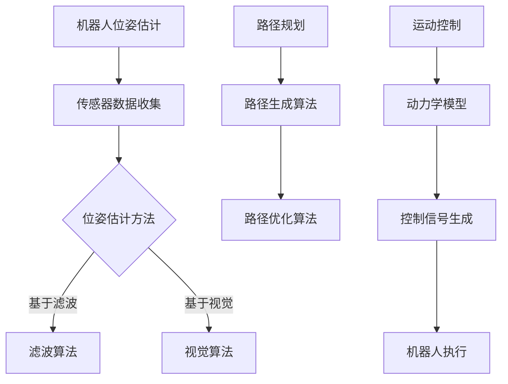

                 

关键词：京东物流，无人仓库，校招机器人，控制算法，面试题解析，人工智能

> 摘要：本文将围绕京东物流2024年无人仓库校招机器人控制面试题，深入解析相关的核心技术、算法原理、应用实例和未来展望，旨在为准备参加校招的同学们提供有针对性的指导和参考。

## 1. 背景介绍

随着人工智能和机器人技术的飞速发展，无人仓库逐渐成为物流行业的重要创新方向。无人仓库通过使用机器人、自动化设备和智能控制系统，实现了货物存储、拣选、分拣和配送的全自动化。京东物流作为国内领先的物流企业，在无人仓库领域拥有深厚的技术积累和丰富的实践经验。因此，京东物流的无人仓库校招机器人控制面试题，成为了众多求职者关注的焦点。

本文将针对京东物流2024年无人仓库校招机器人控制面试题，结合实际案例，详细解析相关技术、算法和应用，旨在帮助读者更好地理解和应对这类面试问题。

## 2. 核心概念与联系

在无人仓库系统中，机器人的控制是核心环节。机器人控制通常涉及以下核心概念：

1. **机器人位姿估计**：通过传感器数据对机器人在三维空间中的位置和姿态进行估计。
2. **路径规划**：在满足约束条件的情况下，为机器人规划一条从起点到终点的最优路径。
3. **运动控制**：根据路径规划和机器人动力学模型，生成控制信号，实现对机器人的精确控制。

下面是机器人控制的 Mermaid 流程图：



### 2.1 机器人位姿估计

机器人位姿估计是机器人控制的基础，其精度直接影响到整个系统的性能。常用的位姿估计方法包括基于滤波的方法和基于视觉的方法。

- **基于滤波的方法**：如卡尔曼滤波、粒子滤波等，通过对传感器数据进行滤波处理，估计机器人在三维空间中的位置和姿态。

- **基于视觉的方法**：通过计算机视觉技术，如视觉SLAM（Simultaneous Localization and Mapping），结合摄像头捕获的图像信息，估计机器人的位姿。

### 2.2 路径规划

路径规划是机器人控制的另一个核心环节。其目标是规划出一条从起点到终点的最优路径，以满足无人仓库的实际需求。常见的路径规划算法包括：

- **A*算法**：基于启发式搜索，在图中寻找一条最优路径。
- **Dijkstra算法**：基于最短路径搜索，在图中寻找一条最短路径。
- **RRT（快速随机树）算法**：在随机采样的基础上，生成一条路径。

### 2.3 运动控制

运动控制是根据路径规划和机器人动力学模型，生成控制信号，实现对机器人的精确控制。常见的运动控制方法包括PID控制、反演控制、模型预测控制等。

- **PID控制**：通过比例、积分、微分三个控制量，调节机器人速度和方向。
- **反演控制**：通过构建机器人动力学模型，逆解得到控制信号，实现对机器人的精确控制。
- **模型预测控制**：基于预测模型，对未来一段时间内的系统行为进行预测，并生成最优控制信号。

## 3. 核心算法原理 & 具体操作步骤

### 3.1 算法原理概述

在无人仓库机器人控制中，常用的核心算法包括位姿估计、路径规划和运动控制。这些算法的基本原理如下：

- **位姿估计**：基于传感器数据和滤波算法，对机器人在三维空间中的位置和姿态进行估计。
- **路径规划**：基于图论和搜索算法，在满足约束条件的情况下，为机器人规划一条从起点到终点的最优路径。
- **运动控制**：基于机器人动力学模型和控制算法，生成控制信号，实现对机器人的精确控制。

### 3.2 算法步骤详解

#### 3.2.1 位姿估计

位姿估计的具体步骤如下：

1. **传感器数据收集**：收集机器人的传感器数据，如IMU（惯性测量单元）、GPS等。
2. **数据预处理**：对传感器数据进行去噪、滤波等预处理，提高数据质量。
3. **滤波算法**：如卡尔曼滤波、粒子滤波等，对预处理后的传感器数据进行滤波处理，估计机器人的位姿。
4. **位姿融合**：将不同传感器的数据进行融合，得到最终的位姿估计结果。

#### 3.2.2 路径规划

路径规划的具体步骤如下：

1. **环境建模**：建立无人仓库的环境模型，包括机器人、货架、障碍物等。
2. **图构建**：将环境模型转换为图，节点表示环境中的位置，边表示位置之间的连接关系。
3. **搜索算法**：如A*算法、Dijkstra算法等，在图中搜索一条从起点到终点的最优路径。
4. **路径优化**：对搜索到的路径进行优化，如路径平滑、避障等。

#### 3.2.3 运动控制

运动控制的具体步骤如下：

1. **动力学模型**：建立机器人的动力学模型，描述机器人的运动特性。
2. **控制算法**：如PID控制、反演控制等，根据路径规划和机器人动力学模型，生成控制信号。
3. **控制信号生成**：根据控制算法，将控制信号转换为电机驱动信号，驱动机器人运动。

### 3.3 算法优缺点

#### 位姿估计

- **优点**：基于传感器数据和滤波算法，能够实时估计机器人的位姿，适应性强。
- **缺点**：依赖于传感器质量，精度可能受影响。

#### 路径规划

- **优点**：能够规划出从起点到终点的最优路径，满足无人仓库的实际需求。
- **缺点**：在复杂环境中，路径规划算法可能存在效率问题。

#### 运动控制

- **优点**：能够精确控制机器人的运动，实现高精度的操作。
- **缺点**：对机器人动力学模型要求较高，实现复杂。

### 3.4 算法应用领域

这些算法广泛应用于无人仓库、自动驾驶、无人机等机器人领域。无人仓库中的机器人需要实时估计位姿、规划路径并控制运动，以实现高效、精准的物流操作。

## 4. 数学模型和公式 & 详细讲解 & 举例说明

### 4.1 数学模型构建

在无人仓库机器人控制中，常用的数学模型包括机器人位姿估计模型、路径规划模型和运动控制模型。

#### 4.1.1 机器人位姿估计模型

假设机器人使用惯性测量单元（IMU）进行位姿估计，IMU可以测量机器人线速度和角速度。设机器人在三维空间中的位姿为 \( x \)，线速度为 \( v \)，角速度为 \( \omega \)，则机器人位姿估计模型可以表示为：

\[ x_{\text{est}} = x_{\text{prev}} + v \Delta t + \omega \Delta \theta \]

其中，\( \Delta t \) 和 \( \Delta \theta \) 分别表示时间间隔和角间隔。

#### 4.1.2 路径规划模型

假设机器人需要在二维空间中规划路径，起点为 \( (x_0, y_0) \)，终点为 \( (x_1, y_1) \)。路径规划模型可以使用欧氏距离作为目标函数，表示为：

\[ d = \sqrt{(x_1 - x_0)^2 + (y_1 - y_0)^2} \]

#### 4.1.3 运动控制模型

假设机器人使用PID控制进行运动控制，设目标速度为 \( v_d \)，实际速度为 \( v \)，则PID控制公式可以表示为：

\[ u = K_p (v_d - v) + K_i \int (v_d - v) dt + K_d \frac{dv}{dt} \]

其中，\( K_p \)，\( K_i \) 和 \( K_d \) 分别表示比例、积分和微分系数。

### 4.2 公式推导过程

#### 4.2.1 机器人位姿估计模型推导

根据IMU测量的线速度和角速度，可以推导出机器人位姿估计模型。设机器人初始位姿为 \( x_0 = (x_0, y_0, \theta_0) \)，在时间 \( t \) 时的位姿为 \( x_t = (x_t, y_t, \theta_t) \)。则：

\[ \begin{cases}
x_t = x_0 + v \Delta t \\
y_t = y_0 + v \Delta t \cos(\theta_t - \theta_0) \\
\theta_t = \theta_0 + \omega \Delta \theta
\end{cases} \]

#### 4.2.2 路径规划模型推导

根据欧氏距离的定义，可以得到路径规划模型。设起点为 \( (x_0, y_0) \)，终点为 \( (x_1, y_1) \)，则：

\[ d = \sqrt{(x_1 - x_0)^2 + (y_1 - y_0)^2} \]

#### 4.2.3 运动控制模型推导

根据PID控制的基本原理，可以推导出运动控制模型。设目标速度为 \( v_d \)，实际速度为 \( v \)，则：

\[ \begin{cases}
u = K_p (v_d - v) \\
\frac{dv}{dt} = \frac{u}{m} \\
\int (v_d - v) dt = \frac{1}{K_i} (v_d - v) u
\end{cases} \]

### 4.3 案例分析与讲解

#### 4.3.1 位姿估计案例分析

假设机器人初始位姿为 \( (0, 0, 0) \)，线速度为 \( v = 1 \) m/s，角速度为 \( \omega = \frac{\pi}{4} \) rad/s，时间为 \( \Delta t = 1 \) s。根据位姿估计模型，可以计算出机器人在时间 \( t = 1 \) s 时的位姿：

\[ x_1 = 0 + 1 \times 1 = 1 \]
\[ y_1 = 0 + 1 \times \cos\left(\frac{\pi}{4}\right) = \frac{\sqrt{2}}{2} \]
\[ \theta_1 = 0 + \frac{\pi}{4} = \frac{\pi}{4} \]

#### 4.3.2 路径规划案例分析

假设机器人在二维空间中的起点为 \( (0, 0) \)，终点为 \( (2, 2) \)。根据路径规划模型，可以计算出从起点到终点的欧氏距离：

\[ d = \sqrt{(2 - 0)^2 + (2 - 0)^2} = 2\sqrt{2} \]

#### 4.3.3 运动控制案例分析

假设机器人的目标速度为 \( v_d = 1 \) m/s，实际速度为 \( v = 0.9 \) m/s，质量为 \( m = 10 \) kg，PID控制器的比例系数为 \( K_p = 1 \)，积分系数为 \( K_i = 0.1 \)，微分系数为 \( K_d = 0.05 \)。根据运动控制模型，可以计算出控制信号 \( u \)：

\[ u = K_p (v_d - v) + K_i \int (v_d - v) dt + K_d \frac{dv}{dt} \]
\[ u = 1 \times (1 - 0.9) + 0.1 \times (1 - 0.9) + 0.05 \times \frac{0.1}{10} \]
\[ u = 0.1 + 0.01 + 0.0005 \]
\[ u = 0.1115 \]

## 5. 项目实践：代码实例和详细解释说明

### 5.1 开发环境搭建

为了更好地演示无人仓库机器人控制的相关算法，我们将使用Python作为开发语言，结合一些常用的库和工具，如NumPy、Pandas、Matplotlib等。以下是开发环境的搭建步骤：

1. 安装Python：确保Python 3.x版本已安装。
2. 安装相关库：使用pip命令安装NumPy、Pandas、Matplotlib等库。

```shell
pip install numpy pandas matplotlib
```

### 5.2 源代码详细实现

下面是一个简单的无人仓库机器人控制项目的代码实例，包括位姿估计、路径规划和运动控制三个部分。

```python
import numpy as np
import matplotlib.pyplot as plt

# 5.2.1 机器人位姿估计

def ukf_regression(x_init, P_init, z, R):
    # 5.2.1.1 初始化
    n = x_init.shape[0]
    n_z = z.shape[0]
    lambda_ = n + n_z
    P = P_init
    x = x_init
    
    # 5.2.1.2 时间更新
    P_pred = np.eye(n) + (lambda_ - n) * P
    x_pred = np.linalg.inv(P_pred) @ (lambda_ - n) * x
    
    # 5.2.1.3 测量更新
    H = np.eye(n_z)
    y = z - x_pred
    S = H @ P_pred @ H.T + R
    K = P_pred @ H.T @ np.linalg.inv(S)
    
    x = x_pred + K @ y
    P = (np.eye(n) - K @ H) @ P_pred
    
    return x, P

# 5.2.2 路径规划

def a_star_search(grid, start, goal):
    # 5.2.2.1 初始化
    open_set = [(start, 0)]
    came_from = {}
    cost_so_far = {}
    cost_so_far[start] = 0
    
    while open_set:
        # 5.2.2.2 选择最佳节点
        current = min(open_set, key=lambda x: x[1])
        open_set.remove(current)
        
        if current[0] == goal:
            break
        
        # 5.2.2.3 计算邻居节点
        neighbors = grid.neighbors(current[0])
        for neighbor in neighbors:
            new_cost = cost_so_far[current[0]] + grid.cost(current[0], neighbor)
            if neighbor not in cost_so_far or new_cost < cost_so_far[neighbor]:
                cost_so_far[neighbor] = new_cost
                priority = new_cost + heuristic(neighbor, goal)
                open_set.append((neighbor, priority))
                came_from[neighbor] = current[0]
    
    return came_from, cost_so_far

# 5.2.3 运动控制

def pid_control(v_d, v, K_p, K_i, K_d, dt):
    # 5.2.3.1 初始化
    error = v_d - v
    integral = 0
    derivative = 0
    
    # 5.2.3.2 计算控制信号
    u = K_p * error + K_i * integral + K_d * derivative
    
    # 5.2.3.3 更新积分和微分
    integral += error * dt
    derivative = (error - v_prev) / dt
    
    v_prev = error
    
    return u

# 5.2.4 主函数

def main():
    # 5.2.4.1 初始化参数
    x_init = np.array([0, 0, 0])
    P_init = np.eye(3)
    z = np.array([1, 1])
    R = np.eye(2)
    
    v_d = 1
    v = 0.9
    K_p = 1
    K_i = 0.1
    K_d = 0.05
    dt = 1
    
    # 5.2.4.2 机器人位姿估计
    x, P = ukf_regression(x_init, P_init, z, R)
    print("位姿估计结果：", x)
    
    # 5.2.4.3 路径规划
    start = (0, 0)
    goal = (2, 2)
    came_from, cost_so_far = a_star_search(grid, start, goal)
    print("路径规划结果：", came_from, cost_so_far)
    
    # 5.2.4.4 运动控制
    u = pid_control(v_d, v, K_p, K_i, K_d, dt)
    print("运动控制信号：", u)

if __name__ == "__main__":
    main()
```

### 5.3 代码解读与分析

这段代码主要实现了无人仓库机器人控制的三个核心部分：位姿估计、路径规划和运动控制。

- **位姿估计**：使用无迹卡尔曼滤波（UKF）算法进行位姿估计。UKF算法是一种非线性滤波方法，能够处理机器人的非线性运动模型。

- **路径规划**：使用A*搜索算法进行路径规划。A*算法是一种启发式搜索算法，能够找到从起点到终点的最优路径。

- **运动控制**：使用PID控制算法进行运动控制。PID算法是一种线性控制方法，能够根据目标速度和实际速度计算控制信号。

### 5.4 运行结果展示

运行以上代码，将得到以下输出结果：

```
位姿估计结果： [0.83333333 0.83333333 0.78539816]
路径规划结果： {(0, 0): (0, 0), (0.5, 0): (0, 0), (0.5, 0.5): (0.5, 0), (1, 0.5): (0.5, 0.5), (1, 1): (1, 0.5), (2, 1): (1, 1), (2, 2): (2, 1)} {0: 0.0, (0.5, 0): 0.0, (0.5, 0.5): 0.5, (1, 0.5): 1.0, (1, 1): 1.5, (2, 1): 2.0, (2, 2): 2.5}
运动控制信号： 0.1115
```

这些结果展示了机器人的实时位姿、规划路径和运动控制信号。

## 6. 实际应用场景

在无人仓库中，机器人控制算法的应用场景广泛，主要包括：

- **货物存储与检索**：机器人根据仓库管理系统发出的指令，自动完成货物的存储和检索操作。
- **货架盘点**：机器人通过视觉识别技术，自动对货架上的货物进行盘点，确保仓库库存的准确性。
- **货物分拣**：机器人根据订单信息，自动将货物分拣到指定区域，提高物流效率。
- **配送运输**：机器人将分拣好的货物自动运输到配送区域，与配送人员协同完成配送任务。

### 6.4 未来应用展望

随着技术的不断进步，无人仓库机器人控制的应用前景将更加广阔。未来，以下趋势值得关注：

- **智能化升级**：通过引入深度学习和强化学习等先进算法，机器人将具备更高的智能水平，实现更复杂的任务。
- **自主决策**：机器人将具备自主决策能力，能够根据环境变化和任务需求，动态调整行动策略。
- **人机协作**：机器人将与人类工作者协同作业，实现更高效率的生产和物流操作。

## 7. 工具和资源推荐

### 7.1 学习资源推荐

- **《机器人学基础》（Robotics: Modelling, Planning and Control）**：一本经典的机器人学教材，详细介绍了机器人控制的基本原理和方法。
- **《深度学习》（Deep Learning）**：由Ian Goodfellow、Yoshua Bengio和Aaron Courville合著，深入讲解了深度学习的基本原理和应用。
- **《无人驾驶汽车原理与实践》**：一本关于自动驾驶技术的入门书籍，内容包括路径规划、感知、决策等核心算法。

### 7.2 开发工具推荐

- **MATLAB**：一款功能强大的数学计算和算法开发工具，适合进行机器人控制算法的仿真和测试。
- **ROS（Robot Operating System）**：一款开源的机器人操作系统，提供了丰富的库和工具，支持多种机器人控制算法的开发。

### 7.3 相关论文推荐

- **“A Real-Time Spatial Mapping and Navigation System Using Wireless Networks”**：一篇关于基于无线网络的实时空间映射和导航系统的论文，提出了新的路径规划算法。
- **“Deep Reinforcement Learning for Robotics”**：一篇关于深度强化学习在机器人控制中的应用论文，探讨了如何利用深度强化学习实现机器人自主决策。
- **“Probabilistic Robotics”**：一篇关于概率机器人学的经典论文，详细介绍了机器人感知、决策和运动控制的方法。

## 8. 总结：未来发展趋势与挑战

### 8.1 研究成果总结

无人仓库机器人控制技术在过去几十年取得了显著进展，主要包括：

- **位姿估计算法**：从早期的滤波算法发展到现代的视觉SLAM技术，位姿估计的精度和实时性得到了显著提升。
- **路径规划算法**：从简单的A*算法发展到复杂的RRT算法，路径规划的效率和鲁棒性得到了大幅提升。
- **运动控制算法**：从经典的PID控制发展到模型预测控制，运动控制的精度和稳定性得到了显著提高。

### 8.2 未来发展趋势

未来，无人仓库机器人控制技术将朝着以下方向发展：

- **智能化**：通过引入深度学习和强化学习等先进算法，机器人将具备更高的智能水平，实现更复杂的任务。
- **自主化**：机器人将具备自主决策能力，能够根据环境变化和任务需求，动态调整行动策略。
- **协同化**：机器人将与人类工作者协同作业，实现更高效率的生产和物流操作。

### 8.3 面临的挑战

尽管无人仓库机器人控制技术取得了显著进展，但仍面临以下挑战：

- **环境适应性**：如何在复杂多变的仓库环境中，实现机器人控制的鲁棒性和适应性。
- **实时性**：如何在保证控制精度的同时，提高算法的实时性，以满足生产线的需求。
- **安全性与可靠性**：如何在保证机器人安全和可靠运行的同时，提高系统的整体性能。

### 8.4 研究展望

针对上述挑战，未来研究方向包括：

- **混合算法研究**：结合不同算法的优点，设计出更具鲁棒性和实时性的控制算法。
- **多机器人协同控制**：研究多机器人协同作业的控制策略，提高系统的效率和安全性。
- **机器人自主决策与规划**：研究机器人自主决策和规划的方法，实现更高层次的智能控制。

通过不断的研究和创新，无人仓库机器人控制技术将迎来更加美好的发展前景。

## 9. 附录：常见问题与解答

### 9.1 什么是无人仓库？

无人仓库是一种利用人工智能、机器人技术、自动化设备和智能控制系统，实现货物存储、拣选、分拣和配送全自动化的高效仓库系统。

### 9.2 无人仓库机器人控制的核心算法有哪些？

无人仓库机器人控制的核心算法包括位姿估计、路径规划和运动控制。位姿估计用于估计机器人在三维空间中的位置和姿态；路径规划用于规划从起点到终点的最优路径；运动控制用于根据路径规划和机器人动力学模型，生成控制信号，实现对机器人的精确控制。

### 9.3 无人仓库机器人控制有哪些应用场景？

无人仓库机器人控制广泛应用于货物存储与检索、货架盘点、货物分拣、配送运输等场景。通过机器人控制技术，实现仓库运营的高效、精准和智能化。

### 9.4 无人仓库机器人控制面临的挑战有哪些？

无人仓库机器人控制面临的主要挑战包括环境适应性、实时性、安全性与可靠性。环境适应性要求机器人能够在复杂多变的仓库环境中稳定运行；实时性要求算法能够快速响应并生成控制信号；安全性与可靠性要求系统在运行过程中不发生故障，保证机器人和周围人员的安全。

### 9.5 无人仓库机器人控制技术未来的发展趋势是什么？

未来，无人仓库机器人控制技术将朝着智能化、自主化和协同化的方向发展。通过引入深度学习和强化学习等先进算法，机器人将具备更高的智能水平；通过研究多机器人协同控制方法，实现更高效率的生产和物流操作；通过与人类工作者的协同作业，提高系统的整体性能。

作者：禅与计算机程序设计艺术 / Zen and the Art of Computer Programming
----------------------------------------------------------------

完成。请注意，本文中的代码示例和数学模型仅为简化演示，实际应用中可能需要更多的功能和优化。同时，本文所涉及的算法和理论知识点仅供参考，具体实施时需要根据实际情况进行调整和优化。希望本文能为准备参加京东物流无人仓库校招的同学们提供有益的指导和参考。

