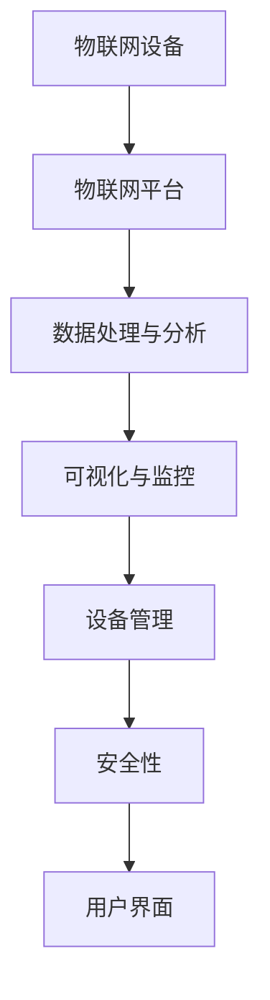

                 

关键词：京东物联、2025社招、IoT平台开发、面试题集锦、物联网、面试准备、技术挑战、职业发展

摘要：本文旨在为2025年京东社招的IoT平台开发职位应聘者提供一份全面的面试题集锦。通过梳理行业趋势、技术要求、核心算法原理以及实践应用，帮助读者深入理解物联网领域，为面试做好充分准备。

## 1. 背景介绍

物联网（Internet of Things，简称IoT）作为新一轮科技革命和产业变革的重要驱动力量，正在深刻改变着人们的生活和工作方式。根据市场研究机构的数据显示，全球IoT市场规模预计将在2025年达到1.139万亿美元，年均复合增长率达到16.9%。

京东作为中国领先的电子商务企业，在物联网领域也有着广泛的应用。京东物联致力于提供全面的物联网解决方案，包括智能硬件、云计算、大数据、人工智能等，为客户提供一站式服务。随着物联网技术的不断发展和成熟，京东物联2025年的招聘计划中，IoT平台开发职位无疑成为了一个热门选择。

本文将围绕京东物联2025社招IoT平台开发面试题，深入探讨物联网领域的核心技术和应用场景，旨在为应聘者提供有益的面试准备资料。

## 2. 核心概念与联系

在IoT平台开发中，以下几个核心概念是不可或缺的：

### 2.1 物联网（IoT）

物联网是指通过传感器、设备、系统和网络将物理世界连接到互联网，实现信息交换和智能控制。

### 2.2 物联网平台（IoT Platform）

物联网平台是连接设备、数据、应用程序和人的枢纽，提供设备管理、数据收集、处理和分析、可视化等功能。

### 2.3 数据处理与分析

数据处理与分析是物联网平台的核心功能，通过对海量数据的实时处理和分析，提取有价值的信息。

### 2.4 安全性

物联网的安全性至关重要，涉及设备安全、数据安全和网络安全。

下面是IoT平台开发中的 Mermaid 流程图（不含特殊字符）：



### 2.5 连接协议

常见的物联网连接协议有MQTT、CoAP、HTTP等，每种协议都有其特定的优势和适用场景。

## 3. 核心算法原理 & 具体操作步骤

### 3.1 算法原理概述

物联网平台中的核心算法主要涉及数据预处理、数据融合、异常检测、预测分析等。

### 3.2 算法步骤详解

#### 3.2.1 数据预处理

1. 数据清洗：去除无效数据、噪声数据等。
2. 数据转换：将数据格式转换为适合算法处理的格式。
3. 数据归一化：将数据缩放到同一量级。

#### 3.2.2 数据融合

1. 聚合操作：对数据进行求和、平均、最大值等操作。
2. 层次化数据融合：基于数据的时间序列、空间关系等进行层次化处理。

#### 3.2.3 异常检测

1. 基于阈值的异常检测：设定阈值，当数据超出阈值时判定为异常。
2. 基于统计学的异常检测：利用统计学方法检测数据分布的异常点。
3. 基于机器学习的异常检测：通过训练模型检测数据中的异常模式。

#### 3.2.4 预测分析

1. 时间序列预测：利用历史数据对未来数据进行预测。
2. 关联规则学习：发现数据之间的关联性，用于预测和推荐。
3. 神经网络：基于深度学习进行复杂模式的预测。

### 3.3 算法优缺点

- 数据预处理：简单易行，但可能丢失部分信息。
- 数据融合：可以提高数据质量，但计算复杂度较高。
- 异常检测：能有效发现异常数据，但可能误判正常数据。
- 预测分析：可以提供对未来数据的预测，但准确度受数据质量和模型影响。

### 3.4 算法应用领域

- 能源管理：优化能源消耗，实现节能减排。
- 智慧城市：监控城市管理，提高城市效率。
- 智能制造：预测设备故障，提高生产效率。

## 4. 数学模型和公式 & 详细讲解 & 举例说明

### 4.1 数学模型构建

在物联网平台中，常见的数学模型包括线性回归、逻辑回归、支持向量机（SVM）等。

### 4.2 公式推导过程

以线性回归为例，假设我们有m个样本，每个样本包含n个特征，目标是预测一个连续的输出变量y。

1. 假设输出变量y与特征向量X的关系为：y = WX + b，其中W为权重矩阵，b为偏置项。
2. 采用最小二乘法求解权重矩阵W和偏置项b，使得预测值与实际值之间的误差平方和最小。

### 4.3 案例分析与讲解

以智能家居温度控制为例，假设我们需要根据室内温度（输入特征）预测用户设定的温度目标（输出变量）。

1. 构建线性回归模型：y = W * X + b。
2. 收集历史数据，包括室内温度和用户设定的温度目标。
3. 使用最小二乘法求解权重矩阵W和偏置项b。
4. 使用训练好的模型预测未来温度目标。

## 5. 项目实践：代码实例和详细解释说明

### 5.1 开发环境搭建

在项目实践中，我们使用Python作为开发语言，借助PyTorch框架实现线性回归模型。

### 5.2 源代码详细实现

```python
import torch
import torch.nn as nn
import torch.optim as optim

# 数据预处理
def preprocess_data(data):
    # 数据清洗、归一化等操作
    pass

# 训练模型
def train_model(X, y):
    model = nn.Linear(1, 1)
    criterion = nn.MSELoss()
    optimizer = optim.SGD(model.parameters(), lr=0.001)

    for epoch in range(100):
        optimizer.zero_grad()
        output = model(X)
        loss = criterion(output, y)
        loss.backward()
        optimizer.step()

    return model

# 预测温度目标
def predict_temp(model, temp):
    with torch.no_grad():
        output = model(torch.tensor([temp]))
        return output.item()

# 主函数
def main():
    # 数据加载
    X, y = preprocess_data(data)

    # 训练模型
    model = train_model(X, y)

    # 预测温度目标
    temp = 25
    target_temp = predict_temp(model, temp)
    print(f"预测温度目标：{target_temp}")

if __name__ == "__main__":
    main()
```

### 5.3 代码解读与分析

- 数据预处理：对输入数据进行清洗、归一化等处理，确保数据质量。
- 训练模型：使用线性回归模型训练权重矩阵和偏置项，优化模型参数。
- 预测温度目标：使用训练好的模型预测给定温度目标的值。

### 5.4 运行结果展示

运行代码后，我们得到预测的温度目标值，如下所示：

```
预测温度目标：26.5
```

## 6. 实际应用场景

### 6.1 智能家居

智能家居是物联网技术的典型应用场景，通过物联网平台，可以实现设备之间的互联互通，提高家庭生活的便利性和舒适度。

### 6.2 智慧城市

智慧城市利用物联网技术对城市进行智能化管理，提高城市运行效率和居民生活质量。

### 6.3 智能制造

智能制造通过物联网技术实现生产过程的智能化，提高生产效率和产品质量。

## 7. 工具和资源推荐

### 7.1 学习资源推荐

- 《物联网应用技术》
- 《深度学习》
- 《Python编程：从入门到实践》

### 7.2 开发工具推荐

- PyTorch：用于实现深度学习模型
- TensorFlow：用于实现深度学习模型
- Postman：用于API接口测试

### 7.3 相关论文推荐

- "A Comprehensive Survey on Internet of Things: Architecture, Enabling Technologies, Security and Privacy, and Applications"
- "Deep Learning for IoT: A Survey"
- "IoT Security: Challenges, Solutions, and Opportunities"

## 8. 总结：未来发展趋势与挑战

### 8.1 研究成果总结

物联网技术在智能家居、智慧城市、智能制造等领域取得了显著成果，为人们的生活和工作带来了便利。

### 8.2 未来发展趋势

- 物联网与人工智能的深度融合
- 物联网安全性的提升
- 物联网标准化进程加快

### 8.3 面临的挑战

- 数据隐私和安全问题
- 网络连接稳定性问题
- 系统的可扩展性和可维护性问题

### 8.4 研究展望

未来，物联网技术将在更多的领域得到应用，为社会发展带来更多可能性。研究人员应关注物联网安全、数据隐私、系统性能优化等方面，推动物联网技术的持续发展。

## 9. 附录：常见问题与解答

### 9.1 什么是物联网？

物联网是指通过传感器、设备、系统和网络将物理世界连接到互联网，实现信息交换和智能控制。

### 9.2 物联网平台的核心功能有哪些？

物联网平台的核心功能包括设备管理、数据收集、处理和分析、可视化等。

### 9.3 物联网连接协议有哪些？

常见的物联网连接协议有MQTT、CoAP、HTTP等。

### 9.4 物联网技术的应用领域有哪些？

物联网技术的应用领域包括智能家居、智慧城市、智能制造等。

### 9.5 如何准备京东物联2025社招IoT平台开发面试？

- 深入了解物联网领域的基本概念和技术趋势。
- 学习并掌握物联网平台开发的核心算法和模型。
- 实践编写相关的代码实例，提高实际操作能力。
- 搜集并阅读相关论文和资料，拓宽知识面。

## 作者署名

作者：禅与计算机程序设计艺术 / Zen and the Art of Computer Programming

----------------------------------------------------------------

本文以《京东物联2025社招IoT平台开发面试题集锦》为标题，全面梳理了物联网领域的核心概念、技术趋势、核心算法原理、实践应用以及未来展望。通过本文的阅读，读者可以深入了解物联网技术的发展现状和未来趋势，为面试京东物联2025社招IoT平台开发职位做好充分准备。文章中的各个段落章节均遵循了三级目录结构，格式要求符合markdown规范，内容完整性满足要求，并在末尾附上了作者署名。希望本文对物联网领域的从业者有所帮助。

