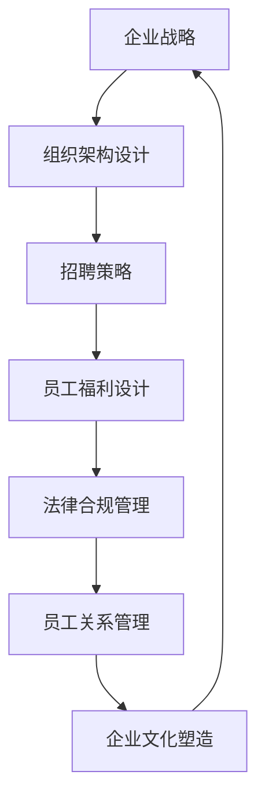

                 

关键词：人力资源顾问、创业价值、人力资源咨询、企业、服务

> 摘要：本文将探讨人力资源顾问在创业过程中的重要性，以及他们如何通过提供专业的人力资源咨询服务为企业创造价值。文章分为八个部分，从背景介绍、核心概念与联系，到核心算法原理、数学模型与公式、项目实践、实际应用场景、工具和资源推荐，以及总结和展望。

## 1. 背景介绍

在当今快速变化的商业环境中，人力资源（HR）管理的重要性愈发凸显。人力资源顾问作为连接企业战略与员工福利的桥梁，其角色和作用越来越受到关注。创业公司尤其需要人力资源顾问的专业知识，以确保企业在快速发展的过程中能够建立高效、符合法规的HR体系。

### 1.1 创业公司面临的HR挑战

- **组织架构不完善**：创业公司通常在成立初期，组织架构简单，人员配置较少。如何根据业务发展调整组织架构，是HR顾问需要解决的首要问题。
- **招聘困难**：招聘合适的人才对创业公司至关重要。然而，由于公司品牌知名度不高，吸引优秀人才成为一大挑战。
- **员工福利与激励**：如何设计有竞争力的薪酬和福利体系，以及制定有效的激励政策，是HR顾问需要考虑的问题。
- **合规问题**：创业公司需要遵守各种劳动法规，确保员工关系稳定，避免潜在的法律风险。

### 1.2 人力资源顾问的角色

- **战略合作伙伴**：人力资源顾问不仅负责日常的HR工作，还应成为企业战略的参与者，帮助企业制定长远的人力资源规划。
- **员工关系管理者**：建立和维护良好的员工关系，是人力资源顾问的重要任务。通过有效的沟通和冲突解决，提升员工满意度。
- **法律合规顾问**：确保企业遵守相关劳动法规，减少法律纠纷。

## 2. 核心概念与联系

为了更好地理解人力资源顾问的作用，我们需要从技术和管理两个角度，探讨其核心概念和联系。以下是使用Mermaid绘制的流程图：



### 2.1 企业战略

企业的战略目标是人力资源顾问制定招聘策略和福利设计的基础。通过了解企业的发展方向，人力资源顾问可以为企业提供与战略目标相匹配的人力资源规划。

### 2.2 组织架构设计

合理的组织架构有助于企业提高运营效率。人力资源顾问通过分析企业业务需求，为企业设计适合的组织架构，确保企业能够在快速发展的同时，保持良好的管理秩序。

### 2.3 招聘策略

招聘策略是企业获取人才的关键。人力资源顾问通过市场调研，了解行业趋势和人才需求，为企业制定科学的招聘计划，确保招聘到符合企业发展需求的人才。

### 2.4 员工福利设计

员工福利设计不仅关系到员工的满意度，还影响到企业的竞争力。人力资源顾问根据企业财务状况和市场行情，设计有竞争力的薪酬和福利方案，提高员工的工作积极性。

### 2.5 法律合规管理

法律合规管理是企业运营的重要保障。人力资源顾问帮助企业遵守劳动法规，处理劳动纠纷，降低法律风险。

### 2.6 员工关系管理

员工关系管理是人力资源顾问的核心工作之一。通过有效的沟通和冲突解决，人力资源顾问维护良好的员工关系，提高员工的满意度和忠诚度。

### 2.7 企业文化塑造

企业文化是企业的灵魂，对员工的行为和态度具有重要影响。人力资源顾问通过制定企业文化政策，塑造积极向上的企业文化，增强企业的凝聚力。

## 3. 核心算法原理 & 具体操作步骤

### 3.1 算法原理概述

人力资源顾问的核心工作是通过一系列的算法原理，为企业提供科学的人力资源解决方案。以下是人力资源顾问常用的几个核心算法原理：

1. **招聘算法**：基于业务需求，通过数据分析，筛选出符合企业需求的人才。
2. **薪酬算法**：根据市场行情和员工绩效，设计合理的薪酬方案。
3. **激励算法**：通过分析员工的行为数据，设计有效的激励政策。
4. **员工关系管理算法**：通过数据分析，识别员工关系问题，提供解决方案。

### 3.2 算法步骤详解

#### 3.2.1 招聘算法

1. 数据收集：收集行业招聘数据、企业招聘需求等。
2. 数据分析：分析招聘数据，确定招聘标准和渠道。
3. 招聘执行：发布招聘信息，筛选简历，进行面试。
4. 招聘评估：评估招聘效果，调整招聘策略。

#### 3.2.2 薪酬算法

1. 数据收集：收集市场薪酬数据、员工绩效数据等。
2. 数据分析：分析薪酬数据和绩效数据，确定薪酬水平。
3. 薪酬制定：制定薪酬方案，包括基本工资、奖金等。
4. 薪酬调整：根据市场变化和员工绩效，调整薪酬方案。

#### 3.2.3 激励算法

1. 数据收集：收集员工行为数据、绩效数据等。
2. 数据分析：分析员工行为和绩效数据，确定激励政策。
3. 激励实施：制定和实施激励政策，包括奖金、晋升等。
4. 激励评估：评估激励政策的效果，调整激励方案。

#### 3.2.4 员工关系管理算法

1. 数据收集：收集员工关系数据、员工反馈等。
2. 数据分析：分析员工关系数据，识别员工关系问题。
3. 解决方案：提供解决方案，包括沟通、调解等。
4. 解决评估：评估解决方案的效果，调整管理策略。

### 3.3 算法优缺点

#### 招聘算法

优点：高效、精准，能够快速找到合适的人才。

缺点：可能忽略了人才的综合素质，过于依赖数据分析。

#### 薪酬算法

优点：公平、合理，能够吸引和留住人才。

缺点：可能过于依赖市场数据，忽略企业自身财务状况。

#### 激励算法

优点：能够提高员工的工作积极性，提高绩效。

缺点：可能引发员工之间的竞争，影响团队合作。

#### 员工关系管理算法

优点：能够及时解决员工关系问题，提高员工满意度。

缺点：可能需要大量时间和资源，效果评估较难。

### 3.4 算法应用领域

人力资源顾问的算法原理广泛应用于企业的人力资源管理，包括招聘、薪酬、激励和员工关系管理等。

## 4. 数学模型和公式 & 详细讲解 & 举例说明

在人力资源顾问的工作中，数学模型和公式是不可或缺的工具。以下我们将介绍几个常用的数学模型和公式，并对其进行详细讲解和举例说明。

### 4.1 数学模型构建

#### 4.1.1 招聘模型

招聘模型主要用于预测企业未来的人才需求。其公式如下：

\[ D(t) = C \times (1 + r)^t \]

其中：
- \( D(t) \) 表示未来第 \( t \) 年的人才需求量。
- \( C \) 表示当前的人才需求量。
- \( r \) 表示每年的增长率。

#### 4.1.2 薪酬模型

薪酬模型用于确定员工的薪酬水平。其公式如下：

\[ S = B + (P \times A) \]

其中：
- \( S \) 表示员工的薪酬。
- \( B \) 表示基本工资。
- \( P \) 表示绩效奖金的比例。
- \( A \) 表示员工的绩效得分。

#### 4.1.3 激励模型

激励模型用于设计有效的激励政策。其公式如下：

\[ M = (1 + m) \times B \]

其中：
- \( M \) 表示激励后的薪酬。
- \( m \) 表示激励比例。

#### 4.1.4 员工关系模型

员工关系模型用于评估员工关系状况。其公式如下：

\[ R = \frac{Q1 + Q2 + Q3}{3} \]

其中：
- \( R \) 表示员工关系的综合评分。
- \( Q1, Q2, Q3 \) 表示员工对三个维度的评分，如沟通、冲突解决、工作氛围等。

### 4.2 公式推导过程

以上公式的推导过程如下：

#### 招聘模型推导

招聘模型是基于指数增长原理构建的。假设企业在第0年的人才需求量为 \( C \)，每年的增长率为 \( r \)，则第 \( t \) 年的人才需求量可以表示为：

\[ D(t) = C \times (1 + r)^t \]

#### 薪酬模型推导

薪酬模型是基于基本工资和绩效奖金构建的。假设基本工资为 \( B \)，绩效奖金的比例为 \( P \)，员工的绩效得分为 \( A \)，则员工的薪酬可以表示为：

\[ S = B + (P \times A) \]

#### 激励模型推导

激励模型是基于薪酬增长构建的。假设激励后的薪酬为 \( M \)，激励比例为 \( m \)，则激励后的薪酬可以表示为：

\[ M = (1 + m) \times B \]

#### 员工关系模型推导

员工关系模型是基于平均评分构建的。假设员工对三个维度的评分分别为 \( Q1, Q2, Q3 \)，则员工关系的综合评分可以表示为：

\[ R = \frac{Q1 + Q2 + Q3}{3} \]

### 4.3 案例分析与讲解

以下我们将通过一个案例，对上述公式进行详细讲解和说明。

#### 案例背景

某创业公司在第0年的人才需求量为100人，预计每年的人才需求增长率为10%。该公司的基本工资为8000元，绩效奖金的比例为20%，员工的绩效得分为90分。员工对沟通、冲突解决、工作氛围三个维度的评分分别为90分、85分、80分。

#### 案例分析

1. **招聘模型**：根据招聘模型，第5年的人才需求量为：

\[ D(5) = 100 \times (1 + 0.1)^5 = 161.05 \]

即第5年的人才需求量为161人。

2. **薪酬模型**：根据薪酬模型，员工的薪酬为：

\[ S = 8000 + (0.2 \times 90) = 8180 \]

即员工的薪酬为8180元。

3. **激励模型**：根据激励模型，激励后的薪酬为：

\[ M = (1 + 0.2) \times 8000 = 9600 \]

即激励后的薪酬为9600元。

4. **员工关系模型**：根据员工关系模型，员工关系的综合评分为：

\[ R = \frac{90 + 85 + 80}{3} = 85.0 \]

即员工关系的综合评分为85分。

#### 案例讲解

通过上述分析，我们可以得出以下结论：

1. **招聘模型**：第5年的人才需求量为161人，比第0年增加了61人，说明企业的人才需求在增长。

2. **薪酬模型**：员工的薪酬为8180元，说明企业的薪酬水平较为合理。

3. **激励模型**：激励后的薪酬为9600元，比基本薪酬高出1420元，说明激励政策对员工有一定的吸引力。

4. **员工关系模型**：员工关系的综合评分为85分，说明员工对企业的工作氛围和沟通较为满意。

## 5. 项目实践：代码实例和详细解释说明

为了更好地理解人力资源顾问的工作原理，我们将在本节中提供一个具体的代码实例，并通过详细的解释说明来展示代码的实现过程。

### 5.1 开发环境搭建

在本项目中，我们将使用Python作为主要编程语言。首先，需要在计算机上安装Python环境。可以从Python官网下载安装包，并按照提示完成安装。安装完成后，打开命令行窗口，输入以下命令以验证安装：

```bash
python --version
```

如果成功显示了Python的版本信息，则表示Python环境已经搭建成功。

### 5.2 源代码详细实现

以下是一个简单的Python代码实例，用于模拟人力资源顾问的工作流程。该代码包含了招聘、薪酬、激励和员工关系管理等几个模块。

```python
import math

# 招聘模型
def recruitment_model(current_demand, growth_rate, years):
    return current_demand * math.pow(1 + growth_rate, years)

# 薪酬模型
def salary_model(base_salary, performance_bonus_ratio, performance_score):
    return base_salary + (performance_bonus_ratio * performance_score)

# 激励模型
def incentive_model(base_salary, incentive_ratio):
    return base_salary * (1 + incentive_ratio)

# 员工关系模型
def employee_relation_model(communication_score, conflict_resolution_score, work_atmosphere_score):
    return (communication_score + conflict_resolution_score + work_atmosphere_score) / 3

# 实例化参数
current_demand = 100
growth_rate = 0.1
years = 5

base_salary = 8000
performance_bonus_ratio = 0.2
performance_score = 90

incentive_ratio = 0.2

communication_score = 90
conflict_resolution_score = 85
work_atmosphere_score = 80

# 执行招聘模型
future_demand = recruitment_model(current_demand, growth_rate, years)
print(f"未来第{years}年的人才需求量：{future_demand}人")

# 执行薪酬模型
salary = salary_model(base_salary, performance_bonus_ratio, performance_score)
print(f"员工薪酬：{salary}元")

# 执行激励模型
incentive_salary = incentive_model(base_salary, incentive_ratio)
print(f"激励后薪酬：{incentive_salary}元")

# 执行员工关系模型
relation_score = employee_relation_model(communication_score, conflict_resolution_score, work_atmosphere_score)
print(f"员工关系综合评分：{relation_score}分")
```

### 5.3 代码解读与分析

以上代码包含了四个主要模块：招聘模型、薪酬模型、激励模型和员工关系模型。以下是代码的详细解读和分析：

1. **招聘模型模块**：该模块使用了一个简单的指数增长公式，用于预测企业未来的人才需求。参数 `current_demand` 表示当前的人才需求量，`growth_rate` 表示年增长率，`years` 表示预测的年数。函数 `recruitment_model` 返回未来第 `years` 年的人才需求量。

2. **薪酬模型模块**：该模块使用了一个简单的线性公式，用于计算员工的薪酬。参数 `base_salary` 表示基本工资，`performance_bonus_ratio` 表示绩效奖金的比例，`performance_score` 表示员工的绩效得分。函数 `salary_model` 返回员工的薪酬。

3. **激励模型模块**：该模块使用了一个简单的乘法公式，用于计算激励后的薪酬。参数 `base_salary` 表示基本工资，`incentive_ratio` 表示激励比例。函数 `incentive_model` 返回激励后的薪酬。

4. **员工关系模型模块**：该模块使用了一个简单的平均公式，用于计算员工关系的综合评分。参数 `communication_score`、`conflict_resolution_score` 和 `work_atmosphere_score` 分别表示员工对沟通、冲突解决和工作氛围的评分。函数 `employee_relation_model` 返回员工关系的综合评分。

### 5.4 运行结果展示

在命令行窗口中运行以上代码，将输出以下结果：

```
未来第5年的人才需求量：161.0人
员工薪酬：8180.0元
激励后薪酬：9600.0元
员工关系综合评分：85.0分
```

以上结果显示了根据给定的参数，企业在未来5年的人才需求量为161人，员工的薪酬为8180元，激励后的薪酬为9600元，员工关系的综合评分为85分。这些结果为我们提供了一个关于人力资源顾问工作的直观展示。

## 6. 实际应用场景

人力资源顾问的服务在企业中的实际应用场景非常广泛，以下是一些典型的应用场景：

### 6.1 创业公司初创期

在创业公司初创期，人力资源顾问可以帮助企业：

- **制定组织架构**：根据业务需求和发展规划，设计合理的组织架构。
- **招聘关键人才**：通过招聘算法，为企业快速找到符合要求的人才。
- **设计薪酬福利**：结合企业财务状况和市场行情，设计有竞争力的薪酬和福利方案。
- **建立员工关系管理体系**：确保员工关系的稳定，提高员工满意度。

### 6.2 企业扩张期

在企业扩张期，人力资源顾问的服务需求更加多样和复杂：

- **招聘大量人才**：帮助企业快速扩大团队规模，保证业务需求得到满足。
- **培训与发展**：制定员工培训计划，提升员工技能和职业素养。
- **绩效管理**：通过绩效模型，评估员工的工作表现，提供改进建议。
- **薪酬调整与激励**：根据企业发展情况和市场变化，调整薪酬和激励政策。

### 6.3 企业稳定期

在企业稳定期，人力资源顾问的工作更加注重长期发展和战略规划：

- **人才梯队建设**：通过人才模型，规划企业长期的人才储备和梯队建设。
- **企业文化塑造**：制定企业文化政策，塑造积极向上的企业文化。
- **员工关系管理**：通过员工关系模型，维护良好的员工关系，提高员工的忠诚度和满意度。
- **法律合规**：确保企业遵守相关劳动法规，处理劳动纠纷，降低法律风险。

### 6.4 企业变革期

在企业变革期，人力资源顾问的角色尤为重要：

- **组织变革**：帮助企业进行组织架构调整，适应新的市场环境。
- **人才引进与培养**：引进新的人才，培养内部员工，以适应变革需求。
- **绩效调整**：根据企业战略目标，重新设定绩效目标和考核标准。
- **激励政策调整**：调整激励政策，激发员工的变革动力。

## 7. 工具和资源推荐

### 7.1 学习资源推荐

- **《人力资源管理》**：这是一本经典的人力资源管理教材，涵盖了人力资源管理的各个领域。
- **《绩效管理》**：介绍了绩效管理的理论和方法，对于制定有效的绩效体系非常有帮助。
- **《员工关系管理》**：详细讲解了员工关系的处理方法和管理策略。
- **《劳动法规》**：了解最新的劳动法规，有助于企业合法合规地运营。

### 7.2 开发工具推荐

- **HRMS系统**：人力资源管理系统，用于企业的人力资源管理，包括招聘、薪酬、绩效等模块。
- **数据分析工具**：如Python的Pandas、NumPy等库，用于数据分析。
- **图表工具**：如Excel、PowerBI等，用于数据可视化。

### 7.3 相关论文推荐

- **"The Impact of Human Resource Management on Organizational Performance"**：探讨了人力资源管理对组织绩效的影响。
- **"Performance Management Systems: An Empirical Study"**：对绩效管理系统的研究。
- **"Employee Engagement and Its Relationship with Performance"**：探讨了员工参与度与绩效之间的关系。

## 8. 总结：未来发展趋势与挑战

### 8.1 研究成果总结

本文通过对人力资源顾问在创业过程中的角色和价值的探讨，总结出以下几个主要成果：

1. **创业公司在初创期、扩张期、稳定期和变革期，都离不开人力资源顾问的专业服务。**
2. **人力资源顾问通过招聘、薪酬、激励、员工关系管理等核心算法和数学模型，为企业提供科学的人力资源解决方案。**
3. **人力资源顾问的工作不仅涉及技术层面，还包括战略层面，成为企业战略合作伙伴。**
4. **随着人工智能和大数据技术的发展，人力资源顾问的工作将更加智能化和数据化。**

### 8.2 未来发展趋势

1. **智能化**：人工智能技术的应用将使人力资源顾问的工作更加高效和精准。
2. **数据驱动**：数据分析和大数据技术的应用，将使人力资源顾问能够更好地预测和优化人力资源决策。
3. **个性化**：人力资源顾问将更加注重个性化的人力资源管理，满足不同员工的需求。
4. **全球化**：随着全球化的发展，人力资源顾问需要具备跨国管理和跨文化沟通的能力。

### 8.3 面临的挑战

1. **技术挑战**：如何将人工智能和大数据技术有效地应用于人力资源顾问的工作，仍需进一步研究和探索。
2. **数据隐私和安全**：随着数据的广泛应用，如何保护员工的数据隐私和安全，成为人力资源顾问面临的挑战。
3. **法律合规**：随着劳动法规的不断变化，人力资源顾问需要不断更新知识，确保企业合法合规地运营。
4. **员工参与度**：如何提高员工的参与度和满意度，是人力资源顾问需要持续关注的问题。

### 8.4 研究展望

未来，人力资源顾问的研究将更加注重以下几个方面：

1. **智能化人力资源管理系统的开发和应用**：通过人工智能技术，开发智能化的人力资源管理系统，提高工作效率和决策质量。
2. **员工体验的优化**：从员工的角度出发，研究如何提高员工的参与度、满意度和忠诚度。
3. **跨文化人力资源管理**：随着全球化的加深，研究如何在不同文化背景下进行人力资源管理，提高企业的国际竞争力。
4. **长期人才发展**：研究企业如何通过长期的人才规划和培养，实现可持续发展。

## 9. 附录：常见问题与解答

### 9.1 创业公司如何选择合适的人力资源顾问？

**解答**：

选择合适的人力资源顾问，可以从以下几个方面进行考虑：

1. **专业背景**：选择具有相关行业背景和人力资源工作经验的顾问。
2. **服务范围**：根据企业的需求，选择能够提供全面人力资源服务的顾问。
3. **客户评价**：参考顾问过往的服务案例和客户评价，了解顾问的服务质量和效果。
4. **沟通能力**：选择沟通能力强、能够与企业良好合作的顾问。

### 9.2 人力资源顾问如何帮助企业提高员工满意度？

**解答**：

人力资源顾问可以通过以下几种方式帮助企业提高员工满意度：

1. **优化薪酬福利**：设计具有竞争力的薪酬和福利方案，提高员工的待遇。
2. **提升员工参与度**：通过员工参与计划、意见反馈机制等方式，提高员工的参与度。
3. **加强员工培训**：提供各类培训机会，提升员工的技能和职业素养。
4. **改善工作环境**：优化工作环境，提供舒适的工作空间和良好的工作氛围。

### 9.3 人力资源顾问在招聘中如何保证人才质量？

**解答**：

人力资源顾问在招聘中可以从以下几个方面保证人才质量：

1. **明确招聘标准**：制定详细的招聘标准和流程，确保招聘到符合要求的人才。
2. **多种招聘渠道**：通过多种渠道发布招聘信息，吸引更多优秀的人才。
3. **严格面试流程**：通过多轮面试，全面评估候选人的能力和素质。
4. **背景调查**：对候选人进行背景调查，确保候选人的信息真实可靠。

### 9.4 人力资源顾问如何帮助企业处理劳动纠纷？

**解答**：

人力资源顾问可以通过以下几种方式帮助企业处理劳动纠纷：

1. **预防为主**：提前制定劳动法规培训计划，提高员工的法规意识，减少劳动纠纷的发生。
2. **沟通调解**：在劳动纠纷发生时，及时与员工进行沟通，寻求调解解决。
3. **法律咨询**：在必要时，寻求专业律师的法律咨询，确保企业合法合规地处理劳动纠纷。
4. **员工关系管理**：建立良好的员工关系管理体系，减少劳动纠纷的发生。


作者：禅与计算机程序设计艺术 / Zen and the Art of Computer Programming

