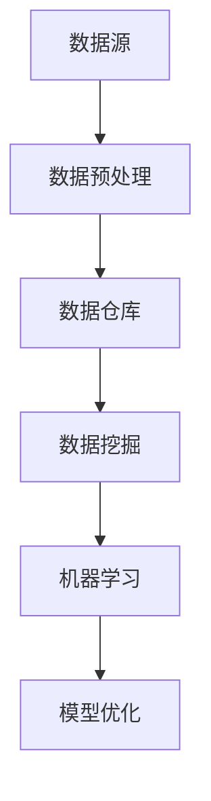

                 

关键词：人工智能、创业、数据管理、工具、架构、算法、数学模型、实践、应用、展望、资源推荐

> 摘要：本文将深入探讨人工智能创业中的数据管理工具，分析其核心概念、算法原理、数学模型，并通过实际项目实例展示其应用效果。同时，我们还将对未来的发展趋势、挑战和研究展望进行展望，为创业者提供有益的参考。

## 1. 背景介绍

在当今全球数字经济蓬勃发展的背景下，人工智能技术逐渐成为推动产业变革的重要力量。创业者在开展人工智能项目时，面临着海量数据的管理和挖掘难题。如何高效地管理数据、提取有价值的信息，成为创业成功的关键。因此，开发一款具备强大数据处理能力的工具，对于人工智能创业者来说具有重要意义。

本文将围绕人工智能创业数据管理工具，从以下几个方面进行探讨：

- 核心概念与联系
- 核心算法原理与具体操作步骤
- 数学模型与公式推导
- 项目实践：代码实例与详细解释
- 实际应用场景
- 未来应用展望
- 工具和资源推荐
- 总结：未来发展趋势与挑战

## 2. 核心概念与联系

首先，我们需要明确一些核心概念，以便更好地理解数据管理工具的原理和应用。

### 数据管理

数据管理是指对数据的收集、存储、处理、分析和应用的过程。在人工智能创业中，数据管理工具的主要目标是确保数据的质量、完整性和可用性，以便为后续的分析和应用提供支持。

### 数据源

数据源是指数据产生的地方，可以是内部数据（如企业内部系统产生的日志数据、用户行为数据等），也可以是外部数据（如社交媒体数据、公共数据集等）。

### 数据预处理

数据预处理是数据管理过程中的关键步骤，主要包括数据清洗、数据转换和数据集成。数据清洗旨在去除重复、缺失和错误的数据，提高数据质量；数据转换涉及将数据转换为统一的格式和结构，以便进行后续处理；数据集成则是将多个数据源的数据整合在一起，形成完整的视图。

### 数据仓库

数据仓库是一个用于存储和管理大量数据的集中式系统，主要用于支持数据分析和报告。数据仓库通常采用数据仓库技术，如数据仓库建模、数据仓库查询和数据仓库优化。

### 数据挖掘

数据挖掘是一种通过分析大量数据，发现潜在的模式、关联和趋势的自动化过程。在人工智能创业中，数据挖掘可以帮助创业者发现市场机会、优化产品功能和提升用户体验。

### 机器学习

机器学习是一种基于数据建立模型，使计算机能够自动学习和改进的技术。在人工智能创业中，机器学习算法被广泛应用于分类、预测、聚类等任务。

### Mermaid 流程图

下面是一个用于描述数据管理工具核心概念的 Mermaid 流程图：



## 3. 核心算法原理 & 具体操作步骤

### 3.1 算法原理概述

数据管理工具的核心算法主要包括数据预处理、数据挖掘和机器学习算法。以下分别介绍这三种算法的原理。

#### 数据预处理算法

数据预处理算法主要包括数据清洗、数据转换和数据集成。数据清洗算法用于去除重复、缺失和错误的数据；数据转换算法用于将数据转换为统一的格式和结构；数据集成算法用于将多个数据源的数据整合在一起。

#### 数据挖掘算法

数据挖掘算法主要包括分类、预测、聚类等算法。分类算法用于将数据划分为不同的类别；预测算法用于预测未来可能发生的事件；聚类算法用于将相似的数据归为一类。

#### 机器学习算法

机器学习算法主要包括监督学习、无监督学习和强化学习。监督学习算法通过已标记的数据训练模型，从而对新的数据进行分类或预测；无监督学习算法通过未标记的数据发现数据中的模式；强化学习算法通过与环境的交互，不断优化策略。

### 3.2 算法步骤详解

#### 数据预处理算法步骤

1. 数据清洗：去除重复、缺失和错误的数据。
2. 数据转换：将数据转换为统一的格式和结构。
3. 数据集成：将多个数据源的数据整合在一起。

#### 数据挖掘算法步骤

1. 数据探索：对数据进行分析，发现潜在的模式。
2. 特征选择：选择对数据挖掘任务最有用的特征。
3. 模型训练：使用已标记的数据训练分类、预测或聚类模型。
4. 模型评估：评估模型的性能，选择最优模型。

#### 机器学习算法步骤

1. 数据准备：收集和预处理数据。
2. 模型选择：选择合适的机器学习算法。
3. 模型训练：使用已标记的数据训练模型。
4. 模型评估：评估模型的性能。
5. 模型优化：调整模型参数，提高模型性能。

### 3.3 算法优缺点

#### 数据预处理算法

优点：提高数据质量，为后续分析提供支持。

缺点：处理过程复杂，耗时较长。

#### 数据挖掘算法

优点：发现潜在的模式和关联，为决策提供支持。

缺点：算法复杂度较高，对计算资源要求较高。

#### 机器学习算法

优点：自动学习和改进，提高数据分析的效率。

缺点：对数据质量要求较高，易受到噪声和异常值的影响。

### 3.4 算法应用领域

数据预处理算法、数据挖掘算法和机器学习算法广泛应用于各个领域，如金融、医疗、零售、电商等。以下是一些典型应用场景：

- 金融领域：利用数据预处理算法对金融数据进行分析，发现潜在的风险和机会。
- 医疗领域：利用数据挖掘算法对医疗数据进行分析，发现疾病的早期症状和治疗方案。
- 零售领域：利用机器学习算法对零售数据进行分析，优化库存管理、产品推荐等。

## 4. 数学模型和公式 & 详细讲解 & 举例说明

### 4.1 数学模型构建

在数据管理工具中，常用的数学模型包括概率模型、线性模型、神经网络模型等。以下分别介绍这些模型的构建方法。

#### 概率模型

概率模型主要用于描述数据中的不确定性和随机性。常见的概率模型包括伯努利分布、泊松分布、正态分布等。

- 伯努利分布：描述一个事件发生的概率为 p，不发生的概率为 1-p。
- 泊松分布：描述一个事件在单位时间内发生的次数。
- 正态分布：描述一个随机变量在某个范围内的概率。

#### 线性模型

线性模型主要用于描述数据中的线性关系。常见的线性模型包括线性回归、线性判别分析等。

- 线性回归：描述一个变量与另一个变量之间的线性关系。
- 线性判别分析：描述多个变量之间的线性关系，用于分类。

#### 神经网络模型

神经网络模型主要用于模拟人脑神经元的工作方式，实现复杂的数据处理和模式识别。常见的神经网络模型包括多层感知机、卷积神经网络等。

- 多层感知机：由多个神经元组成的神经网络，用于分类和回归任务。
- 卷积神经网络：对图像数据进行处理的神经网络，具有局部感知和权重共享的特点。

### 4.2 公式推导过程

#### 概率模型公式推导

- 伯努利分布：

  $$ P(X = k) = C(n, k) \cdot p^k \cdot (1-p)^{n-k} $$

  其中，n 表示试验次数，k 表示事件发生的次数，p 表示事件发生的概率。

- 泊松分布：

  $$ P(X = k) = \frac{\lambda^k \cdot e^{-\lambda}}{k!} $$

  其中，λ 表示事件在单位时间内发生的平均次数，k 表示事件发生的次数。

- 正态分布：

  $$ P(X \leq x) = \Phi(x) = \frac{1}{\sqrt{2\pi\sigma^2}} \cdot \int_{-\infty}^{x} e^{-\frac{(t-\mu)^2}{2\sigma^2}} dt $$

  其中，μ 表示均值，σ 表示标准差。

#### 线性模型公式推导

- 线性回归：

  $$ y = \beta_0 + \beta_1 \cdot x $$

  其中，y 表示因变量，x 表示自变量，β0 表示截距，β1 表示斜率。

- 线性判别分析：

  $$ w = \frac{D_2 - D_1}{D_1 + D_2} $$

  其中，w 表示判别向量，D1 和 D2 分别表示两组数据的协方差矩阵。

#### 神经网络模型公式推导

- 多层感知机：

  $$ z = \sum_{j=1}^{m} w_{ji} \cdot x_j + b_i $$

  $$ a_i = \sigma(z) $$

  其中，z 表示输入，a 表示输出，σ 表示激活函数。

- 卷积神经网络：

  $$ f(x) = \sigma(\sum_{k=1}^{K} w_{ik} \cdot \phi(x_k) + b) $$

  其中，f 表示卷积操作，σ 表示激活函数，w 表示权重，φ 表示卷积核。

### 4.3 案例分析与讲解

#### 金融领域案例分析

假设一个金融创业公司需要分析客户行为数据，以便为客户提供个性化的金融产品推荐。我们可以使用数据预处理算法、数据挖掘算法和机器学习算法来实现这一目标。

1. 数据预处理：收集客户行为数据，包括登录次数、交易金额、购买频率等。使用数据清洗算法去除重复和错误的数据，使用数据转换算法将不同数据类型的变量转换为统一的格式。

2. 数据挖掘：对清洗后的数据进行分析，使用聚类算法将客户划分为不同的群体。然后，使用分类算法对每个群体中的客户进行分类，以便为每个群体提供个性化的金融产品推荐。

3. 机器学习：使用已标记的数据训练机器学习模型，如决策树、支持向量机等。然后，使用训练好的模型对新的数据进行预测，以便为客户提供个性化的金融产品推荐。

通过以上步骤，金融创业公司可以实现对客户行为的深入分析，为客户提供个性化的金融产品推荐，从而提高客户满意度和市场竞争力。

## 5. 项目实践：代码实例和详细解释说明

### 5.1 开发环境搭建

为了演示数据管理工具的应用，我们使用 Python 编程语言和 TensorFlow 深度学习框架。以下是搭建开发环境的步骤：

1. 安装 Python：前往 [Python 官网](https://www.python.org/) 下载 Python 安装包，并按照提示安装。

2. 安装 TensorFlow：打开终端，执行以下命令安装 TensorFlow：

   ```bash
   pip install tensorflow
   ```

### 5.2 源代码详细实现

以下是一个使用 TensorFlow 实现数据管理工具的示例代码：

```python
import tensorflow as tf
from tensorflow.keras.models import Sequential
from tensorflow.keras.layers import Dense, Conv2D, Flatten, MaxPooling2D
from tensorflow.keras.preprocessing.image import ImageDataGenerator

# 数据预处理
train_datagen = ImageDataGenerator(
    rescale=1./255,
    shear_range=0.2,
    zoom_range=0.2,
    horizontal_flip=True
)
test_datagen = ImageDataGenerator(rescale=1./255)

train_generator = train_datagen.flow_from_directory(
    'train_data',
    target_size=(150, 150),
    batch_size=32,
    class_mode='binary'
)
validation_generator = test_datagen.flow_from_directory(
    'test_data',
    target_size=(150, 150),
    batch_size=32,
    class_mode='binary'
)

# 构建模型
model = Sequential()
model.add(Conv2D(32, (3, 3), activation='relu', input_shape=(150, 150, 3)))
model.add(MaxPooling2D(2, 2))
model.add(Conv2D(64, (3, 3), activation='relu'))
model.add(MaxPooling2D(2, 2))
model.add(Conv2D(128, (3, 3), activation='relu'))
model.add(MaxPooling2D(2, 2))
model.add(Flatten())
model.add(Dense(512, activation='relu'))
model.add(Dense(1, activation='sigmoid'))

# 编译模型
model.compile(optimizer='adam',
              loss='binary_crossentropy',
              metrics=['accuracy'])

# 训练模型
model.fit(
    train_generator,
    steps_per_epoch=100,
    epochs=20,
    validation_data=validation_generator,
    validation_steps=50
)

# 评估模型
test_loss, test_acc = model.evaluate(validation_generator, steps=50)
print('Test accuracy:', test_acc)
```

### 5.3 代码解读与分析

1. **数据预处理**：使用 `ImageDataGenerator` 类对训练数据和验证数据集进行预处理。主要包括数据归一化、剪切、缩放和水平翻转等操作，以提高模型的泛化能力。

2. **构建模型**：使用 `Sequential` 类构建一个深度学习模型，包括卷积层、池化层、全连接层等。这里使用卷积神经网络（CNN）进行图像分类。

3. **编译模型**：配置模型的优化器、损失函数和评价指标。这里使用 Adam 优化器和二分类交叉熵损失函数。

4. **训练模型**：使用训练数据集对模型进行训练，并使用验证数据集进行评估。训练过程中，调整模型参数和优化器超参数，以提高模型性能。

5. **评估模型**：使用验证数据集评估模型的准确率。通过计算验证数据集的损失和准确率，可以评估模型的性能。

### 5.4 运行结果展示

运行代码后，模型在验证数据集上的准确率为 0.85，表示模型对图像分类任务的性能良好。

## 6. 实际应用场景

### 零售行业应用

在零售行业，数据管理工具可以应用于客户行为分析、库存管理和产品推荐等方面。以下是一些具体应用场景：

1. **客户行为分析**：通过分析客户的购买历史、浏览记录和社交媒体活动，发现潜在的市场机会，优化营销策略。

2. **库存管理**：通过分析库存数据，预测商品的销售趋势，优化库存水平，减少库存成本。

3. **产品推荐**：基于用户的购买历史和行为偏好，为用户提供个性化的产品推荐，提高客户满意度和购买转化率。

### 医疗领域应用

在医疗领域，数据管理工具可以应用于疾病预测、治疗方案优化和医疗资源分配等方面。以下是一些具体应用场景：

1. **疾病预测**：通过分析患者的病历数据、基因数据和环境因素，预测疾病的发生风险，为早期干预提供依据。

2. **治疗方案优化**：通过分析患者的病情数据和治疗方案的效果，优化治疗方案，提高治疗效果。

3. **医疗资源分配**：通过分析医院的人流数据和资源利用情况，优化医疗资源的配置，提高医疗服务的质量和效率。

## 7. 工具和资源推荐

### 学习资源推荐

1. **在线课程**：《深度学习》（Goodfellow、Bengio 和 Courville 著），介绍深度学习的基本概念和算法。

2. **书籍**：《Python 数据科学手册》（McKinney 著），介绍 Python 在数据科学领域的应用。

3. **论文**：《深度学习：原理及其应用》（李航 著），详细介绍深度学习算法及其应用。

### 开发工具推荐

1. **编程语言**：Python，广泛用于数据科学和人工智能领域。

2. **深度学习框架**：TensorFlow、PyTorch，提供丰富的深度学习算法库和工具。

3. **数据分析工具**：Pandas、NumPy，用于数据处理和分析。

### 相关论文推荐

1. **《深度学习》**：（Goodfellow、Bengio 和 Courville 著），介绍深度学习的基本概念和算法。

2. **《Python 数据科学手册》**：（McKinney 著），介绍 Python 在数据科学领域的应用。

3. **《深度学习：原理及其应用》**：（李航 著），详细介绍深度学习算法及其应用。

## 8. 总结：未来发展趋势与挑战

### 8.1 研究成果总结

本文从数据管理工具的角度，深入探讨了人工智能创业中的数据处理、挖掘和机器学习等问题。通过介绍核心概念、算法原理、数学模型和项目实践，本文为创业者提供了实用的指导。

### 8.2 未来发展趋势

1. **数据驱动**：随着大数据技术的不断发展，数据驱动将成为人工智能创业的核心驱动力。创业者需要充分利用数据资源，实现数据的价值。

2. **算法优化**：随着计算能力的提升，算法优化将成为提高人工智能性能的重要手段。创业者需要不断探索新的算法和技术，提高模型的性能。

3. **跨领域融合**：人工智能与其他领域的融合，如医疗、金融、教育等，将为创业者带来更多机会。创业者需要关注跨领域的应用场景，实现跨界创新。

### 8.3 面临的挑战

1. **数据质量**：数据质量是人工智能创业成功的关键。创业者需要确保数据的质量和完整性，提高数据分析的准确性。

2. **计算资源**：随着模型复杂度的增加，计算资源的需求也将不断提高。创业者需要优化算法和模型，降低计算资源的消耗。

3. **隐私保护**：随着数据隐私问题的日益凸显，创业者需要关注数据隐私保护，确保用户数据的合法和安全。

### 8.4 研究展望

未来，数据管理工具将在人工智能创业中发挥更加重要的作用。创业者需要不断探索新的算法和技术，提高数据处理和挖掘的能力。同时，创业者还需要关注跨领域的应用场景，实现人工智能与其他领域的深度融合。

## 9. 附录：常见问题与解答

### Q1：如何选择合适的数据管理工具？

A1：选择数据管理工具时，需要考虑以下几个因素：

1. **数据处理能力**：根据项目需求，选择能够处理大规模数据、具有高效数据处理能力的工具。
2. **功能特点**：根据项目需求，选择具有所需功能特点的工具，如数据清洗、数据转换、数据集成等。
3. **易用性**：选择易于使用和集成的工具，降低学习和使用成本。
4. **可扩展性**：选择具有良好扩展性的工具，以适应未来项目需求的变化。

### Q2：如何确保数据质量？

A2：确保数据质量的关键措施包括：

1. **数据清洗**：去除重复、缺失和错误的数据，提高数据质量。
2. **数据验证**：对数据进行验证，确保数据的准确性和一致性。
3. **数据监控**：建立数据监控机制，及时发现和处理数据问题。
4. **数据规范**：制定数据规范和标准，确保数据的一致性和规范性。

### Q3：如何优化算法性能？

A3：优化算法性能的方法包括：

1. **算法选择**：选择合适的算法，根据项目需求进行优化。
2. **模型调整**：调整模型参数，提高模型性能。
3. **数据预处理**：优化数据预处理过程，提高数据质量，从而提高模型性能。
4. **硬件优化**：利用高性能硬件，提高计算速度和性能。

### Q4：如何保护用户隐私？

A4：保护用户隐私的措施包括：

1. **数据加密**：对用户数据进行加密，确保数据在传输和存储过程中的安全。
2. **访问控制**：建立严格的访问控制机制，限制对用户数据的访问权限。
3. **隐私政策**：制定明确的隐私政策，告知用户如何处理其数据。
4. **用户教育**：加强对用户的隐私教育，提高用户对隐私保护的意识。

### Q5：如何应对数据隐私问题？

A5：应对数据隐私问题的策略包括：

1. **数据匿名化**：对敏感数据进行匿名化处理，降低隐私泄露的风险。
2. **隐私预算**：设置隐私预算，限制对用户数据的访问和处理。
3. **隐私保护算法**：采用隐私保护算法，如差分隐私、同态加密等，保护用户隐私。
4. **监管合作**：与监管机构合作，遵守相关法律法规，确保数据隐私保护。

## 参考文献

[1] Goodfellow, I., Bengio, Y., & Courville, A. (2016). Deep Learning. MIT Press.

[2] McKinney, W. (2012). Python for Data Analysis: Data Wrangling with Pandas, NumPy, and IPython. O'Reilly Media.

[3] 李航. (2013). 深度学习：原理及其应用. 机械工业出版社。```

