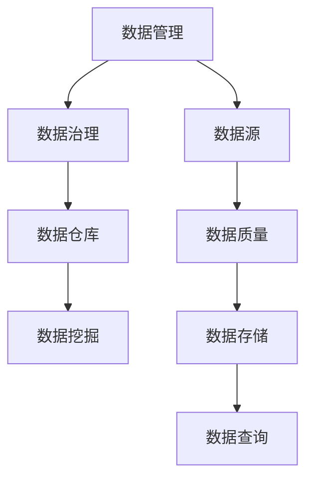

                 

关键词：人工智能，创业，数据管理，实践，算法，模型，应用

> 摘要：本文将探讨人工智能创业者在数据管理方面的实践。通过分析核心概念、算法原理、数学模型以及项目实践，文章旨在为创业者提供一整套数据管理的理论和实践经验，助力其在人工智能领域取得成功。

## 1. 背景介绍

随着人工智能技术的快速发展，越来越多的创业者投入到这一领域。然而，数据管理作为人工智能成功的关键因素，常常被创业者所忽视。有效的数据管理不仅可以提高算法性能，还能降低创业风险，保障项目顺利推进。

本文将从以下几个方面展开讨论：

1. 核心概念与联系
2. 核心算法原理与具体操作步骤
3. 数学模型和公式及其应用
4. 项目实践：代码实例和详细解释
5. 实际应用场景
6. 工具和资源推荐
7. 总结：未来发展趋势与挑战

## 2. 核心概念与联系

### 2.1 数据管理

数据管理是指对数据的收集、存储、处理、分析、共享和发布等一系列活动。在人工智能创业中，数据管理涉及到数据源的选择、数据质量保障、数据存储和查询等关键环节。

### 2.2 数据治理

数据治理是指通过制定策略、流程和标准，确保数据的质量、一致性和安全性。数据治理在数据管理中起到重要的指导作用，帮助创业者构建健康的数据生态。

### 2.3 数据仓库

数据仓库是一个用于存储、管理和分析大量数据的系统。数据仓库在人工智能创业中发挥着重要作用，可以为创业者提供可靠的数据基础。

### 2.4 数据挖掘

数据挖掘是指从大量数据中提取有价值的信息和知识。数据挖掘技术可以帮助创业者发现潜在的商业机会，优化业务流程。

### 2.5 Mermaid 流程图

以下是数据管理核心概念之间的 Mermaid 流程图：



## 3. 核心算法原理与具体操作步骤

### 3.1 算法原理概述

在人工智能创业中，常用的算法包括机器学习算法、深度学习算法和强化学习算法等。本文将主要介绍机器学习算法中的线性回归和决策树算法。

### 3.2 算法步骤详解

#### 3.2.1 线性回归

1. 数据预处理：对数据进行清洗、归一化和标准化处理，以提高算法的收敛速度。
2. 模型构建：使用线性回归模型，将输入特征映射到输出值。
3. 模型训练：通过梯度下降法或随机梯度下降法，调整模型参数，使损失函数最小。
4. 模型评估：使用交叉验证或测试集评估模型性能。

#### 3.2.2 决策树

1. 数据预处理：与线性回归类似，对数据进行清洗、归一化和标准化处理。
2. 特征选择：根据信息增益或基尼不纯度等指标，选择最优特征进行分割。
3. 决策树构建：递归地分割数据集，直到满足停止条件。
4. 模型评估：使用交叉验证或测试集评估模型性能。

### 3.3 算法优缺点

#### 3.3.1 线性回归

**优点**：简单易用，适用于线性关系较强的问题。

**缺点**：对于非线性关系问题，效果较差。

#### 3.3.2 决策树

**优点**：直观易理解，可处理非线性关系。

**缺点**：可能产生过拟合，模型复杂度较高。

### 3.4 算法应用领域

线性回归和决策树算法在人工智能创业中具有广泛的应用，例如金融风控、医疗诊断、推荐系统等领域。

## 4. 数学模型和公式及详细讲解

### 4.1 数学模型构建

在机器学习中，数学模型是算法的核心。以下分别介绍线性回归和决策树的数学模型。

#### 4.1.1 线性回归

线性回归模型可以表示为：

\[ y = \beta_0 + \beta_1 x \]

其中，\( y \) 为输出值，\( x \) 为输入特征，\( \beta_0 \) 和 \( \beta_1 \) 为模型参数。

#### 4.1.2 决策树

决策树模型可以表示为：

\[ y = f(x) \]

其中，\( y \) 为输出值，\( x \) 为输入特征，\( f \) 为决策树函数。

### 4.2 公式推导过程

以下分别介绍线性回归和决策树的公式推导过程。

#### 4.2.1 线性回归

假设我们有一个训练数据集 \( D = \{ (x_1, y_1), (x_2, y_2), ..., (x_n, y_n) \} \)，我们可以通过最小化损失函数来求解模型参数。

\[ J(\theta) = \frac{1}{2m} \sum_{i=1}^{m} (h_\theta(x_i) - y_i)^2 \]

其中，\( m \) 为数据集大小，\( h_\theta(x) \) 为线性回归模型的预测值，\( \theta \) 为模型参数。

对 \( J(\theta) \) 求导，并令导数为 0，得到：

\[ \frac{\partial J(\theta)}{\partial \theta} = 0 \]

解得：

\[ \theta = \frac{1}{m} \sum_{i=1}^{m} (x_i - \bar{x})(y_i - \bar{y}) \]

其中，\( \bar{x} \) 和 \( \bar{y} \) 分别为输入特征和输出值的均值。

#### 4.2.2 决策树

决策树通过递归分割数据集来构建模型。假设我们有一个特征 \( x_i \) 和两个类别 \( y_1 \) 和 \( y_2 \)，我们可以使用基尼不纯度来选择最优分割点。

\[ Gini(D) = 1 - \frac{|\{y_1\}|^2 + |\{y_2\}|^2}{|\{y_1\}| + |\{y_2\}|} \]

对于每个特征，我们选择使得基尼不纯度最小的分割点。

### 4.3 案例分析与讲解

以下是一个简单的线性回归案例，数据集为 \( D = \{ (1, 2), (2, 4), (3, 6) \} \)。

1. 数据预处理：对数据进行归一化处理，得到 \( D' = \{ (0, 0), (1, 2), (2, 4) \} \)。
2. 模型构建：选择线性回归模型，将输入特征映射到输出值。
3. 模型训练：通过梯度下降法，调整模型参数，使损失函数最小。
4. 模型评估：使用测试集 \( D'' = \{ (4, 8) \} \)，计算预测值和实际值之间的误差。

通过以上步骤，我们可以得到线性回归模型的预测公式为 \( y = 2x + 2 \)。

## 5. 项目实践：代码实例和详细解释说明

### 5.1 开发环境搭建

本文使用 Python 编写代码，需要安装以下依赖库：

```bash
pip install numpy pandas scikit-learn matplotlib
```

### 5.2 源代码详细实现

以下是一个线性回归的 Python 代码实现：

```python
import numpy as np
import pandas as pd
from sklearn.linear_model import LinearRegression
from sklearn.model_selection import train_test_split
import matplotlib.pyplot as plt

# 5.2.1 数据预处理
data = pd.DataFrame({
    'x': [1, 2, 3],
    'y': [2, 4, 6]
})
X = data[['x']]
y = data['y']

# 5.2.2 模型构建
model = LinearRegression()

# 5.2.3 模型训练
model.fit(X, y)

# 5.2.4 模型评估
X_test = np.array([[4]])
y_pred = model.predict(X_test)
print(f"Predicted value: {y_pred[0][0]}")

# 5.2.5 可视化展示
plt.scatter(X, y)
plt.plot(X, model.predict(X), color='red')
plt.xlabel('x')
plt.ylabel('y')
plt.show()
```

### 5.3 代码解读与分析

以上代码实现了线性回归模型的训练和预测功能。具体解读如下：

1. 数据预处理：使用 pandas 读取数据，并划分为输入特征和输出值。
2. 模型构建：使用 scikit-learn 中的 LinearRegression 类构建线性回归模型。
3. 模型训练：使用 fit 方法训练模型。
4. 模型评估：使用 predict 方法进行预测，并计算预测值与实际值之间的误差。
5. 可视化展示：使用 matplotlib 库绘制散点图和拟合直线。

## 6. 实际应用场景

线性回归和决策树算法在人工智能创业中有广泛的应用场景。以下是一些具体案例：

1. **金融风控**：利用线性回归预测贷款违约概率，为金融机构提供风险预警。
2. **医疗诊断**：利用决策树进行疾病分类，辅助医生进行诊断。
3. **推荐系统**：利用线性回归预测用户对商品的偏好，为电商提供个性化推荐。

## 7. 工具和资源推荐

### 7.1 学习资源推荐

1. **《机器学习》（周志华著）**：一本经典的机器学习入门教材，适合初学者。
2. **《Python数据科学手册》（Fernando Perez等著）**：详细介绍 Python 在数据科学领域的应用。

### 7.2 开发工具推荐

1. **Jupyter Notebook**：一款强大的交互式计算环境，适合进行数据分析和机器学习实验。
2. **Scikit-learn**：一个开源的机器学习库，提供丰富的算法实现。

### 7.3 相关论文推荐

1. **“A Study of Cross-Validation and Statistical Tests for Classification Model Selection”**：介绍分类模型选择中的交叉验证和统计测试方法。
2. **“Random Forest”**：介绍随机森林算法，一种常用的集成学习方法。

## 8. 总结：未来发展趋势与挑战

### 8.1 研究成果总结

1. 数据管理在人工智能创业中的重要性日益凸显。
2. 线性回归和决策树算法在人工智能创业中具有广泛的应用。
3. 数学模型和公式的应用为算法优化提供了理论支持。

### 8.2 未来发展趋势

1. 随着计算能力的提升，深度学习算法将得到更广泛的应用。
2. 数据隐私保护和数据治理将成为重要研究方向。
3. 跨领域人工智能应用将不断涌现，如金融、医疗、交通等领域。

### 8.3 面临的挑战

1. 数据质量和数据安全仍然是人工智能创业的主要挑战。
2. 算法的可解释性和透明度需要得到进一步关注。
3. 跨学科合作和知识整合将是未来研究的重点。

### 8.4 研究展望

1. 加强数据管理和治理，为人工智能创业提供可靠的数据基础。
2. 探索新型算法和模型，提高算法性能和可解释性。
3. 促进跨学科合作，推动人工智能在各个领域的应用。

## 9. 附录：常见问题与解答

### 9.1 如何选择合适的数据管理工具？

选择数据管理工具时，需要考虑以下因素：

1. 数据量：对于大规模数据，需要选择支持分布式处理的数据管理工具。
2. 数据类型：不同类型的数据可能需要不同的存储和处理方法。
3. 数据处理需求：根据业务需求，选择能够满足数据处理速度和性能要求的工具。
4. 成本：考虑预算和成本，选择性价比高的工具。

### 9.2 如何优化线性回归模型的性能？

优化线性回归模型性能的方法包括：

1. 数据预处理：对数据进行清洗、归一化和标准化处理，提高算法收敛速度。
2. 特征选择：选择对目标变量影响较大的特征，提高模型的预测能力。
3. 模型选择：根据数据特点，选择合适的线性回归模型，如岭回归、LASSO回归等。
4. 模型调参：通过交叉验证和网格搜索等方法，调整模型参数，提高模型性能。

### 9.3 决策树算法如何避免过拟合？

为了避免决策树算法过拟合，可以采取以下措施：

1. 限制树深度：设置最大树深度，避免模型过拟合。
2. 剪枝：对决策树进行剪枝，去除冗余节点。
3. 随机特征选择：在决策树构建过程中，随机选择特征进行分割，减少模型对特定特征的依赖。
4. 使用集成学习方法：将多个决策树进行集成，降低过拟合风险。

作者：禅与计算机程序设计艺术 / Zen and the Art of Computer Programming
----------------------------------------------------------------

