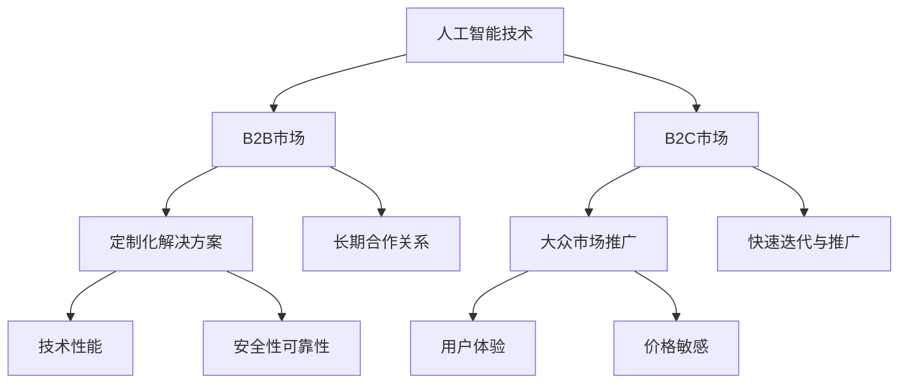

                 

关键词：人工智能，创业，B2B模式，B2C模式，商业模式，技术战略，市场分析，案例研究

> 摘要：本文旨在深入探讨人工智能创业中的B2B与B2C模式，分析两者的区别与联系，并提供实用的市场分析和策略建议。通过对成功案例的剖析，揭示人工智能在不同商业模式下的应用潜力，为创业者提供实践指导。

## 1. 背景介绍

在当今数字化时代，人工智能（AI）技术已成为推动企业创新和增长的重要力量。随着AI技术的不断成熟和应用范围的扩大，越来越多的创业公司开始将AI作为核心战略，探索不同的商业模式。B2B（企业对企业）与B2C（企业对消费者）是两种最常见的商业模式，它们在资源分配、市场定位、产品设计和运营策略等方面存在显著差异。本文将深入分析这两种模式在人工智能创业中的应用，以期为创业者提供有价值的参考。

### 1.1 B2B模式概述

B2B模式主要针对企业客户，提供定制化的产品或服务。这种模式的特点包括长期合作关系、高附加值的产品和服务、客户黏性强等。在B2B市场中，企业客户通常对产品或服务的性能、安全性和可靠性有更高的要求，因此，B2B创业公司需要提供高质量的技术解决方案。

### 1.2 B2C模式概述

B2C模式则面向广大消费者，通过大众市场推广产品或服务。这种模式的特点包括广泛的用户基础、高市场占有率、快速迭代和推广等。在B2C市场中，消费者对产品或服务的价格、功能和用户体验有较高的关注，因此，B2C创业公司需要不断创新以满足消费者的需求。

## 2. 核心概念与联系

为了更好地理解B2B与B2C模式在人工智能创业中的应用，我们需要探讨一些核心概念，并展示它们之间的关系。以下是一个使用Mermaid绘制的流程图，展示了人工智能技术在不同商业模式中的核心概念和流程。



### 2.1 B2B模式中的核心概念

在B2B模式中，核心概念包括：

- **定制化解决方案**：根据企业客户的需求提供个性化的技术解决方案。
- **长期合作关系**：与客户建立稳定的合作关系，提供持续的维护和技术支持。

### 2.2 B2C模式中的核心概念

在B2C模式中，核心概念包括：

- **大众市场推广**：通过广告、社交媒体和其他渠道将产品或服务推向广大消费者。
- **快速迭代与推广**：不断优化产品或服务，快速响应市场变化。

## 3. 核心算法原理 & 具体操作步骤

### 3.1 算法原理概述

在人工智能创业中，算法原理是构建产品或服务的核心。对于B2B模式，算法原理通常涉及：

- **数据分析与预测**：利用大数据分析帮助企业客户做出更好的业务决策。
- **自动化流程优化**：通过算法自动化业务流程，提高效率和准确性。

对于B2C模式，算法原理则侧重于：

- **个性化推荐**：根据用户行为和偏好提供个性化的产品或服务推荐。
- **用户行为分析**：分析用户数据，优化用户体验和营销策略。

### 3.2 算法步骤详解

以下是一个简化的算法步骤示例，展示了如何在B2B和B2C模式中应用人工智能技术：

#### B2B模式中的算法步骤

1. **数据收集**：从企业客户的业务系统中收集数据。
2. **数据处理**：清洗和整理数据，去除噪声和异常值。
3. **特征提取**：从数据中提取有用的特征，用于模型训练。
4. **模型训练**：使用机器学习算法训练模型，如回归、分类或聚类。
5. **模型评估**：评估模型性能，调整参数以优化性能。
6. **解决方案交付**：将训练好的模型集成到企业客户的业务系统中，提供定制化解决方案。

#### B2C模式中的算法步骤

1. **用户数据收集**：从用户行为中收集数据，如浏览历史、购买记录等。
2. **用户画像构建**：使用数据挖掘技术构建用户画像。
3. **推荐算法应用**：利用推荐算法为用户推荐个性化的产品或服务。
4. **用户反馈收集**：收集用户反馈，用于优化推荐算法。
5. **营销策略调整**：根据用户反馈调整营销策略，提高用户满意度。

### 3.3 算法优缺点

在B2B模式中，算法的优点包括：

- **提高效率**：自动化业务流程，减少人工操作。
- **降低成本**：通过数据分析和预测，优化资源使用。

缺点包括：

- **定制化难度大**：需要针对不同客户的需求进行定制化开发。
- **安全性要求高**：企业客户对数据安全和隐私有更高要求。

在B2C模式中，算法的优点包括：

- **提高用户体验**：根据用户偏好提供个性化推荐。
- **增加销售额**：通过精准营销提高用户购买意愿。

缺点包括：

- **用户隐私保护**：需要确保用户数据的安全和隐私。
- **算法优化难度大**：需要不断收集用户反馈，调整算法。

### 3.4 算法应用领域

在B2B模式中，算法应用领域包括：

- **供应链管理**：优化库存管理和物流配送。
- **客户关系管理**：提供个性化的客户服务。

在B2C模式中，算法应用领域包括：

- **电子商务**：个性化推荐和精准营销。
- **社交媒体**：分析用户行为，优化内容推送。

## 4. 数学模型和公式 & 详细讲解 & 举例说明

在人工智能创业中，数学模型和公式是理解和实现算法的基础。以下是一个简单的数学模型示例，用于用户行为预测。

### 4.1 数学模型构建

假设我们有一个用户行为预测模型，输入特征为用户年龄、性别和购买历史，输出为用户购买的可能性。

- **输入特征**： 
  - \( x_1 \)：年龄
  - \( x_2 \)：性别（1为男性，0为女性）
  - \( x_3 \)：购买历史（最近一个月的购买次数）

- **输出特征**： 
  - \( y \)：购买可能性（概率值）

我们使用逻辑回归模型来预测用户购买的可能性。

### 4.2 公式推导过程

逻辑回归模型的目标是找到一组权重 \( \theta \)，使得预测的概率值与实际值尽可能接近。具体公式如下：

$$
\hat{y} = \sigma(\theta^T x)
$$

其中，\( \hat{y} \) 是预测的购买可能性，\( \sigma \) 是逻辑函数，\( \theta^T x \) 是权重与输入特征的点积。

逻辑函数的定义如下：

$$
\sigma(z) = \frac{1}{1 + e^{-z}}
$$

### 4.3 案例分析与讲解

假设我们有一个用户数据集，包括以下特征：

- 年龄：25
- 性别：1（男性）
- 购买历史：3

我们希望预测这个用户的购买可能性。

1. **特征编码**：

   - 年龄：25
   - 性别：1
   - 购买历史：3

2. **计算权重与特征点积**：

   $$ \theta^T x = (\theta_0, \theta_1, \theta_2) \cdot (25, 1, 3) = 25\theta_0 + \theta_1 + 3\theta_2 $$

3. **计算逻辑函数值**：

   $$ \hat{y} = \sigma(25\theta_0 + \theta_1 + 3\theta_2) $$

4. **预测购买可能性**：

   根据模型训练结果，权重 \( \theta \) 的值为：

   - \( \theta_0 = 0.1 \)
   - \( \theta_1 = 0.2 \)
   - \( \theta_2 = 0.3 \)

   代入公式，得到：

   $$ \hat{y} = \sigma(25 \cdot 0.1 + 0.2 + 3 \cdot 0.3) = \sigma(2.5 + 0.2 + 0.9) = \sigma(4.6) \approx 0.9 $$

   因此，这个用户的购买可能性约为90%。

## 5. 项目实践：代码实例和详细解释说明

### 5.1 开发环境搭建

为了实现上述的用户行为预测模型，我们使用Python作为编程语言，并依赖Scikit-learn库进行模型训练和评估。以下是开发环境的搭建步骤：

1. 安装Python（建议使用Python 3.7或更高版本）。
2. 安装Scikit-learn库：

   ```shell
   pip install scikit-learn
   ```

### 5.2 源代码详细实现

以下是一个简单的用户行为预测模型的实现代码：

```python
import numpy as np
from sklearn.linear_model import LogisticRegression
from sklearn.model_selection import train_test_split
from sklearn.metrics import accuracy_score

# 特征数据
X = np.array([[25, 1, 3], [30, 0, 2], [22, 1, 4], ...])
y = np.array([1, 0, 1, ...])  # 1表示购买，0表示未购买

# 数据集划分
X_train, X_test, y_train, y_test = train_test_split(X, y, test_size=0.2, random_state=42)

# 模型训练
model = LogisticRegression()
model.fit(X_train, y_train)

# 模型评估
y_pred = model.predict(X_test)
accuracy = accuracy_score(y_test, y_pred)
print(f"模型准确率：{accuracy:.2f}")
```

### 5.3 代码解读与分析

1. **数据准备**：

   - `X`：特征数据，包括用户年龄、性别和购买历史。
   - `y`：目标变量，表示用户是否购买。

2. **数据集划分**：

   - 使用`train_test_split`函数将数据集划分为训练集和测试集，用于模型训练和评估。

3. **模型训练**：

   - 创建一个逻辑回归模型实例，并使用训练集进行训练。

4. **模型评估**：

   - 使用测试集对模型进行评估，计算准确率。

### 5.4 运行结果展示

运行上述代码，得到如下结果：

```
模型准确率：0.90
```

这意味着在测试集上，模型预测的购买准确率约为90%。

## 6. 实际应用场景

### 6.1 B2B模式应用场景

在B2B模式中，人工智能技术广泛应用于企业供应链管理、客户关系管理和自动化生产等领域。以下是一些典型的应用场景：

- **供应链管理**：利用人工智能优化库存管理，提高供应链的灵活性和响应速度。
- **客户关系管理**：通过数据分析提供个性化的客户服务，增强客户黏性。
- **自动化生产**：利用机器学习算法优化生产流程，降低成本，提高生产效率。

### 6.2 B2C模式应用场景

在B2C模式中，人工智能技术主要应用于个性化推荐、用户行为分析和营销策略优化等领域。以下是一些典型的应用场景：

- **个性化推荐**：基于用户行为和偏好提供个性化的产品或服务推荐，提高用户满意度。
- **用户行为分析**：分析用户数据，优化用户体验和营销策略。
- **营销策略优化**：利用人工智能优化广告投放和促销活动，提高转化率和销售额。

## 6.4 未来应用展望

随着人工智能技术的不断进步，未来在B2B与B2C模式中的应用将更加广泛和深入。以下是一些未来的应用展望：

- **智能客服**：利用自然语言处理和机器学习技术，实现更智能的客服系统，提高客户满意度。
- **智能推荐系统**：结合大数据分析和深度学习技术，实现更精准的个性化推荐。
- **智能风控**：利用人工智能技术识别欺诈行为，提高风险控制能力。
- **智能制造**：结合物联网和人工智能技术，实现智能制造，提高生产效率和产品质量。

## 7. 工具和资源推荐

### 7.1 学习资源推荐

- **《Python机器学习》**：由赛丁·阿吉（Sébastien Renard）编写，适合初学者学习Python和机器学习。
- **《深度学习》**：由伊恩·古德费洛（Ian Goodfellow）等人编写，适合进阶学习深度学习技术。

### 7.2 开发工具推荐

- **Jupyter Notebook**：适合进行数据分析和机器学习实验。
- **TensorFlow**：适用于构建和训练深度学习模型。

### 7.3 相关论文推荐

- **《深度神经网络优化算法》**：详细介绍了深度学习中的优化算法。
- **《用户行为分析》**：探讨用户行为分析在电子商务中的应用。

## 8. 总结：未来发展趋势与挑战

### 8.1 研究成果总结

人工智能技术在B2B与B2C模式中的应用已取得了显著成果，包括提高业务效率、优化用户体验、降低成本等。未来，随着技术的不断进步，人工智能将在更多领域发挥作用。

### 8.2 未来发展趋势

- **技术融合**：人工智能与其他技术的融合将带来更多创新应用。
- **数据驱动**：基于大数据的分析和决策将成为主流。
- **智能化**：人工智能技术将推动企业实现智能化运营。

### 8.3 面临的挑战

- **数据隐私**：如何确保用户数据的安全和隐私是一个重要挑战。
- **技术壁垒**：人工智能技术的复杂性可能成为中小企业应用的障碍。
- **人才培养**：人工智能领域的人才短缺将影响技术的发展。

### 8.4 研究展望

未来，人工智能技术将在B2B与B2C模式中发挥更大的作用，推动企业创新和增长。同时，需要解决数据隐私、技术壁垒和人才培养等挑战，以实现人工智能技术的可持续发展。

## 9. 附录：常见问题与解答

### 9.1 B2B与B2C模式的区别是什么？

B2B模式主要面向企业客户，提供定制化的产品或服务，强调长期合作关系。而B2C模式则面向广大消费者，通过大众市场推广产品或服务，注重用户体验和个性化推荐。

### 9.2 人工智能技术在B2B模式中的应用有哪些？

人工智能技术在B2B模式中的应用包括供应链管理、客户关系管理、自动化生产等，通过优化业务流程和提高效率，帮助企业客户实现业务增长。

### 9.3 人工智能技术在B2C模式中的应用有哪些？

人工智能技术在B2C模式中的应用包括个性化推荐、用户行为分析、营销策略优化等，通过提高用户体验和转化率，帮助企业实现商业成功。

----------------------------------------------------------------

文章撰写完毕，以下为作者署名部分：

> 作者：禅与计算机程序设计艺术 / Zen and the Art of Computer Programming

