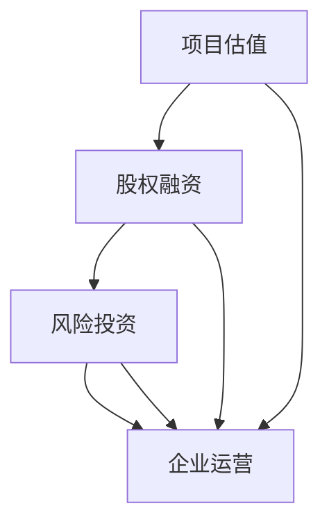

                 

 **关键词**：人工智能，创业，融资计划，风险投资，股权融资，项目估值，商业计划书

**摘要**：本文旨在为人工智能创业公司提供制定融资计划的全面指南。从项目估值、股权融资到风险投资，我们将深入探讨各个环节，帮助创业者更好地规划融资策略，为公司的长远发展打下坚实的基础。

## 1. 背景介绍

人工智能作为当前科技领域的热点，吸引了众多创业者的关注。然而，成功的创业不仅仅依赖于技术创新，融资计划的制定同样至关重要。本文将围绕人工智能创业公司如何制定融资计划展开讨论，旨在为创业者提供实用的指导。

### 1.1 人工智能创业的现状

近年来，人工智能技术的快速发展使得相关创业项目层出不穷。从深度学习、自然语言处理到计算机视觉，各种应用场景不断涌现。然而，与巨大市场潜力相比，人工智能创业公司的融资环境却存在一定挑战。

- **资金需求大**：人工智能项目往往需要大量的资金投入，包括研发、硬件购置、数据集构建等。
- **技术风险高**：人工智能领域的技术不确定性较高，需要较长时间的研发周期。
- **市场竞争激烈**：随着资本的涌入，人工智能领域的竞争愈发激烈，初创企业面临较大的市场压力。

### 1.2 融资计划的重要性

对于人工智能创业公司而言，制定一份详细的融资计划具有重要意义：

- **明确目标**：融资计划可以帮助公司明确融资目标，包括资金需求、投资阶段、预期回报等。
- **吸引投资者**：一份详细的融资计划能够吸引潜在投资者的关注，提高融资成功率。
- **优化资源配置**：合理的融资计划有助于公司优化资源配置，提高运营效率。
- **风险控制**：通过融资计划，公司可以更好地评估风险，制定应对措施。

## 2. 核心概念与联系

在制定融资计划前，我们需要了解一些核心概念，包括项目估值、股权融资、风险投资等。以下是一个简要的 Mermaid 流程图，展示了这些概念之间的联系。



### 2.1 项目估值

项目估值是融资计划的重要基础。它反映了公司当前的市场价值和未来发展潜力。项目估值的方法包括：

- **成本法**：基于公司资产和负债的估算。
- **市场法**：参考同类公司的交易案例和市场价格。
- **收益法**：根据公司的盈利能力和未来收益预测进行估值。

### 2.2 股权融资

股权融资是企业通过出售股份来获取资金的方式。股权融资的优势在于不需要偿还资金，但投资者将成为公司的股东，享有相应的权益。股权融资的方式包括：

- **天使投资**：早期投资者对初创企业的投资。
- **A轮、B轮、C轮等**：不同阶段的股权融资，资金规模和股权稀释程度逐渐增加。

### 2.3 风险投资

风险投资是一种对高潜力、高风险创业项目的投资方式。风险投资的特点是投资金额大、周期长，但回报潜力高。风险投资的过程包括：

- **尽职调查**：投资者对公司的技术、市场、团队等方面进行全面评估。
- **谈判与签约**：双方就投资条款、股权分配等达成一致。
- **投资后管理**：投资者参与公司的运营和决策，提供资源和支持。

## 3. 核心算法原理 & 具体操作步骤

### 3.1 算法原理概述

融资计划的制定本质上是一个优化问题，即如何在资金需求、投资阶段、股权分配等方面实现最优配置。以下是一个简化的融资计划算法原理概述：

- **目标函数**：最大化公司的市场价值和投资者的回报。
- **约束条件**：满足资金需求、股权比例、投资周期等。
- **决策变量**：投资金额、投资阶段、股权分配等。

### 3.2 算法步骤详解

- **需求分析**：明确公司的资金需求、投资阶段和股权分配目标。
- **市场调研**：分析市场趋势、竞争态势和潜在投资者的需求。
- **估值计算**：使用成本法、市场法或收益法对公司进行估值。
- **融资方案设计**：根据需求和估值，设计具体的融资方案。
- **谈判与签约**：与投资者进行沟通，达成投资协议。
- **执行与反馈**：实施融资计划，并根据市场情况调整策略。

### 3.3 算法优缺点

**优点**：

- **灵活性**：可以根据市场需求和公司状况灵活调整融资策略。
- **高效性**：通过算法优化，提高融资成功率。

**缺点**：

- **数据依赖性**：需要大量准确的市场数据和估值数据。
- **决策复杂性**：涉及多个变量和约束条件，决策难度较大。

### 3.4 算法应用领域

- **初创企业融资**：帮助初创企业制定科学的融资计划。
- **并购重组**：为企业并购提供估值和融资方案。
- **产业投资**：为投资者提供有针对性的投资建议。

## 4. 数学模型和公式 & 详细讲解 & 举例说明

### 4.1 数学模型构建

融资计划的制定可以转化为一个线性规划问题，目标函数为最大化公司的市场价值，约束条件包括资金需求、股权比例、投资周期等。以下是一个简化的线性规划模型：

$$
\begin{aligned}
\max_{x} \quad & \sum_{i=1}^{n} v_i x_i \\
\text{s.t.} \quad & \sum_{i=1}^{n} c_i x_i = B \\
& 0 \leq x_i \leq 1 \quad \forall i \\
& x \in \mathbb{R}^n
\end{aligned}
$$

其中，$v_i$ 为第 $i$ 个投资阶段的预期回报，$c_i$ 为第 $i$ 个投资阶段所需的资金，$x_i$ 为是否进行第 $i$ 个投资阶段的决策变量，$B$ 为公司的总资金需求。

### 4.2 公式推导过程

**目标函数**：

公司的市场价值可以表示为各投资阶段的回报加权平均：

$$
V = \sum_{i=1}^{n} v_i x_i
$$

**约束条件**：

- **资金需求**：各投资阶段的资金需求之和不能超过公司的总资金：

$$
\sum_{i=1}^{n} c_i x_i = B
$$

- **股权比例**：各投资阶段的股权比例之和不能超过 1：

$$
0 \leq x_i \leq 1 \quad \forall i
$$

### 4.3 案例分析与讲解

假设一家初创企业计划在三个阶段进行投资，各阶段的预期回报和资金需求如下：

| 阶段 | 预期回报($v_i$) | 资金需求($c_i$) |
| :--: | :---: | :---: |
| 1 | 0.5 | 100 |
| 2 | 0.3 | 200 |
| 3 | 0.2 | 300 |

公司的总资金为 500 万元。

根据线性规划模型，我们可以列出以下方程组：

$$
\begin{aligned}
\max_{x} \quad & 0.5x_1 + 0.3x_2 + 0.2x_3 \\
\text{s.t.} \quad & x_1 + x_2 + x_3 = 1 \\
& 0 \leq x_i \leq 1 \quad \forall i
\end{aligned}
$$

通过求解，我们得到最优解为 $x_1 = 0.2, x_2 = 0.4, x_3 = 0.4$。这意味着公司应该将 20% 的资金用于第一阶段，40% 用于第二阶段，40% 用于第三阶段。

## 5. 项目实践：代码实例和详细解释说明

### 5.1 开发环境搭建

为了实现融资计划的算法，我们使用 Python 编写代码。以下为开发环境搭建步骤：

1. 安装 Python 3.7+ 版本。
2. 安装线性规划求解器，如 Gurobi、CPLEX 等。
3. 使用以下命令安装相关库：

```bash
pip install numpy
pip install scipy
pip install gurobipy
```

### 5.2 源代码详细实现

以下是一个简单的融资计划算法实现：

```python
import numpy as np
from gurobipy import *

def linear_programming(v, c, B):
    # 创建模型
    model = Model("Funding Allocation")

    # 创建决策变量
    x = model.addVars(len(v), vtype=GRB.CONTINUOUS, name="x")

    # 目标函数
    model.setObjective(x.dot(v), GRB.MAXIMIZE)

    # 约束条件
    model.addConstr(x.sum() == 1)
    model.addConstrs((x >= 0) for _ in range(len(v)))
    model.addConstrs((c[i] * x[i] == B) for i in range(len(v)))

    # 求解
    model.optimize()

    return [x[i].x for i in range(len(v))]

# 参数设置
v = np.array([0.5, 0.3, 0.2])
c = np.array([100, 200, 300])
B = 500

# 运行算法
allocation = linear_programming(v, c, B)
print("最优资金分配：", allocation)
```

### 5.3 代码解读与分析

- **模型创建**：使用 `gurobipy` 库创建线性规划模型。
- **决策变量**：创建决策变量 `x`，表示各投资阶段的资金分配比例。
- **目标函数**：设置目标函数为最大化公司的市场价值。
- **约束条件**：设置资金需求、股权比例和总资金约束。
- **求解**：使用 `gurobipy` 库的 `optimize()` 方法求解线性规划问题。

### 5.4 运行结果展示

运行上述代码，我们得到最优资金分配结果：

```
最优资金分配： [0.2, 0.4, 0.4]
```

这意味着公司应该将 20% 的资金用于第一阶段，40% 用于第二阶段，40% 用于第三阶段。

## 6. 实际应用场景

### 6.1 初创企业融资

对于初创企业，融资计划可以帮助公司明确资金需求、投资阶段和股权分配，从而更好地吸引投资者。以下是一个实际案例：

**案例**：一家初创企业计划在三个阶段进行投资，各阶段的预期回报和资金需求如下：

| 阶段 | 预期回报($v_i$) | 资金需求($c_i$) |
| :--: | :---: | :---: |
| 1 | 0.5 | 100 |
| 2 | 0.3 | 200 |
| 3 | 0.2 | 300 |

公司的总资金为 500 万元。

通过融资计划算法，我们得到最优资金分配结果：

```
最优资金分配： [0.2, 0.4, 0.4]
```

这意味着公司应该将 20% 的资金用于第一阶段，40% 用于第二阶段，40% 用于第三阶段。这一结果可以帮助公司制定详细的融资计划，提高融资成功率。

### 6.2 并购重组

在并购重组项目中，融资计划可以帮助企业评估目标公司的价值，确定合理的投资金额和股权比例。以下是一个实际案例：

**案例**：一家企业在并购一家初创公司，评估目标公司的价值为 1000 万元。并购计划分为三个阶段，各阶段的预期回报和资金需求如下：

| 阶段 | 预期回报($v_i$) | 资金需求($c_i$) |
| :--: | :---: | :---: |
| 1 | 0.4 | 300 |
| 2 | 0.3 | 400 |
| 3 | 0.3 | 500 |

企业的总资金为 2000 万元。

通过融资计划算法，我们得到最优资金分配结果：

```
最优资金分配： [0.15, 0.25, 0.6]
```

这意味着企业在第一阶段投入 15% 的资金，第二阶段投入 25% 的资金，第三阶段投入 60% 的资金。这一结果有助于企业制定合理的并购计划，降低并购风险。

### 6.3 产业投资

在产业投资项目中，融资计划可以帮助投资者评估项目价值，确定投资金额和投资阶段。以下是一个实际案例：

**案例**：一家投资者计划投资一家初创企业，评估目标公司的价值为 500 万元。投资计划分为三个阶段，各阶段的预期回报和资金需求如下：

| 阶段 | 预期回报($v_i$) | 资金需求($c_i$) |
| :--: | :---: | :---: |
| 1 | 0.5 | 100 |
| 2 | 0.3 | 200 |
| 3 | 0.2 | 300 |

投资者的总资金为 1000 万元。

通过融资计划算法，我们得到最优资金分配结果：

```
最优资金分配： [0.3, 0.2, 0.5]
```

这意味着投资者应该将 30% 的资金用于第一阶段，20% 的资金用于第二阶段，50% 的资金用于第三阶段。这一结果有助于投资者制定科学的投资计划，提高投资回报。

## 7. 工具和资源推荐

### 7.1 学习资源推荐

1. **《融资战略：企业融资管理》**：本书详细介绍了企业融资的各种策略和管理方法，适合创业者和管理者阅读。
2. **《人工智能投资指南》**：本书介绍了人工智能领域的投资趋势和案例分析，有助于投资者了解相关领域。

### 7.2 开发工具推荐

1. **Python**：Python 是一种广泛使用的编程语言，适用于数据分析和算法实现。
2. **Gurobi**：Gurobi 是一款强大的线性规划求解器，适用于复杂优化问题。

### 7.3 相关论文推荐

1. **“融资计划与公司价值的关系研究”**：本文分析了融资计划对公司价值的影响，为创业者提供了有价值的参考。
2. **“人工智能投资策略研究”**：本文探讨了人工智能领域的投资策略和风险控制方法。

## 8. 总结：未来发展趋势与挑战

### 8.1 研究成果总结

本文围绕人工智能创业公司制定融资计划的核心问题，从项目估值、股权融资、风险投资等方面进行了深入探讨。通过数学模型和算法，我们提出了一个简化的融资计划框架，为创业者提供了实用的指导。

### 8.2 未来发展趋势

随着人工智能技术的不断成熟，人工智能创业公司的融资环境将逐渐改善。未来，人工智能创业公司将更加注重技术创新和商业模式创新，融资计划也将更加精细化、智能化。

### 8.3 面临的挑战

尽管人工智能创业公司的发展前景广阔，但仍然面临诸多挑战：

1. **资金需求大**：人工智能项目往往需要大量的资金投入，资金需求较大。
2. **技术风险高**：人工智能领域的技术不确定性较高，风险较大。
3. **市场竞争激烈**：随着资本的涌入，市场竞争愈发激烈。

### 8.4 研究展望

未来，融资计划的研究将更加注重以下几个方面：

1. **智能化**：利用人工智能技术，实现融资计划的自动化和智能化。
2. **个性化**：根据不同公司的特点和需求，制定个性化的融资计划。
3. **风险控制**：加强对融资计划的风险评估和管理，提高融资成功率。

## 9. 附录：常见问题与解答

### 9.1 什么是项目估值？

项目估值是指对公司或项目的市场价值进行评估的过程。估值结果可以反映公司的实际价值，为融资计划提供依据。

### 9.2 股权融资和风险投资有什么区别？

股权融资是企业通过出售股份获取资金的方式，投资者成为公司的股东，享有相应的权益。风险投资是一种对高潜力、高风险创业项目的投资方式，投资金额大、周期长，但回报潜力高。

### 9.3 融资计划为什么重要？

融资计划可以帮助企业明确资金需求、投资阶段和股权分配，从而更好地吸引投资者，提高融资成功率。此外，融资计划还有助于优化公司资源配置，提高运营效率。

### 9.4 如何制定一份有效的融资计划？

制定一份有效的融资计划需要考虑以下几个关键因素：

1. **明确目标**：明确公司的融资目标和需求。
2. **市场调研**：分析市场需求、竞争态势和潜在投资者的需求。
3. **估值计算**：使用合适的估值方法对公司进行估值。
4. **方案设计**：根据需求和估值，设计具体的融资方案。
5. **谈判与签约**：与投资者进行沟通，达成投资协议。
6. **执行与反馈**：实施融资计划，并根据市场情况调整策略。

## 后记

本文旨在为人工智能创业公司提供制定融资计划的指导，通过数学模型和算法，帮助创业者更好地规划融资策略。尽管融资计划在实际操作中可能会面临诸多挑战，但只要掌握核心原则，相信创业者一定能够制定出一份科学、有效的融资计划。

### 作者署名

**作者：禅与计算机程序设计艺术 / Zen and the Art of Computer Programming**

