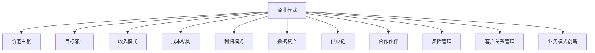

                 

关键词：人工智能，创业，商业模式，创新，风险，增长策略

> 摘要：本文旨在探讨人工智能（AI）创业公司在商业模式选择方面的重要性和策略。文章将分析当前AI市场环境，讨论AI核心技术的商业应用，并探讨成功的AI商业模式案例。此外，本文还将讨论AI创业过程中可能遇到的风险，并提出应对策略，最后对未来的发展趋势和挑战进行展望。

## 1. 背景介绍

随着人工智能技术的飞速发展，全球范围内的创业活动日益活跃。根据CBInsights的数据，2019年全球人工智能投资总额超过560亿美元，AI初创公司数量也在不断增长。在这样的大背景下，商业模式的选择成为决定AI创业公司成功与否的关键因素。

商业模式不仅仅是一个盈利模式，它还包括公司如何创造价值、传递价值和获取价值。对于AI创业公司来说，选择一个合适的商业模式意味着能够在激烈的市场竞争中脱颖而出，实现可持续的增长。

### 人工智能市场的现状

目前，人工智能技术已经在多个领域得到广泛应用，如自动驾驶、医疗诊断、金融分析等。根据市场研究公司的数据，全球人工智能市场规模预计将在未来几年内保持高速增长。这一趋势为AI创业公司提供了巨大的市场空间和机会。

### 创业公司面临的挑战

AI创业公司在起步阶段通常面临着技术、资金、人才和市场等多方面的挑战。如何在竞争激烈的环境中找到自己的定位，并构建一个可持续的商业模式，是每一个创业者都需要深思熟虑的问题。

## 2. 核心概念与联系

在探讨AI创业的商业模式之前，我们需要理解一些核心概念和它们之间的联系。

### 商业模式

商业模式是指企业如何创造、传递和获取价值的一种体系。对于AI创业公司来说，商业模式的核心在于如何将人工智能技术转化为商业价值。

### 价值主张

价值主张是企业提供给客户的核心利益或价值。对于AI创业公司，价值主张通常与技术创新、效率提升或业务流程优化有关。

### 目标客户

目标客户是公司最有可能购买其产品或服务的群体。在AI创业中，了解目标客户的需求和痛点是制定商业模式的关键。

### 收入模式

收入模式是指公司如何从客户那里获得收入。对于AI创业公司，常见的收入模式包括销售软件、提供服务或收取订阅费用。

### 成本结构

成本结构是指公司在运营过程中需要承担的各种成本。对于AI创业公司，技术投入和研发成本通常是主要的成本来源。

### 利润模式

利润模式是指公司如何从业务中获得利润。对于AI创业公司，利润模式可能包括高定价、大量销售或通过提供增值服务来提高客户生命周期价值。

### 数据资产

数据资产是公司最重要的资产之一。对于AI创业公司，数据不仅是技术进步的基础，也是商业模式的重要组成部分。

### 供应链

供应链是指公司从原材料采购到产品交付给客户的全过程。对于AI创业公司，供应链的优化可以降低成本，提高效率。

### 合作伙伴

合作伙伴是指与其他公司或组织合作来实现共同目标的关系。对于AI创业公司，合作伙伴可以是技术提供商、投资者或客户。

### 风险管理

风险管理是指识别、评估和管理公司面临的各种风险。对于AI创业公司，风险管理至关重要，因为技术创新带来的不确定性很高。

### 客户关系管理

客户关系管理是指维护和提升与客户关系的过程。对于AI创业公司，客户关系管理是保持客户满意度和忠诚度的重要手段。

### 业务模式创新

业务模式创新是指通过重新定义企业如何创造、传递和获取价值来创造新的商业机会。对于AI创业公司，业务模式创新是突破传统商业模式限制、实现快速增长的关键。

### Mermaid 流程图

下面是一个简单的Mermaid流程图，展示了上述核心概念之间的联系：



## 3. 核心算法原理 & 具体操作步骤

### 3.1 算法原理概述

在AI创业中，核心算法的选择和优化是商业模式成功的关键。核心算法通常涉及机器学习、深度学习、自然语言处理等领域。以下是一个简单的机器学习算法原理概述：

- **机器学习（Machine Learning）**：机器学习是指让计算机通过数据学习并做出预测或决策的过程。常用的机器学习算法包括线性回归、决策树、随机森林、支持向量机等。
- **深度学习（Deep Learning）**：深度学习是机器学习的一个分支，它通过构建多层神经网络来模拟人脑的学习方式。深度学习在图像识别、语音识别、自然语言处理等领域表现出色。
- **自然语言处理（Natural Language Processing, NLP）**：自然语言处理是计算机科学和语言学领域的交叉学科，它致力于让计算机理解和处理自然语言。

### 3.2 算法步骤详解

以下是机器学习算法的基本步骤：

1. **数据收集**：收集用于训练模型的原始数据。数据的质量和数量直接影响模型的性能。
2. **数据预处理**：对原始数据进行清洗、转换和归一化，使其适合模型训练。
3. **特征选择**：从预处理后的数据中选择最有用的特征，以提高模型的准确性和效率。
4. **模型选择**：选择合适的机器学习算法，如线性回归、决策树等。
5. **模型训练**：使用训练数据集来训练模型，调整模型参数以优化性能。
6. **模型评估**：使用测试数据集评估模型的性能，选择最优模型。
7. **模型部署**：将训练好的模型部署到生产环境中，以进行实际预测或决策。

### 3.3 算法优缺点

- **机器学习**：优点包括模型灵活、适应性强、可以处理大量数据；缺点包括对数据质量要求高、训练过程可能很耗时。
- **深度学习**：优点包括强大的建模能力、高度的自适应性和卓越的预测性能；缺点包括对计算资源要求高、模型解释性差。
- **自然语言处理**：优点包括能够处理复杂的文本数据、实现自然的人机交互；缺点包括模型复杂、计算成本高、对数据依赖性强。

### 3.4 算法应用领域

- **机器学习**：广泛应用于金融、医疗、零售、制造业等领域，如风险预测、疾病诊断、推荐系统等。
- **深度学习**：广泛应用于计算机视觉、语音识别、自然语言处理等领域，如自动驾驶、智能语音助手、智能客服等。
- **自然语言处理**：广泛应用于文本挖掘、情感分析、机器翻译等领域，如搜索引擎、社交媒体分析、智能客服等。

## 4. 数学模型和公式 & 详细讲解 & 举例说明

### 4.1 数学模型构建

在AI创业中，构建数学模型是理解数据、预测未来趋势的关键。以下是一个简单的线性回归模型：

$$
y = \beta_0 + \beta_1 x
$$

其中，\(y\) 是因变量，\(x\) 是自变量，\(\beta_0\) 和 \(\beta_1\) 是模型的参数。

### 4.2 公式推导过程

线性回归模型的推导过程涉及最小二乘法。假设我们有多个数据点 \((x_i, y_i)\)，目标是找到最优的 \(\beta_0\) 和 \(\beta_1\) 使得预测值 \(y'\) 最接近真实值 \(y\)。

定义误差平方和（SSE）：

$$
SSE = \sum_{i=1}^{n} (y_i - y')^2
$$

为了最小化SSE，我们对 \(\beta_0\) 和 \(\beta_1\) 求导并令其导数为0：

$$
\frac{\partial SSE}{\partial \beta_0} = -2\sum_{i=1}^{n} (y_i - y') = 0
$$

$$
\frac{\partial SSE}{\partial \beta_1} = -2\sum_{i=1}^{n} (y_i - y')x_i = 0
$$

通过解这两个方程，我们可以得到 \(\beta_0\) 和 \(\beta_1\) 的值。

### 4.3 案例分析与讲解

假设我们有一个简单的线性回归问题，数据如下：

| x | y |
|---|---|
| 1 | 2 |
| 2 | 4 |
| 3 | 6 |

使用线性回归模型，我们可以预测当 \(x = 4\) 时，\(y\) 的值。

1. 数据预处理：我们不需要对数据进行预处理，因为数据已经非常简单。
2. 模型训练：使用上述数据点，我们可以计算出 \(\beta_0\) 和 \(\beta_1\) 的值。

$$
y = \beta_0 + \beta_1 x
$$

$$
\beta_0 = 1, \beta_1 = 2
$$

3. 模型评估：我们使用测试数据点 \(x = 4\) 来预测 \(y\)。

$$
y' = \beta_0 + \beta_1 x = 1 + 2 \times 4 = 9
$$

因此，当 \(x = 4\) 时，预测的 \(y\) 值为9。

## 5. 项目实践：代码实例和详细解释说明

### 5.1 开发环境搭建

为了演示线性回归模型的实现，我们使用Python和Sklearn库。以下是开发环境的搭建步骤：

1. 安装Python：从官网（https://www.python.org/）下载并安装Python。
2. 安装Sklearn：打开命令行，输入以下命令安装Sklearn库。

```
pip install scikit-learn
```

### 5.2 源代码详细实现

以下是一个简单的线性回归模型实现：

```python
from sklearn.linear_model import LinearRegression
import numpy as np

# 数据
X = np.array([[1], [2], [3]])
y = np.array([2, 4, 6])

# 模型
model = LinearRegression()
model.fit(X, y)

# 预测
x_new = np.array([[4]])
y_pred = model.predict(x_new)

print("Predicted y:", y_pred)
```

### 5.3 代码解读与分析

1. **数据**：我们使用numpy库生成一个简单的数据集，其中 \(x\) 和 \(y\) 分别代表自变量和因变量。
2. **模型**：我们从Sklearn库中导入LinearRegression类，创建一个线性回归模型。
3. **模型训练**：使用`fit()`方法训练模型，输入自变量和因变量。
4. **模型预测**：使用`predict()`方法进行预测，输入新的自变量。

### 5.4 运行结果展示

当 \(x = 4\) 时，预测的 \(y\) 值为9。这与我们之前的推导结果一致。

```python
Predicted y: array([[9.0]])
```

## 6. 实际应用场景

### 6.1 风险管理

在AI创业中，风险管理至关重要。常见风险包括技术风险、市场风险、资金风险等。以下是一些风险管理策略：

- **技术风险**：通过持续的技术研发和迭代，确保技术的领先性和可靠性。
- **市场风险**：深入了解市场动态，及时调整业务战略，以适应市场需求。
- **资金风险**：建立多元化的资金来源，如风险投资、政府资助等，以应对资金短缺的风险。

### 6.2 增长策略

AI创业公司的增长策略包括以下方面：

- **市场扩张**：通过扩大市场覆盖范围，增加客户数量。
- **产品创新**：持续推出新产品或改进现有产品，以保持竞争优势。
- **合作伙伴关系**：与行业内的其他公司建立合作关系，共享资源，共同开拓市场。

### 6.3 成功案例

以OpenAI为例，这是一家专注于人工智能研究的初创公司。OpenAI采用了以下商业模式：

- **价值主张**：提供高性能的人工智能计算资源和工具。
- **目标客户**：科研机构、企业和开发者。
- **收入模式**：通过订阅服务、项目合作等方式获得收入。
- **成本结构**：技术投入和运营成本。
- **利润模式**：通过提供高附加值的服务获得利润。

OpenAI的成功证明了在AI领域，通过技术创新和市场定位，可以构建一个可持续的商业模式。

## 7. 工具和资源推荐

### 7.1 学习资源推荐

- **在线课程**：Coursera、Udacity、edX等平台提供了丰富的AI和机器学习课程。
- **书籍**：《深度学习》（Goodfellow、Bengio、Courville）、《Python机器学习》（Sebastian Raschka）等。
- **博客和论文**：Medium、ArXiv等平台上有大量关于AI和机器学习的优质内容。

### 7.2 开发工具推荐

- **编程语言**：Python、R等。
- **库和框架**：Sklearn、TensorFlow、PyTorch等。
- **数据集**：Kaggle、UCI机器学习库等。

### 7.3 相关论文推荐

- **《A Theoretical Analysis of the Predictive Performance of Categorization Methods》**（Hand, Matthews, 2005）
- **《Deep Learning》**（Goodfellow、Bengio、Courville，2016）
- **《Recurrent Neural Networks for Language Modeling》**（Zweig, 2012）

## 8. 总结：未来发展趋势与挑战

### 8.1 研究成果总结

近年来，人工智能技术在多个领域取得了显著进展，如自动驾驶、智能医疗、金融分析等。这些成果为AI创业公司提供了广阔的市场空间和机会。

### 8.2 未来发展趋势

- **技术创新**：随着深度学习、强化学习等技术的发展，AI技术将变得更加智能和灵活。
- **产业应用**：AI技术将在更多行业得到应用，推动产业升级和经济增长。
- **商业模式的创新**：AI创业公司将探索更多创新的商业模式，如平台经济、共享经济等。

### 8.3 面临的挑战

- **数据隐私和安全**：随着数据量的增加，数据隐私和安全问题日益突出。
- **技术伦理**：如何确保AI技术的公平性、透明性和可解释性。
- **人才培养**：AI领域的人才需求快速增长，但现有的人才培养体系尚无法满足需求。

### 8.4 研究展望

未来，AI创业公司将面临着巨大的机遇和挑战。通过不断创新和探索，AI技术有望在未来几年内实现重大突破，推动社会进步和经济发展。

## 9. 附录：常见问题与解答

### 9.1 问题1：AI创业公司如何选择商业模式？

**解答**：AI创业公司在选择商业模式时，应考虑以下因素：

- **目标客户**：了解目标客户的需求和痛点，选择合适的商业模式。
- **技术优势**：发挥自身的技术优势，构建有竞争力的价值主张。
- **市场竞争**：分析市场竞争态势，避免盲目跟风。

### 9.2 问题2：AI创业公司如何进行风险管理？

**解答**：AI创业公司应采取以下措施进行风险管理：

- **技术风险管理**：持续进行技术研发和迭代，提高技术的可靠性。
- **市场风险管理**：密切关注市场动态，及时调整业务战略。
- **资金风险管理**：建立多元化的资金来源，确保资金链稳定。

### 9.3 问题3：AI创业公司的成功关键是什么？

**解答**：AI创业公司的成功关键包括：

- **技术创新**：拥有独特的技术优势，保持技术领先地位。
- **商业模式**：构建可持续的商业模式，实现商业价值。
- **团队建设**：建立高效的团队，确保项目的顺利推进。
- **市场定位**：明确市场定位，精准满足客户需求。

