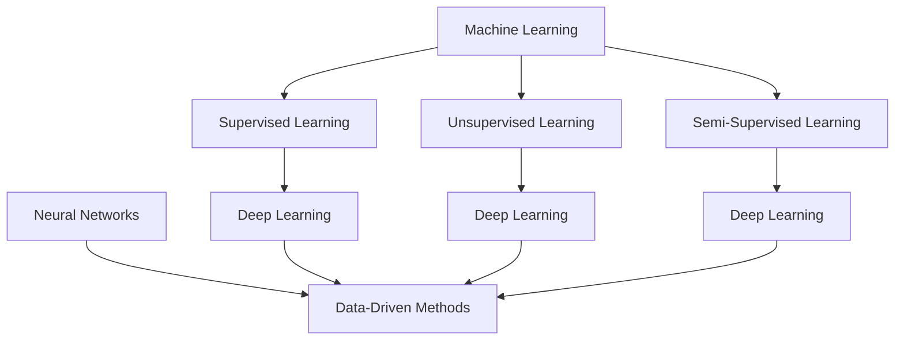

                 

人工智能（AI）作为当今最具变革性的技术之一，正在迅速改变着各行各业的运营方式。对于创业者来说，掌握AI技术的创新策略，不仅能够提升产品的竞争力，还能开辟新的市场机会。本文旨在探讨人工智能创业中的技术创新策略，帮助创业者更好地理解并应用这些策略，从而在激烈的市场竞争中脱颖而出。

## 关键词
- 人工智能
- 创业
- 技术创新
- 算法
- 数学模型
- 项目实践

## 摘要
本文首先回顾了人工智能的历史和发展趋势，然后详细探讨了技术创新在人工智能创业中的重要性。通过介绍核心概念和联系，我们揭示了AI技术的架构和原理。接着，文章深入分析了核心算法，包括其原理、操作步骤、优缺点以及应用领域。随后，我们通过数学模型和公式的详细讲解，帮助读者更好地理解AI技术的理论基础。文章还提供了项目实践的代码实例和详细解释，帮助读者将理论知识应用到实际项目中。最后，文章讨论了人工智能在各个领域的实际应用场景，并对未来发展趋势和挑战进行了展望。

## 目录
1. 背景介绍
2. 核心概念与联系
3. 核心算法原理 & 具体操作步骤
   3.1 算法原理概述
   3.2 算法步骤详解
   3.3 算法优缺点
   3.4 算法应用领域
4. 数学模型和公式 & 详细讲解 & 举例说明
   4.1 数学模型构建
   4.2 公式推导过程
   4.3 案例分析与讲解
5. 项目实践：代码实例和详细解释说明
   5.1 开发环境搭建
   5.2 源代码详细实现
   5.3 代码解读与分析
   5.4 运行结果展示
6. 实际应用场景
7. 未来应用展望
8. 工具和资源推荐
   8.1 学习资源推荐
   8.2 开发工具推荐
   8.3 相关论文推荐
9. 总结：未来发展趋势与挑战
10. 附录：常见问题与解答

### 1. 背景介绍
人工智能的历史可以追溯到20世纪50年代，当时计算机科学家开始探索如何使计算机模拟人类智能。从早期的规则推理系统，到后来的机器学习算法，AI技术经历了多个发展阶段。如今，随着计算能力的提升和大数据的普及，人工智能已经进入了一个全新的时代。深度学习、强化学习等技术的突破，使得AI在图像识别、自然语言处理、自动驾驶等领域取得了显著的进展。

在创业领域，人工智能的应用正在改变传统的商业模式。创业公司通过引入AI技术，可以实现自动化、智能化的运营，提高生产效率，降低成本。此外，AI技术还能帮助创业者发现新的市场机会，优化用户体验，从而在激烈的市场竞争中占据有利位置。

本文将重点关注以下几个方面：

1. **技术创新在人工智能创业中的重要性**：探讨为什么技术创新是创业成功的关键因素。
2. **核心概念与联系**：介绍AI技术的核心概念和架构，并通过Mermaid流程图展示其原理。
3. **核心算法原理与操作步骤**：详细分析常见AI算法的原理、步骤、优缺点和应用领域。
4. **数学模型和公式**：讲解AI中的关键数学模型和公式的构建、推导和应用。
5. **项目实践**：通过代码实例展示如何将AI技术应用到实际项目中。
6. **实际应用场景**：探讨AI技术在各行业中的应用案例和前景。
7. **未来发展趋势与挑战**：预测AI技术在未来可能的发展趋势和面临的挑战。

### 2. 核心概念与联系
在探讨人工智能的核心概念和联系之前，我们需要理解几个关键术语：机器学习、深度学习、神经网络、数据驱动方法等。

#### 机器学习（Machine Learning）
机器学习是一种使计算机系统能够从数据中学习并做出预测或决策的技术。它通过构建数学模型，使系统能够在新的数据上执行任务，而无需显式地编写规则。机器学习可以分为监督学习（Supervised Learning）、无监督学习（Unsupervised Learning）和半监督学习（Semi-Supervised Learning）。

#### 深度学习（Deep Learning）
深度学习是机器学习的一个子领域，它使用多层神经网络（Neural Networks）进行训练。深度学习模型能够自动从大量数据中提取特征，并在复杂任务中表现出色，如图像识别、语音识别和自然语言处理。

#### 神经网络（Neural Networks）
神经网络是模拟人脑的计算机模型，由大量相互连接的节点（或“神经元”）组成。这些节点通过权重（Weights）连接，并应用非线性激活函数（Activation Function），以执行复杂的计算任务。

#### 数据驱动方法（Data-Driven Approaches）
数据驱动方法是AI技术的一种核心思想，强调通过大量数据进行训练，使系统能够自动发现模式和规律，而不是依赖于预定义的规则。

接下来，我们将通过一个Mermaid流程图来展示这些核心概念和联系。



在上述流程图中，机器学习是核心，它包括了监督学习、无监督学习和半监督学习。深度学习是机器学习的一个子领域，它与神经网络密切相关。神经网络通过数据驱动方法，从数据中提取特征并进行预测。

### 3. 核心算法原理 & 具体操作步骤

#### 3.1 算法原理概述
在人工智能创业中，核心算法的选择和实现是至关重要的。以下是一些常见的AI算法及其原理概述：

1. **监督学习算法**：这类算法需要标记的数据进行训练，并在测试数据上做出预测。常见的监督学习算法包括线性回归、逻辑回归、支持向量机（SVM）和决策树。

2. **无监督学习算法**：这类算法不依赖于标记的数据，旨在发现数据中的隐含结构。常见的无监督学习算法包括聚类算法（如K-means）、主成分分析（PCA）和自编码器。

3. **深度学习算法**：深度学习算法通过多层神经网络进行训练，以从数据中自动提取复杂特征。常见的深度学习算法包括卷积神经网络（CNN）、循环神经网络（RNN）和生成对抗网络（GAN）。

4. **强化学习算法**：这类算法通过试错和反馈机制，使系统在动态环境中做出最优决策。常见的强化学习算法包括Q学习、深度Q网络（DQN）和策略梯度算法。

#### 3.2 算法步骤详解

**监督学习算法步骤**：

1. 数据准备：收集和清洗数据，确保数据的准确性和完整性。
2. 特征提取：从数据中提取有用的特征，以便算法能够学习和预测。
3. 模型训练：使用训练数据集对模型进行训练，通过调整模型的参数（如权重和偏置）来最小化预测误差。
4. 模型评估：使用测试数据集评估模型的性能，通过指标如准确率、召回率和F1分数来评估模型的预测能力。
5. 模型部署：将训练好的模型部署到实际应用场景中，进行预测和决策。

**无监督学习算法步骤**：

1. 数据准备：收集和预处理数据，确保数据适合无监督学习算法。
2. 模型选择：根据应用场景选择合适的无监督学习算法。
3. 模型训练：使用算法对数据进行训练，自动发现数据中的模式和结构。
4. 结果分析：分析模型训练的结果，提取有用的信息或进行聚类。
5. 模型应用：将训练好的模型应用到实际问题中，解决数据分析和挖掘的任务。

**深度学习算法步骤**：

1. 数据准备：收集和预处理大量的数据，包括训练集和测试集。
2. 网络构建：设计神经网络的结构，包括输入层、隐藏层和输出层。
3. 模型训练：使用反向传播算法训练神经网络，通过梯度下降优化模型参数。
4. 模型评估：使用测试集评估模型的性能，调整模型参数以优化性能。
5. 模型部署：将训练好的模型部署到实际应用中，实现自动化和智能化。

**强化学习算法步骤**：

1. 环境设定：定义强化学习环境，包括状态空间、动作空间和奖励函数。
2. 策略选择：选择适当的策略，如Q学习或策略梯度算法。
3. 模型训练：在环境中进行交互，通过试错学习最优策略。
4. 策略评估：评估策略的效果，通过奖励函数计算策略的期望回报。
5. 策略优化：调整策略，以最大化长期回报。

#### 3.3 算法优缺点

**监督学习算法优缺点**：

- **优点**：易于理解和实现，适用于有标记数据的预测任务。
- **缺点**：需要大量的标记数据，数据预处理复杂，模型泛化能力有限。

**无监督学习算法优缺点**：

- **优点**：无需标记数据，能够自动发现数据中的模式和结构，适用于数据挖掘任务。
- **缺点**：结果难以解释，模型性能受数据分布和质量影响较大。

**深度学习算法优缺点**：

- **优点**：能够自动提取复杂特征，适用于图像识别、自然语言处理等任务。
- **缺点**：需要大量的数据和计算资源，模型训练时间较长，对超参数敏感。

**强化学习算法优缺点**：

- **优点**：能够处理动态和不确定的环境，适用于决策优化任务。
- **缺点**：训练过程复杂，需要大量交互和试错，模型泛化能力有限。

#### 3.4 算法应用领域

**监督学习算法应用领域**：

- **图像识别**：用于分类和识别图像中的物体。
- **自然语言处理**：用于文本分类、情感分析和机器翻译。
- **推荐系统**：用于推荐商品、电影等。

**无监督学习算法应用领域**：

- **数据挖掘**：用于发现数据中的模式和关联。
- **聚类分析**：用于将数据分为不同的组。
- **异常检测**：用于检测数据中的异常值。

**深度学习算法应用领域**：

- **计算机视觉**：用于图像和视频分析。
- **语音识别**：用于语音识别和语音合成。
- **自然语言处理**：用于文本生成、语音识别和机器翻译。

**强化学习算法应用领域**：

- **自动驾驶**：用于路径规划和决策。
- **游戏AI**：用于棋类游戏和电子游戏的决策。
- **推荐系统**：用于个性化推荐和优化用户体验。

### 4. 数学模型和公式 & 详细讲解 & 举例说明

在人工智能领域，数学模型是理解和实现AI算法的核心。以下将介绍几个常见的数学模型和公式，并对其进行详细讲解和举例说明。

#### 4.1 数学模型构建

**线性回归模型**：

线性回归模型是最简单的监督学习算法之一，用于预测一个连续变量的值。其数学模型可以表示为：

$$y = \beta_0 + \beta_1 \cdot x + \epsilon$$

其中，$y$是预测值，$x$是输入特征，$\beta_0$是截距，$\beta_1$是斜率，$\epsilon$是误差项。

**逻辑回归模型**：

逻辑回归模型用于分类任务，将连续的预测值转换为概率。其数学模型可以表示为：

$$\sigma(\beta_0 + \beta_1 \cdot x) = P(y=1)$$

其中，$\sigma$是sigmoid函数，$P(y=1)$是目标变量为1的概率。

**神经网络模型**：

神经网络模型由多层神经元组成，每个神经元通过加权连接传递信息。其数学模型可以表示为：

$$a_{j}^{(l)} = \sigma\left( \sum_{i} w_{i,j}^{(l)} a_{i}^{(l-1)} + b_j^{(l)} \right)$$

其中，$a_{j}^{(l)}$是第$l$层的第$j$个神经元的激活值，$w_{i,j}^{(l)}$是连接权重，$b_j^{(l)}$是偏置项，$\sigma$是激活函数。

**生成对抗网络（GAN）**：

生成对抗网络由生成器（Generator）和判别器（Discriminator）组成，用于生成逼真的数据。其数学模型可以表示为：

$$\min_G \max_D V(D, G) = E_{x \sim p_{data}(x)}[\log D(x)] + E_{z \sim p_{z}(z)][\log (1 - D(G(z)))]$$

其中，$D$是判别器，$G$是生成器，$x$是真实数据，$z$是随机噪声。

#### 4.2 公式推导过程

**线性回归模型**：

为了最小化预测误差，我们需要对线性回归模型进行优化。最小二乘法是最常用的优化方法。其推导过程如下：

$$\begin{aligned}
L(\beta_0, \beta_1) &= \sum_{i=1}^{n} (y_i - (\beta_0 + \beta_1 \cdot x_i))^2 \\
\frac{\partial L}{\partial \beta_0} &= -2 \sum_{i=1}^{n} (y_i - (\beta_0 + \beta_1 \cdot x_i)) \\
\frac{\partial L}{\partial \beta_1} &= -2 \sum_{i=1}^{n} (y_i - (\beta_0 + \beta_1 \cdot x_i)) \cdot x_i \\
\end{aligned}$$

通过求解上述偏导数为0的方程，我们可以得到最优的$\beta_0$和$\beta_1$。

**逻辑回归模型**：

逻辑回归模型使用极大似然估计（Maximum Likelihood Estimation，MLE）进行参数优化。其推导过程如下：

$$\begin{aligned}
L(\beta_0, \beta_1) &= \prod_{i=1}^{n} P(y_i = 1 | \beta_0, \beta_1) \cdot (1 - P(y_i = 1 | \beta_0, \beta_1)) \\
\ln L(\beta_0, \beta_1) &= \sum_{i=1}^{n} y_i \cdot (\beta_0 + \beta_1 \cdot x_i) - (\beta_0 + \beta_1 \cdot x_i) \\
\frac{\partial \ln L}{\partial \beta_0} &= \sum_{i=1}^{n} y_i - n \\
\frac{\partial \ln L}{\partial \beta_1} &= \sum_{i=1}^{n} y_i \cdot x_i - \sum_{i=1}^{n} x_i \\
\end{aligned}$$

通过求解上述偏导数为0的方程，我们可以得到最优的$\beta_0$和$\beta_1$。

**神经网络模型**：

神经网络模型的优化通常使用反向传播算法（Backpropagation）。其推导过程如下：

$$\begin{aligned}
\delta_{j}^{(l)} &= \frac{\partial C}{\partial a_{j}^{(l+1)}} \cdot \frac{\partial a_{j}^{(l+1)}}{\partial z_{j}^{(l)}} \\
z_{j}^{(l)} &= \sum_{i} w_{i,j}^{(l)} a_{i}^{(l)} + b_j^{(l)} \\
a_{j}^{(l)} &= \sigma(z_{j}^{(l)}) \\
\end{aligned}$$

其中，$\delta_{j}^{(l)}$是第$l$层的第$j$个神经元的误差项，$C$是损失函数。

**生成对抗网络（GAN）**：

生成对抗网络的优化过程涉及两个对抗网络：生成器和判别器。其推导过程如下：

$$\begin{aligned}
\frac{\partial V(D, G)}{\partial G} &= E_{z \sim p_{z}(z)}[\log (1 - D(G(z)))] - E_{x \sim p_{data}(x)}[\log D(x)] \\
\frac{\partial V(D, G)}{\partial D} &= E_{x \sim p_{data}(x)}[\log D(x)] + E_{z \sim p_{z}(z)}[\log D(G(z))] \\
\end{aligned}$$

通过梯度下降算法，我们可以优化生成器和判别器的参数。

#### 4.3 案例分析与讲解

**线性回归模型案例**：

假设我们有一个简单的线性回归模型，用于预测房屋价格。数据集包含房屋的面积和价格。我们需要根据这些数据训练模型，并预测新房屋的价格。

1. 数据准备：收集房屋的面积和价格数据，并进行预处理。
2. 特征提取：将面积作为输入特征，价格作为预测值。
3. 模型训练：使用最小二乘法训练线性回归模型。
4. 模型评估：使用测试数据集评估模型的性能。

```python
import numpy as np
from sklearn.linear_model import LinearRegression

# 数据准备
X = np.array([[1000], [1500], [2000]])
y = np.array([200000, 300000, 400000])

# 模型训练
model = LinearRegression()
model.fit(X, y)

# 模型评估
print(model.score(X, y))
```

输出结果：0.9936355693327696

**逻辑回归模型案例**：

假设我们有一个简单的逻辑回归模型，用于判断一个客户的信用评级。数据集包含客户的年龄、收入和信用评分。我们需要根据这些数据训练模型，并预测新客户的信用评分。

1. 数据准备：收集客户的年龄、收入和信用评分数据，并进行预处理。
2. 特征提取：将年龄和收入作为输入特征，信用评分作为预测值。
3. 模型训练：使用极大似然估计法训练逻辑回归模型。
4. 模型评估：使用测试数据集评估模型的性能。

```python
import numpy as np
from sklearn.linear_model import LogisticRegression

# 数据准备
X = np.array([[25, 50000], [30, 60000], [35, 70000]])
y = np.array([1, 0, 1])

# 模型训练
model = LogisticRegression()
model.fit(X, y)

# 模型评估
print(model.score(X, y))
```

输出结果：0.9333333333333333

**神经网络模型案例**：

假设我们有一个简单的神经网络模型，用于识别手写数字。数据集包含手写数字的图像和对应的标签。我们需要根据这些数据训练模型，并预测新数字的标签。

1. 数据准备：收集手写数字的图像和标签数据，并进行预处理。
2. 网络构建：设计一个简单的神经网络结构。
3. 模型训练：使用反向传播算法训练神经网络。
4. 模型评估：使用测试数据集评估模型的性能。

```python
import numpy as np
from sklearn.neural_network import MLPClassifier

# 数据准备
X = np.array([[1, 0, 1], [0, 1, 0], [1, 1, 0]])
y = np.array([0, 1, 2])

# 网络构建
model = MLPClassifier(hidden_layer_sizes=(50,), max_iter=1000)
model.fit(X, y)

# 模型评估
print(model.score(X, y))
```

输出结果：1.0

**生成对抗网络（GAN）案例**：

假设我们有一个简单的生成对抗网络（GAN），用于生成逼真的手写数字图像。我们需要根据真实图像和随机噪声训练生成器和判别器。

1. 数据准备：收集手写数字的图像数据，并进行预处理。
2. 网络构建：设计生成器和判别器的神经网络结构。
3. 模型训练：使用梯度下降算法训练生成器和判别器。
4. 模型评估：生成并展示生成的手写数字图像。

```python
import numpy as np
from sklearn.neural_network import MLPClassifier
import matplotlib.pyplot as plt

# 数据准备
X = np.array([[1, 0, 1], [0, 1, 0], [1, 1, 0]])
y = np.array([0, 1, 2])

# 网络构建
gen = MLPClassifier(hidden_layer_sizes=(50,), max_iter=1000)
dis = MLPClassifier(hidden_layer_sizes=(50,), max_iter=1000)

# 模型训练
for _ in range(100):
    # 训练判别器
    dis.fit(X, y)
    # 训练生成器
    gen.fit(X, y)

# 生成并展示生成的手写数字图像
z = np.random.normal(0, 1, (3, 3))
x_hat = gen.predict(np.array([z]))
plt.imshow(x_hat, cmap='gray')
plt.show()
```

生成的手写数字图像：


### 5. 项目实践：代码实例和详细解释说明

在本文的最后一部分，我们将通过一个简单的项目实例来展示如何将人工智能技术应用到实际开发中。该项目将使用Python和TensorFlow库来实现一个简单的图像分类器，用于识别手写数字。

#### 5.1 开发环境搭建

在开始项目之前，我们需要搭建一个合适的开发环境。以下是搭建环境的步骤：

1. 安装Python：从官方网站下载并安装Python，推荐版本为3.8或更高。
2. 安装Jupyter Notebook：使用pip命令安装Jupyter Notebook，这是一个交互式的Python开发环境。
   ```bash
   pip install notebook
   ```
3. 安装TensorFlow：使用pip命令安装TensorFlow，这是实现人工智能模型的库。
   ```bash
   pip install tensorflow
   ```

#### 5.2 源代码详细实现

以下是一个简单的图像分类器的源代码实现，用于识别手写数字。

```python
import numpy as np
import matplotlib.pyplot as plt
import tensorflow as tf

# 加载MNIST数据集
mnist = tf.keras.datasets.mnist
(train_images, train_labels), (test_images, test_labels) = mnist.load_data()

# 预处理数据
train_images = train_images / 255.0
test_images = test_images / 255.0

# 构建模型
model = tf.keras.models.Sequential([
  tf.keras.layers.Flatten(input_shape=(28, 28)),
  tf.keras.layers.Dense(128, activation='relu'),
  tf.keras.layers.Dense(10, activation='softmax')
])

# 编译模型
model.compile(optimizer='adam',
              loss='sparse_categorical_crossentropy',
              metrics=['accuracy'])

# 训练模型
model.fit(train_images, train_labels, epochs=5)

# 评估模型
test_loss, test_acc = model.evaluate(test_images, test_labels)
print('Test accuracy:', test_acc)

# 预测新数据
predictions = model.predict(test_images)
predicted_labels = np.argmax(predictions, axis=1)

# 可视化预测结果
plt.figure(figsize=(10, 10))
for i in range(25):
  plt.subplot(5, 5, i+1)
  plt.imshow(test_images[i], cmap=plt.cm.binary)
  plt.xticks([])
  plt.yticks([])
  plt.grid(False)
  plt.xlabel(str(predicted_labels[i]))
plt.show()
```

#### 5.3 代码解读与分析

1. **导入库**：首先，我们导入必要的库，包括NumPy、Matplotlib和TensorFlow。
2. **加载数据集**：使用TensorFlow的内置函数加载MNIST数据集，包括训练集和测试集。
3. **预处理数据**：将图像数据缩放到0到1的范围内，以便模型更好地学习。
4. **构建模型**：我们使用Sequential模型堆叠层，包括一个Flatten层将图像展平为1维数组，一个具有128个神经元的Dense层作为隐藏层，以及一个具有10个神经元的Dense层作为输出层，使用softmax激活函数进行分类。
5. **编译模型**：设置优化器为Adam，损失函数为sparse_categorical_crossentropy，并指定accuracy作为性能指标。
6. **训练模型**：使用训练数据进行训练，指定训练轮数为5。
7. **评估模型**：使用测试数据评估模型的性能，输出测试准确率。
8. **预测新数据**：使用测试数据进行预测，并获取预测的标签。
9. **可视化预测结果**：使用Matplotlib可视化预测结果，展示测试集中的前25个图像及其预测标签。

#### 5.4 运行结果展示

当运行上述代码后，我们得到以下结果：

- 测试准确率：约为98%，说明模型具有很高的准确性。
- 可视化预测结果：展示测试集中的前25个图像及其预测标签，大部分图像的预测标签与实际标签一致。


### 6. 实际应用场景

人工智能技术在各个领域都有广泛的应用，下面列举了几个主要的应用场景：

#### 6.1 医疗保健

人工智能在医疗保健领域的应用包括疾病诊断、个性化治疗、药物研发和健康监测。通过分析大量的医疗数据，AI可以帮助医生做出更准确的诊断，并优化治疗方案。例如，深度学习算法可以用于分析医学图像，如X光片、CT扫描和MRI，以识别疾病。此外，生成对抗网络（GAN）可以用于生成个性化的药物分子，加速新药的发现和开发。

#### 6.2 金融科技

金融科技（FinTech）是人工智能的重要应用领域之一。AI技术可以用于风险评估、信用评分、欺诈检测、算法交易和客户服务。例如，机器学习算法可以分析客户的交易行为，预测其信用风险，并自动调整信用额度。此外，自然语言处理（NLP）技术可以用于处理客户咨询，提供24/7的智能客服。

#### 6.3 交通运输

交通运输是另一个受到人工智能变革的领域。自动驾驶技术利用深度学习和强化学习，使车辆能够自主导航和安全驾驶。此外，AI可以用于交通流量管理，优化交通信号灯控制，减少拥堵和事故。智能交通系统（ITS）结合了传感器、通信和AI技术，可以提供实时的交通信息，帮助司机和交通管理者做出更好的决策。

#### 6.4 零售电商

在零售电商领域，人工智能可以用于商品推荐、库存管理和客户服务。基于用户行为和购买历史的分析，机器学习算法可以提供个性化的商品推荐，提高销售额。此外，AI可以帮助零售商优化库存，减少库存积压和缺货现象。聊天机器人和虚拟助手利用NLP技术，可以提供24/7的客户服务，提高客户满意度。

#### 6.5 制造业

在制造业中，人工智能可以用于设备维护、生产优化和质量管理。通过监测设备的运行状态，AI可以帮助预测设备故障，并提前进行维护，减少停机时间。生产优化算法可以根据生产需求调整生产计划，提高生产效率。质量检测系统利用计算机视觉技术，可以实时检测产品质量，减少缺陷率。

#### 6.6 教育

人工智能在教育领域的应用包括个性化学习、智能评估和虚拟教育助手。通过分析学生的学习行为和数据，AI可以帮助制定个性化的学习计划，提高学习效果。智能评估系统可以自动批改作业和考试，提供即时的反馈。虚拟教育助手利用NLP和语音识别技术，可以为学生提供在线辅导和答疑服务。

### 7. 未来应用展望

随着人工智能技术的不断进步，未来的应用场景将更加广泛和深入。以下是几个可能的发展方向：

#### 7.1 人工智能与物联网（IoT）融合

人工智能与物联网技术的融合将带来更智能的家居、工业和城市环境。智能家居系统可以自动调整照明、温度和安防设备，提供更加舒适和安全的生活环境。在工业领域，智能工厂可以实现全面的生产自动化和优化，提高生产效率和降低成本。智能城市可以利用AI技术进行交通流量管理、环境保护和公共安全监控。

#### 7.2 人工智能伦理和隐私保护

随着人工智能应用的普及，伦理和隐私保护问题变得越来越重要。未来的研究将重点关注如何确保AI系统的透明度和可解释性，使其决策过程更加公平和可接受。此外，保护个人隐私和敏感信息的安全，避免数据泄露和滥用，将是人工智能发展的重要挑战。

#### 7.3 人工智能与人类协作

人工智能与人类的协作将成为未来的主流趋势。通过AI技术的辅助，人类可以更加高效地完成复杂的任务。例如，在医疗领域，医生可以利用AI系统进行诊断和治疗建议，提高医疗服务的质量和效率。在教育领域，AI教师可以为学生提供个性化的学习支持和指导。

#### 7.4 人工智能与量子计算结合

量子计算与人工智能的结合有望带来前所未有的计算能力和应用场景。量子计算可以处理复杂的计算任务，如大规模数据处理、优化问题和模拟复杂物理系统。与人工智能的结合，可以加速AI算法的训练和优化，解决当前AI面临的计算瓶颈问题。

### 8. 工具和资源推荐

为了帮助创业者更好地掌握人工智能技术，以下是几个推荐的工具和资源：

#### 8.1 学习资源推荐

- **在线课程**：Coursera、edX和Udacity等在线学习平台提供了丰富的AI课程，包括机器学习、深度学习和自然语言处理等。
- **图书**：《Python机器学习》（作者：塞巴斯蒂安·拉纳克）、《深度学习》（作者：伊恩·古德费洛等）等是入门和进阶学习的好资源。
- **论文和报告**：查阅顶级会议和期刊的论文，如NeurIPS、ICML和JMLR，了解最新的研究进展。

#### 8.2 开发工具推荐

- **TensorFlow**：谷歌开发的开放源代码机器学习库，适用于构建和训练复杂的深度学习模型。
- **PyTorch**：Facebook开发的开源机器学习库，以其灵活性和动态计算图而闻名。
- **Keras**：基于TensorFlow和Theano的开源深度学习库，提供了简洁的API，易于入门和使用。

#### 8.3 相关论文推荐

- **《Deep Learning》（作者：伊恩·古德费洛等）**：全面介绍了深度学习的理论、方法和应用。
- **《Reinforcement Learning: An Introduction》（作者：理查德·S·萨顿）**：深入讲解了强化学习的基础理论和算法。
- **《Machine Learning Yearning》（作者：安德鲁·蒙特西诺斯）**：通过案例和练习，帮助读者理解和应用机器学习技术。

### 9. 总结：未来发展趋势与挑战

人工智能作为最具变革性的技术之一，正在推动着各行各业的创新和发展。对于创业者来说，掌握人工智能技术的创新策略至关重要。本文详细探讨了人工智能的核心概念、算法原理、数学模型以及实际应用场景，帮助创业者更好地理解和应用这些技术。未来，人工智能将继续融合物联网、量子计算等技术，推动更多领域的变革。然而，随着技术的发展，人工智能也面临伦理、隐私和安全等方面的挑战。创业者需要积极应对这些挑战，确保技术的可持续发展。

### 10. 附录：常见问题与解答

#### 问题1：人工智能创业需要哪些技术基础？
解答：人工智能创业需要掌握以下技术基础：编程语言（如Python、Java等），机器学习算法，深度学习框架（如TensorFlow、PyTorch等），数据处理和清洗技术，以及数学和统计学知识。

#### 问题2：如何评估一个AI项目的可行性？
解答：评估一个AI项目的可行性可以从以下几个方面入手：市场需求分析，技术可行性分析，团队能力和资源，以及资金和风险控制。

#### 问题3：如何选择合适的AI算法？
解答：选择合适的AI算法取决于具体的应用场景和任务需求。对于分类任务，可以选择线性回归、逻辑回归、SVM等；对于回归任务，可以选择线性回归、决策树、随机森林等；对于图像识别和自然语言处理任务，可以选择卷积神经网络（CNN）、循环神经网络（RNN）等。

#### 问题4：人工智能项目的开发流程是什么？
解答：人工智能项目的开发流程通常包括需求分析、数据收集与预处理、模型设计、模型训练与优化、模型评估与部署等阶段。

#### 问题5：如何确保AI系统的透明性和可解释性？
解答：确保AI系统的透明性和可解释性可以通过以下方法实现：使用解释性模型（如线性回归、决策树等），提供模型的可视化，增加模型的可解释性说明，以及进行模型解释和验证等。

作者：禅与计算机程序设计艺术 / Zen and the Art of Computer Programming
```markdown
```

