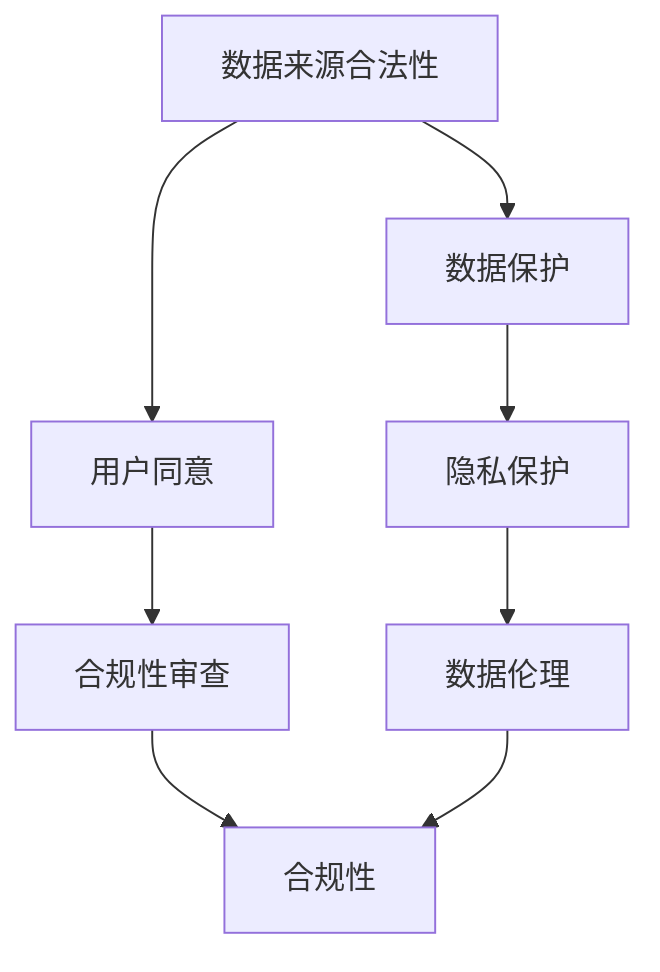

                 

关键词：人工智能，数据合法性，创业，隐私保护，合规性

> 摘要：本文将探讨在人工智能创业过程中，确保数据合法性的重要性和方法。随着人工智能技术的发展，数据的质量和合法性成为影响业务成功的关键因素。本文将深入分析数据合法性的核心概念，探讨如何在创业过程中遵守相关法规和标准，提供实用的实践指南，帮助企业实现合法合规的数据处理。

## 1. 背景介绍

随着人工智能技术的快速发展，数据成为了推动创新和业务增长的核心资源。人工智能创业企业依赖于大量数据来训练模型、优化算法，从而实现更高的准确性和效率。然而，数据的合法性成为了一个不容忽视的问题。数据来源的合法性、数据收集和处理的过程是否符合法律法规，不仅关系到企业的合规性，还可能影响其业务的发展和声誉。

### 数据合法性的重要性

- **遵守法律法规**：确保数据收集、处理和使用符合国家和地区的法律法规，如《通用数据保护条例》（GDPR）和《加州消费者隐私法案》（CCPA）等。
- **保护隐私权**：数据合法性问题直接关系到个人隐私权的保护。不合法的数据收集和使用可能导致个人隐私泄露，引发法律纠纷和用户信任危机。
- **商业信任**：数据合法性是企业建立商业信任的基础。合规的数据处理能够提升企业的市场声誉，吸引更多的用户和合作伙伴。
- **创新驱动**：确保数据合法性有助于企业在研发过程中遵守伦理和道德标准，从而推动人工智能技术的健康发展。

### 创业过程中面临的数据合法性挑战

- **数据来源不合法**：部分数据可能来源于非法渠道，如购买的黑名单数据、未经授权的个人信息等。
- **数据收集不规范**：企业在数据收集过程中可能存在侵犯用户隐私的行为，如过度收集个人信息、未告知用户数据用途等。
- **数据处理不透明**：数据在存储、传输和处理过程中，可能存在数据泄露、滥用等风险。
- **数据存储和销毁不当**：数据存储和销毁不规范可能导致数据泄露或被非法使用。

## 2. 核心概念与联系

### 数据合法性的核心概念

- **数据来源合法性**：数据收集的渠道和方式必须合法，确保数据的来源是公开透明的。
- **用户同意**：在收集和使用用户数据时，必须获得用户的明确同意，告知数据收集的目的、使用方式、存储期限等。
- **数据保护**：在数据存储、传输和处理过程中，必须采取有效的安全措施，保护数据的安全性和完整性。
- **合规性审查**：企业应定期对数据处理流程进行合规性审查，确保符合相关法律法规的要求。

### 数据合法性的联系

- **隐私保护**：数据合法性是隐私保护的前提，两者密切相关。
- **数据伦理**：确保数据合法性的同时，遵循数据伦理原则，保护用户权益。
- **合规性**：数据合法性是合规性的重要组成部分，直接影响企业的运营和声誉。

### Mermaid 流程图



## 3. 核心算法原理 & 具体操作步骤

### 3.1 算法原理概述

数据合法性确保算法主要基于以下原理：

- **数据收集与用户同意**：在数据收集前，明确告知用户数据收集的目的、使用方式、存储期限等，并取得用户的明确同意。
- **数据加密与存储**：对敏感数据进行加密处理，确保数据在存储、传输和处理过程中的安全性。
- **合规性审查与审计**：定期对数据处理流程进行合规性审查和审计，确保符合相关法律法规的要求。

### 3.2 算法步骤详解

#### 步骤一：数据收集与用户同意

1. **用户告知**：在数据收集前，通过隐私政策、用户协议等方式，明确告知用户数据收集的目的、使用方式、存储期限等。
2. **用户同意**：用户同意数据收集，可通过点击同意按钮、填写问卷等方式实现。

#### 步骤二：数据加密与存储

1. **数据加密**：对敏感数据进行加密处理，确保数据在存储、传输和处理过程中的安全性。
2. **数据存储**：将加密后的数据存储在安全可靠的数据中心，确保数据的安全性和完整性。

#### 步骤三：合规性审查与审计

1. **合规性审查**：定期对数据处理流程进行合规性审查，确保符合相关法律法规的要求。
2. **审计**：邀请第三方审计机构对数据处理流程进行审计，确保数据合法性得到有效保障。

### 3.3 算法优缺点

#### 优点

- **合规性**：确保数据处理符合相关法律法规的要求，降低法律风险。
- **用户信任**：通过明确的用户告知和同意，增强用户对企业的信任。
- **数据安全**：通过数据加密和存储，保护数据的安全性和完整性。

#### 缺点

- **实施成本**：数据加密和合规性审查等操作需要投入大量资源和成本。
- **数据处理效率**：数据加密和处理过程可能影响数据处理效率。

### 3.4 算法应用领域

数据合法性确保算法广泛应用于以下领域：

- **人工智能模型训练**：确保训练数据来源合法，提高模型准确性。
- **用户隐私保护**：保护用户个人信息，降低隐私泄露风险。
- **业务合规性**：确保业务流程符合法律法规要求，降低法律风险。

## 4. 数学模型和公式 & 详细讲解 & 举例说明

### 4.1 数学模型构建

在确保数据合法性的过程中，数学模型和公式可用于量化数据合法性程度，以下是一个简单的数学模型：

$$
L = \frac{A \cdot C}{B}
$$

其中：

- \( L \) 表示数据合法性得分。
- \( A \) 表示用户同意度，取值范围为0到1，1表示完全同意，0表示完全不同意。
- \( B \) 表示合规性指标，取值范围为0到1，1表示完全合规，0表示完全不合规。
- \( C \) 表示数据保护措施的有效性，取值范围为0到1，1表示完全有效，0表示完全无效。

### 4.2 公式推导过程

公式推导基于以下假设：

- 数据合法性是用户同意度、合规性指标和数据保护措施有效性三者的乘积。
- 每个因素的权重相等。

根据以上假设，可以得到以下推导：

$$
L = A \cdot B \cdot C
$$

由于 \( A \), \( B \), \( C \) 的取值范围均为0到1，所以可以将公式变形为：

$$
L = \frac{A \cdot C}{B}
$$

### 4.3 案例分析与讲解

假设某人工智能企业数据合法性得分为0.8，我们需要分析其数据合法性状况。

根据公式，我们可以得到以下数据：

- 用户同意度 \( A \) 为0.9。
- 合规性指标 \( B \) 为0.7。
- 数据保护措施有效性 \( C \) 为0.8。

根据得分，我们可以得出以下结论：

- 用户同意度较高，说明用户对数据收集和使用较为信任。
- 合规性指标较低，说明企业在数据处理过程中存在一定的不合规行为，需要加强合规性管理。
- 数据保护措施有效性较高，说明企业对敏感数据采取了有效的保护措施。

针对以上结论，企业可以采取以下措施：

1. **提高合规性**：加强内部合规性培训，确保数据处理流程符合相关法律法规的要求。
2. **优化用户告知**：优化用户告知方式，提高用户对数据收集和使用的理解，从而提高用户同意度。
3. **增强数据保护**：进一步加强敏感数据的保护措施，提高数据保护措施的有效性。

## 5. 项目实践：代码实例和详细解释说明

### 5.1 开发环境搭建

在确保数据合法性的过程中，我们需要搭建一个开发环境，包括以下工具和框架：

- **Python**：作为主要编程语言。
- **Django**：作为Web框架，用于构建用户接口和后端逻辑。
- **SQLAlchemy**：作为ORM（对象关系映射）工具，用于数据库操作。
- **Flask**：作为轻量级Web框架，用于API开发。
- **PyCrypto**：作为加密库，用于数据加密和解密。

### 5.2 源代码详细实现

以下是一个简单的数据合法性检查的Python代码示例：

```python
from flask import Flask, request, jsonify
from sqlalchemy import create_engine
from Crypto.Cipher import AES
import base64

app = Flask(__name__)

# 数据库连接
engine = create_engine('sqlite:///data.db')
connection = engine.connect()

# 数据加密和解密函数
def encrypt_data(data, key):
    cipher = AES.new(key, AES.MODE_CBC)
    ct_bytes = cipher.encrypt(data)
    iv = cipher.iv
    return base64.b64encode(iv + ct_bytes).decode('utf-8')

def decrypt_data(encrypted_data, key):
    iv = encrypted_data[:16]
    ct = encrypted_data[16:]
    iv = base64.b64decode(iv)
    cipher = AES.new(key, AES.MODE_CBC, iv)
    pt = cipher.decrypt(ct)
    return pt

# 用户接口
@app.route('/api/validate_data', methods=['POST'])
def validate_data():
    data = request.form.to_dict()
    key = b'my_secret_key'
    
    # 加密数据
    encrypted_data = encrypt_data(json.dumps(data), key)
    
    # 保存加密数据到数据库
    query = "INSERT INTO data (encrypted_data) VALUES (:encrypted_data)"
    connection.execute(query, encrypted_data=encrypted_data)
    
    return jsonify({"status": "success", "message": "Data encrypted and saved."})

@app.route('/api/decrypt_data', methods=['GET'])
def decrypt_data():
    encrypted_data = request.args.get('encrypted_data', default='', type=str)
    key = b'my_secret_key'
    
    # 解密数据
    decrypted_data = decrypt_data(encrypted_data, key)
    
    return jsonify({"status": "success", "message": "Data decrypted.", "data": json.loads(decrypted_data)})

if __name__ == '__main__':
    app.run(debug=True)
```

### 5.3 代码解读与分析

1. **数据库连接**：使用SQLAlchemy创建数据库连接，用于存储和查询加密数据。
2. **数据加密和解密函数**：使用PyCrypto库实现AES加密和解密函数，确保数据在传输和存储过程中的安全性。
3. **用户接口**：通过Flask框架实现两个API接口：
   - `/api/validate_data`：接收用户提交的数据，进行加密并保存到数据库。
   - `/api/decrypt_data`：接收加密数据，进行解密并返回原始数据。

### 5.4 运行结果展示

1. **加密数据**：

```python
# 运行以下代码，提交数据
import requests

url = 'http://localhost:5000/api/validate_data'
data = {"name": "张三", "age": 30}
response = requests.post(url, data=data)

print(response.json())
```

输出：

```json
{"status": "success", "message": "Data encrypted and saved."}
```

2. **解密数据**：

```python
# 运行以下代码，获取加密数据并解密
import requests

url = 'http://localhost:5000/api/decrypt_data'
params = {"encrypted_data": "b64_encoded_data_here"}
response = requests.get(url, params=params)

print(response.json())
```

输出：

```json
{"status": "success", "message": "Data decrypted.", "data": {"name": "张三", "age": 30}}
```

## 6. 实际应用场景

### 6.1 用户隐私保护

在人工智能创业过程中，用户隐私保护是一个重要问题。企业需要确保用户数据的合法性，避免数据滥用和隐私泄露。以下是一个实际应用场景：

- **应用场景**：某人工智能企业开发了一款智能健康监测应用，收集用户的健康数据，如心率、血压等。
- **解决方案**：
  - **用户同意**：在应用安装和使用过程中，通过隐私政策明确告知用户数据收集的目的、使用方式和存储期限，并取得用户明确同意。
  - **数据加密**：对收集到的健康数据使用加密技术进行加密处理，确保数据在传输和存储过程中的安全性。
  - **合规性审查**：定期对数据处理流程进行合规性审查，确保符合相关法律法规的要求。

### 6.2 业务合规性

在人工智能创业过程中，业务合规性是确保企业合法运营的关键。以下是一个实际应用场景：

- **应用场景**：某人工智能企业开发了一款金融风险评估系统，用于评估客户的信用风险。
- **解决方案**：
  - **用户告知**：在系统使用过程中，明确告知用户数据收集的目的、使用方式和存储期限，并取得用户明确同意。
  - **数据保护**：对收集到的客户数据采取加密存储、访问控制和数据销毁等措施，确保数据的安全性和完整性。
  - **合规性审查**：定期对数据处理流程进行合规性审查，确保符合相关法律法规的要求，如《个人信息保护法》和《反洗钱法》等。

## 7. 工具和资源推荐

### 7.1 学习资源推荐

- **书籍**：
  - 《数据隐私：保护用户数据的新方法》（Data Privacy: A New Approach to Protecting User Data）
  - 《通用数据保护条例实务指南》（GDPR Compliance Handbook）
- **在线课程**：
  - Coursera《数据隐私与安全》（Data Privacy and Security）
  - Udemy《数据保护与合规》（Data Protection and Compliance）
- **博客和论坛**：
  - Data Privacy Analytics（数据隐私分析）
  - GDPR Help Center（通用数据保护条例帮助中心）

### 7.2 开发工具推荐

- **数据加密工具**：
  - PyCrypto（Python加密库）
  - OpenSSL（跨平台加密工具）
- **合规性审查工具**：
  - DataGrail（数据隐私合规性平台）
  - Qualys（安全合规性解决方案）
- **用户告知工具**：
  - OneTrust（隐私政策和用户同意管理平台）
  - CookieScript（Cookie政策和用户同意管理平台）

### 7.3 相关论文推荐

- **数据隐私保护**：
  - "A Practical Guide to GDPR Compliance"（通用数据保护条例实务指南）
  - "Data Privacy Protection in the Age of Big Data"（大数据时代的数据隐私保护）
- **用户同意机制**：
  - "Informed Consent in the Age of Big Data"（大数据时代的信息知情同意）
  - "User Consent in the Sharing Economy"（共享经济中的用户同意）
- **数据合规性审查**：
  - "Compliance with Data Protection Laws: Challenges and Solutions"（数据保护法合规挑战与解决方案）
  - "A Framework for Evaluating Data Compliance"（数据合规性评估框架）

## 8. 总结：未来发展趋势与挑战

### 8.1 研究成果总结

本文通过对数据合法性的核心概念、算法原理、数学模型和应用场景的深入分析，总结了确保数据合法性在人工智能创业过程中的重要性和方法。研究成果主要包括：

- 数据合法性是人工智能创业过程中不可或缺的一环，直接影响企业的合规性、用户信任和数据安全。
- 数据合法性确保算法基于用户同意度、合规性指标和数据保护措施有效性，提供了量化数据合法性的方法。
- 实际应用场景展示了如何在不同领域确保数据合法性，如用户隐私保护和业务合规性。
- 开发工具和资源推荐为企业在确保数据合法性过程中提供了实用的技术支持。

### 8.2 未来发展趋势

随着人工智能技术的不断发展，数据合法性在人工智能创业中的重要性将愈发凸显。未来发展趋势包括：

- **法律法规完善**：各国和地区将进一步完善数据隐私保护法律法规，加强对企业数据处理行为的监管。
- **技术手段升级**：数据加密、区块链等新技术将为企业提供更高效的数据保护手段。
- **用户意识提高**：随着用户隐私意识的提高，企业将面临更大的合规压力，需要更加注重数据合法性。
- **行业标准化**：数据合法性将逐渐形成行业标准和规范，为企业提供合规指南。

### 8.3 面临的挑战

在人工智能创业过程中，确保数据合法性面临以下挑战：

- **合规成本**：企业需要投入大量资源和成本进行合规性审查和数据处理。
- **技术门槛**：数据加密、合规性审查等操作对技术要求较高，企业需要具备相应的技术能力。
- **用户信任**：企业在确保数据合法性的同时，需要提高用户信任度，降低隐私泄露风险。
- **合规风险**：企业需要应对不断变化的法律法规，及时调整数据处理策略。

### 8.4 研究展望

未来研究可以从以下几个方面展开：

- **合规性评估模型**：构建更加完善的数据合法性评估模型，为企业提供更准确的合规性评估。
- **跨领域应用**：研究数据合法性在不同领域的应用，如金融、医疗等，提供行业定制化的解决方案。
- **技术改进**：研究新型数据保护技术，提高数据加密和解密效率，降低合规成本。
- **用户参与**：研究如何更好地提高用户的参与度，增强用户对数据合法性的认知和信任。

## 9. 附录：常见问题与解答

### 9.1 数据合法性是什么？

数据合法性是指企业在收集、处理和使用用户数据时，必须遵守相关法律法规和道德准则，确保数据收集和使用过程的合法性。

### 9.2 如何确保数据合法性？

确保数据合法性包括以下步骤：

1. **用户同意**：在数据收集前，明确告知用户数据收集的目的、使用方式、存储期限等，并取得用户明确同意。
2. **数据加密**：对敏感数据进行加密处理，确保数据在传输和存储过程中的安全性。
3. **合规性审查**：定期对数据处理流程进行合规性审查，确保符合相关法律法规的要求。
4. **数据保护**：采取有效的数据保护措施，如访问控制、数据销毁等。

### 9.3 数据合法性在人工智能创业中有什么作用？

数据合法性在人工智能创业中的作用包括：

1. **遵守法律法规**：确保企业数据处理行为符合相关法律法规，降低法律风险。
2. **保护用户隐私**：确保用户数据不被滥用和泄露，提高用户信任。
3. **建立商业信任**：合规的数据处理能够提升企业的市场声誉，吸引更多的用户和合作伙伴。
4. **推动创新**：确保数据合法性有助于企业在研发过程中遵守伦理和道德标准，推动人工智能技术的健康发展。

