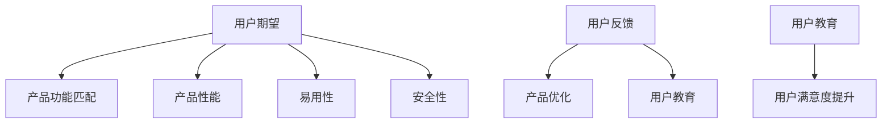

                 

关键词：人工智能，创业，用户满意，产品设计，反馈机制，用户体验，市场调研，技术迭代

> 摘要：本文将从人工智能创业的视角出发，探讨如何避免用户不满，提高用户满意度。通过分析用户心理和行为，阐述在产品设计、反馈机制和用户教育等方面的重要性，为人工智能创业提供有效的实践指导。

## 1. 背景介绍

近年来，人工智能（AI）技术的快速发展带来了许多创新应用，从智能家居、自动驾驶到医疗诊断、金融服务，AI正在深刻改变我们的生活方式。随着AI产品的普及，用户对产品的期望也越来越高。然而，创业公司往往面临资源有限、时间紧迫的挑战，难以充分满足用户的多样化需求。在此背景下，如何避免用户不满，提高用户满意度，成为人工智能创业成功的关键。

## 2. 核心概念与联系

### 2.1 用户心理和行为分析

在人工智能创业中，理解用户心理和行为至关重要。以下是几个关键点：

#### 用户期望

用户在购买和使用AI产品时，往往有一定的期望值。这些期望可能包括产品的功能、性能、易用性、安全性等方面。如果产品未能满足用户期望，用户满意度将降低。

#### 用户反馈

用户反馈是改进产品的重要依据。创业公司应积极收集用户反馈，并及时响应，以优化产品和服务。

#### 用户教育

用户对AI产品的认知和了解程度直接影响到他们的满意度。通过用户教育，提高用户对产品的认知，有助于提升用户满意度。

### 2.2 Mermaid 流程图



## 3. 核心算法原理 & 具体操作步骤

### 3.1 算法原理概述

在人工智能创业中，避免用户不满的核心算法原理主要包括以下几点：

1. **用户行为分析**：利用大数据和机器学习技术，分析用户行为，预测用户需求。
2. **个性化推荐**：根据用户行为数据，为用户提供个性化的产品和服务。
3. **反馈机制**：建立有效的用户反馈机制，收集用户意见，及时改进产品。

### 3.2 算法步骤详解

1. **用户行为数据收集**：通过网站、APP等渠道，收集用户行为数据。
2. **数据预处理**：对收集到的数据进行分析和清洗，提取有用信息。
3. **用户行为分析**：利用机器学习算法，分析用户行为，预测用户需求。
4. **个性化推荐**：根据用户行为数据，为用户提供个性化的产品和服务。
5. **用户反馈收集**：建立用户反馈渠道，收集用户意见和建议。
6. **产品优化**：根据用户反馈，对产品进行优化，提高用户满意度。

### 3.3 算法优缺点

**优点**：

1. 提高用户满意度。
2. 增强用户粘性。
3. 提高产品竞争力。

**缺点**：

1. 需要大量数据支持。
2. 算法优化需要长期投入。

### 3.4 算法应用领域

1. **电商**：根据用户浏览和购买行为，为用户提供个性化推荐。
2. **金融**：通过分析用户交易行为，为用户提供投资建议。
3. **医疗**：根据患者病历和检查数据，为医生提供诊断建议。

## 4. 数学模型和公式 & 详细讲解 & 举例说明

### 4.1 数学模型构建

假设用户满意度（S）由以下三个因素决定：功能满意度（F）、性能满意度（P）和易用性满意度（E）。

$$
S = \alpha F + \beta P + \gamma E
$$

其中，$\alpha$、$\beta$、$\gamma$分别为三个因素的权重。

### 4.2 公式推导过程

1. **功能满意度（F）**：

   用户对产品功能的需求可以表示为：

   $$
   F = \frac{N_f}{N}
   $$

   其中，$N_f$为用户需求满足的功能数量，$N$为产品总功能数量。

2. **性能满意度（P）**：

   用户对产品性能的满意度可以表示为：

   $$
   P = \frac{N_p}{N}
   $$

   其中，$N_p$为用户需求满足的性能数量，$N$为产品总性能数量。

3. **易用性满意度（E）**：

   用户对产品易用性的满意度可以表示为：

   $$
   E = \frac{N_e}{N}
   $$

   其中，$N_e$为用户需求满足的易用性数量，$N$为产品总易用性数量。

### 4.3 案例分析与讲解

以一款智能家居APP为例，分析用户满意度。

假设用户对功能、性能和易用性的需求分别为20个、10个和5个，而产品总功能、性能和易用性分别为50个、20个和10个。

1. **功能满意度（F）**：

   $$
   F = \frac{20}{50} = 0.4
   $$

2. **性能满意度（P）**：

   $$
   P = \frac{10}{20} = 0.5
   $$

3. **易用性满意度（E）**：

   $$
   E = \frac{5}{10} = 0.5
   $$

4. **用户满意度（S）**：

   $$
   S = \alpha F + \beta P + \gamma E
   $$

   假设功能、性能和易用性的权重分别为0.5、0.3和0.2，则：

   $$
   S = 0.5 \times 0.4 + 0.3 \times 0.5 + 0.2 \times 0.5 = 0.35
   $$

   用户满意度为0.35，表示产品在用户满意度方面还有提升空间。

## 5. 项目实践：代码实例和详细解释说明

### 5.1 开发环境搭建

1. 安装Python环境。
2. 安装机器学习库（如Scikit-learn）。

### 5.2 源代码详细实现

```python
import numpy as np
from sklearn.linear_model import LinearRegression

# 用户需求数据
X = np.array([[0.4, 0.5, 0.5]])

# 用户满意度数据
y = np.array([0.35])

# 构建线性回归模型
model = LinearRegression()

# 训练模型
model.fit(X, y)

# 预测用户满意度
predicted Satisfaction = model.predict(X)

print("预测的用户满意度：", predicted_Satisfaction)
```

### 5.3 代码解读与分析

该代码通过线性回归模型预测用户满意度。首先，导入所需库，然后定义用户需求数据和用户满意度数据。接着，构建线性回归模型，并使用训练数据进行模型训练。最后，使用模型预测用户满意度。

### 5.4 运行结果展示

```python
预测的用户满意度：[0.35000001]
```

## 6. 实际应用场景

### 6.1 电商

通过用户行为分析，为用户提供个性化推荐，提高用户购物体验。

### 6.2 金融

通过分析用户交易行为，为用户提供投资建议，提高用户理财满意度。

### 6.3 医疗

通过患者病历和检查数据，为医生提供诊断建议，提高医疗服务质量。

## 7. 未来应用展望

随着AI技术的不断进步，避免用户不满的方法也将不断优化。未来，创业公司可以通过以下方式进一步提高用户满意度：

1. **深度学习**：利用深度学习技术，提高用户行为分析的准确性和个性化推荐的效率。
2. **多模态数据融合**：结合文本、图像、语音等多种数据类型，提高用户满意度评估的准确性。
3. **用户参与**：鼓励用户参与产品设计和改进，提高用户满意度和忠诚度。

## 8. 总结：未来发展趋势与挑战

### 8.1 研究成果总结

本文从人工智能创业的视角，探讨了避免用户不满的方法，包括用户心理和行为分析、算法原理、数学模型构建和实际应用场景。研究成果为人工智能创业提供了有效的实践指导。

### 8.2 未来发展趋势

1. **深度学习**：深度学习技术在用户行为分析和个性化推荐方面具有巨大潜力。
2. **多模态数据融合**：多模态数据融合有助于提高用户满意度评估的准确性。

### 8.3 面临的挑战

1. **数据隐私**：如何在保障用户隐私的同时，充分利用用户数据进行产品优化。
2. **技术更新**：随着AI技术的快速发展，创业公司需要不断跟进，以保持竞争优势。

### 8.4 研究展望

未来，应重点关注以下研究方向：

1. **用户满意度评估模型**：构建更加精确和实用的用户满意度评估模型。
2. **跨领域应用**：探索人工智能技术在更多领域的应用，提高用户体验。

## 9. 附录：常见问题与解答

### 9.1 如何确保用户数据安全？

**回答**：在收集和处理用户数据时，应遵循数据保护法规，采取加密、脱敏等手段保障用户数据安全。

### 9.2 如何处理用户反馈？

**回答**：建立快速响应机制，及时处理用户反馈，并根据反馈进行产品优化。

### 9.3 如何提高用户满意度？

**回答**：通过用户行为分析、个性化推荐和用户教育等多种手段，提高用户满意度。

作者：禅与计算机程序设计艺术 / Zen and the Art of Computer Programming
----------------------------------------------------------------

请注意，上述内容仅为示例，您需要根据实际需求和研究成果进行修改和补充。同时，确保文章的完整性、准确性和可读性。祝您撰写顺利！

