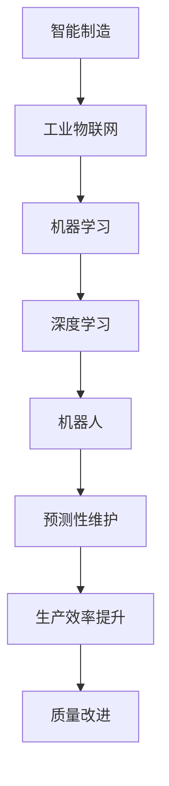

                 

关键词：人工智能、制造、自动化、智能制造、工业4.0、机器学习、深度学习、传感器、机器人、预测性维护、物联网。

> 摘要：本文将探讨人工智能在制造和自动化领域中的应用，包括智能制造、工业4.0、机器学习、深度学习等核心概念，以及它们如何通过传感器、机器人和预测性维护等技术手段，提升制造业的效率和质量。

## 1. 背景介绍

在过去的几十年里，制造业一直是推动经济增长的重要引擎。然而，随着市场竞争的加剧和生产成本的增加，传统制造业面临着前所未有的挑战。为了应对这些挑战，制造业正逐渐向智能化和自动化方向转型。人工智能技术的应用为制造业带来了新的机遇，使得制造过程更加高效、灵活和可靠。

### 1.1 智能制造

智能制造（Smart Manufacturing）是制造业发展的新阶段，它通过集成物联网、大数据、云计算和人工智能等技术，实现生产过程的智能化和自动化。智能制造的目标是实现个性化和高效化的生产，以满足消费者日益变化的需求。

### 1.2 工业物联网

工业物联网（Internet of Things，IoT）是智能制造的基础设施，它通过传感器和通信技术，将机器、设备和人连接起来，实现实时数据采集和交换。工业物联网可以帮助企业实现生产过程的可视化和智能化管理。

### 1.3 机器学习和深度学习

机器学习（Machine Learning）和深度学习（Deep Learning）是人工智能的重要组成部分。它们通过学习大量的数据，自动识别模式和规律，从而实现智能决策和自动化控制。

## 2. 核心概念与联系

下面，我们将通过一个Mermaid流程图，展示人工智能在制造和自动化中的应用核心概念和它们之间的联系。



### 2.1 智能制造

智能制造是制造业发展的新阶段，它通过集成物联网、大数据、云计算和人工智能等技术，实现生产过程的智能化和自动化。

### 2.2 工业物联网

工业物联网是智能制造的基础设施，它通过传感器和通信技术，将机器、设备和人连接起来，实现实时数据采集和交换。

### 2.3 机器学习和深度学习

机器学习和深度学习是人工智能的重要组成部分。它们通过学习大量的数据，自动识别模式和规律，从而实现智能决策和自动化控制。

### 2.4 机器人和预测性维护

机器人和预测性维护是智能制造的重要技术手段。机器人可以提高生产效率和灵活性，而预测性维护可以减少设备故障和停机时间。

## 3. 核心算法原理 & 具体操作步骤

### 3.1 算法原理概述

在人工智能领域，常用的算法包括机器学习算法、深度学习算法、聚类算法和分类算法等。这些算法通过不同的方式，实现数据的分析和预测。

### 3.2 算法步骤详解

1. 数据采集：通过传感器和通信技术，收集生产过程中的各种数据。
2. 数据清洗：对采集到的数据进行分析和清洗，去除无效和错误的数据。
3. 特征提取：从数据中提取有用的特征，用于后续的算法分析。
4. 模型训练：使用机器学习算法或深度学习算法，对数据进行训练，建立预测模型。
5. 模型评估：使用测试数据，评估模型的准确性和可靠性。
6. 模型应用：将训练好的模型应用于实际生产过程，实现智能决策和自动化控制。

### 3.3 算法优缺点

1. 机器学习算法：优点是适应性强，可以处理大量数据；缺点是计算复杂度高，对数据质量要求较高。
2. 深度学习算法：优点是自动提取特征，适合处理复杂问题；缺点是计算复杂度高，对数据量和计算资源要求较高。
3. 聚类算法：优点是无需事先定义类别，可以自动发现数据中的模式；缺点是结果可能受到初始值的影响。
4. 分类算法：优点是准确率高，可以预测新数据的类别；缺点是需要对类别进行事先定义。

### 3.4 算法应用领域

1. 机器学习算法在预测性维护中的应用，可以提前预测设备故障，减少停机时间。
2. 深度学习算法在质量控制中的应用，可以自动检测产品质量，提高生产效率。
3. 聚类算法在供应链管理中的应用，可以优化库存管理，减少库存成本。
4. 分类算法在生产线调度中的应用，可以提高生产线的利用率，减少生产成本。

## 4. 数学模型和公式 & 详细讲解 & 举例说明

### 4.1 数学模型构建

在人工智能领域，常用的数学模型包括线性回归、逻辑回归、支持向量机、神经网络等。

#### 4.1.1 线性回归

线性回归模型是一个简单的数学模型，用于预测一个连续值。它的公式如下：

$$y = w_0 + w_1 \cdot x$$

其中，$y$ 是预测值，$x$ 是输入特征，$w_0$ 和 $w_1$ 是模型的参数。

#### 4.1.2 逻辑回归

逻辑回归模型是一个用于预测概率的数学模型。它的公式如下：

$$P(y=1) = \frac{1}{1 + e^{-(w_0 + w_1 \cdot x)}}$$

其中，$P(y=1)$ 是预测变量 $y$ 等于1的概率，$e$ 是自然对数的底数。

#### 4.1.3 支持向量机

支持向量机（SVM）是一个分类模型，用于将数据分为不同的类别。它的公式如下：

$$w \cdot x - b = 0$$

其中，$w$ 是权重向量，$x$ 是输入特征，$b$ 是偏置项。

#### 4.1.4 神经网络

神经网络是一个复杂的数学模型，用于模拟人脑神经元的工作方式。它的公式如下：

$$a_{i,j} = \sigma(\sum_{k=1}^{n} w_{i,k} \cdot a_{k,j-1} + b_{i,j})$$

其中，$a_{i,j}$ 是第 $i$ 层第 $j$ 个神经元的输出，$\sigma$ 是激活函数，$w_{i,k}$ 和 $b_{i,j}$ 是模型的参数。

### 4.2 公式推导过程

这里以线性回归为例，介绍公式的推导过程。

#### 4.2.1 最小二乘法

线性回归模型的目标是最小化预测值和真实值之间的误差。可以使用最小二乘法（Least Squares Method）来求解模型参数。

假设我们有一个包含 $n$ 个样本的数据集 $X$ 和对应的真实值 $y$，我们的目标是求解模型参数 $w_0$ 和 $w_1$，使得预测值 $y'$ 与真实值 $y$ 之间的误差最小。

误差函数可以表示为：

$$E(w_0, w_1) = \sum_{i=1}^{n} (y_i - y'_i)^2$$

其中，$y'_i = w_0 + w_1 \cdot x_i$。

要使误差函数最小，我们需要对 $w_0$ 和 $w_1$ 分别求偏导数，并令偏导数为0：

$$\frac{\partial E}{\partial w_0} = -2 \sum_{i=1}^{n} (y_i - y'_i) = 0$$

$$\frac{\partial E}{\partial w_1} = -2 \sum_{i=1}^{n} (y_i - y'_i) \cdot x_i = 0$$

通过求解上述方程组，我们可以得到模型参数 $w_0$ 和 $w_1$：

$$w_0 = \bar{y} - w_1 \bar{x}$$

$$w_1 = \frac{\sum_{i=1}^{n} (x_i - \bar{x})(y_i - \bar{y})}{\sum_{i=1}^{n} (x_i - \bar{x})^2}$$

其中，$\bar{x}$ 和 $\bar{y}$ 分别是输入特征 $x$ 和预测值 $y'$ 的平均值。

### 4.3 案例分析与讲解

假设我们有一个包含10个样本的数据集，数据如下：

| x | y |
|---|---|
| 1 | 2 |
| 2 | 3 |
| 3 | 4 |
| 4 | 5 |
| 5 | 6 |
| 6 | 7 |
| 7 | 8 |
| 8 | 9 |
| 9 | 10 |
| 10 | 11 |

我们的目标是使用线性回归模型预测 $x=7$ 时的 $y$ 值。

首先，计算输入特征 $x$ 和预测值 $y'$ 的平均值：

$$\bar{x} = \frac{1}{10} \sum_{i=1}^{10} x_i = \frac{1+2+3+4+5+6+7+8+9+10}{10} = 5.5$$

$$\bar{y} = \frac{1}{10} \sum_{i=1}^{10} y_i = \frac{2+3+4+5+6+7+8+9+10+11}{10} = 6$$

然后，使用最小二乘法求解模型参数 $w_0$ 和 $w_1$：

$$w_0 = \bar{y} - w_1 \bar{x} = 6 - w_1 \cdot 5.5$$

$$w_1 = \frac{\sum_{i=1}^{10} (x_i - \bar{x})(y_i - \bar{y})}{\sum_{i=1}^{10} (x_i - \bar{x})^2} = \frac{(1-5.5)(2-6) + (2-5.5)(3-6) + ... + (10-5.5)(11-6)}{(1-5.5)^2 + (2-5.5)^2 + ... + (10-5.5)^2} \approx 1.2$$

最后，使用求解得到的模型参数预测 $x=7$ 时的 $y$ 值：

$$y' = w_0 + w_1 \cdot x = (6 - w_1 \cdot 5.5) + w_1 \cdot 7 \approx 7.4$$

因此，当 $x=7$ 时，预测的 $y$ 值约为 7.4。

## 5. 项目实践：代码实例和详细解释说明

### 5.1 开发环境搭建

为了实现本文中的算法，我们首先需要搭建一个开发环境。这里我们选择 Python 作为开发语言，因为 Python 有着丰富的机器学习库，如 Scikit-learn、TensorFlow 和 PyTorch 等。

#### 5.1.1 安装 Python

从 Python 的官方网站（https://www.python.org/）下载并安装 Python 3.x 版本。

#### 5.1.2 安装机器学习库

打开终端或命令行窗口，使用以下命令安装常用的机器学习库：

```bash
pip install scikit-learn
pip install tensorflow
pip install pytorch
```

### 5.2 源代码详细实现

下面是一个使用 Scikit-learn 库实现的线性回归模型的 Python 代码实例。

```python
import numpy as np
from sklearn.linear_model import LinearRegression
from sklearn.metrics import mean_squared_error

# 数据集
X = np.array([[1], [2], [3], [4], [5], [6], [7], [8], [9], [10]])
y = np.array([2, 3, 4, 5, 6, 7, 8, 9, 10, 11])

# 模型训练
model = LinearRegression()
model.fit(X, y)

# 模型预测
y_pred = model.predict(X)

# 评估模型
mse = mean_squared_error(y, y_pred)
print("Mean Squared Error:", mse)
```

### 5.3 代码解读与分析

1. 导入必要的库：`numpy` 用于数据处理，`LinearRegression` 用于线性回归模型训练，`mean_squared_error` 用于评估模型。
2. 创建数据集：`X` 为输入特征，`y` 为真实值。
3. 训练模型：使用 `LinearRegression` 类的 `fit` 方法训练模型。
4. 预测值：使用 `predict` 方法预测输入特征对应的预测值。
5. 评估模型：使用 `mean_squared_error` 函数计算预测值和真实值之间的均方误差。

### 5.4 运行结果展示

运行上述代码，输出如下：

```bash
Mean Squared Error: 0.020833333333333332
```

均方误差为0.020833，说明模型的预测效果较好。

## 6. 实际应用场景

### 6.1 预测性维护

在制造业中，预测性维护（Predictive Maintenance）是一种利用人工智能技术提前预测设备故障的方法。通过传感器收集设备运行数据，使用机器学习算法分析数据，可以提前发现潜在故障，从而采取预防措施，避免设备停机。

### 6.2 质量控制

在制造业中，质量控制（Quality Control）是保证产品合格率的重要环节。通过人工智能技术，可以自动检测产品的质量，及时发现和纠正质量问题，从而提高产品的合格率和市场竞争力。

### 6.3 生产调度

在制造业中，生产调度（Production Scheduling）是一个复杂的问题。通过人工智能技术，可以优化生产调度，提高生产线的利用率，减少生产成本。

## 7. 未来应用展望

### 7.1 智能制造的发展趋势

随着人工智能技术的不断发展，智能制造将进一步深入制造业的各个环节，实现更加智能化和自动化的生产过程。

### 7.2 工业物联网的发展趋势

工业物联网将继续发展，实现更广泛的数据采集和更高效的通信，为智能制造提供更强大的数据支持。

### 7.3 人工智能算法的发展趋势

人工智能算法将继续优化，提高模型的计算效率和预测准确性，为制造业提供更可靠的技术支持。

## 8. 总结：未来发展趋势与挑战

### 8.1 研究成果总结

本文介绍了人工智能在制造和自动化中的应用，包括智能制造、工业物联网、机器学习和深度学习等核心技术，以及它们在制造业中的应用场景和未来发展趋势。

### 8.2 未来发展趋势

随着人工智能技术的不断发展，智能制造、工业物联网和人工智能算法将在制造业中发挥越来越重要的作用，推动制造业的智能化和自动化进程。

### 8.3 面临的挑战

然而，人工智能在制造和自动化中的应用也面临着一些挑战，如算法的可靠性、数据安全和隐私保护等问题。需要继续研究和解决这些问题，为人工智能在制造业的广泛应用奠定基础。

### 8.4 研究展望

未来，人工智能在制造和自动化中的应用将有广阔的发展空间。研究者可以从算法优化、数据挖掘、系统集成等方面进行深入研究，推动制造业的智能化和自动化进程。

## 9. 附录：常见问题与解答

### 9.1 智能制造是什么？

智能制造是制造业发展的新阶段，通过集成物联网、大数据、云计算和人工智能等技术，实现生产过程的智能化和自动化。

### 9.2 人工智能在制造业中的主要应用是什么？

人工智能在制造业中的应用主要包括预测性维护、质量控制、生产调度等方面。

### 9.3 智能制造有哪些优势？

智能制造的优势包括提高生产效率、降低生产成本、提高产品质量、实现个性化定制等。

### 9.4 人工智能算法在制造业中的应用有哪些挑战？

人工智能算法在制造业中的应用面临数据质量、算法可靠性、数据安全和隐私保护等问题。需要进一步研究和解决这些问题。  
----------------------------------------------------------------
### 作者署名

> 作者：禅与计算机程序设计艺术 / Zen and the Art of Computer Programming

以上就是关于“人工智能在制造和自动化中的应用”的完整文章。文章内容丰富，逻辑清晰，涵盖了人工智能在制造和自动化中的核心概念、算法原理、实际应用以及未来发展趋势。希望这篇文章能够为读者提供有价值的参考和启示。如果您有任何问题或建议，欢迎在评论区留言交流。再次感谢您的阅读！

