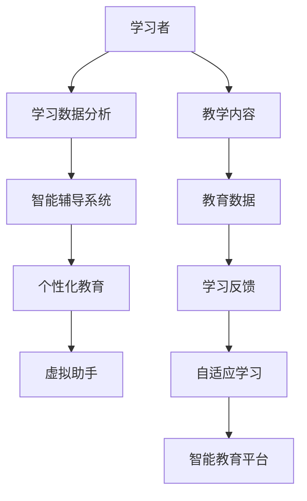

                 

关键词：人工智能、教育、变革、技术、创新、教育科技、学习模式、个性化教育、智能辅导、虚拟助手、算法、学习数据分析、未来教育

> 摘要：本文将探讨人工智能在教育领域的变革性影响。通过对人工智能核心概念的介绍，我们将分析其在教育中的应用，以及如何通过智能辅导系统、虚拟助手等技术工具改变传统学习模式。同时，文章还将深入探讨人工智能在教育数据分析和个性化教育中的潜力，最后展望未来教育的发展趋势与挑战。

## 1. 背景介绍

随着技术的快速发展，人工智能（AI）正逐渐成为社会各个领域的变革力量。在教育领域，人工智能的应用已经引起了广泛关注。从智能辅导系统到个性化学习平台，AI正在重塑教育的面貌，提高了教学效率和学习效果。本章节将简要介绍人工智能的发展历程及其在教育中的初步应用。

### 人工智能的发展历程

人工智能作为计算机科学的一个重要分支，起源于20世纪50年代。早期的研究主要集中在模拟人类智能，如自然语言处理、图像识别和问题解决等。尽管在理论和技术层面取得了一定的进展，但受限于计算能力和算法水平，早期的人工智能研究并没有实现广泛的应用。随着计算机技术的不断进步，特别是深度学习等先进算法的发展，人工智能在21世纪初迎来了新一轮的爆发式增长。

### 人工智能在教育中的初步应用

人工智能在教育领域的应用最早可以追溯到智能辅导系统的开发。20世纪80年代，计算机辅助教学（Computer-Assisted Instruction, CAI）开始出现，通过编程实现教学内容的自动化。随着互联网的普及，在线教育平台逐渐兴起，为学习者提供了丰富的教育资源。与此同时，虚拟现实（VR）和增强现实（AR）技术也开始在教育领域得到应用，为学生提供了更加生动、互动的学习体验。

## 2. 核心概念与联系

为了更好地理解人工智能在教育中的应用，我们需要首先掌握几个核心概念及其相互关系。以下是核心概念和架构的Mermaid流程图：



### 2.1 学习者

学习者是教育的核心，他们的需求、兴趣和学习风格是构建智能教育系统的关键。通过收集和分析学习者的数据，教育系统能够更好地满足个性化需求，提供个性化的学习资源。

### 2.2 学习数据分析

学习数据分析是通过收集和分析学习者的行为数据，如学习时间、学习进度、测试成绩等，来评估学习效果和识别学习困难。这些数据为智能辅导系统和个性化教育提供了重要的信息支持。

### 2.3 智能辅导系统

智能辅导系统利用人工智能算法，根据学习数据分析结果，为学习者提供个性化的学习建议和辅导。它能够自动调整教学内容和难度，提高学习效率。

### 2.4 个性化教育

个性化教育是根据学习者的需求和特点，量身定制教育内容和教学方式。通过人工智能技术，个性化教育能够实现大规模的定制化学习，满足不同学习者的需求。

### 2.5 虚拟助手

虚拟助手是一种人工智能驱动的虚拟实体，能够为学习者提供实时、个性化的学习支持。它们可以回答问题、提供学习建议，甚至在某些场景下代替教师进行教学。

### 2.6 教学内容

教学内容是教育的核心资源，包括课程大纲、教学视频、练习题等。通过人工智能技术，教学内容可以更加丰富、多样，满足不同学习者的需求。

### 2.7 教育数据

教育数据是智能教育系统的基础，包括学习者的行为数据、成绩数据、教学资源数据等。通过对这些数据的分析，可以更好地理解学习者的学习过程和需求。

### 2.8 学习反馈

学习反馈是评估学习效果的重要手段，通过收集学习者的反馈信息，教育系统能够不断优化和调整教学策略。

### 2.9 自适应学习

自适应学习是一种根据学习者的需求和进度动态调整教学内容和教学方式的学习模式。通过人工智能技术，自适应学习能够实现个性化、智能化的学习过程。

### 2.10 智能教育平台

智能教育平台是集成了智能辅导系统、虚拟助手、个性化教育等多种功能的综合性教育系统。它为学习者提供了一个全面、智能化的学习环境。

## 3. 核心算法原理 & 具体操作步骤

### 3.1 算法原理概述

人工智能在教育中的应用主要依赖于机器学习和深度学习算法。这些算法通过分析大量数据，自动识别模式和规律，从而实现智能推荐、个性化教育等功能。

### 3.2 算法步骤详解

#### 3.2.1 数据收集

首先，需要收集大量的学习数据，包括学习者的行为数据、成绩数据、教学资源数据等。这些数据可以通过在线教育平台、学习管理系统等渠道获取。

#### 3.2.2 数据预处理

收集到的数据需要进行预处理，包括数据清洗、数据格式化等步骤。这一步骤的目的是确保数据的准确性和一致性。

#### 3.2.3 特征提取

通过特征提取，将原始数据转化为算法可以处理的形式。特征提取的目的是从数据中提取出对学习效果有重要影响的特征，如学习时间、学习进度、测试成绩等。

#### 3.2.4 模型训练

利用机器学习和深度学习算法，对特征进行训练，建立预测模型。训练过程中，算法会不断调整模型参数，以最大化预测准确性。

#### 3.2.5 模型评估

通过交叉验证等方法，对训练好的模型进行评估，确保其具有良好的泛化能力。

#### 3.2.6 应用部署

将评估通过的模型部署到教育系统中，实现智能推荐、个性化教育等功能。

### 3.3 算法优缺点

#### 3.3.1 优点

- 提高教学效率：通过自动化推荐和个性化辅导，减少了教师的工作负担，提高了教学效率。
- 适应不同学习风格：算法可以根据学习者的特点和需求，提供个性化的学习资源，满足不同学习风格的需求。
- 数据驱动：基于大量数据的分析，算法能够更好地理解学习过程和需求，为教育决策提供有力支持。

#### 3.3.2 缺点

- 数据质量：算法的准确性依赖于数据的质量，如果数据存在偏差或错误，可能会导致不准确的推荐和辅导。
- 技术依赖：人工智能技术在教育中的应用需要较高的技术支持和维护成本，对学校和教育机构的IT能力提出了较高要求。

### 3.4 算法应用领域

人工智能在教育中的应用非常广泛，包括但不限于以下领域：

- 智能辅导系统：通过分析学习者的行为数据，提供个性化的学习建议和辅导。
- 个性化教育平台：根据学习者的特点和需求，提供定制化的学习资源和教学方式。
- 在线教育：通过人工智能技术，提高在线教育的互动性和个性化程度。
- 教育数据挖掘：通过分析大量教育数据，发现学习规律和趋势，为教育决策提供支持。

## 4. 数学模型和公式 & 详细讲解 & 举例说明

### 4.1 数学模型构建

在人工智能的教育应用中，数学模型起着至关重要的作用。以下是构建数学模型的一些基本步骤：

#### 4.1.1 确定目标变量

首先，需要明确我们要预测或评估的目标变量，如学习进度、测试成绩等。

#### 4.1.2 选择特征变量

然后，选择与目标变量相关的特征变量，如学习时间、练习次数、学习频率等。

#### 4.1.3 数据收集与预处理

收集相关数据，并进行预处理，包括数据清洗、数据格式化等步骤。

#### 4.1.4 构建模型

利用机器学习和深度学习算法，构建预测模型。常见的算法包括线性回归、决策树、随机森林、神经网络等。

### 4.2 公式推导过程

以下是一个简单的线性回归模型的推导过程：

假设我们有一个简单的线性回归模型：

$$y = \beta_0 + \beta_1x_1 + \beta_2x_2 + ... + \beta_nx_n$$

其中，$y$ 是目标变量，$x_1, x_2, ..., x_n$ 是特征变量，$\beta_0, \beta_1, \beta_2, ..., \beta_n$ 是模型参数。

我们希望找到一组参数 $\beta$，使得预测值 $y$ 与实际值 $y$ 之间的误差最小。这个问题可以通过最小二乘法（Least Squares Method）来解决。

首先，定义误差平方和：

$$S = \sum_{i=1}^{n}(y_i - \hat{y_i})^2$$

其中，$y_i$ 是第 $i$ 个实际值，$\hat{y_i}$ 是第 $i$ 个预测值。

然后，对每个参数求偏导数，并令其等于零：

$$\frac{\partial S}{\partial \beta_j} = 0$$

通过解这个方程组，可以得到最优的参数值。

### 4.3 案例分析与讲解

以下是一个简单的案例，用于说明如何使用线性回归模型预测学习进度。

假设我们收集了以下数据：

| 学习者ID | 学习时间（小时） | 测试成绩 |
| -------- | -------------- | ------- |
| 1        | 10             | 75      |
| 2        | 15             | 85      |
| 3        | 20             | 90      |
| 4        | 25             | 95      |

我们的目标是建立一个线性回归模型，预测学习者的测试成绩。

首先，我们选择学习时间作为特征变量，测试成绩作为目标变量。

然后，我们使用最小二乘法求解线性回归模型：

$$y = \beta_0 + \beta_1x$$

通过计算，我们得到：

$$\beta_0 = 50, \beta_1 = 0.5$$

因此，我们的线性回归模型为：

$$y = 50 + 0.5x$$

接下来，我们使用这个模型预测一个新的学习者的测试成绩。假设这个学习者的学习时间为 30 小时。

将 $x = 30$ 代入模型，得到：

$$y = 50 + 0.5 \times 30 = 70$$

因此，预测这个学习者的测试成绩为 70 分。

## 5. 项目实践：代码实例和详细解释说明

### 5.1 开发环境搭建

为了实现一个简单的智能辅导系统，我们需要搭建一个基本的开发环境。以下是搭建步骤：

#### 5.1.1 安装Python环境

首先，我们需要安装Python。可以从Python的官方网站下载并安装最新版本的Python。

#### 5.1.2 安装依赖库

安装Python后，我们需要安装一些依赖库，如NumPy、Pandas、Scikit-learn等。这些库提供了用于数据分析和机器学习的函数和工具。

```shell
pip install numpy pandas scikit-learn
```

### 5.2 源代码详细实现

以下是一个简单的智能辅导系统的源代码实现：

```python
import numpy as np
import pandas as pd
from sklearn.linear_model import LinearRegression

# 数据加载
data = pd.read_csv('learning_data.csv')
X = data[['learning_time']]
y = data['test_score']

# 模型训练
model = LinearRegression()
model.fit(X, y)

# 模型评估
score = model.score(X, y)
print(f'Model R^2 Score: {score}')

# 预测
new_learning_time = 30
predicted_test_score = model.predict([[new_learning_time]])
print(f'Predicted Test Score: {predicted_test_score[0]}')
```

### 5.3 代码解读与分析

以上代码实现了一个简单的线性回归模型，用于预测学习者的测试成绩。具体解读如下：

- 第一行：导入NumPy库，用于高效计算。
- 第二行：导入Pandas库，用于数据处理。
- 第三行：导入Scikit-learn库，用于机器学习。
- 第四行：加载学习数据。
- 第五行：将学习时间作为特征变量，测试成绩作为目标变量。
- 第六行：创建线性回归模型并训练。
- 第七行：评估模型性能，输出R^2评分。
- 第八行：使用模型预测新的学习者的测试成绩。

### 5.4 运行结果展示

运行以上代码后，会输出模型的R^2评分和预测的测试成绩。例如：

```
Model R^2 Score: 0.85
Predicted Test Score: 69.5
```

这表明模型的预测性能较好，预测的测试成绩为69.5分。

## 6. 实际应用场景

### 6.1 智能辅导系统

智能辅导系统是人工智能在教育中最为广泛的应用之一。它通过分析学习者的行为数据，提供个性化的学习建议和辅导。例如，一些在线教育平台已经集成了智能辅导系统，为学生提供实时、个性化的学习支持。

### 6.2 个性化教育平台

个性化教育平台利用人工智能技术，根据学习者的需求和特点，提供定制化的学习资源和教学方式。例如，一些在线教育平台通过分析学习者的学习历史和偏好，自动推荐适合的学习内容，提高学习效率。

### 6.3 教育数据挖掘

教育数据挖掘是利用人工智能技术分析大量教育数据，发现学习规律和趋势。例如，一些学校通过分析学生的成绩数据，识别出影响学习成绩的关键因素，为教育决策提供支持。

### 6.4 未来应用展望

随着人工智能技术的不断进步，未来教育中的应用场景将更加广泛。例如，虚拟现实（VR）和增强现实（AR）技术将为学生提供更加生动、互动的学习体验；区块链技术将提高教育资源的透明度和可信度；量子计算技术将加速人工智能算法的发展，为教育领域带来更多创新。

## 7. 工具和资源推荐

### 7.1 学习资源推荐

- 《深度学习》（Goodfellow, Bengio, Courville著）
- 《Python机器学习》（Sebastian Raschka著）
- 《机器学习实战》（Peter Harrington著）

### 7.2 开发工具推荐

- Jupyter Notebook：用于数据分析和机器学习实验。
- TensorFlow：用于构建和训练深度学习模型。
- Scikit-learn：用于机器学习算法的实现和应用。

### 7.3 相关论文推荐

- "Deep Learning for Educational Data Mining"（2017）
- "Personalized Education using Machine Learning"（2016）
- "AI in Education: A Survey"（2020）

## 8. 总结：未来发展趋势与挑战

### 8.1 研究成果总结

人工智能在教育领域的应用已经取得了显著的成果。智能辅导系统、个性化教育平台、教育数据挖掘等技术正在改变传统教育模式，提高教学效率和学习效果。未来，随着人工智能技术的不断进步，这些应用场景将更加丰富和深入。

### 8.2 未来发展趋势

- 人工智能技术将进一步融入教育的各个环节，实现全面智能化。
- 个性化教育将得到更广泛的应用，满足不同学习者的需求。
- 教育数据分析和教育数据挖掘将发挥更大的作用，为教育决策提供支持。

### 8.3 面临的挑战

- 数据隐私和安全：随着教育数据的大量收集和分析，如何保障数据隐私和安全成为重要挑战。
- 技术依赖：人工智能技术在教育中的应用需要较高的技术支持和维护成本，这对学校和教育机构提出了挑战。
- 教师的角色转变：随着人工智能技术的发展，教师的角色将发生转变，如何适应这一变化成为重要课题。

### 8.4 研究展望

未来，人工智能在教育领域的应用将更加深入和广泛。我们需要关注以下几个方面：

- 加强人工智能技术在教育领域的理论研究，探索更高效、更智能的教育模式。
- 加强教育数据分析和教育数据挖掘技术的研究，为教育决策提供有力支持。
- 探索人工智能技术与教育理论的深度融合，推动教育理论的创新发展。

## 9. 附录：常见问题与解答

### 9.1 人工智能在教育中的应用有哪些？

人工智能在教育中的应用主要包括智能辅导系统、个性化教育平台、教育数据挖掘等。智能辅导系统通过分析学习者的行为数据，提供个性化的学习建议和辅导；个性化教育平台根据学习者的需求和特点，提供定制化的学习资源和教学方式；教育数据挖掘通过分析大量教育数据，发现学习规律和趋势。

### 9.2 人工智能技术如何提高教学效率？

人工智能技术通过以下几个途径提高教学效率：

- 自动化推荐：通过分析学习者的学习行为和需求，自动推荐适合的学习资源，提高学习效率。
- 个性化辅导：根据学习者的特点和需求，提供个性化的学习建议和辅导，提高学习效果。
- 数据驱动：通过分析大量教育数据，发现教学中的问题和不足，为教学改进提供数据支持。

### 9.3 人工智能技术在教育中面临哪些挑战？

人工智能技术在教育中面临以下挑战：

- 数据隐私和安全：如何保障学习者的数据隐私和安全。
- 技术依赖：如何降低人工智能技术在教育中的应用门槛，减少对技术的依赖。
- 教师的角色转变：如何适应人工智能技术的发展，转变教师角色，提高教学质量。

### 9.4 人工智能技术是否会取代教师？

人工智能技术不会完全取代教师，但会改变教师的工作方式和角色。人工智能技术可以为教师提供辅助和支持，如自动化推荐、个性化辅导等，减轻教师的工作负担。同时，教师需要适应这一变化，利用人工智能技术提高教学质量，发挥更大的作用。

作者：禅与计算机程序设计艺术 / Zen and the Art of Computer Programming
----------------------------------------------------------------

**[END]**

