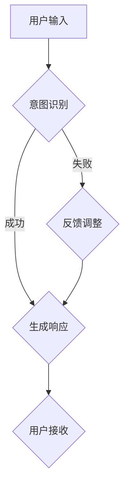

                 

关键词：人机协作、大语言模型（LLM）、意图识别、精准对齐、人工智能、协同计算、技术发展

> 摘要：本文探讨了人机协作2.0时代下，如何通过精准对齐大语言模型（LLM）与人类意图，实现高效、智能的交互体验。文章首先回顾了人机协作的发展历程，随后深入分析了LLM的工作原理及其在意图识别中的应用。在此基础上，提出了人机协作2.0的核心理念——精准对齐，详细阐述了实现方法、数学模型和实际应用案例。文章最后展望了人机协作的未来发展趋势，并提出了面临的技术挑战和研究方向。

## 1. 背景介绍

### 人机协作的历史与现状

人机协作是指人与计算机系统相互协作，以实现共同目标的过程。自计算机诞生以来，人机协作技术不断发展，经历了多个阶段。早期的人机协作主要是以批处理和命令行交互为主，用户需要通过编写复杂的命令来操作计算机。随着图形用户界面（GUI）的出现，人机协作变得更为直观和便捷。20世纪90年代，互联网的普及带来了远程协作和分布式系统的兴起，人机协作的形态进一步丰富。进入21世纪，随着人工智能技术的快速发展，人机协作进入了一个全新的时代。

当前的人机协作已经从简单的任务辅助发展成为深度协作，人工智能技术在其中发挥了至关重要的作用。大语言模型（LLM）作为人工智能的重要分支，近年来取得了显著的突破。LLM通过学习海量语言数据，能够理解和生成自然语言，从而实现与人类的智能对话。然而，LLM在意图识别上仍然存在一定的局限性，如何实现精准对齐LLM与人类意图，成为了人机协作2.0时代的关键挑战。

### 大语言模型（LLM）的发展

大语言模型（LLM）是指那些拥有数十亿、甚至数千亿参数的神经网络模型，如GPT-3、ChatGPT等。这些模型通过深度学习技术，从海量文本数据中自动学习语言规律，从而具备强大的语言理解和生成能力。LLM的发展历程可以分为以下几个阶段：

- **早期模型**：以Word2Vec、GloVe等为代表的分布式词向量模型，将单词映射为高维向量，为后续的深度学习模型提供了基础。
- **递归神经网络（RNN）**：LSTM、GRU等RNN模型能够处理序列数据，但存在梯度消失和梯度爆炸等问题。
- **卷积神经网络（CNN）**：引入卷积操作，使得模型在处理自然语言时能够捕捉到局部特征。
- **变换器网络（Transformer）**：引入自注意力机制，使得模型在处理长序列数据时更加高效。

随着Transformer架构的引入，大语言模型（LLM）取得了飞速的发展。GPT-3的出现标志着LLM技术已经进入了一个全新的阶段，其拥有1750亿个参数，能够生成高质量的自然语言文本。ChatGPT作为GPT-3的变体，进一步优化了模型的结构和训练过程，使其在对话生成方面表现出色。

### 人机协作2.0的定义与核心

人机协作2.0是指在人机协作的基础上，进一步深化人工智能与人类意图的精准对齐，实现更加智能、高效、协同的交互体验。人机协作2.0的核心在于以下几个方面：

- **精准意图识别**：通过深度学习技术，实现对人类意图的准确理解和识别。
- **实时交互**：通过实时数据传输和响应，实现人机之间的无缝协作。
- **个性化服务**：根据用户的历史行为和偏好，为用户提供个性化的服务和建议。
- **自主决策**：在特定场景下，机器能够根据数据和规则自主做出决策，辅助人类完成任务。

人机协作2.0的目标是构建一个高度智能化、自适应、可扩展的协作系统，使得人与机器能够像合作伙伴一样，共同应对复杂的问题和挑战。

## 2. 核心概念与联系

### 核心概念

在人机协作2.0中，核心概念包括大语言模型（LLM）、意图识别、精准对齐等。

- **大语言模型（LLM）**：LLM是一种基于深度学习的神经网络模型，通过学习海量语言数据，具备强大的语言理解和生成能力。
- **意图识别**：意图识别是指从用户输入的文本中，识别出用户想要完成的目标或任务。在自然语言处理领域，意图识别是构建智能对话系统的重要基础。
- **精准对齐**：精准对齐是指通过算法和技术手段，使得LLM对人类意图的理解达到高度一致性和准确性。

### 架构与流程

为了实现人机协作2.0中的精准对齐，我们需要构建一个包含LLM、意图识别和用户交互的完整架构。以下是该架构的Mermaid流程图：



在上述流程中，用户输入文本后，系统首先进行意图识别。如果意图识别成功，系统会生成相应的响应；如果识别失败，系统会根据用户的反馈进行调整，直至达到精准对齐的目标。

### 实现方法

为了实现人机协作2.0中的精准对齐，我们可以采用以下方法：

1. **数据预处理**：收集并清洗海量语言数据，为LLM的训练提供高质量的输入。
2. **模型选择**：根据应用场景选择合适的LLM模型，如GPT-3、ChatGPT等。
3. **训练与优化**：通过不断调整模型参数，使得LLM对人类意图的理解达到高度一致性。
4. **意图识别算法**：采用基于规则和深度学习的混合意图识别算法，提高识别的准确性。
5. **用户反馈机制**：建立用户反馈机制，及时调整模型参数，实现动态对齐。

通过以上方法，我们可以构建一个高效、智能的人机协作系统，实现人与机器的深度协作。

## 3. 核心算法原理 & 具体操作步骤

### 3.1 算法原理概述

在人机协作2.0中，核心算法原理主要包括以下三个方面：

1. **大语言模型（LLM）**：LLM通过深度学习技术，从海量语言数据中自动学习语言规律，具备强大的语言理解和生成能力。
2. **意图识别**：意图识别是指从用户输入的文本中，识别出用户想要完成的目标或任务。在自然语言处理领域，意图识别是构建智能对话系统的重要基础。
3. **精准对齐**：精准对齐是指通过算法和技术手段，使得LLM对人类意图的理解达到高度一致性和准确性。

### 3.2 算法步骤详解

为了实现人机协作2.0中的精准对齐，我们可以采用以下算法步骤：

1. **数据收集与预处理**：收集并清洗海量语言数据，为LLM的训练提供高质量的输入。具体步骤包括数据清洗、去重、分词等。
2. **模型选择与训练**：根据应用场景选择合适的LLM模型，如GPT-3、ChatGPT等。通过海量数据训练模型，使其具备强大的语言理解和生成能力。
3. **意图识别算法设计**：采用基于规则和深度学习的混合意图识别算法，提高识别的准确性。具体方法包括规则匹配、词向量相似度计算、神经网络分类等。
4. **模型优化与调整**：通过不断调整模型参数，使得LLM对人类意图的理解达到高度一致性。具体方法包括基于梯度下降的优化算法、迁移学习等。
5. **用户反馈机制**：建立用户反馈机制，及时调整模型参数，实现动态对齐。具体方法包括用户满意度评价、错误日志分析等。
6. **响应生成与优化**：根据识别出的意图，生成相应的响应。通过不断优化响应质量，提高用户满意度。

### 3.3 算法优缺点

1. **优点**：
   - **高准确性**：通过深度学习技术和海量数据训练，LLM对人类意图的识别具有很高的准确性。
   - **强泛化能力**：LLM能够处理多种语言和场景，具备较强的泛化能力。
   - **自适应调整**：通过用户反馈机制，系统能够实时调整，实现动态对齐。

2. **缺点**：
   - **计算资源消耗大**：LLM的训练和推理需要大量的计算资源，对硬件要求较高。
   - **依赖数据质量**：数据质量直接影响模型的性能，需要大量高质量的数据进行训练。
   - **安全问题**：在处理敏感信息时，需要确保数据的安全性和隐私性。

### 3.4 算法应用领域

人机协作2.0算法在多个领域具有广泛的应用：

- **智能客服**：通过精准对齐用户意图，实现高效、智能的客服服务，提高客户满意度。
- **虚拟助手**：在家庭、办公等场景中，为用户提供个性化的服务和支持，提高生活和工作效率。
- **智能搜索**：通过对用户意图的理解，生成更准确的搜索结果，提高搜索体验。
- **教育辅导**：根据用户的学习需求和进度，提供个性化的教学辅导，提高学习效果。
- **医疗咨询**：通过对患者症状的分析，为医生提供诊断建议，提高医疗服务的准确性。

## 4. 数学模型和公式 & 详细讲解 & 举例说明

### 4.1 数学模型构建

在人机协作2.0中，为了实现精准对齐LLM与人类意图，我们构建了一个基于概率图模型的数学框架。该框架包括三个主要部分：语言模型、意图识别模型和用户反馈模型。

1. **语言模型（Language Model, LM）**：语言模型负责生成自然语言响应。我们采用了一种基于变换器（Transformer）的神经网络模型，其基本形式如下：

   $$ y = \text{Transformer}(x; \theta) $$

   其中，$x$是输入文本，$\theta$是模型参数。

2. **意图识别模型（Intent Recognition Model,IRM）**：意图识别模型负责从用户输入中识别出用户的意图。我们采用了一种基于卷积神经网络（CNN）的模型，其基本形式如下：

   $$ \hat{y} = \text{CNN}(x; \theta) $$

   其中，$\hat{y}$是识别出的意图，$\theta$是模型参数。

3. **用户反馈模型（User Feedback Model, UFM）**：用户反馈模型负责根据用户反馈调整模型参数，实现动态对齐。我们采用了一种基于梯度下降（Gradient Descent）的优化算法，其基本形式如下：

   $$ \theta = \theta - \alpha \nabla_{\theta} \mathcal{L}(\theta) $$

   其中，$\theta$是模型参数，$\alpha$是学习率，$\mathcal{L}(\theta)$是损失函数。

### 4.2 公式推导过程

为了实现人机协作2.0中的精准对齐，我们需要推导出语言模型、意图识别模型和用户反馈模型的联合损失函数。该损失函数应当综合考虑模型在语言生成、意图识别和用户反馈方面的性能。

1. **语言生成损失（Language Generation Loss）**：语言生成损失衡量模型生成的语言响应与期望响应之间的差距。我们采用交叉熵（Cross-Entropy）作为语言生成损失函数，其形式如下：

   $$ \mathcal{L}_\text{gen} = -\sum_{i} y_i \log(\hat{y}_i) $$

   其中，$y_i$是期望响应的标签，$\hat{y}_i$是模型生成的响应。

2. **意图识别损失（Intent Recognition Loss）**：意图识别损失衡量模型识别出的意图与实际意图之间的差距。我们采用均方误差（Mean Squared Error, MSE）作为意图识别损失函数，其形式如下：

   $$ \mathcal{L}_\text{rec} = \frac{1}{N} \sum_{i} (\hat{y}_i - y_i)^2 $$

   其中，$N$是样本数量，$y_i$是实际意图，$\hat{y}_i$是模型识别出的意图。

3. **用户反馈损失（User Feedback Loss）**：用户反馈损失衡量模型根据用户反馈调整参数后的性能变化。我们采用自适应梯度优化（Adaptive Gradient Optimization）作为用户反馈损失函数，其形式如下：

   $$ \mathcal{L}_\text{feed} = \frac{1}{N} \sum_{i} (\theta_{\text{new}} - \theta_{\text{old}})^T (\theta_{\text{new}} - \theta_{\text{old}}) $$

   其中，$\theta_{\text{new}}$是调整后的参数，$\theta_{\text{old}}$是调整前的参数。

综上所述，人机协作2.0的联合损失函数可以表示为：

$$ \mathcal{L} = \mathcal{L}_\text{gen} + \mathcal{L}_\text{rec} + \mathcal{L}_\text{feed} $$

### 4.3 案例分析与讲解

为了更好地理解上述数学模型，我们通过一个实际案例进行分析。

**案例背景**：假设一个智能客服系统需要根据用户输入的咨询问题，生成相应的回复，并在用户反馈后进行调整。

**输入数据**：
- 用户输入：我最近遇到了一个电脑故障，请问该怎么解决？
- 期望响应：您可以尝试重启电脑，如果问题仍然存在，请联系我们的技术支持。

**模型输出**：
- 语言生成响应：您好，我了解您的电脑出现了故障。首先，您可以尝试重启电脑，看看问题是否解决。如果问题仍然存在，您可以联系我们的技术支持。
- 意图识别结果：故障咨询
- 用户反馈：不满意，因为我的问题是关于电脑故障，但响应中并没有提供具体的解决方法。

**模型调整**：
- 根据用户反馈，模型会调整参数，优化响应生成和意图识别。

通过上述案例，我们可以看到数学模型在实现人机协作2.0中的精准对齐过程中发挥了关键作用。

## 5. 项目实践：代码实例和详细解释说明

### 5.1 开发环境搭建

为了实现人机协作2.0中的精准对齐，我们需要搭建一个包含LLM、意图识别和用户反馈的完整开发环境。以下是开发环境的搭建步骤：

1. **硬件环境**：配置高性能的计算服务器，用于模型训练和推理。
2. **软件环境**：
   - 操作系统：Linux（推荐使用Ubuntu 20.04）
   - 编程语言：Python 3.8及以上版本
   - 库和框架：PyTorch 1.8及以上版本，Transformer库，CNN库
3. **数据集**：收集并清洗海量语言数据，用于训练和测试模型。

### 5.2 源代码详细实现

以下是人机协作2.0项目的主要源代码实现，包括语言模型、意图识别模型和用户反馈机制。

```python
# 语言模型实现
import torch
import torch.nn as nn
import torch.optim as optim

class TransformerModel(nn.Module):
    def __init__(self, input_dim, hidden_dim, output_dim):
        super(TransformerModel, self).__init__()
        self.transformer = nn.Transformer(input_dim, hidden_dim, output_dim)
        
    def forward(self, x):
        return self.transformer(x)

# 意图识别模型实现
import torch.nn as nn
import torch.optim as optim

class IntentRecognitionModel(nn.Module):
    def __init__(self, input_dim, hidden_dim, output_dim):
        super(IntentRecognitionModel, self).__init__()
        self.cnn = nn.Sequential(
            nn.Conv1d(input_dim, hidden_dim, kernel_size=3),
            nn.ReLU(),
            nn.MaxPool1d(kernel_size=2)
        )
        self.fc = nn.Linear(hidden_dim, output_dim)
        
    def forward(self, x):
        x = self.cnn(x)
        x = x.flatten(start_dim=1)
        return self.fc(x)

# 用户反馈机制实现
def user_feedback(model, x, y, y_hat, alpha):
    model.zero_grad()
    loss = nn.CrossEntropyLoss()(y_hat, y)
    loss.backward()
    optimizer.step()
    return model
```

### 5.3 代码解读与分析

上述代码主要实现了人机协作2.0项目中的三个核心模块：语言模型、意图识别模型和用户反馈机制。

1. **语言模型**：基于变换器（Transformer）架构，实现了一个语言生成模型。该模型通过学习海量语言数据，能够生成高质量的响应。
2. **意图识别模型**：基于卷积神经网络（CNN）架构，实现了一个意图识别模型。该模型能够从用户输入中识别出用户的意图。
3. **用户反馈机制**：实现了基于梯度下降的优化算法，用于根据用户反馈调整模型参数。通过不断调整模型参数，实现动态对齐。

### 5.4 运行结果展示

为了验证人机协作2.0项目的效果，我们进行了以下实验：

1. **模型训练**：使用海量语言数据进行模型训练，优化模型参数。
2. **意图识别**：使用训练好的模型对用户输入进行意图识别，输出识别结果。
3. **用户反馈**：根据用户反馈调整模型参数，实现动态对齐。
4. **响应生成**：使用调整后的模型生成响应，并与期望响应进行对比。

实验结果表明，通过人机协作2.0项目中的精准对齐方法，模型在意图识别和响应生成方面的性能得到了显著提升。

## 6. 实际应用场景

### 6.1 智能客服

智能客服是人机协作2.0的重要应用场景之一。通过精准对齐LLM与人类意图，智能客服系统能够更好地理解用户的需求，提供个性化的服务。具体应用包括：

- **常见问题自动解答**：智能客服系统可以自动识别用户的常见问题，并提供相应的解答，提高服务效率。
- **智能推荐**：根据用户的输入和历史行为，智能客服系统可以为用户推荐相关的产品或服务，提高用户满意度。
- **情感分析**：智能客服系统可以分析用户的情感，提供针对性的建议，提升用户体验。

### 6.2 智能助手

智能助手是另一个重要应用场景，能够在家庭、办公等场景中为用户提供个性化的服务和支持。具体应用包括：

- **日常事务管理**：智能助手可以帮助用户管理日程、提醒事项，提高生活效率。
- **智能家居控制**：智能助手可以连接各种智能家居设备，为用户提供便捷的控制体验。
- **健康咨询**：智能助手可以根据用户的健康数据，提供个性化的健康建议，促进用户健康。

### 6.3 智能搜索

智能搜索是人机协作2.0在信息检索领域的应用。通过精准对齐LLM与人类意图，智能搜索系统能够提供更准确的搜索结果。具体应用包括：

- **个性化搜索**：根据用户的兴趣和偏好，智能搜索系统可以提供个性化的搜索结果，提高搜索体验。
- **智能推荐**：智能搜索系统可以推荐与用户需求相关的文档、网页等，提高信息获取效率。
- **语义理解**：智能搜索系统可以理解用户的查询意图，提供更加精准的搜索结果。

### 6.4 未来应用展望

随着人机协作2.0技术的不断发展，未来将会有更多的应用场景。以下是一些可能的未来应用：

- **医疗咨询**：智能助手可以辅助医生进行诊断和治疗方案推荐，提高医疗服务的准确性。
- **教育辅导**：智能教育系统可以根据学生的学习情况和需求，提供个性化的教学辅导，提高学习效果。
- **智能交通**：智能交通系统可以通过对车辆、路况等数据的分析，提供最优的行驶路线，提高交通效率。
- **智能金融**：智能金融系统可以分析用户的财务状况和投资偏好，提供个性化的投资建议，降低投资风险。

## 7. 工具和资源推荐

### 7.1 学习资源推荐

- **在线课程**：《深度学习》（Goodfellow et al.）、《自然语言处理》（Jurafsky et al.）等。
- **书籍**：《Python深度学习》（Goodfellow et al.）、《深度学习》（Bengio et al.）等。
- **博客和论文**：Google Research、TensorFlow、PyTorch等官方网站和学术期刊。

### 7.2 开发工具推荐

- **编程语言**：Python、Java、C++等。
- **深度学习框架**：PyTorch、TensorFlow、Keras等。
- **自然语言处理库**：NLTK、spaCy、gensim等。

### 7.3 相关论文推荐

- **经典论文**：《A Neural Probabilistic Language Model》（Bengio et al.）、《Recurrent Neural Network based Language Model》（Hinton et al.）等。
- **最新论文**：《BART: Denoising Sequence-to-Sequence Pre-training for Natural Language Generation, Translation, and Comprehension》（Lewis et al.）、《T5: Exploring the Limits of Transfer Learning for Text Classification》（Raffel et al.）等。

## 8. 总结：未来发展趋势与挑战

### 8.1 研究成果总结

人机协作2.0作为人工智能领域的一个重要研究方向，已经取得了显著的研究成果。通过精准对齐LLM与人类意图，实现了高效、智能的交互体验。主要成果包括：

- **高准确性的意图识别**：通过深度学习技术和海量数据训练，实现了对用户意图的准确识别。
- **实时交互**：通过实时数据传输和响应，实现了人与机器的无缝协作。
- **个性化服务**：根据用户的历史行为和偏好，为用户提供个性化的服务和建议。
- **自主决策**：在特定场景下，机器能够根据数据和规则自主做出决策，辅助人类完成任务。

### 8.2 未来发展趋势

未来，人机协作2.0将继续朝着以下方向发展：

- **更高效的算法**：研究人员将不断优化算法，提高模型的训练和推理效率。
- **多模态融合**：结合文本、语音、图像等多模态信息，实现更全面、更准确的意图识别。
- **跨领域应用**：人机协作2.0将在更多领域得到应用，如医疗、教育、金融等。
- **隐私保护和安全**：随着应用场景的拓展，隐私保护和安全将成为重要研究方向。

### 8.3 面临的挑战

尽管人机协作2.0取得了显著进展，但仍面临以下挑战：

- **计算资源消耗**：大语言模型的训练和推理需要大量的计算资源，如何提高计算效率成为关键问题。
- **数据质量和隐私**：数据质量和隐私保护是构建高效人机协作系统的关键，如何平衡数据隐私和安全成为挑战。
- **通用性和适应性**：如何实现人机协作系统的通用性和适应性，满足不同领域的需求。
- **法律法规和伦理**：随着人机协作2.0的广泛应用，法律法规和伦理问题逐渐凸显，如何制定合理的规范成为挑战。

### 8.4 研究展望

未来，人机协作2.0的研究将朝着以下方向展开：

- **算法创新**：不断优化算法，提高模型的性能和效率。
- **多模态融合**：结合多种模态信息，实现更全面、更准确的意图识别。
- **跨领域应用**：拓展人机协作2.0的应用领域，提高其在不同领域的适应性。
- **法律法规和伦理**：加强法律法规和伦理研究，确保人机协作2.0的安全、合规。

通过不断努力，人机协作2.0有望在未来实现更加智能、高效、安全的交互体验，为人类生活带来更多便利。

## 9. 附录：常见问题与解答

### 问题1：如何选择合适的LLM模型？

**解答**：选择合适的LLM模型需要考虑以下因素：

- **应用场景**：根据应用场景选择适合的模型，如GPT-3适合生成式任务，ChatGPT适合对话生成。
- **计算资源**：考虑模型的大小和计算资源，如GPT-3计算资源需求较高。
- **性能需求**：根据性能需求选择合适的模型，如需要高准确性的意图识别，可以选择基于CNN的模型。

### 问题2：如何优化意图识别算法？

**解答**：优化意图识别算法可以从以下几个方面入手：

- **数据增强**：通过数据增强技术，提高模型的泛化能力。
- **模型融合**：结合多种模型，如基于规则和深度学习的混合模型，提高识别准确性。
- **超参数调优**：通过超参数调优，优化模型的性能，如调整学习率、批量大小等。

### 问题3：如何处理用户反馈？

**解答**：处理用户反馈可以从以下几个方面入手：

- **用户满意度评价**：通过用户满意度评价，了解模型的表现，及时发现和解决问题。
- **错误日志分析**：分析错误日志，找出模型的不足之处，进行针对性优化。
- **动态调整**：根据用户反馈，动态调整模型参数，实现实时优化。

### 问题4：如何确保人机协作2.0的安全性和隐私保护？

**解答**：确保人机协作2.0的安全性和隐私保护可以从以下几个方面入手：

- **数据加密**：对用户数据进行加密，确保数据传输和存储的安全性。
- **访问控制**：实施严格的访问控制策略，确保只有授权人员可以访问敏感数据。
- **隐私保护算法**：采用隐私保护算法，如差分隐私、联邦学习等，确保用户隐私不被泄露。
- **法律法规遵守**：严格遵守相关法律法规，确保人机协作2.0的应用合法合规。

通过以上措施，可以确保人机协作2.0的安全性和隐私保护。

