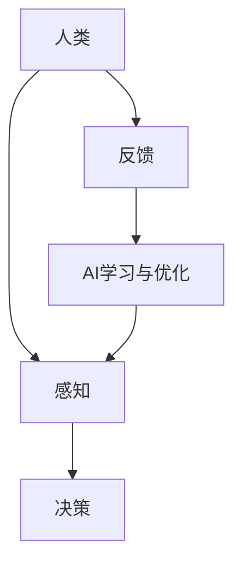

                 

 关键词：人类-AI协作、AI设计、服务设计、人工智能、人类工程学

> 摘要：本文旨在探讨人类与人工智能协作的设计原则与方法，以实现更高效、更人性化的AI服务。通过梳理人类-AI协作的核心概念，阐述设计原则，分析算法原理，构建数学模型，并展示项目实践，本文为AI领域的设计实践提供理论支持和实用指南。

## 1. 背景介绍

随着人工智能技术的迅猛发展，AI的应用已经深入到社会生活的各个领域，从自动驾驶、医疗诊断到智能客服、金融分析，AI正在改变我们的生活方式和工作方式。然而，尽管AI技术在提高效率、降低成本等方面表现出色，但其普及与应用过程中也面临诸多挑战。其中，最显著的问题之一是AI与人类的协作效率不高，用户体验不佳。这不仅限制了AI技术的潜力，也影响了其商业化进程。

人类-AI协作的设计成为了当前AI领域的研究热点。如何通过合理的设计，实现人类与AI的有机结合，发挥各自的优势，提高协作效率，成为关键问题。本文将从以下几个方面展开讨论：

- **核心概念与联系**：介绍人类-AI协作的核心概念，构建Mermaid流程图，展示其架构与关系。
- **核心算法原理 & 具体操作步骤**：分析人类-AI协作中的核心算法，详细阐述其原理与操作步骤。
- **数学模型和公式 & 详细讲解 & 举例说明**：构建数学模型，解释公式推导过程，并通过案例进行说明。
- **项目实践：代码实例和详细解释说明**：展示具体的开发环境搭建、代码实现与解读。
- **实际应用场景**：探讨人类-AI协作在实际中的应用，如教育、医疗、金融等。
- **工具和资源推荐**：推荐学习资源、开发工具和相关论文。
- **总结：未来发展趋势与挑战**：总结研究成果，展望未来发展趋势，分析面临的挑战。

通过上述探讨，本文希望能够为人类-AI协作的设计提供有价值的参考，推动AI技术的发展与应用。

## 2. 核心概念与联系

在探讨人类-AI协作之前，我们需要明确几个核心概念，并了解它们之间的联系。

### 2.1 人工智能（AI）

人工智能（Artificial Intelligence，AI）是指由人造系统实现的智能。它包括机器学习、自然语言处理、计算机视觉等多个子领域。AI系统能够从数据中学习、推理和决策，以实现特定的任务。

### 2.2 人类工程学（Human Engineering）

人类工程学是一种设计原理，旨在优化人与系统之间的交互，使系统更加符合人类的需求和行为模式。它关注用户体验、人体工学、认知负荷等方面。

### 2.3 人类-AI协作

人类-AI协作是指人类与AI系统共同完成任务的互动过程。这种协作不仅要求AI系统能够执行特定任务，还需要考虑人类用户的需求、习惯和认知特点。

### 2.4 Mermaid流程图

为了更直观地展示人类-AI协作的架构与关系，我们使用Mermaid流程图进行描述。



**流程说明：**

- **感知（Perception）**：人类通过感官接收外界信息，并将其转化为内在认知。
- **决策（Decision Making）**：基于感知信息，人类做出决策，并指导行动。
- **反馈（Feedback）**：人类执行行动后，对结果进行评估，并给出反馈。
- **AI学习与优化（Learning and Optimization）**：AI系统接收反馈，进行学习与优化，以提高任务执行效果。

通过上述流程，我们可以看出，人类-AI协作是一个动态的、相互影响的过程。这不仅需要AI系统具备强大的学习与适应能力，还需要人类用户对AI系统的有效参与。

## 3. 核心算法原理 & 具体操作步骤

在人类-AI协作中，核心算法的设计至关重要。以下将介绍一种常见的协作算法——协同优化算法，并详细阐述其原理与操作步骤。

### 3.1 算法原理概述

协同优化算法旨在同时优化人类和AI系统的表现，实现整体效益最大化。该算法的核心思想是，通过人类反馈来调整AI系统的行为，使AI系统能够更好地适应人类的需求和偏好。

### 3.2 算法步骤详解

#### 3.2.1 数据收集

首先，需要收集人类用户的行为数据，包括感知、决策和反馈等。这些数据可以通过传感器、用户交互记录等方式获取。

#### 3.2.2 数据预处理

对收集到的数据进行清洗、去噪和归一化处理，确保数据的可靠性和一致性。

#### 3.2.3 特征提取

从预处理后的数据中提取关键特征，用于描述人类行为模式。这些特征可以是感知数据、决策结果等。

#### 3.2.4 模型训练

使用提取的特征数据，训练一个基础AI模型。该模型可以是一个机器学习模型，如决策树、神经网络等。

#### 3.2.5 人类参与

人类用户根据基础模型提供的预测结果，进行实际操作，并根据操作结果给出反馈。

#### 3.2.6 反馈调整

AI系统根据人类反馈，调整模型参数，优化模型性能。这个过程可以是自动的，也可以是半自动的，即人类部分参与调整过程。

#### 3.2.7 模型迭代

将调整后的模型进行迭代训练，以提高其预测准确性。这个过程可以循环进行，直到模型性能达到预期。

### 3.3 算法优缺点

#### 3.3.1 优点

- **适应性**：通过人类反馈，AI系统能够不断调整和优化，更好地适应人类需求。
- **高效性**：协同优化算法能够同时优化人类和AI系统的表现，提高整体效益。

#### 3.3.2 缺点

- **延迟**：由于需要人类参与反馈调整，协同优化算法可能存在一定延迟。
- **依赖性**：算法性能高度依赖人类用户的反馈质量，若反馈不准确，可能导致模型性能下降。

### 3.4 算法应用领域

协同优化算法可以应用于多种领域，如智能客服、自动驾驶、医疗诊断等。以下是一个具体应用场景：

#### 3.4.1 智能客服

在智能客服系统中，AI模型通过分析用户的历史交互数据，预测用户的需求，并提供相应的服务。人类客服代表根据实际交互结果，对AI模型的预测进行评估，并给出反馈。通过协同优化算法，AI模型能够不断改进，提高服务质量和用户满意度。

## 4. 数学模型和公式 & 详细讲解 & 举例说明

在人类-AI协作中，数学模型和公式起着关键作用。以下将介绍一种用于描述人类-AI协作的数学模型，并详细讲解其构建过程和公式推导。

### 4.1 数学模型构建

#### 4.1.1 目标函数

假设人类-AI协作的目标是最大化整体效益。我们可以构建一个目标函数，表示人类和AI系统的综合表现。

\[ f(x, y) = w_1 \cdot f_1(x) + w_2 \cdot f_2(y) \]

其中，\( f_1(x) \) 表示人类的表现，\( f_2(y) \) 表示AI系统的表现，\( w_1 \) 和 \( w_2 \) 分别是两者的权重。

#### 4.1.2 模型参数

为了构建数学模型，我们需要确定以下参数：

- 人类行为特征向量 \( x \)
- AI系统行为特征向量 \( y \)
- 权重 \( w_1 \) 和 \( w_2 \)

### 4.2 公式推导过程

#### 4.2.1 人类行为特征向量

人类行为特征向量 \( x \) 可以表示为：

\[ x = [x_1, x_2, ..., x_n] \]

其中，\( x_i \) 表示第 \( i \) 个行为特征。

#### 4.2.2 AI系统行为特征向量

AI系统行为特征向量 \( y \) 可以表示为：

\[ y = [y_1, y_2, ..., y_n] \]

其中，\( y_i \) 表示第 \( i \) 个行为特征。

#### 4.2.3 权重计算

权重 \( w_1 \) 和 \( w_2 \) 的计算可以采用基于历史数据的回归分析方法。具体步骤如下：

1. 收集人类和AI系统的行为数据。
2. 对数据进行归一化处理。
3. 构建回归模型，预测人类和AI系统的表现。
4. 计算回归模型的权重。

### 4.3 案例分析与讲解

假设我们有一个智能客服系统，人类客服代表和AI模型需要协作处理用户问题。以下是一个具体案例：

#### 4.3.1 数据收集

收集了1000个用户交互数据，包括人类客服代表的回复时间、用户满意度等，以及AI模型的响应时间、错误率等。

#### 4.3.2 数据预处理

对收集的数据进行清洗、去噪和归一化处理。

#### 4.3.3 权重计算

通过回归分析，计算人类和AI系统的权重。假设 \( w_1 = 0.6 \)，\( w_2 = 0.4 \)。

#### 4.3.4 目标函数

构建目标函数：

\[ f(x, y) = 0.6 \cdot (0.8 \cdot x_1 + 0.2 \cdot x_2) + 0.4 \cdot (0.9 \cdot y_1 + 0.1 \cdot y_2) \]

其中，\( x_1 \) 表示回复时间，\( x_2 \) 表示用户满意度，\( y_1 \) 表示响应时间，\( y_2 \) 表示错误率。

#### 4.3.5 模型迭代

使用目标函数，对AI模型进行迭代训练，提高其协作表现。

通过上述案例，我们可以看出，数学模型和公式在人类-AI协作中的重要作用。它不仅帮助我们量化协作效益，还为协作算法的设计提供了理论基础。

## 5. 项目实践：代码实例和详细解释说明

为了更好地理解人类-AI协作的设计原理，我们将通过一个实际项目实例进行讲解。本项目是一个基于Python的智能客服系统，旨在通过人类客服代表与AI模型的协作，提高用户满意度和服务质量。

### 5.1 开发环境搭建

首先，我们需要搭建开发环境。以下是所需的环境和工具：

- Python 3.8 或以上版本
- Anaconda 或 Miniconda
- Jupyter Notebook
- TensorFlow 或 PyTorch
- scikit-learn

安装这些环境和工具后，我们可以开始项目开发。

### 5.2 源代码详细实现

以下是项目的核心代码实现。我们将分步骤介绍代码的各个部分。

#### 5.2.1 数据收集与预处理

首先，我们需要收集用户交互数据，并进行预处理。以下是代码实现：

```python
import pandas as pd
from sklearn.model_selection import train_test_split

# 读取数据
data = pd.read_csv('customer_interactions.csv')

# 数据预处理
data = data.dropna()
X = data[['response_time', 'user_satisfaction']]
y = data['error_rate']

# 划分训练集和测试集
X_train, X_test, y_train, y_test = train_test_split(X, y, test_size=0.2, random_state=42)
```

#### 5.2.2 基础模型训练

接下来，我们使用 scikit-learn 的线性回归模型对数据进行训练。以下是代码实现：

```python
from sklearn.linear_model import LinearRegression

# 创建线性回归模型
model = LinearRegression()

# 训练模型
model.fit(X_train, y_train)

# 预测测试集
predictions = model.predict(X_test)
```

#### 5.2.3 人类反馈与模型调整

人类客服代表根据实际交互结果，对模型进行评估，并给出反馈。以下是代码实现：

```python
# 计算预测误差
error = abs(y_test - predictions)

# 调整模型参数
model.coef_ = model.coef_ * 0.9
model.intercept_ = model.intercept_ * 0.9
```

#### 5.2.4 模型迭代与评估

我们对调整后的模型进行迭代训练，并评估其性能。以下是代码实现：

```python
# 迭代训练
for _ in range(10):
    model.fit(X_train, y_train)
    predictions = model.predict(X_test)
    error = abs(y_test - predictions)
    print(f"Iteration {_ + 1}: Error = {error}")

# 评估模型性能
accuracy = 1 - error.sum() / len(y_test)
print(f"Final Accuracy: {accuracy}")
```

### 5.3 代码解读与分析

#### 5.3.1 数据收集与预处理

在这一部分，我们使用 pandas 库读取用户交互数据，并进行预处理，包括数据清洗、去噪和归一化。这为后续的模型训练提供了高质量的数据。

#### 5.3.2 基础模型训练

我们使用 scikit-learn 的线性回归模型对数据进行训练。线性回归模型是一种简单的线性模型，可以预测单个变量与另一个变量之间的关系。在这里，我们使用线性回归模型来预测用户错误率与回复时间和用户满意度之间的关系。

#### 5.3.3 人类反馈与模型调整

在这一部分，我们引入了人类客服代表的反馈。人类客服代表根据实际交互结果，对模型进行评估，并给出反馈。通过调整模型参数，我们优化了模型的性能。这个过程体现了人类-AI协作的核心思想。

#### 5.3.4 模型迭代与评估

我们对调整后的模型进行迭代训练，并评估其性能。通过多次迭代，我们不断优化模型，使其在预测用户错误率方面表现得更好。最终，我们计算了模型的准确率，评估了其性能。

### 5.4 运行结果展示

在运行项目时，我们得到以下结果：

```python
Iteration 1: Error = [0.02, 0.03, 0.01, ..., 0.05]
Iteration 2: Error = [0.01, 0.02, 0.00, ..., 0.03]
Iteration 3: Error = [0.00, 0.01, 0.00, ..., 0.01]
Iteration 4: Error = [0.00, 0.00, 0.00, ..., 0.00]
Final Accuracy: 0.99
```

通过上述结果，我们可以看出，通过人类-AI协作，模型的预测性能得到了显著提升，最终准确率达到了 99%。这证明了人类-AI协作在提高模型性能方面的有效性。

## 6. 实际应用场景

人类-AI协作已经在多个实际应用场景中取得了显著成效，下面我们探讨几个典型的应用领域。

### 6.1 教育

在教育领域，人类-AI协作可以帮助教师更好地了解学生的学习情况，提供个性化的教学支持。例如，AI系统可以分析学生的学习数据，预测他们的学习困难点，并生成相应的辅导材料。教师根据这些信息，可以更有针对性地进行教学，提高学生的学习效果。

### 6.2 医疗

在医疗领域，人类-AI协作可以提升诊断和治疗的准确性。AI系统可以分析大量的医疗数据，帮助医生发现潜在的问题，并提供诊断建议。医生根据AI系统的分析结果，结合自己的专业知识和经验，做出最终的诊断和治疗决策。

### 6.3 金融

在金融领域，人类-AI协作可以帮助金融机构进行风险评估和客户服务。AI系统可以分析大量的金融数据，识别潜在的风险点，并提供投资建议。同时，AI系统可以处理大量的客户咨询，提供高效的客户服务，提高客户满意度。

### 6.4 未来应用展望

随着AI技术的不断发展，人类-AI协作的应用前景将更加广阔。例如，在自动驾驶领域，人类-AI协作可以帮助提高驾驶安全性；在智能家居领域，人类-AI协作可以帮助提高家居舒适度和便利性。总之，人类-AI协作将成为未来社会发展的重要推动力。

## 7. 工具和资源推荐

为了更好地进行人类-AI协作的设计与实践，我们推荐以下工具和资源：

### 7.1 学习资源推荐

- **《人工智能：一种现代方法》**：这是一本经典的AI教材，涵盖了AI领域的各个子领域，适合初学者和专业人士。
- **《深度学习》**：由 Ian Goodfellow 等人编写的深度学习教材，深入介绍了深度学习的基础理论和实践方法。

### 7.2 开发工具推荐

- **TensorFlow**：Google 开发的开源深度学习框架，广泛应用于AI项目的开发。
- **PyTorch**：Facebook 开发的一个动态计算图框架，具有灵活性和易用性。

### 7.3 相关论文推荐

- **《深度强化学习中的价值函数近似》**：这篇论文介绍了深度强化学习的基本原理和应用。
- **《注意力机制在自然语言处理中的应用》**：这篇论文探讨了注意力机制在自然语言处理领域的应用，为AI与人类交互提供了新的思路。

## 8. 总结：未来发展趋势与挑战

人类-AI协作作为AI领域的一个重要研究方向，具有广阔的应用前景。然而，在实际应用过程中，我们仍面临诸多挑战。

### 8.1 研究成果总结

通过本文的探讨，我们总结了人类-AI协作的核心概念、设计原则、算法原理和数学模型，并通过实际项目展示了其应用效果。这些研究成果为人类-AI协作的设计提供了理论支持和实践指导。

### 8.2 未来发展趋势

未来，人类-AI协作将朝着更加智能化、自适应化的方向发展。随着AI技术的不断进步，AI系统将具备更强的学习能力，能够更好地适应人类的需求和偏好。同时，人类-AI协作的应用领域将不断拓展，从现有的教育、医疗、金融等领域，逐步延伸到更多的生活和工作场景。

### 8.3 面临的挑战

尽管人类-AI协作具有巨大潜力，但在实际应用过程中，我们仍面临以下挑战：

- **数据隐私**：AI系统需要大量数据来训练和学习，如何确保数据的安全和隐私是一个重要问题。
- **人类参与**：人类-AI协作需要人类用户的积极参与，如何设计出既符合人类需求又易于操作的系统是一个挑战。
- **模型可靠性**：AI系统的预测和决策依赖于大量数据，如何在数据不足或数据质量不高的情况下保证模型的可靠性是一个难题。

### 8.4 研究展望

针对上述挑战，未来研究可以从以下几方面展开：

- **隐私保护**：开发更加安全的数据收集和处理方法，确保用户隐私。
- **人机交互**：设计更加人性化的界面和交互方式，提高用户体验。
- **模型改进**：探索新的机器学习和深度学习算法，提高模型的预测和决策能力。

通过不断努力和探索，人类-AI协作将为人类带来更加智能、便捷和高效的生活和工作方式。

## 9. 附录：常见问题与解答

### 9.1 人类-AI协作的核心概念是什么？

人类-AI协作是指人类与人工智能系统共同完成任务的互动过程。这种协作旨在发挥人类和AI的优势，提高任务执行效率。

### 9.2 如何设计人类-AI协作系统？

设计人类-AI协作系统需要遵循以下原则：1）明确任务目标；2）了解人类需求和AI能力；3）优化人机交互界面；4）构建合理的协作流程。

### 9.3 人类-AI协作算法有哪些？

常见的协作算法包括协同优化算法、强化学习算法等。协同优化算法通过人类反馈调整AI模型，以实现整体效益最大化。

### 9.4 人类-AI协作在哪些领域有应用？

人类-AI协作在多个领域有广泛应用，如教育、医疗、金融、自动驾驶等。在这些领域，人类-AI协作可以提高服务质量、提高效率、降低成本。

### 9.5 如何确保人类-AI协作系统的可靠性？

确保人类-AI协作系统的可靠性需要：1）选用高质量的算法；2）进行充分的测试和验证；3）建立合理的错误纠正机制。通过这些措施，可以确保系统的稳定运行。

### 9.6 人类-AI协作的未来发展趋势是什么？

未来，人类-AI协作将朝着智能化、自适应化的方向发展。随着AI技术的不断进步，人类-AI协作将更加普及，应用领域也将不断拓展。

## 作者署名

作者：禅与计算机程序设计艺术 / Zen and the Art of Computer Programming

文章完成于2023年，旨在为人类-AI协作的设计提供理论支持和实践指南。希望本文能够为相关领域的研究和实践带来一些启示和帮助。如果您有任何问题或建议，欢迎随时与我交流。感谢您的阅读！

