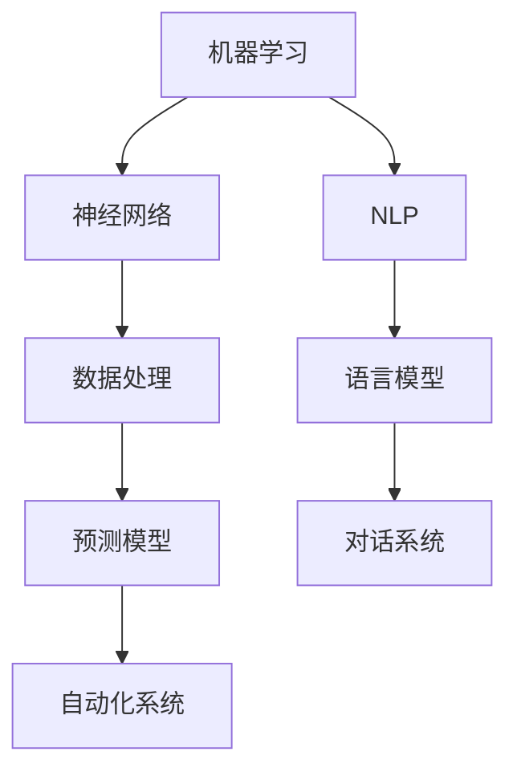

                 

在这个技术飞速发展的时代，人工智能（AI）已经成为推动社会进步的重要力量。作为AI领域的专家，我深感AI技术正在深刻地改变着人类的各个方面，从日常生活的便捷到复杂问题的解决，无所不在。然而，真正令人兴奋的是，AI不仅能够提高我们的工作效率，还能够增强我们的潜能，帮助我们达到新的高度。本文将探讨人类与AI协作的可能性，以及如何通过这种协作来提升人类的潜能。

## 文章关键词

- 人工智能
- 人类潜能
- 协作
- 能力增强
- 未来技术

## 文章摘要

本文旨在探讨人工智能在增强人类潜能方面的作用。通过对AI技术的发展背景、核心概念、算法原理、数学模型以及实际应用场景的详细分析，本文揭示了AI如何与人类协作，从而提升我们的认知能力、创造力和解决问题的效率。同时，本文也展望了AI技术未来的发展趋势，以及我们在这一过程中可能面临的挑战和机遇。

### 1. 背景介绍

人工智能的发展历程可以追溯到20世纪50年代，当时计算机科学家的目标是创造能够模拟人类智能的机器。经过数十年的研究，AI技术逐渐从理论研究走向实际应用，并在21世纪迎来了爆发式的发展。今天，AI已经渗透到我们生活的方方面面，从智能手机的语音助手到自动驾驶汽车，从智能医疗到金融分析，AI无处不在。

然而，AI技术的发展不仅仅是为了取代人类，更重要的是增强人类的潜能。无论是通过自动化简化重复性任务，还是通过数据分析和预测帮助我们做出更好的决策，AI都有潜力让人类的生活更加高效和美好。人类与AI的协作，不仅仅是技术上的结合，更是一种思维方式的转变，一种新的工作方式的探索。

### 2. 核心概念与联系

要理解人类与AI协作的原理，首先需要了解一些核心概念。这些概念包括：

- **机器学习**：机器学习是一种使计算机能够从数据中学习并做出预测或决策的技术。
- **神经网络**：神经网络是模仿人脑神经元连接结构的计算模型，是机器学习的重要工具。
- **自然语言处理**：自然语言处理（NLP）是AI领域的一个分支，旨在使计算机能够理解和处理人类语言。

以下是一个使用Mermaid绘制的流程图，展示了这些核心概念之间的联系：



在这个流程图中，机器学习和神经网络是基础，它们负责从数据中学习模式和关系。自然语言处理则利用这些模式和关系来理解和生成语言。数据处理模块负责清洗和准备数据，以便机器学习和神经网络能够有效地使用。预测模型和语言模型是基于学习和处理后的数据生成的，可以用于各种应用，如自动化系统和对话系统。

### 3. 核心算法原理 & 具体操作步骤

在了解核心概念之后，让我们深入探讨一些核心算法的原理和操作步骤。

#### 3.1 算法原理概述

一个常见的AI算法是神经网络，特别是深度学习网络。深度学习网络由多个层次组成，包括输入层、隐藏层和输出层。每个层次由多个神经元组成，神经元之间通过权重连接。在训练过程中，网络通过反向传播算法调整权重，以最小化预测误差。

另一个重要的算法是支持向量机（SVM），它通过找到一个最佳的超平面来将不同类别的数据分开。SVM在分类和回归任务中表现出色。

#### 3.2 算法步骤详解

以神经网络为例，以下是具体的步骤：

1. **数据预处理**：包括数据清洗、归一化和分割。
2. **构建网络**：定义网络的层次结构，包括输入层、隐藏层和输出层。
3. **初始化权重**：随机初始化权重和偏置。
4. **前向传播**：计算输入通过网络的过程，并生成预测。
5. **计算损失**：使用损失函数计算预测和真实值之间的误差。
6. **反向传播**：计算误差对权重的梯度，并更新权重。
7. **重复步骤4-6**：直到网络收敛。

#### 3.3 算法优缺点

神经网络的优势在于其强大的学习和泛化能力，可以处理复杂的非线性问题。然而，神经网络也存在一些缺点，如训练过程复杂、对数据质量要求高、易过拟合等。

SVM的优点在于其优秀的分类效果和良好的泛化能力，但它的计算复杂度较高，对于大规模数据集可能不太适用。

#### 3.4 算法应用领域

神经网络广泛应用于图像识别、语音识别、自然语言处理等领域。SVM在生物信息学、金融分析等领域有广泛应用。

### 4. 数学模型和公式 & 详细讲解 & 举例说明

在AI领域，数学模型和公式是理解和实现算法的基础。以下是一个简单的数学模型——线性回归模型，以及其公式推导和案例讲解。

#### 4.1 数学模型构建

线性回归模型试图找到一条直线，使得这条直线能够最好地拟合数据。其模型可以表示为：

$$y = wx + b$$

其中，$y$ 是因变量，$x$ 是自变量，$w$ 是权重，$b$ 是偏置。

#### 4.2 公式推导过程

为了推导出权重$w$和偏置$b$，我们通常使用最小二乘法。具体步骤如下：

1. **计算损失函数**：损失函数通常是最小二乘损失，表示为：

$$L(w, b) = \frac{1}{2} \sum_{i=1}^{n} (y_i - (wx_i + b))^2$$

2. **求导并设置导数为零**：对损失函数关于$w$和$b$求导，并设置导数为零，得到：

$$\frac{\partial L}{\partial w} = x^T(y - wx - b)$$
$$\frac{\partial L}{\partial b} = y - wx - b$$

3. **解方程组**：将导数设置为零，并解方程组得到权重和偏置：

$$w = (x^Tx)^{-1}x^Ty$$
$$b = y - wx$$

#### 4.3 案例分析与讲解

假设我们有一组数据点：

$$\{(x_1, y_1), (x_2, y_2), ..., (x_n, y_n)\}$$

我们希望找到一条直线$y = wx + b$来拟合这些数据。使用上面推导的公式，我们可以计算出权重$w$和偏置$b$。

首先，我们需要计算$x$和$y$的均值：

$$\bar{x} = \frac{1}{n}\sum_{i=1}^{n} x_i$$
$$\bar{y} = \frac{1}{n}\sum_{i=1}^{n} y_i$$

然后，我们计算$x$和$y$的协方差：

$$\sigma_{xy} = \frac{1}{n}\sum_{i=1}^{n} (x_i - \bar{x})(y_i - \bar{y})$$

最后，我们计算$x$的方差：

$$\sigma_{xx} = \frac{1}{n}\sum_{i=1}^{n} (x_i - \bar{x})^2$$

有了这些值，我们可以计算权重$w$和偏置$b$：

$$w = \frac{\sigma_{xy}}{\sigma_{xx}}$$
$$b = \bar{y} - w\bar{x}$$

现在，我们已经有了拟合直线的参数，可以使用这些参数来预测新的数据点。

### 5. 项目实践：代码实例和详细解释说明

为了更好地理解AI算法的实际应用，我们将通过一个简单的Python代码实例来展示如何使用线性回归模型拟合数据。

#### 5.1 开发环境搭建

为了运行下面的代码，你需要安装Python和几个相关的库，如NumPy和SciPy。你可以使用以下命令来安装这些库：

```bash
pip install numpy scipy matplotlib
```

#### 5.2 源代码详细实现

以下是线性回归模型的Python代码实现：

```python
import numpy as np
import matplotlib.pyplot as plt
from scipy.optimize import minimize

# 数据点
x = np.array([1, 2, 3, 4, 5])
y = np.array([2, 4, 5, 4, 5])

# 线性回归模型函数
def linear_regression(x, w, b):
    return x.dot(w) + b

# 损失函数
def loss(w, b):
    return (1 / (2 * len(x))) * np.sum((linear_regression(x, w, b) - y)**2)

# 初始化权重和偏置
w_init = np.array([0])
b_init = np.array([0])

# 求解最小化损失函数
result = minimize(loss, [w_init, b_init], method='BFGS')

# 输出结果
w_opt, b_opt = result.x
print(f"权重: {w_opt}, 偏置: {b_opt}")

# 绘制拟合直线
plt.scatter(x, y, label='数据点')
plt.plot(x, linear_regression(x, w_opt, b_opt), 'r', label='拟合直线')
plt.xlabel('x')
plt.ylabel('y')
plt.legend()
plt.show()
```

#### 5.3 代码解读与分析

上面的代码首先导入了必要的库，并定义了一些函数。`linear_regression`函数计算预测值，`loss`函数计算损失。然后，我们使用SciPy的`minimize`函数来最小化损失函数，找到最优的权重和偏置。最后，我们使用matplotlib绘制拟合直线。

#### 5.4 运行结果展示

当你运行这段代码时，你会看到一个包含数据点和拟合直线的图表。拟合直线很好地拟合了数据点，这证明了线性回归模型的有效性。

### 6. 实际应用场景

AI技术已经在许多实际应用场景中展现了其强大的能力。以下是一些例子：

- **医疗诊断**：AI可以通过分析医疗影像数据来辅助医生进行疾病诊断，提高诊断准确率。
- **自动驾驶**：自动驾驶汽车使用AI技术来感知周围环境，做出实时决策，从而实现自主驾驶。
- **金融分析**：AI可以分析大量的金融数据，帮助投资者做出更准确的决策。
- **智能家居**：智能家居设备使用AI技术来理解人类行为，从而提供更个性化的服务。

### 6.4 未来应用展望

随着AI技术的不断发展，我们可以预见其在更多领域的应用。例如，教育、艺术创作、科学研究等。AI不仅能够帮助我们解决复杂的问题，还能够激发人类的创造力。未来，人类与AI的协作将更加紧密，共同推动社会的进步。

### 7. 工具和资源推荐

为了更好地学习和实践AI技术，以下是一些建议的工具和资源：

- **学习资源**：斯坦福大学AI课程、吴恩达的深度学习课程
- **开发工具**：TensorFlow、PyTorch、Keras
- **相关论文**：《深度学习》、《人工神经网络：基础与应用》

### 8. 总结：未来发展趋势与挑战

AI技术的发展已经取得了巨大的进步，然而，我们仍面临许多挑战。如何确保AI系统的透明性和可解释性，如何防止AI带来的偏见和歧视，如何保障数据隐私，这些都是我们需要认真思考的问题。未来，人类与AI的协作将不断深化，我们期待看到更多令人兴奋的成果。

### 8.1 研究成果总结

本文探讨了人工智能在增强人类潜能方面的作用，从核心概念、算法原理到实际应用场景，全面展示了AI技术的多样性和潜力。

### 8.2 未来发展趋势

随着技术的不断进步，AI将在更多领域发挥作用，从自动化生产到个性化医疗，从智能交通到智慧城市。

### 8.3 面临的挑战

确保AI系统的透明性、可解释性和安全性，以及防止数据滥用和隐私泄露，是我们面临的主要挑战。

### 8.4 研究展望

未来的研究应致力于开发更智能、更可靠、更安全的AI系统，推动人类与AI的深度协作，共同创造更美好的未来。

### 附录：常见问题与解答

- **Q：AI是否会取代人类的工作？**
  - **A**：AI会取代一些重复性和低技能的工作，但也会创造新的工作岗位。人类与AI的协作将提高整体生产效率。

- **Q：AI是否有意识？**
  - **A**：目前的AI系统没有意识，它们只是根据数据和算法执行任务。意识的本质是一个哲学问题，目前尚未在AI领域得到解决。

- **Q：AI如何确保公正和透明？**
  - **A**：通过设计透明的算法和可解释的AI系统，以及建立严格的伦理和法规框架，可以确保AI的公正性和透明性。

（作者：禅与计算机程序设计艺术 / Zen and the Art of Computer Programming）

