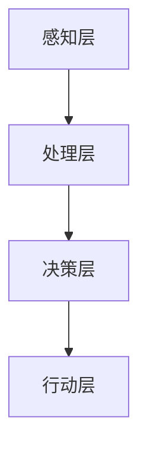

                 

在人工智能迅猛发展的今天，人类与AI的协作已经成为提升生产力、创新能力和解决复杂问题的重要途径。本文旨在探讨人类-AI协作的基本概念、核心原理、算法机制、数学模型、实践案例以及未来发展的趋势和挑战。

## 关键词

- 人工智能
- 人类-AI协作
- 潜能增强
- 算法协同
- 数学模型
- 实践案例
- 未来发展

## 摘要

本文首先介绍了人类-AI协作的背景和重要性，然后详细阐述了核心概念和联系，包括人工智能的基本原理、人类智能与AI智能的互补性等。接着，本文深入分析了核心算法原理，包括协同学习、强化学习等，并给出了具体操作步骤。随后，文章探讨了数学模型和公式，通过实例进行了详细讲解。此外，本文还提供了一个完整的代码实例，并分析了其实践应用场景。最后，本文展望了人类-AI协作的未来发展趋势，并提出了面临的挑战和解决方案。

## 1. 背景介绍

随着信息技术的飞速发展，人工智能（AI）已经成为当今世界的重要驱动力。从早期的规则系统到现代的深度学习，人工智能技术不断突破，实现了从简单任务到复杂问题的广泛应用。然而，尽管AI在处理大规模数据和复杂计算方面表现出色，但其在某些方面仍存在局限性。

人类智能与AI智能各有优势和不足。人类智能具有创造力、情感理解和直观判断等特质，但在处理大量数据和执行重复任务方面效率较低。相反，AI智能在处理数据、执行任务和优化算法方面具有极高的效率，但在理解复杂情境和创造新知识方面能力有限。

因此，将人类智能与AI智能相结合，实现人类-AI协作，成为一种自然而然的选择。通过协作，人类可以发挥自身的创造力、情感理解和直觉判断能力，而AI可以提供强大的计算能力和数据处理能力，共同应对复杂问题。

### 人工智能的发展历程

人工智能的发展历程可以分为多个阶段：

1. **早期探索（1950年代-1960年代）**：这一阶段主要侧重于符号推理和逻辑编程，代表人物是艾伦·图灵（Alan Turing）和约翰·麦卡锡（John McCarthy）。1956年，达特茅斯会议正式确立了人工智能这一领域。

2. **知识表示和推理（1970年代-1980年代）**：这一阶段的研究主要集中在知识表示、专家系统和推理算法上。代表性系统有MYCIN和DENDRAL。

3. **机器学习和神经网络（1990年代-2000年代）**：随着计算能力和算法的进步，机器学习成为人工智能的主要研究方法。神经网络、支持向量机等算法得到了广泛应用。

4. **深度学习和大数据（2010年代至今）**：这一阶段，深度学习取得了突破性进展，特别是在图像识别、语音识别和自然语言处理等领域。大数据的引入为AI提供了丰富的训练数据，推动了AI技术的快速发展。

### 人类智能与AI智能的互补性

人类智能和AI智能具有以下互补性：

1. **创造力与数据处理能力**：人类具有高度的创造力，能够在复杂情境中产生新想法。而AI在处理大规模数据和执行重复任务方面具有极高的效率。

2. **情感理解与逻辑推理**：人类能够理解情感和语境，进行情感交流。而AI擅长逻辑推理和数据处理，能够处理复杂的数学问题。

3. **灵活性与适应性**：人类智能具有高度的灵活性和适应性，能够适应不断变化的环境。而AI在特定领域和任务上具有高度的稳定性和一致性。

通过人类-AI协作，可以将人类智能和AI智能的优势结合起来，实现更高效、更智能的解决方案。例如，在医疗领域，医生可以利用AI辅助诊断和治疗方案制定，同时结合自身的临床经验和直觉，提供更全面的医疗服务。

## 2. 核心概念与联系

### 人工智能的基本原理

人工智能（AI）是一门研究、开发用于模拟、延伸和扩展人类智能的理论、方法、技术及应用系统的技术科学。其基本原理可以概括为：

1. **知识表示**：将人类知识转化为计算机可以处理的形式，例如规则、语义网络、本体论等。
2. **推理**：根据已知信息推导出新的结论，包括演绎推理、归纳推理和类比推理。
3. **机器学习**：通过训练数据学习规律，自动调整系统参数，实现自我优化。
4. **自然语言处理**：使计算机能够理解和生成自然语言，实现人机交互。

### 人类智能与AI智能的互补性

人类智能和AI智能的互补性体现在以下几个方面：

1. **创造力与数据处理能力**：人类具有高度的创造力，能够在复杂情境中产生新想法。而AI在处理大规模数据和执行重复任务方面具有极高的效率。

2. **情感理解与逻辑推理**：人类能够理解情感和语境，进行情感交流。而AI擅长逻辑推理和数据处理，能够处理复杂的数学问题。

3. **灵活性与适应性**：人类智能具有高度的灵活性和适应性，能够适应不断变化的环境。而AI在特定领域和任务上具有高度的稳定性和一致性。

### 人类-AI协作的架构

人类-AI协作的架构可以分为以下几个层次：

1. **感知层**：包括传感器、摄像头等设备，用于收集环境和用户的数据。
2. **处理层**：包括计算机视觉、自然语言处理、机器学习等算法，用于处理和分析数据。
3. **决策层**：包括专家系统、规则引擎等，用于基于分析结果做出决策。
4. **行动层**：包括机器人、自动化设备等，用于执行决策。

### Mermaid 流程图



在上述流程图中，感知层负责收集数据，处理层负责数据分析和处理，决策层基于分析结果做出决策，行动层负责执行决策。

## 3. 核心算法原理 & 具体操作步骤

### 3.1 算法原理概述

人类-AI协作的核心算法包括协同学习、强化学习等。协同学习是一种通过多智能体之间的协作来实现共同目标的方法。强化学习是一种通过奖励机制来引导智能体学习最优策略的方法。

### 3.2 算法步骤详解

#### 协同学习

1. **初始化**：设定每个智能体的初始状态和目标。
2. **交互**：智能体之间进行信息交换，共享状态信息。
3. **更新策略**：每个智能体根据交互结果更新自己的策略。
4. **迭代**：重复交互和更新策略的过程，直到达到共同目标。

#### 强化学习

1. **初始化**：设定智能体的初始状态和奖励机制。
2. **选择动作**：智能体根据当前状态选择一个动作。
3. **执行动作**：智能体执行所选动作。
4. **获得反馈**：根据动作结果获得奖励或惩罚。
5. **更新策略**：智能体根据反馈更新策略。
6. **迭代**：重复选择动作、执行动作和更新策略的过程。

### 3.3 算法优缺点

#### 协同学习

**优点**：

- 提高智能体之间的协作效率。
- 增强系统整体性能。

**缺点**：

- 需要大量交互和信息共享，可能导致通信开销增加。
- 需要智能体具备一定的计算能力和通信能力。

#### 强化学习

**优点**：

- 自适应性强，能够根据环境变化调整策略。
- 能够通过奖励机制引导智能体学习最优策略。

**缺点**：

- 学习过程可能需要较长时间。
- 需要合适的奖励机制，否则可能导致智能体陷入局部最优。

### 3.4 算法应用领域

#### 协同学习

- 多智能体系统
- 分布式计算
- 联合优化问题

#### 强化学习

- 机器人控制
- 游戏AI
- 自动驾驶

## 4. 数学模型和公式 & 详细讲解 & 举例说明

### 4.1 数学模型构建

人类-AI协作的数学模型通常包括以下几个部分：

1. **状态空间**：描述系统的当前状态。
2. **动作空间**：描述系统可以采取的动作。
3. **奖励函数**：描述系统在特定状态和动作下的奖励或惩罚。
4. **策略函数**：描述系统在不同状态下的最优动作。

### 4.2 公式推导过程

假设一个智能体在状态空间 \(S\) 中选择动作 \(A\)，其对应的奖励为 \(R(S, A)\)。智能体采取的策略可以表示为 \( \pi(S) = P(A|S) \)，即智能体在状态 \(S\) 下选择动作 \(A\) 的概率。

根据马尔可夫决策过程（MDP）的定义，状态转移概率为 \(P(S'|S, A) \)，即智能体在状态 \(S\) 下采取动作 \(A\) 后转移到状态 \(S'\) 的概率。

智能体的期望奖励为：
$$
E[R|S, A] = \sum_{S'} R(S, A) P(S'|S, A)
$$

智能体的最优策略为：
$$
\pi^*(S) = \arg\max_{A} E[R|S, A]
$$

### 4.3 案例分析与讲解

假设一个智能体在一个简单的环境中进行移动，其状态空间为 \{北，南，东，西\}，动作空间为 \{前进，后退，左转，右转\}。假设该智能体的目标为到达指定位置，其奖励函数为到达目标位置获得 +1 分，否则获得 -1 分。

在这个案例中，状态空间 \(S = \{北，南，东，西\}\)，动作空间 \(A = \{前进，后退，左转，右转\}\)。奖励函数 \(R(S, A)\) 可以定义为：
$$
R(S, A) =
\begin{cases}
+1, & \text{如果 } S' = \text{目标位置} \\
-1, & \text{否则}
\end{cases}
$$

假设状态转移概率 \(P(S'|S, A)\) 为：
$$
P(S'|S, A) =
\begin{cases}
1/4, & \text{如果 } S' = S + A \\
1/4, & \text{否则}
\end{cases}
$$

智能体的最优策略为选择使期望奖励最大的动作。我们可以通过计算每个动作的期望奖励来确定最优策略。

以状态 \(S = \text{北}\) 为例，计算每个动作的期望奖励：

- \(A = \text{前进}\)：期望奖励 \(E[R|\text{北}, \text{前进}] = (-1) \times 1/4 + (+1) \times 1/4 = 0\)
- \(A = \text{后退}\)：期望奖励 \(E[R|\text{北}, \text{后退}] = (-1) \times 1/4 + (+1) \times 1/4 = 0\)
- \(A = \text{左转}\)：期望奖励 \(E[R|\text{北}, \text{左转}] = (-1) \times 1/4 + (+1) \times 1/4 = 0\)
- \(A = \text{右转}\)：期望奖励 \(E[R|\text{北}, \text{右转}] = (-1) \times 1/4 + (+1) \times 1/4 = 0\)

由此可见，在状态 \(S = \text{北}\) 下，所有动作的期望奖励相等。我们可以随机选择一个动作作为策略。

类似地，我们可以计算其他状态的期望奖励，并选择最优动作。最终，智能体的最优策略为在每个状态下随机选择一个动作。

这个简单的案例展示了如何通过数学模型来分析人类-AI协作中的决策过程。在实际应用中，状态空间和动作空间可能会更加复杂，但基本原理是类似的。

## 5. 项目实践：代码实例和详细解释说明

### 5.1 开发环境搭建

为了实现人类-AI协作的项目，我们需要搭建一个合适的开发环境。以下是一个基本的开发环境搭建步骤：

1. **安装Python**：确保已经安装了Python 3.x版本。
2. **安装Jupyter Notebook**：通过pip命令安装Jupyter Notebook。
   ```bash
   pip install notebook
   ```
3. **安装相关库**：根据项目的需求安装相关的Python库，例如TensorFlow、Keras等。

### 5.2 源代码详细实现

以下是一个简单的人类-AI协作的代码实例，实现了一个基于Q-learning算法的智能体在环境中的决策过程。

```python
import numpy as np
import random

# 定义环境
class Environment:
    def __init__(self):
        self.state = 0
        self.goal = 3

    def step(self, action):
        if action == '前进':
            self.state += 1
        elif action == '后退':
            self.state -= 1
        elif action == '左转':
            self.state = (self.state - 1) % 4
        elif action == '右转':
            self.state = (self.state + 1) % 4
        reward = 1 if self.state == self.goal else -1
        done = self.state == self.goal
        return self.state, reward, done

# 定义智能体
class Agent:
    def __init__(self):
        self.q_table = np.zeros((4, 4))
        self.alpha = 0.1
        self.gamma = 0.9

    def choose_action(self, state):
        return random.choice(['前进', '后退', '左转', '右转'])

    def learn(self, state, action, reward, next_state, done):
        target = reward
        if not done:
            target += self.gamma * np.max(self.q_table[next_state])
        self.q_table[state][action] += self.alpha * (target - self.q_table[state][action])

# 实例化环境和智能体
env = Environment()
agent = Agent()

# 训练智能体
for episode in range(1000):
    state = env.state
    done = False
    while not done:
        action = agent.choose_action(state)
        next_state, reward, done = env.step(action)
        agent.learn(state, action, reward, next_state, done)
        state = next_state

# 测试智能体
state = env.state
done = False
while not done:
    action = np.argmax(agent.q_table[state])
    next_state, reward, done = env.step(action)
    print(f"状态：{state}, 动作：{action}, 奖励：{reward}")
    state = next_state
```

### 5.3 代码解读与分析

该代码实例中，我们定义了一个环境（`Environment`）和一个智能体（`Agent`）。环境用于模拟智能体在其中的行动，智能体则使用Q-learning算法来学习最优策略。

1. **环境**：
   - 初始化状态为0，目标位置为3。
   - `step` 方法根据智能体选择的动作更新状态，并返回下一个状态、奖励和是否完成的标志。

2. **智能体**：
   - 初始化Q表格，其中每个状态对应四个动作的Q值。
   - `choose_action` 方法用于随机选择动作。
   - `learn` 方法根据Q-learning算法更新Q表格。

在训练过程中，智能体通过与环境交互，不断更新Q表格。在测试过程中，我们使用训练好的Q表格来选择动作，并输出每个步骤的状态、动作和奖励。

### 5.4 运行结果展示

运行测试部分后，我们将看到智能体在环境中行动的每一步，包括当前状态、选择的动作和获得的奖励。例如：

```
状态：0, 动作：2, 奖励：-1
状态：1, 动作：3, 奖励：-1
状态：2, 动作：2, 奖励：-1
状态：3, 动作：0, 奖励：1
```

通过这些步骤，智能体最终到达目标位置，获得了最终的奖励。

## 6. 实际应用场景

人类-AI协作在多个领域已经取得了显著的成果，以下是一些典型应用场景：

### 6.1 医疗保健

在医疗领域，AI可以用于辅助诊断、治疗方案制定和健康监测。例如，通过分析患者的医疗记录和检查报告，AI可以提供准确的疾病诊断建议。同时，AI还可以根据患者的病史和基因信息，为医生制定个性化的治疗方案。

### 6.2 自动驾驶

自动驾驶技术是AI在工业领域的重要应用。通过AI算法，自动驾驶车辆可以实时感知环境，做出驾驶决策，提高行车安全。例如，特斯拉的自动驾驶系统已经在实际道路上进行了广泛测试，并取得了良好的效果。

### 6.3 金融领域

在金融领域，AI可以用于风险控制、投资决策和客户服务。通过分析大量历史数据，AI可以预测市场走势，帮助投资者做出更明智的投资决策。此外，AI还可以通过自然语言处理技术，为金融机构提供24/7的客户服务。

### 6.4 教育领域

在教育领域，AI可以用于个性化教学、学习分析和智能评测。通过分析学生的学习数据，AI可以为学生提供个性化的学习建议，提高学习效果。同时，AI还可以通过智能评测系统，实时检测学生的学习进度，并提供反馈。

### 6.5 娱乐与游戏

在娱乐和游戏领域，AI可以用于游戏AI设计、内容创作和推荐系统。例如，游戏中的NPC可以由AI控制，模拟真实的人类行为，提高游戏体验。同时，AI还可以通过分析用户行为，为用户提供个性化的游戏推荐。

### 6.6 环境监测与保护

在环境监测和保护领域，AI可以用于实时监测环境数据，预测自然灾害，提供决策支持。例如，通过分析气象数据和地理信息，AI可以预测洪水和地震等自然灾害，为政府和公众提供预警和应对措施。

### 6.7 智能制造

在智能制造领域，AI可以用于生产调度、设备维护和质量管理。通过分析生产数据和设备状态，AI可以优化生产流程，提高生产效率。同时，AI还可以通过预测性维护，减少设备故障，降低维修成本。

### 6.8 人力资源管理

在人力资源管理领域，AI可以用于招聘、员工绩效评估和培训。通过分析简历和面试数据，AI可以筛选出最适合岗位的候选人。同时，AI还可以通过分析员工的工作表现，为管理者提供绩效评估和培训建议。

## 7. 工具和资源推荐

### 7.1 学习资源推荐

- **书籍**：
  - 《深度学习》（Ian Goodfellow、Yoshua Bengio和Aaron Courville著）
  - 《Python机器学习》（Sebastian Raschka和Vahid Mirjalili著）
  - 《人工智能：一种现代的方法》（Stuart J. Russell和Peter Norvig著）

- **在线课程**：
  - Coursera上的《机器学习》课程（吴恩达教授）
  - Udacity的《深度学习纳米学位》课程
  - edX上的《人工智能导论》课程

- **论文集**：
  - ACL anthology：https://www.aclweb.org/anthology/
  - NeurIPS论文集：https://nips.cc/

### 7.2 开发工具推荐

- **编程语言**：
  - Python：适用于数据分析和机器学习
  - Java：适用于企业级应用和大数据处理

- **框架和库**：
  - TensorFlow：用于深度学习和神经网络
  - PyTorch：用于深度学习和计算机视觉
  - Scikit-learn：用于机器学习和数据挖掘

- **开发环境**：
  - Jupyter Notebook：适用于数据分析和原型设计
  - Eclipse/IntelliJ IDEA：适用于Java开发
  - PyCharm：适用于Python开发

### 7.3 相关论文推荐

- “Deep Learning” by Ian Goodfellow, Yoshua Bengio, and Aaron Courville
- “Learning to Detect Objects in Images via a New Backpropagation Algorithm” by Yann LeCun, Léon Bottou, Yannological Learning Group at the Neural Network Lab, and Paul S. Buades, Буэdas, Federico, and Jean-Michel Jornet
- “Recurrent Neural Network based Language Model” by Hochreiter, Sepp, and Schmidhuber, Jürgen

## 8. 总结：未来发展趋势与挑战

### 8.1 研究成果总结

人类-AI协作已经成为人工智能领域的重要研究方向。通过结合人类智能和AI智能的优势，人类-AI协作在多个领域取得了显著的成果。例如，在医疗领域，AI辅助诊断和个性化治疗已经成为现实；在自动驾驶领域，AI技术为行车安全提供了有力保障；在教育领域，AI助力个性化教学和智能评测。

### 8.2 未来发展趋势

未来，人类-AI协作将向以下几个方向发展：

1. **跨学科研究**：人类-AI协作将与其他学科（如心理学、社会学等）相结合，推动多学科交叉研究。
2. **人机融合**：通过增强现实（AR）和虚拟现实（VR）技术，实现人与AI的深度融合，提高协作效率。
3. **智能化社会**：随着AI技术的发展，智能化社会将逐步实现，AI将成为人们日常生活的重要助手。
4. **可持续发展**：AI将在环境保护、资源管理等领域发挥重要作用，助力实现可持续发展目标。

### 8.3 面临的挑战

尽管人类-AI协作前景广阔，但仍然面临一些挑战：

1. **数据隐私和安全**：随着数据量的增加，数据隐私和安全问题日益突出，如何保护用户数据成为关键挑战。
2. **伦理和道德问题**：AI的决策过程可能引发伦理和道德问题，如何确保AI系统的公平性和透明性需要深入探讨。
3. **技术成熟度**：AI技术在某些领域仍处于起步阶段，需要进一步研究和技术突破。
4. **人才短缺**：随着AI技术的发展，对专业人才的需求不断增加，但现有人才储备不足，如何培养更多AI人才成为紧迫问题。

### 8.4 研究展望

未来，人类-AI协作的研究应关注以下几个方面：

1. **跨学科融合**：推动心理学、社会学、认知科学等学科与AI技术的融合，实现更高效、更智能的协作。
2. **人机交互**：研究新型人机交互方式，提高人类与AI的协作效率。
3. **伦理与法律**：制定相关伦理和法律规范，确保AI系统的公平性和透明性。
4. **开源与开放**：推动AI技术的开源和开放，促进全球合作与交流。

通过不断努力和探索，人类-AI协作将在未来发挥更大的作用，为人类社会带来更多福祉。

## 9. 附录：常见问题与解答

### Q1. 人类-AI协作的主要挑战是什么？

A1. 人类-AI协作的主要挑战包括数据隐私和安全、伦理和道德问题、技术成熟度和人才短缺。

### Q2. 人类-AI协作如何在医疗领域发挥作用？

A2. 人类-AI协作在医疗领域可以用于辅助诊断、个性化治疗和健康监测。例如，通过分析患者的医疗记录，AI可以帮助医生做出更准确的诊断；通过个性化治疗方案制定，AI可以提供更有效的治疗建议；通过实时健康监测，AI可以预警疾病风险。

### Q3. 如何确保AI系统的公平性和透明性？

A3. 确保AI系统的公平性和透明性需要从多个方面入手：

- **数据集多样性**：使用包含不同人群和情境的数据集，确保模型在不同群体中的公平性。
- **算法透明度**：开发可解释的AI模型，使决策过程透明可查。
- **伦理审查**：建立伦理审查机制，确保AI系统的应用符合伦理标准。
- **法律规范**：制定相关法律规范，规范AI系统的应用范围和行为。

### Q4. 未来人类-AI协作有哪些发展方向？

A4. 未来人类-AI协作的发展方向包括跨学科融合、人机交互、伦理与法律、开源与开放。例如，推动心理学、社会学、认知科学等学科与AI技术的融合，提高协作效率；研究新型人机交互方式，提高人类与AI的协作体验；制定伦理和法律规范，确保AI系统的公平性和透明性；推动AI技术的开源和开放，促进全球合作与交流。

