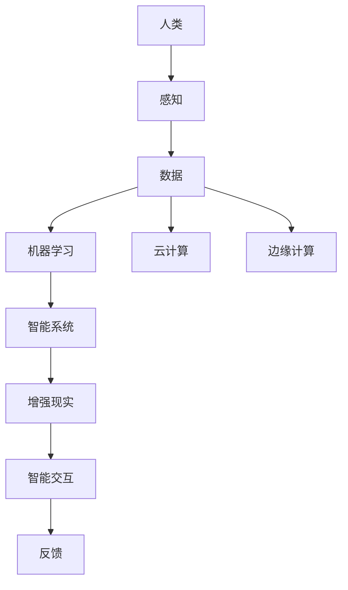

                 

关键词：人类-AI协作、AI能力、增强现实、智能交互、数据挖掘、机器学习、深度学习、云计算、边缘计算、人机协同、智能系统、未来趋势。

> 摘要：本文旨在探讨人类与人工智能（AI）协作的发展趋势，分析AI能力对人类潜能的增强效应，预测未来的机遇与挑战。通过回顾历史背景，介绍核心概念与架构，深入探讨AI算法原理与数学模型，分享项目实践案例，以及推荐相关工具和资源，最终总结出未来发展趋势与面临的挑战。

## 1. 背景介绍

自20世纪50年代人工智能（AI）的概念提出以来，AI领域经历了多次重大突破和发展。从早期的规则系统、知识表示到现代的机器学习、深度学习，AI技术的应用已经深入到各行各业，如医疗、金融、教育、制造等。随着计算能力的提升和数据量的爆炸式增长，AI逐渐从理论研究走向实际应用，成为推动社会进步的重要力量。

在AI的发展历程中，人类与机器的协作模式也在不断演变。从最初的自动化设备到今天的智能系统，人类与AI的关系从单向的命令控制逐渐演变为双向的互动与协作。这种协作模式不仅提升了生产效率，还极大地丰富了人类的生活和工作方式。然而，随着AI能力的增强，人类面临的挑战也日益增多。

本文将探讨人类-AI协作的发展趋势，分析AI能力如何增强人类潜能，预测未来的机遇与挑战，并给出相应的解决方案和展望。

## 2. 核心概念与联系

### 2.1 核心概念

在探讨人类-AI协作之前，我们需要明确一些核心概念。

**人工智能（AI）**：模拟人类智能的技术和系统，能够感知、学习、推理、决策和行动。

**增强现实（AR）**：通过计算机生成虚拟信息叠加到真实世界中，提供增强的感知体验。

**智能交互**：人与机器之间通过自然语言、手势、视觉等多种方式进行的信息交换和互动。

**数据挖掘**：从大量数据中提取有价值的信息和模式的过程。

**机器学习**：一种基于数据的学习方法，通过训练模型从数据中学习规律，然后进行预测或分类。

**深度学习**：一种基于神经网络的机器学习方法，通过多层神经元的抽象表示学习复杂的特征。

**云计算**：通过互联网提供动态可扩展的虚拟化资源，包括存储、计算和处理能力。

**边缘计算**：在靠近数据源的地方进行数据处理，以减少延迟和带宽消耗。

### 2.2 关联架构

为了更好地理解这些概念之间的关系，我们可以用Mermaid流程图展示一个基本的架构。



在这个架构中，人类通过感知获取数据，数据经过机器学习处理后，由智能系统输出结果，这些结果通过增强现实和智能交互反馈给人类，形成一个闭环。同时，数据可以上传到云或边缘计算平台进行进一步处理和分析。

## 3. 核心算法原理 & 具体操作步骤

### 3.1 算法原理概述

AI算法是AI系统的核心，其中深度学习算法尤为重要。深度学习通过多层神经网络模拟人类大脑的学习过程，从而实现复杂的任务。

**深度学习原理**：

1. **输入层**：接收外部输入数据。
2. **隐藏层**：对输入数据进行特征提取和转换。
3. **输出层**：产生预测结果或分类标签。

**训练过程**：

1. **前向传播**：输入数据经过网络传递，每一层产生输出。
2. **损失函数**：计算实际输出与预期输出之间的差距。
3. **反向传播**：调整网络的权重和偏置，减少损失函数。

### 3.2 算法步骤详解

**步骤1：数据预处理**

- **数据清洗**：去除噪音和缺失值。
- **数据归一化**：将数据缩放到相同的范围。

**步骤2：网络架构设计**

- **确定输入层、隐藏层和输出层的神经元数量**。
- **选择激活函数**：如ReLU、Sigmoid、Tanh等。

**步骤3：训练模型**

- **初始化权重和偏置**。
- **前向传播**：计算网络输出。
- **计算损失**：使用损失函数评估模型性能。
- **反向传播**：更新权重和偏置。

**步骤4：评估模型**

- **验证集测试**：使用验证集评估模型性能。
- **参数调整**：根据测试结果调整模型参数。

### 3.3 算法优缺点

**优点**：

- **强大的特征提取能力**：能够自动学习数据的复杂特征。
- **自适应性强**：可以根据新数据不断调整模型。

**缺点**：

- **训练时间较长**：特别是对于大规模数据集和复杂的网络结构。
- **对数据质量要求高**：数据预处理和清洗过程复杂。

### 3.4 算法应用领域

- **图像识别**：如人脸识别、物体检测。
- **自然语言处理**：如机器翻译、情感分析。
- **游戏AI**：如棋类游戏、实时战略游戏。
- **自动驾驶**：如路径规划、障碍物检测。

## 4. 数学模型和公式 & 详细讲解 & 举例说明

### 4.1 数学模型构建

深度学习中的数学模型主要涉及以下方面：

- **线性代数**：矩阵运算、向量计算。
- **微积分**：函数的导数、梯度下降法。
- **概率论**：概率分布、损失函数。

### 4.2 公式推导过程

以多层感知器（MLP）为例，其前向传播公式如下：

$$
z_l = \sigma(W_l \cdot a_{l-1} + b_l)
$$

其中，$z_l$ 为第$l$层的激活值，$W_l$ 为权重矩阵，$a_{l-1}$ 为上一层激活值，$b_l$ 为偏置项，$\sigma$ 为激活函数。

### 4.3 案例分析与讲解

假设我们有一个二分类问题，使用MLP进行分类。给定一个输入向量$x$，我们需要通过MLP输出一个概率值$P(y=1|x)$。

1. **初始化参数**：设定网络结构、权重和偏置。
2. **前向传播**：计算每一层的激活值。
3. **计算损失**：使用交叉熵损失函数。
4. **反向传播**：更新权重和偏置。
5. **迭代训练**：重复上述步骤，直至模型收敛。

## 5. 项目实践：代码实例和详细解释说明

### 5.1 开发环境搭建

- 安装Python和PyTorch框架。
- 配置GPU加速。

### 5.2 源代码详细实现

```python
import torch
import torch.nn as nn
import torch.optim as optim

# 定义网络结构
class MLP(nn.Module):
    def __init__(self, input_dim, hidden_dim, output_dim):
        super(MLP, self).__init__()
        self.fc1 = nn.Linear(input_dim, hidden_dim)
        self.fc2 = nn.Linear(hidden_dim, output_dim)
        self.relu = nn.ReLU()

    def forward(self, x):
        x = self.relu(self.fc1(x))
        x = self.fc2(x)
        return x

# 初始化模型、优化器和损失函数
model = MLP(input_dim=784, hidden_dim=128, output_dim=10)
optimizer = optim.Adam(model.parameters(), lr=0.001)
criterion = nn.CrossEntropyLoss()

# 训练模型
def train(model, train_loader, criterion, optimizer, num_epochs=25):
    model.train()
    for epoch in range(num_epochs):
        running_loss = 0.0
        for inputs, labels in train_loader:
            optimizer.zero_grad()
            outputs = model(inputs)
            loss = criterion(outputs, labels)
            loss.backward()
            optimizer.step()
            running_loss += loss.item()
        print(f'Epoch [{epoch+1}/{num_epochs}], Loss: {running_loss/len(train_loader)}')

# 测试模型
def test(model, test_loader):
    model.eval()
    with torch.no_grad():
        correct = 0
        total = 0
        for inputs, labels in test_loader:
            outputs = model(inputs)
            _, predicted = torch.max(outputs.data, 1)
            total += labels.size(0)
            correct += (predicted == labels).sum().item()
        print(f'Accuracy: {100 * correct / total}%')

# 加载MNIST数据集
train_loader = torch.utils.data.DataLoader(
    datasets.MNIST(
        root='./data',
        train=True,
        download=True,
        transform=transforms.Compose([transforms.ToTensor()]),
    ),
    batch_size=64,
    shuffle=True,
)

test_loader = torch.utils.data.DataLoader(
    datasets.MNIST(
        root='./data',
        train=False,
        download=True,
        transform=transforms.Compose([transforms.ToTensor()]),
    ),
    batch_size=1000,
    shuffle=False,
)

# 训练和测试模型
train(model, train_loader, criterion, optimizer)
test(model, test_loader)
```

### 5.3 代码解读与分析

- **模型定义**：定义一个简单的多层感知器（MLP），包括输入层、隐藏层和输出层。
- **前向传播**：输入数据经过网络传递，每一层产生输出。
- **反向传播**：使用交叉熵损失函数计算损失，并通过反向传播更新模型参数。
- **训练与测试**：使用MNIST数据集进行训练和测试，评估模型性能。

### 5.4 运行结果展示

- **训练过程**：随着训练轮次的增加，损失逐渐减小。
- **测试结果**：模型在测试集上的准确率较高。

## 6. 实际应用场景

人类-AI协作在实际应用中具有广泛的前景。以下是一些典型的应用场景：

### 6.1 医疗

- **辅助诊断**：AI系统可以辅助医生进行疾病诊断，提高诊断准确率和效率。
- **药物研发**：通过分析大量数据，AI可以帮助科学家发现新的药物候选分子。
- **健康管理**：AI可以监测患者的健康状况，提供个性化的健康建议。

### 6.2 教育

- **个性化教学**：AI可以根据学生的学习情况，提供定制化的教学内容和进度。
- **智能评测**：AI可以自动批改作业和考试，减轻教师的工作负担。
- **虚拟课堂**：AI可以模拟真实课堂场景，提供沉浸式的学习体验。

### 6.3 制造业

- **质量控制**：AI可以实时监测生产线上的产品质量，识别潜在问题。
- **预测维护**：AI可以预测设备故障，提前进行维护，减少停机时间。
- **自动化生产**：AI可以控制机器人和自动化设备，提高生产效率。

### 6.4 未来应用展望

随着AI技术的不断进步，人类-AI协作的应用前景将更加广阔。以下是一些未来展望：

- **智能城市**：AI可以优化交通、能源管理，提高城市运行效率。
- **智能农业**：AI可以分析土壤、气候数据，提供精准的农业管理建议。
- **环境监测**：AI可以实时监测环境变化，预警自然灾害和污染事件。

## 7. 工具和资源推荐

### 7.1 学习资源推荐

- **书籍**：《深度学习》（Goodfellow, Bengio, Courville）、《Python机器学习》（Sebastian Raschka）。
- **在线课程**：Coursera、edX、Udacity上的AI和深度学习课程。
- **博客和论坛**：Medium、Stack Overflow、Reddit上的AI相关话题讨论。

### 7.2 开发工具推荐

- **框架**：TensorFlow、PyTorch、Keras。
- **数据集**：Kaggle、UCI机器学习库。
- **云计算平台**：AWS、Google Cloud、Azure。

### 7.3 相关论文推荐

- **深度学习**：《A Rectified Linear Unit for Deep Neural Network》。
- **强化学习**：《Deep Q-Network》。
- **自然语言处理**：《Attention Is All You Need》。

## 8. 总结：未来发展趋势与挑战

### 8.1 研究成果总结

自AI技术兴起以来，人类-AI协作已经取得了显著成果。深度学习、强化学习等算法的突破，使得AI在图像识别、自然语言处理、游戏AI等领域取得了令人瞩目的成绩。同时，云计算和边缘计算的发展，为AI的应用提供了强大的计算能力。

### 8.2 未来发展趋势

1. **AI泛化能力提升**：未来的AI将更加注重通用性和适应性，能够解决更多复杂问题。
2. **人机协同优化**：人类与AI的协作模式将更加紧密，实现高效的人机互动。
3. **应用场景拓展**：AI将在更多领域得到应用，如智能城市、环境监测、医疗等。

### 8.3 面临的挑战

1. **数据隐私和安全**：AI对大量数据的依赖，带来了数据隐私和安全问题。
2. **算法透明性和可解释性**：深度学习等算法的黑箱性质，使得模型的决策过程难以解释。
3. **技术瓶颈**：当前AI技术仍存在计算资源消耗大、训练时间长等瓶颈。

### 8.4 研究展望

未来，我们需要在以下几个方面进行深入研究：

1. **算法优化**：提高算法的效率和鲁棒性，减少对计算资源的需求。
2. **数据安全**：保护用户隐私，建立安全的数据共享和传输机制。
3. **人机协同**：研究更有效的人机协作模式，实现人类与AI的深度融合。

## 9. 附录：常见问题与解答

### 9.1 什么是深度学习？

深度学习是一种基于多层神经网络的学习方法，通过逐层提取数据中的特征，实现对复杂任务的自动学习和预测。

### 9.2 AI如何增强人类潜能？

AI可以通过模拟人类智能、提供智能助手、优化决策过程等方式，增强人类在感知、学习、推理和行动等方面的能力。

### 9.3 人类-AI协作有哪些优势？

人类-AI协作可以实现高效的信息处理、智能决策和协作创新，提升生产力和生活质量。

### 9.4 AI在医疗领域有哪些应用？

AI在医疗领域的应用包括辅助诊断、药物研发、健康管理、智能手术等，有助于提高医疗服务的质量和效率。

### 9.5 AI在制造业中的应用前景如何？

AI在制造业中的应用前景广阔，包括质量控制、预测维护、自动化生产等方面，有助于提高生产效率和产品质量。

---

作者：禅与计算机程序设计艺术 / Zen and the Art of Computer Programming

本文旨在探讨人类与人工智能（AI）协作的发展趋势，分析AI能力对人类潜能的增强效应，预测未来的机遇与挑战。通过对核心概念、算法原理、数学模型、项目实践和实际应用场景的详细阐述，我们总结了AI技术的发展现状和未来趋势，并提出了解决挑战的展望。随着AI技术的不断进步，人类-AI协作将带来更多机遇和变革，为人类社会的发展注入新的活力。

