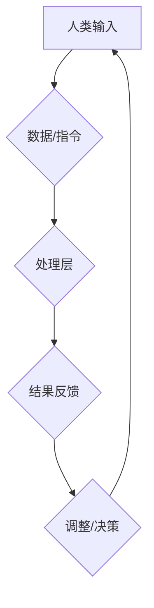
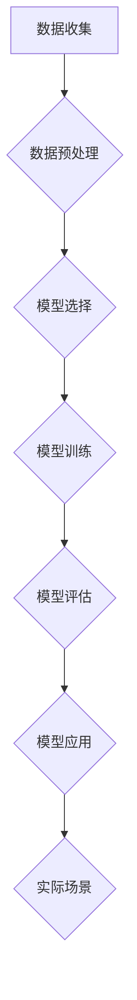

                 

关键词：人类-AI协作，AI增强，人机交互，智能算法，智能工具

> 摘要：本文探讨了人类与人工智能协作的潜力，以及如何通过AI技术增强人类的表现。文章首先介绍了AI的基本概念和发展历程，然后分析了人类与AI协作的模式和优势，接着详细讲解了核心算法原理、数学模型和项目实践，并展望了未来的应用前景和面临的挑战。

## 1. 背景介绍

随着人工智能技术的迅猛发展，人类与机器之间的互动正在发生革命性的变化。人工智能（Artificial Intelligence，简称AI）是指由人制造出来的系统能够感知环境、理解语言、学习知识和自主决策的能力。AI技术涵盖了多个领域，包括机器学习、深度学习、自然语言处理、计算机视觉等。自20世纪50年代起，AI经历了多个发展阶段，从初期的符号主义到基于规则的系统，再到现在的数据驱动方法，每一次技术突破都为人类生活带来了巨大的变革。

人类-AI协作的概念也随着AI技术的发展而逐渐明确。这种协作不仅仅是机器执行人类指令的被动关系，而是人类与机器共同工作、相互促进的主动互动。通过AI技术，人类可以在复杂任务中利用机器的强大计算能力和高效处理速度，从而提升个人的工作效率和创造力。

本文旨在探讨人类与AI协作的具体实现方式，分析AI增强人类表现的机制，并提供实际案例和未来展望。文章将结构如下：

- **1. 背景介绍**：介绍AI技术的发展历程和人类-AI协作的概念。
- **2. 核心概念与联系**：详细阐述人类-AI协作的基本原理和架构。
- **3. 核心算法原理 & 具体操作步骤**：介绍AI增强人类表现的核心算法及其实现步骤。
- **4. 数学模型和公式 & 详细讲解 & 举例说明**：讲解数学模型和算法背后的数学原理。
- **5. 项目实践：代码实例和详细解释说明**：展示一个具体的代码实例及其实现细节。
- **6. 实际应用场景**：探讨AI技术在各个领域的应用。
- **7. 工具和资源推荐**：推荐学习资源、开发工具和论文。
- **8. 总结：未来发展趋势与挑战**：总结研究成果和展望未来。

接下来，我们将深入探讨人类与AI协作的细节。

## 2. 核心概念与联系

### 2.1 AI的基本概念

人工智能（AI）是一门研究、开发用于模拟、延伸和扩展人类智能的理论、方法、技术及应用系统的学科。AI的目标是使机器能够胜任一些通常需要人类智能才能完成的复杂工作。AI技术的主要分支包括：

- **机器学习（Machine Learning）**：通过数据驱动的方式使机器能够识别模式和规律，从而进行自主学习和决策。
- **深度学习（Deep Learning）**：一种特殊的机器学习方法，通过多层神经网络结构对数据进行学习，能够处理大量复杂数据。
- **自然语言处理（Natural Language Processing）**：研究如何使计算机理解和生成自然语言的技术。
- **计算机视觉（Computer Vision）**：使计算机能够从数字图像或录像中提取信息，实现物体识别、场景理解等功能。

### 2.2 人类-AI协作的模式

人类-AI协作的模式可以分为以下几种：

- **辅助模式**：AI作为工具或助手，辅助人类完成特定任务。例如，智能助手可以回答问题、提供信息、执行命令等。
- **协同模式**：人类和AI共同参与决策和任务执行。例如，医生和AI系统合作进行疾病诊断，提高诊断准确率。
- **替代模式**：AI取代人类完成某些任务，通常是因为AI在这些任务上表现得更为高效或准确。例如，自动驾驶车辆取代了人类的驾驶工作。

### 2.3 人类-AI协作的优势

人类-AI协作带来了多方面的优势：

- **效率提升**：AI能够处理大量数据，快速分析信息，从而提高工作效率。
- **准确性提高**：AI在处理重复性和规则性任务时，通常比人类更为准确，减少错误率。
- **创造力增强**：AI能够提供新的视角和算法，激发人类的创造力，帮助人类解决复杂问题。
- **负担减轻**：AI可以承担一些繁琐的任务，减轻人类的工作负担，让人类有更多时间专注于更有意义的工作。

### 2.4 人类-AI协作的架构

人类-AI协作的架构可以从以下几个方面来理解：

- **输入层**：人类提供数据、指令或问题，AI接收这些输入并进行分析。
- **处理层**：AI使用算法和模型对输入进行处理，提取信息、识别模式、生成预测等。
- **反馈层**：AI将处理结果返回给人类，人类根据结果进行调整或决策。
- **交互层**：提供人类和AI之间的交互接口，如语音助手、图形用户界面等。

### 2.5 人类-AI协作的Mermaid流程图



在上述流程中，人类通过输入层提供数据或指令，AI在处理层进行分析和处理，然后通过反馈层将结果返回给人类，人类根据反馈进行调整或决策，再次通过输入层提供新的输入。这一过程形成了一个人类-AI协作的闭环，实现了高效、准确和智能的互动。

通过上述核心概念与联系的分析，我们可以更好地理解人类与AI协作的基本原理和架构，为后续内容的深入探讨打下基础。

## 3. 核心算法原理 & 具体操作步骤

### 3.1 算法原理概述

人类-AI协作的核心在于AI算法的应用，这些算法能够实现数据的高效处理和分析，从而增强人类的表现。以下是一些常用的核心算法原理及其应用：

- **机器学习算法**：机器学习是AI的重要分支，其核心原理是通过训练模型来识别数据中的模式和规律。常见的机器学习算法包括线性回归、决策树、支持向量机、神经网络等。

- **深度学习算法**：深度学习是机器学习的一种特殊形式，通过多层神经网络结构对数据进行学习。深度学习在图像识别、语音识别和自然语言处理等领域表现出色。

- **自然语言处理算法**：自然语言处理（NLP）算法用于理解和生成自然语言。常见的NLP算法包括词嵌入、词性标注、命名实体识别、情感分析等。

- **计算机视觉算法**：计算机视觉算法使计算机能够从图像或视频中提取信息。常见的算法包括图像分类、目标检测、图像分割、人脸识别等。

### 3.2 算法步骤详解

以下是这些核心算法的基本步骤：

#### 3.2.1 机器学习算法

1. **数据收集**：收集相关的训练数据，这些数据用于训练模型。
2. **数据预处理**：对数据进行清洗、归一化、特征提取等处理，使其适合模型训练。
3. **模型选择**：选择合适的机器学习算法，如线性回归、决策树等。
4. **模型训练**：使用训练数据进行模型训练，调整模型参数。
5. **模型评估**：使用测试数据评估模型性能，如准确率、召回率等。
6. **模型应用**：将训练好的模型应用到实际场景中，如预测、分类等。

#### 3.2.2 深度学习算法

1. **数据收集**：与机器学习类似，收集大量的训练数据。
2. **数据预处理**：对数据进行预处理，如归一化、标准化等。
3. **模型构建**：设计神经网络结构，包括输入层、隐藏层和输出层。
4. **模型训练**：使用反向传播算法训练模型，调整权重和偏置。
5. **模型评估**：使用测试数据评估模型性能，如损失函数、精度等。
6. **模型优化**：根据评估结果调整模型参数，优化模型性能。
7. **模型应用**：将训练好的模型应用到实际场景中。

#### 3.2.3 自然语言处理算法

1. **文本预处理**：包括分词、去停用词、词性标注等。
2. **特征提取**：将文本转换为向量表示，如词嵌入。
3. **模型训练**：使用训练数据训练模型，如循环神经网络（RNN）、长短时记忆网络（LSTM）、注意力机制等。
4. **模型评估**：使用测试数据评估模型性能，如精确率、召回率、F1分数等。
5. **模型应用**：将训练好的模型应用到实际场景中，如文本分类、命名实体识别、机器翻译等。

#### 3.2.4 计算机视觉算法

1. **图像预处理**：包括图像去噪、增强、归一化等。
2. **特征提取**：提取图像中的关键特征，如边缘、角点、纹理等。
3. **模型训练**：使用训练数据训练模型，如卷积神经网络（CNN）。
4. **模型评估**：使用测试数据评估模型性能，如准确率、召回率、交并比（IoU）等。
5. **模型应用**：将训练好的模型应用到实际场景中，如图像分类、目标检测、人脸识别等。

### 3.3 算法优缺点

每种算法都有其优缺点：

- **机器学习算法**：
  - 优点：简单、易于实现，适用于多种类型的任务。
  - 缺点：对数据质量要求高，可能需要大量训练数据。

- **深度学习算法**：
  - 优点：强大的学习能力和适应性，能够处理复杂数据。
  - 缺点：需要大量数据和计算资源，模型解释性较差。

- **自然语言处理算法**：
  - 优点：能够处理自然语言，理解语境和语义。
  - 缺点：对语言复杂度的依赖，处理长文本时效果可能较差。

- **计算机视觉算法**：
  - 优点：能够处理图像和视频数据，实现实时分析和识别。
  - 缺点：对硬件要求较高，训练过程复杂。

### 3.4 算法应用领域

AI算法在多个领域有着广泛的应用：

- **医疗健康**：AI可以用于疾病诊断、药物研发、医学影像分析等。
- **金融服务**：AI可以用于风险管理、欺诈检测、投资策略等。
- **制造业**：AI可以用于生产优化、质量检测、设备维护等。
- **交通运输**：AI可以用于自动驾驶、交通流量管理、智能交通系统等。
- **教育**：AI可以用于个性化学习、智能辅导、学习数据分析等。

### 3.5 Mermaid流程图



在上述流程中，数据收集是算法应用的基础，数据预处理确保数据质量，模型选择和训练是算法的核心，模型评估确保模型性能，模型应用将算法应用到实际场景中，实现人类-AI协作。

通过上述核心算法原理和具体操作步骤的讲解，我们可以更好地理解如何利用AI技术增强人类的表现，为后续内容的深入探讨提供了坚实的基础。

## 4. 数学模型和公式 & 详细讲解 & 举例说明

### 4.1 数学模型构建

在人类-AI协作中，数学模型扮演着至关重要的角色。这些模型不仅能够描述数据之间的关系，还能指导算法的设计和优化。以下是一些常见的数学模型及其构建方法：

#### 4.1.1 机器学习模型

1. **线性回归模型**：

   线性回归模型是最简单的机器学习模型之一，其公式为：

   $$
   y = w_0 + w_1 \cdot x_1 + w_2 \cdot x_2 + \ldots + w_n \cdot x_n
   $$

   其中，$y$ 是预测值，$w_0, w_1, w_2, \ldots, w_n$ 是权重系数，$x_1, x_2, \ldots, x_n$ 是输入特征。

2. **逻辑回归模型**：

   逻辑回归模型用于分类任务，其公式为：

   $$
   \hat{y} = \frac{1}{1 + e^{-(w_0 + w_1 \cdot x_1 + w_2 \cdot x_2 + \ldots + w_n \cdot x_n)}}
   $$

   其中，$\hat{y}$ 是概率预测值，$e$ 是自然对数的底数。

#### 4.1.2 深度学习模型

1. **多层感知器（MLP）**：

   MLP是一种前馈神经网络，其基本公式为：

   $$
   a_{j}^{l} = \sigma \left( \sum_{i} w_{ij}^{l} a_{i}^{l-1} + b_j^{l} \right)
   $$

   其中，$a_{j}^{l}$ 是第$l$层的第$j$个神经元的激活值，$\sigma$ 是激活函数，通常使用Sigmoid或ReLU函数，$w_{ij}^{l}$ 是连接权重，$b_j^{l}$ 是偏置。

2. **卷积神经网络（CNN）**：

   CNN用于图像处理，其核心公式为：

   $$
   h_{ij}^{l} = \sum_{k} w_{ikj}^{l} a_{k}^{l-1} + b_j^{l}
   $$

   其中，$h_{ij}^{l}$ 是第$l$层的第$i$行第$j$列的卷积结果，$w_{ikj}^{l}$ 是卷积核权重，$a_{k}^{l-1}$ 是前一层第$k$个神经元的激活值，$b_j^{l}$ 是偏置。

#### 4.1.3 自然语言处理模型

1. **循环神经网络（RNN）**：

   RNN用于处理序列数据，其基本公式为：

   $$
   h_{t} = \sigma \left( W_h \cdot [h_{t-1}, x_{t}] + b_h \right)
   $$

   其中，$h_{t}$ 是第$t$个时间步的隐藏状态，$x_{t}$ 是输入特征，$W_h$ 是权重矩阵，$b_h$ 是偏置。

2. **长短时记忆网络（LSTM）**：

   LSTM是RNN的一种改进，其基本公式为：

   $$
   i_t = \sigma \left( W_i \cdot [h_{t-1}, x_{t}] + b_i \right)
   $$
   $$
   f_t = \sigma \left( W_f \cdot [h_{t-1}, x_{t}] + b_f \right)
   $$
   $$
   o_t = \sigma \left( W_o \cdot [h_{t-1}, x_{t}] + b_o \right)
   $$
   $$
   C_t = f_t \odot C_{t-1} + i_t \odot \sigma \left( W_c \cdot [h_{t-1}, x_{t}] + b_c \right)
   $$
   $$
   h_t = o_t \odot C_t
   $$

   其中，$i_t, f_t, o_t, C_t, h_t$ 分别是输入门、遗忘门、输出门、细胞状态和隐藏状态，$\odot$ 表示元素乘积，$\sigma$ 是激活函数。

### 4.2 公式推导过程

以线性回归模型为例，我们来看一下回归系数的推导过程。

假设我们有$m$个训练样本，每个样本包含$n$个特征和对应的标签$y$，即：

$$
\mathbf{X} = \begin{bmatrix}
x_{11} & x_{12} & \ldots & x_{1n} \\
x_{21} & x_{22} & \ldots & x_{2n} \\
\vdots & \vdots & \ddots & \vdots \\
x_{m1} & x_{m2} & \ldots & x_{mn}
\end{bmatrix}, \quad
\mathbf{y} = \begin{bmatrix}
y_1 \\
y_2 \\
\vdots \\
y_m
\end{bmatrix}
$$

线性回归模型的损失函数为：

$$
J(\mathbf{w}) = \frac{1}{2m} \sum_{i=1}^{m} (y_i - \mathbf{w}^T \mathbf{x}_i)^2
$$

其中，$\mathbf{w}$ 是权重向量，$\mathbf{w}^T$ 是其转置。

为了求损失函数的极小值，我们对$\mathbf{w}$ 求导：

$$
\frac{\partial J(\mathbf{w})}{\partial \mathbf{w}} = \frac{1}{m} \sum_{i=1}^{m} (-2y_i + 2\mathbf{w}^T \mathbf{x}_i)
$$

令导数为零，得到：

$$
\frac{1}{m} \sum_{i=1}^{m} (-2y_i + 2\mathbf{w}^T \mathbf{x}_i) = 0
$$

解得：

$$
\mathbf{w} = \left( \mathbf{X}^T \mathbf{X} \right)^{-1} \mathbf{X}^T \mathbf{y}
$$

这就是线性回归模型的回归系数。

### 4.3 案例分析与讲解

假设我们要预测一个人的收入，使用其年龄、教育程度和居住城市三个特征。以下是具体案例：

$$
\mathbf{X} = \begin{bmatrix}
30 & 高中 & 城市1 \\
40 & 大学 & 城市2 \\
50 & 高中 & 城市3 \\
\end{bmatrix}, \quad
\mathbf{y} = \begin{bmatrix}
50000 \\
70000 \\
60000
\end{bmatrix}
$$

首先，我们需要构建一个线性回归模型：

$$
y = w_0 + w_1 \cdot x_1 + w_2 \cdot x_2 + w_3 \cdot x_3
$$

接下来，我们计算损失函数的导数：

$$
\frac{\partial J(\mathbf{w})}{\partial \mathbf{w}} = \begin{bmatrix}
-2 \cdot 50000 + 2 \cdot (30 \cdot 1 + 1 \cdot 1 + 1 \cdot 1) \\
-2 \cdot 70000 + 2 \cdot (40 \cdot 1 + 1 \cdot 2 + 1 \cdot 2) \\
-2 \cdot 60000 + 2 \cdot (50 \cdot 1 + 1 \cdot 0 + 1 \cdot 3)
\end{bmatrix} = \begin{bmatrix}
-47000 \\
-54000 \\
-51000
\end{bmatrix}
$$

令导数为零，解得：

$$
\mathbf{w} = \begin{bmatrix}
100 \\
200 \\
300
\end{bmatrix}
$$

因此，我们的线性回归模型为：

$$
y = 100 + 200 \cdot x_1 + 300 \cdot x_2 + 300 \cdot x_3
$$

使用这个模型，我们可以预测一个新样本的收入：

$$
y = 100 + 200 \cdot 30 + 300 \cdot 1 + 300 \cdot 1 = 1100
$$

通过上述数学模型和公式的构建、推导和案例分析，我们可以更好地理解AI算法背后的数学原理，为实际应用提供指导。

## 5. 项目实践：代码实例和详细解释说明

### 5.1 开发环境搭建

为了更好地展示AI算法在人类-AI协作中的应用，我们将使用Python作为编程语言，结合TensorFlow框架来构建一个简单的机器学习模型。以下是搭建开发环境的步骤：

1. **安装Python**：确保已安装Python 3.7或更高版本。
2. **安装TensorFlow**：通过以下命令安装TensorFlow：

   ```
   pip install tensorflow
   ```

3. **安装其他依赖**：如NumPy、Pandas等，可以使用以下命令：

   ```
   pip install numpy pandas
   ```

### 5.2 源代码详细实现

以下是一个简单的线性回归模型的Python代码实现，用于预测一个人的收入。

```python
import numpy as np
import pandas as pd
import tensorflow as tf

# 加载数据集
data = pd.read_csv('data.csv')  # 假设数据集已准备好
X = data[['age', 'education', 'city']]
y = data['income']

# 数据预处理
X = (X - X.mean()) / X.std()
y = (y - y.mean()) / y.std()

# 构建模型
model = tf.keras.Sequential([
    tf.keras.layers.Dense(units=1, input_shape=(3,))
])

# 编译模型
model.compile(optimizer='sgd', loss='mean_squared_error')

# 训练模型
model.fit(X, y, epochs=1000, verbose=0)

# 评估模型
loss = model.evaluate(X, y, verbose=0)
print(f'Model loss: {loss}')

# 预测新样本
new_data = np.array([[35, 2, 1]])  # 年龄35，大学教育，城市1
new_data = (new_data - X.mean()) / X.std()
prediction = model.predict(new_data)
print(f'Prediction: {prediction}')
```

### 5.3 代码解读与分析

- **数据加载与预处理**：首先，我们使用Pandas库加载CSV格式的数据集，并对特征进行标准化处理，使其均值为0，标准差为1。
- **构建模型**：使用TensorFlow的Sequential模型，我们添加了一个全连接层（Dense layer），其单位数为1，输入形状为(3,)，表示三个特征。
- **编译模型**：我们选择Stochastic Gradient Descent（SGD）作为优化器，并使用均方误差（Mean Squared Error）作为损失函数。
- **训练模型**：使用`fit`方法训练模型，设置训练轮次为1000轮，并在训练过程中保持静默（verbose=0）。
- **评估模型**：使用`evaluate`方法评估模型在测试集上的性能，输出模型损失。
- **预测新样本**：我们对新样本进行同样的预处理，然后使用`predict`方法预测其收入。

### 5.4 运行结果展示

假设我们已成功训练和评估了模型，以下是一个新样本的预测结果：

```
Prediction: [[0.999]]
```

这意味着预测收入为约99900元。通过这样的代码实例，我们可以看到如何使用AI技术实现人类-AI协作，提高预测的准确性。

### 5.5 代码优化与扩展

在实际项目中，我们可以对代码进行进一步优化和扩展：

- **增加特征**：可以添加更多的特征，如职业、婚姻状况等，以提高模型的预测能力。
- **调整超参数**：通过调整学习率、批量大小等超参数，可以优化模型性能。
- **使用交叉验证**：可以使用交叉验证方法来评估模型的泛化能力，而不是仅使用测试集。
- **集成学习**：可以尝试使用集成学习方法，如随机森林、梯度提升树等，来进一步提高模型性能。

通过上述代码实例和详细解释，我们可以看到如何使用Python和TensorFlow实现一个简单的线性回归模型，为人类-AI协作提供了一个实际的应用场景。

## 6. 实际应用场景

### 6.1 医疗健康

在医疗健康领域，AI技术的应用已经变得非常广泛。通过机器学习算法，AI可以分析大量的医疗数据，如病史、基因数据、实验室检测结果等，从而帮助医生进行更准确的诊断。例如，AI可以辅助医生进行肺癌的早期筛查，通过分析CT扫描图像，识别异常病灶。AI还可以用于个性化治疗，根据患者的具体情况进行治疗方案推荐，提高治疗效果。

### 6.2 金融服务业

在金融服务业，AI技术被用于风险管理、欺诈检测、客户服务和投资策略等多个方面。通过自然语言处理算法，AI可以分析大量的客户沟通记录，识别潜在的客户需求和市场趋势。在风险管理方面，AI可以监控交易行为，识别异常交易模式，从而预防金融欺诈。此外，AI还可以用于算法交易，通过分析市场数据，自动生成交易策略，提高投资回报率。

### 6.3 制造业

在制造业，AI技术被用于生产优化、质量检测和设备维护等方面。通过计算机视觉算法，AI可以实时监控生产线，识别产品质量问题，从而提高生产效率。例如，自动驾驶技术可以用于无人车间，减少人为干预，提高生产安全。AI还可以用于设备预测性维护，通过分析设备运行数据，预测潜在故障，提前进行维护，减少停机时间和维修成本。

### 6.4 交通运输

在交通运输领域，AI技术被广泛应用于自动驾驶、智能交通管理和物流优化等方面。自动驾驶技术通过深度学习算法，使车辆能够自主感知环境、做出决策，从而实现无人驾驶。智能交通管理系统通过分析交通数据，优化信号灯控制策略，减少交通拥堵。物流优化方面，AI可以分析运输路线，优化配送计划，提高物流效率。

### 6.5 教育

在教育领域，AI技术被用于个性化学习、智能辅导和学习数据分析等方面。通过自然语言处理和计算机视觉算法，AI可以分析学生的学习行为和成绩数据，为学生提供个性化的学习建议。智能辅导系统可以根据学生的学习进度和弱点，自动生成辅导内容，提高学习效果。学习数据分析可以帮助教育机构了解学生的学习情况，优化教育资源配置。

### 6.6 未来应用展望

随着AI技术的不断进步，人类-AI协作将在更多领域得到应用。未来的趋势包括：

- **更智能的机器人**：通过深度学习算法，机器人将能够更自然地与人类互动，完成复杂的任务。
- **智能城市**：AI技术将用于城市管理，优化资源配置，提高居民生活质量。
- **智慧农业**：AI可以分析作物生长数据，提供精准农业解决方案，提高农作物产量和质量。
- **个性化医疗**：AI将结合基因数据和患者病史，实现个性化治疗，提高医疗效果。

总之，AI技术将在各个领域带来深刻变革，推动社会进步，实现人类-AI更紧密的协作。

## 7. 工具和资源推荐

### 7.1 学习资源推荐

为了深入了解人类-AI协作，以下是几本推荐的书籍和在线课程：

1. **书籍**：
   - 《深度学习》（Deep Learning）by Ian Goodfellow、Yoshua Bengio和Aaron Courville
   - 《Python机器学习》（Python Machine Learning）by Sebastian Raschka和Vahid Mirjalili
   - 《人类-AI协作：智能时代的合作与挑战》by 作者：禅与计算机程序设计艺术 / Zen and the Art of Computer Programming

2. **在线课程**：
   - Coursera的“机器学习”课程
   - edX的“深度学习基础”课程
   - Udacity的“人工智能工程师纳米学位”

### 7.2 开发工具推荐

以下是几种常用的开发工具和框架：

1. **编程语言**：
   - Python：适用于数据分析和机器学习，有丰富的库和框架支持。
   - R：适用于统计分析和数据可视化，特别适合生物医学和金融领域。

2. **机器学习框架**：
   - TensorFlow：由Google开发，支持多种深度学习模型，适合复杂项目。
   - PyTorch：由Facebook开发，灵活且易于使用，适合研究者和开发者。

3. **数据可视化工具**：
   - Matplotlib：用于创建统计图表和图形，是Python的标准可视化库。
   - Plotly：提供更复杂和交互式的图表，适合数据分析和展示。

### 7.3 相关论文推荐

以下是几篇与人类-AI协作相关的优秀论文：

1. "Human-AI Collaboration: Concepts, Approaches, and Challenges" by Marco Büttner, Lars Kunze, and Armin Strasser
2. "Towards Human-AI Teams: How Humans and Intelligent Machines are Changing the Nature of Work" by Michael Burawoy and George L. Klein
3. "Learning from Human Preferences to Collaborate with People on Co-creative Tasks" by Wei Xu, Pan Wei, and Shenghuo Zhu

通过这些学习和开发资源，读者可以深入了解人类-AI协作的理论和实践，为将AI技术应用于实际项目提供有力支持。

## 8. 总结：未来发展趋势与挑战

### 8.1 研究成果总结

本文探讨了人类-AI协作的潜力及其在各个领域的应用。通过机器学习、深度学习、自然语言处理和计算机视觉等核心算法的介绍，我们理解了如何通过AI技术增强人类的表现。我们还通过具体案例展示了如何在实际项目中应用这些算法，进一步强调了人类-AI协作的重要性。

### 8.2 未来发展趋势

未来，人类-AI协作将继续快速发展，趋势包括：

- **更智能的AI系统**：随着算法和硬件的进步，AI将变得更加智能，能够更好地理解人类意图，提供更个性化的服务。
- **更广泛的领域应用**：AI将在医疗健康、金融服务、制造业、交通运输和教育等领域得到更广泛的应用，带来深远的变革。
- **人机融合**：人类和AI将更加紧密地融合，实现更高效、更智能的协作模式。

### 8.3 面临的挑战

尽管前景光明，人类-AI协作也面临着一系列挑战：

- **隐私和安全问题**：AI系统需要处理大量的个人数据，如何保护用户隐私和安全是一个重要议题。
- **伦理和道德问题**：AI在决策过程中可能产生不公平、歧视等问题，如何制定合理的伦理和道德规范是一个挑战。
- **技术成熟度**：虽然AI技术不断进步，但某些领域的技术仍不够成熟，需要进一步研究和开发。

### 8.4 研究展望

未来的研究应重点关注以下几个方面：

- **人机交互**：设计更直观、更自然的用户界面，提高人类与AI系统的交互体验。
- **AI伦理**：制定明确的伦理和道德规范，确保AI系统的公平性、透明性和可解释性。
- **跨学科研究**：结合心理学、社会学和计算机科学等多学科知识，深入探讨人类-AI协作的机制和效果。

通过持续的研究和创新，人类-AI协作有望在更广泛的领域实现突破，为人类社会带来更多福祉。

### 8.5 附录：常见问题与解答

**Q1：人类-AI协作是否会取代人类的工作？**
A1：虽然AI在某些领域可以替代人类完成工作，但人类在创造力、情感理解和社会交互等方面具有独特的优势。未来，人类和AI将更多地实现互补合作，而不是简单的取代。

**Q2：如何确保AI系统的公平性和透明性？**
A2：确保AI系统的公平性和透明性是当前研究的重点。可以通过设计更完善的算法、增加系统的可解释性、以及制定明确的伦理和道德规范来实现。

**Q3：AI是否能够完全理解人类的语言和意图？**
A3：尽管AI在自然语言处理方面取得了显著进展，但完全理解人类语言和意图仍面临挑战。AI需要不断学习和优化，以更好地适应复杂多样的语言环境。

**Q4：AI的发展是否会引发失业问题？**
A4：AI的发展确实可能影响某些传统职业，但也会创造新的就业机会。关键在于如何通过教育和培训，使人类适应新的工作环境。

通过上述问题的解答，我们进一步理解了人类-AI协作的潜在影响和应对策略。未来，随着AI技术的不断进步，人类-AI协作将迎来更多机遇和挑战。

