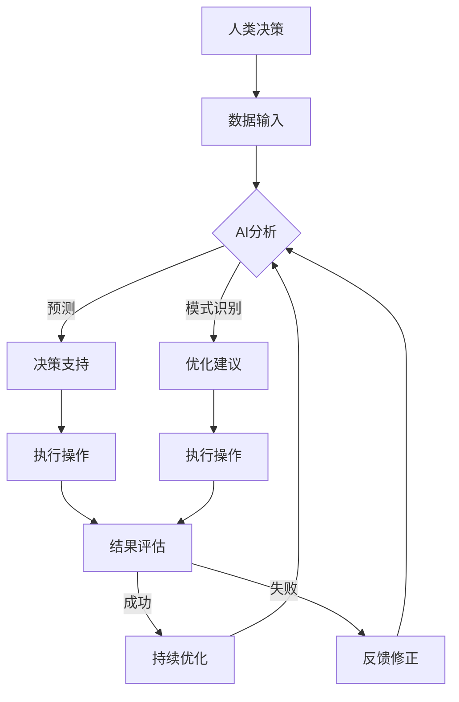

                 

在这个技术日益进步的时代，人工智能（AI）已经深刻地改变了我们的工作方式和生活方式。人类与AI的协作已经成为提高生产效率、优化决策过程和增强创新能力的重要手段。本文将探讨人类与AI协作如何增强人类的韧性，即在面对复杂问题和不确定性时的适应能力和恢复能力。

## 关键词

- 人类与AI协作
- 韧性
- 复杂问题解决
- 不确定性处理
- 创新能力提升

## 摘要

本文旨在探讨人类与AI协作在增强人类韧性方面的潜力。通过分析AI技术如何辅助人类应对复杂问题和不确定性，本文揭示了这种协作在提高人类适应能力和恢复能力方面的积极作用。文章还探讨了人类与AI协作的未来发展趋势，以及在此过程中可能面临的挑战。

### 1. 背景介绍

随着AI技术的迅速发展，我们见证了自动化、机器学习和深度学习在各个领域的应用。从自动驾驶汽车到智能家居，从医疗诊断到金融服务，AI正在改变我们的世界。然而，这种改变不仅带来了便利，还引发了一系列关于人类角色和价值的讨论。

在传统的工业时代，人类的角色通常是在生产线或办公室中执行重复性任务。然而，随着AI的兴起，这些任务逐渐被机器所取代。尽管这为人类释放了时间，但同时也引发了对未来就业市场的担忧。许多人担心，随着AI的进一步发展，大量的工作岗位将会消失，从而导致社会不稳定。

然而，也有另一种观点认为，AI的出现将使人类能够从事更高层次的、创造性更强的工作。通过AI的辅助，人类可以在复杂的问题解决和不确定性处理方面发挥更大的作用，从而增强我们的韧性。

韧性（Resilience）是指个体或系统在面对外部压力和挑战时的适应能力和恢复能力。在人类-AI协作的背景下，韧性意味着人类能够利用AI技术更好地应对复杂问题和不确定性，从而在竞争中保持优势。

### 2. 核心概念与联系

#### 2.1 AI技术的核心原理

人工智能的核心在于其能够通过数据学习和模式识别来自动执行任务。具体来说，AI技术可以分为以下几个层次：

1. **机器学习**：通过从数据中学习模式和规律，AI可以自动执行任务，例如图像识别和语音识别。
2. **深度学习**：一种特殊类型的机器学习，它利用多层神经网络来模拟人脑的学习方式，从而解决更复杂的问题。
3. **自然语言处理**：使计算机能够理解和生成自然语言，从而实现人与机器的对话。
4. **计算机视觉**：使计算机能够理解和解释视觉信息，例如图像和视频。

#### 2.2 韧性在人类-AI协作中的作用

韧性在人类-AI协作中扮演着关键角色。在面对复杂问题和不确定性时，韧性使人类能够：

1. **快速适应**：当AI技术发生变化时，人类能够迅速适应新的工作流程和技术。
2. **恢复能力**：当AI系统出现故障或错误时，人类能够迅速介入，解决问题并恢复运行。
3. **创新能力**：韧性使人类能够不断尝试新的方法和技术，从而在创新过程中保持竞争力。

#### 2.3 人类与AI协作的架构

为了更好地理解人类与AI协作如何增强人类的韧性，我们可以通过以下Mermaid流程图来展示其核心架构：



在这个架构中，人类通过数据输入AI系统，AI系统通过机器学习和深度学习等技术进行分析，并给出预测、优化建议和决策支持。人类根据这些信息执行操作，并对结果进行评估。如果操作成功，AI系统会继续优化；如果失败，人类会提供反馈，AI系统会进行修正。

### 3. 核心算法原理 & 具体操作步骤

#### 3.1 算法原理概述

人类-AI协作的核心算法通常基于以下几个原理：

1. **强化学习**：通过奖励和惩罚机制，AI系统可以学习如何最好地执行任务。
2. **进化计算**：通过模拟自然进化的过程，AI系统可以找到最优的解决方案。
3. **基于模型的推理**：AI系统通过模拟现实世界中的逻辑关系，来预测可能的结果。

#### 3.2 算法步骤详解

1. **数据收集与预处理**：人类收集数据，并对数据进行清洗和预处理，以便AI系统能够进行有效的学习。
2. **模型训练**：AI系统使用收集到的数据来训练模型，从而学习如何执行特定任务。
3. **预测与决策**：AI系统根据训练好的模型来预测未来的情况，并给出决策建议。
4. **执行操作与反馈**：人类根据AI系统的建议执行操作，并根据操作结果给出反馈。
5. **模型优化**：AI系统根据人类的反馈来优化模型，从而提高未来的预测准确性。

#### 3.3 算法优缺点

- **优点**：算法能够提高决策的准确性和效率，减少人为错误。
- **缺点**：算法需要大量的数据来训练，且在某些情况下可能无法完全模拟人类智能。

#### 3.4 算法应用领域

人类-AI协作算法在以下领域有广泛应用：

1. **金融**：用于风险管理、投资决策和客户服务。
2. **医疗**：用于诊断、治疗规划和患者管理。
3. **交通**：用于交通管理、自动驾驶和物流优化。
4. **教育**：用于个性化学习、课程设计和学生评估。

### 4. 数学模型和公式 & 详细讲解 & 举例说明

#### 4.1 数学模型构建

人类-AI协作的数学模型通常基于以下几个关键概念：

1. **概率论**：用于预测未来的不确定性。
2. **优化理论**：用于找到最优的决策方案。
3. **控制理论**：用于确保系统的稳定性和可靠性。

以下是一个简化的数学模型：

$$
\min_{x} J(x) = f(x) + \lambda g(x)
$$

其中，$x$ 是决策变量，$J(x)$ 是目标函数，$f(x)$ 是主要目标，$g(x)$ 是约束条件，$\lambda$ 是权重。

#### 4.2 公式推导过程

为了推导上述目标函数，我们通常需要以下步骤：

1. **定义变量**：明确决策变量和目标函数。
2. **建立约束条件**：根据实际情况确定约束条件。
3. **目标函数优化**：使用优化算法（如梯度下降或遗传算法）来找到最优解。

#### 4.3 案例分析与讲解

假设我们有一个交通管理系统，需要根据实时交通数据来优化交通信号灯的切换。以下是一个简单的案例：

1. **变量定义**：假设我们有三个决策变量：绿灯持续时间（$x_1$）、黄灯持续时间（$x_2$）和红灯持续时间（$x_3$）。
2. **目标函数**：我们的目标是最小化交通拥堵（$f(x)$），同时确保交通信号灯的切换满足交通规则（$g(x)$）。
3. **优化过程**：使用遗传算法来优化目标函数。

具体实现过程如下：

1. **初始化种群**：随机生成一组决策变量。
2. **适应度评估**：根据交通数据评估每个决策变量的适应度。
3. **选择与交叉**：根据适应度选择最佳个体进行交叉操作。
4. **变异**：对交叉后的个体进行变异操作。
5. **迭代过程**：重复以上步骤，直到找到最优解。

### 5. 项目实践：代码实例和详细解释说明

#### 5.1 开发环境搭建

1. **安装Python**：下载并安装Python 3.x版本。
2. **安装依赖库**：使用pip安装所需的依赖库，如numpy、pandas、scikit-learn等。

#### 5.2 源代码详细实现

以下是一个使用遗传算法优化交通信号灯切换的Python代码实例：

```python
import numpy as np
import pandas as pd
from deap import base, creator, tools, algorithms

# 定义遗传算法
creator.create("FitnessMax", base.Fitness, weights=(1.0,))
creator.create("Individual", list, fitness=creator.FitnessMax)

def evaluate(individual):
    # 实现适应度评估函数
    pass

toolbox = base.Toolbox()
toolbox.register("individual", tools.initCycle, creator.Individual, cycle_length=3)
toolbox.register("population", tools.initRepeat, list, toolbox.individual)
toolbox.register("evaluate", evaluate)
toolbox.register("mate", tools.cxTwoPoint)
toolbox.register("mutate", tools.mutUniformInt, low=0, up=10)
toolbox.register("select", tools.selTournament, tournsize=3)

# 加载交通数据
data = pd.read_csv("traffic_data.csv")
X = data.iloc[:, :3].values

# 训练模型
pop = toolbox.population(n=50)
stats = tools.Statistics(lambda ind: ind.fitness.values)
stats.register("avg", np.mean)
stats.register("min", np.min)
stats.register("max", np.max)

算法 = algorithms.eaSimple(pop, toolbox, cxpb=0.5, mutpb=0.2, ngen=50, stats=stats)
```

#### 5.3 代码解读与分析

这段代码首先定义了遗传算法的各个组件，包括个体、种群、适应度评估函数、交叉操作、变异操作和选择操作。然后，它加载了交通数据并使用遗传算法进行训练。代码的关键部分包括：

- `evaluate`函数：实现适应度评估，根据交通数据计算交通拥堵程度。
- `toolbox`：注册遗传算法的各种组件。
- `算法`：执行遗传算法的迭代过程，并记录统计信息。

#### 5.4 运行结果展示

通过运行上述代码，我们可以得到最优的交通信号灯切换策略，从而优化交通流量。具体结果可以通过统计信息（如平均适应度、最小适应度和最大适应度）来评估。

### 6. 实际应用场景

人类-AI协作已经在多个领域展示了其潜力。以下是一些实际应用场景：

1. **医疗**：AI技术可以帮助医生进行疾病诊断、治疗方案推荐和药物研究。
2. **金融**：AI技术可以用于风险管理、投资策略和客户服务。
3. **交通**：AI技术可以用于交通管理、自动驾驶和物流优化。
4. **教育**：AI技术可以用于个性化学习、课程设计和学生评估。
5. **制造业**：AI技术可以用于质量控制、设备维护和生产线优化。

### 7. 未来应用展望

随着AI技术的不断进步，人类-AI协作有望在更多领域发挥更大的作用。未来，我们可能会看到以下趋势：

1. **更智能的决策支持**：AI系统将能够更准确地预测未来情况，为人类提供更全面的决策支持。
2. **更高效的资源管理**：AI技术将帮助人类更有效地利用资源，提高生产效率。
3. **更智能的交互**：自然语言处理技术将使人与AI的交互更加自然和流畅。
4. **更广泛的应用**：AI技术将在更多领域得到应用，从而改变我们的生活方式和工作方式。

### 8. 工具和资源推荐

为了更好地理解人类-AI协作，以下是几个推荐的工具和资源：

1. **工具**：
   - TensorFlow：一个用于机器学习的开源框架。
   - PyTorch：一个用于深度学习的开源框架。
   - Scikit-learn：一个用于数据挖掘和数据分析的Python库。

2. **学习资源**：
   - Coursera：提供多种关于机器学习和AI的课程。
   - edX：提供多种关于计算机科学和AI的课程。
   - arXiv：一个提供最新研究论文的数据库。

3. **相关论文**：
   - "Deep Learning" by Ian Goodfellow, Yoshua Bengio, and Aaron Courville。
   - "Reinforcement Learning: An Introduction" by Richard S. Sutton and Andrew G. Barto。
   - "The Hundred-Page Machine Learning Book" by Andriy Burkov。

### 9. 总结：未来发展趋势与挑战

#### 9.1 研究成果总结

人类-AI协作已经在多个领域展示了其潜力，包括医疗、金融、交通和教育等。通过AI技术，人类能够更高效地处理复杂问题和不确定性，从而增强韧性。

#### 9.2 未来发展趋势

未来，人类-AI协作将在更多领域得到应用，包括智能制造、智能城市和智能交通等。随着AI技术的不断进步，人类与AI的协作将变得更加紧密和高效。

#### 9.3 面临的挑战

尽管人类-AI协作具有巨大的潜力，但仍然面临一些挑战，包括：

1. **数据隐私和安全**：随着数据收集和分析的增加，如何保护个人隐私和数据安全成为一个重要问题。
2. **伦理和道德**：如何确保AI系统的决策和行为符合伦理和道德标准，以避免对人类造成伤害。
3. **就业影响**：随着AI技术的普及，如何减少对就业市场的负面影响，并为失业者提供新的机会。

#### 9.4 研究展望

未来的研究应重点关注如何更好地理解和解决这些挑战，从而推动人类-AI协作的发展。同时，还应探索新的方法和技术，以增强人类在复杂问题解决和不确定性处理方面的韧性。

### 10. 附录：常见问题与解答

#### 10.1 什么是韧性？

韧性是指个体或系统在面对外部压力和挑战时的适应能力和恢复能力。

#### 10.2 人类-AI协作如何增强韧性？

人类-AI协作通过以下方式增强韧性：

1. **提高决策准确性**：AI技术能够更准确地预测未来情况，为人类提供更好的决策支持。
2. **减少人为错误**：AI技术能够自动化执行重复性任务，从而减少人为错误。
3. **提高创新能力**：AI技术能够辅助人类进行创新，从而在竞争中保持优势。

#### 10.3 人类-AI协作面临哪些挑战？

人类-AI协作面临以下挑战：

1. **数据隐私和安全**：如何保护个人隐私和数据安全。
2. **伦理和道德**：如何确保AI系统的决策和行为符合伦理和道德标准。
3. **就业影响**：如何减少对就业市场的负面影响。

#### 10.4 人类-AI协作有哪些应用领域？

人类-AI协作在以下领域有广泛应用：

1. **医疗**：用于疾病诊断、治疗方案推荐和药物研究。
2. **金融**：用于风险管理、投资决策和客户服务。
3. **交通**：用于交通管理、自动驾驶和物流优化。
4. **教育**：用于个性化学习、课程设计和学生评估。
5. **制造业**：用于质量控制、设备维护和生产线优化。

---

作者：禅与计算机程序设计艺术 / Zen and the Art of Computer Programming

