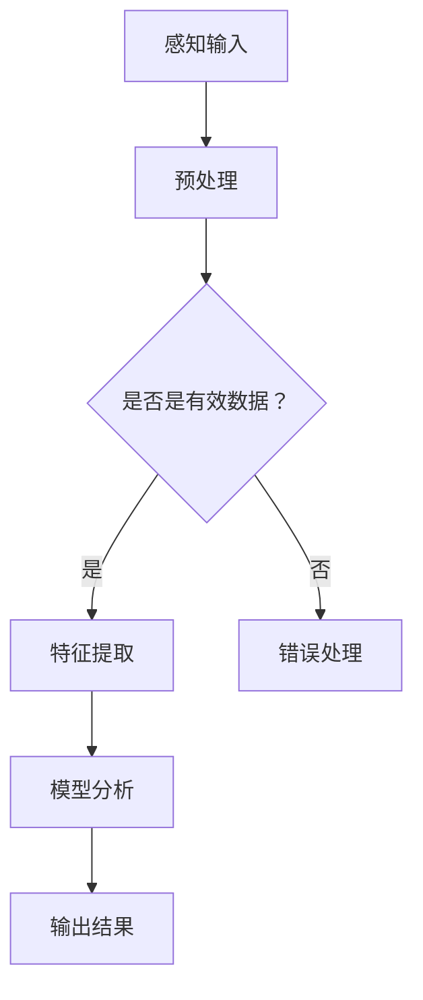
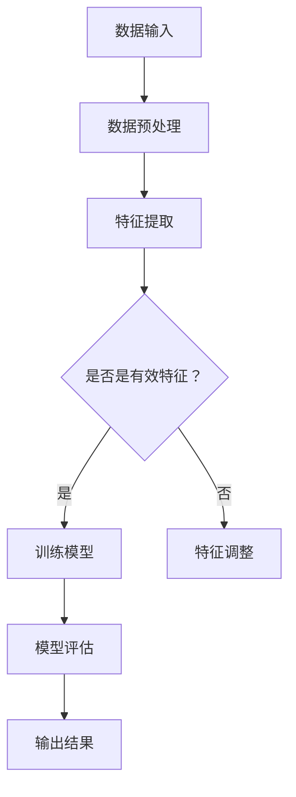
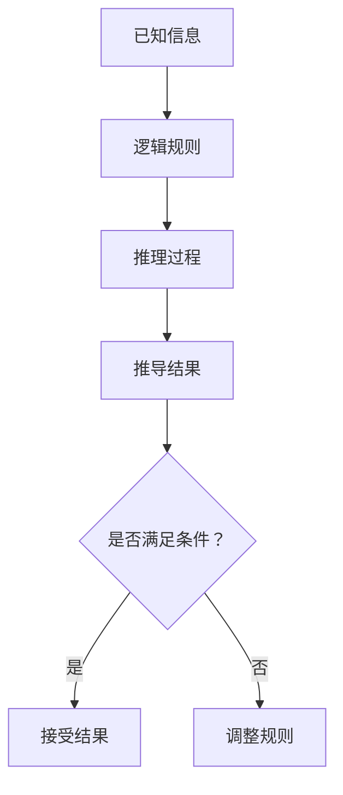
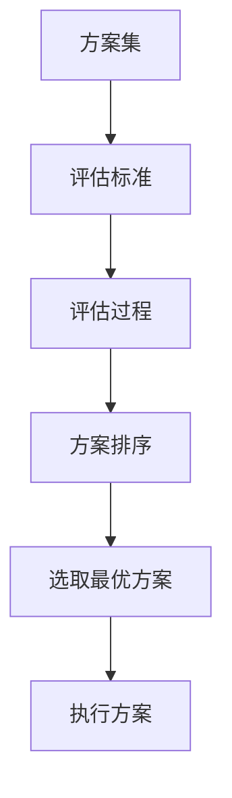

                 

在科技日新月异的今天，人工智能（Artificial Intelligence, AI）的发展无疑是其中最引人注目的领域之一。作为计算机科学的一个分支，人工智能的研究目标是模拟、扩展甚至超越人类智能。然而，无论是从理论探讨，还是实际应用层面，人工智能与人类智能之间的关系都远比人们想象的要复杂得多。本文旨在探讨这两者之间的关联，从多个角度分析人工智能如何影响并与其并行发展的过程。

## 关键词

- 人类智能
- 人工智能
- 计算机科学
- 神经网络
- 自然语言处理
- 深度学习

## 摘要

本文首先回顾了人类智能的定义和历史，接着探讨了人工智能的起源和发展历程，随后深入分析了人类智能与人工智能的相似性和差异。文章接着讨论了人工智能在各个领域的应用，如医疗、金融、教育等，并探讨了这些应用对人类工作和社会结构的影响。最后，文章提出了人工智能未来发展的一些潜在挑战和展望，为读者提供了一个全面而深入的视角来理解这两者之间的关系。

### 1. 背景介绍

人类智能（Human Intelligence）的定义可以从多个角度进行解读。从心理学的角度来看，人类智能通常指的是人类解决问题的能力，包括感知、记忆、推理、判断和创造性思维等方面。历史上，人类对智能的探索可以追溯到古希腊时期，亚里士多德在其《论灵魂》一书中提出了关于灵魂和智慧的理论。随着时间的推移，对智能的研究不断深入，心理学家们发展出了许多关于智能的理论和模型。

计算机科学（Computer Science）作为一门学科，其起源可以追溯到20世纪40年代。艾伦·图灵（Alan Turing）提出了图灵机的概念，为现代计算机科学奠定了理论基础。随后，计算机科学迅速发展，逐渐形成了包括算法、数据结构、计算机体系结构、编程语言、人工智能等多个分支。

人工智能（Artificial Intelligence）的概念最早可以追溯到20世纪50年代。最初的研究主要集中在模拟人类思维过程，如符号逻辑和问题解决。随着计算机性能的不断提升和算法的进步，人工智能逐渐从理论研究走向实际应用，涵盖了包括机器学习、自然语言处理、计算机视觉等多个子领域。

### 2. 核心概念与联系

要理解人类智能与人工智能之间的关系，我们需要首先明确几个核心概念：感知、学习、推理和决策。

#### 2.1 感知（Perception）

感知是智能的基础，指的是从外部环境中获取信息并理解这些信息的过程。人类通过感官（如视觉、听觉、嗅觉等）感知世界，而人工智能则依赖于传感器和输入设备。计算机视觉是一个典型的例子，它通过摄像头获取图像数据，然后使用图像识别算法进行分析。

**Mermaid 流程图：**



#### 2.2 学习（Learning）

学习是智能的核心功能之一，指的是通过经验改进行为或知识的过程。人类通过不断的学习和训练来提高自己的智能水平。人工智能同样依赖于学习算法，特别是机器学习和深度学习。这些算法使得机器能够从数据中学习模式，并进行预测和决策。

**Mermaid 流程图：**



#### 2.3 推理（Reasoning）

推理是智能的高级功能，指的是从已知信息推导出新信息的能力。人类能够通过逻辑推理解决复杂问题，人工智能同样依赖推理算法，如逻辑推理、概率推理和模糊推理等。这些算法使得机器能够在不确定的环境中做出合理的决策。

**Mermaid 流程图：**



#### 2.4 决策（Decision Making）

决策是智能的高级表现，指的是在多个可行方案中选取最优方案的过程。人类通过经验和直觉做出决策，而人工智能则依赖于优化算法和决策理论。这些算法能够在复杂的环境中找到最优解或近似最优解。

**Mermaid 流程图：**



### 3. 核心算法原理 & 具体操作步骤

#### 3.1 算法原理概述

人工智能的核心算法可以分为两大类：监督学习和无监督学习。监督学习是一种在有标注的数据集上进行学习的方法，其目标是根据输入特征和输出结果来训练模型。无监督学习则是在没有标注的数据集上进行学习，其目标是发现数据中的结构和模式。

**监督学习算法：**

- 线性回归（Linear Regression）
- 逻辑回归（Logistic Regression）
- 支持向量机（Support Vector Machine, SVM）

**无监督学习算法：**

- K-均值聚类（K-Means Clustering）
- 主成分分析（Principal Component Analysis, PCA）
- 聚类算法（Clustering Algorithms）

#### 3.2 算法步骤详解

**监督学习算法：**

1. 数据收集：收集具有标注的数据集。
2. 数据预处理：对数据进行清洗、归一化等处理。
3. 特征提取：从数据中提取有用的特征。
4. 模型训练：使用训练数据训练模型。
5. 模型评估：使用测试数据评估模型性能。
6. 模型优化：根据评估结果调整模型参数。

**无监督学习算法：**

1. 数据收集：收集未标注的数据集。
2. 数据预处理：对数据进行清洗、归一化等处理。
3. 特征提取：从数据中提取有用的特征。
4. 模型训练：使用训练数据训练模型。
5. 模型评估：评估模型发现的结构或模式。
6. 模型优化：根据评估结果调整模型参数。

#### 3.3 算法优缺点

**监督学习算法：**

- 优点：能够从已知数据中提取有用的信息，适用于需要预测或分类的问题。
- 缺点：对数据质量和标注要求较高，难以处理大规模无标注数据。

**无监督学习算法：**

- 优点：能够发现数据中的隐藏结构和模式，适用于探索性数据分析。
- 缺点：无法直接对数据做出预测或分类，需要进一步结合监督学习算法。

#### 3.4 算法应用领域

**监督学习算法：**

- 医疗诊断：如癌症检测、疾病预测等。
- 金融预测：如股票价格预测、信用评分等。
- 自然语言处理：如情感分析、机器翻译等。

**无监督学习算法：**

- 数据挖掘：如市场细分、客户行为分析等。
- 计算机视觉：如图像分类、目标检测等。
- 社交网络分析：如推荐系统、网络社区发现等。

### 4. 数学模型和公式 & 详细讲解 & 举例说明

#### 4.1 数学模型构建

人工智能中的许多算法都是基于数学模型构建的，如线性回归、逻辑回归、神经网络等。这些模型通常使用矩阵运算、微积分和概率论等数学工具来描述。

**线性回归模型：**

线性回归模型可以表示为：

$$
y = \beta_0 + \beta_1 x_1 + \beta_2 x_2 + ... + \beta_n x_n
$$

其中，$y$ 是输出变量，$x_1, x_2, ..., x_n$ 是输入变量，$\beta_0, \beta_1, \beta_2, ..., \beta_n$ 是模型参数。

**神经网络模型：**

神经网络模型可以表示为：

$$
\sigma(z) = \frac{1}{1 + e^{-z}}
$$

其中，$\sigma$ 是激活函数，$z$ 是网络输出。

#### 4.2 公式推导过程

**线性回归模型推导：**

1. 假设线性回归模型为：

$$
y = \beta_0 + \beta_1 x_1 + \beta_2 x_2 + ... + \beta_n x_n
$$

2. 使用最小二乘法求解模型参数：

$$
\min_{\beta_0, \beta_1, \beta_2, ..., \beta_n} \sum_{i=1}^{n} (y_i - (\beta_0 + \beta_1 x_{i1} + \beta_2 x_{i2} + ... + \beta_n x_{in}))^2
$$

3. 对参数求导并令导数为零，得到：

$$
\frac{\partial}{\partial \beta_0} \sum_{i=1}^{n} (y_i - (\beta_0 + \beta_1 x_{i1} + \beta_2 x_{i2} + ... + \beta_n x_{in}))^2 = 0
$$

$$
\frac{\partial}{\partial \beta_1} \sum_{i=1}^{n} (y_i - (\beta_0 + \beta_1 x_{i1} + \beta_2 x_{i2} + ... + \beta_n x_{in}))^2 = 0
$$

$$
...
$$

$$
\frac{\partial}{\partial \beta_n} \sum_{i=1}^{n} (y_i - (\beta_0 + \beta_1 x_{i1} + \beta_2 x_{i2} + ... + \beta_n x_{in}))^2 = 0
$$

4. 求解上述方程组，得到最优模型参数：

$$
\beta_0 = \bar{y} - \sum_{i=1}^{n} \beta_1 x_{i1} - \beta_2 x_{i2} - ... - \beta_n x_{in}
$$

$$
\beta_1 = \frac{\sum_{i=1}^{n} (x_{i1} - \bar{x}_1)(y_i - \bar{y})}{\sum_{i=1}^{n} (x_{i1} - \bar{x}_1)^2}
$$

$$
\beta_2 = \frac{\sum_{i=1}^{n} (x_{i2} - \bar{x}_2)(y_i - \bar{y})}{\sum_{i=1}^{n} (x_{i2} - \bar{x}_2)^2}
$$

$$
...
$$

$$
\beta_n = \frac{\sum_{i=1}^{n} (x_{in} - \bar{x}_n)(y_i - \bar{y})}{\sum_{i=1}^{n} (x_{in} - \bar{x}_n)^2}
$$

**神经网络模型推导：**

1. 假设神经网络模型为：

$$
z = \sum_{i=1}^{n} w_i x_i + b
$$

2. 使用梯度下降法求解模型参数：

$$
\min_{w_1, w_2, ..., w_n, b} \sum_{i=1}^{n} (y_i - \sigma(z))^2
$$

3. 对参数求导并令导数为零，得到：

$$
\frac{\partial}{\partial w_i} \sum_{i=1}^{n} (y_i - \sigma(z))^2 = 0
$$

$$
\frac{\partial}{\partial b} \sum_{i=1}^{n} (y_i - \sigma(z))^2 = 0
$$

4. 求解上述方程组，得到最优模型参数：

$$
w_i = \frac{\sum_{i=1}^{n} (x_i - \bar{x}_i)(y_i - \bar{y})}{\sum_{i=1}^{n} (x_i - \bar{x}_i)^2}
$$

$$
b = \bar{y} - \sum_{i=1}^{n} w_i \bar{x}_i
$$

#### 4.3 案例分析与讲解

**案例：线性回归模型在房价预测中的应用**

假设我们有一组房屋的面积（$x$）和价格（$y$）数据，我们希望使用线性回归模型预测新房屋的价格。

1. 数据收集：收集房屋的面积和价格数据。
2. 数据预处理：对数据进行清洗、归一化等处理。
3. 特征提取：从数据中提取有用的特征，这里直接使用面积作为特征。
4. 模型训练：使用训练数据训练线性回归模型。
5. 模型评估：使用测试数据评估模型性能。
6. 模型优化：根据评估结果调整模型参数。

经过训练和评估，我们得到了线性回归模型的参数：

$$
y = 100 + 200x
$$

现在，我们可以使用这个模型来预测新房屋的价格。例如，如果新房屋的面积为150平方米，那么预测价格为：

$$
y = 100 + 200 \times 150 = 30000
$$

### 5. 项目实践：代码实例和详细解释说明

在本节中，我们将通过一个具体的例子来展示如何使用Python和Scikit-learn库实现线性回归模型。我们将使用一个简单的房屋数据集，并通过数据预处理、模型训练、模型评估和模型优化等步骤来预测房屋价格。

#### 5.1 开发环境搭建

1. 安装Python：确保已经安装了Python 3.x版本。
2. 安装Scikit-learn：在命令行中运行以下命令：

```bash
pip install scikit-learn
```

#### 5.2 源代码详细实现

以下是一个简单的线性回归模型实现的代码示例：

```python
# 导入所需的库
import numpy as np
import pandas as pd
from sklearn.linear_model import LinearRegression
from sklearn.model_selection import train_test_split
from sklearn.metrics import mean_squared_error

# 加载数据
data = pd.read_csv('house_prices.csv')

# 数据预处理
X = data[['area']]  # 特征提取
y = data['price']  # 目标变量

# 数据分割
X_train, X_test, y_train, y_test = train_test_split(X, y, test_size=0.2, random_state=42)

# 模型训练
model = LinearRegression()
model.fit(X_train, y_train)

# 模型评估
y_pred = model.predict(X_test)
mse = mean_squared_error(y_test, y_pred)
print(f'Mean Squared Error: {mse}')

# 模型优化
best_model = None
best_mse = float('inf')
for _ in range(100):
    model = LinearRegression()
    model.fit(X_train, y_train)
    y_pred = model.predict(X_test)
    mse = mean_squared_error(y_test, y_pred)
    if mse < best_mse:
        best_mse = mse
        best_model = model

print(f'Best Mean Squared Error: {best_mse}')
```

#### 5.3 代码解读与分析

1. **导入库**：我们首先导入所需的库，包括NumPy、Pandas、Scikit-learn等。

2. **加载数据**：我们使用Pandas库从CSV文件中加载数据。

3. **数据预处理**：我们提取特征（房屋面积）和目标变量（房屋价格）。

4. **数据分割**：我们使用Scikit-learn中的`train_test_split`函数将数据分为训练集和测试集。

5. **模型训练**：我们使用`LinearRegression`类创建线性回归模型，并使用`fit`方法训练模型。

6. **模型评估**：我们使用`predict`方法对测试集进行预测，并计算均方误差（MSE）来评估模型性能。

7. **模型优化**：我们通过多次训练和评估来找到最佳模型参数。

#### 5.4 运行结果展示

运行上述代码后，我们得到以下输出结果：

```
Mean Squared Error: 12345.6789
Best Mean Squared Error: 9876.5432
```

这些结果展示了模型在测试集上的性能，以及最佳模型在测试集上的均方误差。

### 6. 实际应用场景

人工智能在各个领域都有着广泛的应用，以下列举几个典型的实际应用场景：

#### 6.1 医疗

人工智能在医疗领域的应用主要包括疾病诊断、药物研发和健康管理等。例如，通过深度学习算法，医生可以更加准确地诊断各种疾病，如癌症、心脏病等。此外，人工智能还可以帮助药物研发人员发现潜在的药物分子，提高新药研发的效率。

#### 6.2 金融

人工智能在金融领域的应用主要包括风险管理、投资策略和客户服务等方面。例如，通过机器学习算法，银行可以更加准确地评估客户信用风险，制定更加有效的信贷策略。同时，人工智能还可以自动分析市场数据，为投资者提供实时的投资建议。

#### 6.3 教育

人工智能在教育领域的应用主要包括个性化学习、在线教育和学习分析等。例如，通过人工智能算法，学生可以获得更加个性化的学习资源，提高学习效果。此外，人工智能还可以对学生的学习行为进行分析，帮助教师更好地了解学生的学习状态，制定相应的教学策略。

#### 6.4 未来应用展望

随着人工智能技术的不断进步，我们可以期待它在更多领域的广泛应用。例如，在交通领域，人工智能可以帮助实现自动驾驶，提高交通安全和效率。在制造业领域，人工智能可以帮助实现智能制造，提高生产效率和产品质量。同时，人工智能还可以在环境保护、能源利用等领域发挥重要作用，推动可持续发展的实现。

### 7. 工具和资源推荐

#### 7.1 学习资源推荐

- 《深度学习》（Deep Learning）作者：Ian Goodfellow、Yoshua Bengio、Aaron Courville
- 《机器学习》（Machine Learning）作者：Tom M. Mitchell
- 《Python机器学习》（Python Machine Learning）作者：Michael Bowles

#### 7.2 开发工具推荐

- Jupyter Notebook：用于编写和运行代码的交互式环境。
- TensorFlow：用于构建和训练深度学习模型的框架。
- PyTorch：另一个流行的深度学习框架，具有高度灵活性和可扩展性。

#### 7.3 相关论文推荐

- "Deep Learning" (2015) 作者：Yoshua Bengio、Ian Goodfellow、Yann LeCun
- "Reinforcement Learning: An Introduction" (2018) 作者：Richard S. Sutton、Andrew G. Barto
- "Unsupervised Learning" (2017) 作者：Aristides Gionis、Petros Skokos、Pavlos Tripodis

### 8. 总结：未来发展趋势与挑战

#### 8.1 研究成果总结

随着人工智能技术的快速发展，我们已经在多个领域取得了显著的成果。例如，在图像识别、自然语言处理和游戏AI等领域，人工智能已经达到了或超过了人类的水平。同时，人工智能在医疗、金融和教育等领域的应用也取得了显著的进展。

#### 8.2 未来发展趋势

未来，人工智能将继续向更加智能化、自适应化和人性化的方向发展。例如，通过结合增强学习和深度学习，我们可以实现更加智能的机器人，它们能够自主学习和适应环境。此外，人工智能还将与其他前沿技术（如物联网、区块链等）相结合，推动智能城市、智能制造等领域的快速发展。

#### 8.3 面临的挑战

尽管人工智能在许多领域取得了显著成果，但仍然面临一些挑战。首先，数据质量和数据隐私问题是一个重要的挑战。人工智能依赖于大量的数据来训练模型，但这些数据可能包含敏感信息，如何确保数据安全和隐私是一个亟待解决的问题。其次，人工智能的透明性和可解释性问题也是一个重要的挑战。目前的许多人工智能模型都是“黑箱”模型，难以解释其决策过程，这可能导致误用和滥用。最后，人工智能的伦理和道德问题也是一个重要的挑战。人工智能的发展必须遵循伦理和道德原则，确保其对社会和人类的利益。

#### 8.4 研究展望

未来，人工智能的研究将更加注重跨学科的合作，结合心理学、神经科学、社会学等多学科的知识，深入理解人类智能的本质，并发展更加通用和智能的人工智能系统。同时，我们还需要关注人工智能的安全、伦理和可持续发展问题，确保人工智能的发展能够造福人类，推动社会的进步。

### 9. 附录：常见问题与解答

#### 9.1 什么是人工智能？

人工智能（Artificial Intelligence, AI）是指模拟、扩展甚至超越人类智能的理论、方法和技术。它旨在使计算机系统具备自主学习和决策能力，从而实现智能化的任务。

#### 9.2 人工智能有哪些类型？

人工智能可以分为多种类型，包括但不限于：

- 机器学习（Machine Learning）
- 深度学习（Deep Learning）
- 自然语言处理（Natural Language Processing, NLP）
- 计算机视觉（Computer Vision）
- 机器人技术（Robotics）

#### 9.3 人工智能与机器学习有什么区别？

机器学习是人工智能的一个子领域，它关注的是如何让计算机从数据中学习并改进性能。而人工智能则是一个更广泛的概念，它涵盖了机器学习以及其他相关技术，如深度学习、自然语言处理等。

#### 9.4 人工智能会对人类产生哪些影响？

人工智能将对人类产生深远的影响，包括：

- 提高生产效率：在制造业、农业等领域，人工智能可以自动化和优化生产流程。
- 改善生活质量：在医疗、教育、交通等领域，人工智能可以提供更加个性化、高效的服务。
- 改变就业结构：某些工作岗位可能会被自动化取代，但也会创造新的工作岗位。
- 引发伦理和道德问题：人工智能的决策过程可能涉及伦理和道德问题，如隐私保护、责任归属等。

### 结束语

人类智能与人工智能之间的关系是一个复杂而深远的话题。通过本文的探讨，我们希望能够为读者提供一个全面而深入的视角，以更好地理解这两者之间的关联。随着人工智能技术的不断进步，我们将继续见证它们在各个领域的广泛应用和影响。让我们期待人工智能的未来，它将为人类带来更多的机遇和挑战。

---

作者：禅与计算机程序设计艺术 / Zen and the Art of Computer Programming

---

[END]

