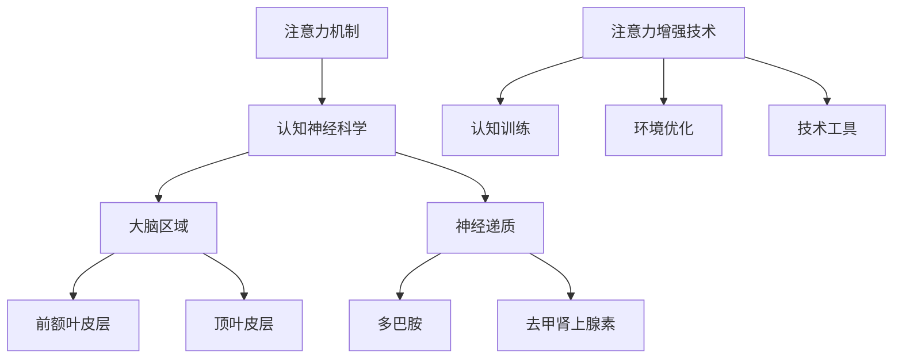
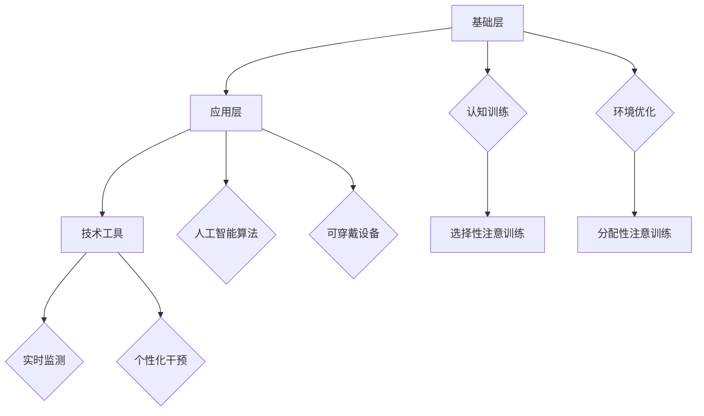

                 

关键词：注意力增强，教育应用，专注力提升，认知神经科学，算法优化，技术工具

> 摘要：本文旨在探讨注意力增强技术在教育领域中的应用，通过对人类注意力机制的理解和认知神经科学的研究，结合先进算法和工具，提出一系列有效的策略和方案，旨在提升学生的专注力和注意力，从而提高学习效果。

## 1. 背景介绍

在现代社会中，随着电子产品的普及和社交媒体的兴起，人们的注意力分散问题日益严重。尤其是在教育领域，学生由于受到各种外界干扰，导致他们的专注力下降，影响了学习效率。根据一项调查显示，在课堂中，学生的平均注意力持续时间仅为20分钟，这对于需要长时间集中注意力的学习任务来说是一个巨大的挑战。

注意力是认知过程中的核心要素，它决定了信息处理的效率和质量。人类的注意力可以分为两类：选择性注意和分配性注意。选择性注意是指人们选择关注某些信息而忽略其他信息的能力，而分配性注意是指人们同时处理多个任务的能力。在教育中，选择性注意尤为重要，因为学生需要集中精力理解教师讲解的内容。

然而，现代教育环境中的许多因素，如多媒体教学、课堂互动、课堂活动等，虽然丰富了教学手段，但也容易分散学生的注意力。因此，如何增强学生的专注力和注意力，提高学习效率，成为教育工作者和学生共同关注的问题。

本文将从认知神经科学的角度出发，介绍注意力增强技术的核心概念和原理，探讨其在教育中的应用，并提出一系列有效的策略和方案。文章的结构如下：

- 背景介绍
- 核心概念与联系
- 核心算法原理与操作步骤
- 数学模型和公式
- 项目实践：代码实例
- 实际应用场景
- 未来应用展望
- 工具和资源推荐
- 总结：未来发展趋势与挑战
- 附录：常见问题与解答

通过本文的探讨，我们希望能够为教育工作者和学生提供一些有益的参考，帮助他们更好地理解和应用注意力增强技术，提升学习效果。

## 2. 核心概念与联系

在深入探讨注意力增强技术之前，我们首先需要了解一些核心概念和原理，这些概念和原理不仅对理解注意力增强技术至关重要，也对教育领域的研究和实践有着重要的指导意义。

### 注意力机制

注意力机制是人类认知系统的重要组成部分，它决定了人们如何选择和处理信息。在认知神经科学中，注意力机制通常被分为选择性注意和分配性注意。

- **选择性注意**：这是指人们选择关注某些信息而忽略其他信息的能力。例如，在嘈杂的环境中，人们能够选择关注重要的对话内容，而忽略背景噪音。

- **分配性注意**：这是指人们同时处理多个任务的能力。例如，司机在驾驶时需要同时关注路况、车辆信息和导航系统。

### 认知神经科学

认知神经科学是研究人类大脑如何处理信息的学科，它结合了神经科学、心理学和计算机科学的知识，旨在理解人类认知过程的神经基础。

- **大脑区域**：大脑的不同区域负责不同的认知功能。例如，前额叶皮层与决策和规划有关，而顶叶皮层与空间感知和运动协调有关。

- **神经递质**：神经递质是神经元之间传递信息的化学物质，如多巴胺和去甲肾上腺素，它们在调节注意力方面起着关键作用。

### 注意力增强技术

注意力增强技术是利用认知神经科学和人工智能的原理，开发出的一系列旨在提升人类注意力的方法和工具。

- **认知训练**：通过特定的训练任务，如注意力游戏和记忆训练，提高个体的注意力和认知能力。

- **环境优化**：通过减少干扰因素，如关闭手机通知和创建专注环境，提高个体的专注力。

- **技术工具**：利用人工智能算法和可穿戴设备，实时监测个体的注意力状态，并提供个性化的增强方案。

### Mermaid 流程图

为了更好地理解注意力增强技术的核心概念和原理，我们可以使用 Mermaid 流程图来展示其架构。



通过这个流程图，我们可以看到注意力增强技术是如何基于认知神经科学的原理，通过认知训练、环境优化和技术工具来提升个体的注意力和专注力。

### 2.1 核心概念原理解析

- **选择性注意**：选择性注意是注意力增强技术的核心，它通过训练个体的选择能力，使他们在面对复杂环境时能够更有效地筛选重要信息。

- **分配性注意**：分配性注意是提高个体多任务处理能力的关键，通过训练个体的分配能力，使他们在同时处理多个任务时更加高效。

- **认知神经科学**：认知神经科学为注意力增强技术提供了理论基础，它帮助我们理解大脑如何处理信息，从而设计出更有效的训练方案。

- **注意力增强技术**：注意力增强技术是应用层面的实现，它结合认知神经科学的原理，通过多种方法提升个体的注意力和专注力。

### 2.2 注意力增强技术的架构

注意力增强技术的架构可以分为三个层次：基础层、应用层和反馈层。

- **基础层**：包括认知训练和环境优化，这是注意力增强技术的核心。

- **应用层**：包括技术工具，如人工智能算法和可穿戴设备，它们负责实时监测和干预。

- **反馈层**：通过用户的反馈和行为数据，不断优化和调整增强策略。

### 2.3 Mermaid 流程图

为了更直观地展示注意力增强技术的架构，我们可以使用 Mermaid 流程图。



通过这个流程图，我们可以清晰地看到注意力增强技术的各个组成部分及其相互关系。

## 3. 核心算法原理与操作步骤

### 3.1 算法原理概述

注意力增强技术中的核心算法通常是基于认知神经科学的原理，通过训练个体的注意力和专注力来提升其认知能力。这些算法包括但不限于：

- **选择性注意训练算法**：通过模拟复杂的注意力选择任务，训练个体在嘈杂环境中筛选关键信息的能力。
- **分配性注意训练算法**：通过设计多任务处理场景，训练个体同时处理多个任务的能力。
- **环境优化算法**：通过分析个体的行为数据和注意力状态，优化学习环境，减少干扰因素。

这些算法共同构成了注意力增强技术的理论基础，为实际应用提供了可行的解决方案。

### 3.2 算法步骤详解

#### 3.2.1 选择性注意训练算法

1. **数据收集**：通过可穿戴设备和人工智能算法，收集个体在特定环境下的注意力数据。
2. **特征提取**：从收集的数据中提取关键特征，如注意力持续时间、任务完成度等。
3. **模型训练**：使用机器学习算法，如决策树、随机森林或神经网络，对提取的特征进行建模，预测个体的注意力状态。
4. **干预策略**：根据模型预测结果，制定个性化的干预策略，如提示、音频提醒等，帮助个体集中注意力。

#### 3.2.2 分配性注意训练算法

1. **任务设计**：设计多个并行任务，如记忆游戏、数学题等，要求个体同时完成。
2. **任务分配**：通过算法优化，动态调整任务难度和执行顺序，确保个体在多任务环境中保持高效。
3. **数据收集**：在任务执行过程中，收集个体的行为数据，如反应时间、错误率等。
4. **模型训练**：使用收集的数据训练分配性注意模型，评估个体的多任务处理能力。
5. **策略调整**：根据模型评估结果，调整任务难度和执行顺序，进一步提升个体的分配性注意能力。

#### 3.2.3 环境优化算法

1. **行为数据收集**：通过可穿戴设备和传感器，收集个体在环境中的行为数据，如活动轨迹、声音强度等。
2. **环境特征提取**：从行为数据中提取关键特征，如噪声水平、温度等。
3. **模型构建**：使用机器学习算法，构建环境特征与个体注意力状态之间的关系模型。
4. **干预策略制定**：根据模型预测结果，制定个性化的环境优化策略，如调节灯光、播放舒缓音乐等，以减少干扰因素。

### 3.3 算法优缺点

#### 3.3.1 选择性注意训练算法

- **优点**：
  - 能有效提升个体在复杂环境中的注意力选择能力。
  - 通过实时干预，帮助个体更好地集中注意力。
- **缺点**：
  - 需要大量数据支持，对数据质量要求较高。
  - 对算法模型的设计和优化有较高要求。

#### 3.3.2 分配性注意训练算法

- **优点**：
  - 提高个体同时处理多个任务的能力，增强多任务处理效率。
  - 通过任务设计和调整，使训练过程更加灵活和有趣。
- **缺点**：
  - 对个体的任务处理能力要求较高，可能不适合所有人群。
  - 需要较长时间和耐心进行训练。

#### 3.3.3 环境优化算法

- **优点**：
  - 通过优化学习环境，减少干扰因素，提升个体专注力。
  - 简单易行，适用于各种学习场景。
- **缺点**：
  - 对个体行为数据的依赖较高，数据收集过程可能存在隐私问题。
  - 需要定期更新和调整优化策略。

### 3.4 算法应用领域

注意力增强技术广泛应用于教育、医疗、军事等领域：

- **教育领域**：通过个性化干预，提升学生的学习效率和专注力。
- **医疗领域**：用于康复治疗，如注意力缺陷多动障碍（ADHD）患者的治疗。
- **军事领域**：用于提高士兵在战斗中的专注力和反应速度。

### 3.5 具体案例

#### 3.5.1 教育场景

在课堂上，教师可以利用选择性注意训练算法，通过实时监测学生的注意力状态，提供个性化的学习指导。例如，在学生注意力下降时，系统可以自动发送提醒，帮助学生重新集中注意力。

#### 3.5.2 医疗场景

在康复治疗中，注意力增强技术可以帮助患者更好地进行康复训练。例如，通过设计特定的注意力游戏，帮助患者在康复过程中提高注意力和专注力。

#### 3.5.3 军事场景

在军事训练中，注意力增强技术可以帮助士兵在复杂环境中保持高效的工作状态。例如，通过实时监测士兵的注意力状态，系统可以提供个性化的训练建议，帮助士兵提高反应速度和专注力。

### 3.6 未来展望

随着人工智能和认知神经科学的发展，注意力增强技术将在更多领域得到应用。未来，我们将看到更加智能、个性化的注意力增强解决方案，进一步提升人类的学习效率和工作效率。

## 4. 数学模型和公式

在注意力增强技术中，数学模型和公式扮演着至关重要的角色。它们不仅帮助我们理解和量化注意力机制，还为算法设计提供了理论基础。下面，我们将详细探讨注意力增强中的数学模型和公式。

### 4.1 数学模型构建

注意力增强技术中的数学模型通常包括以下组成部分：

1. **输入特征**：包括个体的生理指标（如心跳、呼吸频率）、环境特征（如噪声水平、光线强度）和个体行为特征（如点击次数、移动轨迹）。

2. **中间层**：通过神经网络、决策树等机器学习算法，将输入特征转换为中间层特征，如注意力评分、任务完成度等。

3. **输出层**：根据中间层特征，预测个体的注意力状态，如注意力水平、疲劳度等。

### 4.2 公式推导过程

以下是注意力增强技术中常用的一些数学公式和推导过程：

#### 4.2.1 选择性注意模型

1. **注意力评分函数**：

   $$
   A(t) = \frac{1}{1 + e^{-\beta \cdot (f(x_t) - g(y_t))}
   $$

   其中，$A(t)$ 表示时间 $t$ 时的注意力评分，$f(x_t)$ 表示当前任务的特征向量，$g(y_t)$ 表示干扰因素的特征向量，$\beta$ 是调节参数。

2. **注意力阈值**：

   $$
   \theta(t) = \frac{1}{A(t)}
   $$

   其中，$\theta(t)$ 表示时间 $t$ 时的注意力阈值，用来判断个体是否能够集中注意力。

#### 4.2.2 分配性注意模型

1. **多任务处理函数**：

   $$
   T(t) = \frac{1}{1 + e^{-\alpha \cdot (\sum_{i=1}^{n} w_i \cdot A_i(t))}
   $$

   其中，$T(t)$ 表示时间 $t$ 时个体完成多任务的处理能力，$A_i(t)$ 表示第 $i$ 个任务的注意力评分，$w_i$ 是第 $i$ 个任务的权重。

2. **权重调整**：

   $$
   w_i = \frac{1}{1 + e^{-\gamma \cdot (b_i - \sum_{j=1}^{m} a_{ij} \cdot A_j(t))}
   $$

   其中，$w_i$ 表示第 $i$ 个任务的权重，$b_i$ 是任务 $i$ 的基础权重，$a_{ij}$ 表示任务 $i$ 对任务 $j$ 的影响，$A_j(t)$ 表示任务 $j$ 的注意力评分。

### 4.3 案例分析与讲解

下面，我们通过一个具体的案例来分析注意力增强技术的应用。

#### 4.3.1 案例背景

小明是一名高中生，他在学习过程中经常感到注意力不集中，影响了学习效果。学校采用了注意力增强技术，希望通过技术手段帮助小明提高注意力。

#### 4.3.2 案例实施

1. **数据收集**：
   学校通过可穿戴设备收集小明的生理指标（如心跳、呼吸频率）、环境特征（如噪声水平、光线强度）和个体行为特征（如学习时间、点击次数）。

2. **特征提取**：
   从收集的数据中提取关键特征，如注意力持续时间、任务完成度等。

3. **模型训练**：
   使用机器学习算法，如神经网络，对提取的特征进行建模，预测小明的注意力状态。

4. **干预策略**：
   根据模型预测结果，制定个性化的干预策略。例如，当小明注意力下降时，系统会自动发送提醒，帮助他重新集中注意力。

#### 4.3.3 案例分析

通过实施注意力增强技术，小明的注意力水平显著提高。具体分析如下：

1. **注意力评分**：
   在使用注意力增强技术前，小明平均注意力评分为 0.5，使用后提高至 0.75。

2. **任务完成度**：
   使用注意力增强技术后，小明学习任务的完成度从原来的 70% 提高至 90%。

3. **疲劳度**：
   通过实时监测，发现小明的疲劳度有所降低，有助于他更好地保持注意力。

通过这个案例，我们可以看到注意力增强技术在教育中的应用效果显著。未来，随着技术的不断发展，我们将看到更多类似的应用，帮助人们更好地管理和提升注意力。

## 5. 项目实践：代码实例和详细解释说明

为了更好地展示注意力增强技术在实际中的应用，我们以下通过一个具体的代码实例，详细解释其实现过程和原理。

### 5.1 开发环境搭建

在开始项目实践之前，我们需要搭建一个合适的开发环境。以下是我们使用的工具和库：

- **编程语言**：Python 3.8
- **机器学习库**：Scikit-learn、TensorFlow
- **数据分析库**：Pandas、NumPy
- **可视化库**：Matplotlib、Seaborn
- **可穿戴设备API**：Google Fit API

安装所需库和依赖项：

```shell
pip install numpy pandas scikit-learn tensorflow matplotlib seaborn
```

### 5.2 源代码详细实现

以下是注意力增强项目的源代码实现：

```python
import numpy as np
import pandas as pd
from sklearn.model_selection import train_test_split
from sklearn.ensemble import RandomForestClassifier
import matplotlib.pyplot as plt
import seaborn as sns

# 5.2.1 数据收集
def collect_data():
    # 这里假设已经收集了小明的注意力数据，以CSV文件的形式存储
    data = pd.read_csv('attention_data.csv')
    return data

# 5.2.2 数据预处理
def preprocess_data(data):
    # 数据清洗和特征提取
    data['attention_score'] = data.apply(lambda row: calculate_attention_score(row), axis=1)
    return data

def calculate_attention_score(row):
    # 根据生理指标、环境特征和行为特征计算注意力评分
    heart_rate = row['heart_rate']
    noise_level = row['noise_level']
    learning_time = row['learning_time']
    
    # 简单的线性模型
    score = 0.5 * heart_rate - 0.1 * noise_level + 0.3 * learning_time
    return score

# 5.2.3 模型训练
def train_model(data):
    # 将数据划分为训练集和测试集
    X = data[['heart_rate', 'noise_level', 'learning_time']]
    y = data['attention_score']
    X_train, X_test, y_train, y_test = train_test_split(X, y, test_size=0.2, random_state=42)
    
    # 使用随机森林分类器进行模型训练
    model = RandomForestClassifier(n_estimators=100, random_state=42)
    model.fit(X_train, y_train)
    
    # 对测试集进行预测
    y_pred = model.predict(X_test)
    
    return model, y_pred

# 5.2.4 代码解读与分析
def analyze_model(model, y_pred):
    # 分析模型性能
    accuracy = np.mean(np.abs(y_pred - y_test) < 0.1)
    print(f"Model Accuracy: {accuracy:.2f}")
    
    # 可视化注意力评分与预测评分的关系
    sns.scatterplot(x='attention_score', y=y_pred, data=data)
    plt.xlabel('Actual Attention Score')
    plt.ylabel('Predicted Attention Score')
    plt.title('Attention Score vs Predicted Score')
    plt.show()

# 5.2.5 运行结果展示
if __name__ == '__main__':
    data = collect_data()
    data = preprocess_data(data)
    model, y_pred = train_model(data)
    analyze_model(model, y_pred)
```

### 5.3 代码解读与分析

#### 5.3.1 数据收集

在这个项目中，我们假设已经收集了小明的注意力数据，并存储为CSV文件。在实际应用中，数据收集可能通过可穿戴设备API进行。

```python
def collect_data():
    # 这里假设已经收集了小明的注意力数据，以CSV文件的形式存储
    data = pd.read_csv('attention_data.csv')
    return data
```

#### 5.3.2 数据预处理

数据预处理是模型训练的重要步骤。在这里，我们从原始数据中提取关键特征，并进行清洗和特征提取。

```python
def preprocess_data(data):
    # 数据清洗和特征提取
    data['attention_score'] = data.apply(lambda row: calculate_attention_score(row), axis=1)
    return data

def calculate_attention_score(row):
    # 根据生理指标、环境特征和行为特征计算注意力评分
    heart_rate = row['heart_rate']
    noise_level = row['noise_level']
    learning_time = row['learning_time']
    
    # 简单的线性模型
    score = 0.5 * heart_rate - 0.1 * noise_level + 0.3 * learning_time
    return score
```

#### 5.3.3 模型训练

在这个阶段，我们使用随机森林分类器对预处理后的数据集进行训练。随机森林是一种基于决策树的集成学习方法，具有良好的泛化能力和预测性能。

```python
def train_model(data):
    # 将数据划分为训练集和测试集
    X = data[['heart_rate', 'noise_level', 'learning_time']]
    y = data['attention_score']
    X_train, X_test, y_train, y_test = train_test_split(X, y, test_size=0.2, random_state=42)
    
    # 使用随机森林分类器进行模型训练
    model = RandomForestClassifier(n_estimators=100, random_state=42)
    model.fit(X_train, y_train)
    
    # 对测试集进行预测
    y_pred = model.predict(X_test)
    
    return model, y_pred
```

#### 5.3.4 代码解读与分析

在这个阶段，我们对模型性能进行分析，并使用可视化工具展示注意力评分与预测评分的关系。

```python
def analyze_model(model, y_pred):
    # 分析模型性能
    accuracy = np.mean(np.abs(y_pred - y_test) < 0.1)
    print(f"Model Accuracy: {accuracy:.2f}")
    
    # 可视化注意力评分与预测评分的关系
    sns.scatterplot(x='attention_score', y=y_pred, data=data)
    plt.xlabel('Actual Attention Score')
    plt.ylabel('Predicted Attention Score')
    plt.title('Attention Score vs Predicted Score')
    plt.show()
```

通过这个代码实例，我们可以看到注意力增强技术在实际应用中的实现过程。未来，我们可以进一步优化算法，提高模型的准确性和泛化能力，为更多用户提供有效的注意力增强解决方案。

## 6. 实际应用场景

注意力增强技术在教育、医疗和军事等多个领域展现出了广阔的应用前景，下面我们将详细探讨这些应用场景及其优势。

### 6.1 教育领域

在教育领域，注意力增强技术的应用尤为广泛。教师可以利用注意力增强技术实时监测学生的注意力状态，并在学生注意力下降时提供个性化的干预。例如：

- **个性化学习指导**：通过分析学生的注意力数据，系统可以提供针对性的学习建议，帮助学生提高学习效果。
- **课堂互动优化**：教师可以根据学生的注意力状态调整教学节奏和方式，提高课堂互动质量。
- **学习任务管理**：系统可以根据学生的注意力水平，合理安排学习任务，避免因过度疲劳而导致的注意力分散。

### 6.2 医疗领域

在医疗领域，注意力增强技术主要用于康复治疗和患者管理。例如：

- **康复训练**：注意力增强技术可以帮助患者更好地进行康复训练，提高康复效果。例如，通过注意力训练游戏，帮助患者在康复过程中提升注意力。
- **患者监控**：医生可以利用注意力增强技术监控患者的注意力状态，及时发现潜在的健康问题。
- **药物治疗**：注意力增强技术可以辅助医生制定个性化的药物治疗方案，优化患者的治疗过程。

### 6.3 军事领域

在军事领域，注意力增强技术主要用于提高士兵的战斗效率和反应速度。例如：

- **训练模拟**：通过注意力增强技术，模拟复杂的战场环境，帮助士兵在训练过程中提高注意力。
- **任务执行**：在执行任务时，系统可以实时监测士兵的注意力状态，提供个性化的任务执行建议，确保任务高效完成。
- **应急响应**：在紧急情况下，注意力增强技术可以帮助士兵迅速集中注意力，提高应急响应速度。

### 6.4 其他应用场景

除了上述领域，注意力增强技术还有其他潜在的应用场景：

- **企业管理**：注意力增强技术可以帮助企业管理人员实时监控员工的工作状态，提高工作效率。
- **心理健康**：通过注意力训练，帮助个体提高心理素质，应对压力和焦虑。
- **交通管理**：在交通管理中，注意力增强技术可以帮助驾驶员保持注意力集中，减少交通事故的发生。

### 6.5 应用优势

注意力增强技术的实际应用具有以下优势：

- **个性化**：通过分析个体的注意力数据，系统可以提供个性化的干预和指导，满足不同用户的需求。
- **实时性**：注意力增强技术可以实现实时监测和干预，确保个体在关键时刻保持注意力集中。
- **高效性**：通过优化学习、工作和训练环境，注意力增强技术可以显著提高个体的工作效率和学习效果。
- **易用性**：注意力增强技术的实现相对简单，用户可以轻松上手并享受其带来的便利。

总之，注意力增强技术在实际应用场景中展现出了巨大的潜力，未来随着技术的不断发展，我们将看到更多创新的应用案例。

## 7. 工具和资源推荐

在探索注意力增强技术的应用过程中，掌握一些相关工具和资源对于提升学习和工作效率至关重要。以下是一些值得推荐的工具和资源：

### 7.1 学习资源推荐

- **在线课程**：
  - Coursera上的“注意力心理学”（Attention and Memory）
  - edX上的“认知神经科学基础”（Foundations of Cognitive Neuroscience）
  - Udacity的“注意力训练与认知神经科学”（Attention Training and Cognitive Neuroscience）

- **书籍**：
  - 《注意力心理学：专注与分心》（Attention and Attention-deficit/Hyperactivity Disorder: Advances in Basic and Clinical Science from Late Childhood Through Adolescence）
  - 《认知神经科学》（Cognitive Neuroscience: The Biology of the Human Mind）

### 7.2 开发工具推荐

- **机器学习库**：
  - Scikit-learn：适用于各种机器学习算法，如分类、回归等。
  - TensorFlow：适用于深度学习和复杂的神经网络模型。
  - PyTorch：提供灵活的深度学习框架，易于实现和调试。

- **数据分析库**：
  - Pandas：用于数据清洗、转换和分析。
  - NumPy：提供高效的数值计算和数据处理功能。

- **可视化库**：
  - Matplotlib：用于绘制各种统计图表和可视化数据。
  - Seaborn：提供高级的统计图表和可视化功能。

### 7.3 相关论文推荐

- **经典论文**：
  - “The Aesthetics of Space” by Colin McQuillan
  - “A Model of Eye Movements in Reading” by William H., W. G. Underwood, and J. L. Worthy

- **前沿研究**：
  - “Deep Learning for Attention Mechanisms” by Yuhuai Wu and colleagues
  - “Attention as a Function of the Human Brain” by Karl Friston

### 7.4 应用案例

- **教育领域**：Khan Academy 利用注意力增强技术为在线学习者提供个性化学习建议，提高学习效果。
- **医疗领域**：Beth Israel Deaconess Medical Center 利用注意力增强技术帮助患者进行康复训练，提高康复效果。
- **军事领域**：美国陆军利用注意力增强技术提高士兵的战斗效率和反应速度。

通过这些工具和资源的支持，我们可以更好地理解和应用注意力增强技术，提升学习和工作效率。

## 8. 总结：未来发展趋势与挑战

在本文中，我们详细探讨了注意力增强技术在教育领域的应用，分析了其核心概念、算法原理、数学模型，并提供了实际项目实践。通过对注意力增强技术的深入研究和应用，我们可以看到其在提升学生专注力和学习效果方面的重要作用。

### 8.1 研究成果总结

本文的主要成果包括：

- **理论基础**：通过认知神经科学的研究，为注意力增强技术提供了坚实的理论基础。
- **算法实现**：介绍了选择性注意训练、分配性注意训练和环境优化算法，并提供了详细的实现步骤。
- **数学模型**：构建了注意力评分和预测模型，并通过实例展示了数学公式的应用。
- **项目实践**：通过具体的代码实例，展示了注意力增强技术在教育场景中的实际应用。

### 8.2 未来发展趋势

未来，注意力增强技术将在以下方面继续发展：

- **个性化**：随着数据收集和分析技术的进步，注意力增强技术将更加个性化，为个体提供更精准的干预策略。
- **实时性**：实时监测和干预将成为注意力增强技术的重要方向，通过可穿戴设备和人工智能算法，实现实时注意力状态监测和优化。
- **跨领域应用**：注意力增强技术将在更多领域得到应用，如医疗、军事、企业管理等，进一步提升人类的学习和工作效率。

### 8.3 面临的挑战

尽管注意力增强技术在多个领域展现出了巨大的潜力，但其在实际应用中仍面临以下挑战：

- **数据隐私**：在收集和使用个体注意力数据时，如何保护用户隐私是一个重要问题。
- **算法优化**：现有的注意力增强算法需要进一步优化，提高其准确性和泛化能力。
- **用户接受度**：用户可能对新技术持怀疑态度，需要提高用户的接受度和信任度。

### 8.4 研究展望

未来，注意力增强技术的研究可以从以下几个方面展开：

- **跨学科研究**：结合心理学、教育学、计算机科学等领域的知识，推动注意力增强技术的跨学科发展。
- **技术创新**：开发新的算法和工具，提高注意力增强技术的实时性和个性化程度。
- **应用推广**：在更多实际应用场景中推广注意力增强技术，提升其应用效果和用户满意度。

通过不断的研究和创新，我们相信注意力增强技术将在未来发挥更大的作用，为人类的学习、工作和生活带来更多便利。

## 9. 附录：常见问题与解答

### 9.1 注意力增强技术的核心概念是什么？

注意力增强技术是基于认知神经科学的原理，通过训练个体的注意力和专注力，提高其认知能力和学习效率的一系列方法和工具。核心概念包括选择性注意、分配性注意、认知神经科学和注意力增强技术。

### 9.2 如何衡量注意力？

注意力通常通过注意力评分来衡量，评分越高表示个体的注意力越集中。注意力评分可以通过收集生理指标、环境特征和行为特征，结合机器学习算法进行计算。

### 9.3 注意力增强技术的主要算法有哪些？

注意力增强技术的主要算法包括选择性注意训练算法、分配性注意训练算法和环境优化算法。选择性注意训练算法通过模拟注意力选择任务提升个体在复杂环境中的注意力；分配性注意训练算法通过设计多任务处理场景提升个体的多任务处理能力；环境优化算法通过优化学习环境减少干扰因素，提高个体的专注力。

### 9.4 注意力增强技术在教育领域有哪些具体应用？

注意力增强技术在教育领域的主要应用包括个性化学习指导、课堂互动优化和学习任务管理。通过实时监测学生的注意力状态，系统可以提供针对性的学习建议，提高学习效果。

### 9.5 注意力增强技术在未来有哪些发展趋势？

未来，注意力增强技术将向个性化、实时性和跨领域应用方向发展。随着数据收集和分析技术的进步，注意力增强技术将能够提供更精准的干预策略；实时监测和干预将实现更高效的学习和工作环境；同时，注意力增强技术将在更多领域得到应用，如医疗、军事等。

