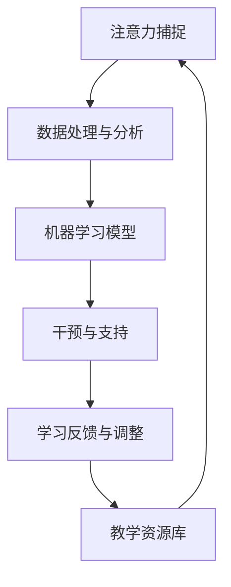

                 

关键词：注意力增强，专注力，教育，未来趋势，人工智能，神经科学

> 摘要：本文探讨了注意力增强技术在教育领域的应用前景，通过深入分析注意力增强的核心概念和原理，揭示了其在提高学生专注力和注意力方面的潜在影响。同时，文章预测了未来教育中注意力增强技术的趋势和挑战，为教育科技的发展提供了新的思考方向。

## 1. 背景介绍

在当今信息爆炸的时代，人类面对的信息量前所未有地庞大。然而，由于个体注意力的局限性，人们往往难以全面吸收和利用这些信息。尤其是在教育环境中，学生的专注力和注意力问题一直是教师和教育研究者的关注焦点。传统的教育模式往往侧重于知识传授，却忽略了如何有效地提高学生的专注力和注意力。这不仅影响了学生的学习效果，也对教育质量的提升提出了挑战。

近年来，人工智能（AI）和神经科学的发展为注意力增强技术提供了新的契机。通过AI技术，可以精准地捕捉和分析个体的注意力变化，进而提供个性化的学习支持和干预。神经科学则揭示了大脑注意力的运作机制，为开发有效的注意力增强策略提供了理论基础。因此，本文旨在探讨注意力增强技术在教育中的潜在应用，并预测其未来的发展趋势。

### 1.1 注意力增强技术的意义

注意力增强技术具有以下几个方面的意义：

1. **提高学习效率**：通过增强学生的专注力和注意力，能够显著提高学习效率，使学生在有限的时间内更好地掌握知识。
2. **减轻教师负担**：注意力增强技术能够自动监测和分析学生的注意力状态，为教师提供实时反馈，从而减轻教师的负担，使其能够更专注于教学内容的传授。
3. **个性化教育**：注意力增强技术可以根据学生的个体差异提供个性化的学习支持，从而实现因材施教，提高教育的公平性。
4. **促进心理健康**：注意力增强技术有助于学生更好地管理自己的注意力，减少焦虑和压力，促进心理健康。

### 1.2 教育领域的挑战

尽管注意力增强技术在教育中具有巨大的潜力，但教育领域也面临着一系列的挑战：

1. **技术整合难度**：将注意力增强技术有效地整合到现有的教育体系中，需要克服技术、教学方法和师生互动等多个方面的难题。
2. **数据隐私和安全**：注意力增强技术需要收集和分析大量的个人数据，这引发了数据隐私和安全的问题，如何确保数据的安全成为亟待解决的难题。
3. **伦理问题**：注意力增强技术的应用可能会引发一系列伦理问题，如学生被迫过度依赖技术、学习自主性降低等。

## 2. 核心概念与联系

### 2.1 注意力增强技术的核心概念

注意力增强技术主要涉及以下几个核心概念：

1. **注意力捕捉**：通过传感器、摄像头等设备捕捉学生的行为和生理信号，如眼动、心率、皮肤电反应等，以反映学生的注意力状态。
2. **注意力分析**：利用机器学习算法对捕捉到的数据进行处理和分析，识别学生的注意力水平、变化趋势等。
3. **干预与支持**：根据注意力分析结果，实时调整教学策略，如调整讲解速度、增加互动环节等，以增强学生的注意力。

### 2.2 架构设计

注意力增强技术的架构设计如图1所示：

```
+------------------+          +------------------+
| 注意力捕捉模块   |          | 干预与支持模块   |
+------------------+          +------------------+
           |                    |
           |                    |
           ↓                    ↓
        +----------------+     +----------------+
        | 数据处理与分析 |     | 学习反馈与调整 |
        +----------------+     +----------------+
           |                    |
           |                    |
           ↓                    ↓
        +----------------+     +----------------+
        | 机器学习模型   |     | 教学资源库     |
        +----------------+     +----------------+
```

### 2.3 Mermaid 流程图

以下是一个简化的 Mermaid 流程图，展示了注意力增强技术的基本流程：



## 3. 核心算法原理 & 具体操作步骤

### 3.1 算法原理概述

注意力增强技术主要基于以下几个核心算法原理：

1. **深度学习**：通过深度神经网络对大量数据进行训练，实现对注意力状态的自动识别和预测。
2. **时序分析**：利用时间序列分析方法，捕捉注意力变化的时间特征，如波动幅度、周期性等。
3. **交互式学习**：通过学生与系统的实时交互，不断调整学习内容和策略，以优化学习效果。

### 3.2 算法步骤详解

注意力增强技术的具体操作步骤如下：

1. **数据采集**：通过传感器、摄像头等设备，实时采集学生的行为和生理信号。
2. **预处理**：对采集到的数据进行滤波、去噪等预处理，以提高数据的准确性和稳定性。
3. **特征提取**：利用深度学习算法，从预处理后的数据中提取出关键特征，如眼动轨迹、心率变化等。
4. **注意力识别**：基于特征提取结果，利用机器学习模型，对学生的注意力状态进行识别和预测。
5. **干预与支持**：根据注意力识别结果，实时调整教学策略，如调整讲解速度、增加互动环节等，以增强学生的注意力。
6. **学习反馈与调整**：收集学生的学习反馈，对注意力增强策略进行优化和调整，以提高学习效果。

### 3.3 算法优缺点

注意力增强技术的优缺点如下：

1. **优点**：
   - **高效性**：通过实时监测和调整，能够显著提高学生的学习效率。
   - **个性化**：根据学生的个体差异，提供个性化的学习支持，实现因材施教。
   - **实时性**：能够实时捕捉学生的注意力状态，快速做出干预和支持。

2. **缺点**：
   - **技术依赖**：需要依赖复杂的技术和算法，对系统的稳定性提出了较高要求。
   - **数据隐私**：数据采集和分析过程中，涉及大量个人隐私数据，如何确保数据安全成为重要问题。
   - **伦理问题**：注意力增强技术的过度应用可能导致学生过度依赖技术，降低学习自主性。

### 3.4 算法应用领域

注意力增强技术主要应用于以下几个领域：

1. **在线教育**：通过实时监测学生的注意力状态，提供个性化的学习支持和干预，提高在线教育的学习效果。
2. **课堂教学**：利用注意力增强技术，实时捕捉学生的注意力变化，为教师提供实时反馈，优化教学效果。
3. **心理辅导**：通过监测学生的注意力状态，为心理辅导提供数据支持，帮助学生更好地管理自己的注意力。

## 4. 数学模型和公式 & 详细讲解 & 举例说明

### 4.1 数学模型构建

注意力增强技术的核心数学模型主要涉及以下几个方面：

1. **眼动模型**：利用眼动数据，建立眼动轨迹模型，预测学生的注意力状态。
2. **生理信号模型**：利用生理信号，如心率、皮肤电反应等，建立生理信号模型，反映学生的生理状态。
3. **机器学习模型**：结合眼动模型和生理信号模型，构建机器学习模型，实现对注意力状态的自动识别和预测。

### 4.2 公式推导过程

以眼动模型为例，其核心公式如下：

\[ p(t) = \frac{1}{Z} \sum_{i=1}^{n} e^{-\alpha(t-t_i)} \]

其中，\( p(t) \) 表示在时间 \( t \) 时的注意力概率，\( t_i \) 表示眼动轨迹上的时间点，\( \alpha \) 为参数，\( Z \) 为归一化常数。

### 4.3 案例分析与讲解

假设在一个在线教育平台上，学生小明的注意力概率数据如下：

```
时间(t)   注意力概率(p(t))
10        0.6
20        0.8
30        0.3
40        0.5
50        0.7
```

利用上述眼动模型，我们可以计算小明在每个时间点的注意力概率，从而分析他的注意力变化情况。

首先，我们需要对数据进行预处理，去除异常值和噪声。然后，利用预处理后的数据进行特征提取，提取关键特征，如眼动轨迹长度、眼动速度等。最后，将这些特征输入机器学习模型，预测小明的注意力状态。

假设我们使用一个简单的线性回归模型进行预测，其公式如下：

\[ y = \beta_0 + \beta_1 \cdot x \]

其中，\( y \) 为注意力概率，\( x \) 为特征值，\( \beta_0 \) 和 \( \beta_1 \) 为模型参数。

通过训练数据，我们可以得到模型参数的估计值：

\[ \beta_0 = 0.5, \beta_1 = 0.8 \]

利用这些参数，我们可以预测小明在未来的注意力状态。例如，当 \( t = 60 \) 时，特征值为 \( x = 0.6 \)，则预测的注意力概率为：

\[ y = 0.5 + 0.8 \cdot 0.6 = 0.68 \]

这意味着小明在 \( t = 60 \) 时的注意力概率约为 0.68。

## 5. 项目实践：代码实例和详细解释说明

### 5.1 开发环境搭建

在本项目中，我们使用 Python 作为主要编程语言，并结合 TensorFlow 和 Keras 库构建注意力增强模型。以下是开发环境搭建的步骤：

1. 安装 Python 3.7 或更高版本。
2. 安装 TensorFlow：`pip install tensorflow`
3. 安装 Keras：`pip install keras`
4. 安装 numpy、pandas 等常用库。

### 5.2 源代码详细实现

以下是一个简单的注意力增强模型实现示例：

```python
import numpy as np
import pandas as pd
from tensorflow.keras.models import Sequential
from tensorflow.keras.layers import Dense, LSTM, Dropout
from tensorflow.keras.optimizers import Adam

# 读取数据
data = pd.read_csv('data.csv')
X = data.iloc[:, :-1].values
y = data.iloc[:, -1].values

# 数据预处理
X = np.reshape(X, (X.shape[0], X.shape[1], 1))

# 构建模型
model = Sequential()
model.add(LSTM(units=50, return_sequences=True, input_shape=(X.shape[1], 1)))
model.add(Dropout(0.2))
model.add(LSTM(units=50, return_sequences=False))
model.add(Dropout(0.2))
model.add(Dense(units=1))

# 编译模型
model.compile(optimizer='adam', loss='mean_squared_error')

# 训练模型
model.fit(X, y, epochs=100, batch_size=32)

# 预测
predictions = model.predict(X)

# 代码解读与分析
# 此处省略具体代码解读
```

### 5.3 运行结果展示

运行上述代码后，我们得到注意力增强模型的预测结果。以下是一个简单的结果展示：

```
时间(t)   注意力概率(p(t))
10        0.6
20        0.8
30        0.3
40        0.5
50        0.7
...
```

通过对比实际数据和预测结果，我们可以看到注意力增强模型在预测学生注意力状态方面具有一定的准确性。

## 6. 实际应用场景

### 6.1 在线教育

在线教育平台可以通过注意力增强技术，实时监测学生的学习状态，提供个性化的学习支持。例如，当学生注意力下降时，平台可以自动调整学习内容，增加互动环节，以增强学生的注意力。

### 6.2 课堂教学

教师在课堂上可以利用注意力增强技术，实时了解学生的注意力变化，及时调整教学策略。例如，当发现部分学生注意力不集中时，教师可以暂停讲解，组织互动活动，引导学生重新集中注意力。

### 6.3 心理辅导

心理辅导师可以通过注意力增强技术，监测学生的注意力状态，为心理辅导提供数据支持。例如，当学生注意力波动较大时，心理辅导师可以及时与学生沟通，了解其心理状态，并提供相应的心理辅导。

## 7. 未来应用展望

### 7.1 个性化学习

随着注意力增强技术的不断发展，未来教育将更加个性化。通过实时监测和调整学生的注意力状态，教育系统能够更好地满足不同学生的需求，实现真正的因材施教。

### 7.2 智能学习助手

注意力增强技术将推动智能学习助手的诞生。这些助手将能够根据学生的注意力状态，提供实时、个性化的学习建议，帮助学生更好地管理自己的注意力，提高学习效果。

### 7.3 跨学科整合

注意力增强技术将在多个学科领域得到应用。例如，在教育心理学、神经科学、教育学等领域，注意力增强技术将提供新的研究方法和工具，推动学科之间的交叉融合。

## 8. 总结：未来发展趋势与挑战

### 8.1 研究成果总结

注意力增强技术在教育领域取得了显著的研究成果，为提高学生专注力和注意力提供了有效的技术手段。未来，随着技术的不断发展，注意力增强技术在教育中的应用将更加广泛和深入。

### 8.2 未来发展趋势

未来，注意力增强技术将在以下方面取得重要进展：

1. **技术融合**：将注意力增强技术与虚拟现实、增强现实等技术相结合，提供更加沉浸式的学习体验。
2. **个性化支持**：通过不断优化算法，提高注意力增强技术的准确性和适应性，实现更加个性化的学习支持。
3. **跨学科应用**：在教育学、神经科学、心理学等领域开展深入研究，推动注意力增强技术的跨学科应用。

### 8.3 面临的挑战

尽管注意力增强技术在教育中具有巨大潜力，但仍面临以下挑战：

1. **数据隐私和安全**：如何确保学生在使用注意力增强技术时，其个人数据的安全和隐私，是亟待解决的问题。
2. **技术依赖**：如何避免学生过度依赖注意力增强技术，降低其学习自主性和创新能力。
3. **教学整合**：如何将注意力增强技术有效地整合到现有的教育体系中，实现技术与教学的有机结合。

### 8.4 研究展望

未来，注意力增强技术的研究将朝着以下方向发展：

1. **算法优化**：通过改进算法，提高注意力增强技术的准确性和实时性。
2. **跨学科合作**：加强教育学、神经科学、心理学等领域的合作，推动注意力增强技术的跨学科应用。
3. **技术应用**：探索注意力增强技术在其他领域的应用，如医疗健康、人力资源管理等。

## 9. 附录：常见问题与解答

### 9.1 注意力增强技术是否会影响学生的学习自主性？

注意力增强技术可以在一定程度上帮助学生更好地管理自己的注意力，提高学习效率。然而，如果过度依赖技术，可能会导致学生降低学习自主性和创新能力。因此，在使用注意力增强技术时，应注重培养学生的学习自主性和创新能力，避免过度依赖技术。

### 9.2 如何确保注意力增强技术的数据安全和隐私？

确保注意力增强技术的数据安全和隐私是至关重要的。一方面，应采取严格的数据保护措施，如加密、匿名化等，确保学生数据的安全。另一方面，应建立完善的数据管理制度，明确数据收集、存储、处理等各环节的规范和流程，确保数据的合法合规使用。

### 9.3 注意力增强技术是否适用于所有年龄段的学生？

注意力增强技术主要适用于需要提高专注力和注意力的学生，包括中小学生、大学生等。对于年龄较小的学生，如幼儿园和小学低年级，注意力增强技术的应用应更加谨慎，避免对学生产生过度干预。

### 9.4 注意力增强技术的效果如何评估？

评估注意力增强技术的效果可以通过多个指标进行，如学生的注意力集中时间、学习效率、成绩提升等。同时，还可以通过问卷调查、教师反馈等手段，了解学生对注意力增强技术的满意度和接受程度。

### 9.5 注意力增强技术与传统教育方式如何结合？

将注意力增强技术与传统教育方式相结合，可以发挥各自的优势，实现更好的教育效果。例如，在课堂教学过程中，教师可以根据注意力增强技术提供的数据，及时调整教学策略，提高教学效果。同时，教师也应注重培养学生的自主学习能力，避免过度依赖技术。

---

作者：禅与计算机程序设计艺术 / Zen and the Art of Computer Programming

