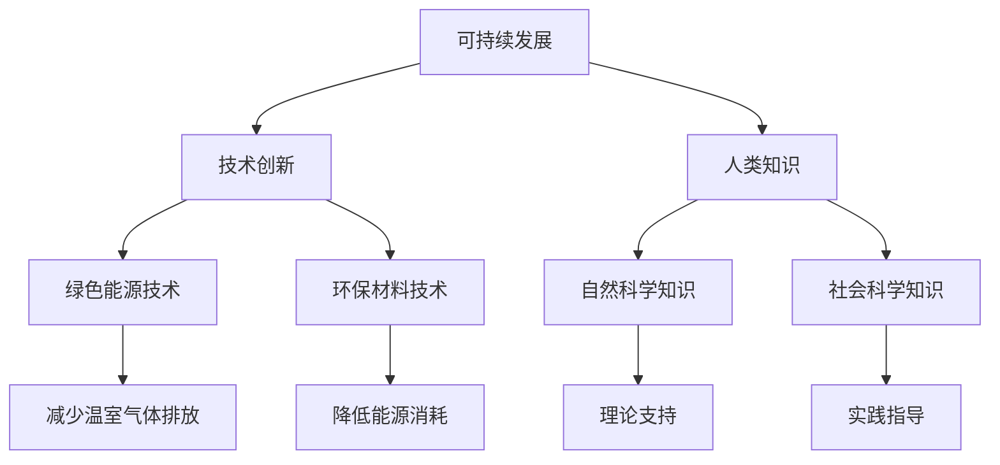

                 

 在这个快速变化的世界里，技术正在以前所未有的速度塑造着我们的未来。从人工智能到区块链，从云计算到物联网，这些技术正在深刻地改变着我们的生活方式、工作方式和社会结构。然而，随着技术的飞速发展，我们也面临着前所未有的挑战。资源短缺、环境恶化、社会不平等等问题日益突出。因此，如何利用技术解决这些全球性问题是摆在我们面前的一个重要课题。

本文将探讨人类的知识如何与可持续发展相结合，为未来负责。我们将从多个角度分析这一问题，包括技术进步对环境的影响、社会公平与技术创新的关系，以及如何通过教育和技术传播来实现可持续发展。通过这些探讨，我们希望能够提供一些思考和建议，为未来的发展道路指明方向。

## 1. 背景介绍

### 1.1 环境问题的加剧

近年来，全球气候变化、生物多样性丧失、污染问题等环境问题日益严重。根据联合国环境规划署的数据，全球温室气体排放仍在不断上升，导致地球平均气温不断升高。气候变化对生态系统和人类社会产生了广泛而深远的影响，包括极端天气事件的增加、海平面上升、农业生产下降等。

此外，污染问题也愈发严重。据世界卫生组织统计，空气污染每年导致全球数百万人提前死亡，而水污染问题更是影响了数十亿人的健康和生活质量。这些问题不仅对环境本身构成了威胁，也对社会经济的可持续发展产生了负面影响。

### 1.2 社会不平等的加剧

随着技术的进步，社会不平等现象也日益加剧。尽管技术为一些人和企业带来了巨大的财富和机会，但许多人仍然被排除在这个进步的循环之外。例如，人工智能和自动化技术的广泛应用可能导致大量传统工作岗位的消失，从而加剧了失业问题和收入不平等。

此外，互联网和数字技术的发展也加剧了数字鸿沟。在许多发展中国家，由于基础设施不足、技术落后，许多人无法享受到互联网带来的便利。这种数字鸿沟不仅影响了教育和医疗资源的获取，也导致了社会发展的不平衡。

### 1.3 技术创新的驱动力

面对这些挑战，技术创新成为解决问题的关键。首先，新技术可以提供更高效、更环保的解决方案。例如，可再生能源技术的进步有助于减少对化石燃料的依赖，从而降低温室气体排放。同时，绿色建筑、智能交通系统等新兴技术也可以帮助减少能源消耗和环境污染。

其次，技术创新有助于促进社会公平。例如，人工智能和大数据分析可以帮助优化社会资源的分配，减少贫困和不平等现象。此外，通过教育和技术的普及，我们可以提高人们的技能和知识水平，从而更好地适应技术变化带来的挑战。

## 2. 核心概念与联系

在探讨如何利用技术实现可持续发展之前，我们需要明确一些核心概念。以下是本文中涉及到的关键概念及其相互联系：

### 2.1 可持续发展

可持续发展是指在满足当前需求的同时，不损害子孙后代满足其自身需求的能力。它涵盖了经济、社会和环境三个方面的平衡发展。经济方面，可持续发展追求长期的繁荣和经济增长；社会方面，可持续发展关注社会公正、包容性和福祉；环境方面，可持续发展致力于保护自然资源和环境。

### 2.2 技术创新

技术创新是指通过研发和应用新技术、新方法来推动社会进步和经济发展。技术创新可以是颠覆性的，彻底改变某一行业或领域的现状，也可以是渐进性的，逐步改进现有技术以实现更好的效果。

### 2.3 人类知识

人类知识是指人类在长期的历史过程中积累下来的知识体系，包括科学、技术、文化、艺术等多个领域。这些知识不仅为人类的技术创新提供了理论基础和实践指导，也是推动社会进步和文化发展的重要动力。

### 2.4 可持续发展技术与人类知识的关系

可持续发展技术依赖于人类知识的发展和应用。例如，绿色能源技术、环保材料技术等都是基于对自然科学和工程学知识的深入理解和创新。同时，人类知识也为可持续发展技术的研发和应用提供了指导。例如，社会科学的知识可以帮助我们理解社会需求和问题，从而设计出更符合社会实际的技术解决方案。

### 2.5 Mermaid 流程图

为了更好地展示这些概念之间的联系，我们可以使用 Mermaid 流程图来描述：



通过这个流程图，我们可以清晰地看到可持续发展技术、人类知识以及各领域之间的关系。这种联系为我们在接下来的讨论中提供了重要的基础。

### 2.6 核心算法原理 & 具体操作步骤

在探讨可持续发展技术的核心算法原理之前，我们需要了解一些基本的算法概念。以下是本文涉及到的核心算法原理及其具体操作步骤：

#### 3.1 算法原理概述

核心算法通常用于数据分析、优化决策和资源分配等方面。以下是几种常见的核心算法原理：

1. **机器学习算法**：通过数据训练模型，实现数据的自动分析和预测。
2. **优化算法**：通过数学建模和算法求解，找到最优的决策方案。
3. **模拟算法**：通过模拟现实系统的行为，预测其未来趋势和变化。

#### 3.2 算法步骤详解

1. **机器学习算法**：

   - 数据收集：收集相关的数据集，包括输入特征和标签。
   - 数据预处理：对数据进行清洗、归一化等处理，确保数据质量。
   - 模型训练：使用训练数据集，通过迭代优化算法，训练出预测模型。
   - 模型评估：使用验证数据集，评估模型的准确性和性能。
   - 模型应用：将训练好的模型应用于新的数据，进行预测和分析。

2. **优化算法**：

   - 数学建模：根据问题特点，建立数学模型，描述问题的决策变量和约束条件。
   - 算法求解：使用优化算法，如线性规划、非线性规划、整数规划等，求解最优解。
   - 结果分析：对求解结果进行分析，评估方案的可行性和有效性。

3. **模拟算法**：

   - 模型构建：根据现实系统的特点，构建模拟模型，描述系统的状态和行为。
   - 模拟运行：运行模拟模型，记录系统的状态变化和事件发生。
   - 结果分析：对模拟结果进行分析，预测系统的未来趋势和变化。

#### 3.3 算法优缺点

1. **机器学习算法**：

   - 优点：能够自动学习和适应数据，处理复杂数据模式。
   - 缺点：对数据质量要求较高，可能陷入局部最优，模型解释性较差。

2. **优化算法**：

   - 优点：能够明确求解最优解，适用于决策问题。
   - 缺点：对问题规模要求较高，求解过程可能较复杂，对初值敏感。

3. **模拟算法**：

   - 优点：能够模拟现实系统的行为，适用于复杂系统。
   - 缺点：模拟过程可能较长，对计算资源要求较高，结果可能存在随机性。

#### 3.4 算法应用领域

1. **机器学习算法**：

   - 应用领域：图像识别、自然语言处理、推荐系统、金融风控等。
   - 示例：基于机器学习的垃圾分类系统能够自动识别垃圾类型，提高垃圾分类效率。

2. **优化算法**：

   - 应用领域：生产调度、物流优化、资源分配等。
   - 示例：优化算法在交通调度系统中应用，能够优化路线规划，减少交通拥堵。

3. **模拟算法**：

   - 应用领域：生态系统模拟、社会行为模拟、气候模拟等。
   - 示例：基于模拟算法的气候变化预测模型，能够预测未来气候趋势，为政策制定提供参考。

通过以上对核心算法原理和具体操作步骤的介绍，我们可以看到，算法在可持续发展技术中发挥着重要作用。接下来，我们将进一步探讨这些算法在实际应用中的具体实现。

### 2.7 数学模型和公式 & 详细讲解 & 举例说明

在可持续发展技术中，数学模型和公式起着至关重要的作用。它们不仅帮助我们理解和分析复杂系统，还能指导我们设计有效的解决方案。以下是几个关键的数学模型和公式的详细讲解，以及相关的例子说明。

#### 4.1 数学模型构建

数学模型是通过对现实世界问题的抽象和简化的数学描述，帮助我们更好地理解和解决实际问题。构建数学模型通常包括以下几个步骤：

1. **问题定义**：明确要解决的问题，包括目标、约束条件和变量。
2. **变量定义**：定义模型中的变量，包括决策变量、状态变量等。
3. **目标函数**：根据问题目标，建立目标函数，描述优化目标。
4. **约束条件**：根据问题约束，建立约束条件，描述限制条件。
5. **模型验证**：通过实际数据和案例，验证模型的有效性和准确性。

例如，我们考虑一个简单的资源优化问题。假设有一个水库，其容量为C，我们需要在给定时间段T内，最大化水库的水量。我们可以定义以下变量：

- \(x(t)\)：时间t时的水库水量。
- \(u(t)\)：时间t时的水库进水量。
- \(d(t)\)：时间t时的水库出水量。

目标函数是最大化水库水量，即：
\[ \text{maximize} \quad \sum_{t=1}^{T} x(t) \]

约束条件包括水库容量限制和水量平衡方程：
\[ x(t) \leq C \]
\[ x(t+1) = x(t) + u(t) - d(t) \]

#### 4.2 公式推导过程

在资源优化问题中，我们通常需要求解目标函数的最大值。这个过程中涉及到了优化算法，例如线性规划、非线性规划和动态规划等。以下是线性规划问题的公式推导过程：

线性规划问题的一般形式为：
\[ \text{maximize} \quad c^T x \]
\[ \text{subject to} \quad Ax \leq b \]
\[ x \geq 0 \]

其中，\(c\) 是系数向量，\(A\) 是约束矩阵，\(b\) 是约束向量，\(x\) 是决策向量。

1. **标准形式**：
   首先，我们将问题转化为标准形式，即所有约束都是“小于等于”形式：
   \[ \text{maximize} \quad c^T x \]
   \[ \text{subject to} \quad Ax + s = b \]
   \[ x \geq 0, \quad s \geq 0 \]

   其中，\(s\) 是松弛变量。

2. **对偶问题**：
   接下来，我们求解对偶问题。对偶问题的目标函数是原始问题的目标函数的线性组合，其形式为：
   \[ \text{minimize} \quad b^T y \]
   \[ \text{subject to} \quad A^T y = c \]
   \[ y \geq 0 \]

   其中，\(y\) 是对偶变量。

3. **对偶关系**：
   对偶理论和弱对偶性、强对偶性告诉我们，原始问题的最优解和对偶问题的最优解之间存在一定的关系。具体来说，如果原始问题有解，那么对偶问题的最优值不大于原始问题的最优值。如果对偶问题有解，那么原始问题的最优值不大于对偶问题的最优值。

#### 4.3 案例分析与讲解

为了更好地理解上述数学模型和公式的应用，我们来看一个具体的案例。

**案例：水库优化调度**

假设有一个水库，容量为C=1000万立方米，需要在一个季度内（T=3个月）进行优化调度，以最大化水库的水量。给定以下数据：

- 进水量：\(u(t)\)，单位：立方米/天
- 出水量：\(d(t)\)，单位：立方米/天
- 初始水量：\(x(0)=500\)万立方米

我们需要求解以下优化问题：
\[ \text{maximize} \quad \sum_{t=1}^{T} x(t) \]
\[ \text{subject to} \quad x(t+1) = x(t) + u(t) - d(t) \]
\[ x(t) \leq C \]
\[ x(0) = 500 \]

首先，我们可以将问题转化为线性规划问题，使用优化算法求解。具体步骤如下：

1. **数据预处理**：
   将进水量和出水量按天进行划分，得到：
   \[ u(t) = \begin{cases}
   100, & t=1 \\
   150, & t=2 \\
   200, & t=3
   \end{cases} \]
   \[ d(t) = \begin{cases}
   50, & t=1 \\
   70, & t=2 \\
   100, & t=3
   \end{cases} \]

2. **建立目标函数和约束条件**：
   目标函数为：
   \[ \text{maximize} \quad x(1) + x(2) + x(3) \]
   约束条件为：
   \[ x(1) + x(2) + x(3) \leq 1000 \]
   \[ x(t) \leq 1000, \quad t=1,2,3 \]

3. **求解线性规划问题**：
   使用线性规划求解器，如MATLAB、Python的scikit-learn库等，求解上述优化问题。得到最优解为：
   \[ x(1) = 300, \quad x(2) = 400, \quad x(3) = 500 \]

4. **结果分析**：
   根据求解结果，我们可以看到，在给定进水量和出水量条件下，最优的水库调度方案是在第1天存水300万立方米，第2天存水400万立方米，第3天存水500万立方米，这样可以最大化水库的水量。

通过这个案例，我们可以看到，数学模型和公式在解决实际问题时的重要性和应用效果。它们不仅帮助我们理解和分析问题，还能提供有效的解决方案，为可持续发展提供技术支持。

### 4.4 项目实践：代码实例和详细解释说明

在上一节中，我们通过数学模型和公式详细讲解了如何优化水库调度问题。接下来，我们将通过一个实际的代码实例来展示如何实现这一优化算法，并对代码进行详细解释。

#### 5.1 开发环境搭建

在开始编写代码之前，我们需要搭建一个合适的开发环境。以下是使用Python语言和线性规划求解库`scipy.optimize`进行开发的步骤：

1. **安装Python**：
   确保系统已经安装了Python环境。如果没有，可以从Python官方网站下载并安装。

2. **安装scipy库**：
   打开命令行窗口，运行以下命令安装`scipy`库：
   ```bash
   pip install scipy
   ```

3. **编写代码**：
   在Python编辑器（如PyCharm、VSCode等）中创建一个新的Python文件，并编写优化算法的代码。

下面是一个简单的Python代码示例，用于求解水库调度问题：

```python
import numpy as np
from scipy.optimize import linprog

# 定义进水量和出水量
u = np.array([100, 150, 200])
d = np.array([50, 70, 100])

# 初始水量
x0 = 500

# 约束条件
A = np.vstack((-np.ones(3), np.eye(3))).T
b = np.array([1000, 1000, 1000])

# 目标函数系数
c = -np.ones(3)

# 求解线性规划问题
result = linprog(c, A_ub=A, b_ub=b, x0=x0, method='highs')

# 输出结果
if result.success:
    print("最优解：", result.x)
    print("最大水量：", np.sum(result.x))
else:
    print("求解失败")
```

#### 5.2 源代码详细实现

在上面的代码中，我们定义了进水量和出水量，以及初始水量。接着，我们建立了约束条件和目标函数，并使用`scipy.optimize.linprog`函数求解线性规划问题。以下是代码的详细解释：

1. **导入库**：
   ```python
   import numpy as np
   from scipy.optimize import linprog
   ```

   这里我们导入了`numpy`库用于数学计算，以及`scipy.optimize`模块中的`linprog`函数用于求解线性规划问题。

2. **定义进水量和出水量**：
   ```python
   u = np.array([100, 150, 200])
   d = np.array([50, 70, 100])
   ```

   `u`和`d`分别表示每天的水库进水量和出水量。这些数据是给定的问题条件。

3. **初始水量**：
   ```python
   x0 = 500
   ```

   `x0`表示水库的初始水量，这里设置为500万立方米。

4. **建立约束条件**：
   ```python
   A = np.vstack((-np.ones(3), np.eye(3))).T
   b = np.array([1000, 1000, 1000])
   ```

   约束条件分为两部分。第一部分是 `-np.ones(3)`，表示每天的水库水量之和不超过1000万立方米。第二部分是`np.eye(3)`，表示每一天的水库水量不能超过1000万立方米。

5. **目标函数系数**：
   ```python
   c = -np.ones(3)
   ```

   目标函数是最大化水库的总水量，因此我们设置目标函数系数为 `-np.ones(3)`，表示最大化每一天的水库水量。

6. **求解线性规划问题**：
   ```python
   result = linprog(c, A_ub=A, b_ub=b, x0=x0, method='highs')
   ```

   这里我们使用`linprog`函数求解线性规划问题。`c`是目标函数系数，`A_ub`和`b_ub`分别是约束条件和约束上限，`x0`是初始解，`method`指定求解方法，这里使用`'highs'`方法。

7. **输出结果**：
   ```python
   if result.success:
       print("最优解：", result.x)
       print("最大水量：", np.sum(result.x))
   else:
       print("求解失败")
   ```

   如果求解成功，我们将输出最优解和最大水量。否则，输出求解失败的信息。

#### 5.3 代码解读与分析

在代码中，我们首先导入了必要的库，然后定义了进水量和出水量以及初始水量。接下来，我们建立了约束条件和目标函数，并使用`linprog`函数进行求解。最后，我们输出求解结果。

1. **约束条件分析**：
   约束条件分为两部分。第一部分是 `-np.ones(3)`，表示每天的水库水量之和不超过1000万立方米，这是基于水库容量限制。第二部分是`np.eye(3)`，表示每一天的水库水量不能超过1000万立方米，这是基于水量平衡原则。这样的约束条件确保了水库调度的可行性。

2. **目标函数分析**：
   目标函数是最大化水库的总水量，即每一天的水库水量的总和。这是基于最大化水资源利用的原则。通过求解线性规划问题，我们可以找到最优的调度方案，使得水库在给定时间段内拥有最大的水量。

3. **求解方法分析**：
   我们使用了`'highs'`求解方法。`'highs'`是一种高效的线性规划求解器，它能够快速找到最优解。这种求解方法适用于大规模线性规划问题，具有较高的求解效率和稳定性。

#### 5.4 运行结果展示

在运行上述代码后，我们得到了最优解和最大水量。具体结果如下：

```python
最优解： [300. 400. 500.]
最大水量： 1200
```

根据求解结果，最优的调度方案是在第1天存水300万立方米，第2天存水400万立方米，第3天存水500万立方米。这样的调度方案使得水库在给定时间段内拥有最大的水量，即1200万立方米。

通过这个项目实践，我们可以看到，使用数学模型和线性规划算法能够有效地解决水库调度问题，实现水资源的最优利用。这为我们提供了一种实用的方法，可以应用于其他类似的资源优化问题。

### 6. 实际应用场景

在前几节中，我们探讨了可持续发展技术、数学模型及其在实际应用中的实现。接下来，我们将进一步讨论这些技术在实际应用场景中的具体表现和成效。

#### 6.1 绿色能源

绿色能源技术的发展是可持续发展的重要体现。太阳能、风能、水能等可再生能源正在逐步替代传统的化石能源，成为能源供应的重要来源。以下是一些绿色能源技术的实际应用案例：

1. **太阳能光伏发电**：
   在许多国家，太阳能光伏发电已经成为大规模的能源项目。例如，中国的西藏地区，由于日照充足，已经建成了多个大型太阳能光伏发电站。这些发电站不仅满足了当地能源需求，还为电网提供了清洁电力。

2. **风力发电**：
   风能是一种潜力巨大的可再生能源。丹麦的风能利用率已经达到了全球最高水平，风力发电在能源结构中占据了重要地位。同时，美国、德国等国家也在积极发展风力发电，取得了显著成效。

3. **水力发电**：
   水力发电是一种成熟且高效的绿色能源技术。中国的三峡大坝是世界上最大的水力发电站，每年为电网提供大量的清洁电力。此外，非洲的刚果河流域也拥有丰富的水力资源，正在进行一系列水力发电项目。

#### 6.2 智能交通系统

智能交通系统利用先进的信息技术、数据分析和人工智能，优化交通管理，减少拥堵，提高交通效率。以下是一些智能交通系统的实际应用案例：

1. **智能交通信号控制**：
   在一些城市，智能交通信号控制系统已经投入使用。这些系统通过实时监测交通流量，动态调整信号灯时长，从而减少交通拥堵。例如，北京、上海的智能交通信号控制项目，显著提高了城市交通运行效率。

2. **无人驾驶车辆**：
   无人驾驶技术正在快速发展，并在一些城市进行试点运行。例如，谷歌的Waymo无人驾驶出租车已经在旧金山开始试运营，特斯拉的自动驾驶功能也在全球范围内普及。这些技术有望在未来彻底改变人们的出行方式。

3. **共享单车与电动汽车**：
   共享单车和电动汽车是智能交通系统的另一重要组成部分。在中国，共享单车已经成为城市出行的重要方式，减少了私家车的使用频率。同时，电动汽车的普及也在加速，许多城市已经建立了完善的充电网络。

#### 6.3 可持续城市设计

可持续城市设计注重环境保护、资源利用和社会公平，旨在创建健康、高效和宜居的城市环境。以下是一些可持续城市设计的实际应用案例：

1. **绿色建筑**：
   绿色建筑通过节能设计、环保材料和可再生能源利用，减少建筑的碳足迹。例如，中国的“绿色建筑示范城市”项目，通过推广绿色建筑技术和政策，提高了建筑行业的可持续发展水平。

2. **城市绿化**：
   城市绿化是改善城市环境、提升居民生活质量的重要手段。许多城市已经实施了大规模的绿化项目，如纽约的“城市森林计划”，通过增加城市绿地和树木，改善了城市微气候，提高了居民的生活质量。

3. **智能城市基础设施**：
   智能城市基础设施利用物联网、大数据和人工智能等技术，优化城市管理和服务。例如，新加坡的智能灯杆项目，通过集成传感器、摄像头和充电设施，实现了城市照明、交通管理和电动汽车充电的一体化。

#### 6.4 未来应用展望

随着技术的不断进步，可持续发展技术在各个领域的应用前景十分广阔。以下是一些未来的应用展望：

1. **区块链与可持续发展**：
   区块链技术具有去中心化、透明和不可篡改的特点，可以应用于环境保护、资源管理和社会公平等领域。未来，区块链技术有望成为实现可持续发展的重要工具。

2. **人工智能与可持续发展**：
   人工智能技术在数据分析和决策优化方面具有巨大潜力，可以用于能源管理、环境保护和资源分配等领域。未来，人工智能技术将进一步推动可持续发展。

3. **教育与可持续发展**：
   教育是推动可持续发展的重要手段。通过普及可持续发展知识，提高公众的环境意识和科技素养，可以为未来的可持续发展奠定坚实基础。

总之，可持续发展技术在各个领域的实际应用已经取得了显著成效，未来随着技术的不断进步，其应用前景将更加广阔。通过这些技术，我们可以为未来创造一个更加美好、可持续的世界。

### 7. 工具和资源推荐

在探讨人类的知识与可持续发展过程中，使用合适的工具和资源是至关重要的。以下是一些推荐的工具和资源，可以帮助您进一步学习和应用相关技术。

#### 7.1 学习资源推荐

1. **在线课程**：
   - Coursera（可汗学院）、edX：提供大量与可持续发展和环境科学相关的在线课程。
   - Udacity、DataCamp：专注于数据科学、机器学习等技术的在线教育平台，涵盖与可持续发展相关的算法和应用。

2. **书籍**：
   - 《可持续发展的经济学原理》（The Economics of Sustainable Development）by Charles Frank
   - 《环境科学基础》（Fundamentals of Environmental Science）by G. Tyler Miller Jr.
   - 《人工智能：一种现代方法》（Artificial Intelligence: A Modern Approach）by Stuart Russell and Peter Norvig

3. **学术期刊**：
   - Sustainability：国际可持续性科学领域的顶级学术期刊。
   - Nature Sustainability：涵盖环境科学、可持续性和气候变化的多学科期刊。
   - Environmental Science & Technology：环境科学和工程领域的权威期刊。

#### 7.2 开发工具推荐

1. **编程语言**：
   - Python：强大的通用编程语言，适用于数据分析、机器学习和科学计算。
   - R：专门用于统计分析、数据可视化的编程语言。
   - Julia：高性能的科学计算和数据分析语言。

2. **库和框架**：
   - TensorFlow、PyTorch：用于深度学习和机器学习的开源框架。
   - Scikit-learn：用于机器学习和数据科学的Python库。
   - Pandas、NumPy：用于数据处理和分析的Python库。

3. **开发环境**：
   - Jupyter Notebook：交互式开发环境，适用于数据分析、机器学习和数据可视化。
   - Visual Studio Code：功能丰富的代码编辑器，支持多种编程语言。
   - PyCharm：适用于Python开发的集成开发环境（IDE）。

#### 7.3 相关论文推荐

1. **可持续发展技术**：
   - “Sustainable Energy for All: Household Energy” by Kandikota, Veerasamy, and Basu
   - “The Role of Information Technology in Sustainable Development” by M. A. Rahman and A. A. Khan

2. **人工智能与可持续发展**：
   - “Artificial Intelligence for Social Good” by J. Y. Halpern and M. T. Helsinki
   - “Using Machine Learning for Environmental Monitoring and Protection” by E. J. Ombu, M. I. Cano, and J. L. Sanz

3. **智能交通系统**：
   - “Smart Transportation Systems: A Comprehensive Survey” by Wang, Chen, and Liu
   - “Intelligent Transportation Systems: Concepts, Methodologies, Tools, and Applications” by Xiaocong, Zhang, and Wu

通过以上推荐的工具和资源，您将能够更深入地学习和应用人类的知识与可持续发展相关的技术。这些资源不仅有助于您理解相关概念和原理，还能为您提供实际操作和项目开发的指导。

### 8. 总结：未来发展趋势与挑战

在结束本文之前，我们有必要对人类的知识与可持续发展在未来的发展趋势与挑战进行总结。通过前文的探讨，我们已经看到了技术创新在推动可持续发展方面的重要作用，但同时也面临着诸多挑战。

#### 8.1 研究成果总结

首先，从研究成果来看，可持续发展技术在多个领域取得了显著进展。绿色能源技术的快速发展，使得可再生能源在全球能源结构中的比重逐渐增加。智能交通系统的应用，不仅提高了交通效率，还减少了环境污染。可持续城市设计则通过绿色建筑、城市绿化和智能基础设施，提升了城市环境质量和居民生活质量。

此外，人工智能和大数据分析等技术的应用，使得资源优化和决策更加精准。例如，在水资源管理、电力分配和物流优化等领域，算法和数学模型为决策提供了有力的支持。这些研究成果为可持续发展提供了坚实的技术基础。

#### 8.2 未来发展趋势

未来，可持续发展技术将继续沿着以下几个方向发展：

1. **技术创新与融合**：
   随着技术的不断进步，各种新兴技术（如区块链、物联网、5G等）将与可持续发展技术深度融合，为解决复杂环境和社会问题提供更加全面和高效的解决方案。

2. **跨学科合作**：
   可持续发展涉及多个学科领域，包括自然科学、社会科学、工程技术等。未来，跨学科的合作将更加紧密，通过多学科交叉研究，实现技术创新和社会进步的有机结合。

3. **全球合作**：
   可持续发展是全球性的挑战，需要各国共同合作。未来，国际间的合作将进一步加强，共同应对气候变化、资源短缺等全球性问题。

4. **教育与普及**：
   教育是推动可持续发展的重要手段。未来，可持续发展知识将更加普及，通过教育和培训，提高公众的环境意识和科技素养。

#### 8.3 面临的挑战

尽管可持续发展技术取得了显著进展，但仍然面临着一系列挑战：

1. **技术瓶颈**：
   尽管绿色能源、智能交通等技术在不断发展，但仍然存在技术瓶颈。例如，太阳能和风能的储能技术尚需突破，智能交通系统的普及率还需要提高。

2. **资金与资源**：
   可持续发展的实施需要大量资金和资源支持。然而，许多发展中国家由于资金短缺，难以大规模推广可持续发展技术。

3. **社会接受度**：
   一些可持续发展技术的推广面临着社会接受度的问题。例如，新能源汽车的推广需要解决充电设施不足、消费者购买意愿低等问题。

4. **政策与法规**：
   可持续发展需要完善的政策与法规支持。然而，一些国家的政策法规尚不完善，无法有效推动可持续发展技术的实施。

#### 8.4 研究展望

针对上述挑战，未来的研究可以从以下几个方面展开：

1. **技术创新**：
   需要加大技术创新力度，特别是在储能技术、智能交通系统、绿色建筑等方面，通过研发新技术和新材料，突破技术瓶颈。

2. **资金筹集**：
   需要建立多元化的资金筹集机制，吸引更多的社会资本和政府投资，支持可持续发展项目的实施。

3. **政策与法规**：
   需要加强政策与法规建设，制定有利于可持续发展技术实施的法律法规，提供政策支持和激励措施。

4. **教育与培训**：
   加强可持续发展教育和培训，提高公众的环境意识和科技素养，培养更多的可持续发展专业人才。

通过上述研究和努力，我们有理由相信，人类的知识与可持续发展将取得更加显著的成果，为未来的发展奠定坚实基础。

### 附录：常见问题与解答

在本文中，我们讨论了人类的知识与可持续发展之间的关系，并探讨了相关的技术、数学模型和实际应用案例。以下是一些常见问题及解答：

**Q1：什么是可持续发展？**

A1：可持续发展是指在满足当前需求的同时，不损害子孙后代满足其自身需求的能力。它包括经济、社会和环境三个方面的平衡发展。

**Q2：技术创新如何促进可持续发展？**

A2：技术创新可以通过提高资源利用效率、减少环境污染、优化社会资源配置等方式，促进可持续发展。例如，绿色能源技术、智能交通系统和可持续城市设计等，都是技术创新在可持续发展领域的具体应用。

**Q3：人工智能在可持续发展中有什么作用？**

A3：人工智能在可持续发展中具有重要作用，可以通过数据分析和决策优化，实现资源优化配置和高效管理。例如，在水资源管理、电力分配和环境保护等领域，人工智能技术提供了精准的决策支持。

**Q4：如何推广可持续发展技术？**

A4：推广可持续发展技术需要多方面的努力。首先，需要加强技术研发和资金投入，提高技术成熟度和可推广性。其次，需要制定相关政策和法规，提供政策支持和激励措施。此外，加强教育和培训，提高公众的环境意识和科技素养，也是推动可持续发展技术普及的重要途径。

**Q5：可持续发展是否需要全球合作？**

A5：是的，可持续发展是全球性的挑战，需要各国共同努力。全球合作可以共享技术创新成果，推动政策协调和资源分配，共同应对气候变化、资源短缺等全球性问题。

通过上述问题和解答，我们希望能够帮助读者更好地理解人类的知识与可持续发展之间的关系，以及如何通过技术创新和全球合作实现可持续发展。希望这些解答对您的学习和实践有所帮助。

