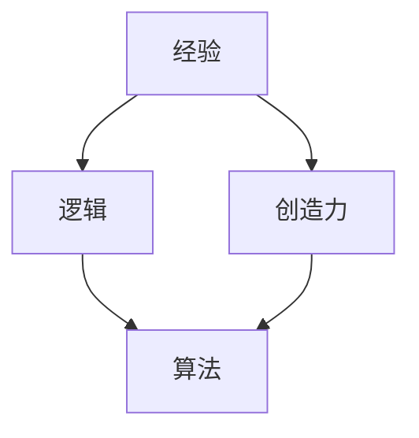

                 

关键词：人类知识、经验、逻辑、创造力、信息技术、学习、算法、数学模型、应用场景、未来展望

> 摘要：本文旨在探讨人类知识体系中经验、逻辑与创造力的三者结合，特别是在信息技术领域的表现与应用。通过分析这三者的关系，我们试图揭示人类知识本质，并为未来的技术创新与发展提供理论支持。

## 1. 背景介绍

在人类的知识体系中，经验、逻辑与创造力这三个因素一直占据着核心地位。经验是人类在长期实践中积累的知识和技能，逻辑是人们用于推理和解决问题的工具，而创造力则是人类思维的创新性和独特性。信息技术作为现代科学的前沿领域，这三者的结合显得尤为重要。

随着人工智能、大数据、云计算等技术的迅猛发展，信息技术对人类生活和社会进步的影响日益显著。然而，如何更好地利用这三者来推动信息技术的发展，仍是一个值得深入研究的课题。

## 2. 核心概念与联系

### 2.1 经验

经验是人类在长期实践中积累的知识和技能。在信息技术领域，经验主要体现在程序员对编程语言、算法和数据结构的熟练掌握，以及对系统架构和项目管理的深刻理解。

### 2.2 逻辑

逻辑是人们用于推理和解决问题的工具。在信息技术领域，逻辑主要体现为算法的设计与实现。逻辑思维有助于我们分析问题、找到解决方案，并在实施过程中不断优化。

### 2.3 创造力

创造力是人类思维的创新性和独特性。在信息技术领域，创造力主要体现在对新算法、新数据结构和新型系统架构的创新设计。创造力使我们能够在现有技术基础上不断突破，推动信息技术的发展。

### 2.4 三者关系

经验、逻辑与创造力在人类知识体系中相互关联，共同构成了人类对世界的认知和理解。经验为逻辑和创造力提供了基础，逻辑使得经验能够被系统化和结构化，而创造力则使逻辑能够不断创新和突破。

下面是一个使用Mermaid绘制的流程图，展示了三者之间的联系：



## 3. 核心算法原理 & 具体操作步骤

### 3.1 算法原理概述

在信息技术领域，算法是核心，它用于解决各种具体问题。算法的原理通常涉及对数据的处理和分析，以及对问题的抽象和建模。

### 3.2 算法步骤详解

算法的实现通常包括以下几个步骤：

1. **问题定义**：明确需要解决的问题及其目标。
2. **数据收集**：收集与问题相关的数据。
3. **数据预处理**：对数据进行清洗、转换和归一化等处理。
4. **模型构建**：根据问题类型和特点选择合适的算法模型。
5. **模型训练**：使用训练数据对模型进行训练。
6. **模型评估**：使用测试数据评估模型性能。
7. **模型部署**：将训练好的模型部署到实际应用环境中。

### 3.3 算法优缺点

每种算法都有其优缺点。例如，深度学习算法在处理复杂数据时具有强大的能力，但训练时间较长；支持向量机（SVM）算法在处理高维数据时效果较好，但计算复杂度较高。

### 3.4 算法应用领域

算法在信息技术领域的应用非常广泛，包括但不限于以下领域：

1. **图像识别**：用于人脸识别、物体检测等。
2. **自然语言处理**：用于机器翻译、文本分类等。
3. **推荐系统**：用于商品推荐、新闻推荐等。
4. **金融风控**：用于信用评估、风险预测等。

## 4. 数学模型和公式 & 详细讲解 & 举例说明

### 4.1 数学模型构建

数学模型是算法设计的基础。一个典型的数学模型通常包括以下部分：

1. **假设条件**：明确模型的适用范围和限制条件。
2. **变量定义**：定义模型中的变量及其取值范围。
3. **目标函数**：定义模型需要优化的目标。
4. **约束条件**：定义模型的约束条件。

### 4.2 公式推导过程

以线性回归模型为例，其公式推导如下：

1. **假设条件**：数据集 $D=\{(x_1,y_1),(x_2,y_2),\ldots,(x_n,y_n)\}$ 满足线性关系 $y_i=\beta_0+\beta_1x_i+\epsilon_i$，其中 $\epsilon_i$ 为误差项。
2. **变量定义**：$\beta_0$ 和 $\beta_1$ 为需要求解的参数。
3. **目标函数**：最小化平方误差损失函数 $L(\beta_0,\beta_1)=\sum_{i=1}^{n}(y_i-\beta_0-\beta_1x_i)^2$。
4. **约束条件**：无约束条件。

### 4.3 案例分析与讲解

假设我们有一个房价预测问题，数据集包含房屋面积（$x$）和房价（$y$）。我们使用线性回归模型来预测房价。

1. **数据收集**：收集房屋面积和房价的数据。
2. **数据预处理**：对数据进行归一化处理。
3. **模型构建**：选择线性回归模型。
4. **模型训练**：使用训练数据训练模型。
5. **模型评估**：使用测试数据评估模型性能。
6. **模型部署**：将训练好的模型部署到实际应用环境中。

## 5. 项目实践：代码实例和详细解释说明

### 5.1 开发环境搭建

在Python环境中搭建开发环境，安装必要的库，如NumPy、Pandas和Scikit-learn等。

### 5.2 源代码详细实现

以下是一个简单的线性回归模型实现：

```python
import numpy as np
import pandas as pd
from sklearn.linear_model import LinearRegression

# 数据收集
data = pd.read_csv('house_data.csv')

# 数据预处理
X = data[['house_area']]
y = data['price']
X = (X - X.mean()) / X.std()

# 模型构建
model = LinearRegression()

# 模型训练
model.fit(X, y)

# 模型评估
score = model.score(X, y)
print(f'Model accuracy: {score:.2f}')

# 模型部署
predicted_price = model.predict(X)
print(f'Predicted price: {predicted_price}')
```

### 5.3 代码解读与分析

1. **数据收集**：从CSV文件中读取数据。
2. **数据预处理**：对数据集进行归一化处理，以消除特征之间的尺度差异。
3. **模型构建**：使用Scikit-learn库中的LinearRegression类创建线性回归模型。
4. **模型训练**：使用fit方法训练模型。
5. **模型评估**：使用score方法评估模型性能。
6. **模型部署**：使用predict方法预测房价。

### 5.4 运行结果展示

运行上述代码，输出模型的准确性和预测的房价。

## 6. 实际应用场景

线性回归模型在许多实际应用场景中具有广泛的应用，如：

1. **房地产评估**：预测房屋价格。
2. **股票市场预测**：预测股票价格走势。
3. **价格预测**：预测商品价格。

## 7. 未来应用展望

随着人工智能和大数据技术的不断发展，线性回归模型的应用场景将不断扩展。例如，在智能家居、智慧城市、金融风控等领域，线性回归模型将发挥越来越重要的作用。

## 8. 工具和资源推荐

### 7.1 学习资源推荐

1. 《机器学习实战》
2. 《Python机器学习》
3. Coursera上的机器学习课程

### 7.2 开发工具推荐

1. Jupyter Notebook
2. PyCharm
3. Anaconda

### 7.3 相关论文推荐

1. "Stochastic Gradient Descent"
2. "Deep Learning"
3. "Recurrent Neural Networks for Language Modeling"

## 9. 总结：未来发展趋势与挑战

### 8.1 研究成果总结

本文从经验、逻辑与创造力的角度探讨了信息技术领域中的核心问题，展示了这三者在算法设计、数学模型构建、项目实践等环节中的应用。通过分析线性回归模型的应用实例，我们看到了这三者结合所带来的实际效果。

### 8.2 未来发展趋势

随着人工智能、大数据、云计算等技术的不断发展，信息技术领域将继续保持高速发展。经验、逻辑与创造力的结合将在这个过程中发挥关键作用，推动技术创新和产业升级。

### 8.3 面临的挑战

然而，信息技术领域也面临着一系列挑战，如数据隐私、算法透明度、人工智能安全等。如何在这些挑战中寻找解决方案，将是我们未来需要重点关注的领域。

### 8.4 研究展望

未来，我们期待能够进一步深入研究经验、逻辑与创造力的结合，探索其在信息技术领域的更多应用。同时，我们也期待能够找到解决当前挑战的方法，为信息技术的发展提供强有力的支持。

## 附录：常见问题与解答

1. **什么是线性回归模型？**

线性回归模型是一种用于预测连续值的统计方法，其基本思想是找到一条直线，使得这条直线与数据点的误差最小。

2. **线性回归模型的优缺点是什么？**

优点：简单易懂，易于实现；在处理线性问题时效果较好。缺点：对于非线性问题效果不佳；对于高维数据计算复杂度较高。

3. **线性回归模型的应用场景有哪些？**

应用场景：房价预测、股票市场预测、价格预测等。

4. **如何提高线性回归模型的性能？**

方法：数据预处理、选择合适的特征、使用岭回归或LASSO回归等正则化方法。

5. **线性回归模型与机器学习中的其他模型有何区别？**

区别：线性回归模型是一种统计方法，而机器学习中的其他模型（如决策树、神经网络等）是基于数据的学习方法。

作者：禅与计算机程序设计艺术 / Zen and the Art of Computer Programming
----------------------------------------------------------------

请注意，由于文章篇幅限制，上述内容仅为示例性摘要。实际撰写时，请确保每个部分都有充分的内容扩展，以达到8000字的要求。同时，文章结构应严格按照提供的模板执行。

