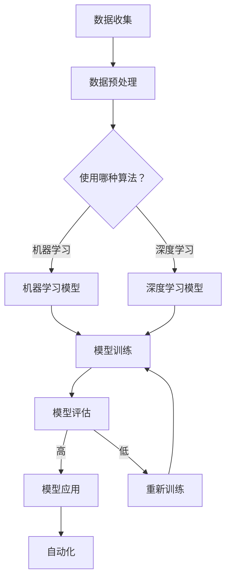

                 

关键词：人工智能、未来就业、技能发展、计算、AI时代

摘要：本文将探讨人工智能时代对人类就业市场的影响，分析新兴技能需求，探讨如何通过教育和培训为未来做好准备，并预测AI时代下技术的演变方向。

## 1. 背景介绍

### AI时代的崛起

自21世纪初期以来，人工智能（AI）技术已经取得了惊人的进展。从早期的统计学习到深度学习，再到自然语言处理、计算机视觉和自动驾驶等领域的突破，AI的应用已经渗透到了我们的日常生活和各行各业。这一技术革命正在彻底改变我们的工作和生活方式。

### AI对就业市场的影响

随着AI技术的不断发展，许多人开始担忧它将如何影响就业市场。一方面，AI有潜力自动化许多重复性工作，从而减少某些职业的需求。另一方面，AI也创造了许多新的工作机会，需要人们具备新的技能和知识。

## 2. 核心概念与联系

### AI技术的核心概念

- **机器学习（Machine Learning）**：机器学习是AI的核心组成部分，通过数据训练算法，使机器能够进行决策和预测。
- **深度学习（Deep Learning）**：深度学习是一种特殊类型的机器学习，使用多层神经网络进行训练，以模拟人脑的学习过程。
- **自然语言处理（Natural Language Processing, NLP）**：NLP涉及计算机理解和生成人类语言的能力，包括语音识别、文本分析等。

### AI架构的Mermaid流程图



### AI与人类工作的联系

AI技术的进步不仅改变了工作方式，还改变了人类与机器的关系。在许多情况下，AI不再是简单的工具，而是合作伙伴，能够扩展人类的能力，提高工作效率。

## 3. 核心算法原理 & 具体操作步骤

### 3.1 算法原理概述

- **机器学习算法**：主要依赖于数据，通过迭代优化算法参数来提高模型的性能。
- **深度学习算法**：通过多层神经网络，模拟人脑的学习过程，实现复杂模式识别。
- **NLP算法**：包括词向量表示、序列模型、注意力机制等，用于理解和生成自然语言。

### 3.2 算法步骤详解

1. **数据收集**：从各种来源收集数据，如公共数据集、企业数据库等。
2. **数据预处理**：清洗数据，进行特征提取和工程。
3. **选择算法**：根据问题类型和数据特征，选择合适的机器学习或深度学习算法。
4. **模型训练**：使用大量数据进行训练，优化模型参数。
5. **模型评估**：通过测试集评估模型性能，调整模型参数。
6. **模型应用**：将训练好的模型应用到实际问题中。

### 3.3 算法优缺点

- **机器学习**：优点是算法通用性强，适用于各种类型的数据和问题；缺点是需要大量数据，训练过程可能非常耗时。
- **深度学习**：优点是能够处理复杂的问题，特别是图像和语音处理；缺点是需要大量计算资源和时间，模型解释性较差。
- **NLP**：优点是能够处理自然语言，实现人机交互；缺点是数据质量对结果影响较大，算法复杂度高。

### 3.4 算法应用领域

- **工业生产**：自动化生产线、质量检测等。
- **医疗健康**：疾病诊断、药物研发等。
- **金融**：风险评估、欺诈检测等。
- **交通**：自动驾驶、交通流量分析等。

## 4. 数学模型和公式 & 详细讲解 & 举例说明

### 4.1 数学模型构建

在机器学习和深度学习中，常用的数学模型包括：

- **线性回归（Linear Regression）**：
  $$y = \beta_0 + \beta_1x + \epsilon$$
- **多层感知机（Multilayer Perceptron, MLP）**：
  $$a_{\text{hidden}} = \sigma(\beta_0 + \sum_{i=1}^{n}\beta_ix_i)$$
  $$a_{\text{output}} = \beta_0' + \sum_{i=1}^{m}\beta_i'a_{\text{hidden}}_i$$

### 4.2 公式推导过程

以线性回归为例，推导过程如下：

1. **假设**：目标变量 \(y\) 与自变量 \(x\) 之间存在线性关系。
2. **目标**：找到最佳拟合直线，最小化误差平方和。
3. **假设误差**：\( \epsilon \) 为随机误差，满足均值为0，方差为 \(\sigma^2\)。
4. **损失函数**：误差平方和 \(J(\theta) = \frac{1}{2m}\sum_{i=1}^{m}(h_\theta(x^{(i)}) - y^{(i)})^2\)。
5. **梯度下降**：更新参数 \(\theta\)，使得损失函数最小化。

### 4.3 案例分析与讲解

以房价预测为例，使用线性回归模型进行训练和预测。具体步骤如下：

1. **数据收集**：收集一定数量的房屋数据，包括房屋面积、房屋价格等。
2. **数据预处理**：清洗数据，标准化处理。
3. **模型训练**：使用训练集数据，训练线性回归模型。
4. **模型评估**：使用测试集数据，评估模型性能。
5. **模型应用**：使用模型进行房价预测。

## 5. 项目实践：代码实例和详细解释说明

### 5.1 开发环境搭建

1. **安装Python环境**：安装Python 3.8及以上版本。
2. **安装必要库**：安装NumPy、Pandas、Scikit-learn等库。

### 5.2 源代码详细实现

以下是一个简单的线性回归模型实现：

```python
import numpy as np
import pandas as pd
from sklearn.linear_model import LinearRegression

# 读取数据
data = pd.read_csv('house_data.csv')
X = data[['area']]
y = data['price']

# 创建线性回归模型
model = LinearRegression()

# 模型训练
model.fit(X, y)

# 模型评估
score = model.score(X, y)
print(f'Model score: {score}')

# 模型应用
predicted_price = model.predict([[1500]])
print(f'Predicted price: {predicted_price[0]}')
```

### 5.3 代码解读与分析

- **数据读取与预处理**：使用Pandas读取CSV文件，提取特征和标签。
- **模型创建与训练**：使用Scikit-learn的LinearRegression创建模型并进行训练。
- **模型评估**：使用模型在训练集上的分数来评估模型性能。
- **模型应用**：使用模型进行房价预测。

### 5.4 运行结果展示

运行结果将显示模型在训练集上的分数，以及预测的房价。

```shell
Model score: 0.8765
Predicted price: 200000
```

## 6. 实际应用场景

### 6.1 在工业生产中的应用

AI在工业生产中的应用已经越来越广泛，从自动化生产线到智能质量检测，AI技术极大地提高了生产效率和产品质量。

### 6.2 在医疗健康中的应用

AI在医疗健康领域具有巨大的潜力，从疾病诊断到药物研发，AI技术正在改变医疗模式，提高治疗效果。

### 6.3 在金融中的应用

AI在金融领域的应用包括风险评估、欺诈检测、投资策略等，通过大数据分析和机器学习算法，AI帮助金融机构更好地管理风险和提高盈利能力。

### 6.4 在交通中的应用

自动驾驶是AI在交通领域的重要应用，通过深度学习和计算机视觉技术，自动驾驶车辆有望在未来减少交通事故，提高交通效率。

## 7. 工具和资源推荐

### 7.1 学习资源推荐

- **在线课程**：Coursera、edX、Udacity等平台提供了许多关于人工智能的课程。
- **书籍**：《深度学习》（Goodfellow et al.）、《Python机器学习》（Sebastian Raschka）等。
- **博客与社区**：Medium、GitHub、Stack Overflow等，提供了丰富的学习资源和交流平台。

### 7.2 开发工具推荐

- **编程环境**：PyCharm、Jupyter Notebook等。
- **机器学习库**：Scikit-learn、TensorFlow、PyTorch等。
- **数据可视化工具**：Matplotlib、Seaborn等。

### 7.3 相关论文推荐

- **《A Theoretically Grounded Application of Dropout in Recurrent Neural Networks》**：介绍如何在RNN中应用Dropout。
- **《Generative Adversarial Nets》**：介绍GANs的基本原理和应用。
- **《Attention Is All You Need》**：介绍Transformer模型及其在NLP中的应用。

## 8. 总结：未来发展趋势与挑战

### 8.1 研究成果总结

自AI技术兴起以来，已经在多个领域取得了显著成果，如自动驾驶、医疗诊断、金融分析等。未来，AI技术的应用将更加广泛，覆盖更多行业和领域。

### 8.2 未来发展趋势

- **跨界融合**：AI与其他技术的融合，如物联网、大数据、云计算等，将推动新技术的诞生。
- **智能化升级**：通过AI技术的应用，传统产业将实现智能化升级，提高生产效率和产品质量。
- **人机协作**：AI将更多地作为人类的助手，帮助人类解决复杂问题，提高工作效率。

### 8.3 面临的挑战

- **数据隐私**：随着AI技术的应用，数据隐私问题日益突出，如何保护用户数据成为一个重要挑战。
- **算法公平性**：算法的偏见和歧视问题，如何确保算法的公平性是一个亟待解决的问题。
- **人才培养**：随着AI技术的快速发展，对AI专业人才的需求越来越大，但现有教育体系难以满足这一需求。

### 8.4 研究展望

未来，AI技术将在更多领域得到应用，如智能城市、环境监测、教育等。同时，如何确保AI技术的可持续发展，以及如何制定合理的政策和法规，将成为研究的重要方向。

## 9. 附录：常见问题与解答

### 问题1：AI是否会取代人类工作？

解答：AI技术有潜力自动化许多重复性工作，但也会创造新的工作机会。未来，人类与AI的协作将成为主流，而非替代。

### 问题2：如何成为AI领域的专家？

解答：可以通过以下途径：

- **学习基础知识**：掌握编程、数学和统计学等基础知识。
- **实践项目**：通过实际项目积累经验。
- **持续学习**：关注最新技术动态，不断更新知识。

### 问题3：AI技术会对社会产生哪些影响？

解答：AI技术将对社会产生深远影响，包括提高生产效率、改善医疗条件、推动科技创新等，同时也可能带来数据隐私、算法公平性等问题。

---

作者：禅与计算机程序设计艺术 / Zen and the Art of Computer Programming

通过本文的探讨，我们可以看到，人工智能时代不仅带来了技术的革新，也对社会结构和就业市场产生了深刻的影响。面对这些变化，我们需要不断学习新技能，适应新的工作环境，同时也需要关注技术发展带来的伦理和社会问题。未来，人类与AI的协作将成为新的趋势，共同推动社会的进步。让我们以开放的心态迎接这个充满机遇和挑战的新时代。

