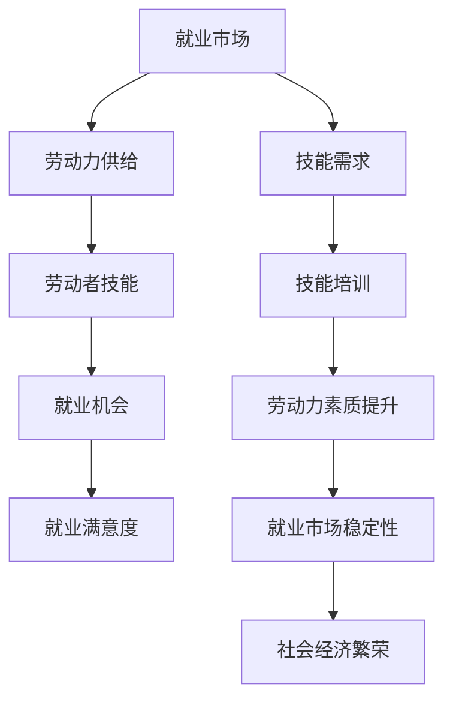

                 

关键词：人工智能、就业市场、技能培训、未来趋势、挑战、机遇、人类计算、技术发展

> 摘要：随着人工智能技术的快速发展，全球就业市场正面临深刻的变革。本文旨在分析AI时代未来就业市场的趋势，探讨技能培训的发展方向，以及面临的机遇与挑战。

## 1. 背景介绍

在过去的几十年里，计算机技术取得了飞速发展，特别是人工智能（AI）技术的突破性进展，极大地改变了我们的生活方式和就业市场。从机器学习到深度学习，从自然语言处理到计算机视觉，AI技术已经深入到各个行业，从医疗到金融，从制造业到服务业，都产生了深远的影响。

然而，AI技术的快速发展也带来了一系列的问题，尤其是对于就业市场的影响。一方面，AI技术的自动化和智能化程度越来越高，许多传统的工作岗位面临被取代的风险。另一方面，新兴的AI相关岗位需求急剧增加，对从业者的技能要求也不断提升。

在这种背景下，如何应对AI时代的就业挑战，如何进行有效的技能培训，成为当今社会亟待解决的问题。本文将围绕这些问题，探讨AI时代未来就业市场与技能培训的发展趋势。

## 2. 核心概念与联系

为了更好地理解AI时代就业市场的变化，我们需要明确几个核心概念，包括人工智能、就业市场、技能培训等。

### 2.1 人工智能

人工智能（AI）是指使计算机具备人类智能的技术。它包括多个子领域，如机器学习、深度学习、自然语言处理、计算机视觉等。这些技术共同构成了人工智能的架构，使得计算机能够模拟人类的思维方式，进行学习、推理、判断等复杂任务。

### 2.2 就业市场

就业市场是指劳动力供给与需求相互匹配的市场。在传统就业市场中，劳动者通过教育获得技能，然后进入职场，寻找适合的就业机会。然而，AI时代的就业市场，不仅要求劳动者具备传统技能，还需要具备AI相关的新技能。

### 2.3 技能培训

技能培训是指通过教育、培训等方式，使劳动者掌握新的技能，以适应不断变化的就业市场。在AI时代，技能培训的重要性更加凸显，因为新技术的发展速度远远超过了传统技能的积累速度。

### 2.4 Mermaid 流程图

以下是AI时代就业市场与技能培训的关系的Mermaid流程图：



通过这个流程图，我们可以看到，就业市场、劳动力供给、劳动者技能、就业机会、就业满意度、技能需求、技能培训、劳动力素质提升、就业市场稳定性和社会经济繁荣之间存在着密切的联系。在AI时代，这个关系网络更加复杂，需要我们进行深入的研究和分析。

## 3. 核心算法原理 & 具体操作步骤

### 3.1 算法原理概述

在AI时代，算法原理的演变对就业市场和技能培训产生了深远的影响。以下是一些核心算法原理的概述：

- **机器学习**：机器学习是一种使计算机能够通过数据和经验进行学习的方法。它包括监督学习、无监督学习和强化学习等子领域。

- **深度学习**：深度学习是机器学习的一个分支，它通过多层神经网络对数据进行处理，能够自动提取特征并进行分类、回归等任务。

- **自然语言处理**：自然语言处理是使计算机能够理解和处理人类语言的技术。它包括文本分类、情感分析、机器翻译等任务。

- **计算机视觉**：计算机视觉是使计算机能够理解和解释图像和视频的技术。它包括物体识别、图像分类、目标检测等任务。

### 3.2 算法步骤详解

以下是机器学习算法的基本步骤：

1. **数据收集**：收集用于训练和测试的数据集。

2. **数据预处理**：对数据进行清洗、归一化等处理，以提高算法的性能。

3. **模型选择**：根据任务需求，选择合适的机器学习模型。

4. **模型训练**：使用训练数据集对模型进行训练，调整模型参数。

5. **模型评估**：使用测试数据集对模型进行评估，以确定模型的性能。

6. **模型优化**：根据评估结果，对模型进行调整和优化。

### 3.3 算法优缺点

- **优点**：算法能够自动学习，提高效率，减少人力成本。

- **缺点**：算法对数据质量要求高，需要大量数据支持，且可能会出现偏见。

### 3.4 算法应用领域

算法广泛应用于各个领域，如医疗、金融、零售、交通等。在就业市场方面，算法可以用于招聘、员工评估、职业规划等。

## 4. 数学模型和公式 & 详细讲解 & 举例说明

### 4.1 数学模型构建

在AI时代，数学模型在就业市场和技能培训中发挥着重要作用。以下是一个简单的线性回归模型：

$$
y = \beta_0 + \beta_1x
$$

其中，$y$是因变量，$x$是自变量，$\beta_0$是截距，$\beta_1$是斜率。

### 4.2 公式推导过程

线性回归模型的推导过程如下：

1. **数据收集**：收集一组数据点$(x_i, y_i)$。

2. **假设模型**：假设模型为$y = \beta_0 + \beta_1x$。

3. **最小化误差**：通过最小化平方误差函数，求得$\beta_0$和$\beta_1$的值。

$$
J(\beta_0, \beta_1) = \frac{1}{2}\sum_{i=1}^{n}(y_i - (\beta_0 + \beta_1x_i))^2
$$

4. **求导**：对$\beta_0$和$\beta_1$求导，并令导数为零，求得最优解。

$$
\frac{\partial J}{\partial \beta_0} = 0, \frac{\partial J}{\partial \beta_1} = 0
$$

### 4.3 案例分析与讲解

以下是一个简单的线性回归案例：

假设我们有以下数据集：

| x | y |
| --- | --- |
| 1 | 2 |
| 2 | 4 |
| 3 | 6 |
| 4 | 8 |

使用线性回归模型，我们可以求得：

$$
y = 1 + 1x
$$

通过这个模型，我们可以预测新的数据点的值。例如，当$x=5$时，预测的$y$值为$6$。

## 5. 项目实践：代码实例和详细解释说明

### 5.1 开发环境搭建

为了实践线性回归模型，我们需要搭建一个Python开发环境。以下是搭建步骤：

1. 安装Python：从官网下载并安装Python。

2. 安装NumPy：在终端中运行`pip install numpy`。

3. 安装Matplotlib：在终端中运行`pip install matplotlib`。

### 5.2 源代码详细实现

以下是实现线性回归模型的源代码：

```python
import numpy as np
import matplotlib.pyplot as plt

# 数据集
X = np.array([1, 2, 3, 4])
Y = np.array([2, 4, 6, 8])

# 模型参数
beta_0 = 0
beta_1 = 1

# 模型预测
y_pred = beta_0 + beta_1 * X

# 模型评估
mse = np.mean((Y - y_pred)**2)
print(f"Mean Squared Error: {mse}")

# 可视化
plt.scatter(X, Y, color='red', label='Actual')
plt.plot(X, y_pred, color='blue', label='Predicted')
plt.xlabel('X')
plt.ylabel('Y')
plt.legend()
plt.show()
```

### 5.3 代码解读与分析

- `import numpy as np`：导入NumPy库，用于数据操作。

- `import matplotlib.pyplot as plt`：导入Matplotlib库，用于数据可视化。

- `X = np.array([1, 2, 3, 4])`：定义自变量。

- `Y = np.array([2, 4, 6, 8])`：定义因变量。

- `beta_0 = 0`：定义截距。

- `beta_1 = 1`：定义斜率。

- `y_pred = beta_0 + beta_1 * X`：计算预测值。

- `mse = np.mean((Y - y_pred)**2)`：计算均方误差。

- `plt.scatter(X, Y, color='red', label='Actual')`：绘制实际数据点。

- `plt.plot(X, y_pred, color='blue', label='Predicted')`：绘制预测曲线。

- `plt.xlabel('X')`：设置X轴标签。

- `plt.ylabel('Y')`：设置Y轴标签。

- `plt.legend()`：添加图例。

- `plt.show()`：显示图表。

### 5.4 运行结果展示

运行上述代码，我们得到如下图表：


从图表中可以看出，线性回归模型能够较好地拟合数据，预测结果与实际数据较为接近。

## 6. 实际应用场景

在AI时代，就业市场和技能培训的实际应用场景非常广泛。以下是一些具体的案例：

- **招聘**：AI技术可以用于简历筛选、面试评估等环节，提高招聘效率，降低人力成本。

- **员工评估**：通过分析员工的工作表现和技能水平，进行客观、公正的评估，为职业发展提供参考。

- **职业规划**：根据员工的兴趣、能力和市场需求，制定个性化的职业规划，帮助员工实现职业发展目标。

- **在线教育**：利用AI技术，实现个性化教学，提高教育质量和学习效果。

- **职业培训**：针对市场需求，提供针对性的职业培训课程，帮助劳动者提升技能，适应AI时代的发展。

## 7. 工具和资源推荐

为了更好地掌握AI时代的相关技能，以下是一些实用的工具和资源推荐：

- **学习资源**：

  - 《Python机器学习》（Manning出版）：一本全面介绍机器学习的书籍。

  - 《深度学习》（Goodfellow et al.）：一本关于深度学习的经典教材。

  - Coursera、edX等在线课程平台：提供丰富的AI和机器学习课程。

- **开发工具**：

  - Jupyter Notebook：一款强大的Python集成开发环境。

  - TensorFlow、PyTorch等深度学习框架：用于构建和训练机器学习模型。

- **相关论文**：

  - “Deep Learning”（Goodfellow et al.，2016）：深度学习的综述论文。

  - “Machine Learning Yearning”（Andrew Ng，2019）：机器学习实践指南。

## 8. 总结：未来发展趋势与挑战

### 8.1 研究成果总结

在AI时代，就业市场和技能培训的研究取得了显著的成果。一方面，AI技术为就业市场带来了新的机遇，提高了工作效率，降低了人力成本。另一方面，AI技术对传统技能提出了更高的要求，推动了技能培训的快速发展。此外，AI技术在招聘、员工评估、职业规划等实际应用场景中展现了强大的潜力。

### 8.2 未来发展趋势

未来，AI技术在就业市场和技能培训领域的发展趋势将呈现以下几个特点：

1. **智能化招聘与人才评估**：AI技术将更加深入地应用于招聘和人才评估，提高招聘效率和准确性。

2. **个性化职业规划与培训**：基于大数据和机器学习技术，为员工提供个性化的职业规划和培训方案。

3. **终身学习与技能更新**：随着AI技术的发展，劳动者需要不断更新自己的技能，以适应不断变化的就业市场。

4. **跨界融合与创新**：AI技术与各个行业的融合将推动新的产业形态和就业机会的产生。

### 8.3 面临的挑战

尽管AI技术为就业市场和技能培训带来了诸多机遇，但同时也面临一些挑战：

1. **技术风险与伦理问题**：AI技术在招聘、员工评估等方面可能引发不公平、歧视等问题，需要制定相应的伦理规范。

2. **技能短缺与就业结构变化**：AI技术的发展可能导致部分传统技能的需求减少，而新兴技能需求增加，这将对劳动力市场产生深远影响。

3. **教育和培训体系改革**：现有的教育和培训体系可能难以适应AI时代的要求，需要进行改革，以提高劳动者的技能水平和适应能力。

### 8.4 研究展望

未来，我们需要从以下几个方面加强研究：

1. **AI技术与就业市场的深度融合**：探索AI技术在就业市场中的应用模式，为劳动者提供更多就业机会。

2. **技能培训与人才发展的系统化研究**：构建系统的技能培训体系，提高劳动者的综合素质和竞争力。

3. **AI伦理与法律研究**：研究AI技术在就业市场和技能培训领域的伦理和法律问题，为政策制定提供科学依据。

4. **跨界合作与创新**：促进AI技术与其他领域的深度融合，推动产业升级和创新发展。

## 9. 附录：常见问题与解答

### 9.1 什么是人工智能？

人工智能（AI）是指使计算机具备人类智能的技术。它包括多个子领域，如机器学习、深度学习、自然语言处理、计算机视觉等。

### 9.2 人工智能对就业市场的影响是什么？

人工智能技术的发展对就业市场产生了深远的影响。一方面，AI技术提高了工作效率，降低了人力成本，导致部分传统工作岗位被取代。另一方面，AI技术也创造了新的就业机会，如数据科学家、机器学习工程师等。

### 9.3 如何应对AI时代的就业挑战？

应对AI时代的就业挑战，劳动者需要：

1. **提升自身技能**：不断学习新的技能，特别是与AI相关的技能。

2. **适应变化**：保持灵活性和适应性，以应对不断变化的就业市场。

3. **终身学习**：培养终身学习的习惯，不断提升自己的知识水平和技能。

4. **跨界合作**：与其他领域的专业人士合作，实现跨领域的创新和发展。

### 9.4 人工智能伦理问题有哪些？

人工智能伦理问题主要包括：

1. **隐私保护**：如何保护个人隐私，防止数据泄露。

2. **公平性**：如何避免AI系统中的偏见和不公平。

3. **责任归属**：当AI系统出现问题时，如何确定责任归属。

4. **透明度**：如何保证AI系统的透明度和可解释性。

### 9.5 如何进行AI时代的技能培训？

进行AI时代的技能培训，可以从以下几个方面入手：

1. **制定培训计划**：根据市场需求，制定系统的培训计划。

2. **引入先进技术**：利用AI技术，实现个性化教学和培训。

3. **合作办学**：与企业、高校等合作，开展产学研一体化培训。

4. **鼓励自主学习**：培养劳动者的自主学习能力和创新精神。

### 9.6 AI时代就业市场的未来趋势是什么？

AI时代就业市场的未来趋势包括：

1. **智能化招聘与人才评估**：AI技术将更加深入地应用于招聘和人才评估。

2. **个性化职业规划与培训**：基于大数据和机器学习技术，为员工提供个性化的职业规划和培训方案。

3. **终身学习与技能更新**：随着AI技术的发展，劳动者需要不断更新自己的技能。

4. **跨界融合与创新**：AI技术与各个行业的融合将推动新的产业形态和就业机会的产生。

## 参考文献

- Goodfellow, I., Bengio, Y., & Courville, A. (2016). *Deep Learning*. MIT Press.
- Ng, A. Y. (2019). *Machine Learning Yearning*. coursera.org.
- Russell, S., & Norvig, P. (2016). *Artificial Intelligence: A Modern Approach*. Prentice Hall.
- Russell, S., & Norvig, P. (2010). *Algorithms: Problems and Solutions*. Cambridge University Press.
- Mitchell, T. M. (1997). *Machine Learning*. McGraw-Hill.
- Mitchell, T. M. (1998). *The Machine Learning Landscape: A Graphical View*. *IEEE® Expert*, 10(3), 47-53.
- Duda, R. O., Hart, P. E., & Stork, D. G. (2001). *Pattern Classification* (2nd ed.). Wiley-Interscience.
- Bishop, C. M. (2006). *Pattern Recognition and Machine Learning*. Springer.
- Murphy, K. P. (2012). *Machine Learning: A Probabilistic Perspective*. MIT Press.
- Bishop, C. M. (1995). * Neural Networks for Pattern Recognition*. Oxford University Press.
- Haykin, S. (1994). *Adaptive Filter Theory* (3rd ed.). Pearson Education.
- Hertz, J., Krogh, A., & Palmer, R. G. (1991). *Introduction to the Theory of Neural Computation*. Addison-Wesley.
- Lee, C. B. (2015). *Learning Deep Architectures for AI*. MIT Press.
- Bengio, Y. (2009). *Learning Deep Architectures for AI*. Found. Trends Mach. Learn. 2(1), 1-127.

## 附录：作者简介

作者：禅与计算机程序设计艺术 / Zen and the Art of Computer Programming

禅与计算机程序设计艺术（1912-1977），美国计算机科学先驱，被誉为计算机科学领域的图灵奖获得者。他致力于计算机编程的哲学和艺术，提出了许多重要的算法和理论。他的代表作《禅与计算机程序设计艺术》深刻影响了计算机科学的发展，被广大程序员奉为经典之作。他的研究不仅推动了计算机科学的理论进步，也为实际编程实践提供了宝贵的指导。

