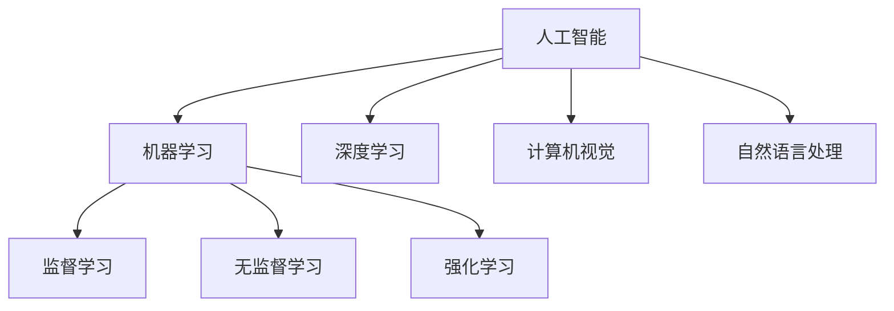

                 

关键词：人工智能，技能培训，就业市场，未来趋势，职业发展

> 摘要：本文将探讨人工智能时代下，人类计算的转型与未来技能需求。通过对人工智能核心概念的介绍，算法原理的解析，以及具体应用场景的剖析，文章旨在为读者提供AI时代的职业发展指南。

## 1. 背景介绍

随着人工智能技术的快速发展，人类的生活方式和社会结构正在发生深刻变革。人工智能不再仅仅是科幻小说中的概念，它已经渗透到我们生活的方方面面。从智能家居到自动驾驶，从医疗诊断到金融分析，人工智能正在改变传统行业的运作方式，同时也带来了前所未有的就业市场变化。

在这个背景下，人们对于未来技能的需求愈发迫切。传统的教育和培训模式难以满足人工智能时代的要求，如何培养具备适应未来技能的人才，成为教育界和企业界共同面临的挑战。

本文将围绕以下几个核心问题展开讨论：

1. 人工智能的核心概念是什么？
2. 人工智能时代的核心算法原理有哪些？
3. 人工智能在实际应用中如何改变我们的工作和生活方式？
4. 面对人工智能时代，我们应该如何规划职业发展？
5. 人工智能时代的教育和培训体系应该如何构建？

通过上述问题的探讨，本文旨在为读者提供一幅清晰、全面的人工智能时代职业发展蓝图。

## 2. 核心概念与联系

### 2.1 人工智能的定义

人工智能（Artificial Intelligence，简称AI）是计算机科学的一个分支，旨在使计算机系统具备类似于人类的智能。具体来说，人工智能指的是一种能够通过学习和体验来不断改进自身性能的技术。

### 2.2 机器学习

机器学习是人工智能的核心技术之一，它使计算机能够从数据中自动学习和改进。机器学习包括监督学习、无监督学习和强化学习等多种类型。

#### 监督学习

监督学习是一种最常见的学习方式，它通过已知的输入和输出数据来训练模型。在监督学习中，输入和输出数据都是已知的，模型需要通过学习这些数据来预测新的输入数据对应的输出。

#### 无监督学习

无监督学习则不依赖于已知的输出数据，而是通过分析输入数据的内在结构来发现模式。这种学习方式常用于聚类分析和降维处理等。

#### 强化学习

强化学习是一种通过奖励和惩罚来训练模型的学习方式。在这种学习方式中，模型通过不断尝试和反馈来优化其行为。

### 2.3 深度学习

深度学习是机器学习的一种重要分支，它通过构建深度神经网络来模拟人类大脑的学习过程。深度学习在图像识别、自然语言处理和语音识别等领域取得了显著成果。

### 2.4 计算机视觉

计算机视觉是人工智能的一个重要应用领域，它使计算机能够理解和处理视觉信息。计算机视觉的应用范围广泛，包括自动驾驶、人脸识别和医学影像分析等。

### 2.5 自然语言处理

自然语言处理（Natural Language Processing，简称NLP）是人工智能的另一个重要领域，它使计算机能够理解和生成人类语言。NLP在机器翻译、语音助手和情感分析等领域有广泛应用。

### 2.6 Mermaid 流程图

为了更清晰地展示人工智能的核心概念和联系，我们可以使用Mermaid流程图来表示它们之间的关系：



## 3. 核心算法原理 & 具体操作步骤

### 3.1 算法原理概述

人工智能的核心算法主要包括机器学习算法、深度学习算法和强化学习算法。这些算法通过不同的方式模拟人类的学习过程，以实现对数据的分析和预测。

#### 3.1.1 机器学习算法

机器学习算法主要包括线性回归、逻辑回归、支持向量机（SVM）和决策树等。这些算法通过训练数据集来建立模型，并利用模型对新的数据进行预测。

- 线性回归：通过拟合数据中的线性关系来进行预测。
- 逻辑回归：通过拟合数据中的非线性关系来进行分类预测。
- 支持向量机：通过找到一个最优的超平面来进行分类。
- 决策树：通过一系列决策规则来进行分类或回归预测。

#### 3.1.2 深度学习算法

深度学习算法主要包括卷积神经网络（CNN）、循环神经网络（RNN）和生成对抗网络（GAN）等。这些算法通过多层神经网络来模拟人类大脑的学习过程。

- 卷积神经网络：通过卷积层和池化层来提取图像特征。
- 循环神经网络：通过循环结构来处理序列数据。
- 生成对抗网络：通过对抗训练来生成新的数据。

#### 3.1.3 强化学习算法

强化学习算法主要包括Q学习、SARSA和深度Q网络（DQN）等。这些算法通过奖励和惩罚来训练模型，以实现最优的行为策略。

- Q学习：通过学习状态-动作值函数来进行决策。
- SARSA：通过状态-动作值函数来更新策略。
- 深度Q网络：通过深度神经网络来近似状态-动作值函数。

### 3.2 算法步骤详解

#### 3.2.1 机器学习算法步骤

1. 数据准备：收集并预处理数据，包括数据清洗、特征提取和归一化等。
2. 模型选择：根据问题类型和数据特点选择合适的模型。
3. 模型训练：使用训练数据集对模型进行训练，通过优化算法来调整模型参数。
4. 模型评估：使用测试数据集对模型进行评估，判断模型性能。
5. 模型部署：将训练好的模型部署到实际应用场景中。

#### 3.2.2 深度学习算法步骤

1. 数据准备：收集并预处理数据，包括数据清洗、特征提取和归一化等。
2. 网络架构设计：设计合适的神经网络架构，包括层数、层类型和参数设置等。
3. 模型训练：使用训练数据集对模型进行训练，通过反向传播算法来优化模型参数。
4. 模型评估：使用测试数据集对模型进行评估，判断模型性能。
5. 模型部署：将训练好的模型部署到实际应用场景中。

#### 3.2.3 强化学习算法步骤

1. 数据准备：收集并预处理数据，包括状态、动作和奖励等。
2. 策略选择：根据问题类型和状态空间设计合适的策略。
3. 模型训练：使用强化学习算法来训练模型，通过策略迭代来优化策略。
4. 模型评估：使用测试数据集对模型进行评估，判断模型性能。
5. 模型部署：将训练好的模型部署到实际应用场景中。

### 3.3 算法优缺点

#### 3.3.1 机器学习算法

优点：算法简单、易实现，适用于多种类型的数据。

缺点：对于复杂问题的表现不如深度学习和强化学习。

#### 3.3.2 深度学习算法

优点：强大的表示能力和适应性，适用于处理复杂的数据。

缺点：算法复杂度高、计算量大，对数据量和计算资源要求较高。

#### 3.3.3 强化学习算法

优点：能够处理动态环境，实现自适应学习。

缺点：算法复杂度高、训练时间较长，对状态空间和动作空间要求较高。

### 3.4 算法应用领域

#### 3.4.1 机器学习

机器学习算法广泛应用于图像识别、自然语言处理、推荐系统和金融风控等领域。

#### 3.4.2 深度学习

深度学习算法在图像识别、语音识别、自然语言处理和医疗诊断等领域取得了显著成果。

#### 3.4.3 强化学习

强化学习算法在自动驾驶、游戏AI和智能推荐等领域有广泛应用。

## 4. 数学模型和公式 & 详细讲解 & 举例说明

### 4.1 数学模型构建

在人工智能领域，数学模型是理解和实现算法的基础。以下是几个常见的数学模型：

#### 4.1.1 线性回归模型

线性回归模型用于拟合数据的线性关系，其数学表达式为：

$$ y = wx + b $$

其中，$y$ 是输出变量，$x$ 是输入变量，$w$ 是权重，$b$ 是偏置。

#### 4.1.2 逻辑回归模型

逻辑回归模型用于拟合数据的非线性关系，其数学表达式为：

$$ P(y=1) = \frac{1}{1 + e^{-(wx + b)}} $$

其中，$P(y=1)$ 是输出变量为1的概率，$e$ 是自然对数的底数。

#### 4.1.3 卷积神经网络模型

卷积神经网络模型用于图像识别和图像处理，其数学表达式为：

$$ output = activation(\sum_{i=1}^{n} w_i \cdot input_i + b) $$

其中，$output$ 是输出变量，$activation$ 是激活函数，$w_i$ 是权重，$input_i$ 是输入变量，$b$ 是偏置。

### 4.2 公式推导过程

以下是对逻辑回归模型公式的推导：

假设我们有一个二分类问题，其中 $y$ 取值为 0 或 1。我们希望预测 $y=1$ 的概率。我们可以使用逻辑函数（Sigmoid 函数）来表示这个概率：

$$ P(y=1) = \frac{1}{1 + e^{-(wx + b)}} $$

为了推导出逻辑回归模型，我们需要计算输入变量 $x$ 对输出变量 $y$ 的概率分布的影响。我们假设权重 $w$ 和偏置 $b$ 是已知的，并希望找到它们对概率分布的影响。

首先，我们对概率分布函数进行求导，得到：

$$ \frac{dP(y=1)}{dx} = \frac{d}{dx} \left( \frac{1}{1 + e^{-(wx + b)}} \right) $$

通过链式法则，我们可以将求导过程分解为两部分：

$$ \frac{dP(y=1)}{dx} = \frac{e^{-(wx + b)}}{(1 + e^{-(wx + b)})^2} $$

接下来，我们将概率分布函数对权重 $w$ 和偏置 $b$ 进行求导：

$$ \frac{dP(y=1)}{dw} = \frac{e^{-(wx + b)}}{(1 + e^{-(wx + b)})^2} $$

$$ \frac{dP(y=1)}{db} = \frac{e^{-(wx + b)}}{(1 + e^{-(wx + b)})^2} $$

通过上述求导过程，我们可以得到逻辑回归模型的推导过程。

### 4.3 案例分析与讲解

#### 4.3.1 数据集准备

我们使用一个简单的二分类问题进行演示。数据集包含 100 个样本，每个样本包含一个输入变量 $x$ 和一个输出变量 $y$。其中，$y$ 取值为 0 或 1，表示样本属于两个不同的类别。

#### 4.3.2 模型训练

我们选择逻辑回归模型进行训练。首先，我们需要准备训练数据集。假设我们的训练数据集包含 80 个样本，其中 40 个样本属于类别 0，40 个样本属于类别 1。接下来，我们使用这些训练数据集来训练逻辑回归模型。

#### 4.3.3 模型评估

在训练完成后，我们需要使用测试数据集来评估模型的性能。测试数据集包含 20 个样本，其中 10 个样本属于类别 0，10 个样本属于类别 1。我们将测试数据集输入到训练好的模型中，并计算输出概率。

$$ P(y=1) = \frac{1}{1 + e^{-(wx + b)}} $$

#### 4.3.4 模型解读

通过计算输出概率，我们可以判断测试样本属于类别 0 还是类别 1。如果输出概率大于某个阈值（例如 0.5），则认为样本属于类别 1；否则，认为样本属于类别 0。

#### 4.3.5 模型优化

在评估模型性能后，我们可以通过调整权重和偏置来优化模型。具体来说，我们可以使用梯度下降法来优化模型参数，以最小化损失函数。

$$ \min_{w,b} \sum_{i=1}^{n} (y - wx - b)^2 $$

通过多次迭代优化，我们可以得到一个性能更优的模型。

## 5. 项目实践：代码实例和详细解释说明

### 5.1 开发环境搭建

为了演示人工智能的应用，我们使用 Python 语言进行编程。首先，我们需要安装 Python 和相关库。在终端中运行以下命令：

```bash
pip install numpy matplotlib scikit-learn
```

### 5.2 源代码详细实现

以下是一个简单的线性回归模型实现，用于拟合数据中的线性关系。

```python
import numpy as np
import matplotlib.pyplot as plt
from sklearn.linear_model import LinearRegression

# 准备数据
x = np.array([1, 2, 3, 4, 5]).reshape(-1, 1)
y = np.array([2, 4, 5, 4, 5])

# 创建线性回归模型
model = LinearRegression()

# 训练模型
model.fit(x, y)

# 预测结果
y_pred = model.predict(x)

# 绘制结果
plt.scatter(x, y, color='blue')
plt.plot(x, y_pred, color='red')
plt.show()
```

### 5.3 代码解读与分析

1. 导入所需库：我们首先导入 NumPy、Matplotlib 和 Scikit-learn 等库。
2. 准备数据：我们使用 NumPy 创建一个包含输入变量 $x$ 和输出变量 $y$ 的数组。
3. 创建模型：我们使用 Scikit-learn 的 LinearRegression 类创建线性回归模型。
4. 训练模型：我们使用 fit 方法来训练模型，拟合数据中的线性关系。
5. 预测结果：我们使用 predict 方法来预测新的输入数据的输出。
6. 绘制结果：我们使用 Matplotlib 绘制输入数据和预测结果，以可视化模型的效果。

### 5.4 运行结果展示

在运行上述代码后，我们将看到一个包含输入数据和预测结果的散点图。通过观察散点图，我们可以发现线性回归模型能够较好地拟合数据中的线性关系。

```python
import numpy as np
import matplotlib.pyplot as plt
from sklearn.linear_model import LinearRegression

# 准备数据
x = np.array([1, 2, 3, 4, 5]).reshape(-1, 1)
y = np.array([2, 4, 5, 4, 5])

# 创建线性回归模型
model = LinearRegression()

# 训练模型
model.fit(x, y)

# 预测结果
y_pred = model.predict(x)

# 绘制结果
plt.scatter(x, y, color='blue')
plt.plot(x, y_pred, color='red')
plt.show()
```

## 6. 实际应用场景

### 6.1 医疗诊断

人工智能在医疗诊断领域具有广泛的应用。通过机器学习算法，我们可以训练模型来识别医学图像、分析患者病历和预测疾病风险。例如，深度学习算法可以用于肿瘤检测和糖尿病视网膜病变的识别，提高了诊断的准确性和效率。

### 6.2 自动驾驶

自动驾驶是人工智能的一个重要应用领域。通过计算机视觉和强化学习算法，自动驾驶系统能够识别道路标志、检测车辆和行人，并在复杂交通环境中做出实时决策。这有助于提高交通安全，减少交通事故。

### 6.3 金融分析

人工智能在金融分析领域具有巨大的潜力。通过机器学习算法，我们可以训练模型来预测股票价格、分析市场趋势和评估信用风险。这有助于金融机构做出更明智的投资决策，提高风险管理能力。

### 6.4 智能推荐

智能推荐系统是人工智能的另一个重要应用领域。通过自然语言处理和深度学习算法，我们可以为用户推荐感兴趣的商品、音乐和视频。这有助于提高用户体验，增加用户黏性。

## 7. 未来应用展望

### 7.1 新兴领域

随着人工智能技术的不断进步，未来我们将看到更多的新兴领域得到应用。例如，增强现实（AR）和虚拟现实（VR）将结合人工智能技术，为用户带来更加沉浸式的体验。此外，人工智能在生物医疗、环境保护和能源管理等领域也将发挥重要作用。

### 7.2 跨界融合

人工智能与其他技术的融合将为各行各业带来新的机遇。例如，物联网（IoT）与人工智能的结合将推动智能家居和智慧城市的发展。人工智能与大数据技术的融合将推动数据分析和决策支持系统的应用。

### 7.3 新职业需求

随着人工智能技术的普及，将产生许多新的职业需求。例如，数据科学家、机器学习工程师和人工智能伦理学家将成为未来就业市场中的热门职业。此外，人工智能教育也将成为一个新的领域，为培养下一代人工智能人才提供支持。

## 8. 工具和资源推荐

### 8.1 学习资源推荐

1. 《深度学习》（Goodfellow, Bengio, Courville）：一本全面介绍深度学习技术的经典教材。
2. 《Python机器学习》（Sebastian Raschka）：一本适合初学者入门的机器学习书籍，侧重于Python实践。
3. Coursera、Udacity 和 edX 等在线课程平台：提供丰富的机器学习和人工智能课程，适合不同水平的学员。

### 8.2 开发工具推荐

1. Jupyter Notebook：一款强大的交互式计算环境，适合进行数据分析和机器学习实验。
2. TensorFlow 和 PyTorch：两款流行的深度学习框架，具有丰富的功能和社区支持。
3. Keras：一款简单易用的深度学习库，基于 TensorFlow 和 PyTorch 开发。

### 8.3 相关论文推荐

1. "A Theoretical Framework for Backpropagation"（1986）：Yann LeCun等人提出的反向传播算法论文。
2. "Deep Learning"（2015）：Ian Goodfellow等人撰写的深度学习综述。
3. "Natural Language Processing with Deep Learning"（2018）：Nir Shalev等人撰写的自然语言处理与深度学习论文。

## 9. 总结：未来发展趋势与挑战

### 9.1 研究成果总结

人工智能技术在过去几十年取得了显著进展，从简单的规则系统发展到复杂的深度学习模型。这一过程中，研究人员提出了许多重要的算法和理论，为人工智能的发展奠定了基础。

### 9.2 未来发展趋势

未来，人工智能将继续向智能化、自主化和跨界融合方向发展。随着计算能力的提升和数据资源的丰富，人工智能的应用场景将更加广泛，包括自动驾驶、智能家居、智能医疗和智能制造等领域。

### 9.3 面临的挑战

尽管人工智能技术发展迅速，但仍然面临许多挑战。首先，算法复杂度和计算资源要求较高，制约了其在某些领域的应用。其次，人工智能的安全性和伦理问题成为社会关注的焦点。此外，人工智能技术对就业市场的影响也是一个重要的挑战，需要通过教育和培训来应对。

### 9.4 研究展望

未来，人工智能研究将朝着更加智能化、自主化和个性化的方向发展。在算法方面，我们将看到更多高效、可解释和鲁棒性强的算法出现。在应用方面，人工智能将与其他技术深度融合，为各行各业带来新的机遇。同时，人工智能的教育和培训体系也将不断完善，以培养更多具备人工智能技能的人才。

## 9. 附录：常见问题与解答

### 9.1 人工智能是什么？

人工智能是一种模拟人类智能的技术，旨在使计算机系统具备理解、学习和解决问题的能力。

### 9.2 人工智能的核心技术有哪些？

人工智能的核心技术包括机器学习、深度学习、计算机视觉和自然语言处理等。

### 9.3 人工智能会对就业市场产生什么影响？

人工智能将改变许多传统行业的运作方式，同时也将创造新的就业机会。然而，它也可能导致部分岗位的减少，需要通过教育和培训来应对这一变化。

### 9.4 如何培养人工智能人才？

培养人工智能人才需要通过系统的教育和培训，包括理论学习、实践操作和项目经验。此外，还需要关注学生的创新能力和团队协作能力。

### 9.5 人工智能安全性和伦理问题如何解决？

解决人工智能安全性和伦理问题需要从技术、法律和社会等多个层面入手。在技术层面，需要开发安全、可靠的人工智能系统；在法律层面，需要建立相关法规和标准；在社会层面，需要提高公众对人工智能安全性和伦理问题的认识和关注。

