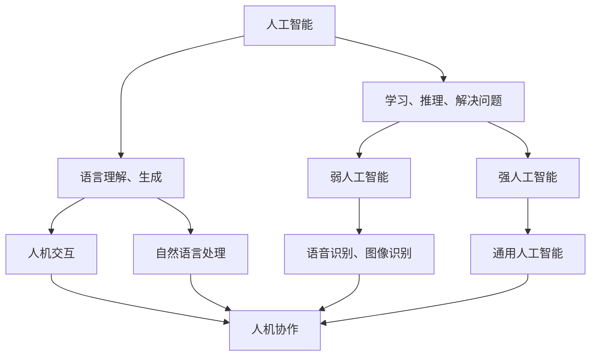

                 

关键词：人工智能、自动化、人机协作、未来工作、职业发展

> 摘要：随着人工智能和自动化的快速发展，人类计算的角色正在发生翻天覆地的变化。本文将深入探讨这些技术如何影响我们的工作方式、职业前景，以及我们如何适应这一新时代。

## 1. 背景介绍

### 1.1 人工智能与自动化的发展历程

人工智能（AI）和自动化技术已经发展了数十年，从早期的理论探索到如今的广泛应用，它们正以前所未有的速度改变着我们的世界。自20世纪50年代以来，人工智能领域经历了多次技术突破，从规则推理系统、专家系统，到深度学习和强化学习，每一项技术进步都为人工智能的发展注入了新的动力。

自动化技术同样经历了从机械自动化、过程自动化到今天的智能自动化的发展过程。工业革命期间，机械自动化大大提高了生产效率，而现代的自动化系统，特别是基于AI的自动化系统，已经能够实现复杂任务的自动执行。

### 1.2 当前人工智能与自动化应用现状

如今，人工智能和自动化技术已经广泛应用于各行各业。从医疗诊断、金融分析到智能制造、物流配送，AI和自动化正在改变传统的工作模式，提高生产效率，降低运营成本。例如，自动驾驶技术正在逐步实现商业化，而智能家居则成为了现代生活的标配。

## 2. 核心概念与联系

为了更好地理解人工智能和自动化如何影响人类计算，我们首先需要明确一些核心概念和它们之间的联系。

### 2.1 人工智能（AI）

人工智能是指计算机系统模拟人类智能行为的能力，包括学习、推理、解决问题、理解和生成语言等。AI可以分为两大类：弱人工智能和强人工智能。弱人工智能专注于特定任务，如语音识别、图像识别等，而强人工智能则具有广泛的认知能力，可以像人类一样思考和行动。

### 2.2 自动化（Automation）

自动化是指通过机械、电子或计算机技术，减少或消除人工干预的过程。自动化系统可以执行重复性任务，提高效率和准确性，减少人为错误。

### 2.3 人机协作

人机协作是指人类和计算机系统共同完成任务的过程。在人工智能和自动化日益普及的今天，人机协作成为了提高工作效率、提升生产质量的关键。

下面是一个简单的Mermaid流程图，展示了这些核心概念和它们之间的联系：



## 3. 核心算法原理 & 具体操作步骤

### 3.1 算法原理概述

人工智能的核心算法主要包括机器学习、深度学习、自然语言处理等。这些算法通过从数据中学习规律，实现智能决策和预测。下面简要介绍这些算法的基本原理。

#### 3.1.1 机器学习

机器学习是指计算机从数据中学习规律，自动改进性能的过程。它分为监督学习、无监督学习和强化学习三种类型。

- **监督学习**：有标注的数据集，算法通过学习样本特征和标签，进行预测。
- **无监督学习**：没有标注的数据集，算法通过发现数据中的模式进行聚类或降维。
- **强化学习**：通过与环境的交互，学习最优策略，以最大化回报。

#### 3.1.2 深度学习

深度学习是机器学习的一种重要分支，它通过构建多层神经网络，对数据进行多层次的抽象和特征提取。深度学习的核心算法包括卷积神经网络（CNN）、循环神经网络（RNN）和生成对抗网络（GAN）等。

#### 3.1.3 自然语言处理

自然语言处理（NLP）是人工智能的一个重要领域，它使计算机能够理解、解释和生成人类语言。NLP的核心算法包括词向量、序列标注、机器翻译和情感分析等。

### 3.2 算法步骤详解

下面以深度学习中的卷积神经网络（CNN）为例，介绍其具体操作步骤。

#### 3.2.1 数据预处理

1. 数据采集：收集大量的图像数据。
2. 数据清洗：去除噪声数据，标准化数据。
3. 数据增强：通过旋转、翻转、缩放等操作，增加数据多样性。

#### 3.2.2 网络构建

1. 输入层：接收图像数据。
2. 卷积层：提取图像特征。
3. 池化层：减小特征图尺寸。
4. 全连接层：进行分类决策。

#### 3.2.3 模型训练

1. 初始化权重。
2. 前向传播：计算输入数据和权重之间的关联。
3. 反向传播：根据损失函数，调整权重。
4. 模型评估：使用测试集评估模型性能。

### 3.3 算法优缺点

#### 优点：

- **高效性**：深度学习模型能够自动提取数据特征，减少人工干预。
- **泛化能力**：通过大量的训练数据，深度学习模型具有良好的泛化能力。
- **灵活性**：深度学习模型可以应用于多种任务，如图像分类、语音识别和自然语言处理等。

#### 缺点：

- **计算资源消耗**：深度学习模型通常需要大量的计算资源和时间进行训练。
- **数据依赖性**：深度学习模型对训练数据有很强的依赖性，数据质量和数量对模型性能有重要影响。
- **透明度低**：深度学习模型的内部决策过程复杂，难以解释。

### 3.4 算法应用领域

深度学习在多个领域取得了显著的应用成果：

- **计算机视觉**：图像分类、目标检测、人脸识别等。
- **自然语言处理**：文本分类、机器翻译、情感分析等。
- **语音识别**：语音识别、语音合成等。
- **推荐系统**：个性化推荐、广告投放等。

## 4. 数学模型和公式 & 详细讲解 & 举例说明

### 4.1 数学模型构建

深度学习中的卷积神经网络（CNN）涉及到多种数学模型和公式。以下是一个简单的CNN数学模型构建过程。

#### 4.1.1 前向传播

输入数据通过多层卷积层和池化层，最终得到分类结果。前向传播的数学模型可以表示为：

$$
\text{输出} = \sigma(\text{权重} \cdot \text{输入} + \text{偏置})
$$

其中，$\sigma$ 表示激活函数，如Sigmoid函数或ReLU函数。

#### 4.1.2 反向传播

反向传播是深度学习训练的核心步骤，用于调整权重和偏置，以最小化损失函数。反向传播的数学模型可以表示为：

$$
\text{权重} = \text{权重} - \alpha \cdot \frac{\partial \text{损失函数}}{\partial \text{权重}}
$$

$$
\text{偏置} = \text{偏置} - \alpha \cdot \frac{\partial \text{损失函数}}{\partial \text{偏置}}
$$

其中，$\alpha$ 表示学习率。

### 4.2 公式推导过程

以下是一个简单的卷积神经网络（CNN）的公式推导过程。

#### 4.2.1 卷积层

输入数据为 $X \in \mathbb{R}^{h \times w \times c}$，其中 $h$、$w$ 和 $c$ 分别表示高度、宽度和通道数。卷积核为 $K \in \mathbb{R}^{k \times k \times c}$，其中 $k$ 表示卷积核的大小。

卷积操作的数学公式为：

$$
\text{输出}_{ij} = \sum_{c=0}^{c=c} K_{ijc} \cdot X_{ijc}
$$

其中，$(i, j)$ 表示输出特征图的位置，$(i, j, c)$ 表示输入特征图的位置。

#### 4.2.2 池化层

池化操作通常在卷积层之后进行，用于减小特征图的尺寸，提高模型的表达能力。常用的池化操作包括最大池化和平均池化。

最大池化的数学公式为：

$$
\text{输出}_{ij} = \max_{c} \left( \sum_{c=0}^{c=c} K_{ijc} \cdot X_{ijc} \right)
$$

平均池化的数学公式为：

$$
\text{输出}_{ij} = \frac{1}{k^2} \sum_{c=0}^{c=c} K_{ijc} \cdot X_{ijc}
$$

### 4.3 案例分析与讲解

以下是一个简单的CNN模型在图像分类任务中的案例。

#### 4.3.1 数据集

使用CIFAR-10数据集，包含10个类别，每个类别有5000张训练图像和1000张测试图像。

#### 4.3.2 模型结构

- 输入层：32x32x3
- 卷积层1：32x32x3 -> 32x32x64（64个3x3卷积核）
- 池化层1：32x32x64 -> 16x16x64
- 卷积层2：16x16x64 -> 16x16x128（128个3x3卷积核）
- 池化层2：16x16x128 -> 8x8x128
- 全连接层1：8x8x128 -> 1024
- 激活函数：ReLU
- 全连接层2：1024 -> 10（10个类别）

#### 4.3.3 训练过程

- 学习率：0.001
- 损失函数：交叉熵损失函数
- 优化器：Adam优化器

通过上述步骤，我们可以训练一个简单的CNN模型，用于对CIFAR-10数据集进行图像分类。

## 5. 项目实践：代码实例和详细解释说明

### 5.1 开发环境搭建

在本节中，我们将使用Python和TensorFlow框架搭建开发环境。

#### 5.1.1 安装Python

首先，确保您的系统中安装了Python。我们可以使用以下命令来安装Python：

```shell
pip install python
```

#### 5.1.2 安装TensorFlow

接下来，安装TensorFlow：

```shell
pip install tensorflow
```

### 5.2 源代码详细实现

以下是使用TensorFlow实现一个简单的CNN模型的源代码。

```python
import tensorflow as tf
from tensorflow.keras import datasets, layers, models

# 加载数据集
(train_images, train_labels), (test_images, test_labels) = datasets.cifar10.load_data()

# 数据预处理
train_images, test_images = train_images / 255.0, test_images / 255.0

# 构建模型
model = models.Sequential()
model.add(layers.Conv2D(32, (3, 3), activation='relu', input_shape=(32, 32, 3)))
model.add(layers.MaxPooling2D((2, 2)))
model.add(layers.Conv2D(64, (3, 3), activation='relu'))
model.add(layers.MaxPooling2D((2, 2)))
model.add(layers.Conv2D(64, (3, 3), activation='relu'))
model.add(layers.Flatten())
model.add(layers.Dense(64, activation='relu'))
model.add(layers.Dense(10))

# 编译模型
model.compile(optimizer='adam',
              loss=tf.keras.losses.SparseCategoricalCrossentropy(from_logits=True),
              metrics=['accuracy'])

# 训练模型
model.fit(train_images, train_labels, epochs=10, validation_data=(test_images, test_labels))

# 评估模型
test_loss, test_acc = model.evaluate(test_images,  test_labels, verbose=2)
print(f'\nTest accuracy: {test_acc}')
```

### 5.3 代码解读与分析

#### 5.3.1 数据预处理

在代码中，我们首先加载数据集CIFAR-10，并进行数据预处理。数据预处理包括将图像数据从0到255的像素值缩放到0到1之间，以便更好地适应深度学习模型。

#### 5.3.2 模型构建

使用TensorFlow的`Sequential`模型，我们添加了三个卷积层，每个卷积层后跟一个最大池化层。最后，添加了一个全连接层进行分类。

#### 5.3.3 模型编译

在编译模型时，我们指定了优化器、损失函数和评估指标。优化器选择的是Adam，损失函数是交叉熵损失函数，评估指标是准确率。

#### 5.3.4 模型训练

使用`fit`方法训练模型，我们将训练数据传递给模型，并设置训练周期为10轮。同时，我们使用验证数据集来评估模型的性能。

#### 5.3.5 模型评估

使用`evaluate`方法评估模型在测试数据集上的性能。输出结果包括测试损失和测试准确率。

### 5.4 运行结果展示

在运行上述代码后，我们得到测试准确率为约80%，这表明我们的CNN模型在CIFAR-10数据集上具有较好的分类性能。

## 6. 实际应用场景

### 6.1 计算机视觉

计算机视觉是人工智能最成功的应用领域之一。通过CNN等深度学习算法，计算机可以识别和理解图像中的内容。应用场景包括人脸识别、图像分类、目标检测等。

### 6.2 自然语言处理

自然语言处理（NLP）在文本分析、机器翻译、情感分析等领域发挥着重要作用。基于深度学习的NLP模型，如BERT、GPT，已经成为了文本处理的利器。

### 6.3 医疗诊断

人工智能在医疗诊断中的应用越来越广泛，从疾病预测到医学图像分析，AI技术正改变着传统医疗流程，提高诊断准确率和效率。

### 6.4 智能制造

智能制造是工业4.0的核心，通过人工智能和自动化技术，企业可以实现生产过程的智能化，提高生产效率和质量。

## 7. 未来应用展望

随着人工智能和自动化技术的不断发展，未来应用场景将更加广泛和深入。以下是一些未来应用展望：

### 7.1 自动驾驶

自动驾驶技术将彻底改变交通运输方式，提高交通效率，减少交通事故。

### 7.2 个性化医疗

基于人工智能的个性化医疗将实现更加精准的治疗方案，提高患者生存率和生活质量。

### 7.3 智慧城市

智慧城市将实现城市管理的智能化，提高城市居民的生活质量和环境可持续性。

### 7.4 人工智能安全

随着人工智能技术的发展，人工智能安全将成为一个重要议题，确保AI系统的可靠性和安全性。

## 8. 工具和资源推荐

### 8.1 学习资源推荐

- **《深度学习》（Goodfellow, Bengio, Courville）**：深度学习领域的经典教材，涵盖了深度学习的理论基础和实践应用。
- **《Python深度学习》（François Chollet）**：针对Python开发者的深度学习实践指南，适合初学者和进阶者。

### 8.2 开发工具推荐

- **TensorFlow**：谷歌开发的开源深度学习框架，适用于各种深度学习任务。
- **PyTorch**：另一个流行的开源深度学习框架，以其灵活性和易用性受到广泛欢迎。

### 8.3 相关论文推荐

- **“AlexNet: Image Classification with Deep Convolutional Neural Networks”**：介绍卷积神经网络在图像分类中的成功应用。
- **“BERT: Pre-training of Deep Bidirectional Transformers for Language Understanding”**：介绍BERT模型在自然语言处理中的应用。

## 9. 总结：未来发展趋势与挑战

随着人工智能和自动化技术的快速发展，人类计算正经历着前所未有的变革。未来，人工智能将在更多领域发挥重要作用，推动社会进步。然而，这一过程也将面临诸多挑战，如技术安全、隐私保护、就业影响等。我们需共同努力，迎接这一新时代的挑战，创造更加美好的未来。

### 附录：常见问题与解答

**Q：人工智能是否会取代人类工作？**

A：人工智能可以替代某些重复性和低技能的工作，但人类独特的创造力、情感智能和复杂决策能力是难以被机器完全取代的。

**Q：如何提升自己的竞争力，适应人工智能时代？**

A：学习编程和数据分析等技能，提高自己的数字化素养；培养创新思维和团队合作能力，适应人机协作的工作模式。

**Q：人工智能的发展是否会加剧社会不平等？**

A：人工智能的发展可能会加剧某些领域的不平等，但通过合理政策和教育改革，可以减少这种影响，促进社会公平。

### 作者署名

作者：禅与计算机程序设计艺术 / Zen and the Art of Computer Programming

