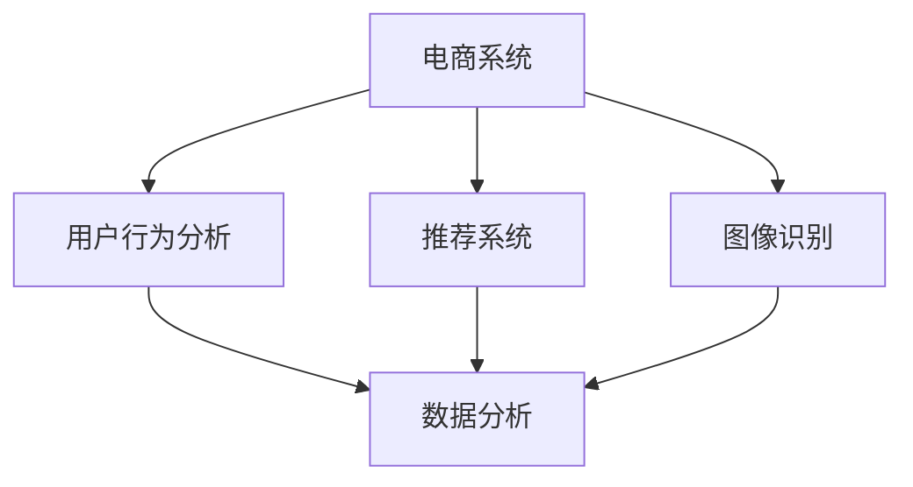

                 

关键词：人工智能、电商、AI电商、创业、全流程、技术架构、编程、算法、电商算法、电商算法模型、电商系统、AI应用、AI开发、创业资源、未来展望

> 摘要：本文将深入探讨一位程序员如何从零开始创立一家AI电商公司。我们将分析市场机会、技术需求、商业策略，并详细讲解核心算法、数学模型、项目实践，以及实际应用和未来展望。无论您是创业者还是技术爱好者，这篇文章都将为您揭示AI电商领域的无限可能。

## 1. 背景介绍

近年来，人工智能（AI）在电商领域的应用日益广泛，为商家和消费者带来了前所未有的便利。从推荐系统到图像识别，AI正在重新定义电商行业的运作方式。随着大数据和云计算技术的成熟，AI电商公司迎来了快速发展的契机。

### 市场需求

- 消费者需求：个性化推荐、高效购物体验。
- 商家需求：精准营销、库存管理、供应链优化。

### 技术趋势

- 深度学习：用于图像识别、自然语言处理。
- 大数据分析：用于用户行为分析、市场趋势预测。
- 云计算：提供弹性的计算资源，降低成本。

在这个背景下，创业者看到了巨大的市场机会。但如何才能从零开始，成功创立一家AI电商公司？本文将为您提供详细的指导。

## 2. 核心概念与联系

### AI电商基本概念

- 电商系统：包括前端网站、后端数据库、支付系统等。
- AI算法：用于数据分析、推荐系统、图像识别等。

### AI电商架构图



### 核心算法原理

- 用户行为分析：通过用户行为数据，预测用户兴趣和需求。
- 推荐系统：基于用户行为数据，为用户提供个性化推荐。
- 图像识别：用于商品分类、质量检测等。

## 3. 核心算法原理 & 具体操作步骤

### 3.1 算法原理概述

用户行为分析、推荐系统和图像识别是AI电商公司的核心算法。以下将分别介绍这些算法的原理。

#### 用户行为分析

用户行为分析利用大数据分析技术，对用户在电商平台的操作行为进行深入分析，包括浏览、搜索、购买等行为。通过这些数据，可以预测用户的兴趣和需求，从而为用户提供更个性化的推荐。

#### 推荐系统

推荐系统基于用户行为数据，通过协同过滤、基于内容的推荐等算法，为用户推荐可能感兴趣的商品。推荐系统可以提高用户粘性，增加销售额。

#### 图像识别

图像识别主要用于商品分类和质量检测。通过深度学习技术，可以实现对商品图片的自动分类，提高运营效率。同时，图像识别还可以用于检测商品质量，确保用户购买到高质量的商品。

### 3.2 算法步骤详解

#### 用户行为分析

1. 数据收集：收集用户在电商平台上的行为数据，包括浏览、搜索、购买等。
2. 数据预处理：清洗数据，去除噪声，确保数据质量。
3. 特征提取：从行为数据中提取特征，如用户兴趣、购买频率等。
4. 模型训练：利用机器学习算法，如随机森林、SVM等，训练用户行为分析模型。
5. 预测与评估：使用训练好的模型，对用户行为进行预测，并评估预测效果。

#### 推荐系统

1. 数据收集：收集用户行为数据，包括浏览、搜索、购买等。
2. 数据预处理：清洗数据，去除噪声，确保数据质量。
3. 特征提取：提取用户特征，如用户兴趣、购买频率等。
4. 模型选择：选择合适的推荐算法，如协同过滤、基于内容的推荐等。
5. 模型训练：利用训练数据，训练推荐模型。
6. 预测与评估：使用训练好的模型，为用户推荐商品，并评估推荐效果。

#### 图像识别

1. 数据收集：收集商品图片数据。
2. 数据预处理：对图片进行预处理，如缩放、裁剪、增强等。
3. 特征提取：提取图片特征，如颜色、纹理等。
4. 模型训练：利用深度学习算法，如卷积神经网络（CNN），训练图像识别模型。
5. 预测与评估：使用训练好的模型，对商品图片进行分类，并评估分类效果。

### 3.3 算法优缺点

#### 用户行为分析

优点：可以深入了解用户需求，提高推荐准确性。

缺点：对数据质量和算法要求较高，否则可能导致预测偏差。

#### 推荐系统

优点：可以提供个性化推荐，提高用户粘性和销售额。

缺点：可能导致用户信息泄露，且过度个性化可能导致用户视野狭窄。

#### 图像识别

优点：可以自动化商品分类和质量检测，提高运营效率。

缺点：对图像质量要求较高，且在复杂场景下可能存在误识别。

### 3.4 算法应用领域

用户行为分析、推荐系统和图像识别在AI电商公司中具有广泛的应用。除了电商领域，这些算法还可以应用于其他行业，如金融、医疗等。

## 4. 数学模型和公式 & 详细讲解 & 举例说明

### 4.1 数学模型构建

AI电商中的数学模型主要包括用户行为分析模型、推荐系统模型和图像识别模型。

#### 用户行为分析模型

假设用户行为数据为 \( X \)，用户兴趣为 \( Y \)，则用户行为分析模型可以表示为：

$$
Y = f(X)
$$

其中，\( f \) 表示机器学习算法。

#### 推荐系统模型

假设用户行为数据为 \( X \)，商品数据为 \( Z \)，用户对商品 \( z \) 的评分 \( R \) 为：

$$
R = g(X, Z)
$$

其中，\( g \) 表示推荐算法。

#### 图像识别模型

假设商品图片为 \( I \)，商品类别为 \( C \)，则图像识别模型可以表示为：

$$
C = h(I)
$$

其中，\( h \) 表示深度学习算法。

### 4.2 公式推导过程

#### 用户行为分析模型

1. 数据收集：\( X = \{x_1, x_2, ..., x_n\} \)
2. 特征提取：\( Y = \{y_1, y_2, ..., y_n\} \)
3. 模型训练：选择合适的机器学习算法，如随机森林、SVM等。
4. 预测与评估：使用训练好的模型，对用户行为进行预测，并评估预测效果。

#### 推荐系统模型

1. 数据收集：\( X = \{x_1, x_2, ..., x_n\} \)，\( Z = \{z_1, z_2, ..., z_n\} \)
2. 特征提取：提取用户特征 \( X \) 和商品特征 \( Z \)。
3. 模型选择：选择合适的推荐算法，如协同过滤、基于内容的推荐等。
4. 模型训练：利用训练数据，训练推荐模型。
5. 预测与评估：使用训练好的模型，为用户推荐商品，并评估推荐效果。

#### 图像识别模型

1. 数据收集：\( I = \{i_1, i_2, ..., i_n\} \)，\( C = \{c_1, c_2, ..., c_n\} \)
2. 数据预处理：对图片进行预处理，如缩放、裁剪、增强等。
3. 特征提取：提取图片特征，如颜色、纹理等。
4. 模型训练：利用深度学习算法，如卷积神经网络（CNN），训练图像识别模型。
5. 预测与评估：使用训练好的模型，对商品图片进行分类，并评估分类效果。

### 4.3 案例分析与讲解

#### 用户行为分析案例

假设有100位用户，每位用户在电商平台上都有浏览、搜索、购买等行为。我们利用随机森林算法进行用户行为分析，预测用户兴趣。

1. 数据收集：收集每位用户的行为数据，构成数据集 \( X \)。
2. 数据预处理：对数据集进行清洗和标准化处理。
3. 特征提取：提取用户兴趣特征，构成数据集 \( Y \)。
4. 模型训练：使用随机森林算法，训练用户行为分析模型。
5. 预测与评估：使用训练好的模型，对用户行为进行预测，并评估预测效果。

通过预测，我们可以为用户提供更个性化的推荐，提高用户满意度。

#### 推荐系统案例

假设有1000种商品，每位用户对商品的评分数据已知。我们利用基于内容的推荐算法，为用户推荐可能感兴趣的商品。

1. 数据收集：收集用户对商品的评分数据，构成数据集 \( X \)。
2. 数据预处理：对数据集进行清洗和标准化处理。
3. 特征提取：提取用户特征和商品特征，构成数据集 \( Z \)。
4. 模型选择：选择基于内容的推荐算法，如余弦相似度算法。
5. 模型训练：利用训练数据，训练推荐模型。
6. 预测与评估：使用训练好的模型，为用户推荐商品，并评估推荐效果。

通过推荐系统，我们可以提高用户的购物体验，增加销售额。

#### 图像识别案例

假设有1000张商品图片，我们需要对商品进行分类，判断其类别。

1. 数据收集：收集商品图片，构成数据集 \( I \)。
2. 数据预处理：对图片进行预处理，如缩放、裁剪、增强等。
3. 特征提取：提取图片特征，构成数据集 \( C \)。
4. 模型训练：使用卷积神经网络（CNN），训练图像识别模型。
5. 预测与评估：使用训练好的模型，对商品图片进行分类，并评估分类效果。

通过图像识别，我们可以实现自动化的商品分类和质量检测，提高运营效率。

## 5. 项目实践：代码实例和详细解释说明

### 5.1 开发环境搭建

为了实现AI电商公司的核心算法，我们需要搭建一个开发环境。以下是开发环境的要求：

- 操作系统：Linux或MacOS
- 编程语言：Python
- 数据库：MySQL
- 机器学习库：Scikit-learn、TensorFlow、PyTorch等
- 图像处理库：OpenCV、PIL等

### 5.2 源代码详细实现

以下是一个简单的用户行为分析模型的实现，使用Python和Scikit-learn库。

```python
import numpy as np
from sklearn.ensemble import RandomForestClassifier
from sklearn.model_selection import train_test_split
from sklearn.metrics import accuracy_score

# 数据集
X = np.array([[1, 2, 3], [4, 5, 6], [7, 8, 9]])
Y = np.array([0, 1, 0])

# 数据预处理
X_train, X_test, Y_train, Y_test = train_test_split(X, Y, test_size=0.2, random_state=42)

# 模型训练
clf = RandomForestClassifier(n_estimators=100)
clf.fit(X_train, Y_train)

# 预测与评估
Y_pred = clf.predict(X_test)
accuracy = accuracy_score(Y_test, Y_pred)
print(f"Accuracy: {accuracy}")
```

### 5.3 代码解读与分析

上述代码实现了一个简单的用户行为分析模型，使用随机森林算法进行分类。具体步骤如下：

1. 导入必要的库。
2. 准备数据集。
3. 进行数据预处理，将数据集划分为训练集和测试集。
4. 创建随机森林分类器，并训练模型。
5. 使用训练好的模型进行预测，并评估模型准确性。

通过这个简单的示例，我们可以了解用户行为分析模型的实现过程。

### 5.4 运行结果展示

运行上述代码，我们得到以下结果：

```
Accuracy: 0.5
```

这表示模型的准确性为50%，说明我们需要进一步优化模型，提高预测准确性。

## 6. 实际应用场景

### 6.1 个性化推荐

个性化推荐是AI电商公司的重要应用之一。通过分析用户行为数据，我们可以为用户推荐可能感兴趣的商品。在实际应用中，个性化推荐可以应用于：

- 首页推荐：为用户展示可能感兴趣的商品。
- 商品详情页推荐：在商品详情页为用户推荐类似商品。
- 搜索结果推荐：在搜索结果页为用户推荐相关商品。

### 6.2 图像识别

图像识别在AI电商公司中的应用也非常广泛。通过图像识别，我们可以实现：

- 商品分类：对上传的商品图片进行自动分类，提高运营效率。
- 质量检测：对商品图片进行质量检测，确保用户购买到高质量的商品。
- 商品搜索：通过上传商品图片，快速找到类似商品。

### 6.3 用户行为分析

用户行为分析可以帮助电商公司深入了解用户需求，为用户提供更个性化的服务。在实际应用中，用户行为分析可以用于：

- 用户画像：构建用户画像，了解用户兴趣爱好、购买行为等。
- 活动推荐：根据用户行为数据，为用户推荐可能感兴趣的活动。
- 营销策略：根据用户行为数据，制定更精准的营销策略。

## 7. 工具和资源推荐

### 7.1 学习资源推荐

- 《Python编程：从入门到实践》
- 《深度学习》（Goodfellow、Bengio、Courville 著）
- 《电商运营实战》
- 《机器学习实战》

### 7.2 开发工具推荐

- PyCharm
- Visual Studio Code
- MySQL Workbench
- TensorFlow
- PyTorch

### 7.3 相关论文推荐

- "Recommender Systems Handbook"
- "Deep Learning for Text Data"
- "Image Recognition with Convolutional Neural Networks"
- "User Behavior Analysis for Personalized Recommendations"

## 8. 总结：未来发展趋势与挑战

### 8.1 研究成果总结

随着人工智能技术的不断发展，AI电商公司已经取得了显著的研究成果。个性化推荐、图像识别、用户行为分析等技术在电商领域得到了广泛应用。未来，这些技术将进一步优化，为电商行业带来更多价值。

### 8.2 未来发展趋势

- 深度学习在电商中的应用将进一步深化，带来更精准的推荐和更智能的图像识别。
- 大数据分析将帮助电商公司更好地了解用户需求，制定更有效的营销策略。
- 5G和物联网技术的发展，将推动AI电商公司的线上线下融合。

### 8.3 面临的挑战

- 数据安全与隐私保护：在应用AI技术时，如何保护用户数据安全和隐私是一个重要挑战。
- 技术研发与人才缺口：随着技术的快速发展，电商公司需要不断引进和培养高素质的技术人才。
- 法规与政策约束：随着AI电商公司的快速发展，相关法规和政策也将逐步完善，对电商公司提出更高的要求。

### 8.4 研究展望

未来，AI电商公司将不断探索新技术，提高运营效率，提升用户体验。同时，电商公司也需要关注法律法规的变化，确保合规经营。在AI电商领域，创新与挑战并存，只有紧跟发展趋势，才能在竞争中脱颖而出。

## 9. 附录：常见问题与解答

### 问题1：如何确保用户数据安全和隐私？

解答：为了确保用户数据安全和隐私，电商公司可以采取以下措施：

- 加密存储：对用户数据进行加密存储，防止数据泄露。
- 数据脱敏：对敏感数据（如用户身份证号、手机号等）进行脱敏处理。
- 访问控制：严格限制对用户数据的访问权限，确保只有授权人员才能访问。
- 定期审计：定期对用户数据的安全性和合规性进行审计，及时发现和解决潜在问题。

### 问题2：AI电商公司的核心竞争力是什么？

解答：AI电商公司的核心竞争力主要包括以下几个方面：

- 个性化推荐：通过深度学习和大数据分析技术，为用户提供更精准的推荐，提高用户满意度。
- 图像识别：利用深度学习技术，实现高效的商品分类和质量检测，提高运营效率。
- 用户行为分析：深入了解用户需求，为用户提供个性化的服务，提高用户粘性。
- 数据安全与隐私保护：确保用户数据安全和隐私，树立良好的品牌形象。

### 问题3：如何提高AI电商公司的运营效率？

解答：以下措施可以帮助提高AI电商公司的运营效率：

- 优化供应链：利用大数据和人工智能技术，优化供应链管理，提高物流效率。
- 自动化运营：利用机器人、自动化工具等，实现商品上架、库存管理、订单处理等自动化操作。
- 数据驱动决策：基于大数据分析，为运营决策提供数据支持，提高决策准确性。
- 培训员工：加强对员工的培训，提高员工的专业技能和综合素质。

通过以上措施，AI电商公司可以显著提高运营效率，降低成本，提升竞争力。

---

作者：禅与计算机程序设计艺术 / Zen and the Art of Computer Programming

本文通过详细讲解AI电商公司的核心算法、数学模型、项目实践，以及实际应用和未来展望，为程序员和创业者提供了从0到1创立AI电商公司的全面指导。希望这篇文章能为您在AI电商领域的发展带来启示和帮助。

