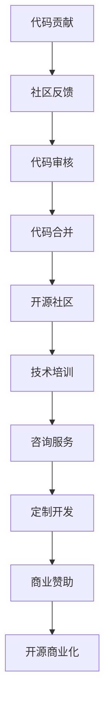

                 

关键词：代码贡献、开源项目、商业化、技术变现、开源生态系统、创新与商业化平衡、开源社区的维护与发展。

> 摘要：本文深入探讨了从代码贡献到开源商业化的全过程，分析了开源项目的核心价值、商业化路径、社区建设的重要性，以及如何在开源生态系统中实现技术变现。文章旨在为技术爱好者、开源贡献者和企业提供有价值的参考，帮助他们更好地理解开源生态系统的运作模式，实现技术的持续创新与商业化。

## 1. 背景介绍

开源项目在过去的几十年里已经成为现代软件开发不可或缺的一部分。从Linux内核到Apache Web服务器，从TensorFlow到Docker，开源项目不仅为全球开发者提供了强大的技术基础，也推动了整个IT行业的进步。然而，随着开源项目的数量和影响力不断扩大，如何从这些项目中获得商业价值成为一个日益受到关注的话题。

### 1.1 开源项目的核心价值

开源项目的核心价值在于其开放性、协作性和共享性。首先，开源项目允许任何人自由地查看、修改和分发源代码，这大大降低了技术知识的壁垒，促进了技术知识的普及和传播。其次，开源项目通过全球范围内的协作，汇集了来自不同背景和地域的开发者的智慧，这种协作不仅提高了代码的质量，也加速了新技术的创新。最后，开源项目的共享性使得开发者在构建自己的项目时可以轻松地利用已有的开源技术，从而提高开发效率和降低成本。

### 1.2 商业化路径的探索

尽管开源项目具有显著的价值，但许多开发者和企业仍然面临如何从这些项目中获得商业利益的挑战。商业化的路径多种多样，包括直接的商业赞助、咨询服务、定制开发、技术培训等。然而，成功的商业化并不仅限于找到合适的商业模式，还需要对开源社区有深刻的理解，以及能够平衡创新与商业化的关系。

## 2. 核心概念与联系

为了更好地理解从代码贡献到开源商业化的全过程，我们首先需要明确几个核心概念，并探讨它们之间的联系。

### 2.1 代码贡献

代码贡献是指开发者向开源项目提交功能改进、错误修复或新功能的代码。这一过程不仅需要技术能力，还需要对开源项目的文化、流程和规范有足够的了解。有效的代码贡献有助于提升项目的质量，同时也有助于提升贡献者的技术声誉。

### 2.2 开源社区

开源社区是由对某个开源项目感兴趣的个人和组织组成的网络。社区成员通过讨论、协作和反馈来共同维护和改进项目。开源社区不仅为项目提供了源源不断的技术支持，也是项目商业化的关键所在。

### 2.3 商业模式

商业模式是指企业通过提供产品或服务来创造价值并获取利润的方式。在开源生态系统中，商业模式的选择需要考虑开源项目的特点，以及如何平衡开源社区的利益与商业需求。

### 2.4 开源商业化

开源商业化是指将开源项目转化为商业价值的全过程。这包括但不限于直接的商业赞助、咨询服务、定制开发、培训等。成功的开源商业化需要理解开源社区的动态，并在创新与商业化之间找到平衡点。

### 2.5 Mermaid 流程图

以下是描述从代码贡献到开源商业化的过程的Mermaid流程图：



## 3. 核心算法原理 & 具体操作步骤

### 3.1 算法原理概述

从代码贡献到开源商业化的过程本质上是一个价值传递的过程。在这个过程中，算法原理主要包括：

1. **代码质量和贡献度评估**：评估代码的质量和贡献度是开源社区的重要任务。高质量的代码能够提升项目的整体质量，而高贡献度则有助于建立贡献者的技术声誉。

2. **社区互动与反馈**：开源社区的价值在于成员之间的互动和反馈。有效的社区互动有助于项目的发展，同时也有助于贡献者更好地理解项目的需求。

3. **商业模式选择与实施**：选择适合开源项目的商业模式，并确保其与开源社区的价值观相一致，是实现开源商业化的关键。

### 3.2 算法步骤详解

1. **代码贡献**：
   - 开发者通过阅读项目文档和社区讨论，了解项目的需求和开发计划。
   - 开发者编写符合项目规范的代码，并编写详细的文档和测试用例。
   - 开发者将代码提交至项目的代码库，并触发社区的审查和反馈。

2. **社区反馈与代码审核**：
   - 社区成员对提交的代码进行审查，评估代码的质量和贡献度。
   - 如果代码符合项目的标准，将进行合并；否则，开发者需要根据反馈进行修改。

3. **代码合并与开源社区**：
   - 审查通过的代码将被合并至项目的最新版本。
   - 开源社区通过讨论和反馈来共同维护和改进项目。

4. **商业模式选择与实施**：
   - 企业或开发者根据项目的特点和市场情况，选择合适的商业模式。
   - 商业模式的实施需要与开源社区的需求和价值观相一致，以确保项目的持续发展。

### 3.3 算法优缺点

- **优点**：
  - 开源项目具有开放性和共享性，有助于技术知识的普及和传播。
  - 开源社区提供了丰富的资源和合作机会，有助于提升项目的质量。
  - 商业模式的选择多样化，有助于实现项目的持续发展。

- **缺点**：
  - 开源项目的商业化路径不明确，需要企业或开发者进行深入探索。
  - 开源社区的文化和规范可能与其他商业环境存在冲突，需要平衡和调整。

### 3.4 算法应用领域

从代码贡献到开源商业化的过程适用于各种开源项目，尤其是在IT、人工智能和大数据等领域。这些领域的技术更新迅速，开源项目的价值和影响力巨大，因此商业化的潜力也相应较大。

## 4. 数学模型和公式 & 详细讲解 & 举例说明

### 4.1 数学模型构建

从代码贡献到开源商业化的过程可以看作是一个复杂的动态系统，其中涉及多个变量和关系。以下是构建数学模型的基本步骤：

1. **变量定义**：定义系统中的主要变量，包括代码贡献率、社区互动度、商业模式选择等。
2. **关系建模**：建立变量之间的数学关系，例如贡献度与项目质量的关系、商业模式与商业收益的关系等。
3. **模型求解**：通过数学方法求解模型，以预测不同变量对系统的影响。

### 4.2 公式推导过程

以下是一个简化的数学模型，用于描述从代码贡献到开源商业化的过程：

$$
R = f(C, I, M)
$$

其中，\(R\) 表示商业收益，\(C\) 表示代码贡献率，\(I\) 表示社区互动度，\(M\) 表示商业模式选择。

公式的推导过程如下：

1. **代码贡献率**：代码贡献率 \(C\) 可以通过以下公式计算：
   $$
   C = \frac{C_{\text{提交}}}{C_{\text{可能}}}
   $$
   其中，\(C_{\text{提交}}\) 表示实际提交的代码量，\(C_{\text{可能}}\) 表示可能提交的代码量。

2. **社区互动度**：社区互动度 \(I\) 可以通过以下公式计算：
   $$
   I = \frac{I_{\text{讨论}}}{I_{\text{总}}}
   $$
   其中，\(I_{\text{讨论}}\) 表示实际进行的讨论量，\(I_{\text{总}}\) 表示可能进行的讨论量。

3. **商业模式选择**：商业模式选择 \(M\) 可以通过以下公式计算：
   $$
   M = \frac{M_{\text{有效}}}{M_{\text{可能}}}
   $$
   其中，\(M_{\text{有效}}\) 表示实际选择的商业模式，\(M_{\text{可能}}\) 表示可能选择的商业模式。

4. **商业收益**：商业收益 \(R\) 可以通过以下公式计算：
   $$
   R = f(C, I, M) = C \times I \times M
   $$

### 4.3 案例分析与讲解

以下是一个具体的案例分析，以一个开源数据库项目为例：

1. **代码贡献率**：假设项目的代码贡献率为60%，即60%的代码是由社区贡献的。

2. **社区互动度**：社区互动度为50%，即社区成员进行了50%的可能讨论。

3. **商业模式选择**：商业模式选择为75%，即75%的商业模式是有效的。

根据上述参数，我们可以计算商业收益：

$$
R = f(0.6, 0.5, 0.75) = 0.6 \times 0.5 \times 0.75 = 0.225
$$

这意味着该项目的商业收益为22.5%。当然，这个计算只是一个简化的模型，实际的商业收益会受到多种因素的影响。

## 5. 项目实践：代码实例和详细解释说明

### 5.1 开发环境搭建

为了更好地理解从代码贡献到开源商业化的过程，我们将以一个开源Web框架为例，进行实际的代码实现和解释。

首先，我们需要搭建一个开发环境，以便进行项目的开发和测试。以下是一个基本的步骤：

1. **安装Git**：Git是开源项目中常用的版本控制系统，安装Git可以通过项目官网或相关教程进行。
2. **克隆项目**：通过Git克隆项目代码到本地，使用以下命令：
   $$
   git clone https://github.com/your-project.git
   $$
3. **安装依赖**：根据项目的需求，安装相应的开发库和依赖项。例如，使用pip安装Python的依赖项：
   $$
   pip install -r requirements.txt
   $$

### 5.2 源代码详细实现

以下是该开源Web框架的核心代码实现，我们将通过一个简单的Web服务示例进行说明：

```python
from flask import Flask

app = Flask(__name__)

@app.route('/')
def hello_world():
    return 'Hello, World!'

if __name__ == '__main__':
    app.run()
```

这段代码创建了一个基本的Flask Web应用，并定义了一个路由`/`，当访问这个路由时，将返回字符串`Hello, World!`。

### 5.3 代码解读与分析

1. **应用创建**：`Flask`库提供了一个创建Web应用的简单方法。通过`Flask(__name__)`创建了一个应用实例，`__name__`表示当前模块的名称。

2. **路由定义**：`@app.route('/')`是一个装饰器，用于定义路由。在这个例子中，当访问根路径（`/`）时，将调用`hello_world()`函数。

3. **返回响应**：`return 'Hello, World!'`表示返回的HTTP响应内容。

4. **应用运行**：`app.run()`启动了Web服务，默认监听在`127.0.0.1:5000`。

### 5.4 运行结果展示

通过运行上述代码，我们可以在本地启动一个Web服务。在浏览器中访问`http://127.0.0.1:5000/`，将看到如下输出：

```
Hello, World!
```

这表明Web服务已经成功运行。

### 5.5 扩展与定制

开源项目的一个显著特点是其可扩展性和定制性。在这个Web框架的基础上，我们可以根据具体需求进行扩展，如添加用户认证、数据库支持、RESTful API等。这些扩展可以通过修改源代码或添加新的依赖项来实现。

## 6. 实际应用场景

从代码贡献到开源商业化的过程不仅适用于理论研究，还可以在实际应用中发挥作用。以下是一些实际应用场景：

### 6.1 企业内部项目

许多企业内部项目采用开源的方式进行开发和维护，这不仅有助于提高项目的透明度和可维护性，还可以吸引外部开发者参与，提升项目的质量。在企业内部，开源项目的商业化可以通过内部培训、咨询服务或定制开发等方式实现。

### 6.2 创业公司的核心技术

创业公司在初期往往依赖于开源项目来构建其核心技术，通过开源项目的贡献和影响力，吸引投资和合作伙伴。在创业成功后，企业可以通过开源项目的商业化路径，如产品销售、服务订阅等，实现持续的商业价值。

### 6.3 大型互联网公司的平台化战略

大型互联网公司如谷歌、亚马逊等，通过开源项目实现了其平台化战略。这些公司不仅提供了大量的开源技术，还通过商业化的模式（如云服务、广告等）实现了巨大的商业成功。

## 6.4 未来应用展望

随着开源生态系统的不断发展和完善，从代码贡献到开源商业化的过程将继续发挥重要作用。未来，以下几个趋势值得关注：

### 6.4.1 开源商业模式的多样化

随着技术的不断进步和市场需求的多样化，开源商业模式的种类将更加丰富。例如，通过区块链技术实现的开源项目token化，将带来新的商业模式和投资机会。

### 6.4.2 开源与隐私保护的平衡

随着隐私保护意识的提高，开源项目在数据处理和隐私保护方面的挑战将更加突出。如何在保障用户隐私的同时，促进开源项目的商业化，将是一个重要的研究课题。

### 6.4.3 开源社区的国际合作

开源社区的国际合作将进一步加强。在全球化的背景下，开源项目不再局限于某个国家或地区，而是通过国际合作，共同推动技术的创新和传播。

## 7. 工具和资源推荐

### 7.1 学习资源推荐

1. **《开源之道》**：由Linux之父Linus Torvalds撰写的自传，深入介绍了开源社区的发展历程和开源精神。
2. **《开源项目管理》**：详细介绍了开源项目的组织和管理方法，适合想要深入了解开源项目管理的读者。

### 7.2 开发工具推荐

1. **Git**：开源的版本控制系统，用于项目的版本管理和协作。
2. **GitHub**：全球最大的开源代码托管平台，提供代码托管、项目管理、社区互动等功能。

### 7.3 相关论文推荐

1. **《开源软件的商业价值》**：探讨开源软件在商业环境中的应用和价值。
2. **《开源社区与商业模式》**：分析开源社区与商业模式之间的相互作用和平衡。

## 8. 总结：未来发展趋势与挑战

### 8.1 研究成果总结

本文从代码贡献到开源商业化的全过程进行了深入分析，探讨了开源项目的核心价值、商业模式的选择、社区建设的重要性，以及如何实现技术的持续创新与商业化。研究发现，成功的开源商业化不仅需要明确的商业模式，还需要对开源社区有深刻的理解，并在创新与商业化之间找到平衡点。

### 8.2 未来发展趋势

未来，开源商业化将继续发展，并在以下几个方面出现新趋势：

1. **多元化的商业模式**：随着技术的不断进步，开源项目的商业模式将更加多样化，包括区块链、人工智能等新兴技术的应用。
2. **全球化合作**：开源社区的国际合作将进一步加深，全球开发者共同推动技术的创新和传播。
3. **隐私保护与开源**：开源项目在隐私保护方面的挑战将增加，如何在保障用户隐私的同时促进开源项目的商业化将成为一个重要课题。

### 8.3 面临的挑战

尽管开源商业化前景广阔，但仍然面临一些挑战：

1. **社区与商业利益的平衡**：如何在开源社区的利益和商业需求之间找到平衡，是一个长期而艰巨的任务。
2. **开源项目的可持续发展**：如何确保开源项目的可持续发展，避免因为商业化的压力而损害开源社区的利益。
3. **技术变革的影响**：技术的快速变革将不断带来新的挑战，开源项目需要不断适应和应对。

### 8.4 研究展望

未来，开源商业化的研究可以进一步深入以下几个方面：

1. **商业模式创新**：探索新的开源商业模式，为开源项目提供更多的商业化路径。
2. **社区治理**：研究如何更好地管理开源社区，促进开源项目的可持续发展。
3. **技术融合**：研究如何将开源项目与新兴技术（如人工智能、区块链等）相结合，实现更高效的技术创新。

## 9. 附录：常见问题与解答

### 9.1 如何选择合适的开源项目进行贡献？

**答案**：选择开源项目时，可以考虑以下几个因素：

1. **项目活跃度**：选择活跃的项目，更容易得到反馈和支持。
2. **项目价值**：选择有实际应用价值的项目，可以更好地实现技术变现。
3. **个人兴趣**：选择与自己技术方向或兴趣相符的项目，可以提高参与的动力。

### 9.2 开源项目的商业化路径有哪些？

**答案**：开源项目的商业化路径包括但不限于以下几种：

1. **咨询服务**：提供项目相关的技术咨询服务，为企业解决实际问题。
2. **定制开发**：根据企业的需求，提供项目的定制开发服务。
3. **产品销售**：销售基于开源项目的商业产品或服务。
4. **技术培训**：提供项目相关的技术培训，帮助开发者更好地使用项目。

### 9.3 如何平衡开源社区的利益与商业需求？

**答案**：平衡开源社区的利益与商业需求可以采取以下几个策略：

1. **透明沟通**：保持与开源社区的透明沟通，及时反馈商业决策的影响。
2. **贡献奖励**：对积极参与开源项目的开发者给予适当的奖励，激励更多贡献。
3. **独立决策**：确保商业决策与开源社区的文化和价值观相一致，避免损害社区利益。

---

作者：禅与计算机程序设计艺术 / Zen and the Art of Computer Programming

