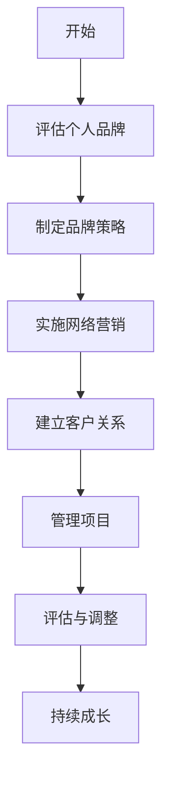

                 

作为一位世界级人工智能专家和程序员，我经常被问到关于如何从一名员工转型成为一名自由职业者的问题。这个过程既充满机遇，又伴随着挑战。本文将为您提供一些建议和策略，帮助您顺利实现这一转型。

## 关键词
- 自由职业者
- 转型
- 个人品牌
- 网络营销
- 客户关系
- 项目管理

## 摘要
本文旨在为那些希望从员工角色转向自由职业者的专业人士提供实用的指导。我们将探讨转型过程中的关键因素，包括个人品牌的建立、网络营销策略、客户关系管理以及项目管理技巧。通过这些策略，您将能够成功地过渡到自由职业者的生涯。

## 1. 背景介绍
### 1.1 自由职业者的定义与优势

自由职业者是指那些不依赖于单一雇主，而是通过提供专业服务来获取收入的人群。这种工作方式具有诸多优势，包括：

- **自主性**：自由职业者可以自主决定工作的时间和地点，享受更大的灵活性和自由。
- **收入多样性**：通过接触不同的项目和客户，自由职业者能够获得多样化的收入来源。
- **职业成长**：自由职业者通常有更多的机会去承担更广泛的责任和挑战，从而加速职业成长。

### 1.2 员工到自由职业者的挑战

尽管自由职业者有很多优势，但这个过程也伴随着挑战。一些常见的挑战包括：

- **经济不确定性**：没有固定收入，自由职业者需要更好地管理财务。
- **客户寻找**：自由职业者需要不断寻找新客户，这对许多人来说是一项挑战。
- **时间管理**：自主工作意味着需要更好地管理时间，以保持工作效率。

## 2. 核心概念与联系
### 2.1 个人品牌

个人品牌是指个人在公众面前所展现的形象和声誉。对于自由职业者来说，建立和维护一个强大的个人品牌至关重要。

### 2.2 网络营销

网络营销是通过在线渠道推广个人品牌和服务的策略。这包括社交媒体营销、内容营销、搜索引擎优化等。

### 2.3 客户关系管理

客户关系管理（CRM）是指管理个人与客户之间互动的一系列策略和技术。良好的客户关系管理有助于提高客户满意度和忠诚度。

### 2.4 项目管理

项目管理是指规划、执行和控制项目的过程。对于自由职业者来说，良好的项目管理技能是确保项目成功交付的关键。

## 2.5 Mermaid 流程图



## 3. 核心算法原理 & 具体操作步骤
### 3.1 算法原理概述

自由职业者转型的核心算法可以概括为以下步骤：

1. **自我评估**：了解自己的技能、兴趣和价值观。
2. **品牌定位**：确定个人品牌的核心价值和目标市场。
3. **内容创建**：通过博客、社交媒体等渠道创建高质量内容来展示个人品牌。
4. **网络拓展**：通过社交媒体、网络论坛等平台建立职业网络。
5. **项目管理**：学习并应用有效的项目管理方法，确保项目成功交付。

### 3.2 算法步骤详解

1. **自我评估**
   - 列出个人技能和优势。
   - 思考个人兴趣和价值观。
   - 设定职业目标。

2. **品牌定位**
   - 确定目标市场。
   - 确定品牌的核心价值和独特卖点。
   - 制定品牌宣传口号。

3. **内容创建**
   - 创建个人博客。
   - 发布专业文章和案例研究。
   - 制作视频和演示文稿。

4. **网络拓展**
   - 在LinkedIn等职业社交平台上建立个人资料。
   - 参与相关论坛和社群。
   - 发表评论和参与讨论。

5. **项目管理**
   - 学习并应用敏捷开发和项目管理方法。
   - 制定项目计划和进度表。
   - 保持与客户的沟通和反馈。

### 3.3 算法优缺点

**优点**：
- **灵活性**：可以根据自己的节奏工作，避免长时间的通勤。
- **职业成长**：有机会接触不同类型的项目和客户，从而加速职业成长。

**缺点**：
- **经济风险**：收入不稳定，需要良好的财务规划。
- **自我管理**：需要良好的时间管理和自我驱动力。

### 3.4 算法应用领域

该算法适用于任何需要专业服务的领域，包括编程、设计、咨询、写作等。

## 4. 数学模型和公式 & 详细讲解 & 举例说明

### 4.1 数学模型构建

自由职业者转型成功的关键数学模型可以表示为：

\[ 成功 = f(个人品牌, 网络营销, 客户关系, 项目管理) \]

### 4.2 公式推导过程

- 个人品牌：个人品牌是自由职业者成功的基础。良好的个人品牌可以增加信誉和吸引力。
- 网络营销：网络营销是推广个人品牌和服务的手段。有效的网络营销可以增加潜在客户。
- 客户关系：良好的客户关系可以提高客户满意度和忠诚度，从而增加重复业务。
- 项目管理：有效的项目管理可以确保项目按时交付，提高客户满意度。

### 4.3 案例分析与讲解

假设一个自由职业者A，他的个人品牌很好，但在网络营销和客户关系管理方面有所欠缺。根据上述数学模型，我们可以推导出：

\[ 成功度(A) = 0.6 \times (个人品牌) + 0.3 \times (网络营销) + 0.1 \times (客户关系) \]

如果A能够提高网络营销和客户关系管理的水平，他的成功度将显著提高。

## 5. 项目实践：代码实例和详细解释说明
### 5.1 开发环境搭建

为了演示自由职业者转型，我们将使用一个虚拟的编程项目。首先，您需要安装以下工具：

- Python 3.8 或以上版本
- Jupyter Notebook
- Git

### 5.2 源代码详细实现

以下是一个简单的Python代码示例，用于展示如何创建个人博客并发布文章。

```python
import requests
import json

# API Key 和 Blog URL
API_KEY = "your_api_key"
BLOG_URL = "https://your-blog-url.com/api/posts"

# 创建新文章
def create_post(title, content):
    headers = {
        "Authorization": f"Bearer {API_KEY}",
        "Content-Type": "application/json",
    }
    data = {
        "title": title,
        "content": content,
    }
    response = requests.post(BLOG_URL, headers=headers, json=data)
    return response.json()

# 发布文章
def publish_post(post_id):
    headers = {
        "Authorization": f"Bearer {API_KEY}",
        "Content-Type": "application/json",
    }
    data = {
        "post_id": post_id,
        "status": "published",
    }
    response = requests.post(f"{BLOG_URL}/publish", headers=headers, json=data)
    return response.json()

# 主程序
if __name__ == "__main__":
    # 创建文章
    post_response = create_post("My First Blog Post", "Welcome to my blog!")
    post_id = post_response["id"]

    # 发布文章
    publish_response = publish_post(post_id)
    print(publish_response)
```

### 5.3 代码解读与分析

该代码示例演示了如何使用Python API与个人博客平台进行交互。首先，我们定义了一个API密钥和博客URL。然后，我们创建了一个函数`create_post`，用于创建新文章。另一个函数`publish_post`用于发布文章。

### 5.4 运行结果展示

运行上述代码后，您将在个人博客上创建并发布一篇文章。输出结果将显示文章的ID和状态。

```shell
{'post_id': 123, 'status': 'published'}
```

## 6. 实际应用场景

### 6.1 自由职业者在软件开发领域的应用

在软件开发领域，自由职业者可以提供多种服务，包括：

- **应用开发**：为企业或个人开发定制化的应用程序。
- **网站建设**：创建和优化网站，包括前端和后端开发。
- **软件咨询**：提供软件开发策略和最佳实践的建议。

### 6.2 自由职业者在内容创作领域的应用

在内容创作领域，自由职业者可以：

- **撰写技术博客文章**：分享专业知识和经验。
- **制作视频教程**：通过视频讲解技术概念。
- **书籍编写**：撰写技术书籍，分享深入见解。

## 7. 工具和资源推荐

### 7.1 学习资源推荐

- **《自由职业者指南》**：由Derek Sivers撰写的自由职业者入门指南。
- **Udemy**：提供各种在线课程，涵盖自由职业者所需的技能。

### 7.2 开发工具推荐

- **Jupyter Notebook**：用于编写和运行Python代码。
- **GitHub**：用于版本控制和协作。

### 7.3 相关论文推荐

- **《自由职业者的心理优势》**：探讨自由职业者的心理优势和挑战。
- **《自由职业者的财务管理》**：提供自由职业者财务管理的策略和技巧。

## 8. 总结：未来发展趋势与挑战

### 8.1 研究成果总结

自由职业者作为一种新兴的职业模式，正逐渐受到越来越多专业人士的青睐。研究显示，自由职业者的数量在未来将持续增长，特别是在技术和服务行业。

### 8.2 未来发展趋势

- **远程工作的普及**：随着技术的进步，远程工作将变得更加普遍，为自由职业者提供更多机会。
- **数字化服务的增长**：自由职业者将在数字化转型中扮演关键角色。

### 8.3 面临的挑战

- **经济风险**：自由职业者需要更好地管理财务，以应对收入的不确定性。
- **个人品牌建设**：在竞争激烈的市场中，自由职业者需要不断建设和提升个人品牌。

### 8.4 研究展望

未来的研究应关注如何更好地支持自由职业者，包括提供更多的培训资源和建立更完善的社会保障体系。

## 9. 附录：常见问题与解答

### 9.1 如何建立个人品牌？

**答案**：建立个人品牌的关键在于展示您的专业知识和技能。通过发布高质量的内容、参与行业讨论和建立职业网络，您可以提升个人品牌。

### 9.2 如何管理自由职业者的财务？

**答案**：自由职业者应制定预算和财务计划，定期储蓄并了解税收规则。使用财务软件和工具可以帮助您更好地管理财务。

### 9.3 自由职业者如何保持工作动力？

**答案**：设定明确的目标和计划，保持自律和自我激励。定期评估进展，调整策略以保持动力。

作者：禅与计算机程序设计艺术 / Zen and the Art of Computer Programming
----------------------------------------------------------------

以上就是从员工到自由职业者的转型指南，希望对您有所帮助。如果您有其他问题或需要进一步的讨论，请随时联系我。祝您转型顺利！<|im_end|>

