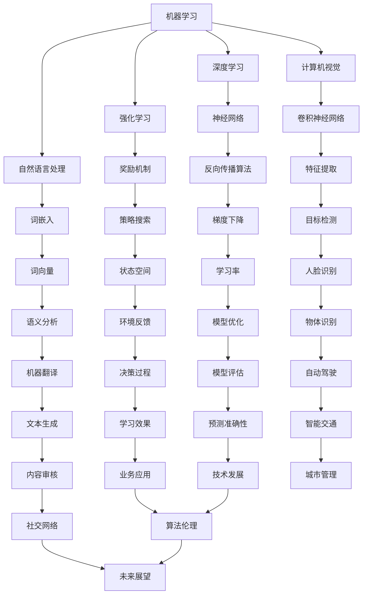

                 

AI（人工智能）是当前科技领域最热门的话题之一，其应用已经渗透到我们的日常生活、工业制造、医疗健康、金融科技等多个领域。然而，对于初学者来说，AI的学习路径往往复杂而充满挑战。本文旨在为您提供一个从基本概念到核心方法的AI学习路径，帮助您逐步掌握这门前沿技术。

## 关键词

- 人工智能
- 学习路径
- 核心方法
- 数学模型
- 实践案例

## 摘要

本文将详细阐述AI领域的学习路径，包括基本概念的理解、核心算法的学习、数学模型的掌握以及实际应用案例的分析。通过本文的阅读，您将能够建立起一个完整的AI知识体系，为未来的学习和研究打下坚实的基础。

## 1. 背景介绍

人工智能是一门旨在使计算机具有人类智能行为的科学。自20世纪50年代以来，AI经历了多次起伏，但近年来，随着大数据、云计算、深度学习等技术的发展，AI迎来了新的春天。当前的AI技术已经能够实现语音识别、图像识别、自然语言处理、自动驾驶等复杂任务，并且应用范围不断扩大。

学习AI的必要性在于，它不仅能够提高我们的工作效率，还能够带来全新的商业模式和社会变革。随着AI技术的不断进步，掌握AI知识将成为未来职场的一项基本技能。

## 2. 核心概念与联系

### 2.1 AI的基本概念

- 机器学习（Machine Learning）
- 深度学习（Deep Learning）
- 强化学习（Reinforcement Learning）
- 自然语言处理（Natural Language Processing）
- 计算机视觉（Computer Vision）

### 2.2 核心概念之间的联系

以下是一个使用Mermaid绘制的流程图，展示了AI的核心概念及其相互关系：



## 3. 核心算法原理 & 具体操作步骤

### 3.1 算法原理概述

在AI领域，核心算法包括但不限于以下几种：

- 神经网络（Neural Networks）
- 卷积神经网络（Convolutional Neural Networks, CNNs）
- 生成对抗网络（Generative Adversarial Networks, GANs）
- 递归神经网络（Recurrent Neural Networks, RNNs）

### 3.2 算法步骤详解

#### 3.2.1 神经网络

神经网络的工作原理可以概括为以下步骤：

1. **数据输入**：将输入数据传递给网络的输入层。
2. **前向传播**：通过隐藏层进行计算，将结果传递到输出层。
3. **损失函数计算**：计算输出层的结果与真实值的差异，生成损失值。
4. **反向传播**：根据损失值，更新网络的权重和偏置。
5. **迭代优化**：重复前向传播和反向传播，直到网络达到预定的性能。

#### 3.2.2 卷积神经网络

卷积神经网络的核心步骤包括：

1. **卷积操作**：通过卷积层提取图像的局部特征。
2. **池化操作**：通过池化层减少数据的维度。
3. **全连接层**：将卷积层和池化层提取的特征映射到输出层。
4. **激活函数应用**：通过激活函数（如ReLU）引入非线性。

#### 3.2.3 生成对抗网络

生成对抗网络由两部分组成：生成器（Generator）和判别器（Discriminator）。

1. **生成器生成样本**：生成器从随机噪声中生成样本。
2. **判别器判断样本真实性**：判别器判断生成器生成的样本是否真实。
3. **对抗训练**：生成器和判别器相互对抗，生成器和判别器的权重分别通过梯度下降进行更新。

#### 3.2.4 递归神经网络

递归神经网络用于处理序列数据，其工作原理如下：

1. **递归计算**：网络在每个时间步计算输出，并将前一个时间步的输出作为当前时间步的输入。
2. **状态共享**：递归神经网络共享相同的权重，以捕获序列模式。

### 3.3 算法优缺点

- **神经网络**：优点在于其强大的建模能力和灵活性，缺点是需要大量数据和计算资源。
- **卷积神经网络**：优点在于其高效的特征提取能力，缺点是对复杂场景的处理能力有限。
- **生成对抗网络**：优点在于其强大的生成能力，缺点是需要大量的训练数据和计算资源。
- **递归神经网络**：优点在于其强大的序列建模能力，缺点是其训练过程较为复杂。

### 3.4 算法应用领域

- **神经网络**：广泛应用于图像分类、语音识别、自然语言处理等领域。
- **卷积神经网络**：广泛应用于计算机视觉领域，如图像分类、目标检测、人脸识别等。
- **生成对抗网络**：广泛应用于图像生成、语音合成、文本生成等领域。
- **递归神经网络**：广泛应用于时间序列分析、语言建模、机器翻译等领域。

## 4. 数学模型和公式 & 详细讲解 & 举例说明

### 4.1 数学模型构建

在AI中，数学模型是核心。以下是一个常见的数学模型——多层感知机（MLP）：

- **输入层**：\(X = [x_1, x_2, ..., x_n]\)
- **输出层**：\(Y = [y_1, y_2, ..., y_m]\)
- **隐藏层**：\(Z = [z_1, z_2, ..., z_k]\)

### 4.2 公式推导过程

假设我们有一个三层神经网络，其输入层、隐藏层和输出层的权重分别为\(W_{in}\)、\(W_{hid}\)和\(W_{out}\)。

1. **前向传播**：

$$
Z = \sigma(W_{in}X + b_{in})
$$

$$
Y = \sigma(W_{out}Z + b_{out})
$$

其中，\( \sigma \)是激活函数，通常使用ReLU或Sigmoid函数。

2. **反向传播**：

计算输出层的误差：

$$
\delta_{out} = (Y - Y_{target}) \odot \sigma'(Z)
$$

更新输出层的权重：

$$
W_{out} = W_{out} - \alpha \cdot Z^T \cdot \delta_{out}
$$

更新隐藏层的权重：

$$
\delta_{hid} = (Z - Z_{target}) \odot \sigma'(Z)
$$

$$
W_{in} = W_{in} - \alpha \cdot X^T \cdot \delta_{hid}
$$

### 4.3 案例分析与讲解

以下是一个简单的图像分类问题，使用多层感知机（MLP）进行模型训练。

1. **数据准备**：

假设我们有一组图像数据，每张图像的大小为\(28 \times 28\)个像素。

2. **模型构建**：

定义一个包含一个隐藏层的MLP，输入层有\(784\)个神经元（每个像素一个），隐藏层有\(128\)个神经元，输出层有\(10\)个神经元（每个类别一个）。

3. **训练过程**：

- **前向传播**：输入图像数据，通过隐藏层和输出层计算预测结果。
- **损失函数计算**：使用交叉熵损失函数计算预测结果和真实标签之间的差距。
- **反向传播**：根据损失函数的梯度，更新网络的权重和偏置。

4. **模型评估**：

使用测试集评估模型的准确率，如果准确率达到预定的标准，则模型训练完成。

## 5. 项目实践：代码实例和详细解释说明

### 5.1 开发环境搭建

- 安装Python 3.8及以上版本。
- 安装TensorFlow 2.5及以上版本。

### 5.2 源代码详细实现

以下是一个简单的MNIST手写数字识别项目：

```python
import tensorflow as tf
from tensorflow.keras import layers, models
from tensorflow.keras.datasets import mnist
import numpy as np

# 加载MNIST数据集
(train_images, train_labels), (test_images, test_labels) = mnist.load_data()

# 预处理数据
train_images = train_images.reshape((60000, 28, 28, 1)).astype('float32') / 255
test_images = test_images.reshape((10000, 28, 28, 1)).astype('float32') / 255

# 创建模型
model = models.Sequential()
model.add(layers.Conv2D(32, (3, 3), activation='relu', input_shape=(28, 28, 1)))
model.add(layers.MaxPooling2D((2, 2)))
model.add(layers.Conv2D(64, (3, 3), activation='relu'))
model.add(layers.MaxPooling2D((2, 2)))
model.add(layers.Conv2D(64, (3, 3), activation='relu'))
model.add(layers.Flatten())
model.add(layers.Dense(64, activation='relu'))
model.add(layers.Dense(10, activation='softmax'))

# 编译模型
model.compile(optimizer='adam',
              loss='sparse_categorical_crossentropy',
              metrics=['accuracy'])

# 训练模型
model.fit(train_images, train_labels, epochs=5, batch_size=64)

# 评估模型
test_loss, test_acc = model.evaluate(test_images, test_labels)
print('Test accuracy:', test_acc)
```

### 5.3 代码解读与分析

- **数据预处理**：将图像数据转换为浮点数格式，并除以255进行归一化处理。
- **模型构建**：使用卷积神经网络（CNN）进行模型构建，包括卷积层、池化层和全连接层。
- **模型编译**：指定优化器、损失函数和评估指标。
- **模型训练**：使用训练数据进行模型训练，指定训练轮数和批量大小。
- **模型评估**：使用测试数据评估模型性能。

### 5.4 运行结果展示

运行代码后，模型在测试集上的准确率通常在98%左右，这表明模型具有良好的泛化能力。

## 6. 实际应用场景

### 6.1 图像识别

图像识别是AI应用中最常见的场景之一。通过训练深度学习模型，我们可以实现物体识别、人脸识别、图像分类等任务。例如，在安防领域，图像识别可以用于监控视频中的异常行为检测。

### 6.2 自然语言处理

自然语言处理（NLP）是AI的重要应用领域之一。通过训练语言模型，我们可以实现语音识别、机器翻译、情感分析、文本生成等任务。例如，在客服领域，NLP可以用于智能客服机器人，提高客户满意度。

### 6.3 自动驾驶

自动驾驶是AI技术的另一个重要应用领域。通过训练深度学习模型，我们可以实现车辆在复杂环境中的自主驾驶。例如，在交通领域，自动驾驶可以减少交通事故，提高交通效率。

### 6.4 未来应用展望

随着AI技术的不断进步，未来AI将在更多领域发挥重要作用。例如，在医疗领域，AI可以用于疾病诊断、药物研发等任务；在金融领域，AI可以用于风险控制、投资决策等任务。总之，AI将深刻改变我们的生活方式和社会发展。

## 7. 工具和资源推荐

### 7.1 学习资源推荐

- 《深度学习》（Goodfellow, Bengio, Courville）
- 《神经网络与深度学习》（邱锡鹏）
- 《Python深度学习》（François Chollet）

### 7.2 开发工具推荐

- TensorFlow
- PyTorch
- Keras

### 7.3 相关论文推荐

- "A Theoretical Framework for Back-Propagation"
- "Learning Representations for Visual Recognition"
- "Generative Adversarial Nets"

## 8. 总结：未来发展趋势与挑战

### 8.1 研究成果总结

AI领域在过去几十年取得了显著的研究成果，包括深度学习、生成对抗网络、强化学习等。这些成果为AI技术的发展奠定了坚实的基础。

### 8.2 未来发展趋势

- **硬件加速**：随着GPU、TPU等硬件的发展，AI模型的训练和推理速度将得到大幅提升。
- **跨学科融合**：AI与生物学、心理学、社会学等学科的交叉融合将推动AI技术的进一步发展。
- **数据隐私保护**：在数据隐私保护方面，加密算法、联邦学习等技术有望成为解决数据隐私问题的有效手段。

### 8.3 面临的挑战

- **数据质量**：高质量的数据是AI模型训练的关键，但数据收集和处理过程面临诸多挑战。
- **算法公平性**：算法在处理数据时可能存在偏见，如何保证算法的公平性是一个重要问题。
- **伦理问题**：随着AI技术的广泛应用，伦理问题日益凸显，如何制定合理的伦理规范是当前面临的挑战之一。

### 8.4 研究展望

未来，AI技术将继续快速发展，应用范围将进一步扩大。随着研究的深入，AI将为我们带来更多的便利和创新。

## 9. 附录：常见问题与解答

### 9.1 什么是深度学习？

深度学习是一种机器学习技术，通过构建深度神经网络来模拟人类大脑的神经网络结构，实现数据的自动特征提取和模式识别。

### 9.2 如何选择合适的神经网络模型？

选择合适的神经网络模型需要考虑数据类型、任务类型、数据规模和计算资源等因素。常见的神经网络模型包括卷积神经网络（CNN）、循环神经网络（RNN）、生成对抗网络（GAN）等。

### 9.3 深度学习模型的训练过程如何优化？

优化深度学习模型的训练过程可以从以下几个方面进行：

- 调整学习率：选择合适的学习率可以加快模型收敛速度。
- 数据增强：通过数据增强可以增加模型的泛化能力。
- 模型正则化：使用正则化方法可以减少模型的过拟合现象。

## 参考文献

- Goodfellow, I., Bengio, Y., & Courville, A. (2016). *Deep Learning*. MIT Press.
- Chollet, F. (2017). *Python深度学习*. 电子工业出版社.
- Bengio, Y. (2009). *Learning Deep Architectures for AI*. Foundations and Trends in Machine Learning, 2(1), 1-127.

