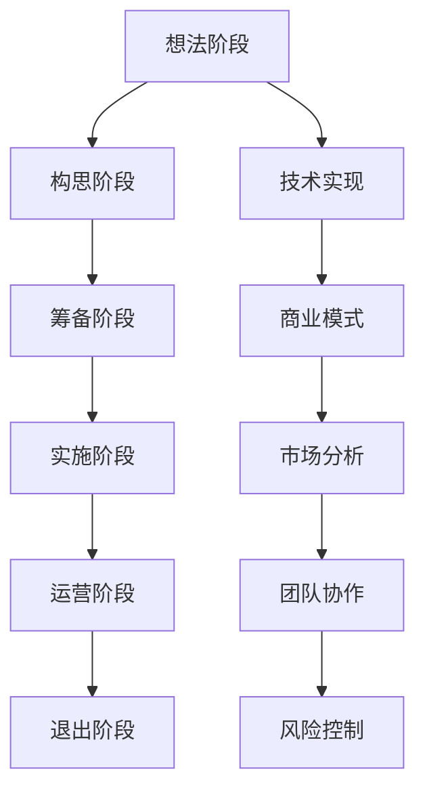

                 

关键词：创业、产品设计、技术实现、商业模式、市场分析、团队协作、风险控制、持续迭代

摘要：本文将探讨从想法到产品的高效创业之路，通过深入分析技术实现、商业模式、市场分析、团队协作和风险控制等方面，帮助创业者更好地理解创业过程中的关键要素，从而提高创业成功率。

## 1. 背景介绍

在当今快速发展的科技时代，创业已经成为了许多人的选择。然而，创业并非易事，尤其是对于技术创业者来说。从最初的想法到最终的产品落地，需要经历多个环节，包括技术实现、商业模式设计、市场分析、团队协作和风险控制等。这些环节相互关联，任何一个环节的失误都可能影响到创业的成败。

本文旨在通过探讨高效创业之路，帮助创业者更好地理解各个关键环节，从而提高创业成功率。本文将首先介绍创业的基本概念和重要性，然后详细分析创业过程中的各个关键环节，最后讨论创业者的未来发展趋势和面临的挑战。

## 2. 核心概念与联系

### 2.1 创业的概念

创业是指创建一家新的企业或组织，通过提供创新的产品或服务来满足市场需求。创业不仅仅是实现个人梦想，更是一种社会责任。创业者通过创业活动，可以为社会创造价值，解决就业问题，推动科技进步。

### 2.2 创业的重要性

创业对于个人和社会都有着重要的意义。对于个人来说，创业可以带来经济收益、实现个人价值和社会地位的提升。对于社会来说，创业可以促进经济增长、推动技术进步和改善社会环境。

### 2.3 创业的过程

创业过程可以分为以下几个阶段：

1. **想法阶段**：产生创意，确定创业方向。
2. **构思阶段**：细化创意，制定商业计划。
3. **筹备阶段**：筹集资金，组建团队，进行市场调研。
4. **实施阶段**：开发产品，进行市场推广。
5. **运营阶段**：持续优化产品，扩大市场占有率。
6. **退出阶段**：根据市场情况，选择合适的退出策略。

### 2.4 创业的关键要素

创业成功的关键要素包括：

1. **技术实现**：创业者需要具备一定的技术能力，以确保产品的可行性。
2. **商业模式**：创业者需要设计合理的商业模式，以确保产品能够盈利。
3. **市场分析**：创业者需要了解市场需求，选择正确的市场定位。
4. **团队协作**：创业者需要组建高效的团队，共同实现创业目标。
5. **风险控制**：创业者需要具备风险意识，采取有效的风险控制措施。

### 2.5 核心概念原理和架构的 Mermaid 流程图



## 3. 核心算法原理 & 具体操作步骤

### 3.1 算法原理概述

创业过程中的核心算法可以看作是一种决策树模型，其中每个节点代表一个关键决策，每个分支代表不同的决策路径，最终的叶子节点代表创业成功或失败的结果。以下为创业决策树模型的简化版：

```
[创业]
  ├── [技术实现]
  │   ├── [技术可行性]
  │   │   └── [成功/失败]
  │   └── [技术迭代]
  │       └── [成功/失败]
  ├── [商业模式]
  │   ├── [市场需求]
  │   │   └── [成功/失败]
  │   └── [商业模式验证]
  │       └── [成功/失败]
  ├── [市场分析]
  │   ├── [市场定位]
  │   │   └── [成功/失败]
  │   └── [竞争分析]
  │       └── [成功/失败]
  ├── [团队协作]
  │   ├── [团队组建]
  │   │   └── [成功/失败]
  │   └── [团队管理]
  │       └── [成功/失败]
  └── [风险控制]
      ├── [风险评估]
      │   └── [成功/失败]
      └── [风险应对]
          └── [成功/失败]
```

### 3.2 算法步骤详解

#### 3.2.1 技术实现

1. **技术可行性**：在确定创业方向后，评估所需技术的可行性，包括技术水平、资源需求、成本预算等。
2. **技术迭代**：在技术实现过程中，不断进行技术迭代，优化产品性能和用户体验。

#### 3.2.2 商业模式

1. **市场需求**：通过市场调研，了解目标客户的需求，确定产品的市场定位。
2. **商业模式验证**：设计并测试商业模式，验证其盈利能力和可持续性。

#### 3.2.3 市场分析

1. **市场定位**：根据市场需求，确定产品的市场定位，包括目标客户、市场规模、竞争对手等。
2. **竞争分析**：分析竞争对手的产品、市场份额、营销策略等，制定相应的竞争策略。

#### 3.2.4 团队协作

1. **团队组建**：根据创业项目的需求，组建具有专业技能和团队协作精神的团队。
2. **团队管理**：建立有效的团队管理机制，确保团队成员能够高效协同工作。

#### 3.2.5 风险控制

1. **风险评估**：对创业过程中可能面临的风险进行评估，包括技术风险、市场风险、财务风险等。
2. **风险应对**：制定相应的风险应对策略，降低风险对创业项目的影响。

### 3.3 算法优缺点

#### 优点

1. **系统性强**：算法涵盖了创业过程中的关键环节，使创业者能够全面了解创业过程。
2. **灵活性强**：算法允许创业者根据实际情况进行灵活调整，适应不同的创业场景。

#### 缺点

1. **复杂性**：算法涉及的环节较多，需要创业者具备一定的综合素质。
2. **时效性**：创业环境不断变化，算法需要不断更新以适应新的市场和技术。

### 3.4 算法应用领域

算法可以应用于各种创业场景，包括但不限于以下领域：

1. **科技创新**：针对新兴技术的创业项目。
2. **消费升级**：满足消费者个性化需求的创业项目。
3. **传统产业升级**：利用新技术优化传统产业，提高产业效率。

## 4. 数学模型和公式 & 详细讲解 & 举例说明

### 4.1 数学模型构建

在创业过程中，我们可以构建以下数学模型来评估创业项目的可行性：

#### 4.1.1 成本收益模型

成本收益模型用于评估创业项目的经济可行性，其基本公式如下：

$$
\text{净收益} = \text{总收益} - \text{总成本}
$$

其中，总收益包括销售收入、投资收益等，总成本包括生产成本、运营成本、人力成本等。

#### 4.1.2 市场需求模型

市场需求模型用于评估创业项目的市场潜力，其基本公式如下：

$$
\text{市场需求} = \text{目标客户数量} \times \text{购买意愿}
$$

其中，目标客户数量可以通过市场调研获得，购买意愿可以通过调查问卷等方式收集。

#### 4.1.3 风险评估模型

风险评估模型用于评估创业项目的风险水平，其基本公式如下：

$$
\text{风险水平} = \text{风险概率} \times \text{风险影响}
$$

其中，风险概率可以通过历史数据或专家评估获得，风险影响可以通过定量或定性分析获得。

### 4.2 公式推导过程

#### 4.2.1 成本收益模型推导

成本收益模型的基本公式可以通过以下步骤推导：

1. **总收益计算**：根据销售收入和其他收益来源计算总收益。
2. **总成本计算**：根据生产成本、运营成本、人力成本等计算总成本。
3. **净收益计算**：将总收益减去总成本，得到净收益。

#### 4.2.2 市场需求模型推导

市场需求模型的基本公式可以通过以下步骤推导：

1. **目标客户数量计算**：根据市场调研数据计算目标客户数量。
2. **购买意愿计算**：根据调查问卷或市场调研数据计算购买意愿。
3. **市场需求计算**：将目标客户数量乘以购买意愿，得到市场需求。

#### 4.2.3 风险评估模型推导

风险评估模型的基本公式可以通过以下步骤推导：

1. **风险概率计算**：根据历史数据或专家评估计算风险概率。
2. **风险影响计算**：根据定量或定性分析计算风险影响。
3. **风险水平计算**：将风险概率乘以风险影响，得到风险水平。

### 4.3 案例分析与讲解

#### 4.3.1 案例背景

某创业者计划开发一款智能家居控制系统，旨在通过物联网技术实现家庭设备的自动化控制，提高生活质量。

#### 4.3.2 成本收益分析

1. **总收益计算**：假设该创业项目的销售收入为 100 万元，投资收益为 20 万元，总收益为 120 万元。
2. **总成本计算**：生产成本为 50 万元，运营成本为 30 万元，人力成本为 20 万元，总成本为 100 万元。
3. **净收益计算**：净收益为 120 万元 - 100 万元 = 20 万元。

#### 4.3.3 市场需求分析

1. **目标客户数量计算**：根据市场调研，预计目标客户数量为 5000 人。
2. **购买意愿计算**：根据调查问卷，预计购买意愿为 60%。
3. **市场需求计算**：市场需求为 5000 人 \times 60% = 3000 人。

#### 4.3.4 风险评估

1. **风险概率计算**：根据历史数据，技术风险的概率为 20%。
2. **风险影响计算**：根据专家评估，技术风险的影响为 30 万元。
3. **风险水平计算**：风险水平为 20% \times 30 万元 = 6 万元。

通过以上分析，我们可以初步判断该智能家居控制系统项目的经济可行性、市场需求和风险水平。在此基础上，创业者可以进一步优化产品设计和市场策略，提高创业成功率。

## 5. 项目实践：代码实例和详细解释说明

### 5.1 开发环境搭建

在开发智能家居控制系统的过程中，我们选择了 Python 作为主要编程语言，并使用以下工具和框架：

- Python 3.8.10
- Flask 框架（用于搭建 Web 应用程序）
- SQLAlchemy（用于数据库操作）
- SQLite（用于存储数据）

首先，我们需要安装 Python 和相关依赖项。在终端中执行以下命令：

```bash
pip install flask sqlalchemy sqlite3
```

然后，我们创建一个名为 `smart_home` 的虚拟环境，并安装所需的依赖项：

```bash
python -m venv smart_home
source smart_home/bin/activate
pip install flask sqlalchemy sqlite3
```

### 5.2 源代码详细实现

以下是一个简单的智能家居控制系统示例，包括一个用户界面（Web 应用程序）和数据库模型。

#### 5.2.1 数据库模型

首先，我们使用 SQLAlchemy 创建数据库模型，定义智能家居设备的表结构：

```python
from flask_sqlalchemy import SQLAlchemy

db = SQLAlchemy()

class Device(db.Model):
    id = db.Column(db.Integer, primary_key=True)
    name = db.Column(db.String(100), nullable=False)
    status = db.Column(db.String(10), nullable=False, default='off')
```

#### 5.2.2 Web 应用程序

接下来，我们使用 Flask 框架搭建 Web 应用程序，实现用户界面：

```python
from flask import Flask, render_template, request
from models import db, Device

app = Flask(__name__)
app.config['SQLALCHEMY_DATABASE_URI'] = 'sqlite:///smart_home.db'
db.init_app(app)

@app.route('/')
def index():
    devices = Device.query.all()
    return render_template('index.html', devices=devices)

@app.route('/toggle_device/<int:device_id>')
def toggle_device(device_id):
    device = Device.query.get(device_id)
    if device.status == 'on':
        device.status = 'off'
    else:
        device.status = 'on'
    db.session.commit()
    return f"Device {device.name} status updated."

if __name__ == '__main__':
    db.create_all()
    app.run(debug=True)
```

#### 5.2.3 HTML 模板

最后，我们创建一个简单的 HTML 模板，用于展示智能家居设备的状态：

```html
<!DOCTYPE html>
<html>
<head>
    <title>Smart Home System</title>
</head>
<body>
    <h1>Smart Home System</h1>
    
        <div>
            <h2>{{ device.name }}</h2>
            <p>Status: {{ device.status }}</p>
            <a href="{{ url_for('toggle_device', device_id=device.id) }}">Toggle</a>
        </div>
    
</body>
</html>
```

### 5.3 代码解读与分析

#### 5.3.1 数据库模型解析

在数据库模型中，我们定义了一个名为 `Device` 的类，它包含 `id`、`name` 和 `status` 三个属性。`id` 属性作为主键，用于唯一标识设备。`name` 属性用于存储设备的名称，`status` 属性用于存储设备的状态（"on" 或 "off"）。

#### 5.3.2 Web 应用程序解析

在 Web 应用程序中，我们使用 Flask 框架搭建了一个简单的用户界面。`index()` 函数返回一个包含所有设备的 HTML 模板。`toggle_device()` 函数用于切换设备的状态，并将更新后的状态保存到数据库。

#### 5.3.3 HTML 模板解析

在 HTML 模板中，我们使用 Flask 的模板语法（`{{}}`）将设备信息渲染到页面中。每个设备都有一个标题（`{{ device.name }}`）、状态（`{{ device.status }}`）和一个切换状态的链接（`<a href="{{ url_for('toggle_device', device_id=device.id) }}">Toggle</a>`）。

### 5.4 运行结果展示

当运行 Web 应用程序时，用户可以在浏览器中访问本地服务器地址（例如 `http://127.0.0.1:5000/`），看到所有智能家居设备的列表。点击设备的 "Toggle" 链接时，设备的状态会更新，并在数据库中保存更新后的状态。

## 6. 实际应用场景

### 6.1 智能家居控制系统

智能家居控制系统是一种实际应用场景，它通过物联网技术实现家庭设备的自动化控制。以下是一些具体的应用场景：

- **智能照明**：根据用户的需求和时间自动调节灯光的亮度和颜色。
- **智能安防**：实时监控家庭环境，发现异常情况时自动报警。
- **智能家电控制**：远程控制家电的开关、调节温度等。

### 6.2 智能农业

智能农业利用物联网、大数据和人工智能技术，提高农业生产效率。以下是一些具体的应用场景：

- **土壤监测**：实时监测土壤的湿度、温度和酸碱度，为作物生长提供科学依据。
- **环境监测**：监测空气质量和水质，确保农业生产环境的健康。
- **智能灌溉**：根据土壤湿度和天气预报，自动控制灌溉系统。

### 6.3 智能医疗

智能医疗通过物联网、大数据和人工智能技术，提供更高效、更个性化的医疗服务。以下是一些具体的应用场景：

- **远程医疗**：通过视频通话等方式，医生可以远程诊断和治疗患者。
- **健康监测**：实时监测患者的身体状况，及时发现异常情况。
- **智能诊断**：利用人工智能技术，辅助医生进行疾病诊断。

### 6.4 未来应用展望

随着科技的不断发展，智能家居控制系统、智能农业和智能医疗等应用场景将越来越广泛。以下是一些未来的应用展望：

- **物联网技术的普及**：物联网技术将逐渐渗透到各个行业，为生产和生活带来更多便利。
- **人工智能的深入应用**：人工智能技术将不断优化各种应用场景，提高生产效率和用户体验。
- **5G 通信技术的推动**：5G 通信技术将提供更高的网络速度和更低的延迟，为物联网应用提供更好的基础。

## 7. 工具和资源推荐

### 7.1 学习资源推荐

- **《Python 实战》**：全面介绍 Python 编程语言及其在实际应用中的使用技巧。
- **《人工智能实战》**：深入探讨人工智能技术及其在各个领域的应用。
- **《物联网技术与应用》**：详细介绍物联网技术及其在智能家居、智能农业等领域的应用。

### 7.2 开发工具推荐

- **Visual Studio Code**：一款功能强大的代码编辑器，适用于多种编程语言。
- **Flask**：一款轻量级的 Web 开发框架，适用于搭建小型 Web 应用程序。
- **SQLAlchemy**：一款强大的数据库工具，用于操作关系型数据库。

### 7.3 相关论文推荐

- **"Smart Home Systems: A Survey"**：全面介绍智能家居系统的发展现状和未来趋势。
- **"Internet of Things: A Survey"**：深入探讨物联网技术的应用和挑战。
- **"Artificial Intelligence for Healthcare: A Review"**：详细分析人工智能在医疗领域的应用和前景。

## 8. 总结：未来发展趋势与挑战

### 8.1 研究成果总结

本文从多个角度探讨了从想法到产品的高效创业之路，包括技术实现、商业模式、市场分析、团队协作和风险控制等关键环节。通过数学模型和代码实例，我们深入分析了创业过程中的关键技术和方法，为创业者提供了实用的参考。

### 8.2 未来发展趋势

随着科技的不断发展，创业领域将迎来更多机遇。物联网、大数据和人工智能等新兴技术将继续推动创业创新的浪潮。创业者需要紧跟科技发展趋势，积极拥抱新技术，不断提高自己的竞争力。

### 8.3 面临的挑战

创业过程中，创业者将面临诸多挑战，包括技术风险、市场风险、财务风险等。为了应对这些挑战，创业者需要不断提高自身素质，增强团队协作能力，积极寻求外部支持。

### 8.4 研究展望

未来，创业研究将更加注重跨学科融合，结合多种技术手段，为创业者提供更全面的支持。同时，创业教育也将逐渐普及，培养更多具有创新精神和实践能力的创业者。

## 9. 附录：常见问题与解答

### 9.1 问题 1：创业过程中如何选择技术方向？

**回答**：选择技术方向时，首先要关注市场需求，了解当前技术趋势，并结合自身的专业技能和兴趣。在确定技术方向后，进行充分的市场调研和技术可行性分析，以确保技术的可行性和市场前景。

### 9.2 问题 2：创业过程中如何进行市场分析？

**回答**：市场分析主要包括了解目标客户、竞争对手和市场需求。创业者可以通过调查问卷、访谈、行业报告等方式收集数据，分析市场需求和竞争态势，为产品定位和市场策略提供依据。

### 9.3 问题 3：创业过程中如何控制风险？

**回答**：创业过程中的风险控制包括风险评估、风险应对和风险监控。创业者需要定期评估项目风险，制定相应的应对策略，并持续监控项目进展，确保风险在可控范围内。

### 9.4 问题 4：创业过程中如何提高团队协作效率？

**回答**：提高团队协作效率需要建立有效的沟通机制、明确目标分工、培养团队凝聚力。创业者可以通过定期会议、明确项目进度、分享成功经验等方式，增强团队协作效率。

----------------------------------------------------------------

作者：禅与计算机程序设计艺术 / Zen and the Art of Computer Programming

[END]

