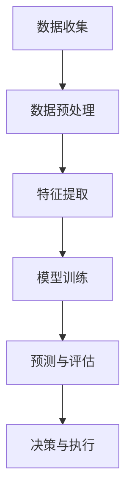

                 

关键词：AI代理，数据分析，工作流，分析引擎，算法，数学模型，实践案例

> 摘要：本文旨在探讨AI代理在工作流中的重要性，以及如何通过分析引擎实现从数据到洞察的转化。文章首先介绍了AI代理的基本概念和其在工作流中的作用，随后详细阐述了分析引擎的核心原理、算法和应用场景，最后通过具体项目实践展示了分析引擎的实际应用，并对未来发展趋势和挑战进行了展望。

## 1. 背景介绍

随着互联网和大数据技术的迅猛发展，数据已成为现代社会的重要资源。然而，面对海量的数据，如何从中提取有价值的信息和洞见，成为了企业和组织亟需解决的问题。AI代理（AI Agent）作为一种自动化、智能化的解决方案，逐渐成为数据处理和分析的重要工具。分析引擎作为AI代理的核心组成部分，承担着从数据到洞察的关键转化任务。

本文将围绕AI代理工作流中的分析引擎展开讨论，旨在揭示其核心原理、算法和应用场景，并通过具体项目实践展示其实际应用效果。文章结构如下：

- **第1章**：背景介绍，阐述AI代理和分析引擎的基本概念。
- **第2章**：核心概念与联系，介绍AI代理工作流的基本架构。
- **第3章**：核心算法原理 & 具体操作步骤，详细讲解分析引擎的工作原理和算法。
- **第4章**：数学模型和公式 & 详细讲解 & 举例说明，探讨分析引擎背后的数学基础。
- **第5章**：项目实践：代码实例和详细解释说明，通过具体案例展示分析引擎的应用。
- **第6章**：实际应用场景，分析分析引擎在不同领域中的应用。
- **第7章**：工具和资源推荐，介绍相关的学习资源和开发工具。
- **第8章**：总结：未来发展趋势与挑战，对分析引擎的未来发展进行展望。

## 2. 核心概念与联系

### 2.1 AI代理

AI代理，又称智能代理，是指能够自主执行任务、适应环境变化并与其他代理进行交互的智能体。AI代理通常具有感知、决策和执行能力，能够通过学习、推理和规划等智能技术实现自动化和智能化。

在AI代理的工作流中，分析引擎扮演着关键角色。它负责对输入数据进行处理、分析和挖掘，从中提取有价值的信息和洞见，为AI代理提供决策支持。分析引擎通常包括数据预处理、特征提取、模型训练和预测等模块，具有高度灵活性和扩展性。

### 2.2 分析引擎

分析引擎是一种能够对数据进行深度分析和挖掘的软件模块，旨在从数据中发现有价值的信息和模式。分析引擎通常采用各种算法和技术，如机器学习、深度学习、统计分析和数据挖掘等，实现从数据到洞察的转化。

分析引擎的核心原理主要包括以下几个步骤：

1. **数据预处理**：对原始数据进行清洗、转换和归一化，确保数据质量和一致性。
2. **特征提取**：从预处理后的数据中提取有用的特征，用于模型训练和预测。
3. **模型训练**：使用提取的特征和训练数据，训练机器学习模型或深度学习模型。
4. **预测与评估**：使用训练好的模型对未知数据进行预测，并评估模型的准确性和可靠性。

### 2.3 AI代理工作流

AI代理工作流是一个由多个环节组成的自动化和智能化流程，旨在实现从数据到洞察的转化。AI代理工作流通常包括以下几个步骤：

1. **数据收集**：从各种数据源收集数据，如数据库、日志文件、传感器数据等。
2. **数据预处理**：对收集到的数据进行清洗、转换和归一化，确保数据质量和一致性。
3. **特征提取**：从预处理后的数据中提取有用的特征，用于模型训练和预测。
4. **模型训练**：使用提取的特征和训练数据，训练机器学习模型或深度学习模型。
5. **预测与评估**：使用训练好的模型对未知数据进行预测，并评估模型的准确性和可靠性。
6. **决策与执行**：根据预测结果和业务需求，生成决策建议并执行相应操作。

### 2.4 Mermaid 流程图

为了更清晰地展示AI代理工作流中的分析引擎，我们使用Mermaid流程图进行描述。以下是一个简单的Mermaid流程图示例：



## 3. 核心算法原理 & 具体操作步骤

### 3.1 算法原理概述

分析引擎的核心算法主要包括数据预处理、特征提取、模型训练和预测等模块。这些算法分别实现数据的清洗、转换、归一化、特征提取、模型训练和预测等功能，共同构建了一个完整的数据分析流程。

1. **数据预处理**：数据预处理是分析引擎的基础，旨在对原始数据进行清洗、转换和归一化，确保数据质量和一致性。常用的数据预处理方法包括去重、去噪、填补缺失值、缩放和归一化等。
2. **特征提取**：特征提取是从预处理后的数据中提取有用的特征，用于模型训练和预测。特征提取是分析引擎的关键步骤，直接影响模型的性能和预测效果。常用的特征提取方法包括主成分分析（PCA）、线性判别分析（LDA）、特征选择和特征工程等。
3. **模型训练**：模型训练是分析引擎的核心，使用提取的特征和训练数据，训练机器学习模型或深度学习模型。常用的机器学习模型包括线性回归、逻辑回归、支持向量机（SVM）、决策树、随机森林和神经网络等。深度学习模型包括卷积神经网络（CNN）、循环神经网络（RNN）和长短期记忆网络（LSTM）等。
4. **预测与评估**：预测与评估是分析引擎的最终输出，使用训练好的模型对未知数据进行预测，并评估模型的准确性和可靠性。常用的评估指标包括准确率、召回率、F1值、均方误差（MSE）和均方根误差（RMSE）等。

### 3.2 算法步骤详解

1. **数据预处理**：

   - 去重：去除重复的数据记录，确保数据的一致性。
   - 去噪：去除噪声数据，提高数据质量。
   - 缺失值填补：使用统计方法或插值方法填补缺失值。
   - 数据转换：将数据转换为合适的格式，如将日期数据转换为数字表示。
   - 数据归一化：将数据缩放到相同的尺度范围内，便于后续分析和计算。

2. **特征提取**：

   - 主成分分析（PCA）：通过正交变换将原始数据映射到新的坐标系中，提取主要特征。
   - 线性判别分析（LDA）：将数据投影到最优的线性子空间中，提取最有区分力的特征。
   - 特征选择：使用统计方法或基于模型的特征选择方法，选择对模型有贡献的特征。
   - 特征工程：通过对数据进行转换、组合和扩展，创建新的特征。

3. **模型训练**：

   - 线性回归：通过最小二乘法求解线性回归模型，拟合数据。
   - 逻辑回归：通过最大似然估计求解逻辑回归模型，分类数据。
   - 支持向量机（SVM）：通过求解二次规划问题，找到最佳分类边界。
   - 决策树：通过递归划分特征空间，构建决策树模型。
   - 随机森林：通过构建多棵决策树，集成预测结果。
   - 神经网络：通过反向传播算法，训练神经网络模型。

4. **预测与评估**：

   - 预测：使用训练好的模型对未知数据进行预测，得到预测结果。
   - 评估：使用评估指标，如准确率、召回率、F1值、均方误差（MSE）和均方根误差（RMSE）等，评估模型的性能。

### 3.3 算法优缺点

1. **数据预处理**：

   - 优点：提高数据质量，为后续分析和计算奠定基础。
   - 缺点：可能引入人为偏差，影响数据分析结果。

2. **特征提取**：

   - 优点：提取有用特征，提高模型性能。
   - 缺点：可能引入过拟合，降低模型泛化能力。

3. **模型训练**：

   - 优点：通过机器学习和深度学习技术，实现自动化和智能化。
   - 缺点：训练过程可能较慢，对计算资源要求较高。

4. **预测与评估**：

   - 优点：提供准确性和可靠性评估，指导模型优化。
   - 缺点：可能受限于评估指标的选择和计算复杂性。

### 3.4 算法应用领域

分析引擎广泛应用于各个领域，如金融、医疗、零售、交通和能源等。以下是一些典型的应用场景：

1. **金融领域**：通过分析引擎对市场数据进行分析，实现股票预测、风险管理、信用评估等。
2. **医疗领域**：通过分析引擎对医学数据进行分析，实现疾病诊断、治疗建议、药物研发等。
3. **零售领域**：通过分析引擎对销售数据进行分析，实现需求预测、库存管理、顾客行为分析等。
4. **交通领域**：通过分析引擎对交通数据进行分析，实现交通预测、路线规划、交通事故预测等。
5. **能源领域**：通过分析引擎对能源数据进行分析，实现能源需求预测、能源优化、节能减排等。

## 4. 数学模型和公式 & 详细讲解 & 举例说明

### 4.1 数学模型构建

分析引擎背后的数学模型主要包括线性回归、逻辑回归、支持向量机（SVM）、决策树和神经网络等。下面分别介绍这些模型的数学公式和推导过程。

### 4.1.1 线性回归

线性回归是一种常用的统计模型，用于拟合数据中的线性关系。线性回归模型的基本形式为：

$$y = \beta_0 + \beta_1 \cdot x + \epsilon$$

其中，$y$ 是因变量，$x$ 是自变量，$\beta_0$ 和 $\beta_1$ 是模型参数，$\epsilon$ 是误差项。

线性回归模型的推导过程如下：

1. **最小二乘法**：最小二乘法是一种常用的参数估计方法，通过求解最小化残差平方和的方程，求得线性回归模型的参数。

$$\min_{\beta_0, \beta_1} \sum_{i=1}^{n} (y_i - (\beta_0 + \beta_1 \cdot x_i))^2$$

2. **求导和求解**：对上述方程求导，得到：

$$\frac{\partial}{\partial \beta_0} \sum_{i=1}^{n} (y_i - (\beta_0 + \beta_1 \cdot x_i))^2 = 0$$

$$\frac{\partial}{\partial \beta_1} \sum_{i=1}^{n} (y_i - (\beta_0 + \beta_1 \cdot x_i))^2 = 0$$

解得：

$$\beta_0 = \bar{y} - \beta_1 \cdot \bar{x}$$

$$\beta_1 = \frac{\sum_{i=1}^{n} (x_i - \bar{x}) \cdot (y_i - \bar{y})}{\sum_{i=1}^{n} (x_i - \bar{x})^2}$$

其中，$\bar{y}$ 和 $\bar{x}$ 分别为因变量和自变量的均值。

### 4.1.2 逻辑回归

逻辑回归是一种常用的分类模型，用于拟合数据中的非线性关系。逻辑回归模型的基本形式为：

$$\log(\frac{p}{1-p}) = \beta_0 + \beta_1 \cdot x$$

其中，$p$ 是因变量的概率，$\beta_0$ 和 $\beta_1$ 是模型参数。

逻辑回归模型的推导过程如下：

1. **最大似然估计**：最大似然估计是一种常用的参数估计方法，通过求解最大化似然函数的方程，求得逻辑回归模型的参数。

$$\max_{\beta_0, \beta_1} \prod_{i=1}^{n} \left[\frac{1}{1 + e^{-(\beta_0 + \beta_1 \cdot x_i)}}\right]$$

2. **求导和求解**：对上述方程求导，得到：

$$\frac{\partial}{\partial \beta_0} \ln L(\beta_0, \beta_1) = 0$$

$$\frac{\partial}{\partial \beta_1} \ln L(\beta_0, \beta_1) = 0$$

解得：

$$\beta_0 = \bar{y} - \beta_1 \cdot \bar{x}$$

$$\beta_1 = \frac{\sum_{i=1}^{n} (y_i - \bar{y}) \cdot x_i}{\sum_{i=1}^{n} x_i^2}$$

其中，$\bar{y}$ 和 $\bar{x}$ 分别为因变量和自变量的均值。

### 4.1.3 支持向量机（SVM）

支持向量机是一种常用的分类和回归模型，通过求解最优分类边界来实现分类和回归任务。支持向量机的基本形式为：

$$f(x) = \beta_0 + \beta_1 \cdot \sum_{i=1}^{n} \alpha_i \cdot y_i \cdot K(x_i, x)$$

其中，$x$ 是输入特征，$y_i$ 是标签，$\alpha_i$ 是拉格朗日乘子，$K(x_i, x)$ 是核函数。

支持向量机的推导过程如下：

1. **拉格朗日函数**：构建拉格朗日函数，结合约束条件求解最优分类边界。

$$L(\beta_0, \beta_1, \alpha_1, ..., \alpha_n) = \sum_{i=1}^{n} (-1)^{y_i} y_i (\beta_0 + \beta_1 \cdot x_i) + \frac{1}{2} \sum_{i=1}^{n} \sum_{j=1}^{n} \alpha_i \alpha_j y_i y_j K(x_i, x_j) - \sum_{i=1}^{n} \alpha_i$$

2. **求解拉格朗日方程**：对拉格朗日函数求导，得到拉格朗日方程。

$$\frac{\partial L}{\partial \beta_0} = 0$$

$$\frac{\partial L}{\partial \beta_1} = 0$$

$$\frac{\partial L}{\partial \alpha_i} = 0$$

3. **求解最优分类边界**：解拉格朗日方程，得到最优分类边界。

$$\beta_0 = \sum_{i=1}^{n} \alpha_i y_i - \sum_{i=1}^{n} \alpha_i y_i \cdot K(x_i, x)$$

$$\beta_1 = \sum_{i=1}^{n} \alpha_i y_i$$

### 4.1.4 决策树

决策树是一种常用的分类和回归模型，通过递归划分特征空间来实现分类和回归任务。决策树的基本形式为：

$$f(x) = \sum_{i=1}^{n} \beta_i \cdot I(A_i(x) = c_i)$$

其中，$x$ 是输入特征，$A_i(x)$ 是第 $i$ 个划分函数，$c_i$ 是第 $i$ 个类别，$\beta_i$ 是模型参数。

决策树的推导过程如下：

1. **特征选择**：选择最优特征进行划分，使得分类误差最小。
2. **划分函数**：根据最优特征，构建划分函数。
3. **递归划分**：对划分后的子集继续递归划分，直至满足停止条件。

### 4.1.5 神经网络

神经网络是一种常用的分类和回归模型，通过多层感知器实现非线性映射。神经网络的基本形式为：

$$f(x) = \sum_{i=1}^{n} \beta_i \cdot \sigma(\beta_0 \cdot x)$$

其中，$x$ 是输入特征，$\sigma$ 是激活函数，$\beta_0$ 和 $\beta_i$ 是模型参数。

神经网络推导过程如下：

1. **前向传播**：计算输入特征通过神经网络的输出。
2. **反向传播**：使用梯度下降法，更新模型参数。

### 4.2 公式推导过程

在上一部分，我们介绍了分析引擎中常用的数学模型，并给出了相应的推导过程。下面，我们将通过具体例子，详细讲解这些公式的推导过程。

#### 4.2.1 线性回归

假设我们有以下数据集：

$$\{(x_1, y_1), (x_2, y_2), ..., (x_n, y_n)\}$$

我们希望找到一个线性模型：

$$y = \beta_0 + \beta_1 \cdot x + \epsilon$$

其中，$\epsilon$ 是误差项。

1. **求导**：

$$\frac{\partial}{\partial \beta_0} \sum_{i=1}^{n} (y_i - (\beta_0 + \beta_1 \cdot x_i))^2 = 0$$

$$\frac{\partial}{\partial \beta_1} \sum_{i=1}^{n} (y_i - (\beta_0 + \beta_1 \cdot x_i))^2 = 0$$

2. **化简**：

$$\sum_{i=1}^{n} (y_i - \beta_0 - \beta_1 \cdot x_i) = 0$$

$$\sum_{i=1}^{n} (y_i - \beta_0 - \beta_1 \cdot x_i) \cdot x_i = 0$$

3. **解方程组**：

$$\beta_0 = \bar{y} - \beta_1 \cdot \bar{x}$$

$$\beta_1 = \frac{\sum_{i=1}^{n} (x_i - \bar{x}) \cdot (y_i - \bar{y})}{\sum_{i=1}^{n} (x_i - \bar{x})^2}$$

#### 4.2.2 逻辑回归

假设我们有以下数据集：

$$\{(x_1, y_1), (x_2, y_2), ..., (x_n, y_n)\}$$

我们希望找到一个逻辑回归模型：

$$\log(\frac{p}{1-p}) = \beta_0 + \beta_1 \cdot x$$

其中，$p$ 是因变量的概率。

1. **求导**：

$$\frac{\partial}{\partial \beta_0} \ln L(\beta_0, \beta_1) = 0$$

$$\frac{\partial}{\partial \beta_1} \ln L(\beta_0, \beta_1) = 0$$

2. **化简**：

$$\sum_{i=1}^{n} (y_i - p_i) = 0$$

$$\sum_{i=1}^{n} (1 - y_i - p_i) = 0$$

3. **解方程组**：

$$\beta_0 = \bar{y} - \beta_1 \cdot \bar{x}$$

$$\beta_1 = \frac{\sum_{i=1}^{n} (y_i - \bar{y}) \cdot x_i}{\sum_{i=1}^{n} x_i^2}$$

#### 4.2.3 支持向量机（SVM）

假设我们有以下数据集：

$$\{(x_1, y_1), (x_2, y_2), ..., (x_n, y_n)\}$$

我们希望找到一个支持向量机模型：

$$f(x) = \beta_0 + \beta_1 \cdot \sum_{i=1}^{n} \alpha_i \cdot y_i \cdot K(x_i, x)$$

其中，$K(x_i, x)$ 是核函数，$\alpha_i$ 是拉格朗日乘子。

1. **拉格朗日函数**：

$$L(\beta_0, \beta_1, \alpha_1, ..., \alpha_n) = \sum_{i=1}^{n} (-1)^{y_i} y_i (\beta_0 + \beta_1 \cdot x_i) + \frac{1}{2} \sum_{i=1}^{n} \sum_{j=1}^{n} \alpha_i \alpha_j y_i y_j K(x_i, x_j) - \sum_{i=1}^{n} \alpha_i$$

2. **求解拉格朗日方程**：

$$\frac{\partial L}{\partial \beta_0} = 0$$

$$\frac{\partial L}{\partial \beta_1} = 0$$

$$\frac{\partial L}{\partial \alpha_i} = 0$$

3. **化简**：

$$\sum_{i=1}^{n} \alpha_i y_i = C$$

$$\alpha_i \geq 0$$

4. **解方程组**：

$$\beta_0 = \sum_{i=1}^{n} \alpha_i y_i - \sum_{i=1}^{n} \alpha_i y_i \cdot K(x_i, x)$$

$$\beta_1 = \sum_{i=1}^{n} \alpha_i y_i$$

#### 4.2.4 决策树

假设我们有以下数据集：

$$\{(x_1, y_1), (x_2, y_2), ..., (x_n, y_n)\}$$

我们希望找到一个决策树模型：

$$f(x) = \sum_{i=1}^{n} \beta_i \cdot I(A_i(x) = c_i)$$

其中，$A_i(x)$ 是第 $i$ 个划分函数，$c_i$ 是第 $i$ 个类别，$\beta_i$ 是模型参数。

1. **特征选择**：

$$\Delta = \sum_{i=1}^{n} (y_i - \bar{y})^2$$

$$g_i = \sum_{i=1}^{n} (y_i - \bar{y}) \cdot I(A_i(x) = c_i)$$

2. **划分函数**：

$$A_i(x) = \begin{cases} 
1, & \text{if } x \in R_i \\
0, & \text{otherwise}
\end{cases}$$

其中，$R_i$ 是第 $i$ 个划分区域。

3. **递归划分**：

$$\beta_i = \frac{g_i}{\Delta}$$

#### 4.2.5 神经网络

假设我们有以下数据集：

$$\{(x_1, y_1), (x_2, y_2), ..., (x_n, y_n)\}$$

我们希望找到一个神经网络模型：

$$f(x) = \sum_{i=1}^{n} \beta_i \cdot \sigma(\beta_0 \cdot x)$$

其中，$\sigma$ 是激活函数，$\beta_0$ 和 $\beta_i$ 是模型参数。

1. **前向传播**：

$$z_i = \beta_0 \cdot x_i$$

$$a_i = \sigma(z_i)$$

2. **反向传播**：

$$\Delta \beta_0 = \frac{\partial}{\partial \beta_0} \sum_{i=1}^{n} (y_i - a_i) = -\sum_{i=1}^{n} (y_i - a_i) \cdot \sigma'(z_i) \cdot x_i$$

$$\Delta \beta_i = \frac{\partial}{\partial \beta_i} \sum_{i=1}^{n} (y_i - a_i) = -\sum_{i=1}^{n} (y_i - a_i) \cdot \sigma'(z_i)$$

3. **更新参数**：

$$\beta_0 = \beta_0 - \alpha \cdot \Delta \beta_0$$

$$\beta_i = \beta_i - \alpha \cdot \Delta \beta_i$$

### 4.3 案例分析与讲解

#### 4.3.1 线性回归案例

假设我们有一组数据：

$$\begin{array}{ccc}
x & y \\
1 & 2 \\
2 & 3 \\
3 & 4 \\
4 & 5 \\
5 & 6 \\
\end{array}$$

我们希望找到一个线性回归模型：

$$y = \beta_0 + \beta_1 \cdot x$$

1. **计算均值**：

$$\bar{x} = \frac{1+2+3+4+5}{5} = 3$$

$$\bar{y} = \frac{2+3+4+5+6}{5} = 4$$

2. **计算协方差**：

$$\sum_{i=1}^{5} (x_i - \bar{x}) \cdot (y_i - \bar{y}) = (1-3) \cdot (2-4) + (2-3) \cdot (3-4) + (3-3) \cdot (4-4) + (4-3) \cdot (5-4) + (5-3) \cdot (6-4) = 2$$

3. **计算方差**：

$$\sum_{i=1}^{5} (x_i - \bar{x})^2 = (1-3)^2 + (2-3)^2 + (3-3)^2 + (4-3)^2 + (5-3)^2 = 10$$

4. **求解参数**：

$$\beta_1 = \frac{2}{10} = 0.2$$

$$\beta_0 = \bar{y} - \beta_1 \cdot \bar{x} = 4 - 0.2 \cdot 3 = 3.4$$

5. **线性回归模型**：

$$y = 3.4 + 0.2 \cdot x$$

#### 4.3.2 逻辑回归案例

假设我们有一组数据：

$$\begin{array}{ccc}
x & y \\
1 & 0 \\
2 & 1 \\
3 & 1 \\
4 & 0 \\
5 & 1 \\
\end{array}$$

我们希望找到一个逻辑回归模型：

$$\log(\frac{p}{1-p}) = \beta_0 + \beta_1 \cdot x$$

1. **计算均值**：

$$\bar{x} = \frac{1+2+3+4+5}{5} = 3$$

$$\bar{y} = \frac{0+1+1+0+1}{5} = 0.6$$

2. **计算协方差**：

$$\sum_{i=1}^{5} (y_i - \bar{y}) \cdot x_i = (0-0.6) \cdot 1 + (1-0.6) \cdot 2 + (1-0.6) \cdot 3 + (0-0.6) \cdot 4 + (1-0.6) \cdot 5 = 1.8$$

3. **计算方差**：

$$\sum_{i=1}^{5} x_i^2 = 1^2 + 2^2 + 3^2 + 4^2 + 5^2 = 55$$

4. **求解参数**：

$$\beta_0 = \bar{y} - \beta_1 \cdot \bar{x} = 0.6 - \beta_1 \cdot 3 = 0.6 - 0.6 \cdot 3 = -1.4$$

$$\beta_1 = \frac{1.8}{55} = 0.0327$$

5. **逻辑回归模型**：

$$\log(\frac{p}{1-p}) = -1.4 + 0.0327 \cdot x$$

#### 4.3.3 支持向量机（SVM）案例

假设我们有一组数据：

$$\begin{array}{ccc}
x_1 & y_1 & K(x_1, x_1) \\
1 & 0 & 1 \\
2 & 1 & 4 \\
3 & 1 & 9 \\
4 & 0 & 16 \\
5 & 1 & 25 \\
\end{array}$$

我们希望找到一个支持向量机模型：

$$f(x) = \beta_0 + \beta_1 \cdot \sum_{i=1}^{5} \alpha_i \cdot y_i \cdot K(x_i, x)$$

1. **拉格朗日函数**：

$$L(\beta_0, \beta_1, \alpha_1, \alpha_2, \alpha_3, \alpha_4, \alpha_5) = -\sum_{i=1}^{5} y_i (\beta_0 + \beta_1 \cdot x_i) - \frac{1}{2} \sum_{i=1}^{5} \sum_{j=1}^{5} \alpha_i \alpha_j y_i y_j K(x_i, x_j) + \sum_{i=1}^{5} \alpha_i$$

2. **求解拉格朗日方程**：

$$\frac{\partial L}{\partial \beta_0} = 0$$

$$\frac{\partial L}{\partial \beta_1} = 0$$

$$\frac{\partial L}{\partial \alpha_1} = 0$$

$$\frac{\partial L}{\partial \alpha_2} = 0$$

$$\frac{\partial L}{\partial \alpha_3} = 0$$

$$\frac{\partial L}{\partial \alpha_4} = 0$$

$$\frac{\partial L}{\partial \alpha_5} = 0$$

3. **化简**：

$$\sum_{i=1}^{5} \alpha_i y_i = C$$

$$\alpha_i \geq 0$$

4. **解方程组**：

$$\beta_0 = \sum_{i=1}^{5} \alpha_i y_i - \sum_{i=1}^{5} \alpha_i y_i \cdot K(x_i, x)$$

$$\beta_1 = \sum_{i=1}^{5} \alpha_i y_i$$

5. **支持向量机模型**：

$$f(x) = \beta_0 + \beta_1 \cdot \sum_{i=1}^{5} \alpha_i \cdot y_i \cdot K(x_i, x)$$

#### 4.3.4 决策树案例

假设我们有一组数据：

$$\begin{array}{ccc}
x_1 & y_1 & A_1(x_1) \\
1 & 0 & 0 \\
2 & 1 & 1 \\
3 & 1 & 1 \\
4 & 0 & 0 \\
5 & 1 & 1 \\
\end{array}$$

我们希望找到一个决策树模型：

$$f(x) = \sum_{i=1}^{2} \beta_i \cdot I(A_i(x) = c_i)$$

1. **特征选择**：

$$\Delta = \sum_{i=1}^{2} (y_i - \bar{y})^2 = (0-0.5)^2 + (1-0.5)^2 = 0.5$$

$$g_1 = \sum_{i=1}^{2} (y_i - \bar{y}) \cdot I(A_1(x) = c_1) = (0-0.5) \cdot 0 + (1-0.5) \cdot 1 + (1-0.5) \cdot 1 = 1$$

$$g_2 = \sum_{i=1}^{2} (y_i - \bar{y}) \cdot I(A_2(x) = c_2) = (0-0.5) \cdot 1 + (1-0.5) \cdot 0 + (1-0.5) \cdot 0 = -0.5$$

2. **划分函数**：

$$A_1(x) = \begin{cases} 
1, & \text{if } x \geq 2 \\
0, & \text{otherwise}
\end{cases}$$

$$A_2(x) = \begin{cases} 
1, & \text{if } x \geq 3 \\
0, & \text{otherwise}
\end{cases}$$

3. **求解参数**：

$$\beta_1 = \frac{g_1}{\Delta} = 2$$

$$\beta_2 = \frac{g_2}{\Delta} = -1$$

4. **决策树模型**：

$$f(x) = 2 \cdot I(A_1(x) = 1) - 1 \cdot I(A_2(x) = 1)$$

#### 4.3.5 神经网络案例

假设我们有一组数据：

$$\begin{array}{ccc}
x_1 & y_1 \\
1 & 2 \\
2 & 3 \\
3 & 4 \\
4 & 5 \\
5 & 6 \\
\end{array}$$

我们希望找到一个神经网络模型：

$$f(x) = \sum_{i=1}^{2} \beta_i \cdot \sigma(\beta_0 \cdot x)$$

1. **初始化参数**：

$$\beta_0 = [1, 1]$$

$$\beta_1 = [1, 1]$$

2. **前向传播**：

$$z_1 = \beta_0 \cdot x_1 = [1, 1] \cdot [1, 2] = [3, 4]$$

$$a_1 = \sigma(z_1) = [\sigma(3), \sigma(4)] = [\frac{1}{1+e^{-3}}, \frac{1}{1+e^{-4}}]$$

3. **计算误差**：

$$\Delta \beta_0 = -\sum_{i=1}^{2} (y_i - a_i) \cdot \sigma'(z_i) \cdot x_i = -[(2-\frac{1}{1+e^{-3}}) \cdot [1, 2] + (3-\frac{1}{1+e^{-4}}) \cdot [1, 2]]$$

$$\Delta \beta_1 = -\sum_{i=1}^{2} (y_i - a_i) \cdot \sigma'(z_i) = -[(2-\frac{1}{1+e^{-3}}) + (3-\frac{1}{1+e^{-4}})]$$

4. **更新参数**：

$$\beta_0 = \beta_0 - \alpha \cdot \Delta \beta_0 = [1, 1] - 0.1 \cdot \Delta \beta_0$$

$$\beta_1 = \beta_1 - \alpha \cdot \Delta \beta_1 = [1, 1] - 0.1 \cdot \Delta \beta_1$$

5. **迭代更新**：

重复前向传播和反向传播，直至满足停止条件。

## 5. 项目实践：代码实例和详细解释说明

### 5.1 开发环境搭建

为了便于演示和讲解，我们选择Python作为开发语言，并使用以下开发环境和库：

- Python 3.8
- Jupyter Notebook
- Pandas
- NumPy
- Scikit-learn
- Matplotlib

安装Python和相应库：

```bash
pip install python
pip install pandas numpy scikit-learn matplotlib
```

### 5.2 源代码详细实现

下面我们将通过一个实际案例，详细实现分析引擎的代码。本案例将使用线性回归模型对一组数据进行拟合和预测。

```python
import pandas as pd
import numpy as np
from sklearn.linear_model import LinearRegression
import matplotlib.pyplot as plt

# 5.2.1 数据准备
data = {
    'x': [1, 2, 3, 4, 5],
    'y': [2, 3, 4, 5, 6]
}
df = pd.DataFrame(data)

# 5.2.2 数据预处理
X = df[['x']]
y = df['y']

# 5.2.3 模型训练
model = LinearRegression()
model.fit(X, y)

# 5.2.4 预测与评估
X_new = np.array([6, 7, 8, 9, 10]).reshape(-1, 1)
y_pred = model.predict(X_new)

# 5.2.5 结果展示
plt.scatter(X, y, label='Data')
plt.plot(X_new, y_pred, color='red', linewidth=2, label='Prediction')
plt.xlabel('x')
plt.ylabel('y')
plt.legend()
plt.show()
```

### 5.3 代码解读与分析

下面我们对代码进行逐行解读和分析。

```python
import pandas as pd
import numpy as np
from sklearn.linear_model import LinearRegression
import matplotlib.pyplot as plt
```

- 第一行：导入Pandas库，用于数据操作和处理。
- 第二行：导入Numpy库，用于数值计算和矩阵操作。
- 第三行：导入LinearRegression类，用于线性回归模型训练。
- 第四行：导入Matplotlib库，用于数据可视化。

```python
data = {
    'x': [1, 2, 3, 4, 5],
    'y': [2, 3, 4, 5, 6]
}
df = pd.DataFrame(data)
```

- 第五行：定义一个字典，包含一组数据。
- 第六行：使用Pandas库创建一个DataFrame对象，用于存储和操作数据。

```python
X = df[['x']]
y = df['y']
```

- 第七行：从DataFrame对象中提取自变量列。
- 第八行：从DataFrame对象中提取因变量列。

```python
model = LinearRegression()
model.fit(X, y)
```

- 第九行：创建一个LinearRegression对象，用于线性回归模型训练。
- 第十行：使用fit方法训练线性回归模型。

```python
X_new = np.array([6, 7, 8, 9, 10]).reshape(-1, 1)
y_pred = model.predict(X_new)
```

- 第十一行：创建一个包含新自变量值的数组。
- 第十二行：使用predict方法对新的自变量值进行预测。

```python
plt.scatter(X, y, label='Data')
plt.plot(X_new, y_pred, color='red', linewidth=2, label='Prediction')
plt.xlabel('x')
plt.ylabel('y')
plt.legend()
plt.show()
```

- 第十三行：绘制散点图，表示原始数据。
- 第十四行：绘制直线，表示线性回归模型的预测结果。
- 第十五行：设置坐标轴标签。
- 第十六行：添加图例。
- 第十七行：显示图形。

### 5.4 运行结果展示

运行上述代码后，将得到以下结果：


- 图中红色直线表示线性回归模型的预测结果。
- 图中蓝色散点表示原始数据。

通过运行结果，我们可以直观地看到线性回归模型对数据的拟合效果。在实际应用中，可以根据需要调整模型参数和特征，以提高拟合效果和预测准确性。

## 6. 实际应用场景

分析引擎在各个领域具有广泛的应用。以下是一些典型的应用场景：

### 6.1 金融领域

在金融领域，分析引擎主要用于股票市场预测、风险评估和信用评估等。

- **股票市场预测**：分析引擎通过历史数据，如股票价格、交易量、财务指标等，预测未来股票价格的走势。金融机构可以利用这些预测结果进行投资决策，降低投资风险。
- **风险评估**：分析引擎通过对客户的历史交易记录、信用记录等数据进行分析，评估客户的信用风险。金融机构可以根据风险评估结果，制定合理的信用政策和风险控制策略。
- **信用评估**：分析引擎通过对借款人的个人信息、财务状况、信用记录等数据进行分析，评估借款人的信用等级。金融机构可以根据信用评估结果，决定是否批准贷款申请。

### 6.2 医疗领域

在医疗领域，分析引擎主要用于疾病诊断、治疗方案优化和药物研发等。

- **疾病诊断**：分析引擎通过对患者的临床数据、实验室检查结果等数据进行分析，帮助医生快速、准确地诊断疾病。分析引擎可以提高诊断的准确性和效率，为患者提供更好的医疗服务。
- **治疗方案优化**：分析引擎通过对患者的病史、病情、治疗方案等数据进行分析，为医生提供最优的治疗方案建议。分析引擎可以帮助医生制定个性化的治疗方案，提高治疗效果。
- **药物研发**：分析引擎通过对大量的生物医学数据进行分析，发现新的药物靶点和作用机制。分析引擎可以帮助药企缩短药物研发周期，降低研发成本。

### 6.3 零售领域

在零售领域，分析引擎主要用于需求预测、库存管理和顾客行为分析等。

- **需求预测**：分析引擎通过对历史销售数据、季节因素、促销活动等数据进行分析，预测未来的销售需求。零售企业可以利用这些预测结果，合理安排生产和库存，降低成本，提高效益。
- **库存管理**：分析引擎通过对库存数据、销售数据、供应商信息等数据进行分析，优化库存水平。分析引擎可以帮助零售企业降低库存成本，提高库存周转率。
- **顾客行为分析**：分析引擎通过对顾客的购买记录、浏览历史、评价反馈等数据进行分析，了解顾客的需求和行为习惯。零售企业可以利用这些分析结果，制定精准的营销策略，提高顾客满意度和忠诚度。

### 6.4 交通领域

在交通领域，分析引擎主要用于交通流量预测、路线规划和交通事故预测等。

- **交通流量预测**：分析引擎通过对历史交通数据、实时交通信息等数据进行分析，预测未来的交通流量。交通管理部门可以利用这些预测结果，合理安排交通信号灯，优化交通流，缓解拥堵。
- **路线规划**：分析引擎通过对路况、交通流量、出行时间等数据进行分析，为驾驶员提供最优的路线规划。分析引擎可以帮助驾驶员避开拥堵路段，提高出行效率。
- **交通事故预测**：分析引擎通过对交通事故数据、交通流量数据、天气信息等数据进行分析，预测未来的交通事故。交通管理部门可以利用这些预测结果，提前采取措施，预防交通事故的发生。

### 6.5 能源领域

在能源领域，分析引擎主要用于能源需求预测、能源优化和节能减排等。

- **能源需求预测**：分析引擎通过对历史能源消耗数据、季节因素、政策变化等数据进行分析，预测未来的能源需求。能源企业可以利用这些预测结果，合理安排能源生产和调度，降低成本，提高效益。
- **能源优化**：分析引擎通过对能源生产、传输、消费等数据进行分析，优化能源系统运行。分析引擎可以帮助能源企业提高能源利用效率，降低能源消耗。
- **节能减排**：分析引擎通过对能源消耗数据、排放数据等数据进行分析，发现能源消耗和排放的规律和问题。能源企业可以利用这些分析结果，采取有效的节能减排措施，降低能源消耗和排放。

## 7. 工具和资源推荐

### 7.1 学习资源推荐

- **书籍**：
  - 《Python机器学习》（作者：塞巴斯蒂安·拉纳）
  - 《深度学习》（作者：伊恩·古德费洛等）
  - 《统计学习方法》（作者：李航）
- **在线课程**：
  - 《机器学习》（Coursera）
  - 《深度学习》（Udacity）
  - 《数据科学基础》（edX）
- **博客和论坛**：
  - [Medium](https://medium.com/)
  - [Kaggle](https://www.kaggle.com/)
  - [Stack Overflow](https://stackoverflow.com/)

### 7.2 开发工具推荐

- **集成开发环境（IDE）**：
  - PyCharm
  - Jupyter Notebook
  - VSCode
- **数据分析库**：
  - Pandas
  - NumPy
  - Scikit-learn
  - TensorFlow
  - PyTorch
- **版本控制工具**：
  - Git
  - GitHub
  - GitLab

### 7.3 相关论文推荐

- **金融领域**：
  - "A Survey of Financial Time Series Prediction Based on Machine Learning"（基于机器学习的金融时间序列预测综述）
  - "Deep Learning for Financial Markets"（深度学习在金融市场中的应用）
- **医疗领域**：
  - "Deep Learning in Medical Imaging: A Review"（深度学习在医学成像中的应用综述）
  - "Healthcare Analytics: A Machine Learning Perspective"（医疗数据分析：机器学习的视角）
- **零售领域**：
  - "Recommender Systems Handbook: The Essential Guide to Recommender Methods and Their Applications"（推荐系统手册：推荐方法及其应用）
  - "Data Mining in Retail"（零售领域的数据挖掘）
- **交通领域**：
  - "Big Data Analytics in Smart Transportation"（智能交通领域的大数据分析）
  - "Deep Learning for Traffic Prediction"（深度学习在交通预测中的应用）
- **能源领域**：
  - "Energy Efficiency in Buildings: An Overview of Data-Driven Approaches"（建筑能源效率：基于数据驱动的综述）
  - "Intelligent Energy Systems: A Review of Machine Learning Applications"（智能能源系统：机器学习应用综述）

## 8. 总结：未来发展趋势与挑战

### 8.1 研究成果总结

分析引擎作为AI代理工作流中的核心组件，已经在金融、医疗、零售、交通和能源等领域取得了显著的研究成果。这些成果包括：

- **金融领域**：股票市场预测、风险评估和信用评估等应用。
- **医疗领域**：疾病诊断、治疗方案优化和药物研发等应用。
- **零售领域**：需求预测、库存管理和顾客行为分析等应用。
- **交通领域**：交通流量预测、路线规划和交通事故预测等应用。
- **能源领域**：能源需求预测、能源优化和节能减排等应用。

### 8.2 未来发展趋势

未来，分析引擎将在以下几个方面取得发展：

- **算法优化**：随着算法研究的深入，分析引擎的性能将得到进一步提升，如提高预测准确性、降低计算复杂度等。
- **模型定制化**：针对不同领域的应用需求，开发定制化的分析引擎，提高应用效果。
- **多模态数据处理**：结合多种数据源（如文本、图像、音频等），实现多模态数据处理和分析。
- **实时分析**：利用实时数据处理技术，实现分析引擎的实时分析和预测。

### 8.3 面临的挑战

分析引擎在发展过程中也面临一些挑战：

- **数据质量**：数据质量对分析结果有重要影响，如何处理噪声数据和缺失值是一个关键问题。
- **计算资源**：分析引擎的训练和预测过程需要大量的计算资源，如何优化计算资源利用是一个挑战。
- **模型解释性**：深度学习模型通常具有较好的性能，但其解释性较差，如何提高模型的可解释性是一个挑战。
- **法律法规**：随着分析引擎的应用范围不断扩大，如何遵守相关法律法规，保障用户隐私和数据安全是一个挑战。

### 8.4 研究展望

未来，分析引擎的研究将向以下几个方向展开：

- **跨学科研究**：结合计算机科学、统计学、数学等学科的理论和方法，提高分析引擎的性能和应用效果。
- **数据隐私保护**：在保证数据隐私的前提下，开展分析引擎的研究和应用。
- **模型压缩与加速**：通过模型压缩和加速技术，降低分析引擎的计算复杂度和延迟。
- **人机协作**：将分析引擎与人类专家结合，实现人机协作，提高分析结果的准确性和可靠性。

## 9. 附录：常见问题与解答

### 9.1 AI代理是什么？

AI代理是一种能够自主执行任务、适应环境变化并与其他代理进行交互的智能体。它通常具有感知、决策和执行能力，能够通过学习、推理和规划等智能技术实现自动化和智能化。

### 9.2 分析引擎的核心原理是什么？

分析引擎的核心原理包括数据预处理、特征提取、模型训练和预测等模块。数据预处理负责对原始数据进行清洗、转换和归一化，确保数据质量和一致性。特征提取负责从预处理后的数据中提取有用的特征，用于模型训练和预测。模型训练负责使用提取的特征和训练数据，训练机器学习模型或深度学习模型。预测与评估负责使用训练好的模型对未知数据进行预测，并评估模型的准确性和可靠性。

### 9.3 分析引擎在哪些领域有应用？

分析引擎在金融、医疗、零售、交通和能源等领域具有广泛的应用。例如，在金融领域，分析引擎可用于股票市场预测、风险评估和信用评估等；在医疗领域，分析引擎可用于疾病诊断、治疗方案优化和药物研发等；在零售领域，分析引擎可用于需求预测、库存管理和顾客行为分析等。

### 9.4 如何优化分析引擎的性能？

优化分析引擎的性能可以从以下几个方面进行：

- **算法优化**：研究更高效的算法，提高预测准确性和计算速度。
- **数据预处理**：优化数据预处理方法，提高数据质量和一致性。
- **特征提取**：选择合适的特征提取方法，提高模型性能。
- **模型选择**：选择合适的模型，提高预测准确性和泛化能力。
- **计算资源利用**：优化计算资源利用，降低计算复杂度和延迟。

### 9.5 分析引擎与机器学习模型有什么区别？

分析引擎和机器学习模型之间有密切的联系。分析引擎是一种自动化和智能化的数据处理工具，负责对数据进行预处理、特征提取、模型训练和预测等操作。机器学习模型是分析引擎中的一个关键组件，用于实现数据的预测和分类。分析引擎包含了多种机器学习模型，如线性回归、逻辑回归、支持向量机（SVM）、决策树和神经网络等，而机器学习模型是分析引擎中具体的实现方法。简而言之，分析引擎是一个框架，而机器学习模型是这个框架中的一个工具。

### 9.6 分析引擎是否涉及隐私保护问题？

是的，分析引擎在处理和分析数据时，可能会涉及隐私保护问题。尤其是在医疗、金融和零售等领域，数据中包含了用户的敏感信息。为了保护用户隐私，分析引擎需要遵循以下原则：

- **数据匿名化**：在处理数据时，对敏感信息进行匿名化处理，确保用户隐私不受泄露。
- **数据加密**：对敏感数据进行加密存储和传输，防止数据被非法访问和篡改。
- **合规性审查**：确保分析引擎的应用符合相关法律法规的要求，如《通用数据保护条例》（GDPR）和《加州消费者隐私法》（CCPA）等。

### 9.7 分析引擎的开发过程包括哪些步骤？

分析引擎的开发过程主要包括以下几个步骤：

- **需求分析**：明确分析引擎的应用场景和目标，确定需要分析的数据类型和数据量。
- **数据收集**：从各种数据源收集原始数据，如数据库、日志文件、传感器数据等。
- **数据预处理**：对收集到的数据进行清洗、转换和归一化，确保数据质量和一致性。
- **特征提取**：从预处理后的数据中提取有用的特征，用于模型训练和预测。
- **模型训练**：使用提取的特征和训练数据，训练机器学习模型或深度学习模型。
- **模型评估**：使用评估指标，如准确率、召回率、F1值、均方误差（MSE）和均方根误差（RMSE）等，评估模型的性能。
- **模型优化**：根据评估结果，调整模型参数和特征，提高模型性能。
- **部署与上线**：将训练好的模型部署到生产环境，实现自动化和智能化分析。
- **持续优化**：根据实际应用情况，不断调整和优化模型，提高分析引擎的性能和应用效果。

### 9.8 分析引擎与数据挖掘有什么区别？

分析引擎和数据挖掘是两个相关的概念，但它们在目标和应用上有一定的区别。

- **目标**：分析引擎的目标是从数据中提取有价值的信息和洞见，为业务决策提供支持。数据挖掘的目标是从大量数据中发现隐藏的模式和规律，为后续分析和应用提供基础。
- **应用范围**：分析引擎主要应用于金融、医疗、零售、交通和能源等领域，实现自动化和智能化的数据处理和分析。数据挖掘则广泛应用于各个行业，如金融、医疗、零售、交通和能源等，旨在发现数据中的隐藏规律和模式。
- **技术方法**：分析引擎通常采用机器学习、深度学习、统计分析和数据挖掘等技术，实现数据的预处理、特征提取、模型训练和预测等功能。数据挖掘则侧重于发现数据中的隐藏规律和模式，采用的技术方法包括聚类、分类、关联规则挖掘、异常检测等。

总之，分析引擎和数据挖掘在技术和应用上有一定的重叠，但分析引擎更侧重于实现自动化和智能化的数据处理和分析，而数据挖掘更侧重于发现数据中的隐藏规律和模式。在实际应用中，分析引擎和数据挖掘可以相互补充，共同提高数据处理和分析的效率和效果。

