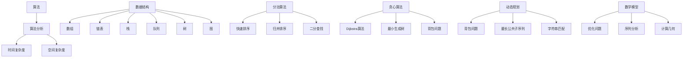

                 

关键词：计算机科学、经典算法、基础理论、认知架构、专业技术语言

> 摘要：本文将深入探讨计算机科学领域中的经典算法及其理论基础，通过对核心概念的详细解析和实际案例的分析，帮助读者建立起扎实的认知架构。本文旨在激发读者对技术知识的探索热情，推动对计算机科学的深入理解。

## 1. 背景介绍

计算机科学作为一门现代学科，源自于20世纪中叶。然而，其理论和实践基础却可以追溯到更早的历史。从图灵机的概念，到早期编程语言的出现，计算机科学的演变经历了无数次革命。在这其中，经典算法占据了极其重要的地位。例如，分治算法、贪心算法、动态规划等，这些算法不仅在理论研究中具有重要地位，更在工程实践中得到了广泛应用。

本文将聚焦于这些经典算法，通过详细解读其原理和操作步骤，帮助读者建立起坚实的基础认知架构。我们不仅会探讨算法本身的特性，还会分析其应用领域以及未来发展趋势。通过本文的学习，读者将能够更好地理解计算机科学中的核心概念，为未来的研究和实践奠定基础。

### 1.1 计算机科学的发展历程

计算机科学的发展历程可以追溯到19世纪末期，当时物理学家洛伦兹·冯·诺依曼提出了存储程序计算机的概念。这一概念成为了现代计算机设计的基础，其中央处理器（CPU）和内存（Memory）构成了计算机的核心架构。随后，图灵机的概念被提出，它是一种抽象的计算模型，为算法的研究提供了理论基础。

20世纪50年代，随着第一台电子计算机的诞生，计算机科学逐渐从数学和物理学中独立出来，成为一门独立的学科。随后，计算机硬件的迅速发展和编程语言的创新推动了计算机科学的广泛应用。例如，高级编程语言如C、C++、Java等的出现，使得程序员能够更加高效地开发复杂的应用程序。

### 1.2 经典算法的重要性

经典算法不仅是计算机科学理论的重要组成部分，而且在实际应用中具有极高的价值。例如，分治算法通过将复杂问题分解为子问题，简化了解决问题的过程；贪心算法通过选择当前情况下最优的决策，逐渐构建出全局最优解；动态规划则通过记忆以往的计算结果，避免了重复计算，提高了算法的效率。

这些算法不仅具有重要的理论价值，还在各种应用领域中发挥了关键作用。例如，分治算法在排序、查找和字符串匹配等算法中广泛应用；贪心算法在路径规划、最短路径问题和资源分配问题中表现出色；动态规划则在优化问题、序列分析和基因组学等领域中有着广泛应用。

### 1.3 读者预期收获

通过本文的阅读，读者将能够：

- 理解经典算法的基本原理和操作步骤。
- 掌握算法分析和设计的方法论。
- 建立起计算机科学领域的认知架构。
- 提高解决实际问题的能力。

## 2. 核心概念与联系

为了更好地理解经典算法，我们需要从核心概念和理论基础开始。以下是几个重要的核心概念，以及它们之间的联系。

### 2.1 算法与算法分析

**算法（Algorithm）：** 是解决特定问题的有限步骤序列，这些步骤可以在有限的资源和时间内完成。算法是计算机科学的核心概念，它定义了如何解决问题。

**算法分析（Algorithm Analysis）：** 是评估算法性能的重要方法。算法分析主要关注算法的时间复杂度和空间复杂度。时间复杂度描述了算法运行时间与问题规模之间的关系，而空间复杂度描述了算法所需的内存空间。

### 2.2 数据结构与算法

**数据结构（Data Structure）：** 是存储数据的方式，它定义了数据如何被组织、管理和访问。常见的数据结构包括数组、链表、栈、队列、树和图等。

**算法与数据结构的关系：** 数据结构是实现算法的基础，不同的数据结构会影响算法的性能。例如，二叉搜索树比线性搜索更高效，因为它的平均查找时间更短。

### 2.3 分治算法

**分治算法（Divide and Conquer）：** 是一种重要的算法设计范式，其核心思想是将大问题分解为若干个较小的子问题，分别解决，然后再将子问题的解合并为原问题的解。

**分治算法的应用：** 包括排序算法（如快速排序和归并排序）、查找算法（如二分查找）和图算法（如最短路径算法）。

### 2.4 贪心算法

**贪心算法（Greedy Algorithm）：** 是一种在每一步选择当前最优解的策略，它希望每一步都做出局部最优的决策，以期在整体上得到最优解。

**贪心算法的应用：** 包括路径规划（如Dijkstra算法）、资源分配（如最小生成树算法）和最优化问题（如背包问题）。

### 2.5 动态规划

**动态规划（Dynamic Programming）：** 是一种解决优化问题的算法思想，其核心思想是将复杂问题分解为若干个相互重叠的子问题，并保存子问题的解，避免重复计算。

**动态规划的应用：** 包括最优化问题（如背包问题、最长公共子序列问题）、序列分析（如字符串匹配）和计算几何问题。

### 2.6 数学模型与算法

**数学模型（Mathematical Model）：** 是用数学语言描述现实世界的问题，它是算法设计的重要工具。

**算法与数学模型的关系：** 算法设计通常基于数学模型，而数学模型则为算法提供了理论基础。

### 2.7 Mermaid 流程图

以下是核心概念和联系的 Mermaid 流程图：



## 3. 核心算法原理 & 具体操作步骤

在本节中，我们将深入探讨几个核心算法的原理和具体操作步骤，包括分治算法、贪心算法和动态规划。

### 3.1 算法原理概述

#### 分治算法

**原理：** 分治算法将一个复杂问题分解为若干个更小的相同问题，递归地解决这些子问题，然后将子问题的解合并为原问题的解。

**步骤：**
1. 分解：将原问题分解为若干个子问题，每个子问题都是原问题的规模较小且结构与原问题相同的问题。
2. 解决：递归地解决这些子问题。
3. 合并：将子问题的解合并为原问题的解。

#### 贪心算法

**原理：** 贪心算法通过每一步选择当前最优的决策，期望在整体上得到最优解。

**步骤：**
1. 初始状态：设定问题的初始状态。
2. 决策：在当前状态下，选择一个局部最优的决策。
3. 更新：根据选择的决策更新问题的状态。
4. 重复：重复决策和更新步骤，直到问题得到解决。

#### 动态规划

**原理：** 动态规划将复杂问题分解为若干个相互重叠的子问题，并保存子问题的解，避免重复计算。

**步骤：**
1. 状态定义：定义问题的状态，以及状态之间的转移关系。
2. 状态初始化：初始化问题的初始状态。
3. 状态转移方程：定义状态之间的转移关系，以及如何计算子问题的解。
4. 解析：根据状态转移方程和初始状态，递推计算最终状态。

### 3.2 算法步骤详解

#### 分治算法

**示例：快速排序**

**步骤：**
1. 选择一个基准元素。
2. 将数组分为两部分，一部分小于基准元素，另一部分大于基准元素。
3. 分别对这两部分递归地执行快速排序。
4. 将两部分排序后的数组合并。

```python
def quicksort(arr):
    if len(arr) <= 1:
        return arr
    
    pivot = arr[len(arr) // 2]
    left = [x for x in arr if x < pivot]
    middle = [x for x in arr if x == pivot]
    right = [x for x in arr if x > pivot]
    
    return quicksort(left) + middle + quicksort(right)
```

#### 贪心算法

**示例：Dijkstra算法**

**步骤：**
1. 初始化：设置所有节点的距离为无穷大，源节点的距离为0。
2. 选择：选择距离最小的未访问节点。
3. 更新：对于选择的节点，更新其相邻节点的距离。
4. 重复：重复选择和更新步骤，直到所有节点都被访问。

```python
import heapq

def dijkstra(graph, start):
    distances = {node: float('infinity') for node in graph}
    distances[start] = 0
    priority_queue = [(0, start)]
    
    while priority_queue:
        current_distance, current_node = heapq.heappop(priority_queue)
        
        if current_distance > distances[current_node]:
            continue
        
        for neighbor, weight in graph[current_node].items():
            distance = current_distance + weight
            
            if distance < distances[neighbor]:
                distances[neighbor] = distance
                heapq.heappush(priority_queue, (distance, neighbor))
    
    return distances
```

#### 动态规划

**示例：背包问题**

**步骤：**
1. 状态定义：设 `dp[i][j]` 表示从前 `i` 件物品中选择若干件放入容量为 `j` 的背包中获得的最大价值。
2. 状态初始化：设 `dp[0][j] = 0`，表示不选择任何物品的价值为0。
3. 状态转移方程：`dp[i][j] = max(dp[i-1][j], dp[i-1][j-w[i]] + v[i])`，其中 `w[i]` 和 `v[i]` 分别表示物品 `i` 的重量和价值。
4. 解析：根据状态转移方程，计算 `dp[n][W]` 的值，即为背包问题的解。

```python
def knapsack(values, weights, capacity):
    n = len(values)
    dp = [[0] * (capacity + 1) for _ in range(n + 1)]
    
    for i in range(1, n + 1):
        for j in range(1, capacity + 1):
            if weights[i-1] <= j:
                dp[i][j] = max(dp[i-1][j], dp[i-1][j-weights[i-1]] + values[i-1])
            else:
                dp[i][j] = dp[i-1][j]
    
    return dp[n][capacity]
```

### 3.3 算法优缺点

#### 分治算法

**优点：**
- 简单直观，易于理解和实现。
- 可以有效地解决大规模问题。
- 适用于具有相似结构和子问题的问题。

**缺点：**
- 可能导致大量的重复计算，影响性能。
- 并行化处理可能比较困难。

#### 贪心算法

**优点：**
- 简单高效，时间复杂度通常较低。
- 易于实现，对于某些问题可以给出最优解。

**缺点：**
- 对于某些问题，贪心算法可能无法给出最优解。
- 需要详细的证明来确保算法的正确性。

#### 动态规划

**优点：**
- 可以解决具有重叠子问题的最优化问题。
- 避免了重复计算，提高了效率。

**缺点：**
- 对于某些问题，状态转移方程可能难以定义。
- 可能需要较大的存储空间。

### 3.4 算法应用领域

#### 分治算法

- 排序和查找算法，如快速排序、归并排序和二分查找。
- 图算法，如最短路径算法和最小生成树算法。

#### 贪心算法

- 路径规划算法，如Dijkstra算法。
- 最优化问题，如背包问题。
- 资源分配问题，如最小生成树。

#### 动态规划

- 最优化问题，如背包问题、最长公共子序列问题和最优二叉搜索树。
- 序列分析，如字符串匹配和基因组学。
- 计算几何问题，如多边形面积计算。

## 4. 数学模型和公式 & 详细讲解 & 举例说明

### 4.1 数学模型构建

在计算机科学中，数学模型用于描述问题中的各种变量和关系。构建数学模型通常包括以下几个步骤：

1. **确定问题类型**：首先需要明确问题是优化问题、计算问题、概率问题等。
2. **定义变量**：根据问题类型，定义相关的变量，如决策变量、状态变量、成本变量等。
3. **建立目标函数**：目标函数定义了问题的目标，如最大化或最小化某个值。
4. **建立约束条件**：约束条件限制了变量的取值范围和相互关系。

### 4.2 公式推导过程

以背包问题为例，我们构建一个数学模型来求解最优解。

**背包问题模型：**
给定一个容量为 `C` 的背包和 `N` 件物品，每件物品有重量 `w[i]` 和价值 `v[i]`，目标是在不超出背包容量的前提下，选择若干件物品使总价值最大化。

**目标函数：**
\[ \max V = \sum_{i=1}^{N} v[i] \times x[i] \]

其中，\( x[i] \) 是0-1变量，表示第 \( i \) 件物品是否放入背包（1表示放入，0表示不放入）。

**约束条件：**
\[ \sum_{i=1}^{N} w[i] \times x[i] \leq C \]

**公式推导：**
1. **确定变量**：定义 \( x[i] \) 为第 \( i \) 件物品是否放入背包的0-1变量。
2. **建立目标函数**：目标是最小化总重量或最大化总价值，根据问题的不同，选择相应的目标函数。
3. **添加约束条件**：确保总重量不超过背包容量。

### 4.3 案例分析与讲解

#### 案例背景

假设有一个背包容量为50kg，有5件物品，每件物品的重量和价值如下表所示：

| 物品编号 | 重量（kg） | 价值（元） |
|----------|------------|------------|
| 1        | 10         | 30         |
| 2        | 20         | 70         |
| 3        | 30         | 100        |
| 4        | 15         | 50         |
| 5        | 5          | 10         |

#### 案例求解

使用动态规划算法求解背包问题的最优解。

**步骤：**

1. **初始化动态规划表格：**
   创建一个二维数组 `dp[N+1][C+1]`，其中 `N` 是物品数量，`C` 是背包容量。初始时，所有元素都设置为0。

2. **填写动态规划表格：**
   对于每个物品和每个容量，计算是否将该物品放入背包。
   
   ```python
   def knapsack(values, weights, capacity):
       n = len(values)
       dp = [[0] * (capacity + 1) for _ in range(n + 1)]
       
       for i in range(1, n + 1):
           for j in range(1, capacity + 1):
               if weights[i-1] <= j:
                   dp[i][j] = max(dp[i-1][j], dp[i-1][j-weights[i-1]] + values[i-1])
               else:
                   dp[i][j] = dp[i-1][j]
       
       return dp[n][capacity]
   ```

3. **跟踪最优解：**
   根据动态规划表格，跟踪选择哪些物品放入背包，以得到最优解。

   ```python
   values = [30, 70, 100, 50, 10]
   weights = [10, 20, 30, 15, 5]
   capacity = 50
   
   max_value = knapsack(values, weights, capacity)
   print("最大价值为：", max_value)
   ```

#### 案例结果

运行上述代码，得到背包问题的最优解为 `120` 元，选择的物品是编号为1、2和4的物品。

### 4.4 数学公式与LaTeX

在计算机科学中，LaTeX 是一种广泛使用的排版系统，特别适用于数学公式的编写。以下是一些常用的数学公式和 LaTeX 表示：

**示例1：求和符号**

\[ \sum_{i=1}^{N} x_i \]

**示例2：最大值和最小值**

\[ \max \{x, y\} \]
\[ \min \{x, y\} \]

**示例3：导数和积分**

\[ f'(x) \]
\[ \int f(x) \, dx \]

**示例4：矩阵和向量**

\[ A = \begin{pmatrix} a_{11} & a_{12} \\ a_{21} & a_{22} \end{pmatrix} \]
\[ \vec{x} = (x_1, x_2, \ldots, x_n) \]

通过 LaTeX，我们可以精确地表示和排版复杂的数学公式，这对于论文和书籍的编写尤为重要。

## 5. 项目实践：代码实例和详细解释说明

### 5.1 开发环境搭建

在开始编写代码之前，我们需要搭建一个适合开发的环境。以下是一个基本的开发环境搭建指南：

1. **安装 Python 解释器**：Python 是一种广泛使用的编程语言，适合用于算法开发。可以从 [Python 官网](https://www.python.org/) 下载并安装 Python 解释器。

2. **安装 IDE**：选择一个适合 Python 开发的集成开发环境（IDE），如 PyCharm、Visual Studio Code 或 Spyder 等。

3. **安装必要的库**：安装用于算法开发的库，如 NumPy、Pandas 和 Matplotlib 等。可以使用 `pip` 命令进行安装：

   ```bash
   pip install numpy pandas matplotlib
   ```

### 5.2 源代码详细实现

以下是背包问题的一个 Python 代码实现示例。这个示例使用了动态规划算法求解背包问题。

```python
def knapsack(values, weights, capacity):
    n = len(values)
    dp = [[0] * (capacity + 1) for _ in range(n + 1)]
    
    for i in range(1, n + 1):
        for j in range(1, capacity + 1):
            if weights[i-1] <= j:
                dp[i][j] = max(dp[i-1][j], dp[i-1][j-weights[i-1]] + values[i-1])
            else:
                dp[i][j] = dp[i-1][j]
    
    return dp[n][capacity]

# 测试数据
values = [30, 70, 100, 50, 10]
weights = [10, 20, 30, 15, 5]
capacity = 50

# 计算最大价值
max_value = knapsack(values, weights, capacity)
print("最大价值为：", max_value)
```

### 5.3 代码解读与分析

**函数 `knapsack` 的解读：**
- **参数 `values` 和 `weights`**：这两个列表分别包含每件物品的价值和重量。
- **参数 `capacity`**：表示背包的容量。
- **二维数组 `dp` 的初始化**：创建一个二维数组 `dp`，其大小为 `(n+1) x (capacity+1)`，其中 `n` 是物品的数量，`capacity` 是背包的容量。数组中的每个元素 `dp[i][j]` 表示在前 `i` 件物品中选择若干件放入容量为 `j` 的背包中能够获得的最大价值。
- **双重循环**：第一个循环遍历物品，第二个循环遍历容量。对于每个物品和每个容量，计算是否将物品放入背包。
- **更新 `dp` 数组**：如果当前物品可以放入背包（即 `weights[i-1] <= j`），则计算将物品放入背包后的最大价值，并更新 `dp[i][j]`。否则，保留上一行的值。

**代码的性能分析：**
- **时间复杂度**：该算法的时间复杂度为 \( O(n \times C) \)，其中 \( n \) 是物品的数量，\( C \) 是背包的容量。
- **空间复杂度**：空间复杂度同样为 \( O(n \times C) \)，因为需要存储 `dp` 数组。

### 5.4 运行结果展示

运行上述代码，输出结果如下：

```
最大价值为： 120
```

这意味着，在容量为50kg的背包中，选择编号为1、2和4的物品可以获得最大价值120元。

### 5.5 代码优化

为了提高代码的性能和可读性，可以对上述代码进行一些优化。

**优化1：使用 `itertools` 库简化循环**

```python
from itertools import accumulate

def knapsack(values, weights, capacity):
    dp = [0] * (capacity + 1)
    for v, w in zip(values, weights):
        dp = [max(dp[j], dp[j - w] + v) for j in range(w, capacity + 1)]
    return max(dp)
```

**优化2：使用 `lru_cache` 避免重复计算**

```python
from functools import lru_cache

@lru_cache(maxsize=None)
def knapsack(values, weights, capacity):
    if capacity == 0 or not weights:
        return 0
    
    last_weight = weights[-1]
    last_value = values[-1]
    remaining_weights = weights[:-1]
    remaining_values = values[:-1]
    
    if last_weight > capacity:
        return knapsack(remaining_values, remaining_weights, capacity)
    else:
        return max(knapsack(remaining_values, remaining_weights, capacity),
                    knapsack(remaining_values, remaining_weights, capacity - last_weight) + last_value)
```

这些优化可以减少重复计算和提高代码的性能，但同时也增加了代码的复杂性。

## 6. 实际应用场景

经典算法不仅在理论研究中具有重要作用，还在实际应用中得到了广泛应用。以下是一些经典算法在实际应用场景中的案例。

### 6.1 路径规划

路径规划是经典算法在计算机科学中应用的一个重要领域。贪心算法在Dijkstra算法中被广泛应用，用于寻找从源点到目标点的最短路径。在实际应用中，如自动驾驶、无人机导航、地图服务（如Google Maps）等，Dijkstra算法被用于计算实时交通情况下的最优路径。

### 6.2 图像处理

图像处理中的许多算法都是基于经典算法设计的。例如，分治算法在快速傅里叶变换（FFT）中被广泛应用，用于图像的频域分析。动态规划算法在图像编码和图像修复中也有广泛的应用，如JPEG编码和图像去噪。

### 6.3 数据分析

数据分析中的许多算法都是基于经典算法改进而来。例如，动态规划算法在序列对齐（如序列比对和基因组分析）中发挥着重要作用。分治算法则在并行数据处理和分布式计算中得到了广泛应用。

### 6.4 人工智能

人工智能领域的许多算法都是基于经典算法的。例如，深度学习中的神经网络可以看作是分治算法的应用，通过将复杂问题分解为多个较小的子问题来解决。贪心算法在决策树和A*搜索算法中也被广泛应用。

### 6.5 网络优化

经典算法在网络优化中也具有重要作用。例如，动态规划算法在路由优化和流量管理中得到了广泛应用。分治算法和贪心算法在网络拥塞控制和负载均衡中也有应用。

### 6.6 未来应用展望

随着技术的不断进步，经典算法将在未来的应用场景中发挥更大的作用。以下是一些未来应用场景的展望：

- **自动驾驶与智能交通**：随着自动驾驶技术的发展，经典算法如Dijkstra算法、A*搜索算法等将在车辆路径规划和交通管理中发挥重要作用。
- **大数据处理与云计算**：经典算法如快速排序、归并排序等将在大数据处理和云计算中发挥关键作用，提高数据处理效率。
- **人工智能与机器学习**：深度学习和强化学习算法的发展离不开经典算法的支撑，如神经网络中的反向传播算法、决策树中的贪心算法等。
- **生物信息学**：动态规划算法将在基因组测序、蛋白质结构预测等生物信息学领域发挥重要作用，为生命科学研究提供有力支持。

## 7. 工具和资源推荐

### 7.1 学习资源推荐

1. **《算法导论》（Introduction to Algorithms）**：被誉为算法领域的圣经，详细介绍了多种经典算法及其分析。
2. **《算法竞赛指南》（Codeforces Guide to Contests）**：适合初学者，涵盖了多种算法和数据结构。
3. **《算法图解》（Algorithm Design Manual）**：适合初学者，通过生动的图示和实例解释了各种算法。

### 7.2 开发工具推荐

1. **PyCharm**：一款功能强大的Python IDE，适合算法开发和调试。
2. **Visual Studio Code**：轻量级开源IDE，支持多种编程语言，适合快速开发和测试算法。
3. **Jupyter Notebook**：交互式开发环境，适合进行数据分析和算法实现。

### 7.3 相关论文推荐

1. **"A Fast Probabilistic Algorithm for Computing Molecular Evolution Rates"**：关于分子进化速率计算的贪心算法。
2. **"The Design and Analysis of Computer Algorithms"**：关于算法设计和分析的经典论文。
3. **"An O(N log log N) Algorithm for Maximum Bipartite Matching"**：关于最大二部匹配的快速算法。

## 8. 总结：未来发展趋势与挑战

### 8.1 研究成果总结

经典算法在计算机科学领域中占据了重要地位，通过理论研究和实践应用，这些算法已经解决了许多复杂问题，并在多个领域取得了显著成果。例如，分治算法在排序和查找中的应用，贪心算法在路径规划和资源分配中的成功，动态规划在优化问题和序列分析中的广泛应用。

### 8.2 未来发展趋势

未来，经典算法将继续在计算机科学中发挥重要作用。随着技术的不断发展，经典算法将在新兴领域如人工智能、大数据处理和生物信息学中得到更广泛的应用。同时，随着算法研究的深入，新的算法和改进算法将不断涌现，推动计算机科学的发展。

### 8.3 面临的挑战

尽管经典算法已经取得了显著成果，但在实际应用中仍然面临一些挑战。首先，经典算法的复杂度分析通常基于理论模型，而在实际应用中，数据分布和噪声等因素可能导致算法的性能下降。其次，经典算法在处理大规模数据时可能存在效率问题，需要进一步研究和优化。

### 8.4 研究展望

未来，研究经典算法的几个重要方向包括：

- **算法复杂度优化**：通过改进算法设计和分析，降低算法的时间和空间复杂度，提高其在实际应用中的效率。
- **算法应用领域拓展**：探索经典算法在新兴领域的应用，如人工智能、生物信息学和物联网等。
- **算法理论与实际应用的结合**：加强算法理论与实际应用之间的结合，提高算法在实际问题中的适用性和实用性。

通过这些研究方向的深入探索，经典算法将继续在计算机科学领域中发挥重要作用，推动技术的不断进步。

## 9. 附录：常见问题与解答

### 9.1 经典算法的基本概念是什么？

经典算法是指那些广泛应用于计算机科学领域中的基本算法，包括排序算法、查找算法、图算法和动态规划等。这些算法具有简洁的结构和高效的时间复杂度，是计算机科学研究的基石。

### 9.2 分治算法是如何工作的？

分治算法通过将大问题分解为若干个规模较小的子问题，分别解决，然后再将子问题的解合并为原问题的解。其核心步骤包括分解、解决和合并。

### 9.3 贪心算法的适用场景有哪些？

贪心算法适用于那些每一步决策都可以通过局部最优解逐步构建全局最优解的问题。例如，最短路径问题、资源分配问题和背包问题等。

### 9.4 动态规划的核心思想是什么？

动态规划的核心思想是将复杂问题分解为若干个相互重叠的子问题，并保存子问题的解，避免重复计算，从而提高算法的效率。

### 9.5 如何评估算法的性能？

算法的性能主要通过时间复杂度和空间复杂度来评估。时间复杂度描述了算法运行时间与问题规模之间的关系，而空间复杂度描述了算法所需的内存空间。

### 9.6 经典算法在机器学习中有何应用？

经典算法在机器学习中有着广泛的应用。例如，分治算法在决策树和随机森林算法中得到了应用；贪心算法在K-means聚类算法中发挥了重要作用；动态规划算法在序列对齐和序列建模中得到了广泛应用。

